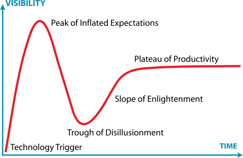
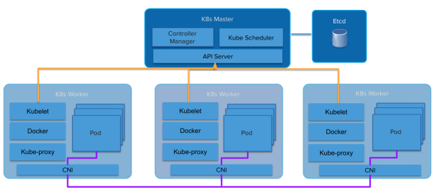
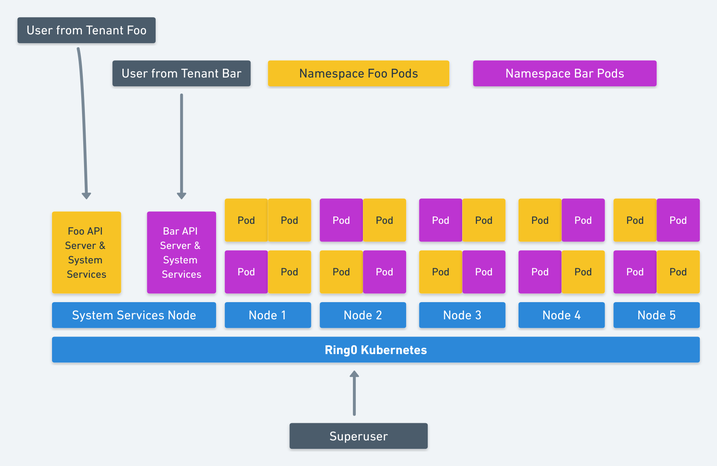
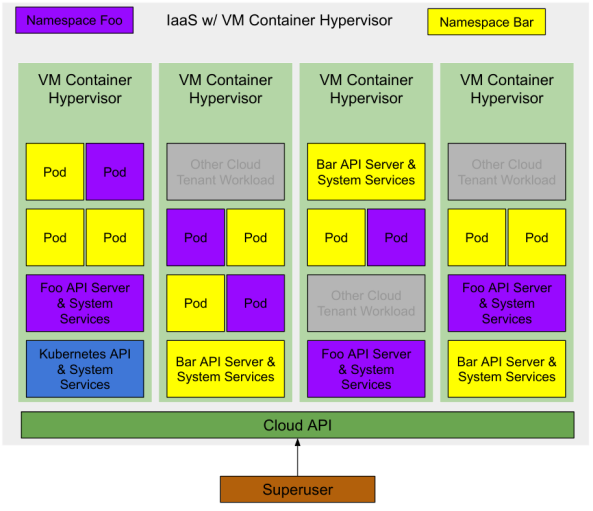

Будущее Kubernetes — за виртуальными машинами

**Гадания на кофейной гуще**

В моей работе Kubernetes уже сыграл важную роль, а в будущем она станет ещё важнее. Но 2018 год подходит к концу, так что забудем о скромности и сделаем смелый прогноз:

> **Будущее Kubernetes — это виртуальные машины, а не контейнеры**

По китайскому гороскопу 2018 год был годом собаки, но в технике это был год Kubernetes. Многие только сейчас узнают об этой революционной технологии, а IT-отделы повсеместно пытаются разработать «стратегию Kubernetes» \[1\]. Некоторые организации уже перевели на Kubernetes большие рабочие нагрузки.

_\[1\] Если вы пытаетесь разработать стратегию Kubernetes, вы уже потерпели неудачу, но это тема для другой статьи._  
  
Другими словами, на каждом этапе «цикла шумихи Gartner» для Kubernetes много людей. Некоторые застряли во впадине разочарования или утонули в яме отчаяния.

  
_Jeremykemp, [Википедия](https://commons.wikimedia.org/wiki/File:Gartner_Hype_Cycle.svg). [Creative Commons CC BY-SA 3.0](https://creativecommons.org/licenses/by-sa/3.0)_

Я большой фанат контейнеров и не буду говорить, что [контейнеры мертвы](https://chrisshort.net/docker-inc-is-dead/). Docker в 2013 году дал нам оболочку для Linux Containers: удивительный новый способ создания, упаковки, совместного использования и развёртывания приложений. Он появился в нужное время, так как мы стали серьёзно относиться к непрерывной доставке. Их модель стала идеальной для цепочки доставки и способствовала появлению платформы PaaS, а затем CaaS.

Инженеры из Google увидели, что IT-сообщество наконец-то готово к контейнерам. Google очень давно использует контейнеры и в каком-то смысле их можно считать изобретателями контейнеризации. Они начали разрабатывать Kubernetes. Как сейчас известно, это свободная реинкарнация собственной платформы Borg от Google.

Вскоре поддержку Kubernetes обеспечили все большие облака (GKE, AKS, EKS). Сервисы On-premise тоже быстро подняли платформы на основе Kubernetes (Pivotal Container Service, Openshift и др.).

Нужно было решить одну назойливую проблему, которую можно считать недостатком контейнеров… это мультиарендность (multi-tenancy).

Контейнеры Linux не создавались как безопасные изолированные среды (вроде Solaris Zones или FreeBSD Jails). Вместо этого они строились на общей модели ядра, которая использует функции ядра для обеспечения базовой изоляции процессов. Как сказала бы [Джесси Фразель](https://blog.jessfraz.com/post/containers-zones-jails-vms/), «контейнеры — это не настоящая вещь».

Это усугубляется фактом, что большинство компонентов Kubernetes не осведомлены об «арендаторах» (tenant). Конечно, у вас есть [пространства имён](https://kubernetes.io/docs/concepts/overview/working-with-objects/namespaces/) и [политики безопасности Pod](https://kubernetes.io/docs/concepts/policy/pod-security-policy/), но в API нет такого понятия. Также как во внутренних компонентах, таких как `kubelet` или `kube-proxy`. Это приводит к тому, что в Kubernetes реализована модель «мягкой аренды» (soft tenancy).

  
_Архитектура Kubernetes_

Абстракции просачиваются дальше. Платформа поверх контейнеров наследует многие аспекты мягкой аренды. Платформы поверх виртуальных машин с жёсткой мультиарендой наследуют эту жёсткую аренду (VMware, Amazon Web Services, OpenStack и т. д.).

Модель мягкой аренды Kubernetes ставит поставщиков услуг и дистрибутивов в странное положение. Сам кластер Kubernetes становится линией «жёсткой аренды». Даже внутри одной организации есть много причин требовать жёсткой аренды между пользователями (или приложениями). Поскольку общедоступные облака предоставляют в качестве сервиса полностью управляемые Kubernetes, клиентам достаточно легко взять свой собственный кластер и использовать границу кластера в качестве точки изоляции.

Некоторые дистрибутивы Kubernetes, такие как [Pivotal Container Service (PKS)](https://pivotal.io/platform/pivotal-container-service), хорошо знают об этой [проблеме аренды](https://content.pivotal.io/youtube-uberflip/kubernetes-one-cluster-or-many-3) и используют аналогичную модель, предоставляя те же самые Kubernetes в качестве службы, которую можно получить из общедоступного облака, но в собственном центре обработки данных.

Это привело к появлению модели «много кластеров», вместо «одного большого общего кластера». Нередко у клиентов сервиса GKE от Google десятки кластеров Kubernetes, развёрнутых для нескольких команд. Часто каждый разработчик получает свой кластер. Такое поведение порождает шокирующее количество инстансов (Kubesprawl).

Как вариант, операторы поднимают собственные кластеры Kubernetes в собственных центрах обработки данных, чтобы взять на себя дополнительную работу по управлению множеством кластеров, или соглашаются на мягкую аренду одного или двух больших кластеров.

Обычо самый маленький кластер — это четыре машины (или виртуальные машины). Один (или три для HA) для Kubernetes Master, три для Kubernetes Workers. Куча денег тратится на системы, которые по большей части сидят без дела.

Поэтому нужно как-то двигать Kubernetes в сторону жёсткой мультиаренды. Сообщество Kubernetes прекрасно осознаёт эту необходимость. Уже образована [рабочая группа по мультиаренде](https://groups.google.com/forum/#!forum/kubernetes-wg-multitenancy). Она напряжённо работает над этой проблемой, и у них есть несколько моделей и предложений, как работать с каждой моделью.

Джесси Фразель написала на эту тему [пост в блоге](https://blog.jessfraz.com/post/hard-multi-tenancy-in-kubernetes/), и это здорово, потому что она намного умнее меня, так что могу сослаться на неё и спасти себя от десяти лет напряжённой учёбы, пытаясь достичь её уровня. Если вы не читали тот пост, почитайте прямо сейчас.

  

> Контейнеры Kata — это проект с открытым исходным кодом и сообщество, работающее над созданием стандартной реализации облегчённых виртуальных машин, которые выглядят и работают как контейнеры, но обеспечивают изоляцию рабочей нагрузки и преимущества безопасности VM.

Джесси предлагает использовать технологию контейнеров VM, такую как [контейнеры Kata](https://katacontainers.io/). Они предлагают изоляцию уровня VM, но работают как контейнеры. Это позволяет Kubernetes дать каждому «арендатору» (мы предполагаем арендатора в пространстве имён) свой набор системных служб Kubernetes, работающих во вложенных контейнерах VM (контейнер VM внутри виртуальной машины, которую предоставляет инфраструктура IaaS).

  
_Изображение Джесси Фрейзеля: жёсткая мультиарендность в Kubernetes_

Это элегантное решение мультиаренды Kubernetes. Её предложение идёт ещё дальше, чтобы Kubernetes использовал вложенные контейнеры VM для рабочих нагрузок (Pod), работающих на Kubernetes, что обеспечивает значительное увеличение использования ресурсов.

У нас осталась ещё как минимум одна оптимизация. Создадим подходящий гипервизор для базового поставщика инфраструктуры или облачного провайдера. Если VM-контейнер является абстракцией первого уровня, предоставляемой IaaS, то мы ещё больше увеличим использование ресурсов. Минимальное количество VM для запуска кластера Kubernetes сокращается до одной машины (или трёх для HA), чтобы разместить систему управления Kubernetes, доступную для «суперпользователя».

Развёртывание Kubernetes с двумя пространствами имён и несколькими запущенными приложениями будет выглядеть примерно так:

> Примечание: на той же инфраструктуре IaaS есть и другие нагрузки. Поскольку это VM-контейнеры, у них такой же уровень изоляции, как у обычных облачных VM. Поэтому они могут работать на одном гипервизоре с минимальным риском.

Изначально в облаке не разворачивается никакой инфраструктуры, поэтому для суперпользователя затраты равны нулю.

Суперпользователь запрашивает из облака кластер Kubernetes. Поставщик облачных услуг создаёт виртуальную машину с одним контейнером (или тремя для HA), на которой работают основные API и системные службы Kubernetes. Суперпользователь может развернуть модули в системном пространстве имён или создать новые пространства для делегирования доступа другим пользователям.

Суперпользователь создаёт два пространства имен `foo` и `bar`. Kubernetes запрашивает из облака два VM-контейнера для каждого уровня управления пространством имён (Kubernetes API и System Services). Суперпользователь делегирует некоторым пользователям доступ к этим пространствам имён, каждый из них запускает некоторые рабочие нагрузки (модули), а соответствующие уровни управления запрашивают VM-контейнеры для этих рабочих нагрузок.

На всех этапах суперпользователь платит только за фактически потреблённые ресурсы. Поставщик облачных услуг контролирует эти ресурсы, и они доступны любому пользователю облака.

Поставщики облачных услуг уже работают в этом направлении. Можете убедиться в этом, наблюдая за событиями в сообществах (возможно, Amazon уже втихую сделал это с Fargate).

Первая наводка — [Virtual Kubelet](https://github.com/virtual-kubelet/virtual-kubelet), инструмент с открытым исходным кодом, предназначенный для маскировки под kubelet. Он соединяет Kubernetes с другими API, что позволяет Kubernetes запрашивать VM-контейнеры из стандартного планировщика в облаке.

Другие наводки — большое количество новых технологий для VM-контейнеризации, как уже упомянутые контейнеры Kata, а также [Firecracker](https://aws.amazon.com/blogs/opensource/firecracker-open-source-secure-fast-microvm-serverless/) от Amazon и [gvisor](https://github.com/google/gvisor) от Google.

Если грамотно реализовать улучшения в модели жёсткой аренды, то вы найдёте чашу святого Грааля виртуализации Kubernetes. Полная изоляция рабочих нагрузок и никаких лишних затрат.

Если не пользоваться публичным облаком, вы всё равно получаетете преимущества более высокого использования ресурсов, что окупается более низкими требованиями к аппаратному обеспечению.

Будем надеяться, что VMware и OpenStack обратят внимание и выпустят гипервизоры на основе легковесных VM-контейнеров и соответствующих реализаций Virtual Kubelet.