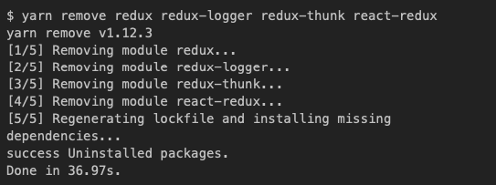
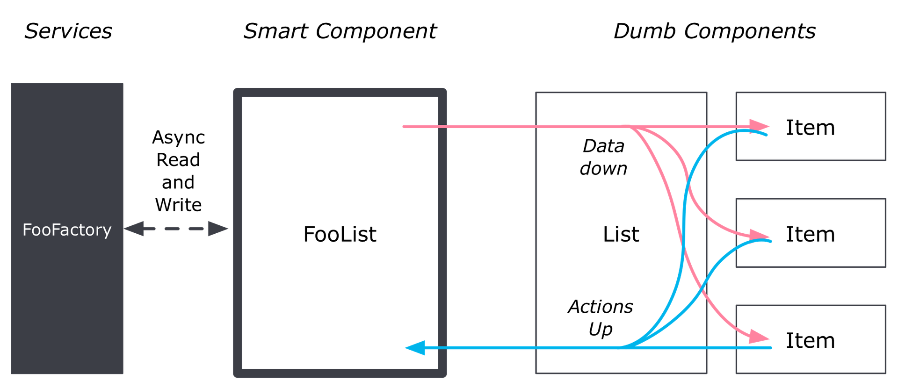
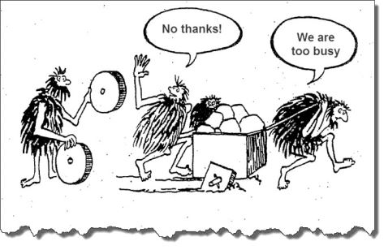
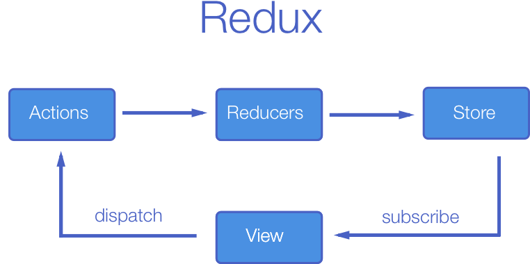
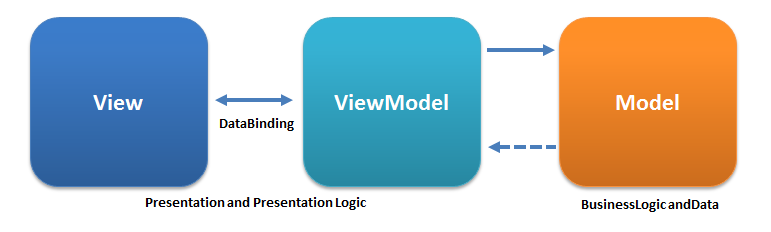

Вам не нужен Redux

Очередная статья, которая, возможно, так и останется в черновиках, но если вы это читаете, то все-таки это свершилось.

К написанию статьи послужил опыт с `Redux`, потому что повестись на хайп было опрометчивым решением. Благо, архитектура приложения позволяла его выпилить безболезненно. =)

Долгое время и огромное количество человек я расспрашивал про то, как они используют `Redux` и всегда удивлялся. Почему-то эта опьяняющая очевидность ко мне пришла далеко спустя время, хотя я имею опыт в написании приложений под `Android`, где никакого `Redux` нет и все живы, и здоровы.

Вся проблема в том, что никто не объясняет зачем нужен и когда нужен `Redux`, пока ты не наступил на эти грабли спустя время. К примеру, в нашем проекте `Redux` оправдывает себя только в нескольких местах, остальное можно реализовать тупо на `Dump & Smart Components`. И в тех самых местах, где он оправдан, я бы также его убрал и использовал события. Если в приложении мало сепаратных частей, которые друг на друге могли бы быть зависимы, то это маловыгодная вещь. Отсюда и появляются всякие оптимизационные костыли (`reselect`, например). Но люди, почему-то, ссут подумать своей головой. И сейчас я вам поведаю сказ о том, как жить без `Redux`.

## Моделирование ситуации

Я не буду далеко ходить и возьму самую простую ситуацию, которую можно легко понять и быстро реализовать. Эта ситуация, когда мы имеем два сепаратных компонента, где изменение в одном компоненте должно затрагивать изменение второго. Например, счетчик количества товара в корзине (первый компонент `CartInfo`) и список товаров в таблице (второй компонент `Cart`). Дабы уменьшить код и не писать компонент списка товаров я предлагаю просто реализовать в одном месте отображение количества, а во втором кнопку инкремента. Схематично это должно выглядеть так:

Т.е. мы видим, что компоненты между собой никак не связаны. Поэтому, как-то по воздуху или телепатическими способностями нужно поделиться с ними (между ними) информацией. `Redux` предлагает "простое" решение — это, использовать `Flux-архитектуру`. И она вполне работает, пока приложение не разрослось.

  

> Я не рассматриваю здесь никакие примеры, вроде работы с формами или сложная бизнес-логика, чтобы, как говорят, "ощутить преимущества без Redux", просто потому, что без Redux это и так ощутимо, весь геморой начинается с ним. Если у вас есть возможность не использовать Redux — не используйте. Мысли по этому поводу можно еще подчерпнуть [здесь](https://habr.com/post/350850/).

  

## Реализация компонентов

Давайте напишем stateless-компоненты, т.е. слой вида, который будет использоваться в каждом из примеров.

Компонент `Cart`:

  

    
    
    import React, { Component } from "react";
    
    class Cart extends Component {
      render() {
        return (
          <button type="button" onClick={this.props.onIncQnt}>Increment</button>
        );
      }
    }
    
    export default Cart;

Компонент `CartInfo`:

  

    
    
    import React, { Component, Fragment } from "react";
    
    class CartInfo extends Component {
      render() {
        return (
          <Fragment>Quantity: {this.props.qnt}</Fragment>
        );
      }
    }
    
    export default CartInfo;

Впихиваем в точку входа:

  

    
    
    import React, { PureComponent } from "react";
    import ReactDOM from "react-dom";
    import Cart from "./components/cart";
    import CartInfo from "./components/cart-info";
    
    class App extends PureComponent {
      render() {
        return (
          

            <CartInfo
              qnt={0}
            /> <Cart
              onIncQnt={() => {}}
            />
          

        );
      }
    }
    
    ReactDOM.render(<App />, document.getElementById("root"));

На этом общий код закончился. Далее я буду рассматривать три варианта реализации.

  

## Вариант первый. Smart & Dumb Components

Демо и исходный код:

  

*   Без API — [https://codesandbox.io/s/3r25l0pmm6](https://codesandbox.io/s/3r25l0pmm6)
*   С API — [https://codesandbox.io/s/qvql6w1mr6](https://codesandbox.io/s/qvql6w1mr6)

Самое простое и быстрое решение — разбить код на две составляющие: stateless-компоненты (dumb) и stateful-компоненты (smart). Вроде, что может быть проще? Если нет никакой сложной бизнес-логики (а чаще всего оно так и есть), то решение идеальное. И хочу заметить, что это основополагающий подход, который будет с вами от и до независимо от того, что вы используете: `Redux`, `MobX` или что-то другое. Это, пожалуй, самое первое, что нужно изучить. Более подробно можно подчерпнуть [здесь](https://medium.com/@dan_abramov/smart-and-dumb-components-7ca2f9a7c7d0).

Принцип работы:

Эта не самая простая схема принципа работы, но единственная в интернете, которая отражает реальность вещей (самому рисовать мне лень. =)). Что мы на ней видим? Если закрыть глаза на слово "component", то это MVVM (речь о котором пойдет в третьем варианте). Это, конечно, "грязный" MVVM, но тем не менее: `Smart-компонент` работает за `ViewModel`, `Services` за `Model`, а `dumb-компонент` работает за `View`. Что может быть проще? В этом и суть. Если в приложении не будет сложной бизнес логики, то все приложение можно пилить по этому принципу, если будет, то в тех местах просто используем "не грязный" MVVM (см. третий вариант).

И так, нам нужно нажать на кнопку и чтобы во втором компоненте изменялось количество. Добавим `CartPage` контейнер (smart/stateful-компонент), который и будет связывать наши два компонента (dumb/stateless-компоненты):

  

    
    
    import React, { Component } from "react";
    import Cart from "./../components/cart";
    import CartInfo from "./../components/cart-info";
    
    class CartPage extends Component {
      constructor(props) {
        super(props);
    
        this.state = {
          qnt: 0
        };
      }
    
      render() {
        return (
          

            <CartInfo qnt={this.state.qnt} />{" "}
            <Cart onIncQnt={this._onIncQnt.bind(this)} />
          

        );
      }
    
      _onIncQnt() {
        this.setState(state => ({ qnt: state.qnt + 1 }));
      }
    }
    
    export default CartPage;

Что здесь произошло: мы определили обработчик события для нашей кнопки, который увеличивает счетчик и передали показания счетчика и сам обработчик в наши компоненты. За счет того, что `CartPage` имеет приоритет выше, чем наши компоненты, мы смогли добиться взаимодействия между ними (компонентами).

А наша точка входа `App` изменится следующим образом:

  

    
    
    import React, { PureComponent } from "react";
    import ReactDOM from "react-dom";
    import CartPage from "./containers/cart-page";
    
    class App extends PureComponent {
      render() {
        return (
          

            <CartPage />
          

        );
      }
    }
    
    ReactDOM.render(<App />, document.getElementById("root"));

Таким простым способом мы смогли подружить два совершенно отдельных компонента и добились разделения ответственности, что послужит нам хорошую службу в будущем: как в тестировании, так и в расширении.

Хорошо, — скажете вы, — а как насчет запросов к API? Где они должны быть? Здесь все еще проще. Опять же, все упирается в архитектуру: запросы к API — это, совсем другая ответственность, а следовательно, нам нужно их где-то разместить. Для этого существуют [репозитории](https://ru.wikipedia.org/wiki/%D0%A0%D0%B5%D0%BF%D0%BE%D0%B7%D0%B8%D1%82%D0%BE%D1%80%D0%B8%D0%B9).

Добавим репозиторий `cart`:

  

    
    
    let fakeServerState = {
      qnt: 0
    };
    
    export default {
      getQnt,
      incQnt
    };
    
    export function getQnt() {
      return new Promise((resolve, reject) => {
        setTimeout(() => {
          resolve(fakeServerState.qnt);
        }, 1000);
      });
    }
    
    export function incQnt() {
      return new Promise((resolve, reject) => {
        setTimeout(() => {
          resolve(++fakeServerState.qnt);
        }, 1000);
      });
    }

Изменим `CartPage`:

  

    
    
    import React, { Component } from "react";
    import Cart from "./../components/cart";
    import CartInfo from "./../components/cart-info";
    import { incQnt, getQnt } from "./../repositories/cart";
    
    class CartPage extends Component {
      constructor(props) {
        super(props);
    
        this.state = {
          qnt: 0,
          wait: false
        };
      }
    
      componentDidMount() {
        getQnt().then(payload => {
          this.setState({
            qnt: payload
          });
        });
      }
    
      render() {
        return (
          

            <CartInfo qnt={this.state.qnt} />{" "}
            <Cart onIncQnt={this._onIncQnt.bind(this)} wait={this.state.wait} />
          

        );
      }
    
      _onIncQnt() {
        this.setState({
          wait: true
        });
        incQnt().then(payload => {
          this.setState({
            qnt: payload,
            wait: false
          });
        });
      }
    }
    
    export default CartPage;

Вот и все. Прозрачно и понятно.

  

## Вариант второй. Redux

Демо и исходный код:

  

*   Без API — [https://codesandbox.io/s/mmqmz0yv39](https://codesandbox.io/s/mmqmz0yv39)
*   С API — [https://codesandbox.io/s/zw6p518mqx](https://codesandbox.io/s/zw6p518mqx)

Для этой задачи нам понадобится установить и настроить `Redux`. Как это делается мы опустим, т.к. не является сутью статьи. Кто знаком с `Redux`, тот поймет, а кто нет — можете пропустить этот шаг, вы ничего не потеряете. Если очень хочется разобраться, то [ссылка](https://redux.js.org/).

Для того, чтобы Redux работал, нужно установить и настроить пакеты:

  

*   `redux`;
*   `react-redux`;

А если еще и оптимизацией заниматься в будущем, потому что иначе никак, то… ууу… целый квест:

Но, перейдем к сути и не будем говорить о жопочасах.

Принцип работы:

Добавим редьюсер `cart`:

  

    
    
    const INIT_STATE = {
      qnt: 0
    };
    
    export default function cart(state = INIT_STATE, action) {
      switch (action.type) {
        case "CART_INC_QNT":
          return {
            ...state,
            qnt: state.qnt + 1
          };
    
        default:
          return state;
      }
    }

Добавим экшн `incQnt()`:

  

    
    
    export function incQnt() {
      return {
        type: "CART_INC_QNT"
      };
    }

Сконфигурируем хранилище:

  

    
    
    import { createStore } from "redux";
    import rootReducer from "./../reducers/cart";
    
    export default function configure(initialState) {
      return createStore(rootReducer, initialState);
    }

Модифицируем точку входа:

  

    
    
    import React, { PureComponent } from "react";
    import ReactDOM from "react-dom";
    import CartPage from "./containers/cart-page";
    import { Provider } from "react-redux";
    import configureStore from "./stores/configure";
    
    class App extends PureComponent {
      render() {
        return (
          

            <CartPage />
          

        );
      }
    }
    
    ReactDOM.render(
      <Provider store={configureStore()}>
        <App />
      </Provider>,
      document.getElementById("root")
    );

Модифицируем наш контейнер:

  

    
    
    import React, { Component } from "react";
    import Cart from "./../components/cart";
    import CartInfo from "./../components/cart-info";
    import { bindActionCreators } from "redux";
    import { connect } from "react-redux";
    import * as actions from "./../actions/cart";
    
    class CartPage extends Component {
      render() {
        const { incQnt } = this.props.actions;
    
        return (
          

            <CartInfo qnt={this.props.cart.qnt} /> <Cart onIncQnt={incQnt} />
          

        );
      }
    }
    
    function mapStateToProps(state) {
      return {
        cart: state
      };
    }
    
    function mapDispatchToProps(dispatch) {
      return {
        actions: bindActionCreators(actions, dispatch)
      };
    }
    
    export default connect(
      mapStateToProps,
      mapDispatchToProps
    )(CartPage);

На этом все. Самое главное, что изменилось — это, появилось центральное хранилище, которое будет расти по мере роста самого проекта и заставлять ререндириться всем компонентам каждый раз после обновления хранилища. Чтобы этого избежать придется повозиться. В целом, такой подход имел бы право на жизнь, если приложение не содержит бизнес-логики, которую, по сути, логично размещать в экшнах (а именно обращаться к нужным сервисам из экшнов). Но данное решение приводит к тому, что придется каждый раз, когда нам потребуется перерасчет (например, скидки за товар на основе цены, количества и действующих акций) вызывать экшен, который вызовет обновление хранилища, что вызовет перерисовку всех подписанных контейнеров, а за ними и компонентов. А ведь еще нужно и передать все эти данные в экшн! И так по кругу. Представьте форму из 20+ полей и все эти поля нужно постоянно передавать по кругу. И чем больше приложение, тем глубже и больше дерево редьюсеров, тем более геморойней поддержка и оптимизация, и т.п. Нужно ли это? Решать вам.

И да, конечно, вы вспомнили о асинхронном запросе! Ведь у нас счетчик обновляется моментально. А что, если API? Да, тогда нам потребуется еще один пакет: `react-thunk`.

Доработаем наш конфигуратор хранилища:

  

    
    
    import { createStore, applyMiddleware } from "redux";
    import rootReducer from "./../reducers/cart";
    import thunk from "redux-thunk";
    
    export default function configure(initialState) {
      return createStore(
        rootReducer,
        initialState,
        applyMiddleware(thunk)
      );
    }

Доработаем экшн `incQnt()` и добавим новый — `load()`:

  

    
    
    let fakeServerState = {
      qnt: 0
    };
    
    export function incQnt() {
      return dispatch => {
        dispatch({
          type: "CART_INC_QNT"
        });
    
        return new Promise((resolve, reject) => {
          setTimeout(() => {
            resolve(++fakeServerState.qnt);
          }, 1000);
        }).then(qnt => {
          dispatch({
            type: "CART_INC_QNT_SUCCESS",
            payload: qnt
          });
        });
      };
    }
    
    export function load() {
      return dispatch => {
        return new Promise((resolve, reject) => {
          setTimeout(() => {
            resolve(fakeServerState.qnt);
          }, 1000);
        }).then(qnt => {
          dispatch({
            type: "CART_LOAD",
            payload: qnt
          });
        });
      };
    }

Доработаем редьюсер `cart`:

  

    
    
    const INIT_STATE = {
      qnt: 0,
      wait: false
    };
    
    export default function cart(state = INIT_STATE, action) {
      switch (action.type) {
        case "CART_INC_QNT":
          return {
            ...state,
            wait: true
          };
    
        case "CART_INC_QNT_SUCCESS":
          return {
            ...state,
            qnt: action.payload,
            wait: false
          };
    
        case "CART_LOAD":
          return {
            ...state,
            qnt: action.payload
          };
    
        default:
          return state;
      }
    }

Доработаем контейнер `CartPage`:

  

    
    
    render() {
      const { incQnt, load } = this.props.actions;
      const { qnt, wait } = this.props.cart;
    
      return (
        

          <CartInfo qnt={qnt} onLoad={load} />{" "}
          <Cart onIncQnt={incQnt} wait={wait} />
        

      );
    }

Доработаем компонент `Cart`:

  

    
    
    render() {
      return (
        <button
          type="button"
          onClick={this.props.onIncQnt}
          disabled={this.props.wait}
        >
          {this.props.wait ? "Wait..." : "Increment"}
        </button>
      );
    }

И компонент `CartInfo`:

  

    
    
    import React, { Component, Fragment } from "react";
    
    class CartInfo extends Component {
      componentDidMount() {
        this.props.onLoad();
      }
    
      render() {
        return <Fragment>Quantity: {this.props.qnt}</Fragment>;
      }
    }
    
    export default CartInfo;

Такие дела. =)

  

## Вариант третий. MVVM с Observers

Демо и исходный код:

  

*   Без API — [https://codesandbox.io/s/j2x124wrn9](https://codesandbox.io/s/j2x124wrn9)
*   Без бойлерплейта, без API — [https://codesandbox.io/s/40rw5xlz5w](https://codesandbox.io/s/40rw5xlz5w)
*   Без бойлерплейта, с API — [https://codesandbox.io/s/pk19r1ov7m](https://codesandbox.io/s/pk19r1ov7m)
*   Без бойлерплейта, c API, с разными контейнерами — [https://codesandbox.io/s/r4qlvjw8yp](https://codesandbox.io/s/r4qlvjw8yp)

Начнем с принципа работы MVVM:

Как я и сказал в первом варианте, принцип работы у них одинаковый: есть какой-то условный "контейнер" (`View Model`), который общается между `View` и всей бизнес-логикой (`Model`). `Model`, как чаще всего это понимают, это не только какой-то класс с набором данных, которые ничего не делают. Под `model` подразумевается бизнес-логика. И частая здесь ошибка при реализации, это когда `View` имеет прямой доступ к `Model` минуя `View Model`. Это в корне неверно. `View` ничего не знает и никогда в глаза не видела `Model`, `View` знает только о `View Model` и все манипуляции с данными должны выполняться исключительно через `View Model`.

Что-ж, приступим к реализации. Первое, что необходимо сделать, это написать нашу модель. В нашем случае все просто, это одно свойство `qnt`.

  

    
    
    class Cart {
      constructor() {
        this._qnt = 0;
      }
    
      getQnt(qnt) {
        this._qnt = qnt;
      }
    
      setQnt() {
        return this._qnt;
      }
    }
    
    export default Cart;

Далее наступает самое интересное: нам нужно, чтобы как-то данные между собой синхронизировались согласно принципу работы MVVM. Здесь нам поможет [паттерн Observer](https://ru.wikipedia.org/wiki/%D0%9D%D0%B0%D0%B1%D0%BB%D1%8E%D0%B4%D0%B0%D1%82%D0%B5%D0%BB%D1%8C_(%D1%88%D0%B0%D0%B1%D0%BB%D0%BE%D0%BD_%D0%BF%D1%80%D0%BE%D0%B5%D0%BA%D1%82%D0%B8%D1%80%D0%BE%D0%B2%D0%B0%D0%BD%D0%B8%D1%8F)). Его мы будем использовать, чтобы дать понять `View`, когда перерисовываться. Напишем наш `View Model`:

  

    
    
    class CartViewModel {
      constructor(model) {
        this._subscribers = [];
        this._model = model;
    
        this.incQnt = this.incQnt.bind(this);
      }
    
      getModel() {
        return this._model;
      }
    
      incQnt() {
        this._model.setQnt(this._model.getQnt() + 1);
        this.notifyChange();
      }
    
      subscribeOnChange(handler) {
        this._subscribers.push(handler);
      }
    
      unsubscribeOnChange(handler) {
        if (handler === undefined) {
          this._subscribers = [];
        } else {
          this._subscribers = this._subscribers.filter(
            subscriber => subscriber !== handler
          );
        }
      }
    
      notifyChange() {
        for (let i = 0; i !== this._subscribers.length; i++) {
          this._subscribers[i]();
        }
      }
    }
    
    export default CartViewModel;

Исходя из кода выше мы видим:

  

*   метод `getModel()`, который предназначен для доступа к данным модели (доступ к данным из модели можно/нужно/необходимо сделать ограниченным и сделать доступными только нужные свойства, а не открывать всю модель);
*   метод `subscribeOnChange()` который служит для того, чтобы подписаться на изменения;
*   метод `unsubscribeOnChange()`, чтобы отписаться от изменений;
*   и метод `notifyChange()`, который необходим для оповещения всех подписчиков о изменениях.

Теперь, доработаем наш `CartPage` контейнер:

  

    
    
    import React, { Component } from "react";
    import Cart from "./../components/cart";
    import CartInfo from "./../components/cart-info";
    import CartViewModel from "./../view-models/cart";
    import CartModel from "./../models/cart";
    
    class CartPage extends Component {
      constructor(props) {
        super(props);
    
        this._viewModel = new CartViewModel(new CartModel());
        this._changeHandler = this._changeHandler.bind(this);
      }
    
      componentDidMount() {
        this._viewModel.subscribeOnChange(this._changeHandler);
      }
    
      componentWillUnmount() {
        this._viewModel.unsubscribeOnChange(this._changeHandler);
      }
    
      render() {
        const model = this._viewModel.getModel();
        const { incQnt } = this._viewModel;
    
        return (
          

            <CartInfo qnt={model.getQnt()} /> <Cart onIncQnt={incQnt} />
          

        );
      }
    
      _changeHandler() {
        this.forceUpdate();
      }
    }
    
    export default CartPage;

Здесь не особо что-то изменилось, мы всего лишь слушаем изменения и перерисовываем `View`.

И все вроде ничего, но получается, что нам постоянно придется писать одинаковый код (бойлерплейт), как в `View Model`, так и в нашем контейнере. Давайте это исправим и реализуем базовый класс для `View Model` и [HOC](https://reactjs.org/docs/higher-order-components.html) для контейнера.

Вынесем все, что связано с наблюдателем в базовый класс `View Model`:

  

    
    
    class BaseViewModel {
      constructor() {
        this._subscribers = [];
      }
    
      subscribeOnChange(handler) {
        this._subscribers.push(handler);
      }
    
      unsubscribeOnChange(handler) {
        if (handler === undefined) {
          this._subscribers = [];
        } else {
          this._subscribers = this._subscribers.filter(
            subscriber => subscriber !== handler
          );
        }
      }
    
      notifyChange() {
        for (let i = 0; i !== this._subscribers.length; i++) {
          this._subscribers[i]();
        }
      }
    }
    
    export default BaseViewModel;

После этого наш `CartViewModel` примет следующий вид:

  

    
    
    import BaseViewModel from "./base-view-model";
    
    class CartViewModel extends BaseViewModel {
      constructor(model) {
        super();
    
        this._model = model;
    
        this.incQnt = this.incQnt.bind(this);
      }
    
      getModel() {
        return this._model;
      }
    
      incQnt() {
        this._model.setQnt(this._model.getQnt() + 1);
        this.notifyChange();
      }
    }
    
    export default CartViewModel;

Осталось написать `HOC`, где будет автоматически происходить подписка на изменения в `View Model`:

  

    
    
    import React, { PureComponent } from "react";
    
    export function withObserver(WrappedComponent, viewModel) {
      return class extends PureComponent {
        constructor(props) {
          super(props);
    
          this._viewModel = viewModel;
          this._changeHandler = this._changeHandler.bind(this);
        }
    
        componentDidMount() {
          this._viewModel.subscribeOnChange(this._changeHandler);
        }
    
        componentWillUnmount() {
          this._viewModel.unsubscribeOnChange(this._changeHandler);
        }
    
        render() {
          return <WrappedComponent viewModel={this._viewModel} {...this.props} />;
        }
    
        _changeHandler() {
          this.forceUpdate();
        }
      };
    }

В след за этими изменениями модифицируем наш контейнер `CartPage`:

  

    
    
    import React, { Component } from "react";
    import Cart from "./../components/cart";
    import CartInfo from "./../components/cart-info";
    import CartViewModel from "./../view-models/cart";
    import { withObserver } from "./../hoc/with-observer";
    import CartModel from "./../models/cart";
    
    class CartPage extends Component {
      render() {
        const model = this.props.viewModel.getModel();
        const { incQnt } = this.props.viewModel;
    
        return (
          

            <CartInfo qnt={model.getQnt()} /> <Cart onIncQnt={incQnt} />
          

        );
      }
    }
    
    export default withObserver(CartPage, new CartViewModel(new CartModel()));

Вот и все. И никакого обилия лишних библиотек и костылей, все нативно. Что может быть проще?

Внимательный читатель снова заметит, "а как же API!?". Да, действительно. Давайте добавим API. Вернем обратно наш репозиторий:

Добавим репозиторий `cart`:

  

    
    
    let fakeServerState = {
      qnt: 0
    };
    
    export default {
      getQnt,
      incQnt
    };
    
    export function getQnt() {
      return new Promise((resolve, reject) => {
        setTimeout(() => {
          resolve(fakeServerState.qnt);
        }, 1000);
      });
    }
    
    export function incQnt() {
      return new Promise((resolve, reject) => {
        setTimeout(() => {
          resolve(++fakeServerState.qnt);
        }, 1000);
      });
    }

Доработаем модель `Cart`:

  

    
    
    class Cart {
      constructor() {
        this._qnt = 0;
        this._wait = false;
      }
    
      setQnt(qnt) {
        this._qnt = qnt;
      }
    
      getQnt() {
        return this._qnt;
      }
    
      getWait() {
        return this._wait;
      }
    
      setWait(wait) {
        this._wait = wait;
      }
    }
    
    export default Cart;

Доработаем `CartViewModel`:

  

    
    
    import BaseViewModel from "./base-view-model";
    import cartRepository from "./../repositories/cart";
    
    class CartViewModel extends BaseViewModel {
      constructor(model) {
        super();
    
        this._model = model;
    
        this.load = this.load.bind(this);
        this.incQnt = this.incQnt.bind(this);
      }
    
      getModel() {
        return this._model;
      }
    
      load() {
        this._model.setWait(true);
        this.notifyChange();
        cartRepository.getQnt().then(payload => {
          this._model.setQnt(payload);
          this._model.setWait(false);
          this.notifyChange();
        });
      }
    
      incQnt() {
        this._model.setWait(true);
        this.notifyChange();
        cartRepository.incQnt().then(payload => {
          this._model.setQnt(payload);
          this._model.setWait(false);
          this.notifyChange();
        });
      }
    }
    
    export default CartViewModel;

Немного изменим `CartPage`:

  

    
    
    render() {
      const model = this.props.viewModel.getModel();
      const { incQnt, load } = this.props.viewModel;
    
      return (
        

          <CartInfo qnt={model.getQnt()} onLoad={load} />{" "}
          <Cart onIncQnt={incQnt} wait={model.getWait()} />
        

      );
    }

И компонент `Cart` с `CartInfo`:

  

    
    
    render() {
      return (
        <button
          type="button"
          onClick={this.props.onIncQnt}
          disabled={this.props.wait}
        >
          {this.props.wait ? "Wait..." : "Increment"}
        </button>
      );
    }

  

    
    
    componentDidMount() {
      this.props.onLoad();
    }

Теперь у нас есть `API`. =)

И, наконец, остался последний вопрос, "а что, если эти два компонента лежат не в одном контейнере, а в нескольких?". Тогда, нам на помощь приходит тот же самый паттерн `Observer` и плюс какой-нибудь сервис (служба), которая будет отвечать за перерасчет количества.

Напишем наш сервис `cart`:

  

    
    
    import cartRepository from "./../repositories/cart";
    
    let subscribers = [];
    
    export default {
      incQnt,
      getQnt,
      subscribeOnIncQnt,
      unsubscribeOnIncQnt
    };
    
    export function incQnt() {
      return cartRepository.incQnt().then(payload => {
        notifyIncQnt(payload);
        return payload;
      });
    }
    
    export function getQnt() {
      return cartRepository.getQnt().then(payload => {
        notifyIncQnt(payload);
        return payload;
      });
    }
    
    export function subscribeOnIncQnt(handler) {
      subscribers.push(handler);
    }
    
    export function unsubscribeOnIncQnt(handler) {
      if (handler === undefined) {
        subscribers = [];
      } else {
        subscribers = subscribers.filter(
          subscriber => subscriber !== handler
        );
      }
    }
    
    function notifyIncQnt(qnt) {
      for (let i = 0; i !== subscribers.length; i++) {
        subscribers[i](https://habr.com/ru/post/436702/qnt);
      }
    }

Далее, подправим наш `CartViewModel`. Теперь он взаимодействует с сервисом `cart`:

  

    
    
    import BaseViewModel from "./base-view-model";
    import cartService from "./../services/cart";
    
    class CartViewModel extends BaseViewModel {
      constructor(model) {
        super();
    
        this._model = model;
    
        this.incQnt = this.incQnt.bind(this);
      }
    
      getModel() {
        return this._model;
      }
    
      incQnt() {
        this._model.setWait(true);
        this.notifyChange();
        cartService.incQnt().then(payload => {
          this._model.setWait(false);
          this.notifyChange();
        });
      }
    }
    
    export default CartViewModel;

А `CartInfoViewModel` слушает все изменения, которые могут произойти в сервисе `cart`:

  

    
    
    import BaseViewModel from "./base-view-model";
    import cartService from "./../services/cart";
    
    class CartInfoViewModel extends BaseViewModel {
      constructor(model) {
        super();
    
        this._model = model;
    
        this.load = this.load.bind(this);
    
        cartService.subscribeOnIncQnt(payload => {
          this._model.setQnt(payload);
          this.notifyChange();
        });
      }
    
      getModel() {
        return this._model;
      }
    
      load() {
        cartService.getQnt();
      }
    }
    
    export default CartInfoViewModel;

Доработаем контейнер `CartPage`:

  

    
    
    render() {
      const model = this.props.viewModel.getModel();
      const { incQnt } = this.props.viewModel;
    
      return (
        

          <Cart onIncQnt={incQnt} wait={model.getWait()} />
        

      );
    }

И `StatsSection`, где у нас теперь лежит компонент `CartInfo`:

  

    
    
    import React, { Component } from "react";
    import CartInfo from "./../components/cart-info";
    import { withObserver } from "./../hoc/with-observer";
    import CartInfoViewModel from "./../view-models/cart-info";
    import CartInfoModel from "./../models/cart-info";
    
    class StatsSection extends Component {
      render() {
        const model = this.props.viewModel.getModel();
        const { load } = this.props.viewModel;
    
        return (
          

            <CartInfo qnt={model.getQnt()} onLoad={load} />
          

        );
      }
    }
    
    export default withObserver(
      StatsSection,
      new CartInfoViewModel(new CartInfoModel())
    );

А точку входа затронут незначительные изменения:

  

    
    
    import React, { PureComponent } from "react";
    import ReactDOM from "react-dom";
    import CartPage from "./containers/cart-page";
    import StatsSection from "./containers/stats-section";
    
    class App extends PureComponent {
      render() {
        return (
          

            <StatsSection />
            <CartPage />
          

        );
      }
    }
    
    ReactDOM.render(<App />, document.getElementById("root"));

На этом все. С этого момента два компонента, находящиеся в разных контейнерах, но зависящих один от другого, взаимодействуют между собой.

  

## Заключение

  

1.  Как вы могли заметить, можно вполне жить без `Redux` и писать расширяемые приложения.
2.  **Данная статья не является строгой инструкцией к действию, она лишь описывает возможные принципы работы с `React`** (и другими любыми библиотеками реализующие часть `View`), которые можно и нужно расширять под потребности.
3.  Да, необязательно оповещать об изменениях в `View Model` только лишь используя один метод `notifyChange()`, можно реализовать большее количество различных `Subject`, например, на каждое свойство.
4.  Да, вы можете не писать свои реализации взаимодействия с событиями, а воспользоваться чем-то готовым, вроде [`RxJS`](https://github.com/ReactiveX/rxjs) или [`Event Emitter`](https://github.com/Olical/EventEmitter).
5.  Да, можете использовать [`MobX`](https://mobx.js.org/getting-started.html)/MVC/Flux/etc.

  

## Ссылки

  

*   [Репозиторий с кодом](https://github.com/bupy7/you-might-not-need-redux).