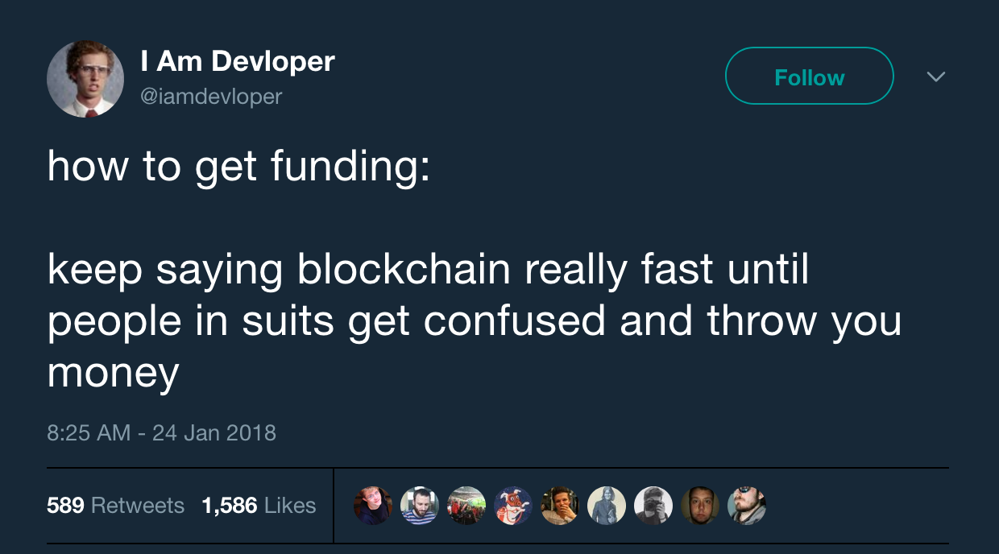
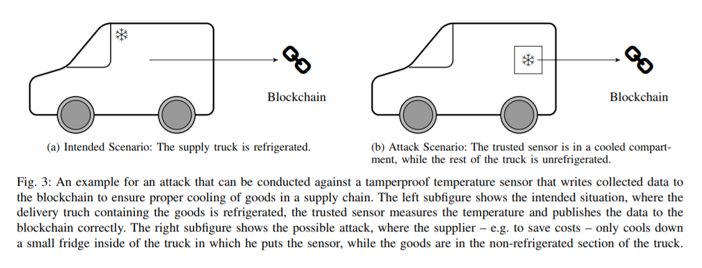
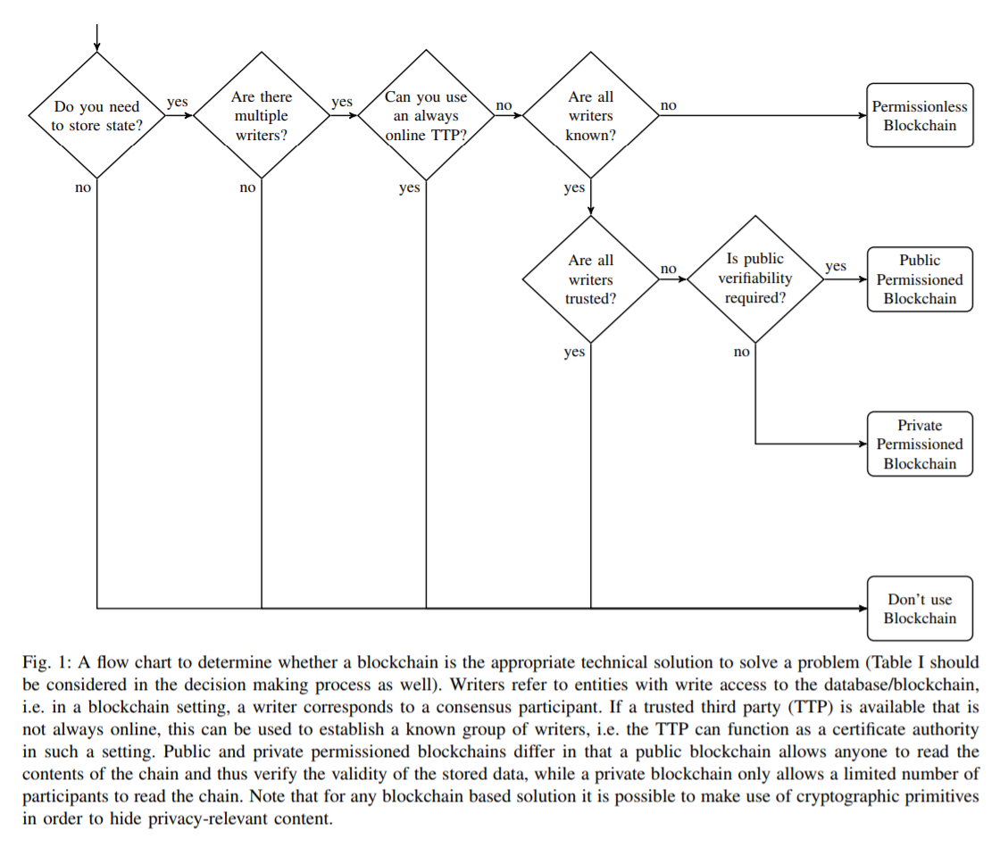
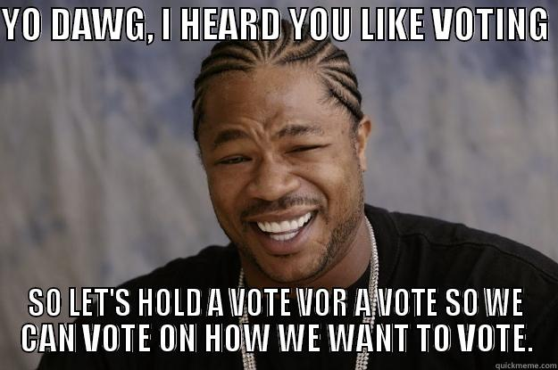
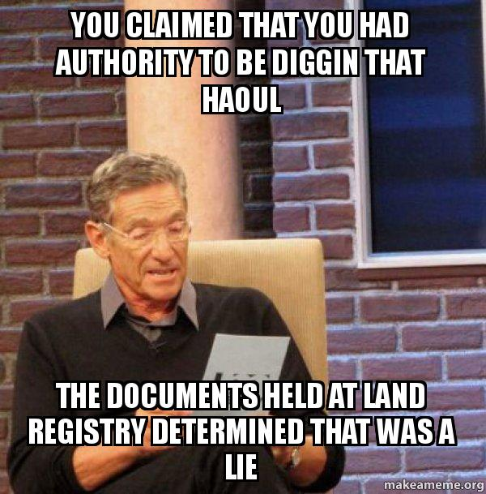
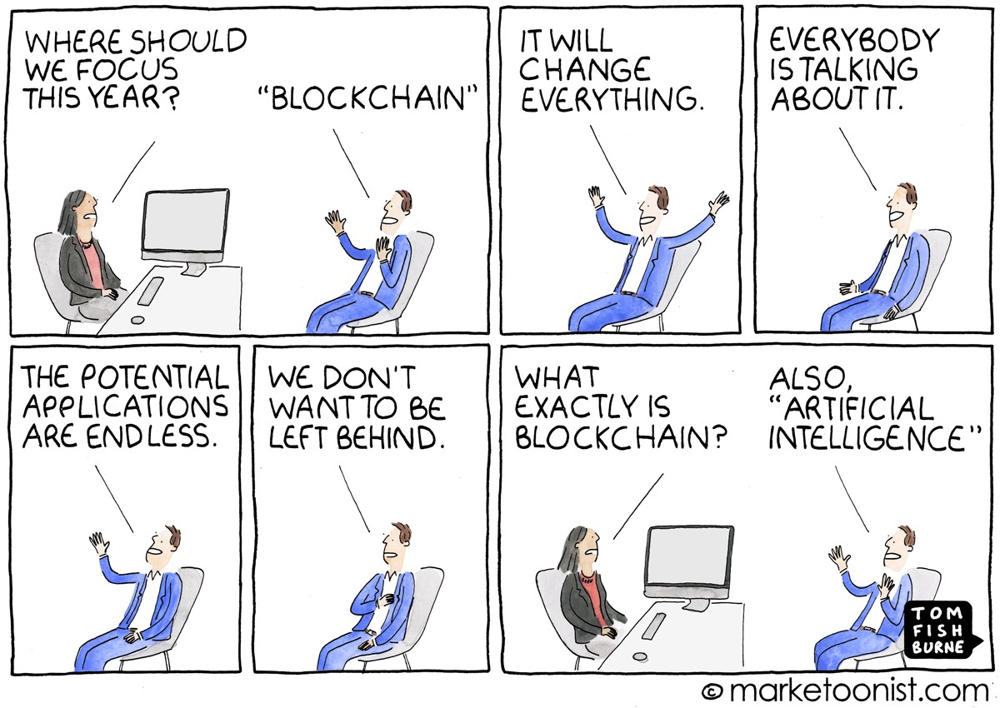

Вам не нужен блокчейн: 8 популярных юзкейсов и почему они не работают / Блог компании Ростелеком-Solar

Порой диву даёшься, чего только люди ни сделают «на блокчейне». С середины 2017 я занимаюсь аудитами безопасности смарт-контрактов и повидал всякого. В отдельную категорию я бы выделил «применения блокчейна», которые выглядят логичными и полезными, но в основе содержат проблему. И кочуют из стартапа в стартап вместе с ней. Здесь я рассмотрю ряд таких примеров, опишу проблемы и неработающие способы решения. После прочтения этого текста вы будете знать, с каких вопросов стоит начать, если вам как разработчику/клиенту/инвестору предложат такое «применение блокчейна».

  

### Дисклеймеры

  

*   Я описываю юзкейсы и проблемы, которые возникают на первом шаге. Я не утверждаю, что эти проблемы нельзя решить. Но при рассмотрении подобной системы стоит понимать, как создатели предлагают решать соответствующую проблему.
*   Словосочетание «применение блокчейна» режет глаз. Тем не менее, здесь и далее я буду писать его без кавычек, хотя до сих пор до конца не уверен, что возможны другие применения блокчейна помимо денег, то есть кроме Bitcoin.

  

### 1\. Supply Chain Management

Пусть мы заказали доставку товара и перевозчик обязуется по дороге соблюдать условия хранения, например, поддерживать низкую температуру. Предлагается следующее решение: устанавливаем в грузовик датчик, который регулярно публикует температуру в холодильнике в блокчейн. Таким образом, можно проследить историю температуры и убедиться, что условия хранения были соблюдены на всём пути.

Проблема здесь не в блокчейне, а в датчике. Поскольку датчик находится в физическом мире, которым управляет не код, а люди, датчик легко обмануть. Например, поместить в небольшой холодильник только датчик, а на охлаждение груза не тратиться.

Глобально я бы сформулировал эту проблему так:

**_Блокчейн — это не Internet of Things (IOT)._**

Эта формулировка нам понадобится ещё не раз. Блокчейн обеспечивает неизменность занесённых в него данных, но не может обеспечить их истинность. Единственное исключение — случай, когда вся система оперирует on-chain, то есть когда блокчейн не пытается заглядывать в физический мир. Тогда вся необходимая информация есть внутри блокчейна, и система может верифицировать корректность данных: например, что на адресе достаточно средств для совершения конкретной транзакции.

Приложения, которые пытаются поставлять в блокчейн данные снаружи, получили название «оракулы». На этот счёт рекомендую статью [«Оракулы, или почему смарт-контракты всё ещё не изменили мир?» (Александр Дрыгин)](https://habr.com/ru/company/solarsecurity/blog/418791/). Проблема оракулов пока что не решена. И до тех пор, пока решение не будет найдено, попытки реализации Supply Chain Management на блокчейне вроде примера выше — это попытки изобрести самолёт до изобретения двигателя.

Пример с холодильником я взял из статьи [«Do you need blockchain» (Karl Wüst, Arthur Gervais)](https://eprint.iacr.org/2017/375.pdf). Рекомендую саму статью и в первую очередь эту схемку:

  

### 2\. Гарантия подлинности товара

Юзкейс, принципиально не отличающийся от предыдущего. Но поскольку внешне он выглядит иначе и предлагается другими людьми и под другим соусом, считаю важным рассмотреть его отдельно.

Пускай мы производим некоторый редкий/дорогой товар — часы, вино, автомобили — и хотим дать клиенту возможность убедиться, что попавший к нему в руки экземпляр действительно произведён на нашем заводе. Мы привязываем нашу бутылку вина к токену на блокчейне, печатаем на ней QR-код. Каждая передача бутылки, от завода перевозчику, далее магазину и клиенту, подтверждается транзакцией на блокчейне. Тот, кто держит бутылку в руках, может зайти на сайт и проследить её путь от самого завода, тем самым убедившись в её подлинности.

Всю систему ломает простой как валенок эксплойт: продавец-злоумышленник полностью копирует бутылку, наливает туда вино попроще и копию с токеном продаёт клиенту, а оригинал — тому, кого не интересует токен, или вообще выпивает сам. А всё почему? Правильно, потому что

**_Блокчейн — это не IoT._**

Бутылка — это физический объект, а значит, при должном старании её в отличие от цифровой подписи можно подделать.

  

### 3\. Подлинность диплома университета

Здесь уже речь идёт об истинности утверждения («Петя окончил МГУ»), а не о подлинности физического объекта. По сути в этом случае мы говорим про цифровую подпись, чтобы подтвердить подлинность, плюс timestamping, чтобы исключить выпуск диплома задним числом.

Цифровая подпись (ЦП) — это отлично, некоторые даже считают асимметричную криптографию величайшим изобретением 20-го века. Но не стоит её путать с блокчейном: ЦП существовала и приносила пользу задолго до него. Сейчас стало популярным продавать цифровую подпись под видом блокчейна, так что будьте начеку — возможно, вам нужна только ЦП.

Timestamping — это уже ближе. Блокчейн — это и есть самый надёжный способ timestamping'а. Только вот городить новые решения тут не нужно: достаточно положить хеш данных на блокчейн Bitcoin'а, надёжней и проще некуда.

Хорошая ли идея класть хеш диплома выпускника на блокчейн Bitcoin'а, подписывая его цифровыми подписями нескольких профессоров? Да. Важно только потом эту систему не испортить централизованным способом проверки, через сайт или приложение университета, например, ведь именно он станет самым слабым звеном.

  

### 4\. Голосование

Говоря о голосовании на блокчейне, в первую очередь нужно понять, какую проблему мы хотим решить.

**Проблема подделки голоса/аутентификации.** Для этого нужен не блокчейн, а цифровая подпись. И главная сложность здесь в том, откуда взять и как хранить приватный ключ. Не буду объяснять, почему любая система, в которой ключ генерируется не на устройстве конечного владельца, является broken by design. Но кроме генерации ключа на своём устройстве важно, чтобы ПО, которым генерируется ключ, было open source и хорошо проаудированным; железо было получено из третьего источника (самый простой вариант — смартфон); пользователь умел обращаться с приватным ключом.

Первые две проблемы может решить разработчик системы, третья гораздо сложнее. Возможно, как раз Bitcoin нас постепенно научит обращаться с ключами: одно дело потерять пароль к странице в соцсети или даже к голосу, совсем другое — к собственным деньгам.

И да, привязка публичного ключа к конкретному человеку, если это требуется в нашем голосовании, — это снова IoT.

**Проблема публичности подсчёта голосов.** Для этих целей в первом приближении подходят смарт-контракты а-ля Ethereum: всем видно, за какого кандидата отдано сколько голосов. Правда, здесь публичности может получиться многовато: если мы видим необезличенный голос каждого человека, мы можем на этого человека давить, чтобы он проголосовал, как нам надо. Можно построить систему так, что каждый конкретный голос не будет виден никому, кроме его владельца. Но вот задача более сложная — чтобы даже сам владелец не мог доказать, что проголосовал за определённого кандидата, — пока не решена, а значит, и давление возможно.

И, опять же, задача проверки того, не выдано ли дополнительных голосов несуществующим людям, — это IoT.

  

### 5\. Доказательство авторства

Художник **A** написал картину и хочет зафиксировать её авторство на блокчейне. Он фотографирует её, хеш фотографии кладёт в блокчейн, а саму фотографию выкладывает в блог. После этого художнику **B**, который будет утверждать, что картину на самом деле написал **B**, наш художник **A** предъявит фотографию и хеш, тем самым доказав, что он заявил её авторство ещё давно.

Две проблемы:

  

*   Художник **B** может сказать, что не знал о блокчейне, поэтому не зафиксировал там авторство. То есть чтобы приносить пользу, такая процедура должна стать общепринятой.
*   Художник **B** может проникнуть в мастерскую художника **A**, сфотографировать картину и выложить хеш на блокчейн раньше, чем художник **A**.

Пример с картиной можно распространить на любое другое произведение, эти проблемы сохранятся. Потому что

**_Блокчейн — это не IoT._**

В целом же этот юзкейс не лишён смысла. Главная особенность в том, что тут достаточно блокчейна Bitcoin, новое решение не нужно.

Примечание: здесь я говорю о доказательстве авторства, а не об интеллектуальной собственности, потому что саму её концепцию считаю несостоятельной: [«Against Intellectual Property» (Stephan Kinsella)](https://mises.org/library/against-intellectual-property-0).

  

### 6\. Земельный кадастр

Предлагалось также привязать к токенам на блокчейне владение землёй. Тут тоже возникают как минимум две проблемы.

**Действия регулятора.** Если бутылку/часы/машину по факту можно передать P2P (из рук в руки), то регистрация владения землёй на сегодняшний день привязана к регулятору. Регулятор требует регистрировать сделки по передаче земли у него и, в отличие от случая с часами, всегда может применить силу, физически придя на вашу землю. Регулятор может настаивать на передаче земли, и что тогда происходит с записью на блокчейне? Если на блокчейне будет записано, что землёй владеете вы, это будет не соответствовать действительности. Если регулятор может сделать собственную запись, переписав вашу, то блокчейн не работает. Это особенно важно в свете того, что в ряде случаев именно от махинаций регулятора (или конкретных чиновников) с помощью блокчейна и предлагается защищаться.

**Централизация разработки и поддержки.** Кто будет разрабатывать такую систему и поддерживать ноды? Если снова регулятор или его контрагент, то такая система не будет децентрализованной. Децентрализованный протокол с централизованной разработкой — это централизованный протокол (привет, Ethereum!).

Кроме того, каждый раз, когда нам предлагают блокчейн, имеет смысл задавать себе вопрос:

[~**_Что это даёт мне?_**~](https://www.youtube.com/watch?v=tOXo5d8F8-E)  
**_Можем ли мы использовать не блокчейн, а распределённую базу данных?_**

Если можем, то смысла использовать блокчейн нет: он будет работать медленнее и требовать для тех же задач больше ресурсов. Кроме того, специалистов для разработки и интеграции базы данных найти гораздо проще, чем специалистов по блокчейну. Стоить они будут гораздо дешевле, а проверить результат работы и поддерживать систему будет проще.

С учётом описанных выше проблем возьмусь утверждать, что в нынешних реалиях распределённая база данных для земельного кадастра подходит лучше. Это, впрочем, не значит, что не надо работать над её надёжностью и открытостью — см. раздел «Блокчейн как повод».

У этого юзкейса даже как будто есть живые имплементации. Bitfury объявила о запуске в Грузии [земельного кадастра на блокчейне на базе фреймворка Exonum](https://exonum.com/ru/napr), и собирается сделать то же самое в Украине и на Мальдивах. Тем не менее, никаких технических подробностей мне найти не удалось. Хотя вроде бы кейс мощный, хвастайся, привлекай новых клиентов.

  

### 7\. Межбанковские переводы

Этот кейс проходит по схеме из «Do you need blockchain». Есть набор не доверяющих друг другу сторон, и нет доверенной третьей стороны. Здесь бы подошёл Bitcoin, но банки вряд ли захотят делать взаиморасчёты публично доступными. Поэтому тут наш выбор — приватный блокчейн, записывать данные в который могут только банки. Они же поддерживают ноды и верифицируют транзакции остальных участников процесса.

Отличается ли функционально такая система от распределённой базы данных с контролем доступа? Только тогда, когда между сторонами возникает несогласие. И здесь вопрос в том, признают банки решение системы (результат консенсуса) или пойдут в суд его оспаривать. Если второе будет юридически возможно (т.е. если банки не подписали соглашение о том, что они безоговорочно принимают решение системы), то вся затея бессмысленна.

Кроме того, учитывая, что банки на данный момент зависят от регулятора, система потеряет смысл, если регулятор запретит или ограничит её использование — например, откажется принимать результат её работы в суде.

  

### 8\. Токен ради токена

Да, вам не показалось, я в 2019 году пишу про ICO. В подтверждение актуальности темы скажу, что только что, [28 января, BitTorrent провёл успешное ICO](https://forklog.com/kraudsejl-bittorrent-prines-7-2-mln-zavershivshis-menee-chem-za-18-minut-na-fone-tehnicheskih-problem/).

Словами «токен ради токена» я обозначаю ситуацию, когда стартап выпускает токены и заявляет, что они дают владельцам долю в компании/часть прибыли/опцион на опцион. Проблема в том, что

**_Блокчейн — это не IoT._**

Блокчейн в отличие от венчурного инвестора или регулятора не возьмёт стартапера за пуговицу и не заставит работать или отвечать перед вкладчиками. Наличие обещания в виде токена само по себе не принуждает основателей компании ни к чему, что мы многократно наблюдали во время бума ICO (Lambos, вот это всё). В этом смысле ICO гораздо ближе к краудфандингу, чем к IPO.

Лично я являюсь сторонником децентрализованных институтов, а не регуляций. Тем не менее я вынужден признать, что пока в этой области их почти нет. А значит, приходится либо пользоваться существующими инструментами, либо уповать на честность основателей компании.

Далее я рассмотрю несколько юзкейсов, которые могут сработать.

  

### Блокчейн как повод

Как ни странно, даже неработающие применения блокчейна могут принести пользу. Например, в корпорации существует устаревший на пару десятков лет процесс/система, который давно пора переделать по современным лекалам. Консервативное руководство может быть не готово тратить ресурсы на то, чтобы сделать просто нормально — но готово вложиться в блокчейн-бигдата-ЭйАй-АйОуТи-инновацию, чтоб оказаться впереди планеты всей.

Тут-то на сцену и выходит хитрый (но добросовестный!) [интрапренёр](https://en.wikipedia.org/wiki/Intrapreneurship) и под соусом блокчейна предлагает просто правильный дизайн системы. Блокчейн в этом случае может давать какие-то преимущества, может быть не нужен, а может и вовсе существовать только на слайдах.

Hint: когда вам предлагают блокчейн, убедитесь, что предлагают именно его. Но даже если нет, предложение может быть дельным.

  

### Деньги

Блокчейн для денег подходит идеально — в том числе потому, что для этого и был создан. Он как раз сохраняет утверждения вида «субъект A владел суммой X; субъект A передал сумму X субъекту B; субъект B владеет суммой X». Корректность этих утверждений может быть проверена внутри блокчейна, поскольку предыдущие аналогичные утверждения записаны на нём же. А вот вопрос, откуда монеты взялись исходно (майнинг), заслуживает отдельной статьи.

Симон Моррис написал серию статей [«BitTorrent Lessons for Crypto»](https://medium.com/@simonhmorris/decentralized-disruption-who-dares-wins-bittorrent-lessons-for-crypto-4-of-4-f022e8641c1a). Во второй части [«If You’re Not Breaking Rules You’re Doing It Wrong»](https://medium.com/@simonhmorris/if-youre-not-breaking-rules-you-re-doing-it-wrong-bittorrent-lessons-for-crypto-2-of-4-72c68227fe69) он говорит о том, что децентрализация необходима в первую очередь, чтобы ломать правила, — ведь те, кто за этими правилами следит, захотят вам помешать.

И Bitcoin этому условию полностью удовлетворяет: он ломает давно ставшее привычным правило, согласно которому только государства могут выпускать деньги и определять порядок эмиссии, а также решать, какая транзакция имеет право на жизнь, а какая нет.

Что на мой взгляд более важно, Bitcoin выполняет конкретную функцию — передачу ценности, существовавшую и понятную людям задолго до него: [«Shelling Out: The Origins of Money» (Nick Szabo)](https://nakamotoinstitute.org/shelling-out/). В то время как подавляющее большинство блокчейн-стартапов вынуждены с нуля объяснять, что за задачу они решают и почему это важно. Эта ситуация выглядит абсурдно даже для традиционных стартапов, у которых принято искать клиента, тестировать гипотезы, подстраиваться под рынок. Решать насущные проблемы, а не придумывать новые.

Так или иначе, Bitcoin — единственное на сегодняшний день однозначно работающее применение блокчейна. Именно это и заставило меня в начале статьи поставить под вопрос уместность термина «применение блокчейна».

Ремарка: здесь я игнорирую применения блокчейна, которые используются не конечным пользователем, а другими блокчейнами, применяемыми в свою очередь децентрализованными биржами, на которых торгуются токены третьих блокчейнов. Хотя возможно, что у индустрии и получится таким образом вытащить себя за волосы из болота, как Мюнхгаузен.

  

### Смарт-контракты

Давайте будем честны с собой: пока что никто толком не знает, что такое смарт-контракты и зачем они нужны. [Эта концепция](https://twitter.com/NickSzabo4/status/1051603179526270976) находится в самом начале своего пути. Ethereum сильно опередил своё время. На момент появления децентрализованных электронных денег Bitcoin люди уже знали, что такое деньги, и привыкли пользоваться электронными деньгами. На момент появления децентрализованных электронных контрактов Ethereum люди и с бумажными контрактами управляются не совсем уверенно, а электронных централизованных контрактов просто нет. Можно пытаться прыгнуть через две ступеньки, но на это нужно как минимум время. И это в том случае, если сама концепция в принципе жизнеспособна.

Лично я верю, что в будущей картине мира смарт-контракты найдут своё место, поэтому считаю правильным работать над ними уже сейчас. Но это именно вера, подтверждений или опровержений ей я пока не нашёл.

  

### Ещё примеры

Выше я разобрал те примеры, которые сумел вспомнить и обобщить. Какие-то я забыл упомянуть, о других просто не знаю. Поэтому я буду благодарен, если вы в комментариях накидаете ещё применений блокчейна для разбора. Возможно, я напишу продолжение.