Введение в Kubernetes для пользователей VMware. Часть 1. Теория / Блог компании DataLine

Это вторая часть из моей серии постов [“Kubernetes in the Enterprise”](https://www.hanymichaels.com/2017/10/04/kubernetes-in-the-enterprise-a-vmware-guide-on-how-to-design-deploy-and-operate-k8saas-with-nsx-t-and-vra/). Как я упоминал в моем последнем посте, очень важно при переходе к [“Design and Implementation Guides”](https://www.hanymichaels.com/2017/11/02/kubernetes-in-the-enterprise-the-design-guide/) всем быть на одном уровне понимания Kubernetes (K8s).

Я не хочу здесь применять традиционный подход для объяснения архитектуры и технологий Kubernetes, а объясню все через сравнение с vSphere платформой, которая вам, как пользователям VMware, хорошо знакома. Это позволит вам преодолеть кажущуюся запутанность и тяжесть понимания Kubernetes. Я использовал этот подход внутри VMware для представления Kubernetes разным аудиториям слушателей, и он доказал, что отлично работает и помогает людям быстрее освоиться с ключевыми концепциями.

Важное замечание, прежде чем мы начнем. Я не использую это сравнение ради доказательства каких-либо сходств или различий между vSphere и Kubernetes. И то, и другое, в сущности, это распределенные системы, и, следовательно, должны иметь сходство с любой другой подобной системой. Поэтому в итоге я пытаюсь представить такую замечательную технологию как Kubernetes широкому сообществу её пользователей.  
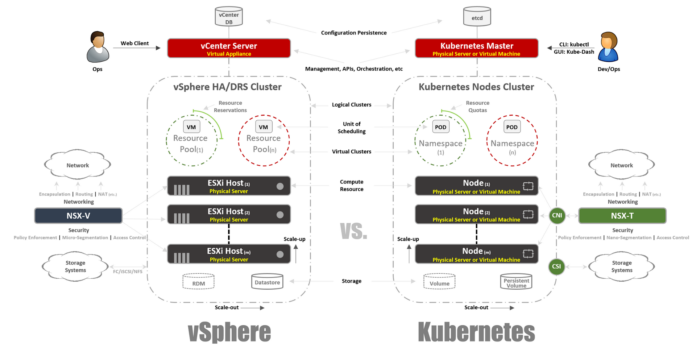

### Немного истории

Чтение этого поста предполагает знакомство с контейнерами. Я не буду описывать основные концепции контейнеров, так как существует множество ресурсов, рассказывающих об этом. Очень часто, разговаривая с заказчиками, я вижу, что они не могут понять, почему контейнеры захватили нашу индустрию и стали очень популярными в рекордные сроки. Для ответа на этот вопрос я расскажу о своем практическом опыте понимания изменений, которые происходят в нашей индустрии.

До знакомства с миром телекоммуникаций я был Web разработчиком (2003 год).

Это была моя вторая, оплачиваемая работа после того, как я работал сетевым инженером/администратором (я знаю, что был мастером на все руки). Я разрабатывал на PHP. Разрабатывал всевозможные приложения, начиная с небольших, которые использовал мой работодатель, заканчивая профессиональным приложением по голосованию для телевизионных программ, и даже телекоммуникационные приложения, взаимодействующие с VSAT хабами и спутниковыми системами. Жизнь была великолепна за исключением одного серьезного препятствия, о котором знает каждый разработчик, это зависимости.

Сначала я разрабатывал приложение на своем ноутбуке, используя что-то вроде LAMP стека, когда оно хорошо работало у меня на ноутбуке, я загружал исходный код на сервера хостеров (все помнят RackShack?) или на приватные сервера заказчиков. Можете себе представить, что как только я делал это, приложение ломалось и не работало на этих серверах. Причина этого — зависимости. На серверах были другие версии ПО (Apache, PHP, MySQL, и т.д.), чем используемые мной на ноутбуке. Поэтому мне нужно было найти способ обновить версии ПО на удаленных серверах (плохая идея) или переписать код на моем ноутбуке, чтобы соответствовать версиям на удаленных серверах (худшая идея). Это был кошмар, временами я себя ненавидел и задавался вопросом, почему этим я зарабатываю на жизнь.

Прошло 10 лет, появилась компания Docker. Будучи консультантом VMware в Professional Services (2013) я услышал о Docker, и позвольте сказать, что я не смог понять эту технологию в те дни. Я продолжал говорить что-то вроде: зачем использовать контейнеры, если есть виртуальные машины. Зачем отказываться от таких важных технологий как vSphere HA, DRS или vMotion из-за таких странных преимуществ как мгновенный запуск контейнеров или исключение накладных расходов гипервизора. Ведь все работают с виртуальными машинами и работают отлично. Короче говоря, я смотрел на это с точки зрения инфраструктуры.

Но потом я начал присматриваться и меня осенило. Все, что связано с Docker, относится к разработчикам. Только начав думать, как разработчик, я сразу понял, что, если бы у меня была эта технология в 2003 году, я смог бы упаковать все мои зависимости. Мои Web приложения могли бы работать независимо от используемого сервера. Более того, не нужно было бы загружать исходный код или настраивать что-то. Можно просто “упаковать” мое приложение в образ и просить заказчиков загрузить и запустить этот образ. Это мечта любого Web разработчика!

Все это здорово. Docker решил огромную проблему взаимодействия и упаковки, но что дальше? Смогу ли я, как корпоративный клиент, управлять этими приложениями при масштабировании? Я все еще хочу использовать HA, DRS, vMotion и DR. Docker решил проблемы моих разработчиков и создали целую кучу проблем для моих администраторов (команды DevOps). Им нужна платформа для запуска контейнеров, такая же, как имеющаяся для запуска виртуальных машин. И мы опять вернулись к началу.

Но затем появился Google, сообщивший миру об использовании контейнеров в течение многих лет (фактически контейнеры изобретены Google: cgroups) и о правильном методе их использования, через платформу, которую они назвали Kubernetes. Затем они открыли исходные коды Kubernetes. Подарили Kubernetes сообществу. И это снова всё изменило.

### Понимание Kubernetes в сравнении с vSphere

Так что же такое Kubernetes? Проще говоря, Kubernetes для контейнеров тоже самое, что vSphere для виртуальных машин в современном дата-центре. Если вы использовали VMware Workstation в начале 2000-х, вы знаете, что это решение всерьез рассматривалось как решение для дата-центров. Когда появился VI/vSphere с vCenter и ESXi хостами мир виртуальных машин кардинально изменился. Тоже самое Kubernetes делает сегодня с миром контейнеров, принося возможность запуска и управления контейнерами в продакшн. И именно поэтому мы начнем сравнивать vSphere бок о бок с Kubernetes, чтобы объяснить детали этой распределенной системы для понимания её функций и технологий.  
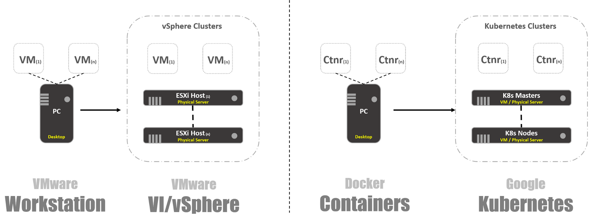

### Обзор системы

Как в vSphere есть vCenter и ESXi хосты в концепции Kubernetes есть Master и Node’ы. В этом контексте Master в K8s это эквивалент vCenter, в том смысле, что он является уровнем управления (Management Plane) распределенной системы. Также это точка входа для API, с которой вы взаимодействуете при управлении вашей рабочей нагрузкой. Точно также Node’ы K8s работают как вычислительные ресурсы, аналогично ESXi хостам. Именно на них вы запускаете рабочие нагрузки (в случае с K8s мы называем их Pod’ами). Node’ы могут быть виртуальными машинами или физическими серверами. Конечно, в случае vSphere ESXi хосты должны быть всегда физическими.  
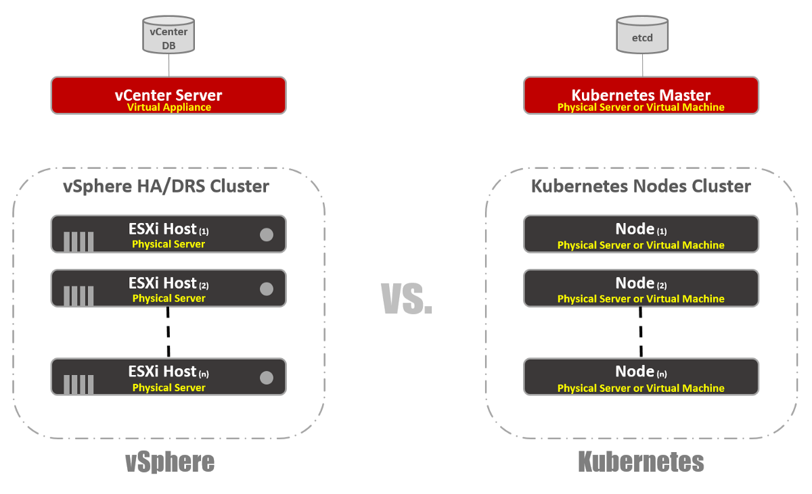

Вы можете видеть, что в K8s есть key-value хранилище, называемое “etcd”. Это хранилище похоже на базу данных vCenter, где вы сохраняете желаемую конфигурацию кластера, которой хотите придерживаться.

Что касается различий: на Master K8s вы также можете запустить рабочие нагрузки, а на vCenter — нет. vCenter — это Virtual Appliance, выделенный только для управления. В случае K8s Master считается вычислительным ресурсом, но запускать на нем Enterprise приложения не очень хорошая идея.

Так как же это будет выглядеть в действительности? В основном вы будете использовать CLI для взаимодействия с Kubernetes (но GUI все еще очень жизнеспособный вариант). На скриншоте ниже видно, что я использую Windows машину для подключения к моему Kubernetes кластеру через командную строку (использую cmder, если вам интересно). На скриншоте у меня есть один Master узел и 4 Node’ы. Они работают под управлением K8s v1.6.5, а на узлах установлена операционная система (ОС) Ubuntu 16.04. На момент написания поста мы в основном живем в мире Linux, где Master и Node’ы всегда работают под управлением дистрибутива Linux.

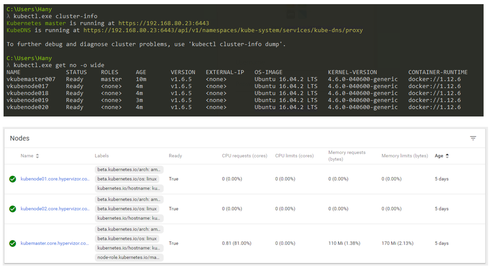  
_Управление кластером K8s через CLI и GUI._

### Форм-фактор рабочих нагрузок

В vSphere виртуальная машина является логической границей операционной системы. В Kubernetes Pod’ы являются границами для контейнеров, как и ESXi хост, на котором может работать одновременно несколько виртуальных машин. На каждой Node может работать несколько Pod’ов. Каждый Pod получает маршрутизируемый IP-адрес, как и виртуальные машины, для взаимодействия Pod’ов друг с другом.

В vSphere приложения запускаются внутри ОС, а в Kubernetes приложения запускаются внутри контейнеров. Виртуальная машина может одновременно работать только с одной ОС, а Pod может запускать несколько контейнеров.  

Вот так можно вывести список Pod’ов внутри кластера K8s, используя инструмент kubectl через CLI, проверить работоспособность Pod’ов, их возраст, IP-адрес и Node’ы, на которых они сейчас работают.  
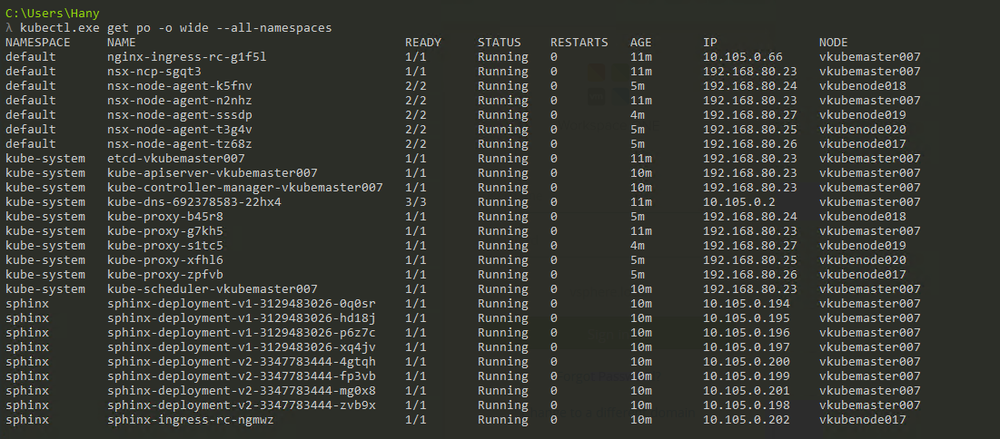

### Управление

Итак, как нам управлять нашим Master, Node’ами и Pod’ами? В vSphere мы используем Web клиент для управления большинством (если не всеми) компонент нашей виртуальной инфраструктуры. Для Kubernetes аналогично, с использованием Dashboard. Это хороший Web портал на основе графического интерфейса, к которому вы можете получить доступ через браузер так же, как и с Web клиентом vSphere. Из предыдущих разделов видно, что вы можете управлять своим кластером K8s с помощью команды kubeclt из CLI. Это всегда спорно, где вы будете проводить большую часть своего времени в CLI или в графическом Dashboard. Так как последний с каждым днем становится все более мощным инструментом (чтобы убедиться можете посмотреть это видео). Лично я считаю, что Dashboard очень удобен для быстрого мониторинга состояния или отображения деталей различных компонентов K8s, позволяя не вводить длинные команды в CLI. Вы найдете баланс между ними естественным образом.

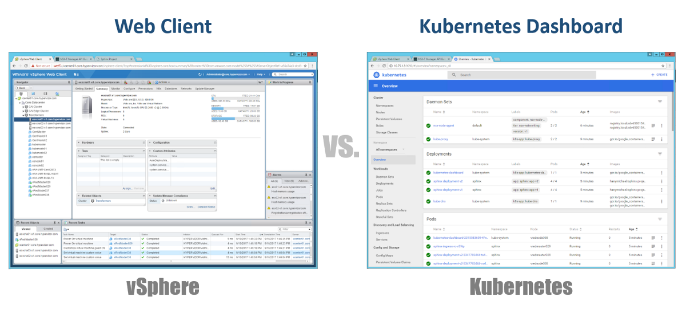

### Конфигурации

Одна из очень важных концепций в Kubernetes — желаемое состояние конфигураций. Вы декларируете, что вы хотите почти для любого компонента Kubernetes через YAML файл, и вы создаете все это, используя kubectl (или через графический Dashboard) в качестве желаемого состояния. Начиная с этого момента Kubernetes всегда будет стремиться сохранить ваше окружение в заданном, рабочем состоянии. Например, если вы хотите иметь 4 реплики одного Pod’а, K8s будет продолжать следить за этими Pod’ами, и в случае, если один из них умер или у Node, на которых он работал, возникли проблемы, K8s самовосстановится и автоматически создаст этот Pod в другом месте.

Возвращаясь к нашим YAML файлам конфигурации, вы можете рассматривать их как файл .VMX для виртуальной машины или дескриптор .OVF для Virtual Appliance, который вы хотите развернуть в vSphere. Эти файлы определяют конфигурацию рабочей нагрузки/ компонента, который вы хотите запустить. В отличие от файлов VMX/OVF, которые являются эксклюзивными для виртуальных VMs/Appliances, файлы конфигурации YAML используются для определения любого компонента K8s, такого как ReplicaSets, Services, Deployments и т.д. Рассмотрим это в следующих разделах.  
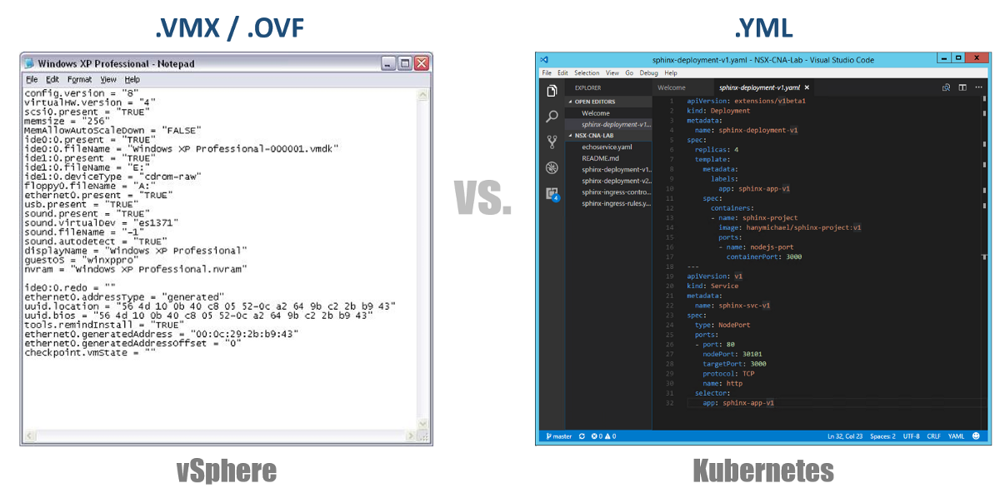

### Виртуальные кластеры

В vSphere у нас есть физические ESXi хосты, логически сгруппированные в кластеры. Эти кластеры можем разделить на другие виртуальные кластеры, называемые “Resource Pools”. Эти “пулы” в основном используются для ограничения ресурсов. В Kubernetes у нас есть что-то очень похожее. Мы называем их “Namespaces”, они также могут использоваться для обеспечения ограничения ресурсов, что будет отражено в следующем разделе. Однако чаще всего “Namespaces” используются как средство multi-tenancy для приложений (или пользователей, если вы используете общие K8s кластеры). Это также один из вариантов, с помощью которого можно выполнить сетевую сегментацию с помощью NSX-T. Рассмотрим это в следующих публикациях.  
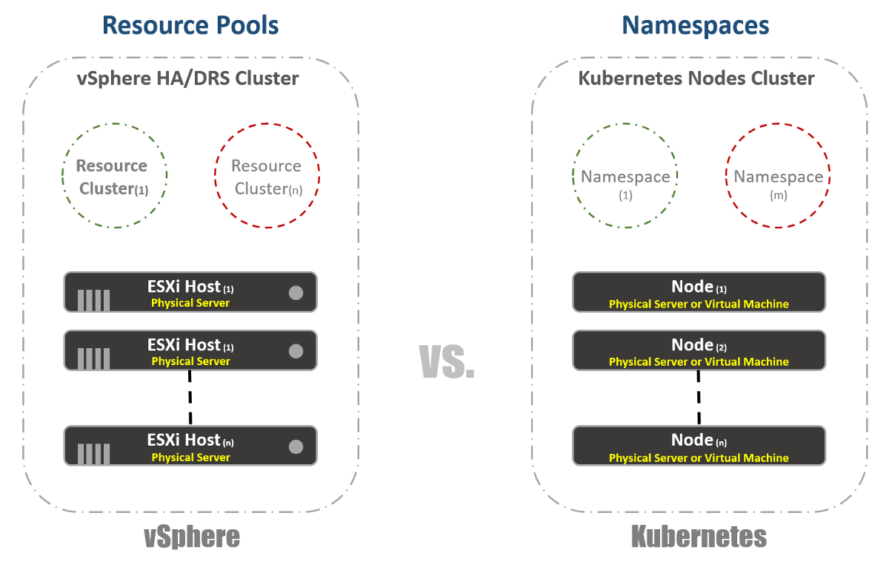

### Управление ресурсами

Как я упоминал в предыдущем разделе, Namespaces в Kubernetes обычно используются как средство сегментации. Другим вариантом использования Namespaces является распределение ресурсов. Этот вариант называется “Resource Quotas”. Как следует из предыдущих разделов, определение этого происходит в конфигурационных YAML файлах, в которых объявляется желаемое состояние. В vSphere, как видно на скриншоте ниже, определяем это из настроек Resource Pools.  
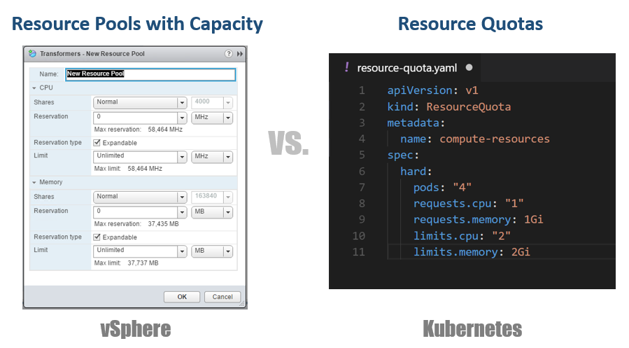

### Идентификация рабочих нагрузок

Это довольно просто и почти одинаково и для vSphere и Kubernetes. В первом случае мы используем понятия Tags для определения (или группировки) аналогичных рабочих нагрузок, а во втором используем термин “Labels”. В случае с Kubernetes идентификация рабочих нагрузок является обязательной.  
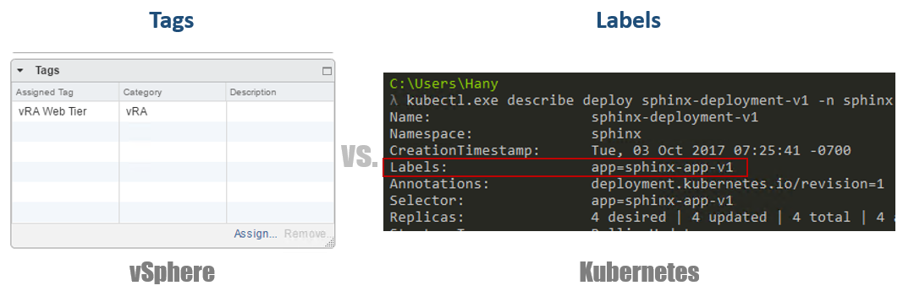

### Резервирование

Теперь к настоящему веселью. Если вы были или являетесь большим поклонником vSphere FT, как я, вам понравится эта функция в Kubernetes, несмотря на некоторые различия в двух технологиях. В vSphere это виртуальная машина с работающим теневым экземпляром, запущенным на другом хосте. Мы записываем инструкции на основной виртуальной машине и воспроизводим их на теневой виртуальной машине. Если основная машина перестала работать то, теневая виртуальная машина включается немедленно. Затем vSphere пытается найти другой ESXi хост, чтобы создать новый теневой экземпляр виртуальной машины для сохранения той же избыточности. В Kubernetes у нас есть нечто очень похожее. ReplicaSets — это количество, которое вы указываете для запуска нескольких экземпляров Pod’ов. Если один Pod выходит из строя, другие экземпляры доступны для обслуживания трафика. В то же время, K8s попытается запустить новый Pod на любой доступной Node, чтобы поддерживать желаемое состояние конфигурации. Основное отличие, как вы, возможно, уже заметили, состоит в том, что в случае с K8s Pod’ы всегда работают и обслуживают трафик. Они не являются теневыми рабочими нагрузками.  
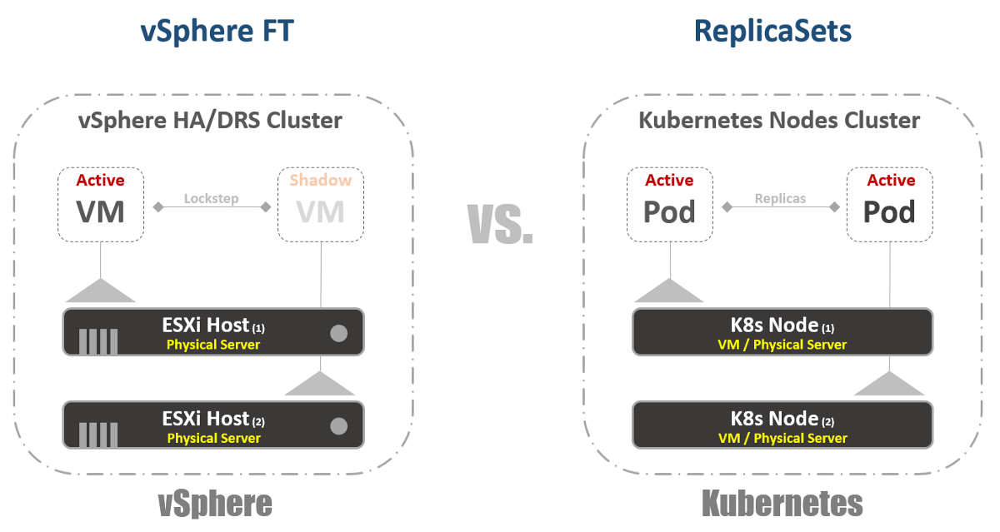

### Балансировки нагрузки

Хотя это может и не быть встроенной функцией в vSphere, все же очень и очень часто нужно запускать балансировщики нагрузки на платформе. В мире vSphere есть виртуальные или физические балансировщики нагрузки для распределения сетевого трафика между несколькими виртуальными машинами. Может быть много разных режимов конфигурации, но давайте предположим, что мы имеем в виду One-Armed конфигурацию. В этом случае вы балансируете нагрузку East-West трафиком на свои виртуальные машины.

Точно также в Kubernetes есть понятия “Services”. Service в K8s также можно использовать в разных режимах конфигурации. Давайте выберем конфигурацию “ClusterIP’, чтобы сравнить ее с One-Armed Load Balancer. В этом случае Service в K8s будет иметь виртуальный IP-адрес (VIP), который всегда статичен и не изменяется. Этот VIP будет распределять трафик между несколькими Pod’ами. Это особенно важно в мире Kubernetes, где по своей природе Pod’ы эфемерны, вы теряете IP-адрес Pod’а в тот момент, когда он умирает или удаляется. Таким образом, вы всегда должны обеспечивать статичный VIP.

Как я уже упоминал, у Service есть много других конфигураций, например, “NodePort”, где вы назначаете порт на уровне Node’ы, а затем выполняете port-address-translation преобразование для Pod’ов. Существует также “LoadBalancer”, где вы запускаете экземпляр Load Balancer от стороннего или облачного провайдера.  
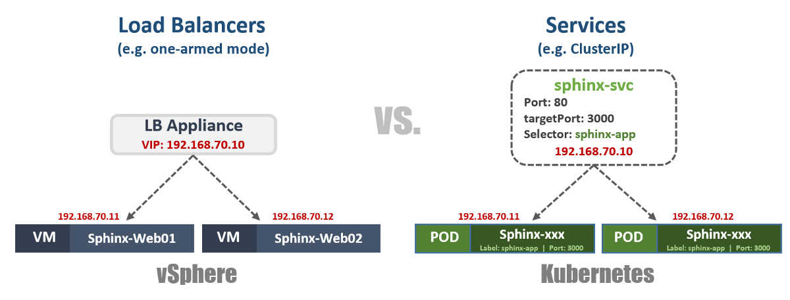

В Kuberentes есть еще один очень важный механизм балансировки нагрузки, который называется “Ingress Controller”. Вы можете считать его in-line application балансировщиком нагрузки. Основная идея заключается в том, что Ingress Controller (в форме Pod’а) будет запущен с видимым извне IP-адресом. Этот IP-адрес может иметь нечто вроде Wildcard DNS записи. Когда трафик попадает на Ingress Controller с использованием внешнего IP-адреса, он проверяет заголовки и определяет с помощью набора правил, которые вы предварительно установили, какому Pod’у принадлежит это имя. Например: sphinx-v1.esxcloud.net будет направлен на Service sphinx-svc-1, а sphinx-v2.esxcloud.net будет направлен на Service sphinx-svc2 и т.д.  
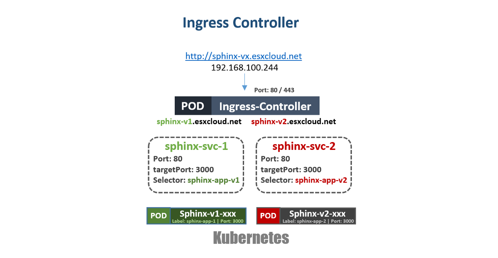

### Хранение и сеть

Хранение и сеть — очень и очень широкие темы, когда речь идет о Kubernetes. Почти невозможно кратко рассказать об этих двух темах во вводном посте, но я скоро расскажу подробно о различных концепциях и вариантах для каждой из этих тем. А пока давайте быстро рассмотрим, как работает сетевой стек в Кubernetes, поскольку нам это понадобится в следующем разделе.

Kubernetes имеет различные сетевые “Plugins”, которые вы можете использовать для настройки сети ваших Nodes и Pod’ов. Одним из распространенных плагинов является “kubenet”, который в настоящее время используется в mega-clouds, таких как GCP и AWS. Здесь я кратко расскажу о реализации GCP, а затем покажу практический пример реализации в GKE.  
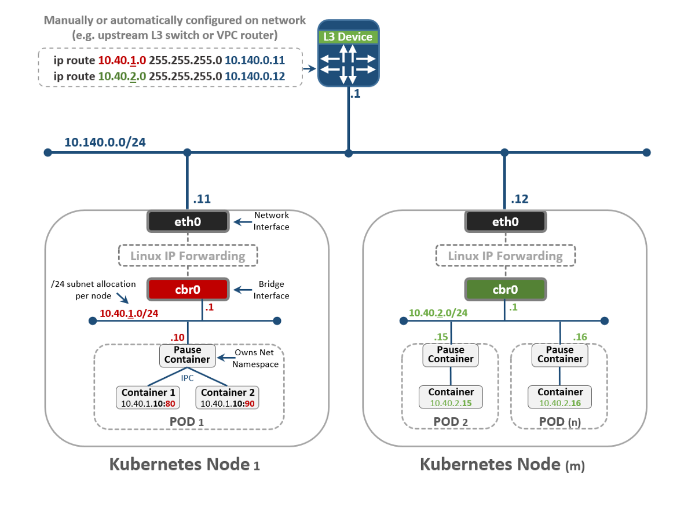

На первый взгляд это может показаться слишком сложным, но надеюсь вы сможете понять все это к концу этого поста. Во-первых, видно, что у нас есть две Kubernetes Node’ы: Node 1 и Node (m). Каждый узел имеет интерфейс eth0, как и любая машина Linux. Этот интерфейс имеет IP-адрес для внешнего мира, в нашем случае в подсети 10.140.0.0/24. Upstream L3 устройство действует как Default Gateway для маршрутизации нашего трафика. Это может быть коммутатор L3 в вашем дата-центре или VPC маршрутизатор в облаке, таком как GCP, как увидим позже. Все идет нормально?

Далее видим, что у нас есть Bridge интерфейс cbr0 внутри узла. Этот интерфейс является Default Gateway для подсети IP 10.40.1.0/24 в случае Node 1. Эта подсеть назначается Kubernetes каждой Node. Node’ы обычно получают подсеть /24, но вы можете изменить это, используя NSX-T (рассмотрим это в следующих постах). На данный момент эта подсеть является той, из которой будем выдавать IP-адреса для Pod’ов. Таким образом, любой Pod внутри Node 1 получит IP-адрес из этой подсети. В нашем случае Pod 1 имеет IP-адрес 10.40.1.10. Однако вы заметили, что в этом Pod’е есть два вложенных контейнера. Мы уже говорили, что внутри одного Pod’а может быть запущен один или несколько контейнеров, которые тесно связаны друг с другом с точки зрения функциональности. Это то, что мы видим на рисунке. Контейнер 1 слушает порт 80, а контейнер 2 — порт 90. Оба контейнера имеют один и тот же IP-адрес 10.40.1.10, но им не принадлежит Networking Namespace. Хорошо, тогда кому принадлежит этот сетевой стек? На самом деле существует специальный контейнер, который называется “Pause Container”. На диаграмме видно, что его IP-адрес это IP-адрес Pod’а для связи с внешним миром. Таким образом, Pause Container владеет этим сетевым стеком, включая сам IP-адрес 10.40.1.10, и, конечно, он перенаправляет трафик в контейнер 1 на порт 80, а также перенаправляет трафик в контейнер 2 на порт 90.

Теперь вы должны спросить, как трафик перенаправляется во внешний мир? У нас включен стандартный Linux IP Forwarding для пересылки трафика с cbr0 на eth0. Это здорово, но тогда не понятно, как L3 устройство может узнать, как переслать трафик в пункт назначения? В этом конкретном примере у нас нет динамической маршрутизации для анонса этой сети. Поэтому мы должны иметь какие-то статические маршруты на L3 устройстве. Чтобы достигнуть подсети 10.40.1.0/24 нужно переслать трафик на IP-адрес Node 1 (10.140.0.11) и для достижения подсети 10.40.2.0/24 next hope — Node (m) с IP-адресом 10.140.0.12.

Всё это здорово, но это очень непрактичный способ управления вашими сетями. Поддержка всех этих маршрутов при масштабировании вашего кластера будет абсолютным кошмаром для сетевых администраторов. Именно поэтому нужны какие-то решения, такие как CNI (Container Network Interface) в Kuberentes, чтобы управлять сетевым взаимодействием. NSX-T — одно из таких решений с очень широким функционалом и для сетевого взаимодействия, и для безопасности.

Помните, что мы рассмотрели плагин kubenet, а не CNI. Плагин kubenet — это то, что использует Google Container Engine (GKE), и способ, которым они это делают, довольно увлекателен, поскольку он полностью программно определен и автоматизирован в их облаке. Таким образом, о распределении подсетей и связанных с ними маршрутами для вас позаботится GCP. Рассмотрим это в следующей части.

### Что дальше?

Настало время руками потрогать Kuberentes. Вы можете начать практическое изучение всех этих концепций, прочитав [следующую часть этого поста](https://www.hanymichaels.com/2017/10/18/kubernetes-introduction-for-vmware-users-part-2-the-practice/).

За перевод спасибо Григорию Прялухину. Опубликовано с его разрешения.  
Ссылка на [перевод](https://medium.com/@pryalukhin/kubernetes-introduction-for-vmware-users-232cc2f69c58?fbclid=IwAR1u8Jnqa7znYntj6HnXuwCMuqqxDXGJi-AND0NFJRqNyfZCzjPRz9pVv6s).