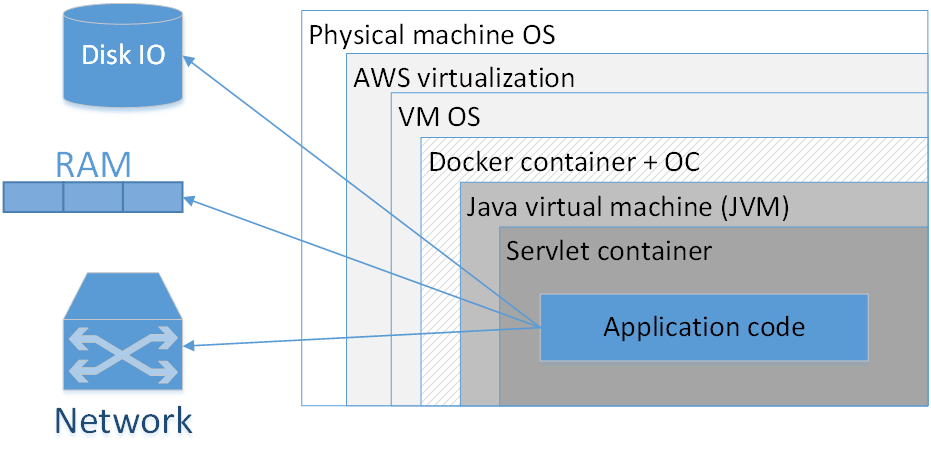
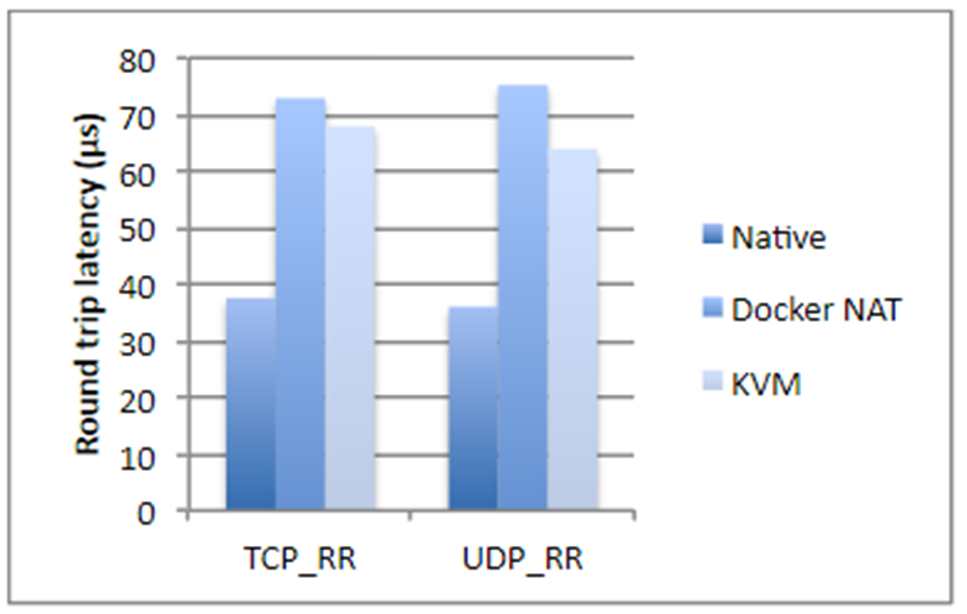
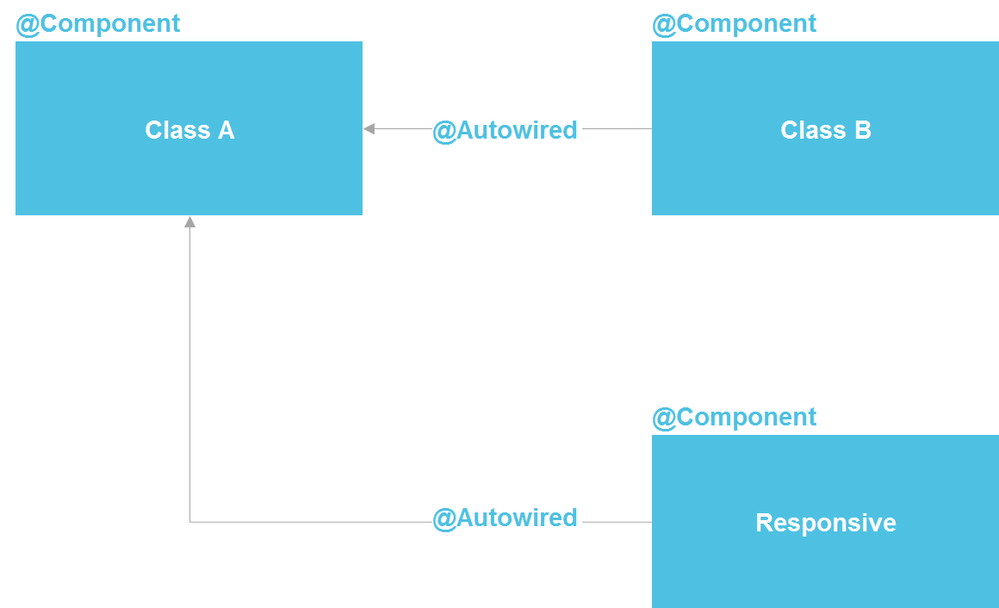
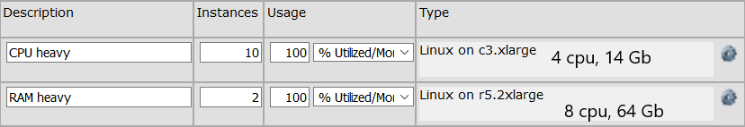
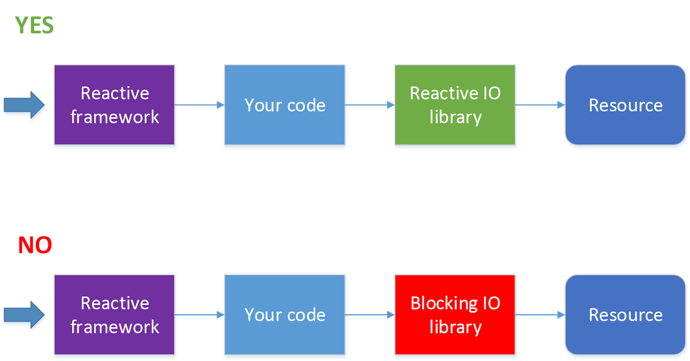

Всегда ли нужны Docker, микросервисы и реактивное программирование? / Блог компании DataArt

_Автор: [Денис Цыплаков](https://habr.com/ru/users/semenych/), Solution Architect, DataArt_

В DataArt я работаю по двум направлениям. В первом помогаю людям чинить системы, сломанные тем или иным образом и по самым разным причинам. Во втором помогаю проектировать новые системы так, чтобы они в будущем сломаны не были или, если говорить реалистичнее, чтобы сломать их было сложнее.

Если вы не делаете что-то принципиально новое, например, первый в мире интернет-поисковик или искусственный интеллект для управления запуском ядерных ракет, создать дизайн хорошей системы довольно просто. Достаточно учесть все требования, посмотреть на дизайн похожих систем и сделать примерно так же, не совершив при этом грубых ошибок. Звучит как чрезмерное упрощение вопроса, но давайте вспомним, что на дворе 2019 год, и «типовые рецепты» дизайна систем есть практически для всего. Бизнес может подкидывать сложные технические задачи — скажем, обработать миллион разнородных PDF-файлов и вынуть из них таблицы с данными о расходах — но вот архитектура систем редко отличается большой оригинальностью. Главное тут — не ошибиться с определением того, какую именно систему мы строим, и не промахнуться с выбором технологий.

В последнем пунктом регулярно возникают типичные ошибки, о некоторых из них я расскажу в статье.

В чем сложность выбора технического стека? Добавление любой технологии в проект делает его сложнее и приносит какие-то ограничения. Соответственно, добавлять новый инструмент (фреймворк, библиотеку) следует, только когда это инструмент приносит больше пользы, чем наносит вреда. В разговорах с членами команды про добавление библиотек и фреймворков я часто в шутку использую следующий прием: «Хочешь добавить новую зависимость в проект — ставишь команде ящик пива. Если считаешь, что эта зависимость ящика пива не стоит, не добавляй».

Допустим, мы создаем некое приложение, скажем, на Java и для манипуляции датами добавляем в проект библиотеку TimeMagus (пример вымышленный). Библиотека отличная, она предоставляет нам множество возможностей, отсутствующих в стандартной библиотеке классов. Чем такое решение может быть вредно? Давайте разберем по пунктам возможные сценарии:

1.  Далеко не все разработчики знают нестандартную библиотеку, порог вхождения для новых разработчиков будет выше. Возрастает шанс, что новый разработчик совершит ошибку при манипуляциях с датой при помощи неизвестной ему библиотеки.
2.  Увеличивается размер дистрибутива. Когда размер среднего приложения на Spring Boot может легко разрастись до 100 Мб, это совсем не пустяк. Я видел случаи, когда ради одного метода в дистрибутив затягивалась библиотека на 30 Мб. Это обосновывали так: «Эту я библиотеку использовал в прошлом проекте, и там есть удобный метод».
3.  В зависимости от библиотеки может заметно увеличиваться время старта.
4.  Разработчик библиотеки может забросить свое детище, тогда библиотека начнет конфликтовать с новой версией Java, или в ней обнаружится баг (вызванный например изменением временных поясов), а никакой патч не выпустят.
5.  Лицензия библиотеки в какой-то момент вступит в конфликт с лицензией вашего продукта (вы же проверяете лицензии для всех-всех продуктов, которые используете?).
6.  Jar hell — библиотеке TimeMagus нужна последняя версия библиотеки SuperCollections, затем через несколько месяцев вам необходимо подключить библиотеку для интеграции со сторонним API, которая не работает с последней версией SuperCollections, а работает только с версией 2.x. Не подключать API вы не можете никак и другой библиотеки для работы с этим API нет.

С другой стороны, стандартная библиотека предоставляет нам достаточно удобные средства для манипуляции датами, и если у вас нет необходимости например поддерживать какой-то экзотический календарь или вычислять количество дней от сегодняшнего до «второго дня третьего новолуния в предыдущий год парящего орла», возможно, стоит воздержаться от использования третьесторонней библиотеки. Даже если она совершенно замечательная и в масштабе проекта сэкономит вам целых 50 строк кода.

Рассмотренный пример достаточно прост, и я думаю, принять решение тут несложно. Но есть ряд технологий, которые широко распространены, у всех на слуху, и польза их очевидна, что делает выбор более сложным — они действительно предоставляют серьезные преимущества разработчику. Но это не всегда должно служить поводом затягивать их в свой проект. Давайте рассмотрим некоторые из них.

## Docker

До появления этой действительно классной технологии при развертывании систем возникало множество неприятных и сложных вопросов, связанных с конфликтом версий и непонятными зависимостями. Docker позволяет упаковать слепок состояния системы, выкатить его в продакшн и там запустить. Это позволяет упомянутых конфликтов избежать, что, конечно, здорово.

Раньше это делалось каким-то чудовищным образом, а некоторые задачи не решались вообще никак. Например, у вас есть приложение на PHP, которое использует библиотеку ImageMagick для работы с изображениями, также вашему приложению нужны специфические настройки php.ini, а само приложение хостится при помощи Apache httpd. Но есть проблема: некоторые регулярные рутины реализованы запуском Python-скриптов из cron, и библиотека, используемая этими скриптами, конфликтует с версиями библиотек, используемыми в вашем приложении. Докер позволяет упаковать все ваше приложение вместе с настройками, библиотеками и HTTP-сервером в один контейнер, который обслуживает запросы на 80-ом порту, а рутины — в другой контейнер. Все вместе будет прекрасно работать, и о конфликте библиотек можно будет забыть.

Стоит ли использовать Docker для упаковки каждого приложения? Мое мнение: нет, не стоит. На картинке представлена типичная композиция докеризированного приложения, развернутого в AWS. Прямоугольниками здесь обозначены слои изоляции, которые у нас есть.

Самый большой прямоугольник — физическая машина. Далее — операционная система физической машины. Затем — амазоновский виртуализатор, потом — ОС виртуальной машины, дальше — докер-контейнер, за ним — ОС контейнера, JVM, потом — Servlet-контейнер (если это веб-приложение), и уже внутри него содержится код вашего приложения. Т. е. мы уже видим довольно много слоев изоляции.

Ситуация будет выглядеть еще хуже, если мы посмотрим на аббревиатуру JVM. JVM — это, как ни странно, Java Virtual Machine, т. е., вообще-то, как минимум одна виртуальная машина в Java у нас есть всегда. Добавление сюда еще дополнительного Docker-контейнера, во-первых, часто не дает такого уж заметного преимущества, потому что JVM сама по себе уже неплохо изолирует нас от внешнего окружения, во-вторых, не обходится даром.

Я взял цифры из исследования компании IBM, если не ошибаюсь, двухлетней давности. Кратко, если мы говорим о дисковых операциях, использовании процессора или доступе памяти, Docker почти не добавляет оверхеда (буквально доли процента), но если речь идет о network latency, задержки вполне ощутимы. Они не гигантские, но в зависимости от того, какое у вас приложение, могут вас неприятно удивить.

Плюс ко всему Docker съедает дополнительное место на диске, занимает часть памяти, добавляет start up time. Все три момента для большинства систем некритичны — обычно и места на диске, и памяти достаточно много. Время запуска, как правило, тоже проблема не критическая, главное, чтобы приложение запускалось. Но все же возникают ситуации, когда памяти может не хватать, и суммарное время старта системы, состоящей из двадцати зависимых сервисов, уже достаточно большое. К тому же, это сказывается на стоимости хостинга. И если вы занимаетесь каким-нибудь высокочастотным трейдингом, Docker вам категорически не подходит. В общем случае любое приложение, чувствительное к задержкам в сети в пределах до 250–500 мс, лучше не докеризировать.

Также с докером заметно усложняется разбор проблем в сетевых протоколах, растут не только задержки, но и все тайминги становятся другими.

### Когда Docker действительно нужен?

Когда у нас разные версии JRE, и при этом хорошо бы JRE тащить с собой. Бывают случаи, когда для запуска нужна определенная версия Java (не «последняя Java 8», а что-то более специфическое). В этом случае хорошо упаковать JRE вместе с приложением и запускать как контейнер. В принципе, понятно, что разные версии Java можно поставить на целевую систему за счет JAVA_HOME и т. д. Но Docker в этом смысле заметно удобнее, потому что вы знаете точную версию JRE, все упаковано вместе и с другой JRE даже случайно приложение не запустится.

Также Docker необходим, если у вас есть зависимости на какие-то бинарные библиотеки, например, для обработки изображений. В этом случае неплохой идеей может оказаться упаковка всех необходимых библиотек вместе с самим Java-приложением.

Следующий кейс относится к системе, представляющим собой сложный композит из разных сервисов, написанных на различных языках. У вас есть кусочек на Node.js, есть часть на Java, библиотека на Go, а в придачу — какой-нибудь Machine Learning на Python. Весь этот зоопарк надо долго и тщательно настраивать, чтобы научить его элементы видеть друг друга. Зависимости, пути, IP-адреса — все это надо расписать и аккуратно поднять в продакшене. Конечно, в этом случае Docker вам здорово поможет. Более того, делать это без его помощи попросту мучительно.

Докер может обеспечить некоторое удобство, когда для запуска приложения вам в командной строке надо указывать множество разных параметров. С другой стороны, с этим прекрасно справляются bash-скрипты, часто из одной строки. Сами решайте, что использовать лучше.

Последнее, что навскидку приходит в голову — ситуация, когда вы используете, скажем, Kubernetes, и вам нужно делать оркестрацию системы, т. е. поднимать какое-то количество различных микросервисов, автоматически масштабирующихся по определенным правилам.

Во всех остальных случаях Spring Boot оказывается достаточно, чтобы упаковать все в один jar-файл. И, в принципе, спрингбутовый jar — неплохая метафора Docker-контейнера. Это, понятно, не одно и то же, но по степени удобства развертывания они действительно похожи.

## Kubernetes

Что делать, если мы используем Kubernetes? Начнем с того, что эта технология позволяет деплоить на разные машины большое количество микросервисов, управлять ими, делать autoscaling и т. д. Однако существует достаточно много приложений, которые позволяют управлять оркестрацией, наример, Puppet, CF engine, SaltStack и прочие. Сам же Kubernetes, безусловно, хорош, но может добавлять значительный overhead, жить с которым готов далеко не каждый проект.

Мой любимый инструмент — Ansible в сочетании с Terraform там, где это нужно. Ansible достаточно простой декларативный легкий инструмент. Он не требует установок специальных агентов и имеет вполне понятный синтаксис конфигурационных файлов. Если вы знакомы с Docker compose, сразу увидите перекликающиеся секции. И если вы используете Ansible, нет необходимости докерезировать — можно развертывать системы более классическими средствами.

Понятно, что все равно это разные технологии, но есть какое-то множество задач, в которых они взаимозаменяемы. И добросовестный подход к проектированию требует анализа, какая технология больше подойдет для разрабатываемой системы. И как будет лучше соответствовать ей через несколько лет.

Если количество различных сервисов в вашей системе невелико и их конфигурация относительно проста, например, у вас всего один jar-файл, при этом какого-то внезапного, взрывного роста сложности вы не видите, возможно, стоит обойтись классическими механизмами развертывания.

Тут возникает вопрос «подождите, как один jar-файл?». Система же должна состоять из множества как можно более атомарных микросервисов! Давайте разберем, кому и что система должна с микросервисами.

## Микросервисы

Прежде всего, микросервисы позволяют достичь большей гибкости и масштабируемости, позволяют гибко версионировать отдельные части системы. Предположим, у нас есть какое-то приложение, которое в продакшене уже много лет. Функционал растет, но мы не можем бесконечно развивать его экстенсивным образом. Например.

У нас есть приложение на Spring Boot 1 и Java 8. Прекрасное, стабильное сочетание. Но на дворе 2019 год и, хотим мы того или нет, нужно двигаться в сторону Spring Boot 2 и Java 12. Даже относительно простой переход большой системы на новую версию Spring Boot может быть весьма трудозатратен, а про прыжок над пропастью с Java 8 на Java 12 я и говорить не хочу. Т. е. в теории все просто: мигрируем, правим возникшие проблемы, все тестируем и запускаем в production. На практике это может означать несколько месяцев работы, не приносящей бизнесу нового функционала. Немножечко переехать на Java 12, как вы понимаете, тоже не получится. Тут нам может помочь микросервисная архитектура.

Мы может выделить какую-то компактную группу функций нашего приложения в отдельный сервис, мигрировать эту группу функций на новый технический стек и за относительно короткое время выкатить это в продакшен. Повторять процесс кусочек за кусочком до полного исчерпания старых технологий.

Также микросервисы позволяют обеспечить fault isolation, когда один упавший компонент не рушит всю систему.

Микросервисы позволяют нам иметь гибкий технический стек, т. е. не писать все монолитно на одном языке и одной версии, а при необходимости использовать разный технический стек для отдельных компонент. Разумеется, лучше когда вы используете однородный технический стек, но это не всегда возможно, и в таком случае микросервисы могут выручить.

Также микросервисы позволяют техническим способом решить ряд менеджерских проблем. Например, когда ваша большая команда состоит из отдельных групп, работающих в разных компаниях (сидящих в разных временных зонах и говорящих на разных языках). Микросервисы помогают изолировать это организационное многообразие по компонентам, которые будут развиваться отдельно. Проблемы одной части команды будут оставаться внутри одного сервиса, а не расползаться по всему приложению.

Но микросервисы — не единственный способ решения перечисленных проблем. Как ни странно, несколько десятков лет назад для половины из них люди придумали классы, а чуть позже — компоненты и паттерн Inversion of Control.

Если мы посмотрим на Spring, увидим, что фактически это микросервисная архитектура внутри Java-процесса. Мы можем объявлять компонент, который, по сути, представляет собой сервис. У нас есть возможность делать lookup через @Autowired, есть средства управления жизненным циклом компоненты и возможность раздельно конфигурировать компоненты из десятка разных источников. В принципе, мы получаем почти все то же самое, что имеем с микросервисами — только внутри одного процесса, что существенно сокращает издержки. Обычный Java-class — тот же API-контракт, который точно так же позволяет изолировать детали реализации.

Строго говоря, в Java-мире микросервисы больше всего похожи на OSGi — там мы имеем практически точную копию всего, что есть в микросервисах, разве что, кроме возможности использования разных языков программирования и исполнения кода на разных серверах. Но даже оставаясь в пределах возможностей Java-классов, мы имеем достаточно мощный инструмент для решения большого количества проблем с изоляцией.

Даже в «менеджерском» сценарии с изоляцией команды мы можем создать отдельный репозиторий, который содержит отдельный Java-модуль с четким внешним контрактом и набором тестов. Это существенно сократит возможности одной команды по неосторожности усложнить жизнь другой команды.

Мне неоднократно приходилось слышать, что изолировать детали реализации без микросервисов никак нельзя. Но я могу ответить, что вся software-индустрия как раз про изоляцию реализации. Для этого была придумана сначала подпрограмма (в 50-х годах прошлого века), потом функции, процедуры, классы, еще позже микросервисы. Но то, что микросервисы в этом ряду появились последними, не делает их наивысшей точкой развития и не обязывает нас с вами всегда прибегать к их помощи.

При использовании микросервисов надо также принимать во внимание, что вызовы между ними занимают некоторое время. Часто это неважно, но мне доводилось видеть случай, когда заказчику необходимо было уместить время ответа системы в 3 секунды. Это было контрактное обязательство для подключения к сторонней системе. Цепочка вызовов проходила через несколько десятков атомарных микросервисов, и накладные расходы на совершение HTTP-вызовов никак не позволяли ужаться в 3 секунды. В целом надо понимать, что любое разделение монолитного кода на некоторое количество сервисов неизбежно ухудшает общую производительность системы. Просто потому, что данные не могут телепортироваться между процессами и серверами «за бесплатно».

### Когда микросервисы все же нужны?

В каких же случаях монолитное приложение действительно нужно разбить на несколько микросервисов? Во-первых, когда в функциональных областях присутствует несбалансированное использование ресурсов.

Например, у нас есть группа API-вызовов, которые выполняют вычисления, требующие большого количества процессорного времени. И есть группа API-вызовов, которые выполняются очень быстро, но требуют для выполнения держать в памяти громоздкую структуру данных на 64 Гб. Для первой группы нам нужна группа машин, имеющих в общей сложности 32 процессора, для второй достаточно одной машины (ОК, пусть будет два машины для отказоустойчивости) с 64 Гб памяти. Если у нас монолитное приложение, то нам на каждой машине будут нужны 64 Гб памяти, что увеличивает стоимость каждой машины. Если же эти функции разделены на два отдельных сервиса, мы можем сэкономить ресурсы за счет оптимизации сервера под конкретную функцию. Конфигурация серверов может выглядеть например вот так:

Микросервисы нужны и если нам нужно серьезно масштабировать какую-то узкую функциональную область. Например, сотня API-методов вызываются с периодичностью 10 раз в секунду, а, скажем, четыре API-метода вызываются 10 тысяч раз в секунду. Масштабировать всю систему часто нет необходимости, т. е. мы, конечно, можем размножить все 100 методов на множество серверов, но это, как правило, заметно дороже и сложнее, чем масштабирование узкой группы методов. Мы можем выделить эти четыре вызова в отдельный сервис и масштабировать только его на большое количество серверов.

Также понятно, что микросервис может нам понадобиться, если отдельная функциональная область у нас написана, например, на Python. Потому что какая-то библиотека (скажем, для Machine Learning) оказалась доступна только на Python, и мы хотим выделить ее в отдельный сервис. Также имеет смысл сделать микросервис, если какая-то часть системы подвержена сбоям. Хорошо, конечно, писать код так, чтобы сбоев не было в принципе, но причины могут быть и внешними. Да и от собственных ошибок никто не застрахован. В этом случае баг можно изолировать внутри отдельного процесса.

Если в вашем приложении ничего из вышеперечисленного нет и в обозримой перспективе не предвидится, скорее всего, монолитное приложение вам подойдет лучше всего. Единственное — рекомендую писать его так, чтобы не связанные друг с другом функциональные области не зависели друг от друга в коде. Чтобы при необходимости не связанные между собой функциональные области можно было отделить друг от друга. Впрочем, это всегда хорошая рекомендация, следование которой повышает внутреннюю непротиворечивость и приучает аккуратно формулировать контракты модулей.

## Реактивная архитектура и реактивное программирование

Реактивный подход — вещь относительно новая. Моментом его появления можно считать 2014 год, когда был опубликован [The Reactive Manifesto](https://www.reactivemanifesto.org/). Уже через два года после публикации манифеста он был у всех на слуху. Это действительно революционный подход к проектированию систем. Его отдельные элементы использовались десятки лет назад, но все принципы реактивного подхода вместе, в том виде, как это изложено в манифесте, позволили индустрии сделать серьезный шаг вперед к проектированию более надежных и более высокопроизводительных систем.

К сожалению, реактивный подход к проектированию часто путают с реактивным программированием. На вопрос, зачем в проекте использовать реактивную библиотеку, мне доводилось слышать ответ: «Это реактивный подход, ты что реактивный манифест не читал!?» Манифест я читал и подписывал, но, вот беда, реактивное программирование не имеет к реактивному подходу к проектированию систем прямого отношения, кроме того что в названиях обоих есть слово «реактивный». Можно легко сделать реактивную систему, используя на 100% традиционный набор инструментов, и создать совершенно не реактивную систему, используя новейшие наработки функционального программирования.

Реактивный подход к проектированию систем — достаточно общий принцип, применимый к очень многим системам — он определенно заслуживает отдельной статьи. Здесь же я хотел бы рассказать о применимости реактивного программирования.

В чем суть реактивного программирования? Сначала рассмотрим, как работает обычная нереактивная программа.

Нитью исполняется какой-то код, делающий какие-то вычисления. Затем наступает необходимость произвести какую-то операцию ввода-вывода, например, HTTP-запрос. Код посылает по сети пакет, и нить блокируется в ожидании ответа. Происходит переключение контекста, и на процессоре начинает исполняться другая нить. Когда по сети приходит ответ, контекст опять переключается, и первая нить продолжает исполнение, обрабатывая ответ.

Как такой же фрагмент кода будет работать в реактивном стиле? Нить исполняет вычисления, посылает HTTP-запрос и вместо того чтобы заблокироваться и при получении результата синхронно обработать его, описывает код (оставляет callback) который должен быть исполнен в качестве реакции (отсюда слово реактивный) на результат. После этого нить продолжает работу, делая какие-то другие вычисления (может быть, как раз обрабатывая результаты других HTTP-запросов) без переключения контекста.

Основное преимущество здесь — отсутствие переключения контекста. В зависимости от архитектуры системы эта операция может занимать несколько тысяч тактов. Т. е. для процессора с тактовой частотой 3 Ghz переключение контекста займет не менее микросекунды, на самом деле, за счет инвалидации кэша и т. п. скорее несколько десятков микросекунд. Говоря практически, для среднего Java-приложения, обрабатывающего много коротких HTTP-запросов — прирост производительности может составить 5-10%. Нельзя сказать, что решающе много, но, скажем, если вы арендуете 100 серверов по 50 $/мес каждый — вы сможете сэкономить $500 в месяц на хостинге. Не супермного, но хватит, чтобы несколько раз напоить команду пивом.

Итак, вперед за пивом? Давайте рассмотрим ситуацию подробно.

Программу в классическом императивном стиле значительно проще читать, понимать и как следствие отлаживать и модифицировать. В принципе, хорошо написанная реактивная программа тоже достаточно понятно выглядит, проблема в том, что написать хорошую, понятную не только автору кода здесь и сейчас, но и другому человеку через полтора года, реактивную программу намного сложнее. Но это достаточно слабый аргумент, я не сомневаюсь, что для читателей статьи писать простой и понятный реактивный код не составляет проблемы. Давайте рассмотрим другие аспекты реактивного программирования.

Далеко не все операции ввода-вывода поддерживают неблокирующие вызовы. Например, JDBC на текущий момент не поддерживает (в этом направлении идут работы см. ADA, R2DBC, но пока все это не вышло на уровень релиза). Поскольку сейчас 90 % всех приложений ходят к базам данных, использование реактивного фреймворка автоматически из достоинства превращается в недостаток. Для такой ситуации есть решение — обрабатывать HTTP-вызовы в одном пуле потоков, а обращения к базе данных в другом пуле потоков. Но при этом процесс значительно усложняется, и без острой необходимости я бы так делать не стал.

### Когда стоит использовать реактивный фреймворк?

Использовать фреймворк, позволяющий производить реактивную обработку запросов, стоит, когда запросов у вас много (несколько сотен секунду и более) и при этом на обработку каждого из них тратится очень небольшое количество тактов процессора. Самый простой пример — проксирование запросов или балансировка запросов между сервисами или какая-то достаточно легковесная обработка ответов, пришедших от другого сервиса. Где под сервисом мы понимаем нечто, запрос к чему можно послать асинхронно, например, по HTTP.

Если же при обработке запросов вам надо будет блокировать нить в ожидании ответа, или обработка запросов занимает относительно много времени, например, надо конвертировать картинку из одного формата в другой, писать программу в реактивном стиле, возможно, не стоит.

Также не стоит без необходимости писать в реактивном стиле сложные многошаговые алгоритмы обработки данных. Например, задачу «найти в каталоге и всех его подкаталогах файлы с определенными свойствами, сконвертировать их содержимое и переслать другому сервису» можно реализовать в виде набора асинхронных вызовов, но, в зависимости от деталей задачи, такая реализация может выглядеть совершенно непрозрачно и при этом не давать заметных преимуществ перед классическим последовательным алгоритмом. Скажем, если эта операция должна запускаться раз в сутки, и нет большой разницы, будет она исполняться 10 или 11 минут, возможно, стоит выбрать не самую что ни на есть лучшую, а более простую реализацию.

## Заключение

В заключение хочется сказать, что любая технология всегда предназначена для решения конкретных задач. И если при проектировании системы в обозримой перспективе эти задачи перед вами не стоят, скорее всего, эта технология вам здесь и сейчас не нужна, какой бы прекрасной она при этом ни была.