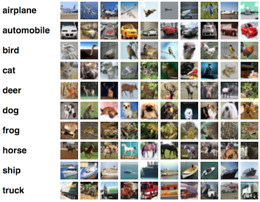
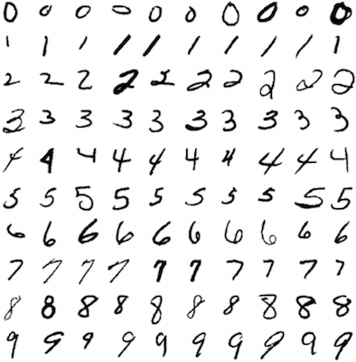
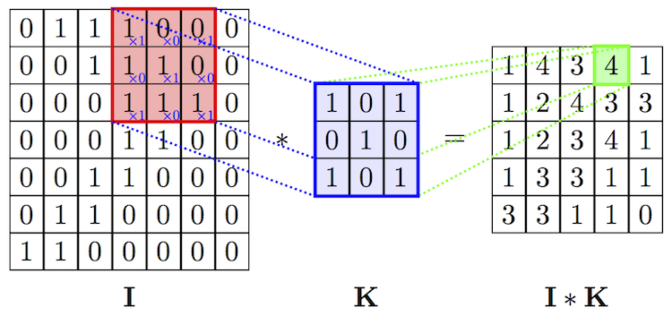
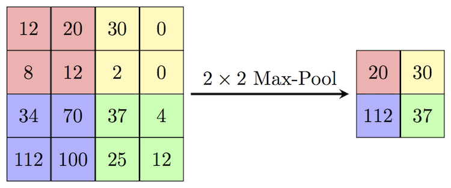
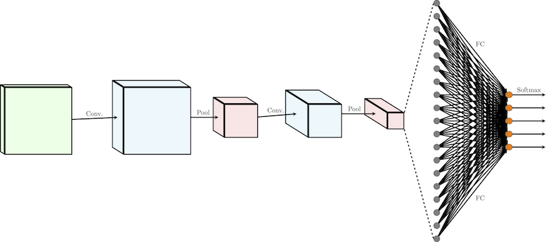
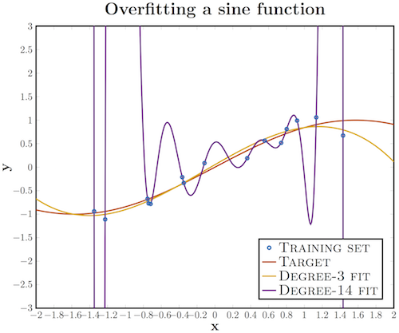
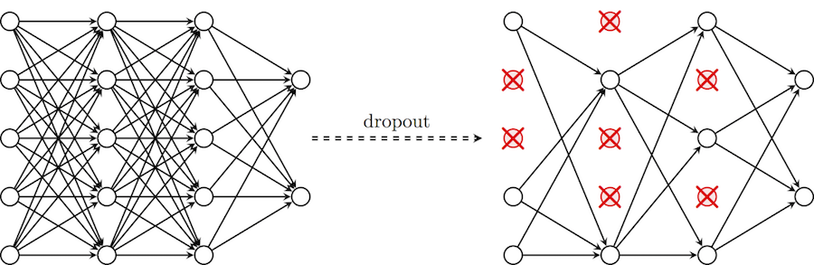

Глубокое обучение для новичков: распознаем изображения с помощью сверточных сетей / Блог компании Wunder Fund

## Введение

Представляем вторую статью в серии, задуманной, чтобы помочь быстро разобраться в технологии _глубокого обучения_; мы будем двигаться от базовых принципов к нетривиальным особенностям с целью получить достойную производительность на двух наборах данных: MNIST (классификация рукописных цифр) и CIFAR-10 (классификация небольших изображений по десяти классам: самолет, автомобиль, птица, кошка, олень, собака, лягушка, лошадь, корабль и грузовик).

[На прошлом уроке](https://habrahabr.ru/company/wunderfund/blog/314242/) мы ввели базовые понятия глубокого обучения и показали, как можно быстро смоделировать модели нейронных сетей с помощью фреймворка Keras. Напоследок многослойный перцептрон (MLP), содержащий два слоя, применили к MNIST, достигнув уровня точности 98.2%, причем это значение достаточно просто улучшить. Но все же полносвязный перцептрон обычно не выбирают для задач, связанных с распознаванием изображений — в этом случае намного чаще пользуются преимуществами сверточных нейронных сетей (Convolutional Neural Networks, CNN). Пройдя этот курс, вы будете понимать принцип работы и научитесь строить CNN в Keras, достигая хорошего уровня точности на CIFAR-10.

Эта статья предполагает знакомство с [предыдущей статьей цикла](https://habrahabr.ru/company/wunderfund/blog/314242/).

## Обработка изображений

Упомянутый выше многослойный перцептрон представляет собой самую мощную и возможных нейронных сетей прямого распространения. Он состоит из нескольких слоем, где каждый слой организован таким образом, что каждый нейрон в одном слое получает свою копию _всех_ выходных данных предыдущего слоя. Эта модель идеально подходит для определенных типов задач, например, обучение на ограниченном количество более или менее неструктурированных параметров.

Тем не менее, посмотрим, что происходит с количеством параметров (весов) в такой модели, когда ей на вход поступают необработанные данные. Например, CIFAR-10 содержит 32 x 32 x 3 цветных изображений, и если мы будем считать каждый канал каждого пикселя независимым входным параметром для MLP, каждый нейрон в первом скрытом слое добавляет к модели около 3000 новых параметров! И с ростом размера изображений ситуация быстро выходит из-под контроля, причем происходит это намного раньше, чем изображения достигают того размера, с которыми обычно работают пользователи реальных приложений.

Одно из популярных решений — _понижать разрешение_ изображений до той степени, когда MLP становится применим. Тем не менее, когда мы просто понижаем разрешение, мы рискуем потерять большое количество информации, и было бы здорово, если бы можно было осуществлять полезную первичную обработку информации еще до применения понижения качества, не вызывая при этом взрывного роста количества параметров модели.

## Свертка функций

Оказывается, существует весьма эффективный способ решения этой задачи, который обращает в нашу пользу саму структуру изображения: предполагается, что пиксели, находящиеся _близко_ друг к другу, теснее “взаимодействуют” при формировании интересующего нас признака, чем пиксели, расположенные в противоположных углах. Кроме того, если в процессе классификации изображения небольшая черта считается очень важной, не будет иметь значения, на каком участке изображения эта черта обнаружена.

Введем понятие **оператора свертки**. Имея двумерное изображение **I** и небольшую матрицу **K** размерности  (так называемое ядро свертки), построенная таким образом, что графически кодирует какой-либо признак, мы вычисляем свернутое изображение **I * K**, накладывая ядро на изображение всеми возможными способами и записывая сумму произведений элементов исходного изображения и ядра:

_%7Bxy%7D%20%3D%20%5Csum_%7Bi%3D1%7D%5Eh%5Csum_%7Bj%3D1%7D%5EwK_%7Bij%7D%5Ctimes%20I_%7Bx%2Bi-1%2C%20y%2Bj-1%7D)

На самом деле, точное определение предполагает, что матрица ядра будет транспонирована, но для задач машинного обучения не важно, выполнялась эта операция или нет.

На рисунках ниже схематически изображена вышеуказанная формула, а также представлен результат применения операции свертки (с двумя разными ядрами) к изображению с целью выделить контуры объекта.

  

## Сверточные и субдискретизирующие слои

Оператор свертки составляет основу сверточного слоя (convolutional layer) в CNN. Слой состоит из определенного количества ядер  (с аддитивными составляющими смещения  для каждого ядра) и вычисляет свертку выходного изображения предыдущего слоя с помощью каждого из ядер, каждый раз прибавляя составляющую смещения. В конце концов ко всему выходному изображению может быть применена функция активации . Обычно входной поток для сверточного слоя состоит из d каналов, например, red/green/blue для входного слоя, и в этом случае ядра тоже расширяют таким образом, чтобы они также состояли из _d каналов_; получается следующая формула для одного канала выходного изображения сверточного слоя, где **K** — ядро, а _b_ — составляющая смещения:

_%7Bx%2Cy%7D%20%3D%20%5Csigma(b%20%2B%20%5Csum_%7Bi%3D1%7D%5Eh%5Csum_%7Bj%3D1%7D%5Ew%5Csum_%7Bk%3D1%7D%5EdK_%7Bijk%7D%5Ctimes%20I_%7Bx%2Bi-1%2Cy%2Bj-1%2Ck%7D))

Обратите внимание, что так как все, что мы здесь делаем — это сложение и масштабирование входных пикселей, ядра можно получить из имеющейся обучающей выборки методом _градиентного спуска_, аналогично вычислению весов в многослойном перцептроне (MLP). На самом деле MLP мог бы в совершенстве справиться с функциями сверточного слоя, но времени на обучение (как и обучающих данных) потребовалось бы намного больше.

Заметим также, что оператор свертки вовсе не ограничен двухмерными данными: большинство фреймворков глубокого обучения (включая Keras) предоставляют слои для одномерной или трехмерной свертки прямо “из коробки”.

Стоит также отметить, что хотя сверточный слой сокращает количество параметров по сравнению с полносвязным слоем, он использует больше **гиперпараметров** — параметров, выбираемых _до_ начала обучения.

В частности, выбираются следующие гиперпараметры:

*   _Глубина_ (_depth_) — сколько ядер и коэффициентов смещения будет задействовано в одном слое;
*   _Высота_ (_height_) и _ширина_ (_width_) каждого ядра;
*   _Шаг_ (_stride_) — на сколько смещается ядро на каждом шаге при вычислении следующего пикселя результирующего изображения. Обычно его принимают равным 1, и чем больше его значение, тем меньше размер выходного изображения;
*   _Отступ_ (_padding_): заметим, что свертка любым ядром размерности более, чем 1х1 _уменьшит_ размер выходного изображения. Так как в общем случае желательно сохранять размер исходного изображения, рисунок дополняется нулями по краям.

Как читатель уже догадался, операции свертки — не единственные операции в CNN (хотя существуют многообещающие исследования на тему “чисто-сверхточных” сетей); они чаще применяются для выделения наиболее полезных признаков перед субдискретизацией (downsampling) и последующей обработкой с помощью MLP.

Популярный способ субдискретизации изображения — слой _подвыборки_ (также называемый слоем _субдискретизации_, по-английски _downsampling_ или _pooling_ layer), который получает на вход маленькие отдельные фрагменты изображения (обычно 2х2) и объединяет каждый фрагмент в одно значение. Существует несколько возможных способов агрегации, наиболее часто из четырех пикселей выбирается максимальный. Этот способ схематически изображен ниже.

## Итого: обычная CNN

Теперь, когда у нас есть все строительные блоки, давайте рассмотрим, как выглядит обычная CNN целиком!  

Обычную архитектуру CNN для распределения изображений по _k_ классам можно разделить на две части: цепочка чередующихся слоев свертки/подвыборки  (иногда с несколькими слоями свертки подряд) и несколько полносвязных слоев (принимающих каждый пиксель как независимое значение) с слоем softmax в качестве завершающего. Я не говорю здесь о функциях активации, чтобы наша схема стала проще, но не забывайте, что обычно после каждого сверточного или полносвязного слоя ко всем выходным значениям применяется функция активации, например, ReLU.

Один проход  влияет на изображение следующим образом: он сокращает длину и ширину определенного канала, но увеличивает его значение (глубину).

Softmax и перекрестная энтропия более подробно рассмотрены на предыдущем уроке. Напомним, что функция softmax превращает вектор действительных чисел в вектор _вероятностей_ (неотрицательные действительные числа, не превышающие 1). В нашем контексте выходные значения являются вероятностями попадания изображения в определённый класс. Минимизация потерь перекрестной энтропии обеспечивает уверенность в определении принадлежности изображения определенному классу, не принимая во внимание вероятность остальных классов, таким образом, для вероятностных задач softmax предпочтительней, чем, например, метод квадратичной ошибки.

## Отступление: переобучение, регуляризация и dropout

Впервые (и, надеюсь, только однажды) я обращу ваше внимание на тему, на первый взгляд, не относящуюся к предмету. Она касается очень важного подводного камня глубокого обучения — проблемы **переобучения** (overfitting). Хотя эта тема будет основной в следующей статье цикла, отрицательный эффект переобучения заметно проявляется на сетях, подобных той, что мы собираемся построить, а значит, необходимо найти способ защититься от этого явления прежде, чем мы пойдем дальше. К счастью, существует очень простой метод, который мы и применим.

Переобучение — это излишне точное соответствие нейронной сети конкретному набору обучающих примеров, при котором сеть теряет способность к обобщению. Другими словами, наша модель могла выучить обучающее множество (вместе с шумом, который в нем присутствует), но она не смогла распознать скрытые процессы, которые это множество породили. В качестве примера рассмотрим задачу аппроксимации синусоиды с аддитивным шумом.

У нас есть обучающее множество (синие кружки), полученное из исходной кривой синуса, с некоторым количеством шума. Если мы приложим к этим данным график многочлена третьей степени, мы получим хорошую аппроксимацию исходной кривой. Кто-то возразит, что многочлен 14-й степени подошел бы лучше; действительно, так как у нас есть 15 точек, такая аппроксимация идеально описала бы обучающую выборку. Тем не менее, в этом случае введение дополнительных параметров в модель приводит к катастрофическим результатам: из-за того, что наша аппроксимация учитывает шумы, она не совпадает с исходной кривой нигде, кроме обучающих точек.

У глубоких сверточных нейронных сетей масса разнообразных параметров, особенно это касается полносвязных слоев. Переобучение может проявить себя в следующей форме: если у нас недостаточно обучающих примеров, маленькая группа нейронов может стать ответственной за большинство вычислений, а остальные нейроны станут избыточны; или наоборот, некоторые нейроны могут нанести ущерб производительности, при этом другие нейроны из их слоя не будут заниматься ничем, кроме исправления их ошибок.

Чтобы помочь нашей сети не утратить способности к обобщению в этих обстоятельствах, мы вводим приемы _регуляризации_: вместо сокращения количества параметров, мы накладываем ограничения на параметры модели во время обучения, не позволяя нейронам изучать шум обучающих данных. Здесь я опишу прием **dropout**, который сначала может показаться “черной магией”, но на деле помогает исключить ситуации, описанные выше. В частности, dropout с параметром p за одну итерацию обучения проходит по всем нейронам определенного слоя и с вероятностью p _полностью исключает их из сети на время итерации_. Это заставит сеть обрабатывать _ошибки_ и не полагаться на существование определенного нейрона (или группы нейронов), а полагаться на “_единое мнение_” (consensus) нейронов внутри одного слоя. Это довольно простой метод, который эффективно борется с проблемой переобучения сам, без необходимости вводить другие регуляризаторы. Схема ниже иллюстрирует данный метод.

## Применение глубокой CNN к CIFAR-10

В качестве практической части построим глубокую сверточную нейронную сеть и применим ее к классификации изображений из набора CIFAR-10.

Импорты те же, что и [в прошлый раз](https://habrahabr.ru/company/wunderfund/blog/314242/), за исключением того что мы используем большее разнообразие слоев:

    from keras.datasets import cifar10 
    from keras.models import Model 
    from keras.layers import Input, Convolution2D, MaxPooling2D, Dense, Dropout, Flatten
    from keras.utils import np_utils 
    import numpy as np

  

    Using Theano backend.

Как уже говорилось, обычно CNN использует больше гиперпараметров, чем MLP. В этом руководстве мы все еще будем использовать заранее известные “хорошие” значения, но не будем забывать, что в последующей лекции я расскажу, как их правильно выбирать.

Зададим следующие гиперпараметры:

*   batch_size — количество обучающих образцов, обрабатываемых одновременно за одну итерацию алгоритма градиентного спуска;
*   num_epochs — количество итераций обучающего алгоритма по всему обучающему множеству;
*   kernel_size — размер ядра в сверточных слоях;
*   pool_size — размер подвыборки в слоях подвыборки;
*   сonv_depth — количество ядер в сверточных слоях;
*   drop_prob (dropout probability) — мы будем применять dropout после каждого слоя подвыборки, а также после полносвязного слоя;
*   hidden_size — количество нейронов в полносвязном слое MLP.

**NB**: я задал 200 итераций, что может занять слишком много времени, если в вашем распоряжении нет графического процессора (в этом случае узким местом будут сверточные слои). Если вы собираетесь обучать сеть на CPU, стоит сократить количество итераций и/или ядер.

    batch_size = 32 
    num_epochs = 200 
    kernel_size = 3 
    pool_size = 2 
    conv_depth_1 = 32 
    conv_depth_2 = 64 
    drop_prob_1 = 0.25 
    drop_prob_2 = 0.5 
    hidden_size = 512 

Загрузка и первичная обработка CIFAR-10 осуществляется ровно так же, как и загрузка и обработка MNIST, где Keras выполняет все автоматически. Единственное отличие состоит в том, что теперь мы не рассматриваем каждый пиксель как независимое входное значение, и поэтому мы не переносим изображение в одномерное пространство. Мы снова преобразуем интенсивность пикселей так, чтобы она попадала в отрезок \[0,1\] и используем прямое кодирование для выходных значений.

Тем не менее, в этот раз этот этап будет выполнен для более общего случая, что позволит проще приспосабливаться к новым наборам данных: размер будет не жестко задан, а вычислен из размера набора данных, количество классов будет определено по количеству уникальных меток в обучающем множестве, а нормализация будет выполнена путем деления всех элементов на максимальное значение обучающего множества.

**NB**: мы также разделим тестовое множество на максимальное значение _обучающего_ множества, потому что нашим алгоритмам не позволено видеть тестовые данные до того как завершится процесс обучения, и поэтому мы не можем вычислять на их основе никакие статистические метрики кроме как применения тех же трансформаций, что происходили с обучающим множеством.

    (X_train, y_train), (X_test, y_test) = cifar10.load_data() 
    
    num_train, depth, height, width = X_train.shape 
    num_test = X_test.shape[0] 
    num_classes = np.unique(y_train).shape[0] 
    
    X_train = X_train.astype('float32') 
    X_test = X_test.astype('float32')
    X_train /= np.max(X_train) 
    X_test /= np.max(X_train) 
    
    Y_train = np_utils.to_categorical(y_train, num_classes) 
    Y_test = np_utils.to_categorical(y_test, num_classes) 

Настало время моделирования! Наша сеть будет состоять из четырех слоев `Convolution_2D` и слоев `MaxPooling2D` после второй и четвертой сверток. После первого слоя подвыборки мы удваиваем количество ядер (вместе с описанным выше принципом принесения высоты и ширины в жертву глубине). После этого выходное изображение слоя подвыборки трансформируется в одномерный вектор (слоем `Flatten`) и проходит два полносвязных слоя (`Dense`). На всех слоях, кроме выходного полносвязного слоя, используется функция активации ReLU, последний же слой использует softmax.

Для регуляризации нашей модели после каждого слоя подвыборки и первого полносвязного слоя применяется слой Dropout. Здесь Keras также выделяется на фоне остальных фреймворков: в нем есть внутренний флаг, который автоматически включает и выключает dropout, в зависимости от того, находится модель в фазе обучения или тестирования.

В остальном спецификация нашей модели совпадает с нашими [предыдущими настройками](https://habrahabr.ru/company/wunderfund/blog/314242/) для MNIST:

*   Мы используем _перекрестную энтропию_ в качестве функции потерь;
*   Мы используем оптимизатор _Адама_ для градиентного спуска;
*   Мы измеряем _точность_ модели (так как исходные данные распределены по классам равномерно)*;
*   Мы оставляем 10% данных для последующей валидации.

\* Чтобы понять, почему точность не подойдет для случаев, когда распределение данных по классам неравномерно, рассмотрим предельный случай, когда 90% тестовых данных принадлежит классу _x_ (например, в задаче диагностики у пациентов редкого заболевания). В этом случае классификатор, который просто выводит _x_, достигает значительной точности 90%, хотя на деле не выполняет ни обучения, ни обобщения.

    inp = Input(shape=(depth, height, width)) 
    
    conv_1 = Convolution2D(conv_depth_1, kernel_size, kernel_size, border_mode='same', activation='relu')(inp)
    conv_2 = Convolution2D(conv_depth_1, kernel_size, kernel_size, border_mode='same', activation='relu')(conv_1)
    pool_1 = MaxPooling2D(pool_size=(pool_size, pool_size))(conv_2)
    drop_1 = Dropout(drop_prob_1)(pool_1)
    
    conv_3 = Convolution2D(conv_depth_2, kernel_size, kernel_size, border_mode='same', activation='relu')(drop_1)
    conv_4 = Convolution2D(conv_depth_2, kernel_size, kernel_size, border_mode='same', activation='relu')(conv_3)
    pool_2 = MaxPooling2D(pool_size=(pool_size, pool_size))(conv_4)
    drop_2 = Dropout(drop_prob_1)(pool_2)
    
    flat = Flatten()(drop_2)
    hidden = Dense(hidden_size, activation='relu')(flat)
    drop_3 = Dropout(drop_prob_2)(hidden)
    out = Dense(num_classes, activation='softmax')(drop_3)
    
    model = Model(input=inp, output=out) 
    
    model.compile(loss='categorical_crossentropy', 
                  optimizer='adam', 
                  metrics=['accuracy']) 
    
    model.fit(X_train, Y_train, 
              batch_size=batch_size, nb_epoch=num_epochs,
              verbose=1, validation_split=0.1) 
    model.evaluate(X_test, Y_test, verbose=1) 

  

**Посмотреть листинг обучения**

    Train on 45000 samples, validate on 5000 samples
    Epoch 1/200
    45000/45000 [==============================] - 9s - loss: 1.5435 - acc: 0.4359 - val_loss: 1.2057 - val_acc: 0.5672
    Epoch 2/200
    45000/45000 [==============================] - 9s - loss: 1.1544 - acc: 0.5886 - val_loss: 0.9679 - val_acc: 0.6566
    Epoch 3/200
    45000/45000 [==============================] - 8s - loss: 1.0114 - acc: 0.6418 - val_loss: 0.8807 - val_acc: 0.6870
    Epoch 4/200
    45000/45000 [==============================] - 8s - loss: 0.9183 - acc: 0.6766 - val_loss: 0.7945 - val_acc: 0.7224
    Epoch 5/200
    45000/45000 [==============================] - 9s - loss: 0.8507 - acc: 0.6994 - val_loss: 0.7531 - val_acc: 0.7400
    Epoch 6/200
    45000/45000 [==============================] - 9s - loss: 0.8064 - acc: 0.7161 - val_loss: 0.7174 - val_acc: 0.7496
    Epoch 7/200
    45000/45000 [==============================] - 9s - loss: 0.7561 - acc: 0.7331 - val_loss: 0.7116 - val_acc: 0.7622
    Epoch 8/200
    45000/45000 [==============================] - 9s - loss: 0.7156 - acc: 0.7476 - val_loss: 0.6773 - val_acc: 0.7670
    Epoch 9/200
    45000/45000 [==============================] - 9s - loss: 0.6833 - acc: 0.7594 - val_loss: 0.6855 - val_acc: 0.7644
    Epoch 10/200
    45000/45000 [==============================] - 9s - loss: 0.6580 - acc: 0.7656 - val_loss: 0.6608 - val_acc: 0.7748
    Epoch 11/200
    45000/45000 [==============================] - 9s - loss: 0.6308 - acc: 0.7750 - val_loss: 0.6854 - val_acc: 0.7730
    Epoch 12/200
    45000/45000 [==============================] - 9s - loss: 0.6035 - acc: 0.7832 - val_loss: 0.6853 - val_acc: 0.7744
    Epoch 13/200
    45000/45000 [==============================] - 9s - loss: 0.5871 - acc: 0.7914 - val_loss: 0.6762 - val_acc: 0.7748
    Epoch 14/200
    45000/45000 [==============================] - 8s - loss: 0.5693 - acc: 0.8000 - val_loss: 0.6868 - val_acc: 0.7740
    Epoch 15/200
    45000/45000 [==============================] - 9s - loss: 0.5555 - acc: 0.8036 - val_loss: 0.6835 - val_acc: 0.7792
    Epoch 16/200
    45000/45000 [==============================] - 9s - loss: 0.5370 - acc: 0.8126 - val_loss: 0.6885 - val_acc: 0.7774
    Epoch 17/200
    45000/45000 [==============================] - 9s - loss: 0.5270 - acc: 0.8134 - val_loss: 0.6604 - val_acc: 0.7866
    Epoch 18/200
    45000/45000 [==============================] - 9s - loss: 0.5090 - acc: 0.8194 - val_loss: 0.6652 - val_acc: 0.7860
    Epoch 19/200
    45000/45000 [==============================] - 9s - loss: 0.5066 - acc: 0.8193 - val_loss: 0.6632 - val_acc: 0.7858
    Epoch 20/200
    45000/45000 [==============================] - 9s - loss: 0.4938 - acc: 0.8248 - val_loss: 0.6844 - val_acc: 0.7872
    Epoch 21/200
    45000/45000 [==============================] - 9s - loss: 0.4684 - acc: 0.8361 - val_loss: 0.6861 - val_acc: 0.7904
    Epoch 22/200
    45000/45000 [==============================] - 9s - loss: 0.4696 - acc: 0.8365 - val_loss: 0.6349 - val_acc: 0.7980
    Epoch 23/200
    45000/45000 [==============================] - 9s - loss: 0.4584 - acc: 0.8387 - val_loss: 0.6592 - val_acc: 0.7926
    Epoch 24/200
    45000/45000 [==============================] - 9s - loss: 0.4410 - acc: 0.8443 - val_loss: 0.6822 - val_acc: 0.7876
    Epoch 25/200
    45000/45000 [==============================] - 8s - loss: 0.4404 - acc: 0.8454 - val_loss: 0.7103 - val_acc: 0.7784
    Epoch 26/200
    45000/45000 [==============================] - 8s - loss: 0.4276 - acc: 0.8512 - val_loss: 0.6783 - val_acc: 0.7858
    Epoch 27/200
    45000/45000 [==============================] - 8s - loss: 0.4152 - acc: 0.8542 - val_loss: 0.6657 - val_acc: 0.7944
    Epoch 28/200
    45000/45000 [==============================] - 9s - loss: 0.4107 - acc: 0.8549 - val_loss: 0.6861 - val_acc: 0.7888
    Epoch 29/200
    45000/45000 [==============================] - 9s - loss: 0.4115 - acc: 0.8548 - val_loss: 0.6634 - val_acc: 0.7996
    Epoch 30/200
    45000/45000 [==============================] - 9s - loss: 0.4057 - acc: 0.8586 - val_loss: 0.7166 - val_acc: 0.7896
    Epoch 31/200
    45000/45000 [==============================] - 9s - loss: 0.3992 - acc: 0.8605 - val_loss: 0.6734 - val_acc: 0.7998
    Epoch 32/200
    45000/45000 [==============================] - 9s - loss: 0.3863 - acc: 0.8637 - val_loss: 0.7263 - val_acc: 0.7844
    Epoch 33/200
    45000/45000 [==============================] - 9s - loss: 0.3933 - acc: 0.8644 - val_loss: 0.6953 - val_acc: 0.7860
    Epoch 34/200
    45000/45000 [==============================] - 9s - loss: 0.3838 - acc: 0.8663 - val_loss: 0.7040 - val_acc: 0.7916
    Epoch 35/200
    45000/45000 [==============================] - 9s - loss: 0.3800 - acc: 0.8674 - val_loss: 0.7233 - val_acc: 0.7970
    Epoch 36/200
    45000/45000 [==============================] - 9s - loss: 0.3775 - acc: 0.8697 - val_loss: 0.7234 - val_acc: 0.7922
    Epoch 37/200
    45000/45000 [==============================] - 9s - loss: 0.3681 - acc: 0.8746 - val_loss: 0.6751 - val_acc: 0.7958
    Epoch 38/200
    45000/45000 [==============================] - 9s - loss: 0.3679 - acc: 0.8732 - val_loss: 0.7014 - val_acc: 0.7976
    Epoch 39/200
    45000/45000 [==============================] - 9s - loss: 0.3540 - acc: 0.8769 - val_loss: 0.6768 - val_acc: 0.8022
    Epoch 40/200
    45000/45000 [==============================] - 9s - loss: 0.3531 - acc: 0.8783 - val_loss: 0.7171 - val_acc: 0.7986
    Epoch 41/200
    45000/45000 [==============================] - 9s - loss: 0.3545 - acc: 0.8786 - val_loss: 0.7164 - val_acc: 0.7930
    Epoch 42/200
    45000/45000 [==============================] - 9s - loss: 0.3453 - acc: 0.8799 - val_loss: 0.7078 - val_acc: 0.7994
    Epoch 43/200
    45000/45000 [==============================] - 8s - loss: 0.3488 - acc: 0.8798 - val_loss: 0.7272 - val_acc: 0.7958
    Epoch 44/200
    45000/45000 [==============================] - 9s - loss: 0.3471 - acc: 0.8797 - val_loss: 0.7110 - val_acc: 0.7916
    Epoch 45/200
    45000/45000 [==============================] - 9s - loss: 0.3443 - acc: 0.8810 - val_loss: 0.7391 - val_acc: 0.7952
    Epoch 46/200
    45000/45000 [==============================] - 9s - loss: 0.3342 - acc: 0.8841 - val_loss: 0.7351 - val_acc: 0.7970
    Epoch 47/200
    45000/45000 [==============================] - 9s - loss: 0.3311 - acc: 0.8842 - val_loss: 0.7302 - val_acc: 0.8008
    Epoch 48/200
    45000/45000 [==============================] - 9s - loss: 0.3320 - acc: 0.8868 - val_loss: 0.7145 - val_acc: 0.8002
    Epoch 49/200
    45000/45000 [==============================] - 9s - loss: 0.3264 - acc: 0.8883 - val_loss: 0.7640 - val_acc: 0.7942
    Epoch 50/200
    45000/45000 [==============================] - 9s - loss: 0.3247 - acc: 0.8880 - val_loss: 0.7289 - val_acc: 0.7948
    Epoch 51/200
    45000/45000 [==============================] - 9s - loss: 0.3279 - acc: 0.8886 - val_loss: 0.7340 - val_acc: 0.7910
    Epoch 52/200
    45000/45000 [==============================] - 9s - loss: 0.3224 - acc: 0.8901 - val_loss: 0.7454 - val_acc: 0.7914
    Epoch 53/200
    45000/45000 [==============================] - 9s - loss: 0.3219 - acc: 0.8916 - val_loss: 0.7328 - val_acc: 0.8016
    Epoch 54/200
    45000/45000 [==============================] - 9s - loss: 0.3163 - acc: 0.8919 - val_loss: 0.7442 - val_acc: 0.7996
    Epoch 55/200
    45000/45000 [==============================] - 9s - loss: 0.3071 - acc: 0.8962 - val_loss: 0.7427 - val_acc: 0.7898
    Epoch 56/200
    45000/45000 [==============================] - 9s - loss: 0.3158 - acc: 0.8944 - val_loss: 0.7685 - val_acc: 0.7920
    Epoch 57/200
    45000/45000 [==============================] - 8s - loss: 0.3126 - acc: 0.8942 - val_loss: 0.7717 - val_acc: 0.8062
    Epoch 58/200
    45000/45000 [==============================] - 9s - loss: 0.3156 - acc: 0.8919 - val_loss: 0.6993 - val_acc: 0.7984
    Epoch 59/200
    45000/45000 [==============================] - 9s - loss: 0.3030 - acc: 0.8970 - val_loss: 0.7359 - val_acc: 0.8016
    Epoch 60/200
    45000/45000 [==============================] - 9s - loss: 0.3022 - acc: 0.8969 - val_loss: 0.7427 - val_acc: 0.7954
    Epoch 61/200
    45000/45000 [==============================] - 9s - loss: 0.3072 - acc: 0.8950 - val_loss: 0.7829 - val_acc: 0.7996
    Epoch 62/200
    45000/45000 [==============================] - 9s - loss: 0.2977 - acc: 0.8996 - val_loss: 0.8096 - val_acc: 0.7958
    Epoch 63/200
    45000/45000 [==============================] - 9s - loss: 0.3033 - acc: 0.8983 - val_loss: 0.7424 - val_acc: 0.7972
    Epoch 64/200
    45000/45000 [==============================] - 9s - loss: 0.2985 - acc: 0.9003 - val_loss: 0.7779 - val_acc: 0.7930
    Epoch 65/200
    45000/45000 [==============================] - 8s - loss: 0.2931 - acc: 0.9004 - val_loss: 0.7302 - val_acc: 0.8010
    Epoch 66/200
    45000/45000 [==============================] - 8s - loss: 0.2948 - acc: 0.8994 - val_loss: 0.7861 - val_acc: 0.7900
    Epoch 67/200
    45000/45000 [==============================] - 9s - loss: 0.2911 - acc: 0.9026 - val_loss: 0.7502 - val_acc: 0.7918
    Epoch 68/200
    45000/45000 [==============================] - 9s - loss: 0.2951 - acc: 0.9001 - val_loss: 0.7911 - val_acc: 0.7820
    Epoch 69/200
    45000/45000 [==============================] - 9s - loss: 0.2869 - acc: 0.9026 - val_loss: 0.8025 - val_acc: 0.8024
    Epoch 70/200
    45000/45000 [==============================] - 8s - loss: 0.2933 - acc: 0.9013 - val_loss: 0.7703 - val_acc: 0.7978
    Epoch 71/200
    45000/45000 [==============================] - 8s - loss: 0.2902 - acc: 0.9007 - val_loss: 0.7685 - val_acc: 0.7962
    Epoch 72/200
    45000/45000 [==============================] - 9s - loss: 0.2920 - acc: 0.9025 - val_loss: 0.7412 - val_acc: 0.7956
    Epoch 73/200
    45000/45000 [==============================] - 8s - loss: 0.2861 - acc: 0.9038 - val_loss: 0.7957 - val_acc: 0.8026
    Epoch 74/200
    45000/45000 [==============================] - 8s - loss: 0.2785 - acc: 0.9069 - val_loss: 0.7522 - val_acc: 0.8002
    Epoch 75/200
    45000/45000 [==============================] - 9s - loss: 0.2811 - acc: 0.9064 - val_loss: 0.8181 - val_acc: 0.7902
    Epoch 76/200
    45000/45000 [==============================] - 9s - loss: 0.2841 - acc: 0.9053 - val_loss: 0.7695 - val_acc: 0.7990
    Epoch 77/200
    45000/45000 [==============================] - 9s - loss: 0.2853 - acc: 0.9061 - val_loss: 0.7608 - val_acc: 0.7972
    Epoch 78/200
    45000/45000 [==============================] - 9s - loss: 0.2714 - acc: 0.9080 - val_loss: 0.7534 - val_acc: 0.8034
    Epoch 79/200
    45000/45000 [==============================] - 9s - loss: 0.2797 - acc: 0.9072 - val_loss: 0.7188 - val_acc: 0.7988
    Epoch 80/200
    45000/45000 [==============================] - 9s - loss: 0.2682 - acc: 0.9110 - val_loss: 0.7751 - val_acc: 0.7954
    Epoch 81/200
    45000/45000 [==============================] - 9s - loss: 0.2885 - acc: 0.9038 - val_loss: 0.7711 - val_acc: 0.8010
    Epoch 82/200
    45000/45000 [==============================] - 9s - loss: 0.2705 - acc: 0.9094 - val_loss: 0.7613 - val_acc: 0.8000
    Epoch 83/200
    45000/45000 [==============================] - 9s - loss: 0.2738 - acc: 0.9095 - val_loss: 0.8300 - val_acc: 0.7944
    Epoch 84/200
    45000/45000 [==============================] - 9s - loss: 0.2795 - acc: 0.9066 - val_loss: 0.8001 - val_acc: 0.7912
    Epoch 85/200
    45000/45000 [==============================] - 9s - loss: 0.2721 - acc: 0.9086 - val_loss: 0.7862 - val_acc: 0.8092
    Epoch 86/200
    45000/45000 [==============================] - 9s - loss: 0.2752 - acc: 0.9087 - val_loss: 0.7331 - val_acc: 0.7942
    Epoch 87/200
    45000/45000 [==============================] - 9s - loss: 0.2725 - acc: 0.9089 - val_loss: 0.7999 - val_acc: 0.7914
    Epoch 88/200
    45000/45000 [==============================] - 9s - loss: 0.2644 - acc: 0.9108 - val_loss: 0.7944 - val_acc: 0.7990
    Epoch 89/200
    45000/45000 [==============================] - 9s - loss: 0.2725 - acc: 0.9106 - val_loss: 0.7622 - val_acc: 0.8006
    Epoch 90/200
    45000/45000 [==============================] - 9s - loss: 0.2622 - acc: 0.9129 - val_loss: 0.8172 - val_acc: 0.7988
    Epoch 91/200
    45000/45000 [==============================] - 9s - loss: 0.2772 - acc: 0.9085 - val_loss: 0.8243 - val_acc: 0.8004
    Epoch 92/200
    45000/45000 [==============================] - 9s - loss: 0.2609 - acc: 0.9136 - val_loss: 0.7723 - val_acc: 0.7992
    Epoch 93/200
    45000/45000 [==============================] - 9s - loss: 0.2666 - acc: 0.9129 - val_loss: 0.8366 - val_acc: 0.7932
    Epoch 94/200
    45000/45000 [==============================] - 9s - loss: 0.2593 - acc: 0.9135 - val_loss: 0.8666 - val_acc: 0.7956
    Epoch 95/200
    45000/45000 [==============================] - 9s - loss: 0.2692 - acc: 0.9100 - val_loss: 0.8901 - val_acc: 0.7954
    Epoch 96/200
    45000/45000 [==============================] - 8s - loss: 0.2569 - acc: 0.9160 - val_loss: 0.8515 - val_acc: 0.8006
    Epoch 97/200
    45000/45000 [==============================] - 8s - loss: 0.2636 - acc: 0.9146 - val_loss: 0.8639 - val_acc: 0.7960
    Epoch 98/200
    45000/45000 [==============================] - 9s - loss: 0.2693 - acc: 0.9113 - val_loss: 0.7891 - val_acc: 0.7916
    Epoch 99/200
    45000/45000 [==============================] - 9s - loss: 0.2611 - acc: 0.9144 - val_loss: 0.8650 - val_acc: 0.7928
    Epoch 100/200
    45000/45000 [==============================] - 9s - loss: 0.2589 - acc: 0.9121 - val_loss: 0.8683 - val_acc: 0.7990
    Epoch 101/200
    45000/45000 [==============================] - 9s - loss: 0.2601 - acc: 0.9142 - val_loss: 0.9116 - val_acc: 0.8030
    Epoch 102/200
    45000/45000 [==============================] - 9s - loss: 0.2616 - acc: 0.9138 - val_loss: 0.8229 - val_acc: 0.7928
    Epoch 103/200
    45000/45000 [==============================] - 9s - loss: 0.2603 - acc: 0.9140 - val_loss: 0.8847 - val_acc: 0.7994
    Epoch 104/200
    45000/45000 [==============================] - 9s - loss: 0.2579 - acc: 0.9150 - val_loss: 0.9079 - val_acc: 0.8004
    Epoch 105/200
    45000/45000 [==============================] - 8s - loss: 0.2696 - acc: 0.9127 - val_loss: 0.7450 - val_acc: 0.8002
    Epoch 106/200
    45000/45000 [==============================] - 9s - loss: 0.2555 - acc: 0.9161 - val_loss: 0.8186 - val_acc: 0.7992
    Epoch 107/200
    45000/45000 [==============================] - 9s - loss: 0.2631 - acc: 0.9160 - val_loss: 0.8686 - val_acc: 0.7920
    Epoch 108/200
    45000/45000 [==============================] - 9s - loss: 0.2524 - acc: 0.9178 - val_loss: 0.9136 - val_acc: 0.7956
    Epoch 109/200
    45000/45000 [==============================] - 9s - loss: 0.2569 - acc: 0.9151 - val_loss: 0.8148 - val_acc: 0.7994
    Epoch 110/200
    45000/45000 [==============================] - 9s - loss: 0.2586 - acc: 0.9150 - val_loss: 0.8826 - val_acc: 0.7984
    Epoch 111/200
    45000/45000 [==============================] - 9s - loss: 0.2520 - acc: 0.9155 - val_loss: 0.8621 - val_acc: 0.7980
    Epoch 112/200
    45000/45000 [==============================] - 9s - loss: 0.2586 - acc: 0.9157 - val_loss: 0.8149 - val_acc: 0.8038
    Epoch 113/200
    45000/45000 [==============================] - 9s - loss: 0.2623 - acc: 0.9151 - val_loss: 0.8361 - val_acc: 0.7972
    Epoch 114/200
    45000/45000 [==============================] - 9s - loss: 0.2535 - acc: 0.9177 - val_loss: 0.8618 - val_acc: 0.7970
    Epoch 115/200
    45000/45000 [==============================] - 8s - loss: 0.2570 - acc: 0.9164 - val_loss: 0.7687 - val_acc: 0.8044
    Epoch 116/200
    45000/45000 [==============================] - 9s - loss: 0.2501 - acc: 0.9183 - val_loss: 0.8270 - val_acc: 0.7934
    Epoch 117/200
    45000/45000 [==============================] - 8s - loss: 0.2535 - acc: 0.9182 - val_loss: 0.7861 - val_acc: 0.7986
    Epoch 118/200
    45000/45000 [==============================] - 9s - loss: 0.2507 - acc: 0.9184 - val_loss: 0.8203 - val_acc: 0.7996
    Epoch 119/200
    45000/45000 [==============================] - 9s - loss: 0.2530 - acc: 0.9173 - val_loss: 0.8294 - val_acc: 0.7904
    Epoch 120/200
    45000/45000 [==============================] - 9s - loss: 0.2599 - acc: 0.9160 - val_loss: 0.8458 - val_acc: 0.7902
    Epoch 121/200
    45000/45000 [==============================] - 9s - loss: 0.2483 - acc: 0.9164 - val_loss: 0.7573 - val_acc: 0.7976
    Epoch 122/200
    45000/45000 [==============================] - 8s - loss: 0.2492 - acc: 0.9190 - val_loss: 0.8435 - val_acc: 0.8012
    Epoch 123/200
    45000/45000 [==============================] - 9s - loss: 0.2528 - acc: 0.9179 - val_loss: 0.8594 - val_acc: 0.7964
    Epoch 124/200
    45000/45000 [==============================] - 9s - loss: 0.2581 - acc: 0.9173 - val_loss: 0.9037 - val_acc: 0.7944
    Epoch 125/200
    45000/45000 [==============================] - 8s - loss: 0.2404 - acc: 0.9212 - val_loss: 0.7893 - val_acc: 0.7976
    Epoch 126/200
    45000/45000 [==============================] - 8s - loss: 0.2492 - acc: 0.9177 - val_loss: 0.8679 - val_acc: 0.7982
    Epoch 127/200
    45000/45000 [==============================] - 8s - loss: 0.2483 - acc: 0.9196 - val_loss: 0.8894 - val_acc: 0.7956
    Epoch 128/200
    45000/45000 [==============================] - 9s - loss: 0.2539 - acc: 0.9176 - val_loss: 0.8413 - val_acc: 0.8006
    Epoch 129/200
    45000/45000 [==============================] - 8s - loss: 0.2477 - acc: 0.9184 - val_loss: 0.8151 - val_acc: 0.7982
    Epoch 130/200
    45000/45000 [==============================] - 9s - loss: 0.2586 - acc: 0.9188 - val_loss: 0.8173 - val_acc: 0.7954
    Epoch 131/200
    45000/45000 [==============================] - 9s - loss: 0.2498 - acc: 0.9189 - val_loss: 0.8539 - val_acc: 0.7996
    Epoch 132/200
    45000/45000 [==============================] - 9s - loss: 0.2426 - acc: 0.9190 - val_loss: 0.8543 - val_acc: 0.7952
    Epoch 133/200
    45000/45000 [==============================] - 9s - loss: 0.2460 - acc: 0.9185 - val_loss: 0.8665 - val_acc: 0.8008
    Epoch 134/200
    45000/45000 [==============================] - 9s - loss: 0.2436 - acc: 0.9216 - val_loss: 0.8933 - val_acc: 0.7950
    Epoch 135/200
    45000/45000 [==============================] - 8s - loss: 0.2468 - acc: 0.9203 - val_loss: 0.8270 - val_acc: 0.7940
    Epoch 136/200
    45000/45000 [==============================] - 9s - loss: 0.2479 - acc: 0.9194 - val_loss: 0.8365 - val_acc: 0.8052
    Epoch 137/200
    45000/45000 [==============================] - 9s - loss: 0.2449 - acc: 0.9206 - val_loss: 0.7964 - val_acc: 0.8018
    Epoch 138/200
    45000/45000 [==============================] - 9s - loss: 0.2440 - acc: 0.9220 - val_loss: 0.8784 - val_acc: 0.7914
    Epoch 139/200
    45000/45000 [==============================] - 9s - loss: 0.2485 - acc: 0.9198 - val_loss: 0.8259 - val_acc: 0.7852
    Epoch 140/200
    45000/45000 [==============================] - 9s - loss: 0.2482 - acc: 0.9204 - val_loss: 0.8954 - val_acc: 0.7960
    Epoch 141/200
    45000/45000 [==============================] - 9s - loss: 0.2344 - acc: 0.9249 - val_loss: 0.8708 - val_acc: 0.7874
    Epoch 142/200
    45000/45000 [==============================] - 9s - loss: 0.2476 - acc: 0.9204 - val_loss: 0.9190 - val_acc: 0.7954
    Epoch 143/200
    45000/45000 [==============================] - 9s - loss: 0.2415 - acc: 0.9223 - val_loss: 0.9607 - val_acc: 0.7960
    Epoch 144/200
    45000/45000 [==============================] - 9s - loss: 0.2377 - acc: 0.9232 - val_loss: 0.8987 - val_acc: 0.7970
    Epoch 145/200
    45000/45000 [==============================] - 9s - loss: 0.2481 - acc: 0.9201 - val_loss: 0.8611 - val_acc: 0.8048
    Epoch 146/200
    45000/45000 [==============================] - 9s - loss: 0.2504 - acc: 0.9197 - val_loss: 0.8411 - val_acc: 0.7938
    Epoch 147/200
    45000/45000 [==============================] - 9s - loss: 0.2450 - acc: 0.9216 - val_loss: 0.7839 - val_acc: 0.8028
    Epoch 148/200
    45000/45000 [==============================] - 9s - loss: 0.2327 - acc: 0.9250 - val_loss: 0.8910 - val_acc: 0.8054
    Epoch 149/200
    45000/45000 [==============================] - 9s - loss: 0.2432 - acc: 0.9219 - val_loss: 0.8568 - val_acc: 0.8000
    Epoch 150/200
    45000/45000 [==============================] - 9s - loss: 0.2436 - acc: 0.9236 - val_loss: 0.9061 - val_acc: 0.7938
    Epoch 151/200
    45000/45000 [==============================] - 9s - loss: 0.2434 - acc: 0.9222 - val_loss: 0.8439 - val_acc: 0.7986
    Epoch 152/200
    45000/45000 [==============================] - 9s - loss: 0.2439 - acc: 0.9225 - val_loss: 0.9002 - val_acc: 0.7994
    Epoch 153/200
    45000/45000 [==============================] - 8s - loss: 0.2373 - acc: 0.9237 - val_loss: 0.8756 - val_acc: 0.7880
    Epoch 154/200
    45000/45000 [==============================] - 8s - loss: 0.2359 - acc: 0.9238 - val_loss: 0.8514 - val_acc: 0.7936
    Epoch 155/200
    45000/45000 [==============================] - 9s - loss: 0.2435 - acc: 0.9222 - val_loss: 0.8377 - val_acc: 0.8080
    Epoch 156/200
    45000/45000 [==============================] - 9s - loss: 0.2478 - acc: 0.9204 - val_loss: 0.8831 - val_acc: 0.7992
    Epoch 157/200
    45000/45000 [==============================] - 9s - loss: 0.2337 - acc: 0.9253 - val_loss: 0.8453 - val_acc: 0.7994
    Epoch 158/200
    45000/45000 [==============================] - 9s - loss: 0.2336 - acc: 0.9257 - val_loss: 0.9027 - val_acc: 0.7882
    Epoch 159/200
    45000/45000 [==============================] - 9s - loss: 0.2384 - acc: 0.9230 - val_loss: 0.9121 - val_acc: 0.8016
    Epoch 160/200
    45000/45000 [==============================] - 9s - loss: 0.2481 - acc: 0.9217 - val_loss: 0.9495 - val_acc: 0.7974
    Epoch 161/200
    45000/45000 [==============================] - 9s - loss: 0.2450 - acc: 0.9224 - val_loss: 0.8510 - val_acc: 0.7884
    Epoch 162/200
    45000/45000 [==============================] - 9s - loss: 0.2433 - acc: 0.9220 - val_loss: 0.8979 - val_acc: 0.7948
    Epoch 163/200
    45000/45000 [==============================] - 9s - loss: 0.2339 - acc: 0.9262 - val_loss: 0.8979 - val_acc: 0.7978
    Epoch 164/200
    45000/45000 [==============================] - 9s - loss: 0.2298 - acc: 0.9257 - val_loss: 0.9036 - val_acc: 0.7990
    Epoch 165/200
    45000/45000 [==============================] - 9s - loss: 0.2404 - acc: 0.9236 - val_loss: 0.8341 - val_acc: 0.8052
    Epoch 166/200
    45000/45000 [==============================] - 9s - loss: 0.2402 - acc: 0.9227 - val_loss: 0.8731 - val_acc: 0.7996
    Epoch 167/200
    45000/45000 [==============================] - 9s - loss: 0.2367 - acc: 0.9250 - val_loss: 0.9218 - val_acc: 0.7992
    Epoch 168/200
    45000/45000 [==============================] - 9s - loss: 0.2267 - acc: 0.9262 - val_loss: 0.8767 - val_acc: 0.7922
    Epoch 169/200
    45000/45000 [==============================] - 9s - loss: 0.2336 - acc: 0.9254 - val_loss: 0.8418 - val_acc: 0.8038
    Epoch 170/200
    45000/45000 [==============================] - 9s - loss: 0.2434 - acc: 0.9232 - val_loss: 0.8362 - val_acc: 0.7920
    Epoch 171/200
    45000/45000 [==============================] - 9s - loss: 0.2328 - acc: 0.9265 - val_loss: 0.8712 - val_acc: 0.7950
    Epoch 172/200
    45000/45000 [==============================] - 9s - loss: 0.2346 - acc: 0.9262 - val_loss: 0.9256 - val_acc: 0.7976
    Epoch 173/200
    45000/45000 [==============================] - 8s - loss: 0.2382 - acc: 0.9242 - val_loss: 0.8875 - val_acc: 0.7982
    Epoch 174/200
    45000/45000 [==============================] - 9s - loss: 0.2400 - acc: 0.9239 - val_loss: 0.8264 - val_acc: 0.7864
    Epoch 175/200
    45000/45000 [==============================] - 9s - loss: 0.2334 - acc: 0.9261 - val_loss: 0.9178 - val_acc: 0.8014
    Epoch 176/200
    45000/45000 [==============================] - 9s - loss: 0.2427 - acc: 0.9219 - val_loss: 0.8458 - val_acc: 0.7920
    Epoch 177/200
    45000/45000 [==============================] - 9s - loss: 0.2310 - acc: 0.9257 - val_loss: 0.9171 - val_acc: 0.8062
    Epoch 178/200
    45000/45000 [==============================] - 9s - loss: 0.2310 - acc: 0.9265 - val_loss: 0.8544 - val_acc: 0.7990
    Epoch 179/200
    45000/45000 [==============================] - 9s - loss: 0.2378 - acc: 0.9240 - val_loss: 0.9259 - val_acc: 0.8000
    Epoch 180/200
    45000/45000 [==============================] - 9s - loss: 0.2381 - acc: 0.9242 - val_loss: 0.8573 - val_acc: 0.8056
    Epoch 181/200
    45000/45000 [==============================] - 9s - loss: 0.2231 - acc: 0.9297 - val_loss: 0.8935 - val_acc: 0.8002
    Epoch 182/200
    45000/45000 [==============================] - 9s - loss: 0.2419 - acc: 0.9248 - val_loss: 1.0145 - val_acc: 0.7900
    Epoch 183/200
    45000/45000 [==============================] - 9s - loss: 0.2336 - acc: 0.9266 - val_loss: 0.8838 - val_acc: 0.8006
    Epoch 184/200
    45000/45000 [==============================] - 9s - loss: 0.2429 - acc: 0.9242 - val_loss: 0.8685 - val_acc: 0.7918
    Epoch 185/200
    45000/45000 [==============================] - 9s - loss: 0.2317 - acc: 0.9260 - val_loss: 0.8297 - val_acc: 0.7942
    Epoch 186/200
    45000/45000 [==============================] - 9s - loss: 0.2330 - acc: 0.9264 - val_loss: 0.8831 - val_acc: 0.8026
    Epoch 187/200
    45000/45000 [==============================] - 9s - loss: 0.2353 - acc: 0.9254 - val_loss: 0.8934 - val_acc: 0.7956
    Epoch 188/200
    45000/45000 [==============================] - 9s - loss: 0.2312 - acc: 0.9247 - val_loss: 0.9275 - val_acc: 0.8042
    Epoch 189/200
    45000/45000 [==============================] - 9s - loss: 0.2239 - acc: 0.9282 - val_loss: 0.9246 - val_acc: 0.7934
    Epoch 190/200
    45000/45000 [==============================] - 9s - loss: 0.2349 - acc: 0.9253 - val_loss: 0.8628 - val_acc: 0.8000
    Epoch 191/200
    45000/45000 [==============================] - 9s - loss: 0.2313 - acc: 0.9266 - val_loss: 0.9020 - val_acc: 0.7978
    Epoch 192/200
    45000/45000 [==============================] - 9s - loss: 0.2358 - acc: 0.9254 - val_loss: 0.9481 - val_acc: 0.7966
    Epoch 193/200
    45000/45000 [==============================] - 9s - loss: 0.2298 - acc: 0.9276 - val_loss: 0.8791 - val_acc: 0.8010
    Epoch 194/200
    45000/45000 [==============================] - 9s - loss: 0.2279 - acc: 0.9265 - val_loss: 0.8890 - val_acc: 0.7976
    Epoch 195/200
    45000/45000 [==============================] - 9s - loss: 0.2330 - acc: 0.9273 - val_loss: 0.8893 - val_acc: 0.7890
    Epoch 196/200
    45000/45000 [==============================] - 9s - loss: 0.2416 - acc: 0.9243 - val_loss: 0.9002 - val_acc: 0.7922
    Epoch 197/200
    45000/45000 [==============================] - 9s - loss: 0.2309 - acc: 0.9273 - val_loss: 0.9232 - val_acc: 0.7990
    Epoch 198/200
    45000/45000 [==============================] - 9s - loss: 0.2247 - acc: 0.9278 - val_loss: 0.9474 - val_acc: 0.7980
    Epoch 199/200
    45000/45000 [==============================] - 9s - loss: 0.2335 - acc: 0.9256 - val_loss: 0.9177 - val_acc: 0.8000
    Epoch 200/200
    45000/45000 [==============================] - 9s - loss: 0.2378 - acc: 0.9254 - val_loss: 0.9205 - val_acc: 0.7966
     9984/10000 [============================>.] - ETA: 0s
    
    
    
    
    [0.97292723369598388, 0.7853]

  

Наша модель достигает точности около 76.6% на тестовом множестве; для такой сложной задачи, где даже человеческий взгляд показывает точность всего около 90%, а также учитывая относительную простоту модели, это вполне достойный результат. Тем не менее, более сложные модели в последних исследованиях достигали точности 96.53%.

Полагаю, что тонкая настройка модели, если в вашем распоряжении нет графического процессора, будет крайне затруднительна. Тем не менее, советую вам попробовать применить эту модель к набору MNIST с [прошлого урока](https://habrahabr.ru/company/wunderfund/blog/314242/); на CNN с dropout’ом у вас почти без усилий должно получиться достигнуть точности 99.3%.

## Заключение

Сегодня мы изучили базовые понятия сверточных нейронных сетей, рассмотрели проблему переобучения и выяснили в общих чертах, как ее решают с помощью регуляризации (в частности, методом dropout), а также успешно построили четырехслойную глубокую CNN в Keras, протестировав ее на CIFAR-10 и уложившись в 50 строк кода.

В следующий раз мы рассмотрим сразу несколько тем, изучим приемы и хитрости, связанные с тонкой настройкой моделей, достижения максимальной производительности и контролем за переобучением.