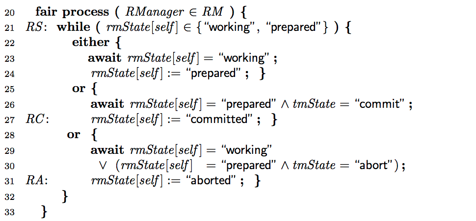
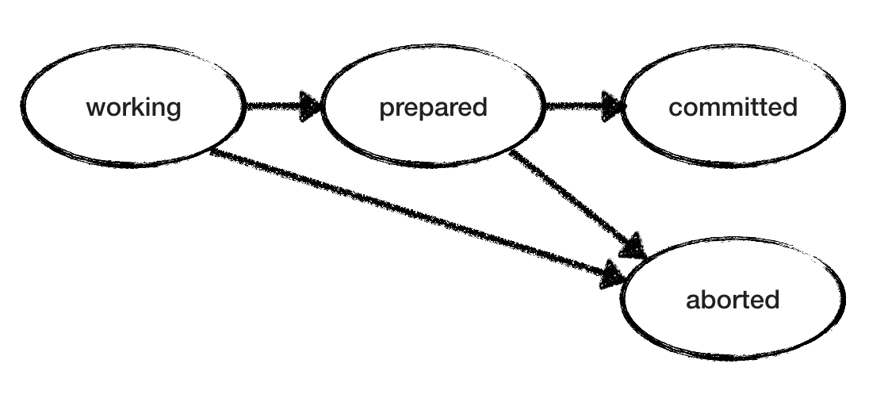
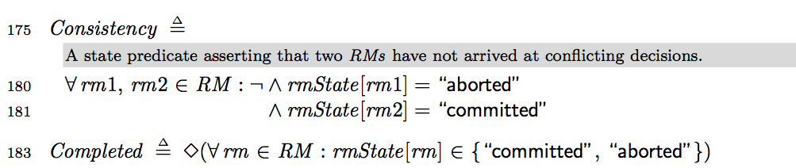
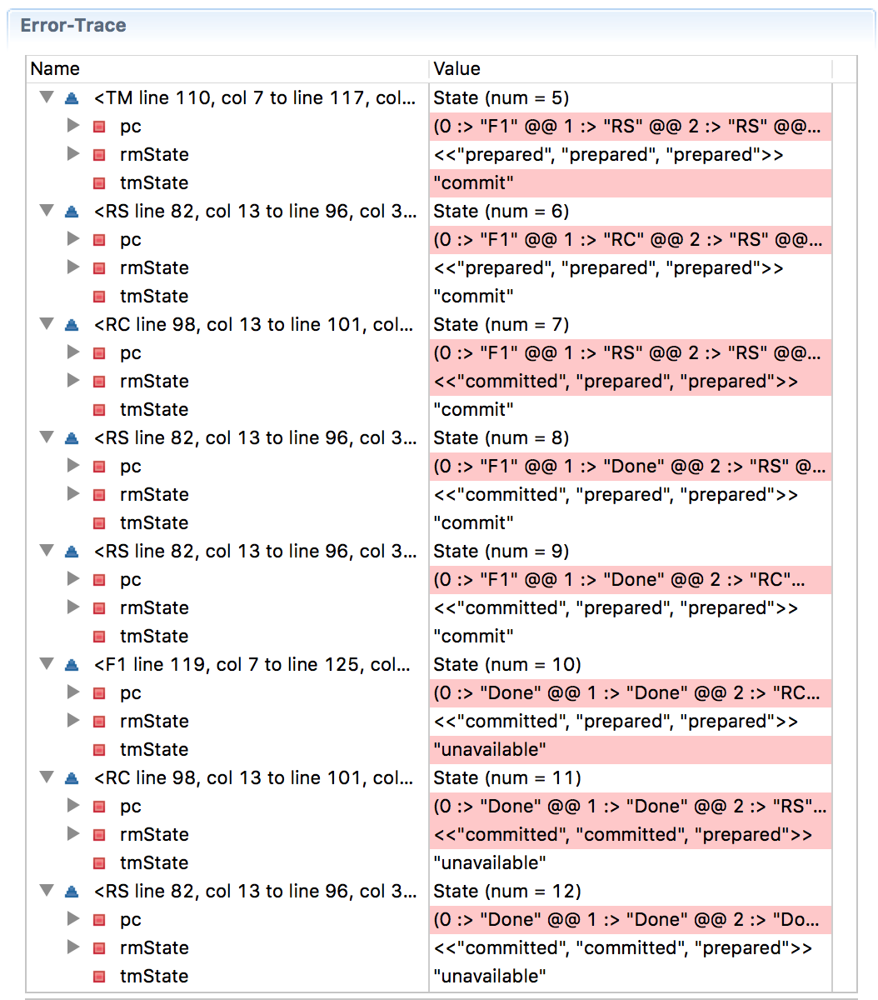
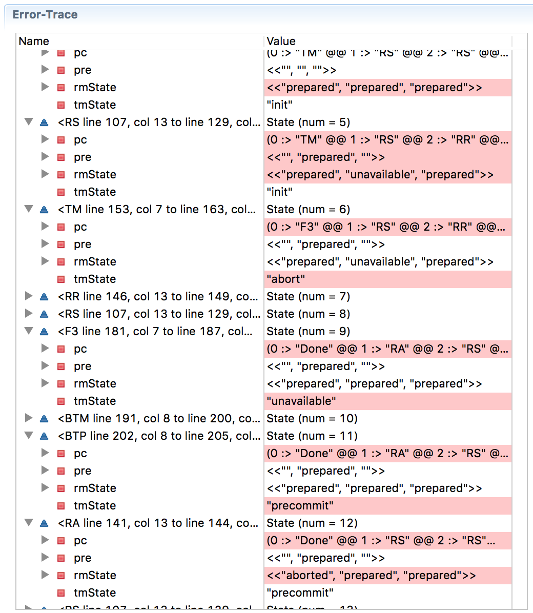

Двухфазный коммит и будущее распределённых систем

В этой статье мы смоделируем и исследуем протокол двухфазного коммита с помощью TLA+.

Протокол двухфазного коммита практичный и сегодня используется во многих распределённых системах. Тем не менее, он достаточно краткий. Поэтому мы можем быстро смоделировать его и многому научиться. На самом деле этим примером мы проиллюстрируем, какой результат в распределённых системах _фундаментально невозможен_.

### Проблема двухфазного коммита

Транзакция проходит через **диспетчеры ресурсов (RM)**. Все RM должны договориться, будет транзакция _завершена_ или _прервана_.

Менеджер транзакций (TM) принимает окончательное решение: **коммит** или **отмена**. Условием для коммита является готовность к коммиту всех RM. В противном случае транзакцию следует отменить.  

### Некоторые замечания о моделировании

Для простоты мы выполняем моделирование в модели общей памяти, а не в системе передачи сообщений. Это также обеспечивает быструю проверку модели. Но мы добавим неатомарность к действиям «чтение из соседнего узла и обновление состояния», чтобы захватить интересное поведение при передаче сообщений.

RM может только читать состояние TM и читать/обновлять собственное состояние. Он не может прочитать состояние другого диспетчера ресурсов. ТМ может читать состояние всех узлов RM и читать/обновлять собственное состояние.

### Определения

Строки 9-10 устанавливают начальный `rmState` для каждого RM на `working`, а ТМ — на `init`.

Предикат `canCommit` определяется как `true`, если все RM «подготовлены» (готовы к коммиту). Если существует RM в состоянии «отбой», то справедливым становится предикат `canAbort`.

Моделирование ТМ простое. Менеджер транзакций проверяет возможность коммита или отмены — и соответственно обновляет `tmState`.

Существует возможность, что TM не сможет сделать `tmState` «недоступным», но только если константа `TMMAYFAIL` установлена в значение `true` до начала проверки модели. В TLA+ метки определяют степень атомарности, то есть её гранулярность. Метками F1 и F2 мы обозначаем, что соответствующие операторы выполняются неатомарно (после некоторого неопределённого времени) по отношению к предыдущим операторам.

### Модель RM

Модель RM тоже простая. Поскольку «рабочие» и «подготовленные» состояния неконечные, RM недетерминированно выбирает среди действий, пока не достигнет конечного состояния. «Рабочий» RM может перейти в «прерванное» или «подготовленное» состояние. «Подготовленный» RM ожидает от TM решения коммит/отмена — и действует соответственно. На рисунке ниже показаны возможные переходы состояний для одного RM. Но обратите внимание, что у нас несколько RM, каждый из которых проходит через свои состояния в своём темпе без знания состояния других RM.

### Модель двухфазного коммита

Нам нужно проверить согласованность нашего двухфазного коммита: чтобы не было разных RM, один из которых говорит «коммит», а другой «аборт».

Предикат `Completed` проверяет, что протокол не висит вечно: в конце концов каждая RM достигает конечного состояния `committed` или `aborted`.

Теперь мы готовы проверить модель протокола. Изначально мы установили `TMMAYFAIL=FALSE, RM=1..3` для запуска протокола с тремя RM и одним TM, то есть в надёжной конфигурации. Проверка модели занимает 15 секунд и говорит, что ошибок нет. И `Consistency`, и `Completed` удовлетворены любым возможным выполнением протокола с любым чередованием действий RM и действий TM.

Теперь установим `TMMAYFAIL=TRUE` и перезапустим проверку. Программа быстро выдаёт противоположный результат, где RM застряли в ожидании ответа от недоступной TM.

Мы видим, что на этапе `State=4` прерываются переходы RM2, на `State=7` прерываются переходы RM3, на `State=8` ТМ переходит в состояние «отбой» и падает на `State=9`. На `State=10` система зависает, потому что RM1 навсегда остаётся в подготовленном состоянии, ожидая решения от упавшего TM.

### Моделирование BTM

Чтобы избежать зависания транзакций, добавляем резервный ТМ (BTM), который быстро берёт на себя управление, если основной ТМ недоступен. Для принятия решений BTM использует ту же логику, что и TM. И для простоты мы предполагаем, что BTM никогда не падает.

Когда мы проверяем модель с добавленным процессом BTM, то получаем новое сообщение об ошибке.

BTM не может принять коммит, поскольку наше оригинальное условие `canCommit` утверждает, что все `RMstates` должны быть «подготовлены» и не учитывает условие, когда одни RM уже получили решение о коммите от оригинального ТМ до того, как BТМ взял на себя управление. Нужно переписать условия `canCommit` с учётом такой ситуации.

Успех! Когда мы проверяем модель, то достигаем и согласованности, и завершённости, поскольку BTM берёт на себя управление и завершает транзакцию, если TM падает. [Вот модель 2PCwithBTM в TLA+](https://www.dropbox.com/s/teobmipyg7q2mjx/2PCwithBTM.tla?dl=0) (BTM и вторая строка canCommit изначально раскомменчены) и [соответствующий pdf](https://www.dropbox.com/s/rx1oq3vxaysysab/2PCwithBTM.pdf?dl=0).

### Что если RM тоже потерпят неудачу?

Мы предположили, что RM надёжны. Теперь отменим это условие и посмотрим, как ведёт себя протокол при сбое RM. Добавляем «недоступное» состояние в модель сбоя. Чтобы исследовать поведение и смоделировать прерывистую потерю доступности, позволяем аварийному RM восстановиться и продолжить работу, прочитав своё состояние из лога. Вот ещё одна диаграмма перехода состояния RM с добавленным «недоступным» состоянием и переходами, отмеченными красным цветом. А ниже — пересмотренная модель для RM.

Необходимо также доработать `canAbort` с учётом состояния недоступности. ТМ может принять решение «отбой», если какая-то из служб находится в прерванном или недоступном состоянии. Если опустить это условие, то упавший и не восстановленный RM прервёт ход выполнения транзакции. Конечно, опять следует учесть RM, которые узнали решение о завершении транзакции от исходного TM.

### Проверка модели

Когда мы проверяем модель, то возникает проблема несоответствия! Как это могло произойти? Проследим за трассировкой.

При `State=6` все RM находятся в подготовленном состоянии, ТМ принял решение о завершении транзакции, RM1 увидел это решение и перешёл на метку RC, что означает готовность изменить своё состояние на «завершённый». (Запомните RM1, этот пистолет выстрелит в последнем акте). К сожалению, ТМ обваливается на этапе `State=7`, и RM2 становится недоступен на `State=8`. На девятом шаге резервный BTM берёт управление на себя и считывает состояние трёх RM как «подготовлено, недоступно, подготовлено» — и принимает решение отменить транзакцию на десятом шаге. Помните RM1? Он принимает решение завершить транзакцию, потому что получил такое решение от исходного TM, и переходит в состояние `committed` на 11-м шаге. В `State=13` RM3 выполняет решение прервать транзакцию от BTM и переходит в состояние `aborted` — и вот у нас нарушена согласованность с RM1.

В этом случае BTM принял решение, которое нарушило **согласованность**. С другой стороны, если заставить BTM ждать выхода RM из недоступного состояния, он может навечно зависнуть в случае аварии на узле, и это нарушит условие **выполнения** (прогресса).

[Обновленный файл модели TLA+ доступен здесь](https://www.dropbox.com/s/oobj4z7dhp8yrl9/2PC2withBTM.tla?dl=0), а также [соответствующий pdf](https://www.dropbox.com/s/vkdgugmkjlgb8z6/2PC2withBTM.pdf?dl=0).

### Невозможность FLP

Итак, что же произошло? Мы уткнулись в [теорему Фишера, Линча, Патерсона (FLP)](https://www.the-paper-trail.org/post/2008-08-13-a-brief-tour-of-flp-impossibility/) о невозможности консенсуса в асинхронной системе со сбоями.

В нашем примере BTM не может правильно решить, находится RM2 в состоянии сбоя или нет — и некорректно принимает решение прервать транзакцию. Если бы решение принимал только исходный TM, такая неточность в распознавании сбоя не стала бы проблемой. RM подчинятся любому решению ТМ, так что сохранятся и согласованность, и прогресс выполнения.

Проблема в том, что у нас два объекта принимают решения: TM и BTM, они смотрят на состояние RM в разное время и принимают разные решения. Такая асимметричность информации — корень всего зла в распределённых системах.

Проблема не исчезает даже с расширением до трёхфазного коммита. [Вот трёхфазный коммит, смоделированный в TLA+](https://www.dropbox.com/s/6l3vcenjcb1h54k/3PCwithBTM.tla?dl=0) ([версия pdf](https://www.dropbox.com/s/vr2qnkuqlldhmve/3PCwithBTM.pdf?dl=0)), а ниже трассировка ошибки, которая показывает, что на этот раз нарушен прогресс (на [странице Википедии о трёхфазном коммите](https://en.wikipedia.org/wiki/Three-phase_commit_protocol) описывается ситуация, когда RM1 подвисает после получения решения перед коммитом, а RM2 и RM3 совершают коммит, что нарушает согласованность).

### Paxos старается сделать мир лучше

Но не всё потеряно, надежда не умерла. [У нас есть Paxos](http://muratbuffalo.blogspot.com/search?q=paxos). Он аккуратно действует в пределах теоремы FLP. Инновация Paxos заключается в том, что он **всегда безопасен** (даже при наличии неточных детекторов, асинхронного выполнения и сбоев), и **в конечном итоге завершает транзакцию**, когда консенсус становится возможным.

Можно эмулировать TM на кластере с тремя узлами Paxos, и это решит проблему несогласованности TM/BTM. Или, как показали Грей и Лэмпорт в [научной статье по консенсусу в коммите транзакций](https://lamport.azurewebsites.net/video/consensus-on-transaction-commit.pdf), если RM используют контейнер Paxos для хранения своих решений одновременно с ответом TM, это избавляет от одного лишнего шага в алгоритме стандартного протокола.