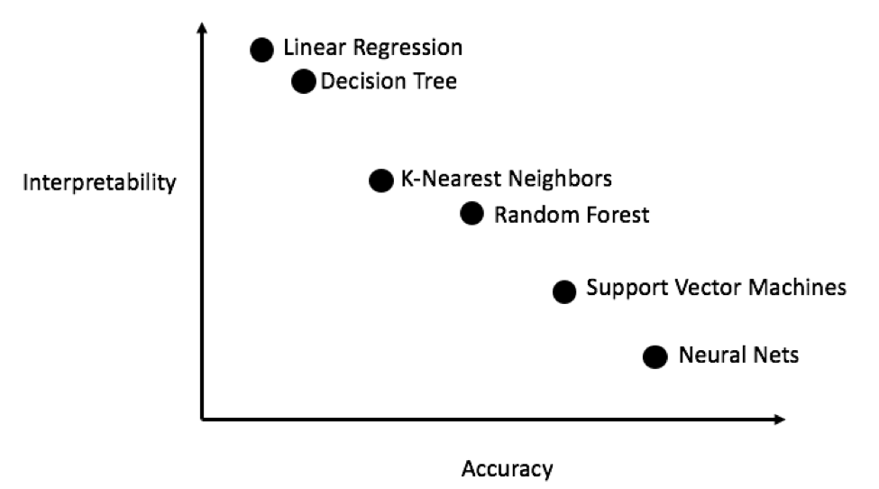
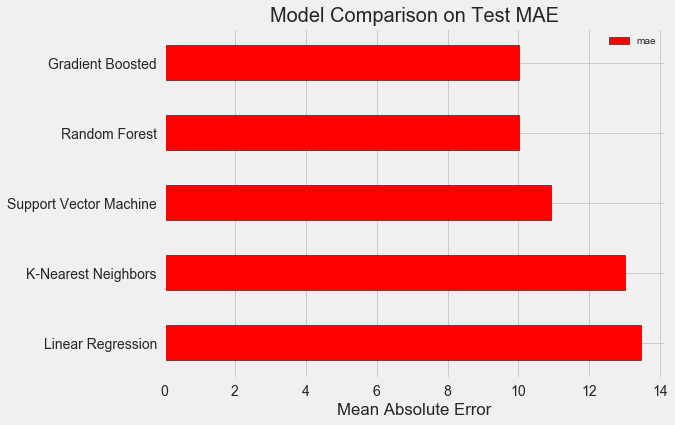
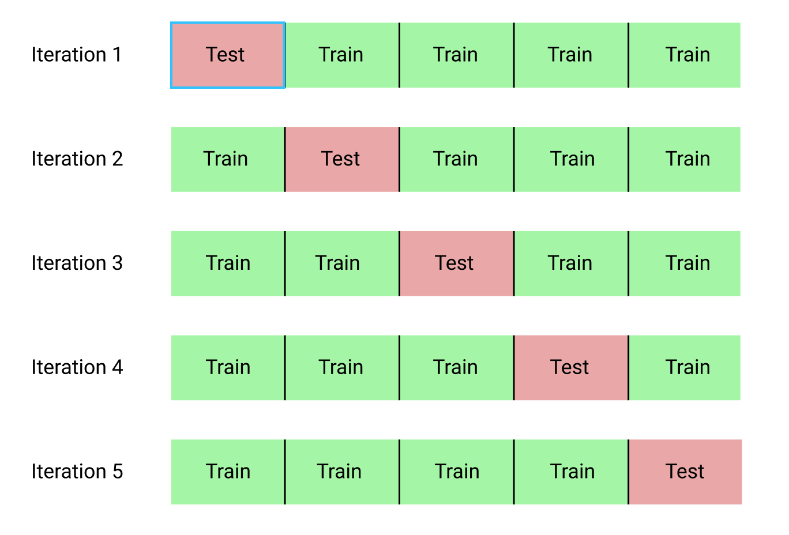
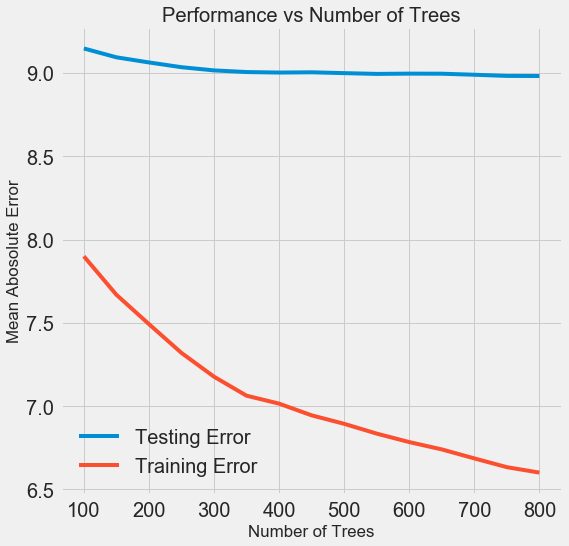
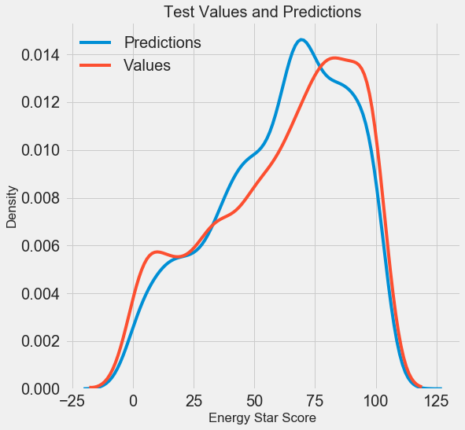
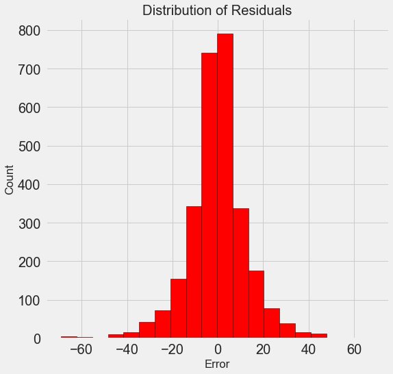

Делаем проект по машинному обучению на Python. Часть 2 / Блог компании NIX Solutions

_Перевод [A Complete Machine Learning Walk-Through in Python: Part Two](https://towardsdatascience.com/a-complete-machine-learning-project-walk-through-in-python-part-two-300f1f8147e2)_

Собрать воедино все части проекта по машинному обучению бывает весьма непросто. В этой серии статей мы пройдём через все этапы реализации процесса машинного обучения с использованием реальных данных, и узнаем, как сочетаются друг с другом различные методики.

В [первой статье](https://habr.com/company/nixsolutions/blog/425253/) мы очистили и структурировали данные, провели разведочный анализ, собрали набор признаков для использования в модели и установили базовый уровень для оценки результатов. С помощью этой статьи мы научимся реализовывать на Python и сравнивать несколько моделей машинного обучения, проводить гиперпараметрическую настройку для оптимизации лучшей модели, и оценивать работу финальной модели на тестовом наборе данных.

Весь код проекта лежит [на GitHub](https://github.com/WillKoehrsen/machine-learning-project-walkthrough), а [здесь](https://github.com/WillKoehrsen/machine-learning-project-walkthrough/blob/master/Machine%20Learning%20Project%20Part%202.ipynb) находится второй блокнот, относящийся к текущей статье. Можете использовать и модифицировать код по своему усмотрению!  

## Оценка и выбор модели

Памятка: мы работаем над задачей с контролируемой регрессией, используем [информацию об энергопотреблении зданий в Нью-Йорке](https://www.energystar.gov/buildings/facility-owners-and-managers/existing-buildings/use-portfolio-manager/interpret-your-results/what) для создания модели, которая прогнозировала бы, какой балл [Energy Star Score](https://www.energystar.gov/buildings/facility-owners-and-managers/existing-buildings/use-portfolio-manager/interpret-your-results/what) получит то или иное здание. Нас интересует как точность прогнозирования, так и интерпретируемость модели.

Сегодня вы можете выбирать из [множества доступных моделей машинного обучения](http://scikit-learn.org/stable/supervised_learning.html), и это изобилие бывает пугающим. Конечно, в сети есть [сравнительные обзоры](https://docs.microsoft.com/en-us/azure/machine-learning/studio/algorithm-cheat-sheet), которые помогут сориентироваться при выборе алгоритма, но я предпочитаю попробовать в работе несколько и посмотреть, какой лучше. Машинное обучение по большей части основывается на [эмпирических, а не теоретических результатах](https://www.quora.com/How-much-of-deep-learning-research-is-empirical-versus-theoretical), и практически [невозможно заранее понять, какая модель окажется точнее](http://www.statsblogs.com/2014/01/25/machine-learning-lesson-of-the-day-the-no-free-lunch-theorem/).

Обычно рекомендуется начинать с простых, интерпретируемых моделей, таких как линейная регрессия, и если результаты будут неудовлетворительными, то переходить к более сложным, но обычно более точным методам. На этом графике (весьма антинаучном) показана взаимосвязь точности и интерпретируемости некоторых алгоритмов:

  
_Интерпретируемость и точность ([Источник](http://blog.fastforwardlabs.com/2017/09/01/LIME-for-couples.html))._

Мы будем оценивать пять моделей разной степени сложности:

*   Линейная регрессия.
*   Метод k-ближайших соседей.
*   «Случайный лес».
*   Градиентный бустинг.
*   Метод опорных векторов.

Мы рассмотрим не теоретический аппарат этих моделей, а их реализацию. Если вас интересует теория, можете почитать [An Introduction to Statistical Learning](http://www-bcf.usc.edu/~gareth/ISL/) (можно скачать бесплатно) или [Hands-On Machine Learning with Scikit-Learn and TensorFlow](http://shop.oreilly.com/product/0636920052289.do). В обеих книгах прекрасно объяснена теория и показана эффективность использования упомянутых методов на языках R и Python соответственно.

#### Заполняем отсутствующие значения

Хотя при очистке данных мы отбросили колонки, в которых не хватает больше половины значений, у нас ещё отсутствует немало значений. Модели машинного обучения не могут работать с отсутствующими данными, поэтому нам нужно их [заполнить](https://en.wikipedia.org/wiki/Imputation_(statistics)).

Сначала считаем данные и вспоминаем, как они выглядят:

    import pandas as pd
    import numpy as np
    
    train_features = pd.read_csv('data/training_features.csv')
    test_features = pd.read_csv('data/testing_features.csv')
    train_labels = pd.read_csv('data/training_labels.csv')
    test_labels = pd.read_csv('data/testing_labels.csv')
    Training Feature Size:  (6622, 64)
    Testing Feature Size:   (2839, 64)
    Training Labels Size:   (6622, 1)
    Testing Labels Size:    (2839, 1)

Каждое `NaN`-значение — это отсутствующая запись в данных. [Заполнять их можно по-разному](https://www.omicsonline.org/open-access/a-comparison-of-six-methods-for-missing-data-imputation-2155-6180-1000224.php?aid=54590), а мы воспользуемся достаточно простым методом медианного заполнения (median imputation), который заменяет отсутствующие данные средним значениями по соответствующим колонкам.

В нижеприведённом коде мы создадим [Scikit-Learn](http://scikit-learn.org/stable/)-объект `Imputer` с медианной стратегией. Затем обучим его на обучающих данных (с помощью `imputer.fit`), и применим для заполнения отсутствующих значений в обучающем и тестовом наборах (с помощью `imputer.transform`). То есть записи, которых не хватает в _тестовых данных_, будут заполняться соответствующим медианным значением из _обучающих данных_.

Мы делаем заполнение и не обучаем модель на данных как есть, чтобы избежать проблемы с [утечкой тестовых данных](https://www.kaggle.com/dansbecker/data-leakage), когда информация из тестового датасета переходит в обучающий.

    
    imputer = Imputer(strategy='median')
    
    imputer.fit(train_features)
    
    X = imputer.transform(train_features)
    X_test = imputer.transform(test_features)
    Missing values in training features:  0
    Missing values in testing features:   0

Теперь все значения заполнены, пропусков нет.

#### Масштабирование признаков

[Масштабированием](https://en.wikipedia.org/wiki/Feature_scaling) называется общий процесс изменения диапазона признака. [Это необходимый шаг](https://stats.stackexchange.com/questions/121886/when-should-i-apply-feature-scaling-for-my-data), потому что признаки измеряются в разных единицах, а значит покрывают разные диапазоны. Это сильно искажает результаты таких алгоритмов, как [метод опорных векторов](https://stats.stackexchange.com/questions/305906/feature-scaling-in-svm-does-it-depend-on-the-kernel) и метод k-ближайших соседей, которые учитывают расстояния между измерениями. А масштабирование позволяет этого избежать. И хотя методы вроде [линейной регрессии и «случайного леса»](https://stats.stackexchange.com/questions/121886/when-should-i-apply-feature-scaling-for-my-data) не требует масштабирования признаков, лучше не пренебрегать этим этапом при сравнении нескольких алгоритмов.

Масштабировать будем с помощью приведения каждого признака к диапазону от 0 до 1. Берём все значения признака, выбираем минимальное и делим его на разницу между максимальным и минимальным (диапазон). Такой способ масштабирования часто называют [нормализацией, а другой основной способ — стандартизацией](https://machinelearningmastery.com/normalize-standardize-machine-learning-data-weka/).

Этот процесс легко реализовать вручную, поэтому воспользуемся объектом `MinMaxScaler` из Scikit-Learn. Код для этого метода идентичен коду для заполнения отсутствующих значений, только вместо вставки применяется масштабирование. Напомним, что учим модель только на обучающем наборе, а затем преобразуем все данные.

    
    scaler = MinMaxScaler(feature_range=(0, 1))
    
    scaler.fit(X)
    
    X = scaler.transform(X)
    X_test = scaler.transform(X_test)

Теперь у каждого признака минимальное значение равно 0, а максимальное 1. Заполнение отсутствующих значений и масштабирование признаков — эти два этапа нужны почти в любом процессе машинного обучения.

#### Реализуем в Scikit-Learn модели машинного обучения

После всех подготовительных работ процесс создания, обучения и прогона моделей относительно прост. Мы будем использовать в Python библиотеку [Scikit-Learn](http://scikit-learn.org/stable/documentation.html), прекрасно документированную и с продуманным синтаксисом построения моделей. Научившись создавать модель в Scikit-Learn, вы сможете быстро реализовывать всевозможные алгоритмы.

Иллюстрировать процесс создания, обучения (`.fit` ) и тестирования (`.predict` ) мы будем с помощью градиентного бустинга:

    from sklearn.ensemble import GradientBoostingRegressor
    
    
    gradient_boosted = GradientBoostingRegressor()
    
    
    gradient_boosted.fit(X, y)
    
    
    predictions = gradient_boosted.predict(X_test)
    
    
    mae = np.mean(abs(predictions - y_test))
    
    print('Gradient Boosted Performance on the test set: MAE = %0.4f' % mae)
    
    Gradient Boosted Performance on the test set: MAE = 10.0132

Всего по одной строке кода на создание, обучение и тестирование. Для построения других моделей воспользуемся тем же синтаксисом, меняя только название алгоритма.

Чтобы объективно оценивать модели, мы с помощью медианного значения цели вычислили базовый уровень и получили 24,5. А полученные результаты оказались значительно лучше, так что нашу задачу можно решить с помощью машинного обучения.

В нашем случае [градиентный бустинг](https://machinelearningmastery.com/gentle-introduction-gradient-boosting-algorithm-machine-learning/) (MAE = 10,013) оказался чуть лучше «случайного леса» (10,014 MAE). Хотя эти результаты нельзя считать абсолютно честными, потому что для гиперпараметров мы по большей части используем значения по умолчанию. Эффективность моделей сильно зависит от этих настроек, [особенно в методе опорных векторов](http://pyml.sourceforge.net/doc/howto.pdf). Тем не менее на основании этих результатов мы выберем градиентный бустинг и станем его оптимизировать.

## Гиперпараметрическая оптимизация модели

После выбора модели можно оптимизировать её под решаемую задачу, настраивая гиперпараметры.

Но прежде всего давайте разберёмся, [что такое гиперпараметры и чем они отличаются от обычных параметров](https://machinelearningmastery.com/difference-between-a-parameter-and-a-hyperparameter/)?

*   Гиперпараметры модели можно считать настройками алгоритма, которые мы задаём до начала его обучения. Например, гиперпараметром является количество деревьев в «случайном лесе», или количество соседей в методе k-ближайших соседей.
*   Параметры модели — то, что она узнаёт в ходе обучения, например, веса в линейной регрессии.

Управляя гиперпараметром, мы влияем на результаты работы модели, меняя баланс между её [недообучением и переобучением](https://towardsdatascience.com/overfitting-vs-underfitting-a-conceptual-explanation-d94ee20ca7f9). Недообучением называется ситуация, когда модель недостаточно сложна (у неё слишком мало степеней свободы) для изучения соответствия признаков и цели. У недообученной модели [высокое смещение](https://en.wikipedia.org/wiki/Bias%E2%80%93variance_tradeoff) (bias), которое можно скорректировать посредством усложнения модели.

Переобучением называется ситуация, когда модель по сути запоминает учебные данные. У переобученной модели [высокая дисперсия](https://ru.wikipedia.org/wiki/%D0%94%D0%B8%D1%81%D0%BF%D0%B5%D1%80%D1%81%D0%B8%D1%8F_%D1%81%D0%BB%D1%83%D1%87%D0%B0%D0%B9%D0%BD%D0%BE%D0%B9_%D0%B2%D0%B5%D0%BB%D0%B8%D1%87%D0%B8%D0%BD%D1%8B) (variance), которую можно скорректировать с помощью ограничения сложности модели посредством регуляризации. Как недообученная, так и переобученная модель не сможет хорошо обобщить тестовые данные.

Трудность выбора правильных гиперпараметров заключается в том, что для каждой задачи будет уникальный оптимальный набор. Поэтому единственный способ выбрать наилучшие настройки — попробовать разные комбинации на новом датасете. К счастью, в Scikit-Learn есть ряд методов, позволяющих эффективно оценивать гиперпараметры. Более того, в проектах вроде [TPOT](https://epistasislab.github.io/tpot/) делаются попытки оптимизировать поиск гиперпараметров с помощью таких подходов, как [генетическое программирование](https://ru.wikipedia.org/wiki/%D0%93%D0%B5%D0%BD%D0%B5%D1%82%D0%B8%D1%87%D0%B5%D1%81%D0%BA%D0%BE%D0%B5_%D0%BF%D1%80%D0%BE%D0%B3%D1%80%D0%B0%D0%BC%D0%BC%D0%B8%D1%80%D0%BE%D0%B2%D0%B0%D0%BD%D0%B8%D0%B5). В этой статье мы ограничимся использованием Scikit-Learn.

#### Случайный поиск с перекрёстной проверкой

Давайте реализуем метод настройки гиперпараметров, который называется случайным поискок с перекрёстной проверкой:

*   [Случайный поиск](https://en.wikipedia.org/wiki/Hyperparameter_optimization#Random_search) — методика выбора гиперпараметров. Мы определяем сетку, а потом из неё случайно выбираем различные комбинации, в отличие от сеточного поиска (grid search), при котором мы последовательно пробуем каждую комбинацию. Кстати, [случайный поиск работает почти так же хорошо, как и сеточный](http://www.jmlr.org/papers/volume13/bergstra12a/bergstra12a.pdf), но гораздо быстрее.
*   [Перекрёстной проверкой](https://www.openml.org/a/estimation-procedures/1) называется способ оценки выбранной комбинации гиперпараметров. Вместо разделения данных на обучающий и тестовый наборы, что уменьшает количество доступных для обучения данных, мы воспользуемся k-блочной перекрёстной проверкой (K-Fold Cross Validation). Для этого мы разделим обучающие данные на k блоков, а затем прогоним итеративный процесс, в ходе которого сначала обучим модель на k-1 блоках, а затем сравним результат при обучении на k-ом блоке. Будем повторять процесс k раз, и в конце получим среднее значение ошибки для каждой итерации. Это и будет финальная оценка.

Вот наглядная иллюстрация k-блочной перекрёстной проверки при k = 5:

Весь процесс случайного поиска с перекрёстной проверкой выглядит так:

1.  Задаём сетку гиперпараметров.
2.  Случайно выбираем комбинацию гиперпараметров.
3.  Создаём модель с использованием этой комбинации.
4.  Оцениваем результат работы модели с помощью k-блочной перекрёстной проверки.
5.  Решаем, какие гиперпараметры дают лучший результат.

Конечно, всё это делается не вручную, а с помощью `RandomizedSearchCV` из Scikit-Learn!

#### Небольшое отступление: [Методы градиентного бустинга](https://en.wikipedia.org/wiki/Gradient_boosting)

Мы будем использовать регрессионную модель на основе градиентного бустинга. Это сборный метод, то есть модель состоит из многочисленных «слабых учеников» (weak learners), в данном случае из отдельных деревьев решений (decision trees). Если в п[акетных алгоритмах вроде «случайного леса»](https://machinelearningmastery.com/bagging-and-random-forest-ensemble-algorithms-for-machine-learning/) ученики обучаются параллельно, а затем методом голосования выбирается результат прогнозирования, то в [boosting-алгоритмах](https://machinelearningmastery.com/gentle-introduction-gradient-boosting-algorithm-machine-learning/) вроде градиентного бустинга ученики обучаются последовательно, и каждый из них «сосредотачивается» на ошибках, сделанных предшественниками.

В последние годы boosting-алгоритмы стали популярны и часто побеждают на соревнованиях по машинному обучению. [Градиентный бустинг](http://blog.kaggle.com/2017/01/23/a-kaggle-master-explains-gradient-boosting/) — одна из реализаций, в которой для минимизации стоимости функции применяется градиентный спуск (Gradient Descent). Реализация градиентного бустинга в Scikit-Learn считается не такой эффективной, как в других библиотеках, например, в [XGBoost](http://xgboost.readthedocs.io/en/latest/model.html), но она неплохо работает на маленьких датасетах и выдаёт достаточно точные прогнозы.

#### Вернёмся к гиперпараметрической настройке

В регрессии с помощью градиентного бустинга есть много гиперпараметров, которые нужно настраивать, за подробностями отсылаю вас к документации Scikit-Learn. Мы будем оптимизировать:

*   `loss`: минимизация функции потерь;
*   `n_estimators`: количество используемых слабых деревьев решений (decision trees);
*   `max_depth`: максимальная глубина каждого дерева решений;
*   `min_samples_leaf`: минимальное количество примеров, которые должны быть в «листовом» (leaf) узле дерева решений;
*   `min_samples_split`: минимальное количество примеров, которые нужны для разделения узла дерева решений;
*   `max_features`: максимальное количество признаков, которые используются для разделения узлов.

Не уверен, что хоть кто-нибудь действительно понимает, как всё это работает, и единственный способ найти лучшую комбинацию — перепробовать разные варианты.

В этом коде мы создаём сетку из гиперпараметров, затем создаём объект `RandomizedSearchCV` и ищем с помощью 4-блочной перекрёстной проверки по 25 разным комбинациям гиперпараметров:

    
    loss = ['ls', 'lad', 'huber']
    
    
    n_estimators = [100, 500, 900, 1100, 1500]
    
    
    max_depth = [2, 3, 5, 10, 15]
    
    
    min_samples_leaf = [1, 2, 4, 6, 8]
    
    
    min_samples_split = [2, 4, 6, 10]
    
    
    max_features = ['auto', 'sqrt', 'log2', None]
    
    
    hyperparameter_grid = {'loss': loss,
        'n_estimators': n_estimators,
        'max_depth': max_depth,
        'min_samples_leaf': min_samples_leaf,
        'min_samples_split': min_samples_split,
        'max_features': max_features}
    
    
    model = GradientBoostingRegressor(random_state = 42)
    
    
    random_cv = RandomizedSearchCV(estimator=model,
        param_distributions=hyperparameter_grid,
        cv=4, n_iter=25, 
        scoring = 'neg_mean_absolute_error',
        n_jobs = -1, verbose = 1, 
        return_train_score = True,
        random_state=42)
    
    
    random_cv.fit(X, y) After performing the search, we can inspect the RandomizedSearchCV object to find the best model:
    
    
    random_cv.best_estimator_
    GradientBoostingRegressor(loss='lad', max_depth=5,
        max_features=None,
        min_samples_leaf=6,
        min_samples_split=6,
        n_estimators=500)

Эти результаты можно использовать для сеточного поиска, выбирая для сетки параметры, которые близки к этим оптимальным значениям. Но дальнейшая настройка вряд ли существенно улучшит модель. Есть общее правило: грамотное конструирование признаков окажет на точность модели куда большее влияние, чем самая дорогая гиперпараметрическая настройка. Это [закон убывания доходности применительно к машинному обучению](http://www.picnet.com.au/blogs/guido/2018/04/13/diminishing-returns-machine-learning-projects/): конструирование признаков даёт наивысшую отдачу, а гиперпараметрическая настройка приносит лишь скромную выгоду.

Для изменения количества оценщиков (estimator) (деревьев решений) с сохранением значений других гиперпараметров можно поставить один эксперимент, который продемонстрирует роль этой настройки. Реализация приведена [здесь](https://github.com/WillKoehrsen/machine-learning-project-walkthrough/blob/master/Machine%20Learning%20Project%20Part%202.ipynb), а вот что получилось в результате:

С ростом количества используемых моделью деревьев снижается уровень ошибок в ходе обучения и тестирования. Но ошибки при обучении снижаются куда быстрее, и в результате модель переобучается: показывает отличные результаты на обучающих данных, но на тестовых работает хуже.

На тестовых данных точность всегда снижается (ведь модель видит правильные ответы для учебного датасета), но существенное падение [говорит о переобучении](https://www.kdnuggets.com/2015/01/clever-methods-overfitting-avoid.html). Решить эту проблему можно с помощью увеличения объёма обучающих данных или [уменьшения сложности модели с помощью гиперпараметров](https://www.analyticsvidhya.com/blog/2016/02/complete-guide-parameter-tuning-gradient-boosting-gbm-python/). Здесь мы не будем касаться гиперпараметров, но я рекомендую всегда уделять внимание проблеме переобучения.

Для нашей финальной модели мы возьмём 800 оценщиков, потому что это даст нам самый низкий уровень ошибки при перекрёстной проверке. А теперь протестируем модель!

## Оценка с помощью тестовых данных

Будучи ответственными людьми мы удостоверились, что наша модель никоим образом не получала доступ к тестовым данным в ходе обучения. Поэтому [точность при работе с тестовыми данными мы можем использовать в роли индикатора](https://www.coursera.org/learn/deep-neural-network/lecture/cxG1s/train-dev-test-sets) качества модели, когда её допустят к реальным задачам.

Скормим модели тестовые данные и вычислим ошибку. Вот сравнение результатов алгоритма градиентного бустинга по умолчанию и нашей настроенной модели:

    
    default_pred = default_model.predict(X_test)
    final_pred = final_model.predict(X_test)
    Default model performance on the test set: MAE = 10.0118.
    Final model performance on the test set: MAE = 9.0446.

Гиперпараметрическая настройка помогла улучшить точность модели примерно на 10 %. В зависимости от ситуации это может быть очень значительное улучшение, но требующее немало времени.

Сравнить длительность обучения обеих моделей можно с помощью волшебной команды `%timeit` в Jupyter Notebooks. Сначала измерим длительность работы модели по умолчанию:

    %%timeit -n 1 -r 5
    default_model.fit(X, y)
    1.09 s ± 153 ms per loop (mean ± std. dev. of 5 runs, 1 loop each)

Одна секунда на обучение — очень прилично. А вот настроенная модель уже не такая шустрая:

    %%timeit -n 1 -r 5
    final_model.fit(X, y)
    12.1 s ± 1.33 s per loop (mean ± std. dev. of 5 runs, 1 loop each)

Эта ситуация иллюстрирует фундаментальный аспект машинного обучения: [всё дело в компромиссах](http://people.inf.ethz.ch/jaggim/meetup/slides/ML-meetup-9-vonRohr-kaggle.pdf). Постоянно приходится выбирать баланс между точностью и интерпретируемостью, между [смещением и дисперсией](https://machinelearningmastery.com/gentle-introduction-to-the-bias-variance-trade-off-in-machine-learning/), между точностью и временем работы, и так далее. Правильное сочетание полностью определяется конкретной задачей. В нашем случае 12-кратное увеличение длительности работы в относительном выражении велико, но в абсолютном — незначительно.

Мы получили финальные результаты прогнозирования, давайте теперь их проанализируем и выясним, есть ли какие-то заметные отклонения. Слева показан график плотности прогнозных и реальных значений, справа — гистограмма погрешности:

Прогноз модели неплохо повторяет распределение реальных значений, при этом на обучающих данных пик плотности расположен ближе к медианному значению (66), чем к реальному пику плотности (около 100). Погрешности имеют почти нормальное распределение, хотя есть несколько больших отрицательных значений, когда прогноз модели сильно отличается от реальных данных. В следующей статье мы подробнее рассмотрим интерпретирование результатов.

## Заключение

В этой статье мы рассмотрели несколько этапов решения задачи машинного обучения:

*   Заполнение отсутствующих значений и масштабирование признаков.
*   Оценка и сравнение результатов работы нескольких моделей.
*   Гиперпараметрическая настройка с помощью случайного поиска по сетке и перекрёстной проверки.
*   Оценка лучшей модели с помощью тестовых данных.

Результаты свидетельствуют, что мы можем применять машинное обучение для прогнозирования баллов Energy Star Score на основе доступной статистики. С помощью градиентного бустинга удалось на тестовых данных добиться погрешности в пределах 9,1. Гиперпараметрическая настройка может сильно улучшить результаты, но ценой значительного замедления работы. Это один из многих компромиссов, которые нужно учитывать в машинном обучении.

В следующей статье мы постараемся разобраться, как работает наша модель. Также мы рассмотрим основные факторы, влияющие на балл Energy Star Score. Если мы знаем, что модель точна, и то попробуем понять, почему она прогнозирует именно так и что это говорит нам о самой задаче.