Делаем проект по машинному обучению на Python. Часть 1 / Блог компании NIX Solutions

_Перевод [A Complete Machine Learning Project Walk-Through in Python: Part One](https://towardsdatascience.com/a-complete-machine-learning-walk-through-in-python-part-one-c62152f39420)._

Когда читаешь книгу или слушаешь учебный курс про анализ данных, нередко возникает чувство, что перед тобой какие-то отдельные части картины, которые никак не складываются воедино. Вас может пугать перспектива сделать следующий шаг и целиком решить какую-то задачу с помощью машинного обучения, но с помощью этой серии статей вы обретёте уверенность в способности решить любую задачу в сфере data science.

Чтобы у вас в голове наконец сложилась цельная картина, мы предлагаем разобрать от начала до конца проект применения машинного обучения с использованием реальных данных.  
  
Последовательно пройдём через этапы:

1.  Очистка и форматирование данных.
2.  Разведочный анализ данных.
3.  Конструирование и выбор признаков.
4.  Сравнение метрик нескольких моделей машинного обучения.
5.  Гиперпараметрическая настройка лучшей модели.
6.  Оценка лучшей модели на тестовом наборе данных.
7.  Интерпретирование результатов работы модели.
8.  Выводы и работа с документами.

Вы узнаете, как этапы переходят один в другой и как реализовать их на Python. [Весь проект](https://github.com/WillKoehrsen/machine-learning-project-walkthrough) доступен на GitHub, первая часть лежит [здесь.](https://github.com/WillKoehrsen/machine-learning-project-walkthrough/blob/master/Machine%20Learning%20Project%20Part%201.ipynb) В этой статье мы рассмотрим первые три этапа.

## Описание задачи

Прежде чем писать код, необходимо разобраться в решаемой задаче и доступных данных. В этом проекте мы будем работать с выложенными в общий доступ [данными об энергоэффективности зданий](http://www.nyc.gov/html/gbee/html/plan/ll84_scores.shtml) в Нью-Йорке.

Наша цель: использовать имеющиеся данные для построения модели, которая прогнозирует количество баллов Energy Star Score для конкретного здания, и интерпретировать результаты для поиска факторов, влияющих на итоговый балл.

Данные уже включают в себя присвоенные баллы Energy Star Score, поэтому наша задача представляет собой машинное обучение с управляемой регрессией:

*   Управляемая (Supervised): нам известны признаки и цель, и наша задача — обучить модель, которая сможет сопоставить первое со вторым.
*   Регрессия (Regression): балл Energy Star Score — это непрерывная переменная.

Наша модель должна быть точная  —  чтобы могла прогнозировать значение Energy Star Score близко к истинному,  —  и интерпретируемая  —  чтобы мы могли понять её прогнозы. Зная целевые данные, мы можем использовать их при принятии решений по мере углубления в данные и создания модели.

## Очистка данных

Далеко не каждый набор данных представляет собой идеально подобранное множество наблюдений, без аномалий и пропущенных значений (намек на датасеты [mtcars](http://stat.ethz.ch/R-manual/R-devel/library/datasets/html/mtcars.html) и [iris](https://archive.ics.uci.edu/ml/datasets/iris)). В реальных данных мало порядка, так что прежде чем приступить к анализу, их нужно [очистить и привести](https://www.springboard.com/blog/data-wrangling/) к приемлемому формату. Очистка данных — неприятная, но обязательная процедура при решении большинства задач по анализу данных.

Сначала можно загрузить данные в виде кадра данных (dataframe) Pandas и изучить их:

    import pandas as pd
    import numpy as np
    
    # Read in data into a dataframe 
    data = pd.read_csv('data/Energy_and_Water_Data_Disclosure_for_Local_Law_84_2017__Data_for_Calendar_Year_2016_.csv')
    
    # Display top of dataframe
    data.head()

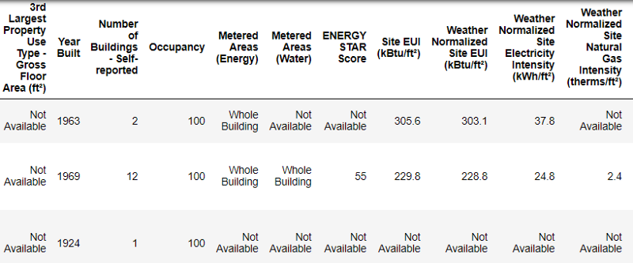  
_Так выглядят реальные данные._

Это фрагмент таблицы из 60 колонок. Даже здесь видно несколько проблем: нам нужно прогнозировать `Energy Star Score`, но мы не знаем, что означают все эти колонки. Хотя это не обязательно является проблемой, потому что зачастую можно создать точную модель, вообще ничего не зная о переменных. Но нам важна интерпретируемость, поэтому нужно выяснить значение как минимум нескольких колонок.

Когда мы получили эти данные, то не стали спрашивать о значениях, а посмотрели на название файла:

и решили поискать по запросу «Local Law 84». Мы нашли [эту страницу](http://www.nyc.gov/html/gbee/html/plan/ll84.shtml), на которой говорилось, что речь идёт о действующем в Нью-Йорке законе, согласно которому владельцы всех зданий определённого размера должны отчитываться о потреблении энергии. Дальнейший поиск помог найти [все значения колонок](http://www.nyc.gov/html/gbee/downloads/misc/nyc_benchmarking_disclosure_data_definitions_2017.pdf). Так что не пренебрегайте именами файлов, они могут быть хорошей отправной точкой. К тому же это напоминание, чтобы вы не торопились и не упустили что-нибудь важное!

Мы не будем изучать все колонки, но точно разберёмся с Energy Star Score, которая описывается так:

> Ранжирование по перцентили от 1 до 100, которая рассчитывается на основе самостоятельно заполняемых владельцами зданий отчётов об энергопотреблении за год. [Energy Star Score](https://www.energystar.gov/buildings/facility-owners-and-managers/existing-buildings/use-portfolio-manager/interpret-your-results/what) — это относительный показатель, используемый для сравнения энергоэффективности зданий.

Первая проблема решилась, но осталась вторая — отсутствующие значения, помеченные как «Not Available». Это строковое значение в Python, которое означает, что даже строки с числами будут храниться как типы данных `object`, потому что если в колонке есть какая-нибудь строковая, Pandas конвертирует её в колонку, полностью состоящую из строковых. Типы данных колонок можно узнать с помощью метода `dataframe.info()`:

    # See the column data types and non-missing values
    data.info()

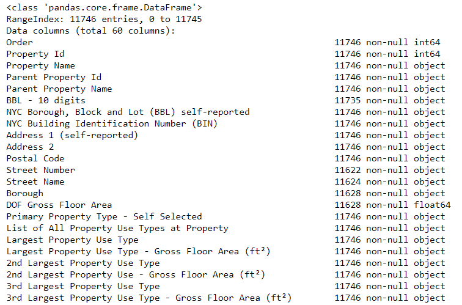

Наверняка некоторые колонки, которые явно содержат числа (например, ft²), сохранены как объекты. Мы не можем применять числовой анализ к строковым значениям, так что конвертируем их в числовые типы данных (особенно `float`)!

Этот код сначала заменяет все «Not Available» на _not a number_ (`np.nan`), которые можно интерпретировать как числа, а затем конвертирует содержимое определённых колонок в тип `float`:

    # Replace all occurrences of Not Available with numpy not a number
    data = data.replace({'Not Available': np.nan})
    
    # Iterate through the columns
    for col in list(data.columns):
        # Select columns that should be numeric
        if ('ft²' in col or 'kBtu' in col or 'Metric Tons CO2e' in col or 'kWh' in 
            col or 'therms' in col or 'gal' in col or 'Score' in col):
            # Convert the data type to float
            data[col] = data[col].astype(float)

Когда значения в соответствующих колонках у нас станут числами, можно начинать исследовать данные.

#### Отсутствующие и аномальные данные

Наряду с некорректными типами данных одна из самых частых проблем — отсутствующие значения. Они могут отсутствовать по разным причинам, и перед обучением модели эти значения нужно либо заполнить, либо удалить. Сначала давайте выясним, сколько у нас не хватает значений в каждой колонке ([код здесь](https://github.com/WillKoehrsen/machine-learning-project-walkthrough/blob/master/Machine%20Learning%20Project%20Part%201.ipynb)).

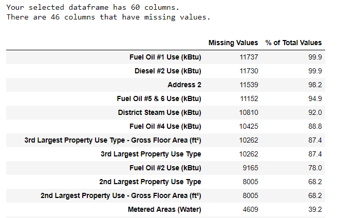  
_Для создания таблицы использована функция из ветки на StackOverflow._

Убирать информацию всегда нужно с осторожностью, и если много значений в колонке отсутствует, то она, вероятно, не пойдёт на пользу нашей модели. Порог, после которого колонки лучше выкидывать, зависит от вашей задачи ([вот обсуждение](https://discuss.analyticsvidhya.com/t/what-should-be-the-allowed-percentage-of-missing-values/2456)), а в нашем проекте мы будем удалять колонки, пустые более чем на половину.

Также на этом этапе лучше удалить аномальные значения. Они могут возникать из-за опечаток при вводе данных или из-за ошибок в единицах измерений, либо это могут быть корректные, но экстремальные значения. В данном случае мы удалим «лишние» значения, руководствуясь [определением экстремальных аномалий](https://www.itl.nist.gov/div898/handbook/prc/section1/prc16.htm):

*   Ниже первого квартиля − 3 ∗ интерквартильный размах.
*   Выше третьего квартиля \+ 3 ∗ интерквартильный размах.

Код, удаляющий колонки и аномалии, приведён в блокноте на Github. По завершении процесса очистки данных и удаления аномалий у нас осталось больше 11 000 зданий и 49 признаков.

## Разведочный анализ данных

Скучный, но необходимый этап очистки данных закончен, можно перейти к исследованию! [Разведочный анализ данных](https://ru.wikipedia.org/wiki/%D0%A0%D0%B0%D0%B7%D0%B2%D0%B5%D0%B4%D0%BE%D1%87%D0%BD%D1%8B%D0%B9_%D0%B0%D0%BD%D0%B0%D0%BB%D0%B8%D0%B7_%D0%B4%D0%B0%D0%BD%D0%BD%D1%8B%D1%85) (РАД) — неограниченный по времени процесс, в ходе которого мы вычисляем статистику и ищем в данных тенденции, аномалии, шаблоны или взаимосвязи.

Коротко говоря, РАД — это попытка выяснить, что нам могут сказать данные. Обычно анализ начинается с поверхностного обзора, затем мы находим интересные фрагменты и анализируем их подробнее. Выводы могут быть интересными сами по себе, или они могут способствовать выбору модели, помогая решить, какие признаки мы будем использовать.

#### Однопеременные графики

Наша цель — прогнозировать значение Energy Star Score (в наших данных переименовано в `score`), так что имеет смысл начать с исследования распределения этой переменной. Гистограмма — простой, но эффективный способ визуализации распределения одиночной переменной, и её можно легко построить с помощью `matplotlib`.

    import matplotlib.pyplot as plt
    
    plt.style.use('fivethirtyeight')
    plt.hist(data['score'].dropna(), bins = 100, edgecolor = 'k');
    plt.xlabel('Score'); plt.ylabel('Number of Buildings'); 
    plt.title('Energy Star Score Distribution');

Выглядит подозрительно! Балл Energy Star Score является процентилем, значит следует ожидать единообразного распределения, когда каждый балл присваивается одному и тому же количеству зданий. Однако высший и низший результаты получило непропорционально большое количество зданий (для Energy Star Score чем больше, тем лучше).

Если мы снова посмотрим на определение этого балла, то увидим, что он рассчитывается на основе «самостоятельно заполняемых владельцами зданий отчётов», что может объяснить избыток очень больших значений. Просить владельцев зданий сообщать о своём энергопотреблении, это как просить студентов сообщать о своих оценках на экзаменах. Так что это, пожалуй, не самый объективный критерий оценки энергоэффективности недвижимости.

Если бы у нас был неограниченный запас времени, то можно было бы выяснить, почему так много зданий получили очень высокие и очень низкие баллы. Для этого нам пришлось бы выбрать соответствующие здания и внимательно их проанализировать. Но нам нужно только научиться прогнозировать баллы, а не разработать более точный метод оценки. Можно пометить себе, что у баллов подозрительное распределение, но мы сосредоточимся на прогнозировании.

#### Поиск взаимосвязей

Главная часть РАД — поиск взаимосвязей между признаками и нашей целью. Коррелирующие с ней переменные полезны для использования в модели, потому что их можно применять для прогнозирования. Один из способов изучения влияния категориальной переменной (которая принимает только ограниченный набор значений) на цель — это построить график плотности с помощью библиотеки Seaborn.

[График плотности можно считать сглаженной гистограммой](https://towardsdatascience.com/histograms-and-density-plots-in-python-f6bda88f5ac0), потому что он показывает распределение одиночной переменной. Можно раскрасить отдельные классы на графике, чтобы посмотреть, как категориальная переменная меняет распределение. Этот код строит график плотности Energy Star Score, раскрашенный в зависимости от типа здания (для списка зданий с более чем 100 измерениями):

    # Create a list of buildings with more than 100 measurements
    types = data.dropna(subset=['score'])
    types = types['Largest Property Use Type'].value_counts()
    types = list(types[types.values > 100].index)
    
    # Plot of distribution of scores for building categories
    figsize(12, 10)
    
    # Plot each building
    for b_type in types:
        # Select the building type
        subset = data[data['Largest Property Use Type'] == b_type]
        
        # Density plot of Energy Star Scores
        sns.kdeplot(subset['score'].dropna(),
                   label = b_type, shade = False, alpha = 0.8);
        
    # label the plot
    plt.xlabel('Energy Star Score', size = 20); plt.ylabel('Density', size = 20); 
    plt.title('Density Plot of Energy Star Scores by Building Type', size = 28);

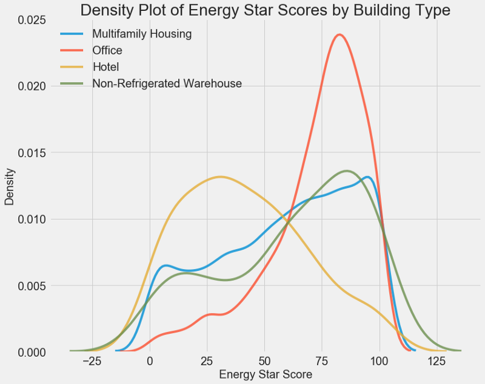

Как видите, тип здания сильно влияет на количество баллов. Офисные здания обычно имеют более высокий балл, а отели более низкий. Значит нужно включить тип здания в модель, потому что этот признак влияет на нашу цель. В качестве категориальной переменной мы должны выполнить one-hot кодирование типа здания.

Аналогичный график можно использовать для оценки Energy Star Score по районам города:

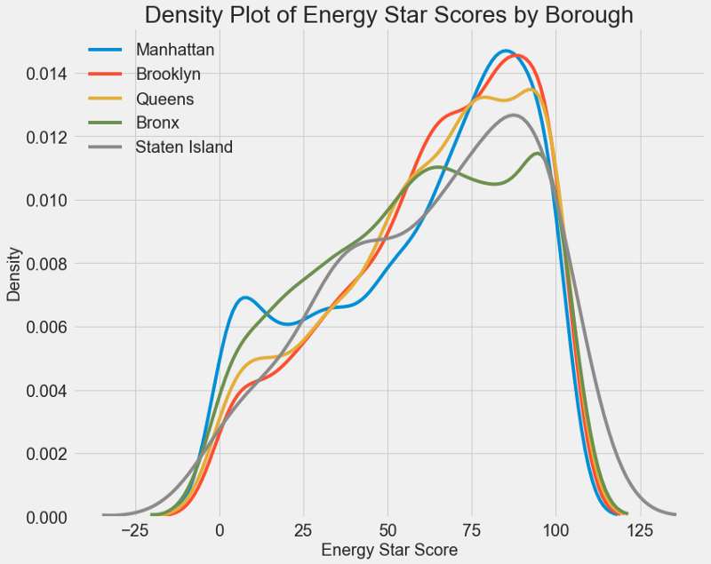

Район не так сильно влияет на балл, как тип здания. Тем не менее мы включим его в модель, потому что между районами существует небольшая разница.

Чтобы посчитать взаимосвязи между переменными, можно использовать [коэффициент корреляции Пирсона](http://www.statisticshowto.com/probability-and-statistics/correlation-coefficient-formula/). Это мера интенсивности и направления линейной зависимости между двумя переменными. Значение +1 означает идеально линейную положительную зависимость, а -1 означает идеально линейную отрицательную зависимость. Вот несколько примеров значений [коэффициента корреляции Пирсона](https://en.wikipedia.org/wiki/Pearson_correlation_coefficient):

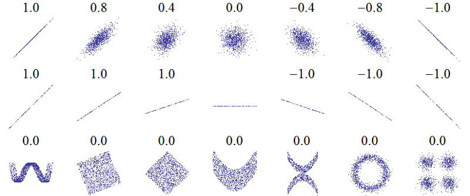

Хотя этот коэффициент не может отражать нелинейные зависимости, с него можно начать оценку взаимосвязей переменных. В Pandas можно легко вычислить корреляции между любыми колонками в кадре данных (dataframe):

    # Find all correlations with the score and sort 
    correlations_data = data.corr()['score'].sort_values()

Самые отрицательные корреляции с целью:

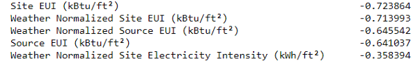

и самые положительные:

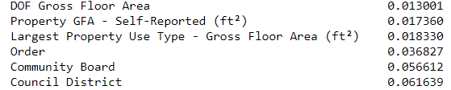

Есть несколько сильных отрицательных корреляций между признаками и целью, причём наибольшие из них относятся к разным категориям EUI (способы расчёта этих показателей слегка различаются). [EUI  (Energy Use Intensity](https://www.energystar.gov/buildings/facility-owners-and-managers/existing-buildings/use-portfolio-manager/understand-metrics/what-energy),  интенсивность использования энергии) —  это количество энергии, потреблённой зданием, делённое на квадратный фут площади. Эта удельная величина используется для оценки энергоэффективности, и чем она меньше, тем лучше. Логика подсказывает, что эти корреляции оправданны: если EUI увеличивается, то Energy Star Score должен снижаться.

#### Двухпеременные графики

Воспользуемся диаграммами рассеивания для визуализации взаимосвязей между двумя непрерывными переменными. К цветам точек можно добавить дополнительную информацию, например, категориальную переменную. Ниже показана взаимосвязь Energy Star Score и EUI, цветом обозначены разные типы зданий:

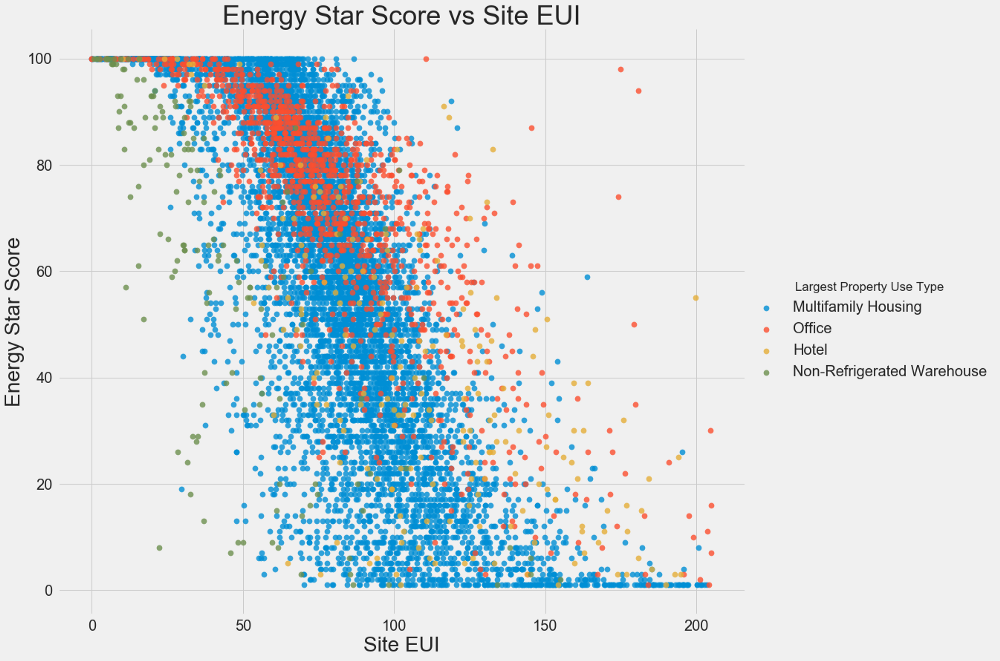

Этот график позволяет визуализировать коэффициент корреляции -0,7. По мере уменьшения EUI увеличивается Energy Star Score, эта взаимосвязь наблюдается у зданий разных типов.

Наш последний исследовательский график называется [Pairs Plot (парный график)](https://towardsdatascience.com/visualizing-data-with-pair-plots-in-python-f228cf529166). Это прекрасный инструмент, позволяющий увидеть взаимосвязи между различными парами переменных и распределение одиночных переменных. Мы воспользуемся библиотекой Seaborn и функцией `PairGrid` для создания парного графика с диаграммой рассеивания в верхнем треугольнике, с гистограммой по диагонали, двухмерной диаграммой плотности ядра и коэффициентов корреляции в нижнем треугольнике.

    # Extract the columns to plot
    plot_data = features[['score', 'Site EUI (kBtu/ft²)', 
                          'Weather Normalized Source EUI (kBtu/ft²)', 
                          'log_Total GHG Emissions (Metric Tons CO2e)']]
    
    # Replace the inf with nan
    plot_data = plot_data.replace({np.inf: np.nan, -np.inf: np.nan})
    
    # Rename columns 
    plot_data = plot_data.rename(columns = {'Site EUI (kBtu/ft²)': 'Site EUI', 
                                            'Weather Normalized Source EUI (kBtu/ft²)': 'Weather Norm EUI',
                                            'log_Total GHG Emissions (Metric Tons CO2e)': 'log GHG Emissions'})
    
    # Drop na values
    plot_data = plot_data.dropna()
    
    # Function to calculate correlation coefficient between two columns
    def corr_func(x, y, **kwargs):
        r = np.corrcoef(x, y)[0][1]
        ax = plt.gca()
        ax.annotate("r = {:.2f}".format(r),
                    xy=(.2, .8), xycoords=ax.transAxes,
                    size = 20)
    
    # Create the pairgrid object
    grid = sns.PairGrid(data = plot_data, size = 3)
    
    # Upper is a scatter plot
    grid.map_upper(plt.scatter, color = 'red', alpha = 0.6)
    
    # Diagonal is a histogram
    grid.map_diag(plt.hist, color = 'red', edgecolor = 'black')
    
    # Bottom is correlation and density plot
    grid.map_lower(corr_func);
    grid.map_lower(sns.kdeplot, cmap = plt.cm.Reds)
    
    # Title for entire plot
    plt.suptitle('Pairs Plot of Energy Data', size = 36, y = 1.02);
    

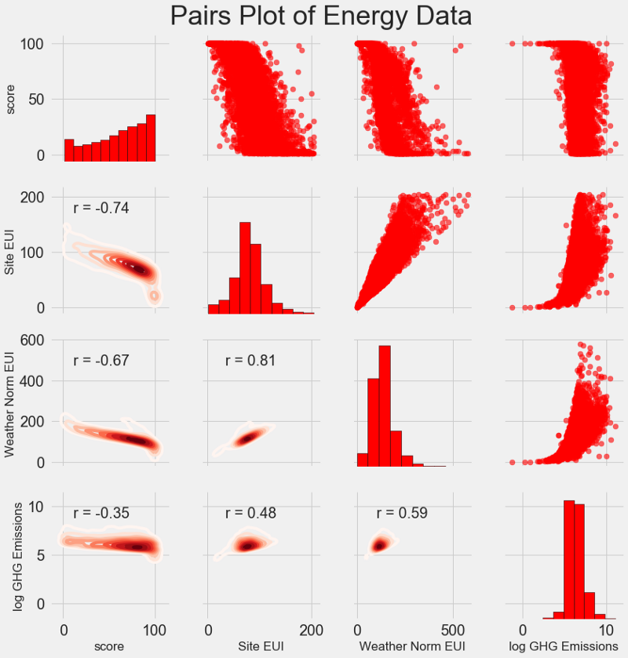

Чтобы увидеть взаимосвязи переменных, поищем пересечения рядов и колонок. Допустим, нужно посмотреть корреляцию `Weather Norm EUI` и `score`, тогда мы ищем ряд `Weather Norm EUI` и колонку `score`, на пересечении которых стоит коэффициент корреляции -0,67. Эти графики не только классно выглядят, но и помогают выбрать переменные для модели.

## Конструирование и выбор признаков

[Конструирование и выбор признаков](https://elitedatascience.com/feature-engineering-best-practices) зачастую приносит наибольшую отдачу с точки зрения времени, потраченного на машинное обучение. Сначала дадим определения:

*   [Конструирование признаков:](https://machinelearningmastery.com/discover-feature-engineering-how-to-engineer-features-and-how-to-get-good-at-it/) процесс извлечения или создания новых признаков из сырых данных. Чтобы использовать переменные в модели, возможно, их придётся преобразовывать, скажем, брать натуральный логарифм, или извлекать квадратный корень, или применять one-hot кодирование категориальных переменных. Конструирование признаков можно рассматривать как создание дополнительных признаков из сырых данных.
*   [Выбор признаков:](https://machinelearningmastery.com/an-introduction-to-feature-selection/) процесс выбора из данных самых релевантных признаков, в ходе которого мы удаляем часть признаков, чтобы помочь модели лучше обобщать новые данные ради получения более интерпретируемой модели. Выбор признаков можно рассматривать как удаление «лишнего», чтобы осталось только самое важное.

Модель машинного обучения может учиться только на предоставленных нами данных, поэтому крайне важно удостовериться, что мы включили всю релевантную для нашей задачи информацию. Если не предоставить модели корректные данные, она не сможет научиться и не будет выдавать точные прогнозы!

Мы сделаем следующее:

*   Применим к категориальным переменным (квартал и тип собственности) one-hot кодирование.
*   Добавим взятие натурального логарифма от всех числовых переменных.

[One-hot кодирование](https://hackernoon.com/what-is-one-hot-encoding-why-and-when-do-you-have-to-use-it-e3c6186d008f) необходимо для того, чтобы включить в модель категориальные переменные. Алгоритм машинного обучения не сможет понять тип «офис», так что если здание офисное, мы присвоим ему признак 1, а если не офисное, то 0.

Добавление преобразованных признаков поможет модели узнать о нелинейных взаимосвязях внутри данных. В анализе данных является нормальной практикой [извлекать квадратные корни, брать натуральные логарифмы или ещё как-то преобразовывать признаки](https://datascience.stackexchange.com/questions/21650/feature-transformation-on-input-data), это зависит от конкретной задачи или вашего знания лучших методик. В данном случае мы добавим натуральный логарифм всех числовых признаков.

Этот код выбирает числовые признаки, вычисляет их логарифмы, выбирает два категориальных признака, применяет к ним one-hot кодирование и объединяет оба множества в одно. Судя по описанию, предстоит куча работы, но в Pandas всё получается довольно просто!

    
    features = data.copy()
    
    
    numeric_subset = data.select_dtypes('number')
    
    
    for col in numeric_subset.columns:
        
        if col == 'score':
            next
        else:
            numeric_subset['log_' + col] = np.log(numeric_subset[col])
            
    
    categorical_subset = data[['Borough', 'Largest Property Use Type']]
    
    
    categorical_subset = pd.get_dummies(categorical_subset)
    
    
    
    features = pd.concat([numeric_subset, categorical_subset], axis = 1)

Теперь у нас есть больше 11 000 наблюдений (зданий) со 110 колонками (признаками). Не все признаки будут полезны для прогнозирования Energy Star Score, поэтому займёмся выбором признаков и удалим часть переменных.

#### Выбор признаков

Многие из имеющихся 110 признаков избыточны, потому что сильно коррелируют друг с другом. К примеру, вот график EUI и Weather Normalized Site EUI, у которых коэффициент корреляции равен 0,997.

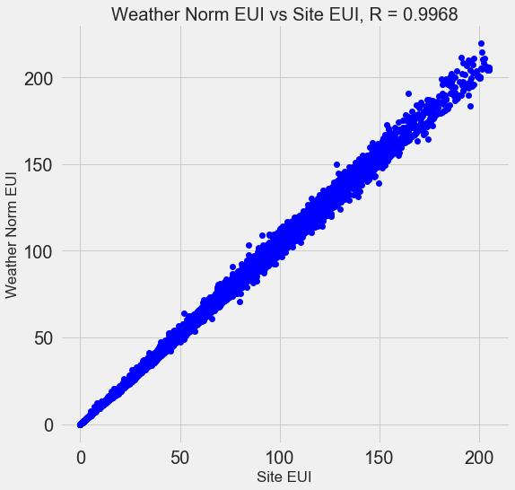

Признаки, которые сильно коррелируют друг с другом, называются [коллинеарными](https://ru.wikipedia.org/wiki/%D0%9C%D1%83%D0%BB%D1%8C%D1%82%D0%B8%D0%BA%D0%BE%D0%BB%D0%BB%D0%B8%D0%BD%D0%B5%D0%B0%D1%80%D0%BD%D0%BE%D1%81%D1%82%D1%8C). Удаление одной переменной в таких парах признаков часто помогает [модели обобщать и быть более интерпретируемой](https://www.quora.com/Why-is-multicollinearity-bad-in-laymans-terms-In-feature-selection-for-a-regression-model-intended-for-use-in-prediction-why-is-it-a-bad-thing-to-have-multicollinearity-or-highly-correlated-independent-variables). Обратите внимание, что речь идёт о корреляции одних признаков с другими, а не о корреляции с целью, что только помогло бы нашей модели!

Существует ряд методов вычисления коллинеарности признаков, и один из самых популярных — фактор увеличения дисперсии ([variance inflation factor](http://www.statisticshowto.com/variance-inflation-factor/)). Мы для поиска и удаления коллинеарных признаков воспользуемся коэффициентом В-корреляции (thebcorrelation coefficient). Отбросим одну пару признаков, если коэффициент корреляции между ними больше 0,6. Код приведён в блокноте (и в ответе на [Stack Overflow](https://stackoverflow.com/a/43104383)).

Это значение выглядит произвольным, но на самом деле я пробовал разные пороги, и приведённый выше позволил создать наилучшую модель. Машинное обучение [эмпирично](http://www.dictionary.com/browse/empirical), и часто приходится экспериментировать, чтобы найти лучшее решение. После выбора у нас осталось 64 признака и одна цель.

    # Remove any columns with all na values
    features  = features.dropna(axis=1, how = 'all')
    print(features.shape)
    (11319, 65)

  

## Выбираем базовый уровень

Мы очистили данные, провели разведочный анализ и сконструировали признаки. И прежде чем перейти к созданию модели, нужно выбрать исходный базовый уровень (naive baseline) — некое предположение, с которым мы будем сравнивать результаты работы моделей. Если они окажутся ниже базового уровня, мы будем считать, что машинное обучение неприменимо для решения этой задачи, или что нужно попробовать иной подход.

Для регрессионных задач в качестве базового уровня разумно угадывать медианное значение цели на обучающем наборе для всех примеров в тестовом наборе. Эти наборы задают барьер, относительно низкий для любой модели.

В качестве метрики возьмём [среднюю абсолютную ошибку (mae)](https://en.wikipedia.org/wiki/Mean_absolute_error) в прогнозах. Для регрессий есть много других метрик, но мне нравится [совет](https://www.coursera.org/learn/machine-learning-projects/lecture/wIKkC/single-number-evaluation-metric) выбирать какую-то одну метрику и с её помощью оценивать модели. А среднюю абсолютную ошибку легко вычислить и интерпретировать.

Прежде чем вычислять базовый уровень, нужно разбить данные на обучающий и тестовый наборы:

1.  Обучающий набор признаков — то, что мы предоставляем нашей модели вместе с ответами в ходе обучения. Модель должна выучить соответствие признаков цели.
2.  Тестовый набор признаков используется для оценки обученной модели. Когда она обрабатывает тестовый набор, то не видит правильных ответов и должна прогнозировать, опираясь только на доступные признаки. Мы знаем ответы для тестовых данных и можем сравнить с ними результаты прогнозирования.

Для обучения используем 70 % данных, а для тестирования — 30 %:

    # Split into 70% training and 30% testing set
    X, X_test, y, y_test = train_test_split(features, targets, 
                                            test_size = 0.3, 
                                            random_state = 42)

Теперь вычислим показатель для исходного базового уровня:

    # Function to calculate mean absolute error
    def mae(y_true, y_pred):
        return np.mean(abs(y_true - y_pred))
    
    baseline_guess = np.median(y)
    
    print('The baseline guess is a score of %0.2f' % baseline_guess)
    print("Baseline Performance on the test set: MAE = %0.4f" % mae(y_test, baseline_guess))

**The baseline guess is a score of 66.00  
Baseline Performance on the test set: MAE = 24.5164**

Средняя абсолютная ошибка на тестовом наборе составила около 25 пунктов. Поскольку мы оцениваем в диапазоне от 1 до 100, то ошибка составляет 25 % — довольно низкий барьер для модели!

## Заключение

Вы этой статье мы прошли через три первых этапа решения задачи с помощью машинного обучения. После постановки задачи мы:

1.  Очистили и отформатировали сырые данные.
2.  Провели разведочный анализ для изучения имеющихся данных.
3.  Выработали набор признаков, которые будем использовать для наших моделей.

Наконец, мы вычислили базовый уровень, с помощью которого будем оценивать наши алгоритмы.

В [следующей статье](https://habr.com/company/nixsolutions/blog/425907/) мы научимся с помощью [Scikit-Learn](http://scikit-learn.org/stable/) оценивать модели машинного обучения, выбирать лучшую модель и выполнять её гиперпараметрическую настройку.