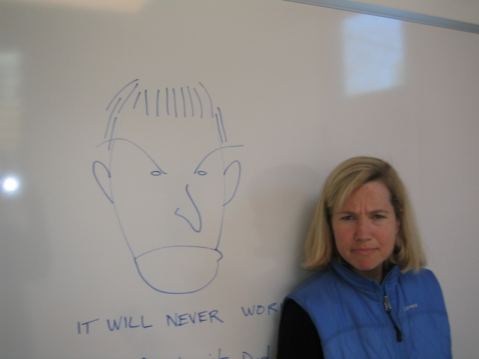
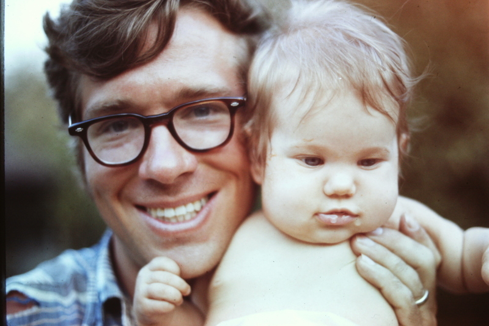
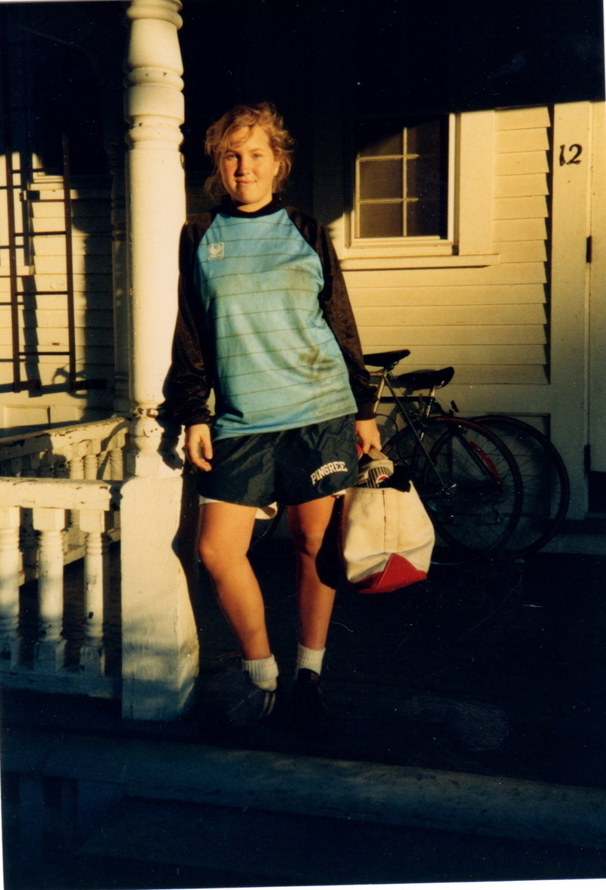
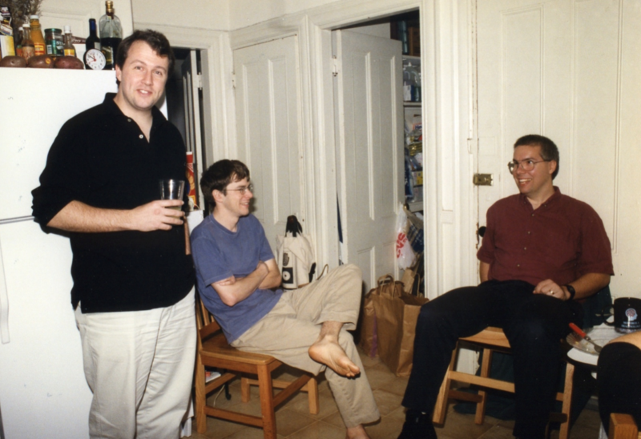
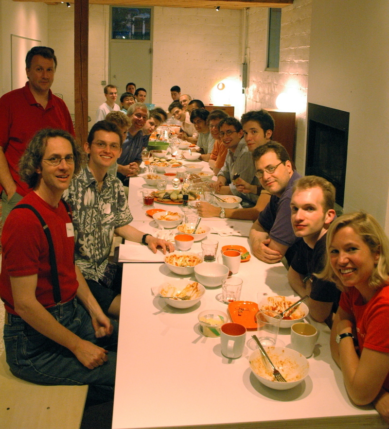
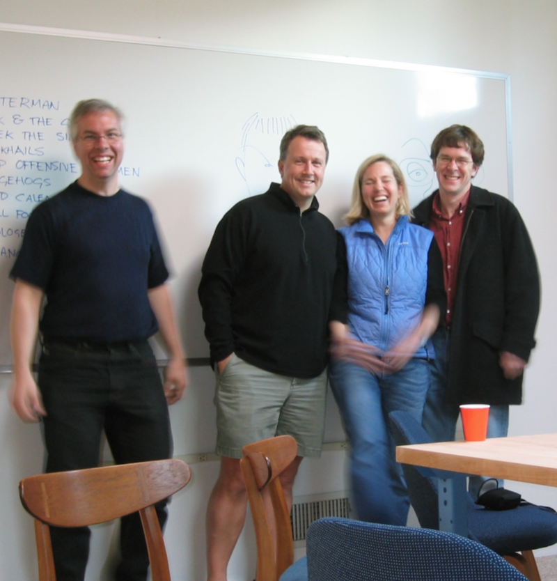
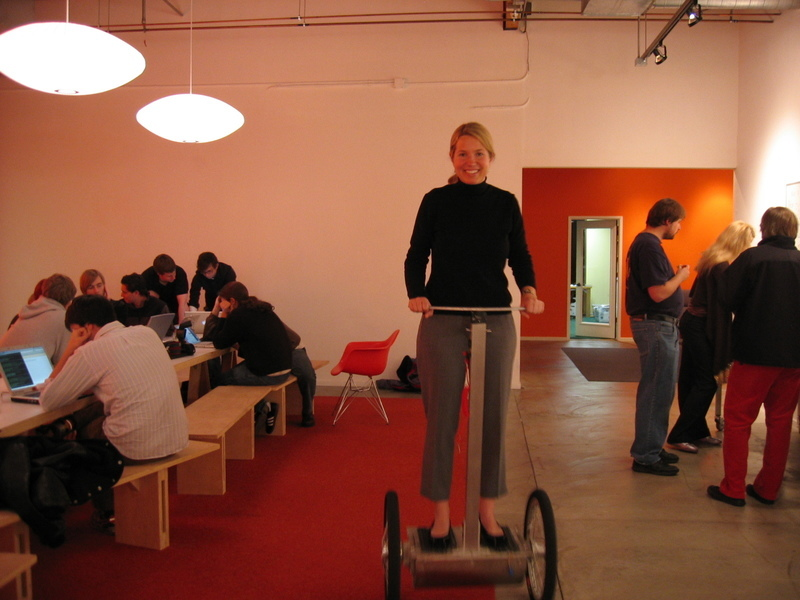

Джессика Ливингстон: «Как мы создавали Y Combinator. Эмоциональная составляющая» / Блог компании Edison

> _«Мы должны были судить претендентов не по тому, кем они были, а по тому, кем они могли стать.»_

В 2005 году я приложила руку к основанию Y Combinator, первого «акселератора». Сегодня их сотни по всему миру, но в 2005 году то, что мы делали, было настолько необычным, что большинство людей в Силиконовой долине считали нас незначительными.

Y Combinator начинался так же, как и большинство других стартапов: с предположения, что наш продукт нужен людям. В итоге оказалось, что им и вправду это было нужно, и мы росли и росли. На сегодняшний день мы профинансировали 1867 стартапов на общую сумму более 100 миллиардов долларов.

Так что, раз уж мне выпало пройти через тот тип стартапа, на который многие из вас надеются, мне хочется рассказать вам свою собственную историю.

Если вы слышали обо мне только через средства массовой информации, у вас может сложиться впечатление, что мой вклад в Y Combinator заключается в том, что я жена Пола Грэма. И хотя мне нравится быть его женой, всё же я внесла чуть более весомый вклад.  

> _Перевод выполнен при поддержке компании [EDISON Software](https://www.edsd.com/), которая [инвестирует в перспективные стартапы](https://www.edsd.com/about/investing-in-products), а так же [разрабатывает различные облачные сервисы](https://www.edsd.com/cloud-services-and-mobile-applications-in-java)._

Я родилась в Миннеаполисе в 1971 году. Позже в том же году моя мать ушла из дома, оставив отца наедине с маленьким ребенком. Поэтому он отвез меня обратно в Бостон, где жила моя бабушка. Я жила с ней с понедельника по пятницу, пока мой отец работал, а затем проводила с ним выходные.

Моя бабушка была для меня главным образцом для подражания. Она была очень независимым человеком. Все, кто её знал, характеризовали её одной и той же фразой: «свободомыслящая». Например, зимой, после того, как она укладывала меня в постель, она выходила и работала до поздней ночи над гигантскими ледяными скульптурами, которые она строила во дворе.

Она делала то, что хотела, и ей было плевать, считают ли её не от мира сего.

Несмотря на то, что я росла без матери, мое детство было довольно счастливым. Мой отец пожертвовал многим, чтобы я имела возможность получить хорошее образование, и он постоянно поддерживал меня.

Когда я была маленькой, я играла в футбол, и в 9-м классе мы участвовали в выездной игре против школы под названием Phillips Academy в Андовере, штат Массачусетс. Место показалось мне невероятно сказочным, и я тут же решила, что пойду туда в школу.

Тогда я не подозревала, что это решение будет иметь противоречивые последствия. В моей старой школе я была, так сказать, большой рыбой в маленьком пруду. Я была отличницей и мне легко давался спорт. Но когда я переехала в Андовер осенью 1986 года, оказалось, что там все были отличниками и им всем легко давался спорт. Я очень расстроилась и, по сути, опустила руки.

Я стала посредственным студентом и не делала ничего впечатляющего или примечательного в течение следующего десятилетия. Это время можно назвать моими собственными Темными Веками.

Немного неловко вспоминать их, но я думаю, что будет важно упомянуть об этом. Когда журналисты и биографы пишут об основателях успешных проектов, они часто обращают внимание на то, что ещё в молодости им сулили успех. В моем случае подобных предсказаний определённо не было. Никто бы не назвал меня тем человеком, у которого по жизни «скорее всего, всё удастся».

Но хотя у меня и не имелось никаких «достижений», в молодости у меня всё же были три главных черты, которые позволили проекту Y Combinator стать реальностью.

Первым было то качество, которое заставило моих соучредителей YC прозвать меня «Социальным Радаром». Я была тем ребёнком, который не может просто пройти мимо чего-либо. Если что-то казалось странным или необычным, я это замечала и исследовала. Я всегда пыталась понять вещи, полагаясь на своё чутьё тонких социальных сигналов.

Во-вторых, мне никогда не нравилось быть у кого-то в подчинении. Я ненавидела любого, кто говорил мне, что делать или не делать: родителей, учителей, начальников, людей, с которыми я была вынуждена сотрудничать, но не соглашалась с ними — в общем, всех.

И третьей отличительной чертой было во мне то, что я всегда была открытым, прямым, честным человеком. Моя бабушка и мой отец оба были такими.

Но я вернусь к этому пункту позже.

На следующий день после того, как я окончила колледж, моя любимая бабушка умерла от рака. Это было очень грустное и одинокое время моей жизни. И теперь предполагалось, что я должна найти работу с дипломом по английскому языку и абсолютно без понятия, чем я хотела бы заниматься.

Я нашла работу в Fidelity Investments в их группе обслуживания клиентов, отвечая на звонки с 3:30 до полуночи каждый день. По сути, всё сводилось к разговорам с розничными инвесторами о том, почему их счет в Magellan закрылся в тот день. Кошмар. Мне не нравилась эта работа, но мне нравилось, что у меня она вообще есть. Я упорно работала, получала за это деньги, и над моей головой не висело обязательное выполнение домашнего задания. Это было здорово. После Fidelity я работала в отделе по связям с инвесторами в Нью-Йорке, затем в журнале Food & Wine и в автомобильной консалтинговой фирме. Я даже недолго работала планировщиком свадеб.

В 2003 году я работала в отделе маркетинга в инвестиционном банке в Бостоне, и тогда я впервые встретилась с Полом Грэмом на вечеринке в его доме.

Мы начали встречаться, и я почувствовала, что наконец-то встретила мистера Того Самого.

Несмотря на то, что у нас было абсолютно разное прошлое, мы были удивительно похожи. Если я и считала невозможным то, что я когда-нибудь захочу кому-то подчиниться, то Пол подошёл к возможности этого ближе всех.

Он вернулся в Кембридж после того, как продал свой стартап Viaweb Yahoo, и в то время писал эссе, работал над языками программирования, издавал книгу и лечил свой изнурительный страх полета, учась летать на дельтаплане.

Пол решает проблемы так, как никто. Кроме того, он — гений в том, что касается расширения идей и радикальном улучшении вещей. Одна из его определяющих черт как бы говорит людям: «Вы знаете, что вы должны сделать...»

Пол и его круг друзей познакомили меня с этим новым миром стартапов. Это показалось гораздо более захватывающим, чем поздний этап продающихся на бирже компаний информационных технологий, с которыми я работала в инвестиционном банке. Я прочла книгу «Startup» Джерри Каплана о его компании под названием GO, занимающейся жестовыми интерфейсами (pen computing), и я сразу же продалась с потрохами. Это было похоже на свет, сияющий с небес.

Я хотела услышать больше историй о первых днях стартапов, поэтому я начала работать над книгой, содержащей интервью с основателями стартапов. Книга называлась «Founders at Work» и была опубликована в 2007 году.

Чем больше я интересовалась стартапами, тем меньше меня интересовала моя работа. «Пузырь» лопнул несколько лет назад и инвестиционный банк резко сокращал свои расходы. Работать там стало скучно и неприятно.

Поэтому я подала заявку на работу, связанную с маркетингом в венчурной фирме, где, как я чувствовала, я могу быть на шаг ближе к более захватывающему миру стартапов. Пока я занималась тем, что брала интервью и работала в венчурной фирме, Пол каждый вечер за обедом объяснял мне, что «я знаю, что должна сделать», рассказывая, как я смогу изменить венчурный бизнес, если только займусь им. Мы часами говорили о том, насколько сложно найти финансирование стартапам на ранних этапах, и что наиболее важно, насколько увеличится количество людей, которые будут иметь возможность запустить стартап, если это будет проще.

Поскольку венчурная фирма всё больше и больше затягивала с оформлением меня на работу, идеи Пола казались мне все более убедительными, пока однажды ночью Пол не сказал: «Давай просто сделаем это сами». На следующий день мы убедили соучредителей Пола из Viaweb, Роберта и Тревора, присоединиться к нам на полставки.

Первоначальный план состоял в том, чтобы они выбирали и консультировали стартапы, а я делала все остальное.

Вместо того, чтобы отдавать большие суммы небольшому количеству известных стартапов, как это делали традиционные венчурные фирмы, мы давали небольшие суммы большому количеству стартапов на ранних стадиях, а затем оказывали им большую помощь.

Нашей первоначальной целевой аудиторией были программисты, которые, как мы считали, могли справиться с техническими аспектами стартапа, но ничего не знали обо всем остальном, как и Пол, Роберт и Тревор когда-то.

Кроме того, мы верили в молодых основателей проектов, в отличие от большинства инвесторов в то время. Это было в те времена, когда венчурные капиталисты Google настаивали на том, чтобы основатели стартапа нанимали внешнего исполнительного директора в качестве условия их серии A-раунда.

Ни у кого из нас не было опыта частного венчурного инвестора, обеспечивающего финансовую и экспертную поддержку компаний на ранних этапах развития, и именно отсюда возникла идея финансирования стартапов партиями. Мы решили финансировать сразу несколько стартапов летом, чтобы разобраться в том, как быть инвесторами. В марте 2005 года мы запустили веб-сайт Y Combinator, предложив людям подать заявку на то, что мы назвали «Летняя программа для основателей стартапов».

Тем летом мы профинансировали 8 стартапов и почти сразу прочувствовали весь потенциал комплексного инвестирования. Это было намного удобнее для стартаперов. Теперь рядом с ними были коллеги, готовые помочь в этом прежде одиноком процессе. Однако для нас это ещё и являлось гораздо более эффективным способом помочь стартапам, потому что мы могли сделать для них всё сразу. Каждый вторник Пол готовил ужин для всех основателей, и на каждом ужине мы приглашали какого-нибудь докладчика, который учил их искусству стартапа.

Пол говорил со всеми стартаперами о том, что они делают, а я помогала им всем зарегистрироваться в качестве субъектов налогообложения, которые выплачивают дивиденды собственникам корпоративных прав из чистой прибыли, не являясь при этом налоговым агентом своих собственников, которые самостоятельно уплачивают налог с доходов. В те дни это было трудной задачей, потому что, чтобы стать подобным субъектом, нужно было заплатить адвокату 15 000 долларов, и тогда он делал это за вас.

Первым летом мы дали стартапам по 6 тысяч долларов на одного основателя, что основывалось на стипендии, которую MIT выдавал студентам на лето. В конце лета мы провели первый Демонстрационный День для аудитории около 15 инвесторов. Reddit был в этой первой группе, а также основатели Twitch, хотя они работали над другой идеей, и геолокационный стартап Сэма Альтмана.

Хотя мы и пытались профинансировать партию стартапов, просто чтобы научиться быть инвесторами, через пару недель мы поняли, что мы двигаемся к чему-то перспективному.

Поэтому мы решили делать все наши инвестиции партиями. Мы также решили, что будем финансировать следующую партию стартапов в Силиконовой долине. Мы знали, что многие будут копировать нас, и не хотели, чтобы кто-то еще был «Y Combinator of Silicon Valley». Мы хотели зваться так сами.

Несмотря на то, что мы значительно выросли и расширились во многих отношениях, основная программа YC удивительно похожа на ту, что существовала 13 лет назад.

Вопрос, который я постоянно слышала от людей на протяжении многих лет, звучал так: «Какова ваша роль в YC?» Раньше меня это реально раздражало, потому что никто никогда не задавал Полу, Роберту или Тревору этот вопрос. Но сейчас я думаю, что это интересный вопрос.

Какова была роль единственного нетехнического основателя Y Combinator?

В начале были тонны поручений, как и в любом стартапе, которые просто нужно было выполнить, и больше их выполнить было некому. Пол и я прекрасно разделили обязанности, что, на мой взгляд, очень важно, когда вы начинаете стартап со своим партнером или супругом.

Он сделал наш веб-сайт и форму заявки, а я подготовила другие материалы для этого первого лета: я работала с юристами, чтобы создать организацию Y Combinator и все виды шаблонных юридических документов для наших стандартных инвестиций, а также всё, что может понадобится учредителям, чтобы организовать свою компанию и правильно распределить акции (довольно большое количество дел, как вы знаете, если когда-либо этим занимались!).

Также мне пришлось быстро научиться тому, как объяснять нашим подопечным, как нужно заполнять все документы, чтобы им не приходилось оплачивать услуги юриста. Мне пришлось обустроить небольшое офисное здание в Кембридже, принадлежащее Полу, чтобы мы могли еженедельно собираться на ужин для 25 человек. Я занималась нашим банковским счетом и связывалась с людьми, с которыми нам нужно поговорить на очередном обеде каждую неделю.

Я покупала продукты, из которых Пол готовил что-нибудь для ужинов. Я даже привозила основателям кондиционеры, которые я купила в Home Depot. Я была единственной из нас, кто был достаточно организован, чтобы воплотить всё это в жизнь качественно.

Когда дело доходило до инвестирования, у меня было то, чего не было у моих коллег: я была социальным радаром. Я не могла судить о технических возможностях наших претендентов или даже о большинстве идей. Мои соучредители были экспертами в этих вещах. Я же смотрела на качества претендентов, которые мои коллеги не видели. Казались ли они серьезными? Были ли они полны решимости? Мыслили ли они гибко? И самое главное, какими были отношения между сооснователями проекта? Пока мои партнеры обсуждали идеи с их авторами, я обычно молча наблюдала за ними. После этого коллеги обращались ко мне и спрашивали: «Стоит ли нам их финансировать?»

С самого начала я строго следила за тем, чтобы мы финансировали только серьезных людей. В то время я никогда не предполагала, что люди, которых мы профинансировали, станут сообществом из тысяч выпускников YC, но я всегда старалась создать сообщество без придурков. Если я понимала, что кто-то из претендентов был тщеславным придурком, мы отказывались их финансировать. Я уверена, что с тех пор мы всё же профинансировали несколько подобных личностей, но в ранние годы я была довольно строга в этом вопросе. И я уверена, что это и является основой нашего сообщества выпускников.

Пока что всё это может звучать немного не так, как ожидается от успешного инвестора. Но когда вы в чем-то доходите до крайности, все становится диаметрально противоположным. Y Combinator был новой крайностью в венчурном бизнесе, поэтому то, что делало кого-то хорошим инвестором, тогда заключалось в другом. Венчурное финансирование полагалось на цифры роста и оценки размеров рынка, но это было неважно на том этапе, на котором инвестировали мы. То, что действительно было нужно венчурному финансированию — хорошие технические специалисты, которые увидят потенциал идеи, и кто-то вроде меня, чтобы понять характер стартаперов и отношения между ними. И чтобы это уметь, нужны способности, которые раньше никто не считал важными для инвестора.

Это было ещё и вдвойне сложно, потому что некоторые из претендентов были очень молоды. Мы должны были судить претендентов не по тому, кем они были, а по тому, кем они могли стать. Представьте себе Марка Цукерберга, вернувшегося в свою комнату в общежитии в 2004 году, с веб-сайтом, который позволяет ученикам колледжа видеть, что делают другие ученики в их школе. Выглядит не так уж супервпечатляюще для традиционных инвесторов.

Другим моим секретным оружием, которое странным образом сильно пригодилось для проекта Y Combinator, стало то, что я была очень опытным организатором мероприятий.

Мероприятия являются важной частью того, что делает YC. Когда вы финансируете стартапы партиями, все становится мероприятием. Интервью — мероприятие, каждый ужин — мероприятие, Демонстрационный День — это мероприятие. По мере роста сообщества выпускников мы начали проводить мероприятия для них, и, начиная с самого первого года, мы проводили крупные мероприятия, такие как Startup School. Я годами проводила мероприятия, работая в маркетинге, поэтому могла организовывать их одной левой.

Вероятно, больше всего отличало YC от типичной инвестиционной фирмы то, что она ощущалась, как семья. И я была его мамой; я была мягкой и чувствительной тогда, когда инвесторы чаще всего были жестокими и агрессивными (и я добавлю «безжалостными» для некоторых из них). Я заботилась о том, что чувствовали претенденты, были ли они перегружены делами, правильно ли они питались. Я давала им советы относительно отношений, которые были напряженными из-за давления стартапа. Я могла долго слушать их и помогала им с разногласиями и расставаниями соучредителей.

Запуск стартапа эмоционально истощает основателей, особенно в начале. Иногда им просто нужен был кто-то, кто бы выслушал их. К счастью, моя карьера в колледже научила меня быть хорошим слушателем, когда люди рассказывают о своих проблемах в отношениях с другими людьми.

И я всегда старалась быть всё тем же честным, прямым и открытым человеком, когда давала совет. На самом деле, мы все были такими. Пол — самый честный человек, которого я знаю, поэтому его советы такие ценные. Он не закапывает это своё качество в эвфемизмах или не (что еще хуже) отказывается от правды, чтобы не ранить чувства людей. И как бы ни были прямолинейны тогда его советы, стартаперы всегда благодарили его за откровенность.

Еще одна наша общая с Полом черта заключалась в том, что мы делали это не ради денег. Мы были заинтересованы в стартапах, мы хотели помочь как можно большему количеству людей начать их. Это было основой всего, что мы делали в YC. Это было тем, что вообще позволило нам создать что-то настолько странное.

Поскольку у YC не было никаких LP (https://en.wikipedia.org/wiki/Limited_partnership) (ограниченное партнерство) на ранних этапах, мы даже не были ограничены какой-либо неопределенной ответственностью доверительного характера перед кем-либо. Это позволило нам больше рисковать в том, какие стартапы мы выберем для финансирования, а также позволило нам благосклонно относиться к неудачным стартапам.

Это часто приводило нас к конфликту с другими инвесторами, у которых были другие приоритеты. Вначале нам довелось финансировать команду мужа и жены, у которых был ребенок. Они много работали над стартапом, но он явно не удавался. Один из их инвесторов пытался уговорить одну крупную компанию в Долине приобрести их, но она в конечном итоге отказалась.

Пол поговорил с основателями и узнал, что они просто хотели обеспечить безопасность рабочих мест, чтобы они могли отдохнуть от постоянного стресса стартапа. Поэтому он поговорил с большой компанией и уговорил их нанять одного из них. Основатели были в восторге. Инвестор же, наоборот, был в ярости. Он взъелся на Пола сильнее, чем кто-либо до этого (ну, до Твиттера), говоря, что Пол проворонил шанс на приобретение их стартапа компанией. Я до сих пор не понимаю, почему инвесторы выжимают стартаперов даже ради таких мелких результатов, как этот.

Я также никогда не заботилась о славе. Или моём личном «бренде». Я просто хотела, чтобы Y Combinator преуспел.

В процессе работы над Y Combinator мы осознали, что наиболее успешные стартапы имеют тенденцию естественным образом происходить из жизни их основателей. Это было верно и в моем случае. Я была почти необычайно хорошо приспособлена к той работе, которая потребовалась для успеха проекта YC. Но те качества, что сделали меня подходящей для этого, было далеки от тех, которые большинство людей ассоциируют с типичными качествами основателей стартапов. Я перечислю их, чтобы вы могли убедиться сами. Я была социальным радаром, хорошим планировщиком событий, обладала материнским чутьем, была чуткой, честной и прямой, не движимой деньгами или славой. Подумайте, насколько это далеко от образа типичного основателя стартапа, о котором вы читали в прессе. Материнское чутье? С каких это пор это стало важным качеством для основателя стартапа? Не говоря уже об основателе инвестиционной фирмы. И все же было важно сделать YC таким, какой он есть.

Вот почему я хотела рассказать вам свою историю. Неправда, что любой человек может запустить любой стартап. Но гораздо больше людей уже имеют то, что нужно, чтобы начать стартап, чем они это осознают. Многие люди, возможно, все люди, имеют определенную комбинацию способностей и интересов. И многие из этих комбинаций соответствуют какой-то идее стартапа.

Поэтому, если вы хотите начать стартап, я рекомендую вам спросить себя, что в вас отличительного. Какое уникальное сочетание способностей и интересов у вас есть? И не редактируйте свои ответы, потому что, как показывает мой пример, ключом к рецептуре могут быть самые неожиданные ингредиенты.

На самом деле, может даже оказаться, что самые странные сочетания качеств являются наиболее ценными. У меня было странное сочетание качеств, но они соответствовали YC, потому что это был странный проект. И самые успешные стартапы, как правило, странные. Они обычно такие резкие и выделяющиеся, что их идеи на первый взгляд звучат нелепо. Для всех, кроме основателей, потому что проект вырос из их опыта.

Так что вы можете узнать из моей истории? Вот 9 пунктов:

1.  **Нет единого шаблона для успешного основателя.** То, что вы можете видеть в новостях только определенный тип, не означает, что вам нужно становиться таким.
2.  **Делайте то, что вам действительно интересно, и старайтесь использовать свои естественные навыки и достоинства**. Стартап требует таких больших энергозатрат, что вы откажетесь от него, если не будете действительно в нём заинтересованы.
3.  **Не обращайте внимание на общественное мнение о том, что вы делаете — будь то ваши навыки, ваша идея или что-то еще.** Если они не ваши потребители, их мнение не имеет значения. (Обращайте внимание на мнение вашей целевой аудитории!)
4.  **Найдите соучредителя с дополнительными навыками, но с таким же моральным компасом, как у вас.** У нас с Полом было отличное сочетание навыков, чтобы начать что-то вроде YC. Мы пришли к единому мнению относительно всех важных вопросов, и каждый из нас считался с компетенцией другого, когда обсуждались мелкие вопросы.
5.  **Сосредоточьтесь на том, чтобы создать то, что нужно людям.** Всё следует из этого. В 2005 году людям нужен был способ легко получить небольшую сумму денежных средств.
6.  **Не позволяйте отказам отвлекать вас или сдерживать.** Вы будете получать отказы по-разному и много, но вы должны продолжать двигаться вперед.
7.  **Начните с малого, чтобы оставаться открытыми для перемен.** Мы бы никогда не смогли перенести наши операции в Силиконовую долину за считанные месяцы, если бы наняли группу людей в Кембридже. По сей день у YC есть традиция пробовать что-то в небольших масштабах, прежде чем расширять очередную идею.
8.  **Ничего страшного, если вы не учились в элитном колледже.** Я выросла, думая, что это означает все. Нас всех учили верить, что вас будут судить по вашей профессиональной квалификации. Но в стартапе вас судит ваша аудитория, а ей важен ваш продукт, а не ваш послужной список.
9.  **Будьте бесстрашными.** Множество разных людей может стать основателями стартапов, но вам на самом деле нужна определенная смелость — работать над идеями, которые большинство людей посчитают глупыми, и продолжать действовать, когда вас высмеивают или игнорируют.

Вы — кусок пазла определенной формы. Вы можете изменить свою форму, чтобы соответствовать существующей дыре в мире. Таков традиционный план. Но есть и другой способ, который зачастую может быть лучше для вас и для всего мира: вырастить вокруг себя новый пазл. Это то, что сделала я, и я была куском довольно странной формы. Так что, если я могу это сделать, у вас больше шансов на успех, чем вы, возможно, считаете.

Только зарегистрированные пользователи могут участвовать в опросе. [Войдите](https://habr.com/auth/login/), пожалуйста.