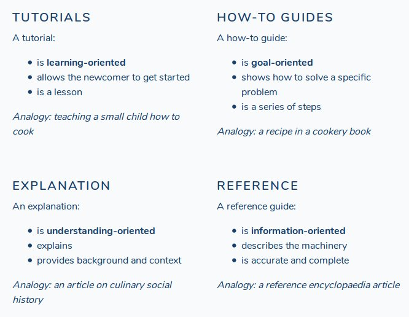
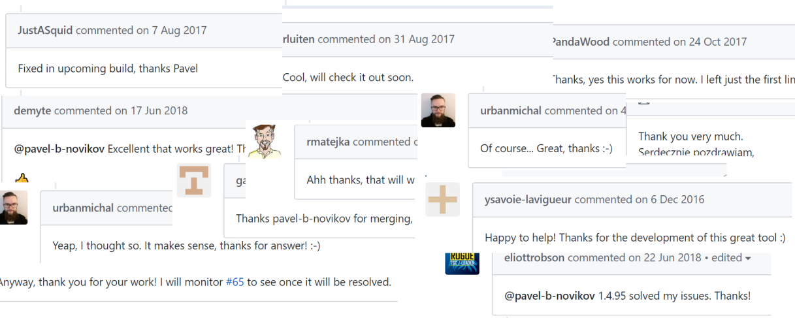

Дилетант в opensource — lessons learned за 3 года

Давно, в 2014 году я сделал для себя небольшую утилитку, чтобы перегонять C#-вьюмодели в TypeScript-код. Она сэкономила мне немало времени и нервов. И вот, в сентябре 2015 я решил оформить свои "эксперименты на коленке" в некую удобоваримую форму и вылить их на GitHub. Так началось моё дилетантское участие в разработке открытого ПО. Время шло. И вот, вчера в репозитории с этим проектом, наконец, появился юбилейный, трёхсотый коммит. В связи с этим знаменательным событием, я бы хотел поделиться своим дилетантским опытом о том, с чем придётся столкнуться, если вам вдруг взбредёт в голову разработать что-то "на благо развития индустрии". Я изложу некоторые цифры, расскажу несколько прохладных историй, а так же поделюсь впечатлениями каково это — написать и поддерживать opensource-проект без ~мам, пап и кредитов~ поддержки компании, оплаты и… и свободного времени. Заходите под кат, присаживайтесь, мы начинаем.

Начнём с того, что на GitHub более [90 миллионов репозиториев](https://octoverse.github.com/). Какие-то из них известны, какие-то не очень, какие-то вообще приватные. В виду массовой популярности, Github начали использовать студенты для заданий, преподаватели для лекций, авторы книг для туториалов и даже [энтузиасты для законодательства](https://github.com/bundestag/gesetze). Вы только представьте какая же это долбанная бездна кода и проектов! Однако же, ставлю бутыль коньяку что если к вам прямо сейчас привяжется журналист и попросит назвать известные репозитории, то навскидку вы назовёте… ну где-то 15-30. Что же это значит? А значит это то, что GitHub — это огроменная вселенная программных продуктов, большинство из которых, я уверен, известны только их авторам. И, может быть, 5-10 их друзьям.

  

> Стать более-менее заметным в этой толпе довольно сложно, скажу я вам.

Даже если вы украдёте данные банковских карт всех-всех пользователей мира и выложите их на GitHub — то я уверен, что ~вас забанят и возбудят уголовное дело~ этого _просто никто не заметит_. Зачем я рассказываю настолько очевидные вещи, спросите вы? А вот… вот ни черта они не очевидные! Особенно для автора этих строк :) Особенно 3 года назад. Тогда я наивно считал, что достаточно сделать что-то действительно полезное, указать теги, написать README и люди сами всё найдут, сами всё скачают. Ну серьёзно, раз уж какой-то [left-pad](https://github.com/stevemao/left-pad), состоящий по существу из 47 строк кода набрал тысячу звёзд, то моей штуковине-то, которая объективно упрощает разработку — ну 300-то наберётся, так ведь?

Ммм… нет. К сожалению, так это не работает. left-pad создан в 2014 и был решительно никому неизвестен до [известных событий 2016 года](https://habr.com/post/280039/). Если посмотреть на график распределения звёзд, то можем наблюдать взлёт почти под 90 градусов как раз в то самое злополучное время. Из этой дивной истории, очевидно, есть несколько печальных выводов:

  

> Без должного маркетинга ваша самая лучшая идея в мире останется незамеченной.  
> Чёрный пиар — тоже пиар  
> Не всегда сумасшедшее количество звёзд говорит о том, что проект хорош

Но не всё так плохо. Если вы уже приготовились впасть в депрессию по этому поводу, то мой вам совет — отложите носовые платочки и подушку для рыданий.

  

> Лучше делайте что-то полезное. Прежде всего — полезное для себя.

Прикиньте без какого программного продукта вам жизнь не в радость. Вот вам лично, читающим этот пост. Какого приложения, фреймворка, сервиса ~чёрта~ вам не хватает? На вашей работе или в вашей повседневной жизни. Прикинули? Отлично. Забейте в гугл и если от выдачи по вашему запросу веет тоской и невнятностью — вперёд! Заводите репозиторий, открывайте IDE и пишите. Пишите то, о чём мечтали, собирайте и выкладывайте. Разгадка проста — если конкретно вам ваш же проект приносит пользу, то во всём мире, скорее всего, наберётся тысяча-другая человек, которым это так же поможет и которые будут вам благодарны. Уверен, на первое время вам такой аудитории более чем хватит. Далее дело за малым — донести свои наработки до всех этих замечательных людей и не расплескать по дороге.

  

Слышал я, в некоторых компаниях есть такая практика. Если на собеседовании, кандидат упоминает свой opensource-проект, то следующим же пунктом его начинают распинать на тему "а сколько звёзд?", "сколько скачиваний?", "в скольких живых проектах используется?". Так вот, ответственно вам заявляю: таких вопрошающих надо быстрым и решительным движением языка посылать в пень, вставать и уходить с собеседования, навсегда забывая имя этой компании и друзьям о нём рассказывая. Если менеджеру (или кто там вас собеседует) приходит в голову такой вопрос, то с близкой к стопроцентной вероятностью, он с разработкой свободного ПО никогда дела не имел, о маркетинге не слыхал, да и в целом мало придаёт значения звукам, которые сам же издаёт. Работать с таким не получится.

  

> Печально, но, видимо, факт: по моим наблюдениям, за популярными и крупными проектами так или иначе стоят компании.

Например в виде прямого финансирования разработки: если проект делается в рабочее время, то он де-факто оплачивается. Да да, даже если у вас есть "пятница-для-своих-проектов" — что, думаете её нет в бюджете? Или в виде информационной поддержки (статьи, конференции, видео). Ну или в виде поддержки "персоналом", а-ля "Вася, иди помоги Олегу сделать фичу в его проекте". И это если не говорить о совсем уж откровенных случаях финансирования opensource-разработки вроде EntityFramework или .NET Core, когда есть целые отделы, занимающиеся такими проектами. Или всё и сразу (тут конспирологи могут задать вопрос "кому же это выгодно", но мы и до этого дойдём).

Мне же из ресурсов компания предоставила разве что бесплатное тестирование моих наработок на живых людях. И нет, я не жалуюсь — я сам на этом настоял, чтобы все права и контроль над разработкой остались у меня. Да и для компании, с которой контракторские отношения связывают меня последние 4 года, IT — это не то чтобы профильный бизнес. Неудобно как-то людей отвлекать. В общем, в сухом остатке сошлись на следующем: компания относится с пониманием, поддерживает морально и предоставляет свою систему для проверки и обкатки проекта на живых пользователях. Взамен получает приоритетное право на поддержку и багфиксы, а так же консультации, внедрение и обучение персонала. Божечки, я говорю словами крупного интегратора, хотя в моём проекте вс��го-то около 5 тысяч строк (без тестов).

  

**Лирическое отступление про помощь компаний**

Ой, а был ещё такой интересный случай. У меня куплена 2015 студия, 2017я Community Edition, но помимо этого я пользуюсь ReSharper-ом от JetBrains. И он у меня тоже куплен. Помимо прочего, у меня так же есть аккаунт на Azure, где за символические деньги размещён простенький веб-сайт с информацией обо мне, ссылками на проекты и документацией. Так и вот. У JetBrains есть [программа](https://www.jetbrains.com/buy/opensource/) бесплатных лицензий для опенсорс-разработчиков. Ну я и думаю — дай, заапплаюсь. Копеечку, но сэкономлю. Будет у меня подарочный ReSharper. Почему бы и нет? Написал, значит, письмо на требуемый адрес. Мол, так и так. Делаю такой-то проект, вроде как опенсорс. Дайте, мол, лицензию. В ответ приходит такое:

  

> We have checked your Open Source project to see if it meets all the requirements of JetBrains’ Open Source License Program.  
> We have to inform you that according to the rules of our program, if the project provides any paid services (training, consulting etc), we cannot issue free licenses on general terms.  
> As I can see on your project’s website it does provide some commercial services ([http://www.reinforced-sc.com/Info/Contact](http://www.reinforced-sc.com/Info/Contact)), therefore, unfortunately, I won’t be able to provide free open source licenses for your project.

Короче, опуская подробности. По существу им не понравилось, что на своём сайте (который посещают 3,5 анонимуса) я написал что готов предоставлять коммерческие консультации и индивидуальную коммерческую поддержку по любому своему проекту (из двух, хе-хе). Ни стоимости услуг, ни каких-то конкретных условий — просто, мол, "если вдруг надо — вы пишите, договоримся". Как вы понимаете, предложений, конечно же, не поступало. Что я сотруднику JetBrains и попытался объяснить в непродолжительной переписке. В конечном счёте получил такой ответ:

  

> If your project does not provide commercial services then please remove the commercial section from the website and let me know once you do it — i will then issue an open source license for you.

"Ну ни фига себе" — подумал я — "это значит получается я должен удалить с сайта информацию об _открытости_ к коммерческим предложениям в обмен на 200 долларов (стоимость лицензии на ReSharper) в год?! Нет, ребята, это так себе предложение. Спасибо, не надо". И не стал продолжать диалог.

Тут, конечно много вопросов: во-первых, ~сколько маны небесной рекомендуется употреблять во время разработки, чтобы не потолстеть?~ если мой проект используется в компании, в которой я работаю, но разрабатываю я его в свободное время — это считается оказанием коммерческих услуг? Во-вторых: ~если мой проект не используется в бизнесе — он получается бесполезен? JetBrains готов финансировать бесполезные проекты?~ а если я указываю свой opensource-проект в резюме и это повышает мои шансы быть нанятым — это же тоже коммерческое использование? Так может его ещё и в резюме не указывать? А вот ещё бывает что компании поддерживают контрибьютора информационно — это же тоже деньги просто в другом виде? Необходимо уточнить! Совсем ничего не понимаю.

В общем, как вы понимаете, я встал перед задачей раскрутки и пиара в одиночку. Первая же идея, которая пришла мне в голову — надо написать как этим всем пользоваться. Здесь я решил схитрить и совместил полезное с полезным — я написал первую статью об RT на хабр (за которую и был приглашен НЛО). Идея была не столько в "я сделяль"-пиаре, сколько в том, чтобы разместить на хабре ну хоть какую-то русскоязычную документацию. Мои коллеги всё равно из России, поэтому для них нужен был хотя бы небольшой мануал, а объяснять каждому в переписке или голосом одно и то же не хотелось. Так и родились первые три статьи, которые были довольно холодно встречены аудиторией. Это и понятно — вряд ли кому-то из хабра-сообщества они были полезны, так что по этому поводу я не переживаю.

  

Мысль о том, что неплохо бы дать людям какие-нибудь знания о том, как моим фреймворком пользоваться не давала мне покоя, пока я её окончательно не сформулировал в таком виде:

  

> С документацией вот какая штука: она бесполезна без кода проекта, а код проекта бесполезен без неё.

Замечательная идея, только вот о написании документации я знал катастрофически мало. Помимо мемчиков и шутеечек про недокументированный код, задней мыслью-то было понятно, что для описания методов вроде как надо использовать глаголы, а конструкторы документировать необязательно. На этом мои знания, пожалуй, исчерпывались. Я сверстал [первую версию README](https://github.com/reinforced/Reinforced.Typings/blob/161898b929a32936e976aa47113979b4cb91a2a6/README.md), заполнил описание проекта и стал думать.

Как дилетант подходит к написанию документации? Конечно же через doxygen, что же ещё может прийти в голову программисту? Сказано — сделано. Я задался целью запилить XMLDOC (это как javadoc, только в C#) таким образом, чтобы сборка в Release не выдавала ворнингов "об отсутствующих комментариях для публично-видимых членов".

К публично-видимым членам компилятор C# относит типы, методы и свойства, видимые "снаружи", при использовании вашей сборки другими пользователями. В общем всё, что не `internal` и не `private` в понимании C#. В настоящее время статистика такова: в проекте около 150 публичных типов (всего — около 250), которые содержат суммарно около 700 публичных методов и 260 пропертей. И всё это надо как-то пользователю объяснить. Я приуныл, но сел писать.

Через первые 20 задокументированных пропертей я заметил, что мой писательский потенциал как-то поиссяк, а словарный запас поистощился. Как, скажите мне, в одном предложении сформулировать на что влияет поле класса? Желательно при этом не использовать пассивный залог, причастные обороты и громоздкие описания обстоятельств времени. Я зауважал технических писателей. Ребят, правда: берегите технических писателей — у них действительно собачья работа. Меня осенило: можно подсмотреть как решают проблему с пропертями в MSDN! Это действие подарило мне абсолютно дивную словесную конструкцию.

  

> Попробуйте начать описание свойства класса со слов "Gets or sets whether..." — каким-то магическим образом концовка сама приходит к вам в голову!

Словом, стало легче.

Через 30 задокументированных классов я начал понимать, что что-то в моём проекте слишком дофига этих самых "публично видимых членов". Процесс документирования был прекращён, код был тщательно проанализирован на предмет того, что пользователю действительно нужно, а без чего пользователь обойдётся. В результате примерно на треть хлама, нуждающегося в документировании, лёг ровным слоем модификатор `internal` (это как `package` в Java). Вот как истинные профессионалы решают проблемы с документацией, да! Скрывай лишнее. Словом, стало легче.

К моменту, когда примерно половина предупреждений компилятора про комментарии была починена, я почти что впал в депрессию.

  

> Выяснилось, что одних лишь стандартизированных комментариев в коде недостаточно! И doxygen не спасёт.

Дело в том, что в суровой реальности пользователь смотрит на reference-портянку, заботливо сгенерированную doxygen-ом, и видит 150 классов, интерфейсов и enum-ов, которые чёрт ногу сломит как между собой связаны. А запихивать примеры использования в каждый класс и каждый метод — это утопиться ж можно! К завершению написания XMLDOC-а я подошёл в полной уверенности, что без "человеческой" документации обойтись не получится. Внезапно, стало совсем плохо.

Покончив с XMLDOC-ом, я решил посмотреть как устроена документация в уже существующих проектах и остановиться на варианте, который мне больше всего бы понравился. Выбор пал на казавшуюся мне дивной документацию к Autofac, сделанную на [платформе ReadTheDocs.ord](https://readthedocs.org/). Меня впечатлил формат reStructuredText. Решение принято, я засел за написание плана документации. И представляете что? Получалась полная фигня. В какой последовательности излагать? Как пользователь будет это читать? Что сначала, что потом? На что откуда должны быть ссылки? Тонна вопросов и вот уже черновики планов летят в урну.

Я решил попросить помощи и обратился к замечательному [chebureque](https://habr.com/users/chebureque/), который на ту пору только начинал своё большое дело по оказанию услуг технической документации. Его усилиями мне был выделен студент, желающий познать тайны искусства технического текста. В ходе нескольких недель работы, студент был замучен описаниями и звонками о том, что и как надо писать. Пришло осознание, что проект весьма специфичен и требует знания многих технических деталей. Если я начну их описывать текстом, то… То в итоге это, чёрт побери, и будет документация! А если я буду говорить голосом и контролировать процесс, то на работу, обсуждения, согласования и ревью у нас уйдёт никак не менее полугода. Столько времени и свободных денег на оплату работы студента у меня попросту не было. Так что последний был вознаграждён за месяц усилий и отправлен с миром, да благословением.

  

> Я остался один на один с пониманием, что хорошая документация к проекту — это долго и дорого. Сделать её усилиями одного человека за вменяемое время фактически невозможно.

Закончилась же эта история в лучших традициях: автор психанул, взял встроенную в репозиторий github wiki и просто начал чистым markdown-ом писать то, что ему приходит в голову про проект. Как только всё, что пришло в голову было записано, я переставил блоки текста в последовательности, которая мне кажется правильной, разделил по страницам и вылил в GitHub. Хай будет. Так и живём.

Это сейчас я знаю про эту картинку. Но переписывать что-либо, если честно, сил просто нет. Констатирую, что в вопросах документации я-таки сдался. Печально.

  
  

Прошло время. Я выпустил ещё 9 версий пакета в NuGet, починил баги, добавил функциональности. Итак, шёл 2016 год и я снова подумал что неплохо было бы рассказать о своём проекте ещё кому-либо. В то время я находился в Эстонии (потому что почему бы и нет?) и меня осенила гениальная идея!

  

> А почему бы не сходить на конференцию и не показать там что у меня есть в репозитории?

Выдача гугла по запросу "european it conferences 2016" озадачила меня. Нигде не говорили про C# и TypeScript. Везде web, мобильные устройства, роботы, криптовалюты, IoT. Темы максимально абстрактные, формулировки максимально широкие. Столько всего, а пойти некуда! Походив по сайтам, почитав анонсы и заголовки, я с удивлением обнаружил, что огромное количество конференций проходят, буквально, "ни о чём". Описания гласили нечто в духе "вызовы бизнесу в эпоху повсеместного Интернета", "облачные технологии в современной экономике", "эволюция коммерции на рубеже веков". Воистину, паранойя и футурология! В названиях прямо читается немая просьба "эй, кто-нибудь, пожалуйста придите и расскажите что же со всеми нами будет!". Но да ладно.

Поскитавшись изрядно и почитав всякого, я нашёл неприметную, почти что местячковую конференцию [DeveloperDays 2016](http://developerdays.pl/) в Польше. Я написал организаторам и спросил — можно ли? Довольно быстро мне ответил один из организаторов, парень с трудно произосимым именем Кржиштов и сказал что можно. Только, говорит, у нас правило есть — все, кто регистрируется слушателем выбирают по 10 интересующих их спикеров. Пройдёте этот отбор — мы вам и билет подарим, и размещение оплатим. Я отправил описание, с меня так же попросили фотографию, и я стал ждать. Через пару недель молчания в почте, я сделал смелую догадку что меня не выбрали. Написал Кржиштову и тот подтвердил мою догадку. Говорит, ваша тема, к сожалению, заинтересовала только двоих человек.

  

> — Не расстраивайтесь — говорит мне Кржиштов — всё равно приходите.  
> — Ага, щаз! Делать мне не фиг в Краков тащиться! —… думаю я. Но пишу, конечно же — Ничего, всё в порядке. Удачи вам с конференцией.

Непредвиденные последствия начались после. Счётчик скачиваний в NuGet неожиданно пошёл вверх, а в проект добавилось ажно порядка 10 звёзд. Конечно же, от пользователей с подозрительно польскими именами и удивительно польскими фамилиями. Я бы даже сказал, с катастрофически польскими, потому что эти люди начали создавать issues! Что странно: багов почти не находили. Всё больше просили фич и задавали вопросы, которые не освещались в документации. В итоге, после третьего же бейджика faq, присвоенного очередному закрытому тикету, ко мне пришла, вероятно, самая лучшая маркетинговая стратегия для своего проекта.

  

> StackOverflow! Черт побери, это гениально!

Я зарегистрировался и первым же делом [пошёл](https://stackoverflow.com/questions/12957820/how-to-reuse-existing-c-sharp-class-definitions-in-typescript-projects) [и](https://stackoverflow.com/questions/36154235/end-to-end-type-safety-of-json-between-c-sharp-and-typescript) [нашёл](https://stackoverflow.com/questions/26238455/typelite-poco-class-generation) целых три вопроса про экспорт C#-классов в TypeScript, на которые незамедлительно и ответил наглым самопиаром. И о чудо — моим ответам поставили плюсики! В срочном порядке был [переписан README](https://github.com/reinforced/Reinforced.Typings/blob/7e64745d0f002fe3c9868bbe30bbe266e9459c5e/README.md) на более доходчивый, а чуть позже была добавлена секция Support policy. Там было указано что отныне все вопросы принимаются на StackOverflow по определённому хэштегу, о создании которого я попросил одного из пришедших пользователей. Потому что ну реально удобный формат для хранения FAQ. На хэштег я подписался через RSS и с энтузиазмом приступил к этапу поддержки проекта.

  

После того, как RT засветился на StackOverflow — в проект начали медленно, но верно течь звёзды. При том от людей из абсолютно разных мест и компаний! В списке stargazers отметились люди из Barclays и Microsoft. Географически же звёзды приходили из разных уголков мира — США, Дания, Германия, Румыния, Канада, Австралия… И даже Беларусь! По секрету скажу, что одно время в Insights было видно, что за некоторыми страницам документации упорно наблюдают из JIRA какой-то американской компании.

На StackOverflow же я получил несколько вопросов, на которые оперативно ответил, за что был вознаграждён плюсиками и репутацией. Приятно. В issues периодически приходили багрепорты, которые я старался более-менее оперативно чинить. Неприятно. В какой-то момент в проекте появились тесты. Я естественным путём пришёл к их необходимости, не пытаясь покрыть тестами что-либо заранее. Это простенькие, но гордые регрессионные тесты, в которых я воспроизводил присланные баги (к сожалению, не все — по техническим причинам) и чинил, закрывая баг ссылкой на тест.

  

> TDD — удобно, но только с определённого этапа и только для контроля регрессии.

И знаете — люди-таки приятно удивляются, когда их баг во фреймворке более-менее оперативно фиксится. Это ясно из лайков и коротких, но душевных благодарностей вроде

Было получено несколько небольших, но хороших пулл-реквестов. Почти все они были смерджены в мастер (пусть и с изменениями), что прибавило проекту контрибьюторов — их уже целых 10, хотя 99% кода по-прежнему остаётся за мной.

Самые большие проблемы поддержки были с несколькими конфликтующими фич-реквестами, а так же с тем, что как C# так и TypeScript довольно быстро меняются. Экосистема развивается настолько быстро, что я буквально не успеваю выкатывать обновления!

  

> За время существования RT, успел уйти dnx, появится .NET Standard, пройти 3 релиза .NET Core, выйти около 20 релизов TypeScript и под всё это добро мне приходилось оперативно выпускать апдейты, чтобы не выпасть из тренда.

А вчера я узнал, что один из фреймворков-конкурентов до сих пор не выпустил поддержку .NET Core :)

  

Ощущения, как ни странно, тревожные. Несмотря на все получаемые благодарности, поддерживать такой проект и обратную связь с пользователям довольно сложно (кто бы мог подумать!). Да, я делаю полезное дело, но… мне-то это зачем? Да, это опыт: опыт общения с аудиторией, написания документации, несения публичной ответственности, планирования. Технический опыт в конце концов (сдался мне этот .NET Core, да купила баба порося). Однако что это даёт помимо опыта? Если честно, то ничего.

За последние 3 года никто этим проектом не интересовался помимо его непосредственных пользователей. Работодатели? Рекрутёры? Пха! Не смешите мои тапки. Ссылка на проект торчит во всех профилях, но не упоминается ни в одном письме с предложением о работе. Как будто его не существует. А отдельные индивиды даже просили меня приложить к резюме пример кода zip-архивом — вот настолько у ссылок на GitHub развит навык мимикрии и невидимости! В общем, приготовьтесь к тому, что в карьерном плане небольшой, но живой OSS-проект вам не особо-то поможет.

  

> Что даёт opensource-проект своему автору? Да на самом деле почти ничего.

Зачем же тогда?  
Я могу понять зачем OSS нужен компаниям: они таким образом поднимают себе репутацию на ровном месте (opensource как форма публичной благотворительности) и увеличивают доступность своих технологий для потенциальных пользователей (повышают охват). Показателен интерес Microsoft к OSS — через .NET Core и "Microsoft loves Linux" активно привлекаются пользователи на MS-инфраструктуру, в которой немало интересных коммерческих продуктов — Azure в частности. И как по мне — имеют право! Цель благородная, средства законные.

Компании зарабатывают на opensource. Да-да, вот например [Percona](https://www.percona.com/) берёт mysql, собирает кастомные билды, фиксит баги и допиливает фичи "под заказчика". Иногда, разумеется, и в сам mysql коммитит, и на вопросы отвечает. Но в основном продаёт свою экспертизу в области использования mysql для ваших тёмных делишек.

Бесчисленное множество разнокалиберных интеграторов, а так же мелких системных администраторов не гнушаются продавать свои услуги по установке и настройке OSS-программного обеспечения, скажем, для офисных нужд. И это — их хлеб с маслом: во многих OSS-проектах даже с документацией чёрт ногу сломит, а эти вроде как разбираются. Правда, за денежку.

Так же используют OSS, внезапно, и для политических целей — я слышал историю о том, что, якобы, через разработку Apache Harmony, ныне почивший Sun Microsystems принуждали открыть исходники JRE (могу ошибаться, слухи всё-таки).

Я могу понять зачем OSS нужен сотрудникам компаний, если такую деятельность компании готовы оплачивать. Делов-то — убедить босса в том, что занимаешься очень полезным делом, "делаешь мир лучше" — и готово. Можно получать зарплату и самому себе ставить задачи. Компания же может использовать этот проект для технопиара — показать, мол, "смотрите как удобно работается в нашей компании — сотрудники ~от безделия~ ажно свои проекты создают, а мы открыты к идеям" и т.п. И такую версию событий слышал.

Я могу понять зачем OSS нужен молодым разработчикам — получить промышленный международный опыт, показать себя. Здесь лучший вариант — выбрать какой-нибудь существующий проект и основательно в него покоммитить. Поучаствовать в обсуждениях, войти в user group, community, поотвечать на вопросы, пооказывать поддержку. С таким опытом хорошо идти на собеседование в серьёзные компании — будешь знать что примерно происходит в живой разработке, интереснее отвечать на вопросы на собеседовании. Да и английский попрактикуешь в конце-то концов. Можно гордо повесить на себя бейджик "member of _something_ user group, contributor".

Сделать же большой и сколько-нибудь известный OSS-проект самому, с нуля, _в современных реалиях_ практически невозможно, как мне кажется. Именно поэтому я называю свой опыт дилетантским.

  

> И дело вовсе не в том, что вы — плохой программист. Нет, программист вы, скорее всего, честный и хороший. А вот маркетолог, сотрудник техподдержки и технический писатель в одном лице — скорее всего нет.

Для того, чтобы проект всерьёз работал на ваши карьерные и рекламные цели, вам нужно построить вокруг него заметных размеров community. А чтобы его построить — нужны или деньги, или огромное количество времени и сил, которыми, опять же, у вас нет возможности разбрасываться — иначе у вас станет существенно меньше денег и, как следствие, еды в холодильнике.

Мне кажется, что единственное место, где бесплатные продукты, сделанные одиночками с нуля действительно ждёт целевая аудитория — это, пожалуй, linux. Особенно дивный мир "настольного" Linux. Система не то чтобы сильно популярная, много чего из программного обеспечения нет — вот пользователи и рады любой разработке. Однако уже и туда компании принесли свои ресурсы и деньги. Вообще как-то даже обидно, что из "творческого порыва", смелого экспериментаторства и возможности самореализации для разработчиков, opensource превратился в один из инструментов ведения бизнеса и маркетинга для компаний. Но рынок есть рынок. В конце концов деньги потрачены, результаты есть. Без такой помощи открытому ПО было бы гораздо хуже, чем есть сейчас.

Но давайте просто будем честными. Если какая-то коммерческая структура заявляет, что она-де "поддерживает opensource", подразумевая повышенную духовную чистоту и благодетель — это в большинстве случаев наглая ложь и передёргивание.

  

> Компании не делают то, что им не выгодно.

Поддерживая opensource, компании как бы входят в "воображаемый уставной капитал" и сохраняют за собой право использовать побочные эффекты спонсируемой opensource-разработки в своих целях — будь то маркетинг, или прямая монетизация. Из этого следует

  

> Тревожный вывод: полезность OSS-проекта для целевых пользователей и полезность OSS-проекта для спонсирующей его компании — вещи зачастую диаметрально противоположные. И печальная реальность такова, что для успешности проекту нужно быть полезным прежде всего для своего спонсора. А не для пользователей.

Нет, я не призываю, разумеется, к коммунистической революции, "отнять и поделить" и "изгнать всю коммерцию из opensource". Я призываю снять розовые очки и не думать, что если компания поддерживает OSS, то это безвозмездная забота об индустрии и делается от большой доброты душевной. Вовсе нет. Я бы сказал, что компании выгодно вкладывать копеечку при условии, что её уши будут торчать из проекта во все стороны. И в этом нет никакой благотворительности. Как только это условие нарушается, компания теряет к проекту всяческий интерес. А если интерес есть, то будьте уверены — компания свой гешефт получит. Но получите ли его вы? Вот в чём вопрос...

Ладно, будем прощаться. Напоследок я приведу некоторые цифры о своём проекте:

  

*   около 5000 строк кода, 225 классов, 1428 методов, 380 пропертей;
*   43 релиза выпущено;
*   84 issues закрыто;
*   10 контрибьюторов;
*   107 звёзд;
*   28 форков;
*   1100 посетителей за неделю;
*   ~50 000 скачиваний-установок в NuGet (примерно 40 раз в день);

Ссылка на [GitHub](https://github.com/reinforced/Reinforced.Typings), ссылка на [NuGet](https://www.nuget.org/packages/Reinforced.Typings/).

Успехов!