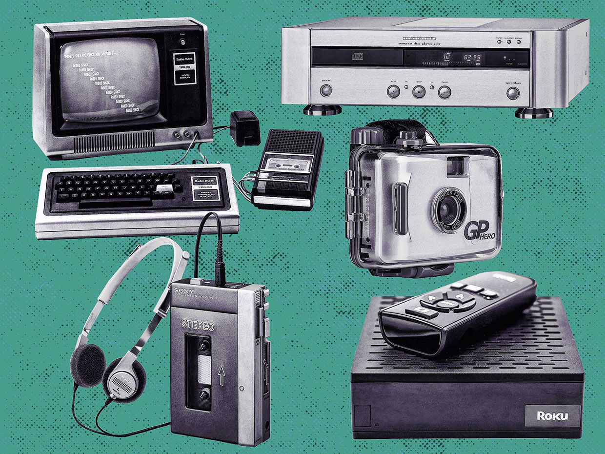
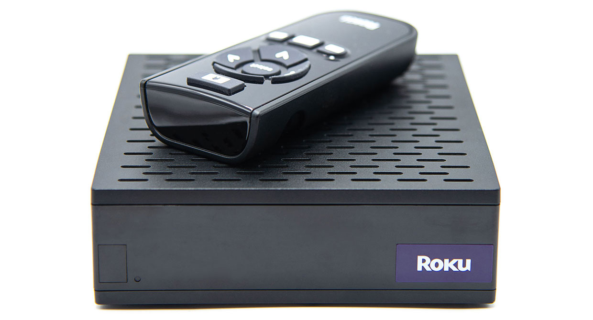
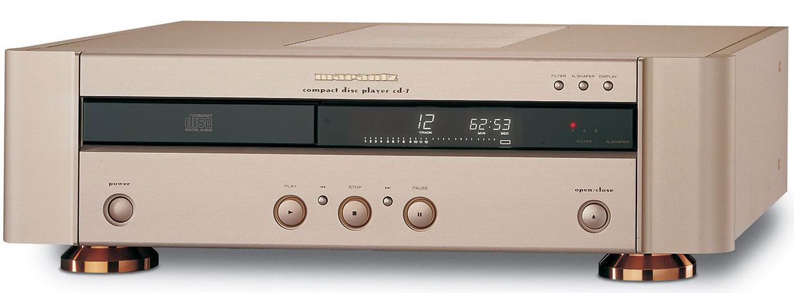
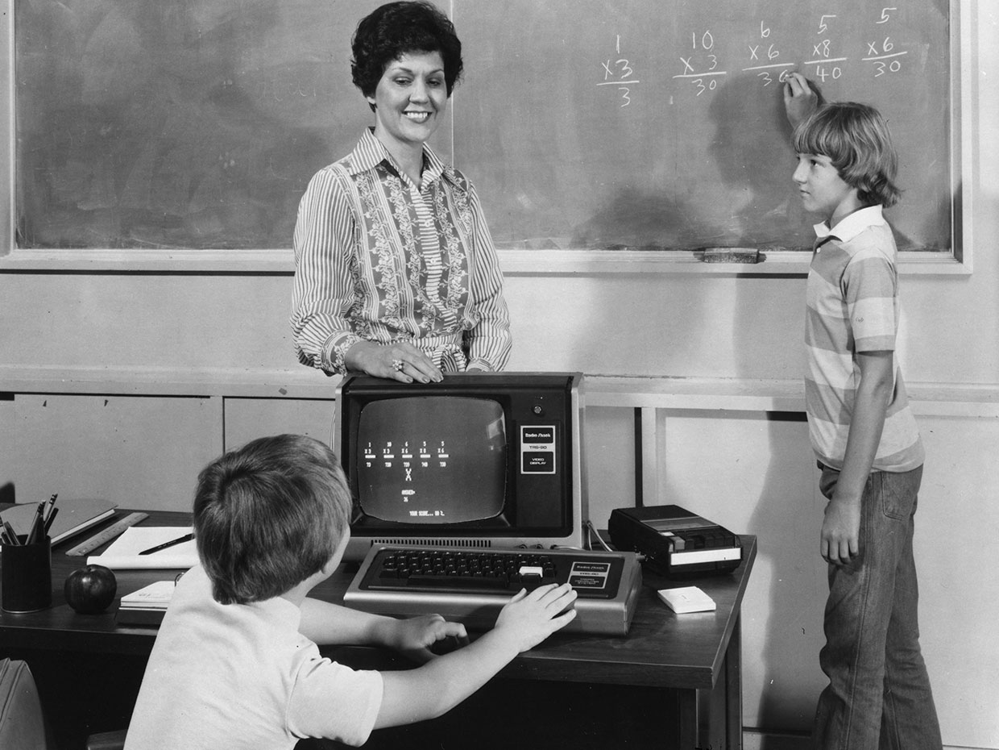
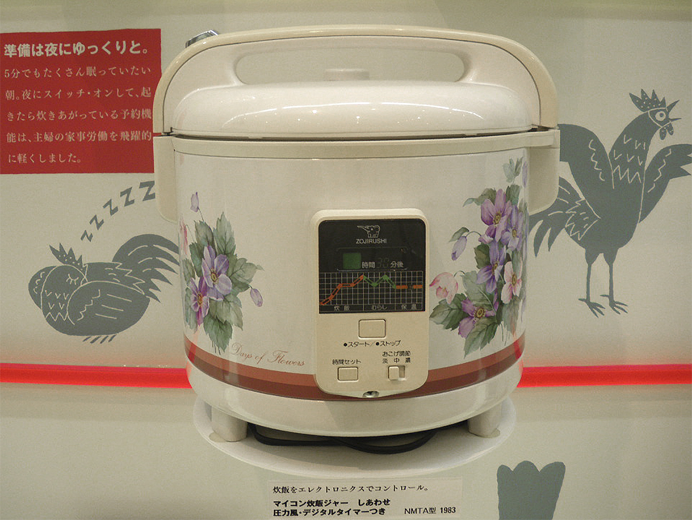
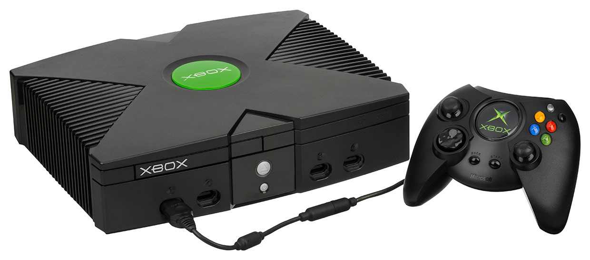
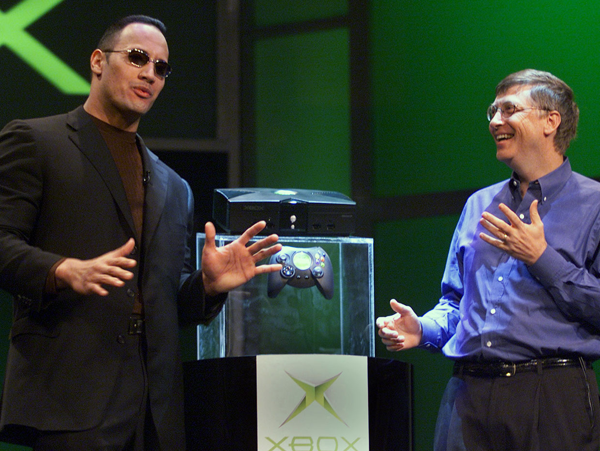
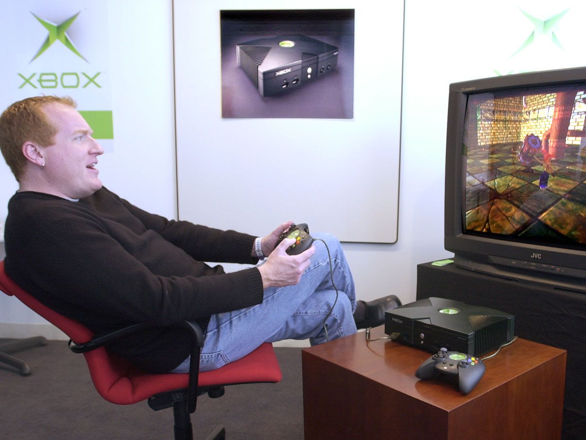

Зал славы потребительской электроники: истории лучших гаджетов последних 50 лет, часть 1

Сегодня мы все привязаны к нашим гаджетам. Мы, жители развитых стран, просыпаемся под звук смартфона, как одержимые постоянно обращаемся к нему в течение дня, а потом засыпаем, не выпуская его из рук. С рассвета до заката мы смотрим на наши умные часы, на мониторы, телеэкраны и планшеты, слушаем радио и другую аудио электронику, часто через наушники. Иногда запускаем дроны, делаем фотографии при помощи фотокамер, встроенных в сотовые телефоны или играем на приставках. Мы привыкли к устройствам, помогающим нам в работе и в отдыхе, и к некоторым устройствам, которые не просто помогают нам, а полностью автоматизируют часть нашей работы и отдыха.

Вся эта инфраструктура гаджетов была создана инженерами-электротехниками в течение десятилетий. Некоторые из их примечательных творений мы вспоминаем с удовольствием, но многие уже забыты.  
  
И мы в журнале IEEE Spectrum решили выбрать наилучшие гаджеты за последние 50 лет и воздать им должное. Раскрыть и описать все почему, как и когда. И, да, конечно, это будет спорный материал. Мы даже сами спорили по поводу этого списка, и получили от этого массу удовольствия. Что было важнее – Roku или TiVo? Пережив клевету, взаимные обвинения и выпив пол-ящика пива, мы пришли к соглашению.

Но до того, как начать этот список, необходимо выбрать критерий. И вот наши критерии. Во-первых, это гаджеты, появившиеся после 1968 года. Да, до 1968 года тоже была потребительская электроника. Время с 1920-х по 1950-е было временем фонографов, а также радио- и телеприёмников, выступавших в роли мебели. Но всё интересное началось с конца 1960-х. Повсюду появились дешёвые транзисторы, и дизайнеры начали использовать миниатюрные интегральные схемы. Твердотельная электроника стала кислородом, запитавшим кембрийский взрыв, приведший к появлению сегодняшних процветающих джунглей гаджетов. Интегральные схемы и другие твердотельные ингредиенты позволили инженерам создать реально полезные, компактные и надёжные гаджеты. Такие, которым удалось заставить нас раскошелиться.

Определив временные рамки, можно начать думать о том, какие именно предметы нужно увековечить в нашем зале славы. Должны ли это быть наиболее успешные коммерчески модели? Самые первые в своём классе? Наиболее интересные с точки зрения инженерных решений? Гаджеты, ставшие культовыми по не совсем понятным причинам? Мы отвечаем на эти вопросы: да. Иногда новый продукт поражает своей прорывной гениальностью. Иногда наиболее коммерчески успешный пример становится победителем по причинам гораздо интереснее, чем грубая сила. Иногда самым крутым гаджетом становится устройство с самыми важными инженерными прорывами; возможно, он и не продавался в огромных количествах, но стал культовым. Или, возможно, решения были не такими уж классными – просто нормальными, однако культовый статус у него всё равно появился. Это тоже может быть крутой историей.

Вот гаджеты, которые редакторы IEEE Spectrum посчитали величайшими. Без сомнения, мы упустили что-то из вашего списка любимых устройств. Может, весь ваш список. Так что исполните свой долг и упомяните их в комментариях.

## Roku DVP N1000

  

### Roku добился успеха на хаотичном рынке вопреки всему – и задал стандарты, которые стали копировать более крупные конкуренты

  
_Чем меньше и проще, тем лучше. Среди инноваций, которыми больше всего гордится директор компании Энтони Вуд, есть очень простой пульт управления, который потом имитировали Amazon и Google._

Когда он впервые появился в мае 2008, Roku не был гарантирован успех. Не было ясно, будет ли большой спрос на потоковое видео, когда у кабельного, спутникового и IP-телевидения были такие привлекательные предложения.

Шансы на успех Roku зависели от нескольких непредвиденных обстоятельств, которые не казались правдоподобными в то время. Например, что молодые потоковые сервисы вроде Netflix и Hulu станут настолько классными, что дадут зрителям убедительный повод избавиться от подписок на платные телеканалы или раскошелиться на потоковый контент, и что эти сервисы останутся независимыми и им придётся предлагать свой контент стороннему проигрывателю. Кроме того, платные телеканалы откажутся поддерживать Netflix и Hulu, и другие независимые сервисы, посредством своих собственных приставок (на самом деле, на это можно было поставить, учитывая жёсткую конкуренцию на рынке платного ТВ).

В Roku понимали, что даже если всё это сработает в их пользу, им всё равно нужно будет сделать приставку, недорогую по сравнению с игровыми системами типа PlayStation и Xbox – которые уже умели выводить потоковое видео, или по сравнению DVD-рекордером ReplayTV, который не связан с конкретными кабельными телеканалами. Ясно было одно: Roku надо стать недорогим по сравнению с наиболее известным потоковым устройством того времени, Apple TV, которое компания Apple представила в надежде запустить своё платное телевидение. Все эти системы стоили более $300.

С другой стороны, были и хорошие новости – зрители, у которых не было игровой приставки с проигрывателем, на стали бы покупать приставку, только чтобы смотреть Netflix или Hulu. И какой смысл был выкладывать стоимость целой игровой системы за Apple TV, на котором нельзя было даже поиграть в Grand Theft Auto? В итоге, всё упиралось в то, что независимый проигрыватель должен был стоить гораздо меньше.

Первый проигрыватель Roku, DVP N1000, был основан на декодере PNX8935, который NXP разработала специально для недорогих приставок высокого разрешения. Изготовление такого устройства было рискованным для NXP, поскольку рынка на потоковые проигрыватели HD-качества в то время практически не было. Roku помог его создать.

У Roku также было 256 Мб памяти. Она поддерживала стандартное и высокое разрешение в 720 p (вскоре добавили и разрешение Full HD 1080p). Roku вышла на рынок по цене в $99 и удачное время: потоковые сервисы Netflix и Hulu набирали популярность, и люди подыскивали устройство для их просмотра.

Приставка N1000 Roku «начала гонку за небольшой ценой на потоковый проигрыватель, создавшую массовый рынок», — рассказал директор Roku, [Энтони Вуд](http://fortune.com/2016/03/24/roku-anthony-wood-binge-watching/). Компания специально создала архитектуру, которая направила тенденцию к снижению стоимости, добавил он. Сегодня некоторые модели Roku продаются всего по $29 (и стоимость моделей нескольких конкурентов отличается всего на несколько долларов).

Вуд выдал список качеств первого проигрывателя Roku, определивших категорию проигрывателей потокового видео. До N1000 большая часть устройств была размером в 17". «Мы первыми задали тренд „меньше – лучше“», — сказал он. Некоторые из современных моделей размерами сравнимы с большим пальцем взрослого мужчины. В Roku также первыми сделали «очень простой пульт дистанционного управления», — сказал Вуд, что задало стандарт для Amazon, Google и других.

N1000 стала первой приставкой с обновляемой прошивкой, и использовала эту способность для добавления каналов. «Пользователям не нужно было ничего делать, это происходило само собой. В то время такое поведение было спорным», — отметил Вуд. Ещё одной спорной особенностью было отсутствие кнопки выключения. И это стоило изначальных отрицательных отзывов, сказал Вуд, поскольку «невероятно упростило использование».

Десять лет спустя Roku лидирует в продажах приставок для потокового видео – как больших, так и донглов – опережая Amazon Fire TV, Google Chromecast, Apple TV, TiVo, Sony и остальных.

## Marantz CD-7

  

### Проект создания лучшего CD-проигрывателя основывался на разработке фильтра нижних частот

  
_Лучший проигрыватель дисков? Marantz CD-7, результат поисков идеального качества проигрывания дисков одним человеком, поразил аудиофилов, появившись в 1998 году._

Существует очень немного парфюмеров, способных определить все несколько десятков запахов, замешанных в дорогой аромат. Однако видеоиндустрия нанимает людей, способных посмотреть на изображение, выведенное на дисплей разрешением 8К, и определить, не портится ли чёткость изображения всего несколькими тысячами неправильно отображаемых пикселей из 33 млн точек, содержащихся в каждом кадре. И их возможности восприятия можно объективно проверить.

А есть ещё аудиофилы. Некоторые из них утверждают, что чувствуют разницу между золотым и серебряным проводом, подключенным к усилителю. Они дают звуку такие характеристики, как "[теплота](https://www.reddit.com/r/edmproduction/comments/346dvv/what_does_a_warm_sound_mean/)", «сухость» и «темнота», которые сложно объяснить, не говоря уже о том, чтобы оценить количественно, и они могут спорить по поводу этих параметров так, будто делят Эльзас и Лотарингию. Так что, когда аудиофилы соглашаются по поводу качества определённого звуковоспроизводящего оборудования, то есть вероятность, что это устройство является лучшим в своём классе. Например, проигрыватель компакт-дисков Marantz CD-7, представляющий собой почти полную переделку предыдущей модели CD-15.

  
_Перфекционист Кен Ишивата разработал для CD-7 уникальный фильтр._

Основным принципом цифровой эры является то, что в процессе технологического прогресса всё улучшается – так и происходило с проигрывателями CD от Marantz вплоть до модели CD-15. И изначально CD-15 встречали восторженно. Но вскоре в среде аудиофилов мнения разошлись. Некоторые поругали его за «слишком высокую чёткость звука». Что бы это ни означало. Инженер Marantz [Кен Ишивата](http://www.the-ear.net/how-to/ken-ishiwata-man-and-his-listening-room), работавший над CD-15, был в числе неудовлетворённых. Он начал работу над новой моделью, отвергнув использовавшийся там номинально более продвинутый цифро-аналоговый преобразователь (ЦАП), TDA1547, и использовал более старую модель TDA1541 на 16 бит, который использовался в проигрывателях компании задолго до CD-15. Ишивата знал, что если аккуратно использовать этот более старый чип, то в результате получится замечательный звук.

Ишивата рассказал нам, что он придумал использовать старый ЦАП с улучшенным фильтром. Поскольку ему не нравилось качество работы [фильтра с конечной импульсной характеристикой](https://ru.wikipedia.org/wiki/%D0%A4%D0%B8%D0%BB%D1%8C%D1%82%D1%80_%D1%81_%D0%BA%D0%BE%D0%BD%D0%B5%D1%87%D0%BD%D0%BE%D0%B9_%D0%B8%D0%BC%D0%BF%D1%83%D0%BB%D1%8C%D1%81%D0%BD%D0%BE%D0%B9_%D1%85%D0%B0%D1%80%D0%B0%D0%BA%D1%82%D0%B5%D1%80%D0%B8%D1%81%D1%82%D0%B8%D0%BA%D0%BE%D0%B9) в CD-15, Ишивата решил «довести до максимума чудесные возможности музыки», создав собственный фильтр. Чтобы понять, что он сделал, надо немного разобраться в теме.

CD-проигрыватель не просто извлекает цифровые сэмплы с компакт-диска и отправляет их в ЦАП на преобразование в аналоговую волну. Он использует процесс под названием интерполяция, в котором создаются дополнительные сэмплы, которые вставляются в промежутки между «реальными», чтобы увеличить частоту дискретизации. Такой процесс обычно увеличивает частоту в 4-8 раз. Преимущество интерполяции, также известной, как передискретизация или повышающая дискретизация, состоит в кардинальном уменьшении требований к фильтру нижних частот, стоящему после ЦАП, и удаляющему некоторые высокочастотные артефакты, порождённые ЦАП, чтобы они не портили качество звука.

В [CD-15](http://www.dutchaudioclassics.nl/?strPage=Info&strBrand=Marantz&strType=cd15) ЦАП TDA1547 работал в паре с фильтром (SM5803APT от [Nippon Precision Circuits](http://www.npc.co.jp/en/)), повышавшим дискретизацию в 8 раз. Чтобы создать фильтр лучшего качества для нового проигрывателя, Ишивата начал с извлечения исходного кода чипов цифрового фильтра [Philips SAA7220](http://www.dutchaudioclassics.nl/the_evolution_of_dac_the_digital_filter/). Затем он добавил к ним собственный код, и запустил его на паре процессоров Motorola 56000, соединённых им воедино (он назвал их «Двойной короной»). Эта конфигурация позволила ему вернуться к четырёхкратному повышению дискретизации, которая, по мнению некоторых аудиофилов, даёт лучшее качество звука, чем восьмикратное (по крайне мере, при сравнении двух моделей Marantz).

И работа Ишивата с моделью CD-7 не закончилась на этапе схемы. Механизм CD-проигрывателей для чтения дисков, в котором объединены лазеры и линзы, называется транспортом. Точность чтения дисков зависит от качества транспорта. Предыдущую модель компании, CD-15, аудиофилы хвалили за использование Philips CDM4 Pro, одного из наилучших транспортов из когда-либо созданных. Однако к тому времени, как Ишивата начал работать над CD-7, Philips их уже не выпускала. Ишивату не удовлетворяла общепринятая замена (CD12.3), поэтому он при помощи компании переделал CD12.3 с нуля, к примеру, добавив нержавеющие салазки с алмазной полировкой для более приятной загрузки дисков.

Получившийся CD-7, вышедший в 1998 году, был похож на другие проигрыватели от Marantz стильным и сбалансированным дизайном передней панели и характерными цветами золота и шампанского. Однако его сразу же оценили за звук, не уступающий по качеству звуку студийного оборудования, включая такую характеристику, как «непревзойдённая интенсивность ритма», как писал один критик. Что бы это ни значило.

## Tandy/RadioShack TRS-80 Model 1

  

### В RadioShack надеялись, что продажи ПК исправят падение продаж, связанное с угасанием интереса к гражданским радиопередатчикам

  
_Периферия взаймы: первоначально TRS-80 поставлялся с 4 Кб RAM и системой хранения данных, которая представляла собой кассетный проигрыватель от RadioShack. Монитором был чёрно-белый телевизор с разъёмом RCA и небольшими модификациями._

Живы ещё люди, помнящие время, когда один розничный продавец мог доминировать во всей категории продукта. Thom McAn в области туфель. F.W. Woolworth в области недорогой одежды. Tower Records в области примитивных музыкальных носителей. А когда-то компания [RadioShack](https://www.radioshack.com/) превратила первенство в области электроники для самодельщиков в неожиданно долгое доминирование в области домашних компьютеров.

В первые годы рынок ПК зависел от людей, чьим хобби была электроника. Некоторые домашние компьютеры продавались в виде конструкторов для сборки (наиболее известный — [Altair 8800](https://en.wikipedia.org/wiki/Altair_8800)), а [Apple](https://www.apple.com/) явно не была единственным производителем ПК, начинавшим с гаража.

Учитывая роль RadioShack в области самодельной электроники, компании просто необходимо было рассмотреть вариант продаж персональных компьютеров, но она не торопилась это делать. Тогда не было понятно, что этот рынок сможет сильно вырасти. К тому же, компьютеры грозили оказаться самым дорогим продуктом из продаваемых в RadioShack. Однако к концу 1970-х спрос на самую продаваемую продукцию, гражданские радиостанции, начал падать, поэтому компании нужен был новый хит. Родительская компания RadioShack, Tandy, решила попытать счастья с ПК.

Tandy/RadioShack (TRS) создала TRS-80 Model 1 на основе микропроцессора Z80 от Zilog на 1.77 МГц (отсюда и 80 в названии TRS-80). Z80 Представили в 1976 году и по цене $25 за штуку это был самый дешёвый из быстрых микропроцессоров. Низкая стоимость хорошо сочеталась с желанием как можно сильнее понизить стоимость конечного продукта.

  
_Любимчик учителя: RadioShack выпустила вместе с оригинальным TRS-80 обучающее ПО, и это стало частью успешной стратегии выхода на школьный рынок._

Клавиатура была встроена в верхнюю часть материнской платы компьютера (для того времени это было типично), а монитором служил 12" чёрно-белый ЭЛТ-телевизор. Дисководы для гибких дисков уже придумали, но они всё ещё были дороги, поэтому в Tandy решили использовать кассетный проигрыватель из RadioShack в качестве накопителя для TRS-80 Model 1.

В 1977 достаточно неплохо продавались ещё два других ПК — Apple II и Commodore PET 2001. Они стоили $1298 и $795 соответственно. Базовый набор TRS-80 Model 1 с монитором стоил $599.

Несмотря на жалобы потребителей на плохое качество, [TRS-80 Model 1](http://www.computerhistory.org/brochures/doc-4372956e137d2/) от Tandy/RadioShack обнаружила огромный рынок и помогла ПК превратиться из диковинки для любителей паяльников в массовый продукт. Оглядываясь назад, можно сказать, что Tandy правильно использовала преимущество перед почти всеми остальными производителями компьютеров: огромную, международную розничную сеть магазинов RadioShack. RadioShack была крупнейшим продавцом ПК вплоть до 1982 года, а затем `линейку TRS-80 стали затмевать более мощные и гибкие машины, включая персоналку от IBM, различные IBM PC-совместимые модели и линейку Apple Macintosh.

И хотя линейка собственных ПК у Tandy сошла на нет, компания оставалась крупнейшим производителем ПК в мире вплоть до начала 1990-х, и изготавливала компьютеры для других компаний, например, AST Research, Digital Equipment Corp., GRiD Systems Corp., Olivetti и Panasonic.

## Электрическая рисоварка Zojirushi Micom

  

### Zojirushi была одним из первых представителей бытовой техники, начавших использовать нечёткую логику, благодаря чему горшочек риса стало практически невозможно испортить

  
_ПО рисоварки Zojirushi с нечёткой логикой позволяло ей преодолевать недостатки человека – к примеру, когда тот добавляет слишком много воды к рису._

Люди варят рис по меньшей мере уже [12 000 лет](https://en.wikipedia.org/wiki/Rice). Но при этом всего 35 лет назад компания Zojirushi придумала, как защитить этот процесс от дурака.

Естественно, этому достижению предшествовало несколько важных вех. Первую потребительскую рисоварку представила в 1945 году компания Mitsubishi. Это был первый из целого ряда электрических приборов для готовки, использовавших нагревательные элементы для варки риса. При их использовании необходимо было следить за ними и отключать по готовности риса. Toshiba представила первую автоматизированную рисоварку в 1956. Она работала при помощи простейшего биметаллического переключателя – когда вся вода впитывалась, температура металлической посуды быстро возрастала, и срабатывал переключатель, отключавший устройство.

[Zojirushi](https://www.zojirushi.com/) заявляет, что первой представила в рисоварке функцию, позволяющую поддерживать рис в тёплом состоянии часами. Эта модель, [появившаяся в 1965 году](http://www.ricecookerfetish.com/2011/04/the-history-of-the-rice-cooker/), полагалась на полупроводники, позволявшие провернуть такой трюк. А до этого компания была наиболее известна своими термосами.

Спустя 18 лет случился прорыв. В 1983 году Zojirushi представила рисоварку, ставшую одним из первых потребительских приборов, полагавшихся на нечёткую логику. Что интересно, компания не использует этот термин в рекламе, упоминая лишь микрокомпьютер (который она называет Micom), обеспечивающий эту логику. Спустя 35 лет Zojirushi всё ещё считает всю информацию, связанную с разработкой рисоварки, коммерческой тайной, и отказывается обсуждать что бы то ни было.

Зачем миру понадобилось применять многозначную логику к варке риса? Поскольку она решала две оставшихся крупных проблемы рисоварок: 1) разное время для приготовления разных сортов риса, и 2) повара. У некоторых рисоварок были настройки для белого и, допустим, коричневого риса. Продукция Zojirushi учитывает тип риса, и готовит его идеально. А что касается поваров – так, несмотря на то, что для приготовления риса требуется только рис и вода, люди всё равно периодически путают пропорции. И если пользователь рисоварки не слишком сильно накосячит с измерениями, рисоварка с нечёткой логикой просто подстроится и выдаст идеально приготовленный рис, несмотря на ошибки людей.

Примерно в то же время, когда нечёткую логику применяли к рисоваркам, изготовители переключились на индукционный нагрев, который можно контролировать точнее нагревательных элементов. Комбинация нечёткой логики и индукционных нагревателей позволила достичь идеала в приготовлении риса. Или приблизиться к нему, пока сингулярность не позволит нам создать рисоварки с гениальными интеллектом.

Сегодня рисоварка – единственный электронный представитель кухонной бытовой техники, используемый десятками миллионов поваров ежедневно. Рисоварки с нечёткой логикой делают Tatung, Tiger Corp., Panasonic и другие. Многие продаются по цене менее $100. Но пионер этой области, Zojirushi, всё ещё требует за большинство своих моделей рисоварок гораздо больше $100.

## Microsoft Xbox

  

### Xbox была ошеломительно невероятным исключением из списка унылых попыток Microsoft изготовить железо для конечного потребителя

  
_Xbox появилась на переполненном рынке игровых систем в 2001 году и проложила себе дорогу на вершину при помощи потрясающей графики и огромного каталога совместимых игр._

Для любой категории продуктов на рынке потребительской техники очень необычно поддерживать четырёх конкурентов, каждый из которых имеет свою прибыль. В 2001 году, когда Microsoft представила свою консоль [Xbox](https://www.xbox.com/), на рынке игровых систем уже присутствовала троица Nintendo, Sega и Sony. Как и сейчас, тогда Microsoft занимала выдающееся положение на рынке софта, но с железом у неё не задалось. Среди провалов компании есть целая гора вещей, о которых не помнят даже самые ностальгирующие пользователи – мышь Microsoft Mouse 1983 года, беспроводные телефоны (1998) и компьютерные колонки (1998).

В результате, в 1998 году были все основания сомневаться в том, что у Microsoft получится удачно вывести на рынок какое-то более сложное железо, чем компьютерная периферия, с которой она пыталась возиться. В том году Билл Гейтс, тогда директор компании, одобрил предложение создать игровую систему, которая станет наиболее мощной, богатой по возможностям и, вероятно, самой дорогой приставкой.

  
_Дуэйн «Скала» Джонсон, тогда профессиональный реслер, пытающийся стать актёром, стал гостем на презентации Xbox в 2001 году на выставке CES._

Как и сейчас, инженеры Microsoft прекрасно понимали этот самоподдерживающийся цикл, возникающий, когда вы создали распространённую железячную платформу, которая а) хорошо работает и под которую б) легко писать софт. Они учли опыт Microsoft с ПК, и рассудили, что если разработчики смогут приступить к делу прямо сразу, не тратя несколько недель или месяцев на изучение тонкостей программирования для системы, то они смогут быстро создать множество программ, что сильно увеличит шансы на то, что одна из них станет хитом. Эти успехи будут увеличивать популярность платформы, что привлечёт ещё больше разработчиков, которые напишут ещё больше программ для платформы – некоторые из которых станут хитами, что сделает платформу ещё популярнее… И так далее.

Такая парадигма работала в мире ПК, и не было причин, по которым она бы не сработала в мире игровых систем. Дизайнеры решили, что было бы разумно, если бы эта игровая система просто была бы неким персональным компьютером, или чем-то, очень на него похожим. В случае успеха она смогла бы годами пользоваться преимуществами экономии на масштабе индустрии ПК. С точки зрения ПО, разработчики приложений для ПК смогли бы довольно быстро разобраться с программированием для этой системы, а выбор из потенциальных разработчиков был бы гигантским.

  
_Симус Блэкли был одним из четвёрки, считающейся ядром команды разработчиков оригинальной Xbox._

Кевин Бахус, Симус Блэкли, Отто Беркес и Тед Хейз сформировали ядро команды разработчиков в проекте, который тогда назывался DirectX Box. Они использовали стандартную архитектуру ПК, процессор x86, но решили заказать специально разработанный процессор на 733 МГц Intel “Coppermine” Pentium III (Sony PlayStation 2 была построена на процессорах RISC от MIPS Computer Systems, которые обычно использовались на рабочих станциях). Графическим процессором стал 233 МГц NV2A GPU от Nvidia. Дизайнеры добавили CD-ROM, DVD-ROM и жёсткий диск – причём последнее добавление стало новинкой для игровых консолей того времени.

Чтобы поспособствовать успеху платформы, в 2000 году Microsoft купила игровую компанию-разработчика Bungie, в которой тогда разрабатывали игру [Halo](https://www.halowaypoint.com/). Bungie опубликовало несколько коротких роликов, где демонстрировали игровой процесс Halo, но и эти крохи вызвали у геймеров страстное желание заполучить новую игру.

В 2001 году Microsoft одновременно представила Xbox и Halo. Приставка была примерно в два раза мощнее Sony PlayStation 2, вышедшей за год до этого. Корпус с рельефной Х наверху выглядел круто. Для игроков, любивших стрелялки от первого лица, Halo стала очень интересной игрой. Система разлеталась, как горячие пирожки, и Halo поставила рекорд продаж. На Xbox выходили и другие хиты, но 18 лет спустя, комбинация Xbox/Halo остаётся одной из наиболее длительных и успешных комбинаций приставки и игры в истории компьютеров.

У оригинального процессора Xbox было одно ядро, работавшее на 733 МГц. Сегодня игроки ждут выхода Halo Infinite, которая должна появиться во второй половине 2019 года на приставках Xbox Ones, которые включают в себя восемь ядер, работающих на частоте 2,3 ГГц.