Зал славы потребительской электроники: истории лучших гаджетов последних 50 лет, часть 2

[_Первая часть_](https://habr.com/post/434896/)

## Bowmar 901B

  

### В 1973 году Bowmar/ALI была крупнейшей компанией-производителем калькуляторов в мире. В 1976 году она закрылась

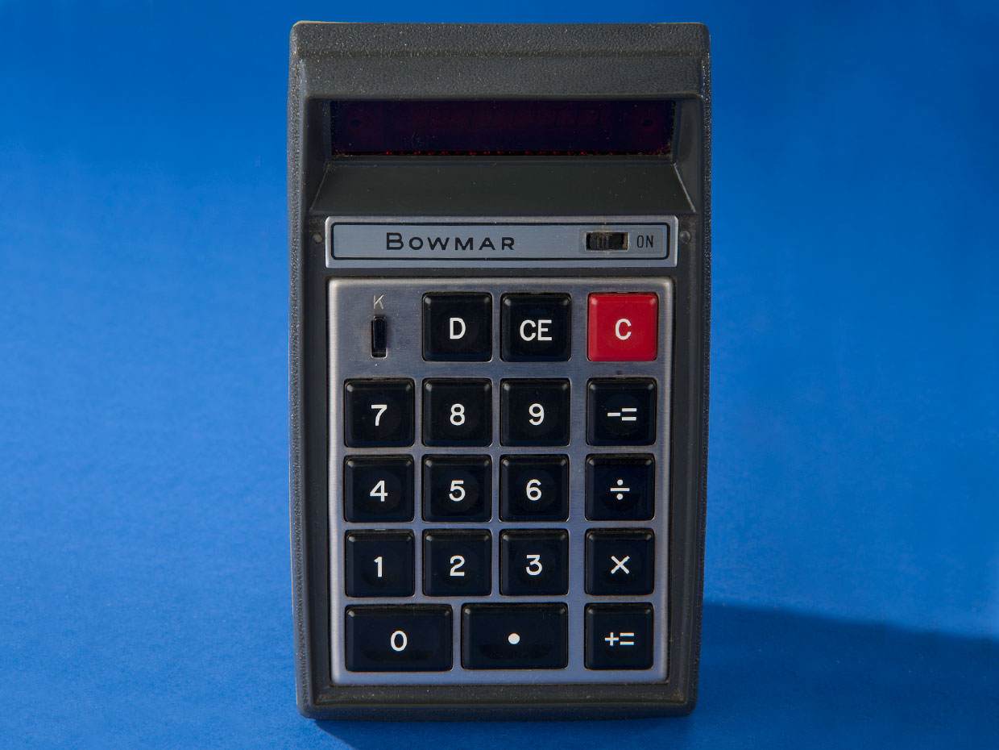  
_Прощай, логарифмическая линейка: калькулятор Bowmar 901B (по прозвищу «Мозг») считается первым калькулятором с LED-экраном и первым карманным калькулятором._

Создание калькулятора [Bowmar Brain](http://www.computerhistory.org/revolution/artifact/270) было жестом отчаяния. В 1968 году [Monsanto](https://monsanto.com/) создала первый достаточно дешёвый светодиодный экран, который можно было использовать в потребительской электронике. За ней последовало несколько других компаний, в том числе и Bowmar/ALI, которая была тогда крохотным субподрядчиком оборонной индустрии из города Актон, Массачусетс.  
  
Сначала в Bowmar/ALI хотели просто изготавливать и продавать LED-экраны. Они были в новинку, но тогда они также были очень маленькими и тусклыми, и возможностей коммерческого применения для них было мало. Одним из возможных вариантов были компактные калькуляторы, которые начали появляться совсем недавно – но у Bowmar были проблемы с выходом на этот новый растущий рынок.

Самые ранние калькуляторы на батарейках, которые начали появляться в Японии в районе 1970-го благодаря компаниям Canon, Sharp и Sanyo, использовали громоздкие [вакуумно-люминесцентные](https://ru.wikipedia.org/wiki/%D0%92%D0%B0%D0%BA%D1%83%D1%83%D0%BC%D0%BD%D0%BE-%D0%BB%D1%8E%D0%BC%D0%B8%D0%BD%D0%B5%D1%81%D1%86%D0%B5%D0%BD%D1%82%D0%BD%D1%8B%D0%B9_%D0%B8%D0%BD%D0%B4%D0%B8%D0%BA%D0%B0%D1%82%D0%BE%D1%80) или [газоразрядные](https://ru.wikipedia.org/wiki/%D0%93%D0%B0%D0%B7%D0%BE%D1%80%D0%B0%D0%B7%D1%80%D1%8F%D0%B4%D0%BD%D1%8B%D0%B9_%D0%B8%D0%BD%D0%B4%D0%B8%D0%BA%D0%B0%D1%82%D0%BE%D1%80) индикаторы, или даже крохотные термопринтеры. Могли ли в Bowmar добиться успеха с наладонным калькулятором с LED-экраном? В 1970-м компания решила это выяснить. Так и родилась модель 901B.

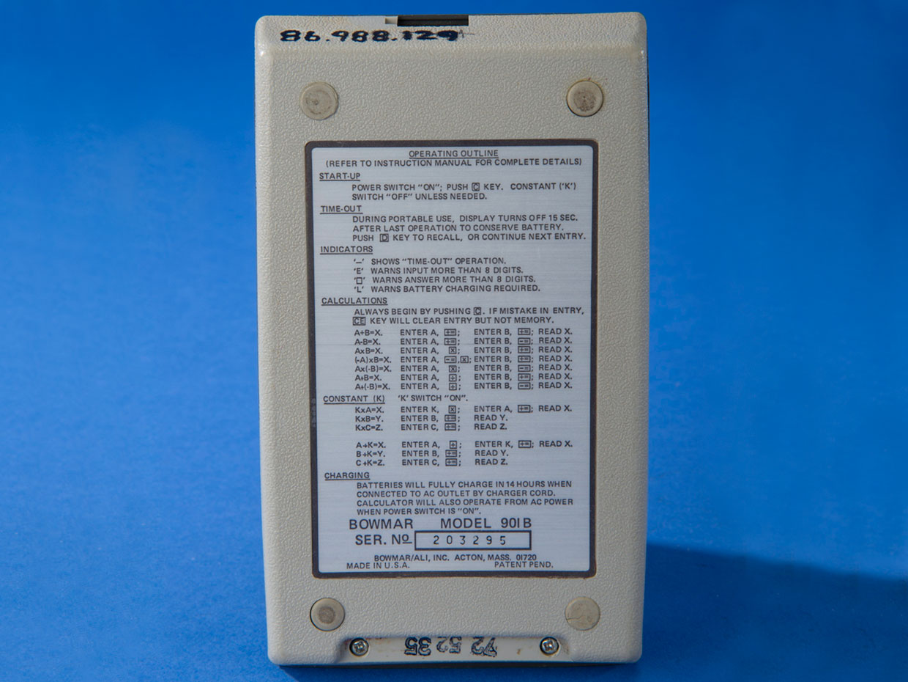  
_Руководство под рукой: у первых калькуляторов от Bowmar на задней стороне были приведены исчерпывающие инструкции, направленные на пользователей, до этого, скорее всего, никогда не использовавших калькулятор._

В Bowmar использовали чип TMS0103 производства Texas Instruments, а также их кнопки Klixon для клавиатуры. Калькулятор размером 76х127х25 мм появился в 1971 или 1972 году (в источниках на этот счёт есть разногласия). Он продавался по цене в $240, что сегодня эквивалентно $1400.

Вскоре у Bowmar появилось несколько клиентов, желающих перепродавать 901В под своими марками, в том числе Craig (назвавшая модель 4501) и Commodore (C110). Среди розничных магазинов, пожелавших продавать следующие модели калькуляторов под своим брендом, были Sears и RadioShack.

901В и его [последователи](http://americanhistory.si.edu/collections/search/object/nmah_1305726) помогли Bowmar/ALI на несколько лет в начале 1970-х стать крупнейшим производителем калькуляторов в мире. Но портативные калькуляторы быстро стали популярным предметом потребления, и к 1974 году цены на них рухнули. Texas Instruments стала производить собственные калькуляторы, и уже превосходила Bowmar по объёмам. К 1975 году Bowmar не могла обеспечить приток нужного количества чипов для калькуляторов, некоторые из которых, как вы догадываетесь, поступали от TI. Это не позволило компании снизить цены достаточно для того, чтобы соревноваться с конкурентами. За пять лет компания вывела на рынок [28 разных моделей](http://www.vintagecalculators.com/html/bowmar_calculators.html) калькуляторов. Спустя пять лет в калькуляторном бизнесе, Bowmar/ALI подала заявление на банкротство в 1976. Однако её родительская компания, Bowmar Instrument Corp., жива и поныне, и всё ещё работает с министерством обороны под именем [Bowmar LLC](http://www.bowmarllc.com/).

## GoPro Hero

  

### Оригинальная экшн-камера началась с пошитого в домашних условиях браслета, закреплявшего одноразовую камеру на запястье

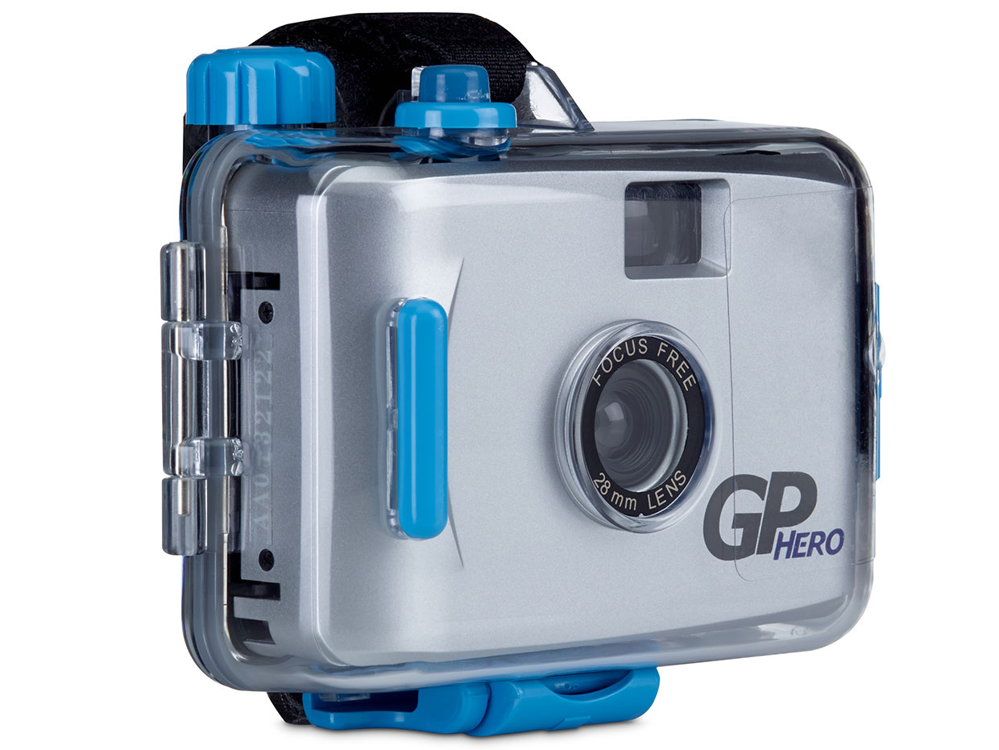  
_Первый герой: первая GoPro, представленная в 2004, была камерой для 35 мм плёнки, изготовленной китайской компанией._

Есть предприниматели, которые хотят быть предпринимателями, особо не заботясь о том, на чём именно зарабатывать. А есть предприниматели, которых влечёт настолько убедительная идея, что предпринимательство становится только средством для достижения цели. [Ник Вудман](https://ru.wikipedia.org/wiki/%D0%92%D1%83%D0%B4%D0%BC%D0%B0%D0%BD,_%D0%9D%D0%B8%D0%BA) относится к последним.

После того, как два его стартапа подряд провалились, он решил взять небольшой отпуск на путешествия и занятия сёрфингом. Бездельничая и катаясь на волнах в Индонезии, он вдруг подумал, как было бы круто делать фотографии с точки зрения сёрфера. Таких фотографий практически не было, поскольку, сюрприз: практически невозможно держать камеру в руках, стоя на доске. Чтобы исправить это упущение, Вудман взял оторванную лямку от доски для сёрфинга и резинку, и собрал из них крепление, которое могло надёжно удерживать одноразовую водонепроницаемую камеру Kodak на его запястье.

  
_Камера, мотор: оригинальный Hero обладал механизмом захвата, горизонтально удерживавшим камеру на запястье, когда устройство не использовали для фотографий._

Вудман решил, что и другим сёрферам будет интересно документировать свою деятельность, и подумал, что можно немного заработать на производстве креплений. Он купил пластиковые бруски, Dremel, занял у мамы швейную машинку и отправился работать. Он скомбинировал уплотнительные кольца, пластиковое крепление, изготовленное при помощи дремеля, и простой, но остроумный механизм защёлки собственного изготовления, который мог удерживать камеру на руке горизонтально. Когда вы отстёгивали защёлку, камера поворачивалась. Сёрфер мог в этот момент сделать фотографию, и положить камеру обратно, защёлкнув застёжку. Всё работало как по маслу.

«Я думал, этого будет достаточно для того, чтобы помочь людям пристёгивать одноразовую водонепроницаемую камеру на запястье, и это уже будет огромным скачком вперёд, и позволит сёрверам и другим атлетам носить камеру, запечатлевать свои действия с их точки зрения, и не полагаться на стороннего фотографа, который снимает их с пляжа на телеобъектив», — рассказал он журналу IEEE Spectrum.

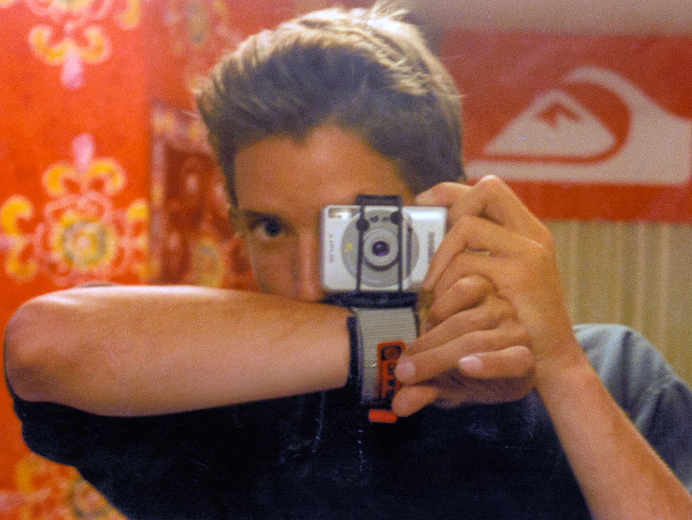  
_Съёмка с запястья: основатель GoPro Ник Вудман демонстрирует ранний прототип своей экшн-камеры в районе 2001 года._

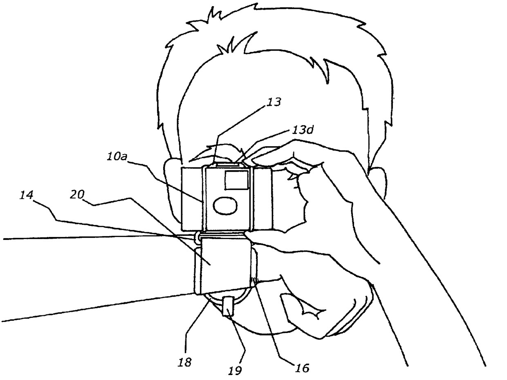  
_Рисунок для патента 6,955,484 B2 демонстрирует ключевые компоненты устройства._

Он явно нащупал верный путь, но пройти по нему оказалось тяжелее, чем он думал. Оказалось, что камеры, называвшиеся водонепроницаемыми, были просто водоотталкивающими. «Водонепроницаемые камеры не были предназначены для сопротивления струям воды, — пояснил Вудман. – До появления GoPro не было водонепроницаемой камеры, которой можно было бы шлёпнуть по воде со всей силы, не опасаясь, что струи воды просочатся внутрь и уничтожат её. Мне не удалось бы продать много держателей для камер, если бы то, что я придумал, оказалось убийцей фотоаппаратов. Мне нужна была камера, но я не знал, как её сделать. Мне едва удалось сделать застёжку».

Вудман начал искать в онлайне кого-то, кому уже удалось создать по-настоящему водонепроницаемую камеру. Он ходил на выставки фотоаппаратуры, и снова искал в интернете. В итоге он нашёл производителя в Китае с подходящей плёночной камерой. Компания [Hotax Manufacturing Co.](https://hotax1.fm.alibaba.com/) согласилась взяться за изготовление, но ей нужны были чертежи для крепления камеры и застёжки.

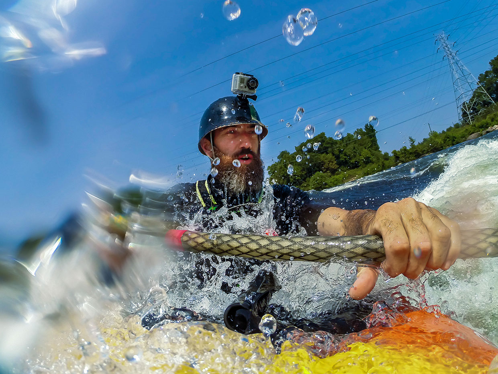  
_Компактная, прочная, водонепроницаемая: камеры GoPro позволили фотографировать почти всё, что угодно. На фото – каякер, совершающий с камерой GoPro в 2014-м году мокрую и тряскую поездку._

«У меня не было образования в области CAD, — говорит Вудман. – Я до сих пор не разбираюсь в CAD. Я сделал всё, что мог из брусков пластика и дремеля, и вручную вырезал места для креплений и сами крепления, а потом при помощи термоклея посадил их на камеру, и отправил через FedEx в Китай».

«Они выслали мне по e-mail файл .IGS, простой файл для CAD, но я не знал, что такое .IGS. Я погуглил, скачал программу для просмотра, и помню, как было здорово видеть мою идеальную камеру, первую камеру GoPro, на экране, в 3D, как я её поворачивал, и думал: Ух ты, а у нас реально может получиться изготовить эту штуку».

В Hotax сообщили Вудману, что за форму для отливки ему надо будет заплатить $5000, и Вудман понял, что он не в курсе, серьёзная ли это компания, а не какие-нибудь мошенники.

«Я всё просчитал, и отправиться в Китай для проверки компании было дороже, чем просто заплатить им $5000 и скрестить пальцы на удачу, надеясь, что они сделают форму и сам продукт. Но они это сделали, и так родилась первая камера Hero», — сказал Вудман. Первая модель, представленная в 2004, снимала на 35 мм плёнку. Первая цифровая модель, Digital Hero, появилась в 2006-м.

Вудман и GoPro сделали спортивную фотографию демократичным увлечением. Простая, надёжная камера позволила всем делиться своими ощущениями так, как ранее было невозможно. Если в интернете доминируют фотографии котят и съёмки с GoPro, то последние, по крайней мере, увлекательны: [эффектные волны медленно разворачиваются](https://www.youtube.com/watch?v=pn7SFWpXURk&t=264s), орлы [величественно парят](https://www.youtube.com/watch?v=CMSpTf05GBc), выполняются [безумные трюки](https://www.youtube.com/watch?v=0U9Qmyc9llw). Ну и, конечно, [лучшее видео с собакой](https://www.youtube.com/watch?v=nGCQ1mXQonU).

Вудман гордится тем, что у камер GoPro, прошедших путь от плёночных фото до цифрового видео, есть уже четыре различных модели, карданов подвес и дрон, и их возможности постоянно расширяются, увеличивается разрешение видео и варианты беспроводного подключения. Также он гордится их неуязвимостью. К концу разговора с журналистом он предлагает: «Попробуйте убить GoPro. Я бросаю вам вызов».

## Epson R-D1

  

### У этого странного гибридного фотоаппарата был механический затвор и фотоматрица на 6.1 Мп

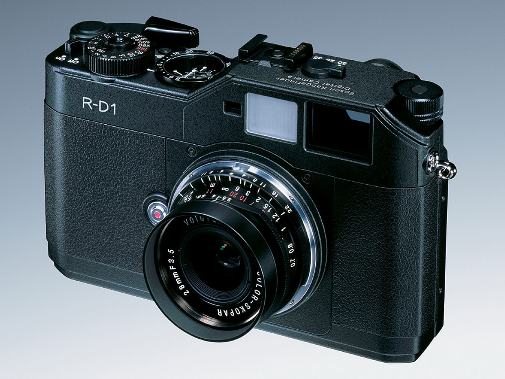  
_Неожиданный пионер: самый первый цифровой дальномерный фотоаппарат сделала не Leica, компания, известная своими дальномерами. Его изготовили в сотрудничестве компании Epson и производитель камер Cosina Voigtländer._

С 1940-х годов, и в следующие 30 лет, дальномерные фотоаппараты были обязательным атрибутом людей, стремившихся делать профессиональные фотографии. Но в 1970-х появились однообъективные зеркальные фотоаппараты, затем последовали цифровые зеркалки, позволявшие даже неопытным новичкам от раза к разу делать приличные фотографии. С ростом популярности зеркалок дальномерные камеры стали диковинкой – подходящей, судя по всему, для периодического использования профессионалами и людьми, серьёзно увлекавшимися этим процессом в качестве хобби. А затем Epson представила R-D1, первый цифровой дальномерный фотоаппарат, в одиночку вернувший на сцену дальномерные фотоаппараты как с коммерческой, так и с артистической точек зрения.

У дальномерных камер есть два оптических пути – один через линзы, один через отдельный дальномер – и они дают два немного отличающихся угла зрения на одну сцену, которые затем накладываются. Фотограф вращает фокусное кольцо, и когда два изображения накладываются, объект оказывается в фокусе.

Зеркалка же использует зеркала и призмы, чтобы проецировать изображение, видимое через линзы, на видоискатель, позволяя фотографу сфокусироваться на нём. При нажатии на спуск основное зеркало физически поворачивается, уходя с пути между линзами и плёнкой (или фотоматрицей). Поскольку изображения, видимые фотографу в видоискателе, идут через линзы, они получают именно то, что видят. Поэтому такая схема хорошо работает в системе, в которой можно менять линзы. К концу 1970-х зеркалки уже сильно опережали по продажам дальномерные камеры.

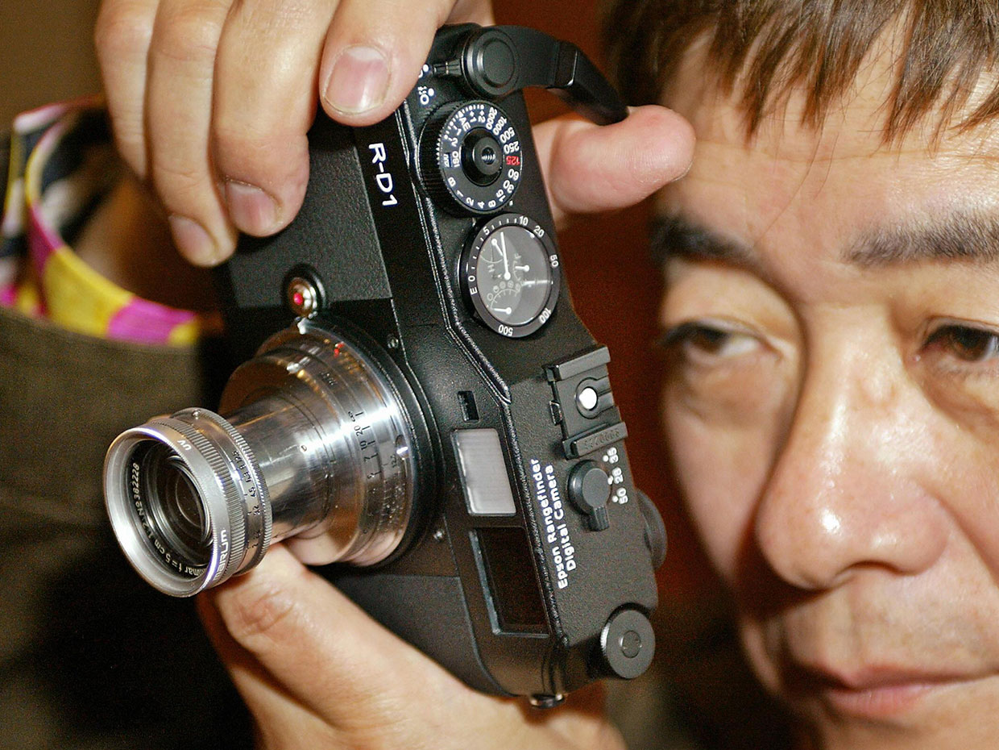  
_Тихий снайпер: компактные и тихие, дальномерные фотоаппараты особенно почитались уличными фотографами._

И всё же дальномерные фотоаппараты не исчезали полностью. У них не было зеркала и сопутствующего оборудования, поэтому они были компактнее и тише. Отсутствие зеркала позволяло располагать линзы ближе к плёнке или матрице, благодаря чему можно было получать более резкие фото. Есть причины, по которым Leica [всё ещё производит](https://www.shutterbug.com/content/leica-m10-p-quietest-leica-ever-review) дальномерные фотоаппараты, и почему люди готовы отваливать по $8000 за штуку (без линз в комплекте).

Тем не менее, мало кто предвидел появление в 2004 году цифрового дальномерного фотоаппарата, созданного совместно Epson и производителем фотоаппаратов Cosina Voigtländer, известным, как и Leica, своими дальномерными фотоаппаратами (компания [перестала](https://petapixel.com/2015/10/01/Voigtl%C3%A4nder-rangefinder-cameras-are-no-more/) делать камеры в 2015). [R-D1](https://www.thephoblographer.com/2018/07/02/epson-r-d1-first-digital-rangefinder-camera/) стал первым цифровым дальномерным фотоаппаратом, обогнав дебютную модель Leica M8 на два года. У него был видоискатель типа 1:1, что позволяло фотографу видеть весь кадр сквозь камеру, будто невооружённым глазом. А его рекомендованная цена в $3000 была нацелена на профессиональных фотографов и обеспеченных любителей.

Epson придал своей технологической инновации явные черты ретро-дизайна. После 1980 года частью притягательности дальномерных фотоаппаратов был их выспренный внешний вид. Тогда и сейчас многие любители дальномерных камер избегали автофокусировки и автовыдержки, предпочитая старомодное ручное управление.

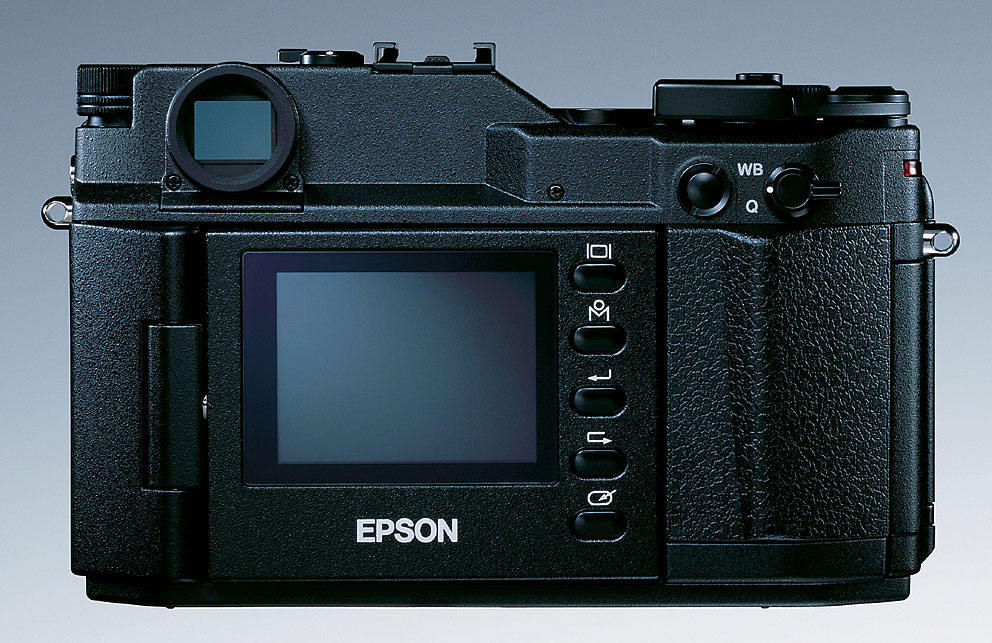  
_Старое и новое: у R-D1 была фотоматрица формата APS-C и 5 см экран. Рычажок справа сверху выглядит точно как рычаг перемотки плёнки, однако он спускал механический затвор._

R-D1 был интригующим гибридом старого и нового. Он выглядел и работал примерно как классический дальномерный фотоаппарат на 35 мм из 60-х и 70-х, хотя обладал многими передовыми цифровыми свойствами, к примеру, сенсором на 6.1 Мп формата APS-C CCD от Sony. Некоторые фотографы могли использовать его с большинством имевшихся у них объективов – это была первая цифровая камера, использовавшая байонет Leica M, стандарт высококлассной оптики, разработанный Leica в 1954 году, и использовавшийся в камерах Leica, Voigtländer и ещё полудюжины производителей.

Компания даже обеспечила рычажок, который выглядел, как устройство для перемотки плёнки на старых дальномерных фотоаппаратах, и на первый взгляд был не нужен, поскольку в цифровых камерах нет плёнки. На самом деле он взводил механический спуск – да, спуск был механическим. Это обрадовало многих энтузиастов, испытывавших ностальгию по быстро исчезавшему миру плёночных фотоаппаратов.

## Sony Walkman

  

### Идея плеера родилась у сооснователя Sony, обожавшего оперу

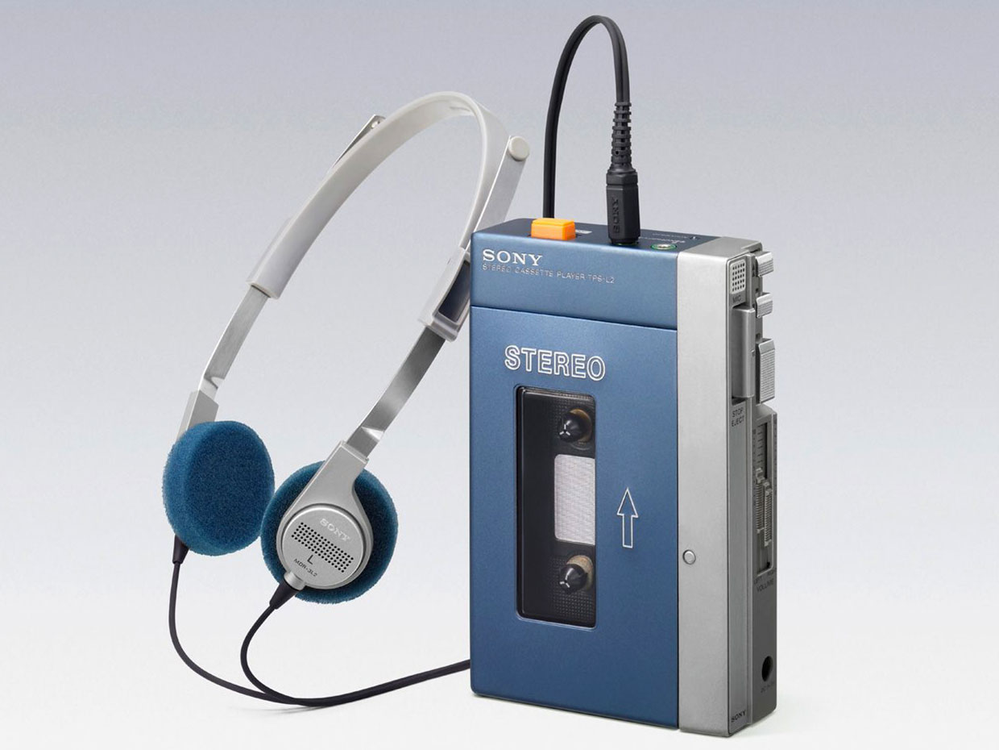  
_Лидер индустрии: оригинальный Sony Walkman TPS-L2 работал на паре батареек АА, у него было два разъёма для наушников и лёгкие наушники в комплекте._

Примерно половина живущих сегодня людей родились уже после появления плеера Walkman. А благодаря «Стражам галактики» почти все знают, что это такое. Но если вы ещё не родились к 1979-80 году, вы не понимаете, насколько шокирующим откровением стал этот предмет, как радикально он изменил проигрывание и потребление музыки, и с какой потрясающей скоростью он стал повсеместным.

В 70-х существовало множество кассетных дек, но основная тенденция шла по пути их увеличения, а не уменьшения. Люди хвастались тем, у кого мощнее будет звук. Самыми престижными были бумбоксы, и к 1979 самые крупные из них достигли размеров Fiat 128 и имели гораздо более изощрённую подсветку (ладно, допустим с размерами я преувеличил. Но у некоторых подсветка реально была шикарной).

А затем вдруг Sony начинает производить этот плеер, достаточно мелкий, чтобы уместить его в крупном кармане, и недорогой. Его можно было брать куда угодно. Сегодня, когда смартфоны и наушники-затычки – вещь настолько же обыденная, как носки, молодёжи будет сложно понять, насколько безумной была эта революция: можно было слушать свою музыку в наушниках персонально. Никто не знал, что вы слушаете [Captain & Tennille](https://www.youtube.com/watch?v=8ZSyH-ZpIlk) или [Air Supply](https://www.youtube.com/watch?v=JWdZEumNRmI), если вы сами не расскажете.

Walkman вообще появился потому, что один человек захотел слушать оперное пение в самолётах, не раздражая других пассажиров. Этот человек, Масару Ибука, был одним из основателей Sony, поэтому его желания привлекали гораздо больше внимания, чем желания большинства людей \[_в Вики написано, что оперу любил слушать другой основатель, Акио Морита / прим. перев._\].

Sony уже выпускала портативные кассетные плееры, но почти все они делали упор на запись, в основном для записи голоса. Почти все. В 1978 Sony представило номинально портативную систему [TC-D5](https://www.sony.net/Fun/design/history/product/1970/tc-d5.html). Она отлично звучала, но была довольно громоздкой и стоила порядка $1000\. Ибука использовал её в своих оперных мечтаниях во время странствий, но попросил сделать что-то, что было бы легче носить. Запрос прошёл через Норио Ога, который дал эту задачу Козо Осону, ведущему инженеру Sony Pressman, дорогого диктофона, предназначенного для профессиональных журналистов. Осон выдал обрезанную версию Pressman только для воспроизведения, чем и доставил удовольствие Ибуке.

В то время продажи портативных диктофонов Sony резко падали. Ибука и другой основатель компании, Акио Морита, решили, что если диктофоны не продаются, то, возможно, пойдут проигрыватели. Морита поручил Оге и Осону создать ещё более дешёвую версию устройства, которое они сделали для Ибуки. С технологической точки зрения в Walkman не было ничего нового. Но с точки зрения формы и использования он был радикально новым.

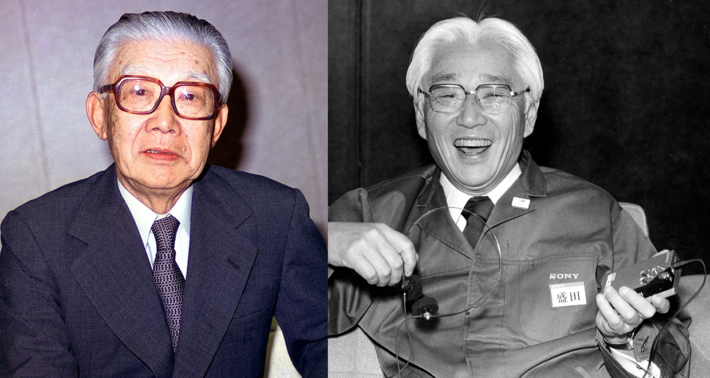  
_Сооснователи Sony Масару Ибука и Акио Морита помогли родиться Walkman. Ибука попросил сделать портативный плеер, чтобы он мог наслаждаться оперой во время бизнес-поездок. Морита распорядился, чтобы инженеры сделали более дешёвый вариант плеера на продажу_.

Первый [Walkman](http://lowendmac.com/2013/the-story-behind-the-sony-walkman/) [TPS-L2](http://www.minimallyminimal.com/blog/sony-walkman-tps-l2) появился в Японии в 1979\. В США его вывели на рынок в 1980 как Soundabout, а на других рынках рекламировали, как Stowaway или FreeStyle. Но безотносительно названия это был металлический корпус синего и серебристого цветов, весивший порядка 400 грамм, размером 150х90х35 мм, работавший от пары батареек АА и продававшийся на некоторых рынках всего по $150. У первой модели было два стерео разъёма для наушников, чтобы его могли слушать одновременно два человека. В комплект входили [специально разработанные наушники](https://coolmaterial.com/roundup/history-of-headphones/), весившие всего 50 гр, возможно потому, что готовые наушники в то время весили не меньше самого плеера, и подобное сочетание показалось дизайнерам Sony абсурдом.

[Walkman](http://www.walkman-archive.com/gadgets/walkman_sony_01_tps-l2_eng_v3.htm) продавался не так быстро, как это делал iPod спустя пару десятилетий, однако всё равно расходился довольно быстро. Случайно выход плеера совпал в США с началом одержимости бегом. Бегуны с энтузиазмом приняли на вооружение плеер, который помогал им брать их любимую музыку с собой на пробежку. Sony это заметила и ответ выпустила ярко-жёлтую модель, которая положила начало крепким устройствам, которые компания назвала Walkman Sports.

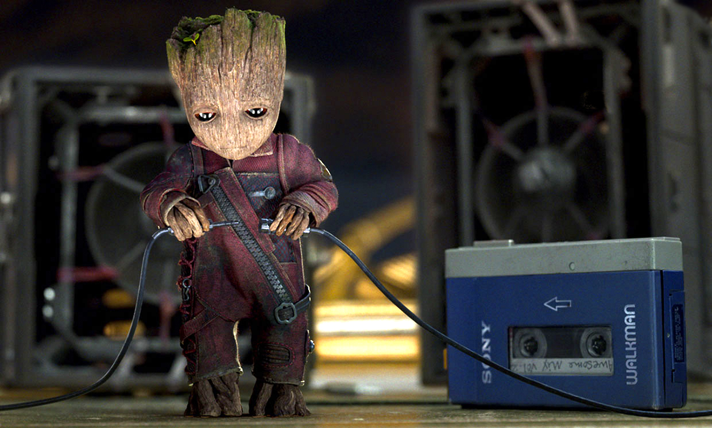  
_Бессмертие в поп-культуре: тридцать пять лет спустя после выхода Walkman в Японии, он попал в первый фильм «Стражи галактики». В запоминающейся сцене во второй части фильма один из персонажей танцует под композицию Electric Light Orchestra «Mr. Blue Sky»._

Sony смогла продать 186 миллионов кассетных проигрывателей Walkman к концу марта 1999 года. Вместе с эволюцией форматов хранения развивался и Walkman, и Sony выпускала модели, проигрывавшие сначала CD, а потом и MP3. До сей поры Sony [продаёт](https://www.sony.com/electronics/walkman-digital-music-players/t/walkman) переносные цифровые плееры под маркой Walkman. Недавний всплеск интереса к ретрозвуку (в основном к винилу и вертушкам, но и к кассетам тоже) привёл к тому, что некоторые продавцы на eBay просят по $450 за работающий TPS-L2.

## Nokia N85

  

### Первый сотовый телефон с экраном AMOLED провалился на рынке, несмотря на то, что скомбинировал несколько весьма передовых технологий

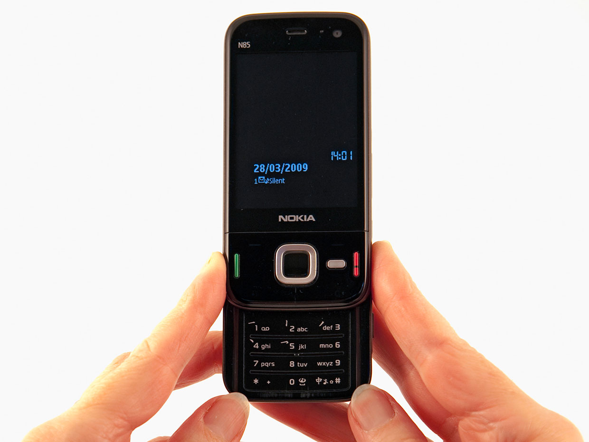  
_Гости из будущего: Nokia N85 был первым смартфоном с экраном-активной матрицей на органических светодиодах (AMOLED). Такие дисплеи станут самым популярным типом экранов на много лет после этого._

Nokia N85 не входит ни в один список лучших телефонов своего времени. Она даже не попала в [список](https://en.wikipedia.org/wiki/List_of_best-selling_mobile_phones) телефонов Nokia 2008 года, занимающих пять первых мест по продажам. Его особенность состоит в том, что это был первый телефон, представивший самый качественный из экранов для смартфонов: активную матрицу на органических светодиодах.

Сегодня с экранами на AMOLED ассоциируется Samsung, но Nokia её опередила. N85 вышла в октябре 2008, а первый телефон Samsung на AMOLED, i7110, вышел в феврале 2009.

В те дни в большинстве телефонов стояли экраны TFT (тонкоплёночные транзисторы), хотя у некоторых были экраны OLED. AMOLED давала более богатую палитру цветов и контраст по сравнению с TFT. Не было ещё ни одного смартфона без проблем с аккумулятором, и AMOLED потребляла меньше энергии, чем OLED, и гораздо меньше, чем TFT. У них больше угол обзора, чем у TFT. А ещё AMOLED гибкий – правда, за 10 лет это преимущество почти никто не использовал, но оно является ключевым свойством у искривлённых экранов, с которыми играются сегодня некоторые производители. Экраны AMOLED начинали не как сенсорные; эту возможность создали позже, добавив чувствительный к нажатиям слой поверх экрана.

В 2008 на рынке телефонов всё ещё существовал зоопарк из различных размеров экранов, некоторые из которых занимали половину телефона, а некоторые – почти всю поверхность. N85 принадлежал к первым. У него не было сенсорного экрана, поэтому нужно было место для кнопок. Диагональ экрана составляла 2.6", а разрешение – 240х320.

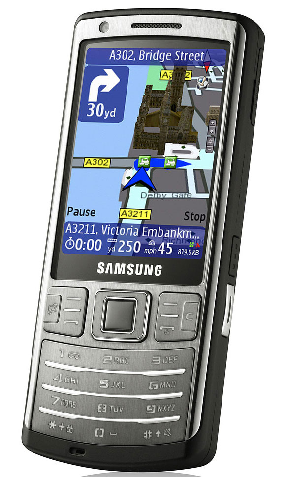  
_Зов будущего: вторым смартфоном с AMOLED был Samsung i7110. Позже Samsung стала использовать AMOLED на всех премиальных моделях._

В N85 также вошли и другие передовые для того времени особенности, включая связь по WiFi, 5-мегапиксельная камеру с автофокусом и цейсовскими линзами. Телефон предлагали по цене в €450 на €100 дешевле тогдашнего флагмана от Nokia, N96, который многие считали низшим по качеству.

После выхода N85 и i7110 критики ныли по поводу плохой видимости экранов на солнце, однако это испытание тогда проваливали и многие другие экраны (а многие не справляются с ним и сегодня).

И хотя технология AMOLED сегодня ассоциируется с компанией Samsung, [изобрели](https://www.oled-info.com/kodak-oled-technology) её в Kodak в 1980-х. Первым продуктом с экраном AMOLED была камера Kodak EasyShare LS633 2003 года. Но к тому времени звезда Kodak уже заходила, и компания начала закрывать бизнесы и распродавать активы, включая продажу разработки AMOLED в 2009. Купила её LG, один из конкурентов Nokia и Samsung в области смартфонов. В LG увидели N85 и i7110, и правильно решили, что AMOLED станет стандартом для смартфонов.

А что до Nokia, то она продала свой телефонный бизнес Microsoft в 2014. Два года спустя в процессе сложной сделки независимая компания HMD Global выдала лицензию на продажу телефонов под маркой Nokia. При этом HMD Global покупает некоторые из AMOLED-экранов у LG включая и экран текущего флагмана марки Nokia, Nokia 8 Sirocco.

## ☃