Зал славы потребительской электроники: истории лучших гаджетов последних 50 лет, часть 3

[_Вторая часть_](https://habr.com/post/435020/)

## GPS-навигатор Garmin StreetPilot

  

### Garmin StreetPilot помог уничтожить рынок уличных атласов, но, возможно, сохранил несколько браков

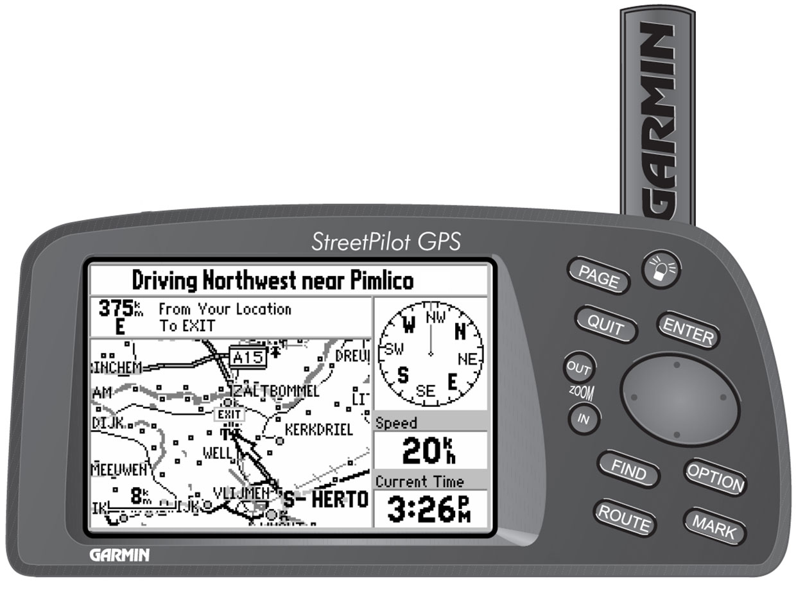  
_Путь вперёд: Garmin StreetPilot, появившийся в 1998 году по цене в $400, был одним из первых практичных и доступных GPS-навигаторов_

Если вы родились до 1980, то от вас наверняка ожидали, что в подростковом возрасте вы научитесь работать с картами. Если вы не узнали, как добраться до какого-то места, до того момента, как сядете за руль, вы не могли туда попасть.

Бывали и исключения. Если вы не знали, как проехать, куда вам надо, вы могли остановиться и спросить дорогу. Или, если у вас был пассажир, вы могли положиться на него (или неё), как на штурмана.  
  
Тем не менее, из-за несоответствия этим условиям иногда рушились браки. После появления Garmin такого уже не было. А также Garmin и его конкуренты практически уничтожили рынок дорожных атласов.

Путь к таким резким социальным изменениям начался в стенах Министерства обороны США. В начале 1970-х министерство начало создавать систему глобального позиционирования, GPS, однако до 1983 года пользовалась ей исключительно сама. В том году правительство разрешило использовать её в потребительских целях – хотя и с ухудшенным разрешением. В 1996 правительство постановило, что GPS будет технологией двойного использования – с практической точки зрения это означало, что коммерческие компании, наконец, смогут получать такие же точные данные, как правительство и военные.

Различные производители бросились делать GPS-системы для коммерческой навигации в конце 1980-х, но из-за плохого разрешения и высокой стоимости их продукция не то, чтобы разлеталась с полок. К примеру, Magellan Navigation представила первую портативную коммерческую систему для GPS-навигации, NAV 1000, в 1989. Некоторые клиенты остались довольны этими устройствами, в основном те, кто много времени проводил на природе, но мало каким пешеходам показалось необходимым приобретать прибор размером с кирпич по цене почти в $3000, который мог бы сказать, на какой они улице, а также выдать им их точные координаты в градусах, минутах и секундах.

Использование навигации в автомобилях сулило лучшие перспективы. С начала 1990-х несколько автопроизводителей начали предлагать системы GPS-навигации, но тогда высокое разрешение было недоступным, и точность оставляла желать лучшего. А высокая стоимость GPS-технологии означала, что эти приборы были доступны только в люксовых моделях, которых продавалось немного.

К 1998 году стоимость GPS существенно упала, и у Garmin шанс заработать был не хуже, чем у других. Она была основана в 1989 году под названием ProNav, и имела опыт создания GPS-навигаторов для военных. Garmin смогла сделать портативную модель по привлекательной цене (около $400), на которую можно было загружать точные карты улиц.

Первый продукт компании для потребительского рынка, StreetPilot, имел размеры около 17х8х5,5 см, и весил около 500 гр, включая шесть батареек АА. У него был чёрно-белый LED-экран 240х160 пикселей (в следующем году Garmin выпустила модель уже с цветным экраном).

У модели был 12-канальный GPS-приёмник, и она обеспечивала точность позиционирования не хуже 15 метров, с максимальной точностью в 1-5 м с дифференцированным GPS, когда спутниковые сигналы дополняют сигналы с наземных станций.

В комплекте со StreetPilot шли карты, где были отражены шоссе между штатами и внутри штатов США, реки и озёра США, Канады и Мексики, и главные улицы основных населённых пунктов. Пользователи могли покупать компакт-диски с картами разных городов, где были представлены улицы и полезные заведения, вроде заправок и предприятий общепита, и закачивать эти данные в картриджи памяти (объёмом 8 и 16 Мб), подключавшиеся к прибору. Пользователи могли ввести адрес места назначения, и StreetPilot проводил их самым коротким путём. В общем, StreetPilot предлагал самую простой вариант навигатора, без информации о пробках, и без всего того, что можно получить сегодня в бесплатном приложении для смартфона. Но в то время это стало откровением.

Последующая модель, StreetPilot III 2002 года, могла похвастаться цветным дисплеем с диагональю в 3,85", разрешением 305х160 и голосовыми запросами.

Garmin и её последователи не только изменили то, как люди передвигаются на машине, но и вплотную подошли к обесцениванию для большинства людей способности разбираться в картах. И в процессе, возможно, спасли несколько браков.

## Sony Trinitron

  

### Sony Trinitron не только возвёл Sony в ранг первостепенных технологических инноваторов, но и сделал Японию первоклассным источником передовой электроники

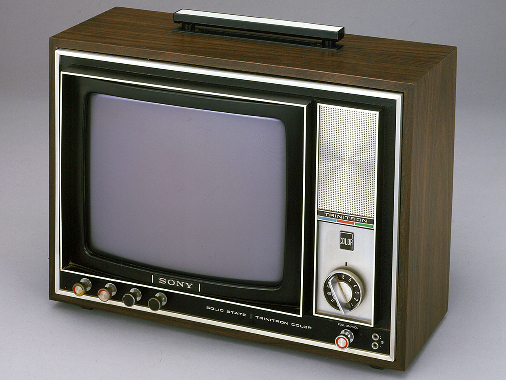  
_Задорная труба: оригинальный Sony Trinitron KV-1310 был представлен в Японии на пресс-конференции 15 апреля 1968._

Trinitron, раскрытый компанией Sony в 1968, был первым значительным технологическим прорывом в области цветного телевидения с тех пор, как такие телевизоры впервые появились на рынке в начале 1950-х. И, как многие инновации, он стал результатом эволюции нескольких провальных проектов.

Телевизор показывал цветное изображение, когда на внутренней части экрана возбуждались фосфорные точки. Среди основных элементов первых цветных ТВ были, если считать от задней части к передней: три электронных излучателя, или «пушки», поставленные треугольником; они указывали на барьер, теневую маску, в котором были просверлены отверстия; после этого шёл экран с фосфором.

Экран был усеян миллионами крохотных фосфоресцирующих точек, собранных по три. Когда электроны попадают на точки, те излучают свет. В каждой триаде было три точки, химически созданных так, что одна из них излучала красный, одна – зелёный, и одна – голубой цвет. В теории любой видимый глазом человека свет можно создать из разных комбинаций красного, зелёного и голубого цвета (red, green, blue — RGB).

Каждая из трёх электронных пушек нацеливалась только на одну фосфорную точку в каждом RGB-триплете. Цвет, выдаваемый, каждым триплетом, можно было выбрать, подсвечивая пушками нужную комбинацию точек, чтобы создать необходимый цвет. Электроны из пушек [оббегали экран](http://repairfaq.cis.upenn.edu/sam/icets/tvset.htm) туда и сюда много раз в секунду, подсвечивая нужные точки и создавая цветные изображения на экране. Чтобы получать движущиеся изображения, экран нужно было зажигать, или «окрашивать», много раз в секунду. Эта «частота обновления» составляла обычно не менее 60 кадров в секунду.

Однако, была одна проблема. Нацеливать каждую пушку на одну лишь точку в каждом триплете можно было, если бы пушки испускали электроны узким лучом. Но этого не происходило – «луч» электронов был больше похож на брызги.

Производители боролись с этим при помощи теневой маски. Отверстия в ней пропускали только те электроны из каждой пушки, которые должны были дойти до нужной точки в каждой триаде. Все остальные электроны блокировались.

Такая схема работала, по большей части. Пушки должны были быть выровнены идеально, и они сбивались достаточно часто для того, чтобы их нужно было периодически подправлять профессионалу. Более того, теневые маски блокировали множество электронов, которые иначе могли бы заставить фосфоресцировать RGB-триады ярче. Цветные экраны телевизоров были не такими яркими, как могли бы быть, в частности из-за бесполезной траты всех этих заряженных частиц.

К улучшению качества телевизоров можно было подходить с разных сторон. К примеру, RCA, мировой лидер по изготовлению телевизоров в то время, начала использовать редкоземельные элементы, фосфоресцировавшие более ярко. General Electric поменяла расположение пушек, поставив их в ряд (вместо треугольника) и добилась неплохих результатов. Крохотная группа в США, [Chromatic Television Laboratories](http://www.earlytelevision.org/ctl.html), шла по другому пути. Они основывали свой подход на идее известного физика Эрнеста Орландо Лоуренса из Калифорнийского университета в Беркли, пытаясь использовать одну электронную пушку, и заменив теневую маску сеткой из заряженных вертикальных проводов. Такая технология, получившая название «хроматрон» \[Chromatron\], тоже давала более яркую картинку из-за отсутствия теневой маски, хотя Chromatic так и не удалось заставить свою систему надёжно работать.

Sony намеревалась не копировать чужие идеи (и не отчислять роялти). На торговой ярмарке 1961 года, финансируемой Institute of Radio Engineers, одним из сообществ, предшествовавших IEEE, директора Sony [увидели](https://en.wikipedia.org/wiki/Chromatron) работающий телевизор от Chromatic. Они практически на месте договорились о лицензии. Sony создала телевизор на основе купленной технологии и вывела его на рынок в 1965 году.

Хроматроны от Sony давали прекрасную цветную картинку, но их невозможно было надёжно производить в массовых количествах, и их себестоимость была настолько больше прибыли с них, что этот бизнес угрожал потопить Sony, как говорит Сусуми Йошида, инженер, работавший над технологиями Chromatron и Trinitron. Компании необходимо было придумать другой способ производить цветные телевизоры.

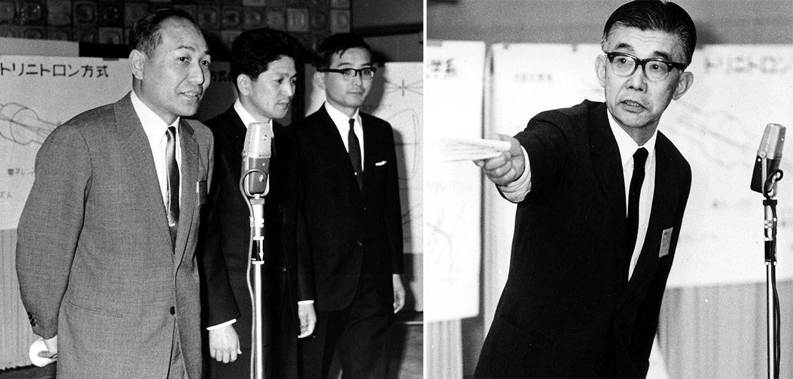  
_Троица тринитрона: трое из четырёх ключевых фигур проекта Trinitron изображены на фото слева, это Сусуми Йошида, Акио Огоши и Сенри Мийаока, присутствующие на презентации технологии в апреле 1968 года. Один из основателей Sony, Масару Ибука (справа) также был инженером, а затем стал президентом компании, и лично наблюдал за работой команды Trinitron._

Четырьмя ведущими ижненерами проекта Trinitron Сусуми Йошида, Акио Огоши и Сенри Мийаока и Масару Ибука. Йошида заявляет, что революционная идея тринитрона пришла именно к нему. Ему понравился подход GE к электронным излучателям, где использовалась линейная система вместо треугольной, поскольку так сводить лучи в одну точку было легче. Однако ему понравилась и идея с одной пушкой (как в зроматроне), поскольку она была дешевле. Йошида задумался, нельзя ли разместить три катода в одну линию внутри одной пушки?

Короче, оказалось, что это можно сделать. Потребовались дополнительные подстройки, включая установку отражающих пластин над пушкой, помогавших фокусировать электронные лучи, и создать процесс химического травления для создания апертурной решётки, выполнявшей ту же задачу, что сетка из заряженных проводов хроматрона, и примерно тем же способом. Но система работала, её можно было массово производить по приемлемой цене, она была стабильной, её практически не нужно было профессионально настраивать после продажи. И, что важнее, она выдавала прекрасное цветное изображение.

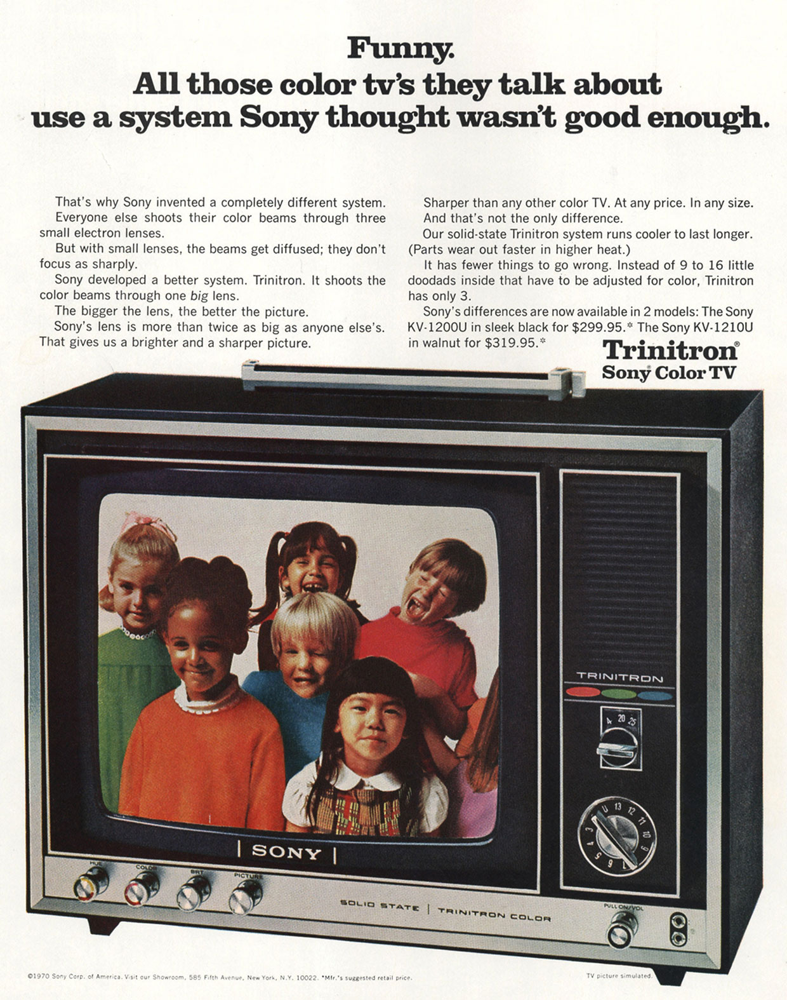  
_Истинные цвета: первая модель Trinitron KV-1210U попала в США в 1969 году, и её рекомендованная цена составляла $319,95, что составляет порядка $2200 в ценах 2019 года._

Появившись в 1968 году, Trinitron сразу стал хитом. Улучшения качества картинки оправдывали высокую стоимость. В 1973 году он стал первым устройством потребительской электроники, получившим премию Эмми. Sony в итоге продала 280 млн экземпляров Trinitron, сначала как ТВ, а потом и как компьютерные мониторы.

И если бы Trinitron был просто огромным шагом технологии телевидения и оглушительным коммерческим успехом, это уже заслужило бы ему место в Зале славы. Но это были не единственные его заслуги. Он сделал компанию Sony первоклассным источником технологических новинок. Его продажи помогли оплатить успешный период работы Sony, с которым по такому количеству инноваций в таком широком спектре потребительских продуктов и такому длительному периоду в несколько десятилетий мало кто может сравниться. Более того, успех Sony стал успехом Японии. До Trinitron большая часть электроники в стране была дешёвой и ненадёжной. Trinitron стал одним из продуктов, сделавших Японию источником передовой электроники мирового класса.

## Apple Watch

  

### Золотые Apple Watch за $10 000 стали чрезвычайно ярким отражением способности компании запрашивать премиальные цены; жаль, что компания, спустя три года, перестала выпускать для них обновления

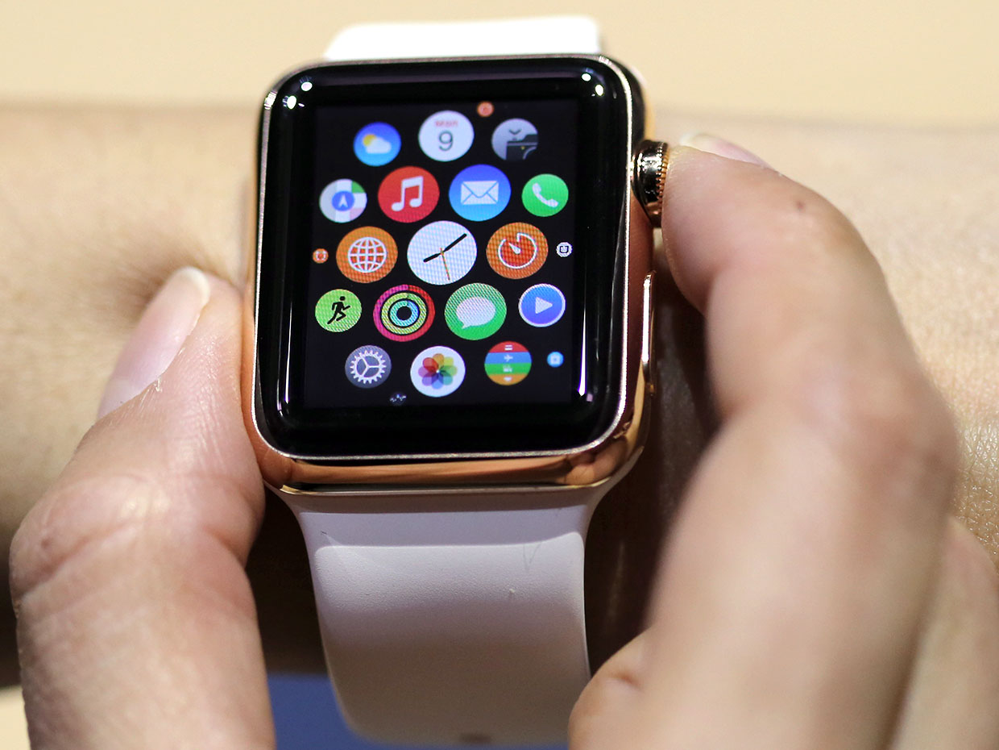  
_Как раз вовремя: 9 мая 2015 года журналисты получили возможность испытать Apple Watch перед их официальным выпуском в следующем месяце. Во втором фискальном квартале года будет продано 4,2 млн часов, что сделает их наиболее популярным из носимых устройств._

Apple Watch никак нельзя назвать первыми умными часами. Можно спорить о том, лучшие ли это умные часы. Но это, без сомнения, лучшие умные часы по продажам – к ноябрю 2018 года их было продано ужу 33 млн. А учитывая их долю рынка, они и дальше будут оставаться наиболее продаваемым гаджетом этого типа. Apple Watch стали одним из прекрасных примеров того, как компания вышла с нужным продуктом на нужный рынок в нужный момент. Это был прекрасный пример своевременного (гм) выхода.

Люди придумали умные часы уже много лет назад. Герой комиксов [Дик Трейси](https://www.smithsonianmag.com/smart-news/how-dick-tracy-invented-smartwatch-180954506/) надел такие часы в 1946-м. Seiko Epson в 1984 году представила часы, синхронизирующиеся с ПК. В 90-х Timex, IBM и Samsung попытались выпустить электронные часы, но их подвело несовершенство технологии. В 2000-х связь с часами оставалась ненадёжной, приложении были неудобными. В 2004 Microsoft представила умные часы Spot; они полагались на проприетарный сетевой беспроводной протокол, работавший на FM-частоте. За ней последовали Motorola, Sony Ericsson, Vyzin Electronics и другие.

В том же десятилетии Fitbit и другие компании стали пионерами на рынке фитнес-трекеров, отслеживающих движения носителя, его сердцебиение, сон и другие параметры, связанные со сном. Следующим логическим шагом казалась комбинация фитнес-трекера и умных часов, однако фанаты фитнес-трекеров отвергали комбинированные устройства ещё несколько лет после этого.

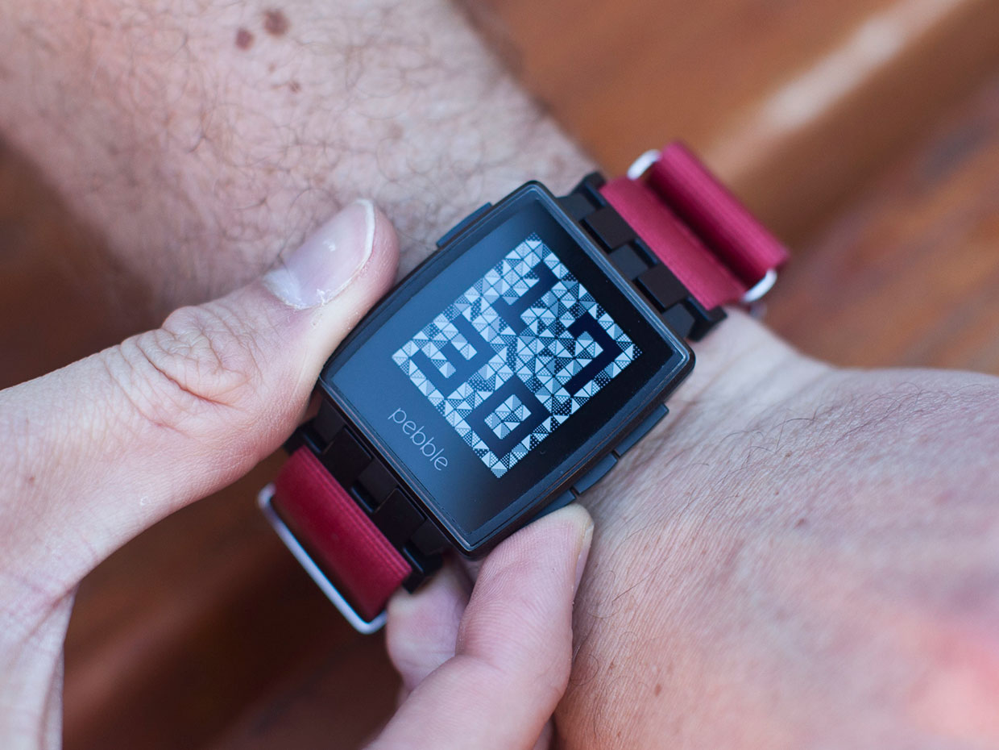  
_Запустились с кикстарта: краудфандинговый феномен Pebble Smart Watch стал важным пионером во всей этой истории, но не выжил после появления такого монстра, как Apple Watch_

В 2012 году Pebble Technology Corp. представила первые успешные умные часы, Pebble. За ними последовали Omate TrueSmart в 2013, а затем LG, Razer, Samsung, Sony и некоторые другие. Некоторые из устройств были комбинированными, и по какой-то причине люди начали к ним привыкать.

Трудность, встающая перед каждым производителем умных часов, заключалась в том, что они пытались продавать наручные часы поколению, которое утратило привычку их носить, поскольку привыкло сверяться с часами на телефоне.

Большинство производителей пошли по очевидному пути – сделали часы, служившие дополнением к телефонам. Можно было взглянуть на часы, чтобы проверить последние сообщения, почту или будильники, не вытаскивая телефон из кармана или сумочки.

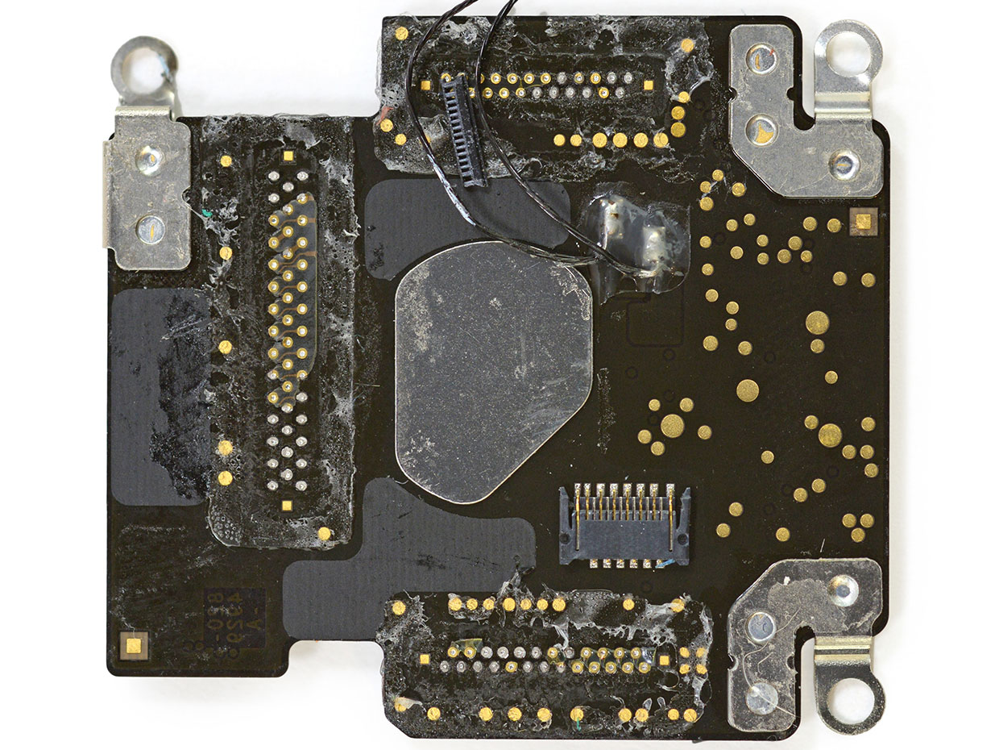  
_В ядре Apple: всё важное в Apple Watch содержалось на модуле S1. Неправильная форма в его центре – это радиатор процессора._

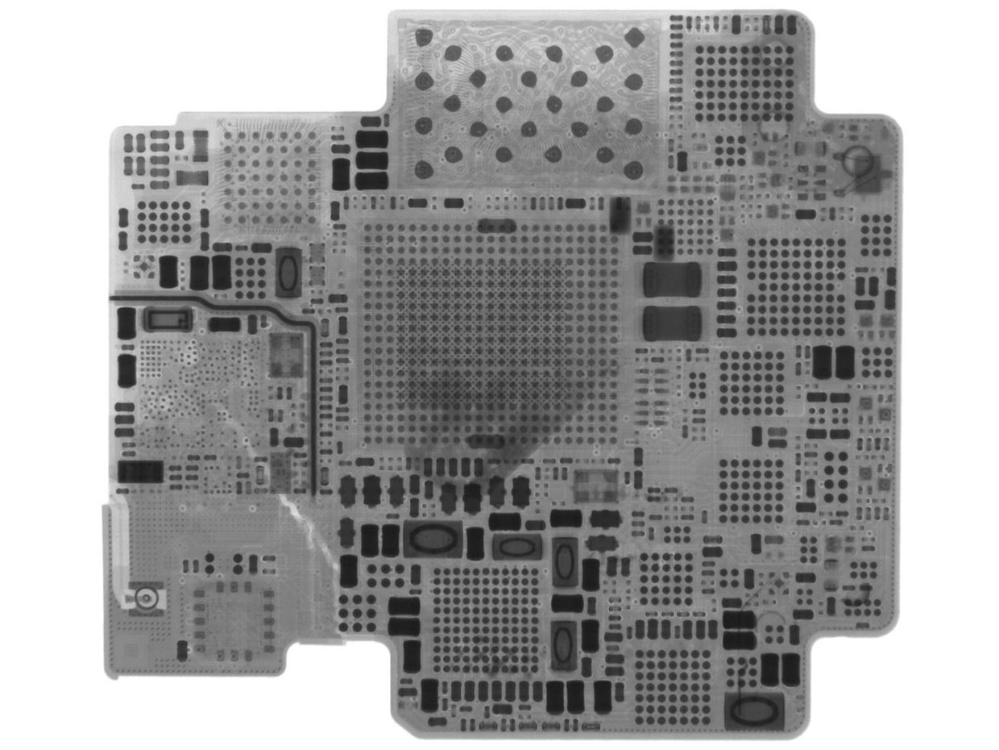  
_На рентгеновском снимке видно множество крохотных точек соединения проводов, объединяющих чипы в рамках S1._

Apple пошла по тому же пути, когда, наконец, вышла на рынок в 2015 году, но немного изменила схему – и ключ к этому можно найти в самом названии продукта. Это не Apple Smartwatch и даже не Apple iWatch, это просто Apple Watch. Apple с удовольствием вышла бы на рынок умных часов, но их основной целью был рынок люксовых часов, состоящий из людей, которые нуждались в устройстве, не просто показывающем время, но и передающем статус – а такие потенциальные покупатели с радостью раскошелились бы на такую игрушку.

Такая стратегия была недоступной для большинства конкурентов. У большинства компаний были клиенты, но у Apple были обожатели, считавшие покупку их продукции статусным шагом. Apple успешно стала премиальной маркой на рынке люксовых часов. Когда эти часы были впервые представлены, Apple даже [предложила](https://www.cultofmac.com/315099/17000-gold-apple-watch-might-be-too-cheap/) их версию с корпусом из чистого золота за $10 000 (и через три года, опаньки, [перестала](https://www.businessinsider.com/apple-watch-gold-edition-will-not-work-with-watchos-5-2018-6) выпускать для неё обновления).

Но преданность бренду имеет пределы. Даже для членов культа Apple. Продолжение успеха должно было зависеть от преимуществ Watch. Apple направила все свои обширные инженерные возможности на создание специальной электронной схемы. В результате получился крохотный модуль, который компания называет «системой в упаковке» \[system in package\] (SiP), содержащий практически всю необходимую для часов электронику. SiP – это несколько интегральных схем и соединяющие их контуры на единой плате. Первый Apple Watch SiP, S1, включал 32-битный процессор ARMv7 на 520 МГц, DRAM (от Elpida Memory, сейчас являющейся частью of Micron Technology), технологию NFC от NXP Semiconductor и AMS (бывш. Austria Microsystems), 8 Гб флэш-памяти от SanDisk и Toshiba, беспроводную зарядку от Integrated Device Technology, сенсорную технологию от Analog Devices, и прочее.

У первых Apple Watches время работы от одной зарядки было не из лучших, некоторые владельцы жаловались на их плохую работу, но компания быстро всё исправила. За исключением этих первых недочётов, Apple Watch были надёжно разработаны, стильно сделаны и полезны в использовании точно так же, как любые другие умные часы. Возможно, даже выше среднего.

Эта полезность зависит от размещения часов в популярной, тщательно контролируемой и хорошо взаимосвязанной вселенной продуктов и услуг Apple – и это ещё одно из преимуществ, которое сложно повторить конкурентом. Как сооснователь Apple Стив Возняк недавно сказал: «У меня на часах установлена Apple Pay, там есть посадочные талоны, билеты в кино – всё так просто!» Воз, энтузиаст любых новых технологий, вне зависимости от их происхождения, [недавно воскликнул](https://spectrum.ieee.org/view-from-the-valley/tech-history/silicon-revolution/apple-cofounder-steve-wozniak-on-smart-watches-motivating-engineers-siri-and-more), что Apple Watch были его любимым гаджетом.

Возможно, Apple только начинает свой путь в мире носимой электроники. У Apple Watch интересный потенциал для того, чтобы сыграть ключевую роль в экосистеме носимых гаджетов, гуда могут войти такие устройства, как очки дополненной реальности и умная ткань. Директор Apple Тим Кук недавно [сказал](https://www.businessinsider.com/apple-outsold-the-entire-swiss-watch-industry-in-2017-2018-2), что «Носимая электроника была вторым по величине сегментом в прибыли после iPhone, и это достаточно впечатляющий результат для бизнеса, открывшегося всего три года назад».

## The Matsushita/Technics SL-1200

  

### Technics SL-1200, одна из первых вертушек с прямым приводом, отличилась тем, что стала устройством для прослушивания музыки, которое также использовали для музыкального перфоманса

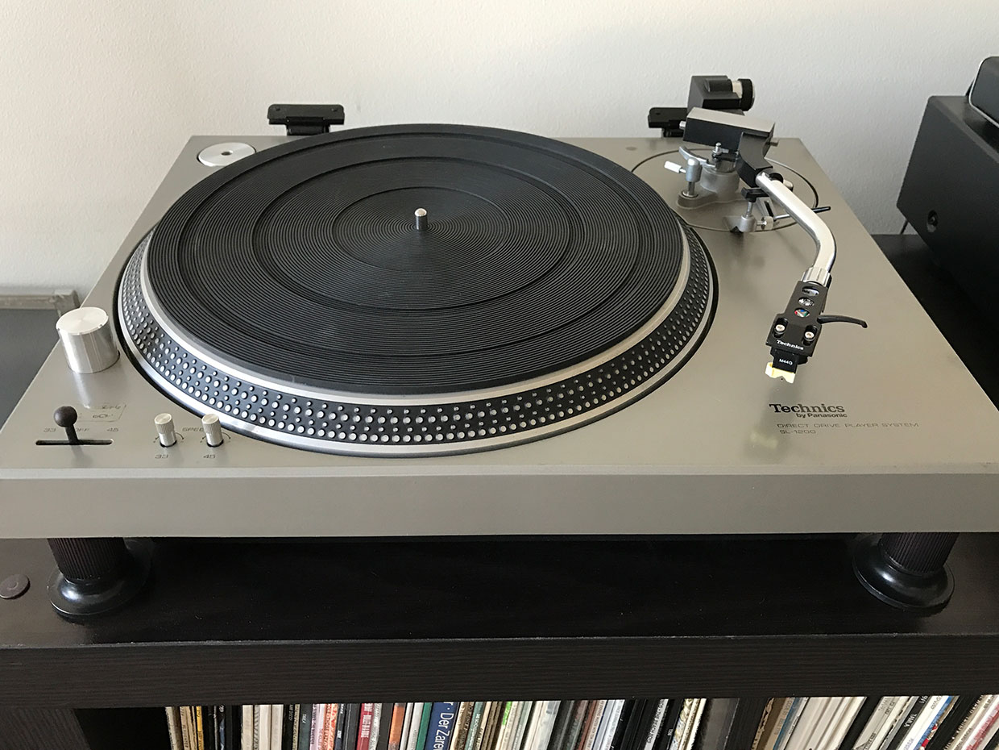  
_Оригинальная вертушка Matsushita/Technics SL-1200, представленная в 1972 году, стала одним из первых проигрывателей виниловых пластинок с прямым приводом. У неё был красный стробоскоп, в заметном цилиндрическом корпусе впереди и слева от диска. Свет использовался совместно с отметками на диске для точной подстройки скорости вращения._

Проигрыватель виниловых пластинок с прямым приводом \[или по советской терминологии, [электропроигрыватель](https://ru.wikipedia.org/wiki/%D0%9F%D1%80%D0%BE%D0%B8%D0%B3%D1%80%D1%8B%D0%B2%D0%B0%D1%82%D0%B5%D0%BB%D1%8C_%D0%B3%D1%80%D0%B0%D0%BC%D0%BF%D0%BB%D0%B0%D1%81%D1%82%D0%B8%D0%BD%D0%BE%D0%BA) / прим. перев.\] стал единственным устройством для воспроизведения музыки, превратившимся в музыкальный инструмент. В данном качестве вертушки были важнейшим элементом зарождения хип-хопа, самого популярного и долгоживущего из новых музыкальных жанров за последние 50 лет. И была одна особенная модель, которую на заре хип-хопа использовали больше всего: Technics SL-1200.

Это был неожиданный поворот в долгой истории записанного звука. Из всех его изобретений Томасу Эдисону больше всего нравился фонограф. Его первая машина, созданная в 1877 году, вела запись на цилиндрические носители. В 1892 году Эмиль Берлингер начал продавать записи на дисках. Невероятный успех дискового формата привёл к тому, что он полностью занял рынок проигрывателей. Многие из первых моделей крутили диски с постоянной скоростью при помощи маховых колёс и заводных ручек. Чтобы раскрутить диск, некоторые из ранних машин использовали [привод с холостым шкивом](https://oswaldsmillaudio.com/turntable): мотор раскручивал холостой шкив, а тот уже раскручивал диск. Следующим шагом стали приводные ремни (причём по поводу того, был это шаг вперёд или [назад](https://www.hifivision.com/threads/idler-vs-belt-drive.22548/), мнения разделились).

Производители вертушек понимали, что лучше будет избавиться от приводного ремня, которые не очень хорошо подходили для поддержания постоянной скорости вращения, а также часто отказывали. Некоторые пытались делать вертушки с прямым приводом, однако для этого требовалась очень точная система управления скоростью разгона и вращения мотора, и десятилетия такие возможности выходили за рамки практически доступных для массового рынка.

Но электроника, наконец, предоставила эти средства. Первую электронную вертушку прямого привода, SP10, разработал Шуичи Обата, инженер из Technics, подразделения компании Matsushita. Она вышла на рынок в 1969 (одна из них есть в нью-йоркском музее современного искусства). SL-1200, также разработанная Обатой, появилась спустя три года и несколько промежуточных моделей.

У вертушек с прямым приводом был высокий крутящий момент, благодаря чему они могли раскручиваться почти мгновенно. Также они лучше других справлялись с поддержанием постоянной скорости вращения, что практически полностью устраняло плавание тона и дрожание звука – слышимые искажения, появляющиеся из-за изменения скорости вращения. К началу 1970-х диджеи на радио и в клубах, а также инженеры звукозаписи начали повсеместно использовать вертушки прямого привода.

И дело было не только в звуке. Прямым приводом можно было манипулировать вручную, не боясь его сломать – а это было чрезвычайно важно для диджеев. На вертушке с приводным ремнём довольно сложно начать проигрывать запись с определённого момента, поскольку у такого привода время раскрутки до нужной скорости бывает непредсказуемым. Если расположить иголку на дорожке слишком близко к началу музыки, вы получите искажённое воспроизведение начала записи. Если начать слишком далеко, получите несколько секунд тишины. Так что в эру приводных ремней диджеи выработали технику под названием «скольжение по сигналу» \[slip cue\]. Они находили начало песни на пластинке, поворачивали её чуток в обратном направлении, и оставляли иголку в этом месте, придерживая пластинку рукой, пока диск проигрывателя раскручивался. Когда им надо было начать песню, они отпускали пластинку. Чёткое включение песни таким методом было предметом профессиональной гордости диджеев, когда те ещё проигрывали записи с пластинок, поскольку результат а) звучал хорошо, и б) если применять её неправильно, технология приводила к износу приводного механизма.

Поскольку у прямого привода крутящий момент гораздо выше, на них такая техника работает лучше. А ещё их без проблем можно крутить назад – что недопустимо делать с ременным приводом. Для диджеев это значило, что они могут легко и быстро открутить запись назад, чтобы найти нужный момент.

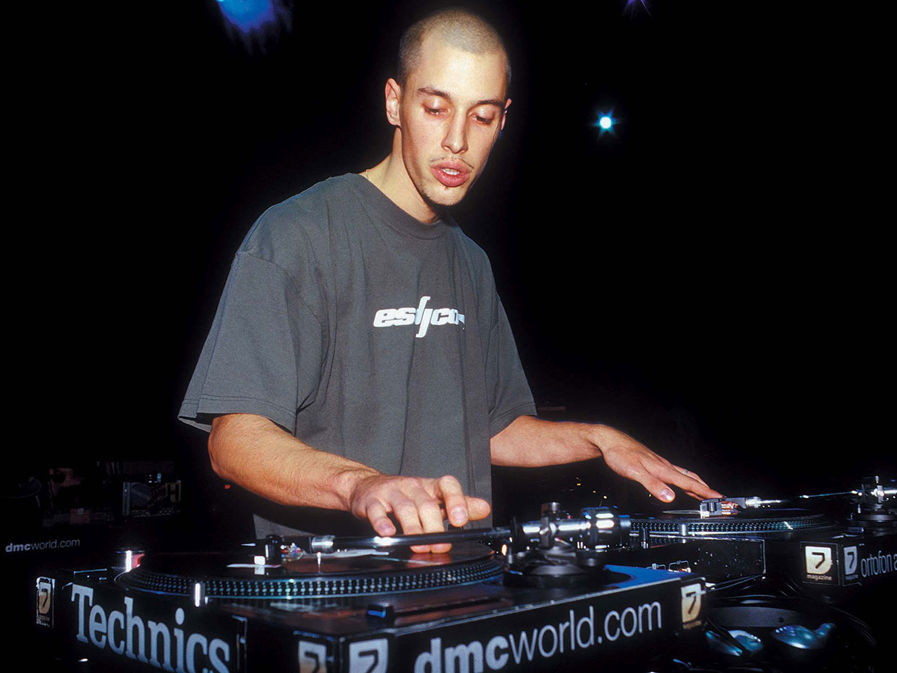  
_Hey Mister DJ: SL-1200 быстро стала любимой вертушкой профессиональных диджеев. На фото шведский диджей Jay K на соревновании 2001 года DMC World DJ Mixing Championship в Лондоне._

Вне зависимости от того, работает ли диджей на радио или в клубе, у него есть по меньшей мере две вертушки. Обычно они играют одновременно только во время перехода между песнями. Но в начале 1970-х некоторые диджеи в клубах начали экспериментировать – они оставляли звук от обеих вертушек, и пока одна проигрывала песню, они включали другую через колонки, иногда так быстро, что искажённые звуки с одной вертушки совпадали с басами музыки другой. Эта техника [скретча](https://ru.wikipedia.org/wiki/%D0%A1%D0%BA%D1%80%D0%B5%D1%82%D1%87) стала отличительным признаком ранних хип-хоп композиций. Скретч нельзя было выполнять на приводных ремнях, это бы их убило.

Годами SL-1200 оставалась лучшей вертушкой. Было просто необходимо иметь вертушку с прямым приводом, и у Technics было преимущество первого выхода на рынок. Также играло роль и то, что SL-1200 была вполне надёжной для того, чтобы кинуть её в фургон и отвезти на вечеринку, находящуюся в нескольких часах езды.

Линейку SL-1200 производили 38 лет подряд с 1972 года. Technics выпускала их ещё долгое время после того, как CD потеснили винил, и даже после того, как потоковое аудио потеснило CD. В итоге спад продаж заставил компанию отказаться от производства в 2010 году. А затем случилось нечто неожиданное – возрождение формата LP. В результате компания возобновила производство SL-1200 в 2016-м.

## Cobra 138XLR CB-радио с одной боковой полосой

  

### Cobra 138XLR была наиболее легендарной Си-Би-радиостанцией во время краткого, но прекрасного золотого века гражданских радиостанций

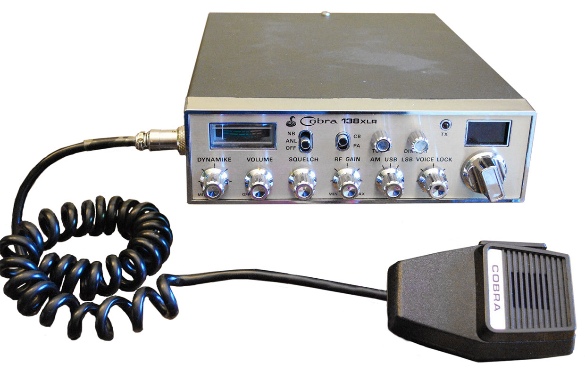

[Cobra](https://www.cobra.com/) 138XLR в том виде, в котором она продавалась, была одной из наиболее удачных СВ-радиостанций, доступных в конце 1970-х, в дни расцвета подобных систем. Но целую плеяду приверженцев 138XLR удалось завоевать благодаря отличному качеству звука и доступности послепродажных модификаций.

Невозможно понять ценность СВ-радиостанций в отрыве от их культурного контекста в период их популярности в США. 1970-е были периодом, полным странных причуд, и одной из наиболее ярких были СВ-радио (см. также: камни в качестве домашних питомцев, макраме и [стрикинг](https://www.youtube.com/watch?v=EWBc-ir6IFM) – пробежки голышом по общественным местам, предпочтительно в прямом эфире). СВ-радио упоминается в хите 1975 года «Конвой» (попадание которого на первое место в нескольких мировых и местных чартах было маловероятным даже по странным стандартам того времени), а также в таких фильмах, как "[Смоки и Бандит](https://www.kinopoisk.ru/film/smoki-i-bandit-1977-8140/)", [Citizens Band](https://www.imdb.com/title/tt0076123/?ref_=fn_al_tt_1) (1977) и "[Конвой](https://www.kinopoisk.ru/film/2451/)" (1978) – последний был создан под влиянием одноимённой песни. Отсылки к СВ-радиостанциям подчёркивали тот факт, который мог ускользнуть даже от миллионов фанатов, покупавших тогда СВ-радио: с начала 1970-х эти радиостанции были рабочими инструментами для дальнобойщиков.

Работа дальнобойщика предполагает одиночество, и двусторонние СВ-станции обеспечивали возможность создания сообщества. Также в то время зарплата дальнобойщиков зависела от скорости доставки товаров. Это побуждало водителей ехать с превышением ограничения скорости, которое в 1974 году федеральное правительство уменьшило до 89 км/ч (55 миль/ч). Дальнобойщики начали использовать рации, чтобы предупреждать друг друга о том, где базируются «смоки» – патрульные на шоссе. Об этом узнали другие водители, и начали покупать рации с той же целью.

У дальнобойщиков также было принято модифицировать имеющееся оборудование. Начиналось всё с грузовиков, а потом перекинулось и на рации. Среди распространённых модификаций были штыревые антенны и такие хаки, как увеличение мощности и модуляции, но те, кто был способен разобраться во внутренностях раций, придумали, как добавлять дополнительные каналы. Некоторые люди просто считают, что больше – значит, лучше, но для дальнобойщиков это значило, что они могут добавить каналы, недоступные для всяких бездельников, которые считали, что кричать в рацию «нарушитель, нарушитель» голосом Бёрта Рейнольдса – это офигеть как смешно. Также использование этих каналов усложняло работу смоки, покупавших себе собственные рации для отслеживания разговоров дальнобойщиков, пытающихся превышать ограничения скорости.

До 1977 года добавлять каналы на СВ-рации было делом дорогим, и требовало очень кропотливой установки и калибровки кристаллов. Кристаллы были традиционным недорогим способом создания и поддержки частоты в небольшом радиопередатчике. Но примерно в то время производители начали менять кристаллы в базовых моделях СВ на кремниевые генераторы с [фазовой автоподстройкой частоты](https://ru.wikipedia.org/wiki/%D0%A4%D0%B0%D0%B7%D0%BE%D0%B2%D0%B0%D1%8F_%D0%B0%D0%B2%D1%82%D0%BE%D0%BF%D0%BE%D0%B4%D1%81%D1%82%D1%80%D0%BE%D0%B9%D0%BA%D0%B0_%D1%87%D0%B0%D1%81%D1%82%D0%BE%D1%82%D1%8B) (ФАПЧ). Технология ФАПЧ использовала генератор с управлением по напряжению для создания базовой частоты, а остальную электронику – для сравнения этой частоты с той, которую генерировали один или несколько кристаллов. С переменным делителем частоты между генератором, управляемым напряжением, и фазовым детектором, частота передачи по радио определялась делителем. Дальнобойщики вскоре обнаружили, что ФАПЧ можно программировать, и что запрограммировать дополнительные частоты было дёшево и просто.

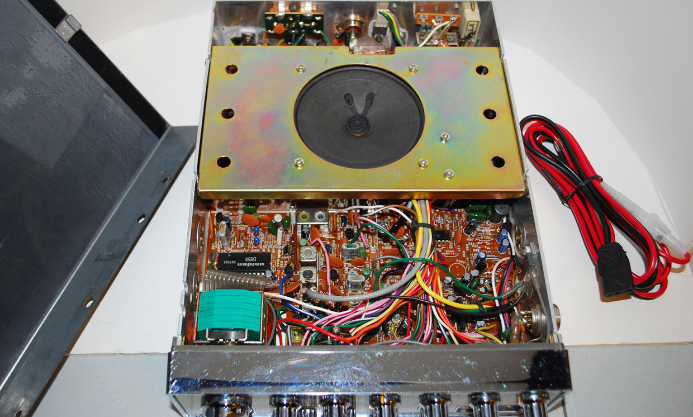  
_Секретным оружием Cobra был чип с ФАПЧ от Uniden. Его видно слева, над зелёным корпусом переключателя._

Cobra купила схему рации у японской компании Uniden, которая называла её 858SSB. Внутри устройства располагался чип ФАПЧ, разработанный Uniden, за номером uPD858. Дальнобойщики выяснили, что его можно перепрограммировать на поддержку 399 каналов – куда как больше, чем у других ФАПЧ, и гораздо больше, чем те 40 каналов, что федеральная комиссия по связи США выделила для коммерческих СВ.

Поэтому, когда в 1977 году вышла Cobra 138XLR, стоимостью около $150, её ждали многие. Однако несколько других производителей, также использовавших железо от Uniden, предлагали сходные продукты. Однако у 138XLR было ещё одно преимущество с точки зрения дальнобойщиков, любивших покопаться в железе. Она принадлежала к небольшому количеству СВ-раций со встроенным [клиппингом](https://ru.wikipedia.org/wiki/%D0%9A%D0%BB%D0%B8%D0%BF%D0%BF%D0%B8%D0%BD%D0%B3_(%D0%B0%D1%83%D0%B4%D0%B8%D0%BE)). И если человек хотел потратить немного времени на подстройку своей радиостанции, то мог получить наилучший по качеству звук из всех, что были возможны для СВ.

Рация 138XLR стала не только одной из самых продаваемых СВ-радиостанций, её выход сделал 1977 год пиком по продаже СВ-раций в США – тогда их было продано 13 млн штук. К несчастью для дальнобойщиков, добавляемые ими дополнительные каналы выходили за пределы диапазона частот, выделенного комиссией по связи (официально диапазон был от 26,965 МГц до 27,405 МГц). Пользователи, имевшие легальные права на использование этих частот, жаловались в комиссию на постоянные помехи от пользователей СВ. Комиссия начала жестоко штрафовать пойманных за нелегальным использованием раций дальнобойщиков, некоторые даже потеряли из-за этого работу. В ответ на такие действия комиссии Cobra перестала выпускать эту модель в 1978 году.