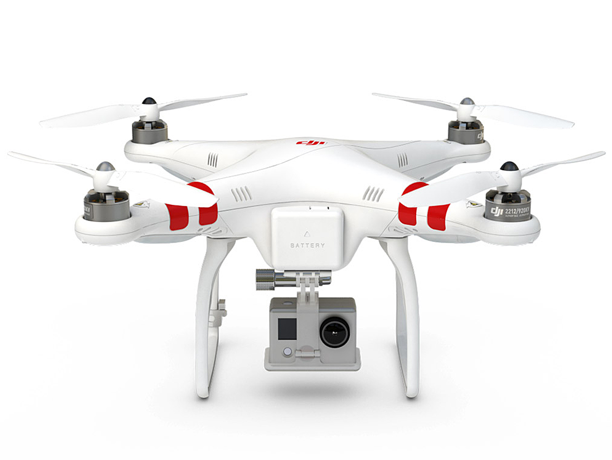
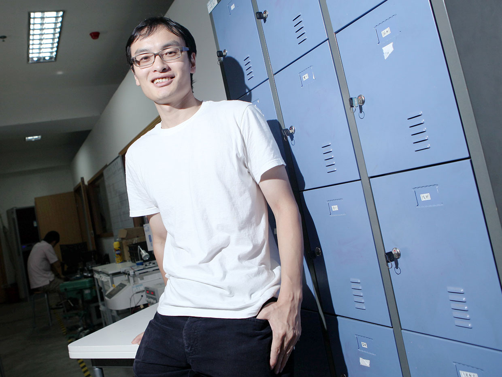
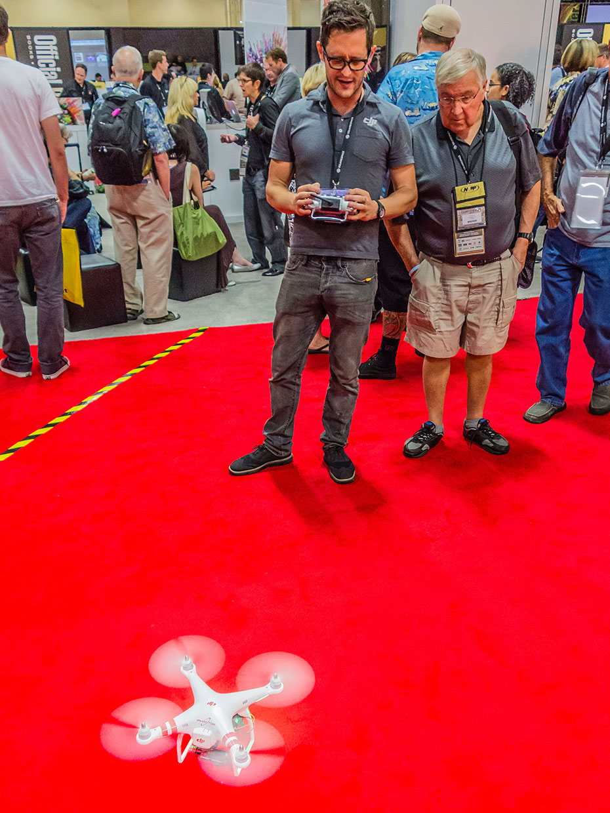
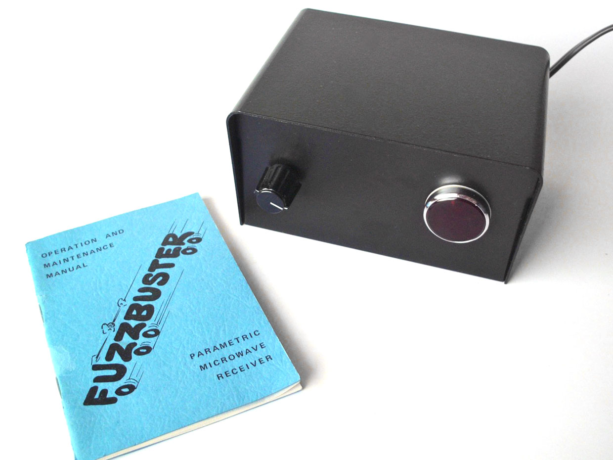
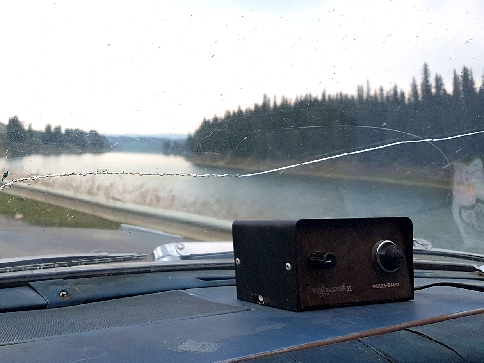
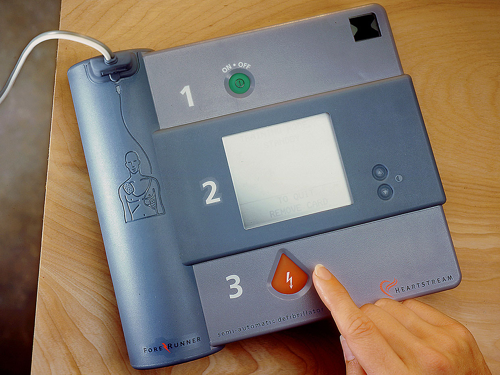
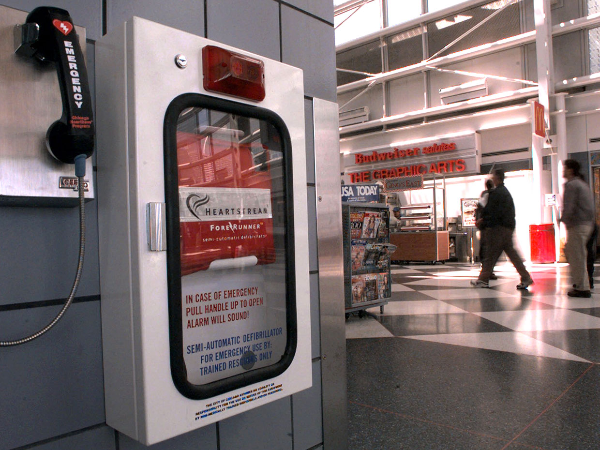
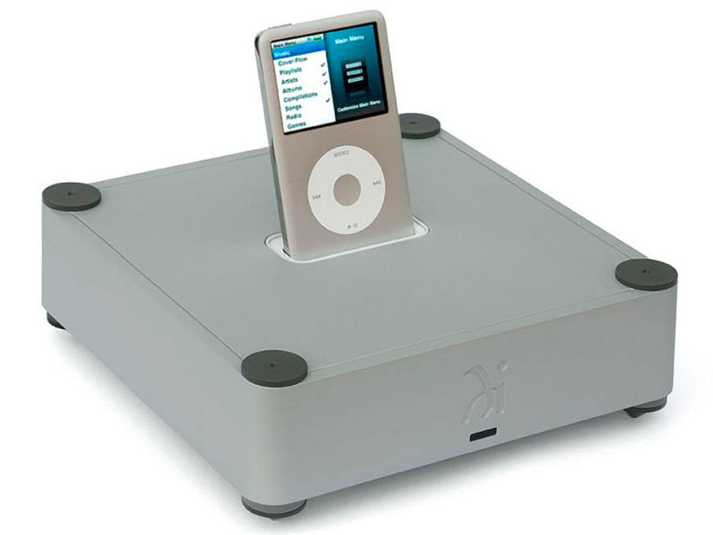
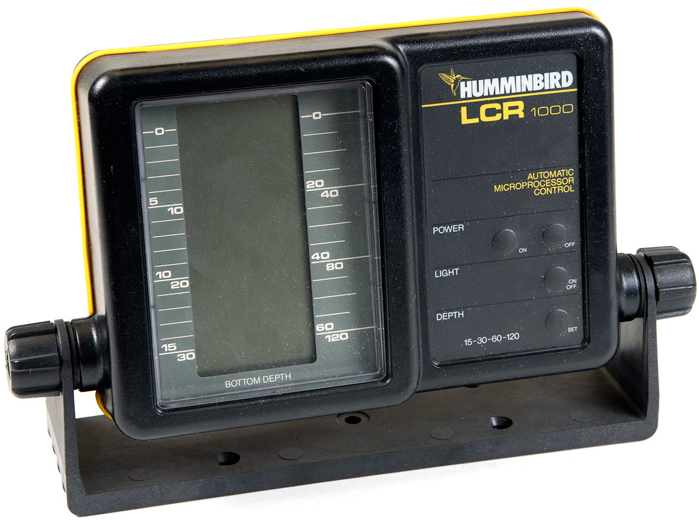
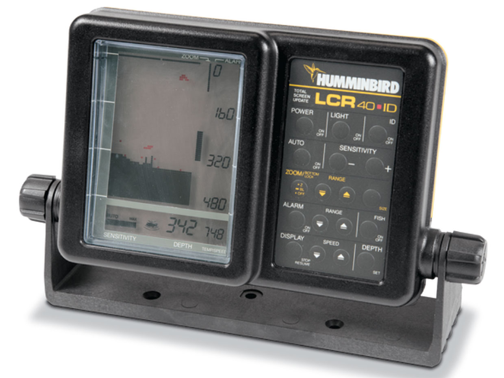

Зал славы потребительской электроники: истории лучших гаджетов последних 50 лет, часть 4

[_Третья часть_](https://habr.com/post/435296/)

## DJI Phantom Drone

  

### Десятки компаний соревновались, создавая первый коммерчески успешный дрон, предназначенный для отдыха и развлечений. Гонку выиграл китайский инженер, ещё недавно бывший подростком

  
_Летающая машина: первый Phantom от DJI был оборудован подвесом, специально предназначенным для крепления экшн-камеры GoPro_

Первый [Phantom](https://robots.ieee.org/robots/phantom/) от DJI мог похвастаться примечательными инженерными решениями, но если бы инженерные решения и маркетинг этого маленького летуна не поддерживали друг друга, DJI никогда бы не взлетел до вершин рынка коммерческих дронов.

В 2005 году, или около того, существовали сотни компаний, способных поучаствовать в гонке по коммерциализации дронов; из них в гонку втянулась пара десятков. И всё же каким-то образом один паренёк из Китая, едва вступивший в зрелую жизнь, сумел полностью занять этот рынок, пришествие которого видели абсолютно все. Появление этого рынка не стало сюрпризом, за несколько лет до этого каждый мог зайти на YouTube и посмотреть на видосики, снятые с самодельных дронов, созданных в различных исследовательских лабораториях. На первых роликах были видны квадрокоптеры (в то время это была экзотика), сильно качавшиеся в полёте, но вскоре за ними последовали прототипы, демонстрировавшие манёвры, достойные ловкости стрекоз и колибри.  
  
  
_Высоко взлетел: Фрэнк Ван, директор компании DJI, капитализация которой оценивается в $5,4 млрд, в 26 лет стал одним из основателей компании вместе с тремя друзьями из колледжа._

Фрэнк Ван \[Тао\] был ещё студентом Гонконгского университета науки и технологий, когда он с тремя друзьями в 2006 году основал компанию DJI. Компания должна была вывести на рынок радиоуправляемый дрон-вертолёт, который Ван сделал в качестве учебного проекта. Четвёрка переехала в Шэньчжэнь, по той же причине, по которой предприниматели в США едут в Кремниевую долину – в Китае там собираются деньги, промышленные ресурсы и талантливые инженеры.

Прецедентом для изготовителей дронов можно считать радиоуправляемые машинки. Большую часть рынка, по количеству продаж в штуках, составляют машинки стоимостью порядка $100\. По этой цене они представляют собой дорогие игрушки. Некоторые машинки бывают больше размером, надёжнее, мощнее, и их стоимость уже исчисляется тысячами долларов. Но, несмотря на дополнительную мощность и надёжность, они не делают ничего такого, чего не могли бы модельки за $100. Это всё ещё просто игрушки.

DJI неплохо стартовала, изготавливая вертолёты, но Ван хотел расширить производство до квадрокоптеров. Компания начала разрабатывать собственные технологии, включая моторы, систему управления полётом и подвесы – механизмы, удерживающие камеру ровно, несмотря на колебания и манёвры дрона. Идея была в том, чтобы создать наиболее проворного, стабильного и надёжного дрона из возможных.

DJI представила первые квадрокоптеры в 2011 году (к тому времени все остальные основатели, кроме Вана, покинули компанию). Они были собраны лишь частично, стоили сотни долларов, и имели ценность только для профессионалов и людей, которых в DJI называли «любителями-экстремалами».

DJI было неинтересно продавать игрушки, и кроме того, невозможно было изготавливать дроны по цене игрушек, не прибегая к серьёзным компромиссам по качеству. Компании было необходимо определить рынки, и она придумала гениальный шаг: она начала составлять каталог способов использования не просто самих дронов, а полётов в целом. Сюда входила кинематографическая съёмка, сельское хозяйство, инспекция сооружений энергетического сектора, инфраструктура и строительство, помощь службам быстрого реагирования. И для каждого из этих вариантов в компании разработали маркетинговый план.

Кинематография стала первым очевидным рынком, поскольку многие любители-экстремалы, пользовавшиеся продукцией DJI, уже использовали дроны для фотографий с воздуха. Стоимость найма самолёта или вертолёта для полёта съёмочной команды исчислялась тысячами долларов, даже в случае коротких и простых полётов. Стабильный и проворный дрон стоимостью в несколько сотен сделал бы воздушную съёмку делом простым и дешёвым.

  
_На красной ковровой дорожке: DJI Phantom стал хитом на конференции Photoshop World в Лас-Вегасе в сентябре 2013 года._

Когда пришло время разработки Phantom, компания уже придумала компоненты, способные удерживать дрон достаточно стабильно для того, чтобы делать снимки, включая не только моторы и подвес, но и GPS-навигатор. Последний позволял дрону оставаться неподвижным в воздухе, и кроме того, возвращаться обратно на место старта в случае потери сигнала от пульта управления. До того, как DJI сделала использование в персональных дронах GPS стандартом, было потеряно немало таких аппаратов.

Инженеры DJI хорошо справились не только с главными вещами, но и с мелочами. Компания произвела хорошее ПО, делавшее управление дроном делом простым и лёгким. Прекрасным преимуществом для рынка операторов-любителей был подвес для камеры, специально предназначенный для того, чтобы удерживать экшн-камеру GoPro.

Phantom, продававшийся по $629, стал первой полностью готовой к полёту моделью от DJI, и одним из первых дронов, предназначенных специально для потребителей. Чтобы понять, насколько он повлиял на ситуацию сразу после появления на рынке в 2013 году, нужно осознать, что практически все остальные квадрокоптеры не были предназначены для того, чтобы ими сразу мог управлять любой новичок. Отсутствие GPS и ужасно дёрганое управление означало, что их сильно кидало ветром, и иногда они очень быстро уносились вдаль в ответ на легчайшее движение джойстика. Однако большая часть людей могла сразу же начинать управлять Phantom'ом. Его могли позволить себе достаточно серьёзные любители этого хобби, а также все, кто хотел использовать его в профессиональных целях.

И целевая аудитория немедленно приняла его. Средний человек мог получить достаточно впечатляющее видео при съёмке при помощи этого дрона, чтобы его можно было сравнивать с продукцией профессиональных операторов. Следующие модели Phantom постоянно улучшают технологические аспекты, и ведут себя в воздухе ещё стабильнее.

  
_Взгляд с высоты птичьего полёта: Питер Свенсон (светлые волосы и синяя рубашка, слева внизу) запускает Phantom над своим домом в г. Симрисхамн, Швеция, июль 2013._

Компания не разглашает подробности дронов Phantom. Было несколько сообщений о том, что компания выросла от 8-битного микропроцессора до 23-битного MPU, что может говорить о том, что в оригинальном Phantom стоял 8-битный MPU. В статье от 2015 года цитируются китайские источники, утверждающие, что в DJI оценивали MPU от MediaTek; по времени это совпадает с подготовкой Phantom 4. Часто пишут о том, что DJI использует DSP Ambarella от WT Electronics Co., и это почти наверняка связано с моделью Phantom 4, вышедшей в 2016.

Компания пока ни разу не отказывалась от своего подхода, объединяющего инженерную разработку и маркетинг, и продолжает работу с рынками из первоначального списка. В 2015 она представила 8-моторную модель Agras MG-1 стоимостью в $15 000, специально предназначенную для опрыскивания сельскохозяйственных культур.

Коммерческий рынок дронов ещё очень мал по сравнению с военным. Его оценки очень сильно разнятся, но компания Гартнер в 2017 году [предсказала](https://www.zdnet.com/article/drone-market-to-hit-3-million-units-in-2017-with-6-billion-in-revenue-says-gartner/), что прибыль с продаж коммерческих, не военных дронов, в том году составит $2,36 млрд. И у компании DJI, занимающей, по некоторым оценкам, [около 75%](http://thedronegirl.com/2018/09/18/dji-market-share/) этого рынка, в данном сегменте практически нет конкурентов.

## Радар-детектор Electrolert Fuzzbuster

  

### Путь к первым автомобильным радар-детекторам начался с одного случая, когда инженера, занимающегося радарными технологиями, полицейские остановили за превышение скорости

  
_Выключатель и индикаторная лампочка на передней панели – первый радар-детектор Fuzzbuster был образцом индустриальной простоты._

До детектора, созданного [Дейлом Т. Смитом](https://www.nytimes.com/1977/01/02/archives/the-business-of-radar-evasion.html) в 1968 году, уже существовали потребительские радар-детекторы. Компания [Radatron Corp.](http://www.radardetectormuseum.com/the-first-commercial-radar-detectors.html) выпускала их одной из первых, или даже самой первой, ещё в 1960-м. Но у Смита было несколько преимуществ. Он был инженером-электротехником, имевшим опыт работы с радарными системами для военно-воздушных сил США, что может объяснить такую качественную работу его радар-детектора. Он очень вовремя вышел на рынок, поскольку именно тогда полицейские США начали активно наращивать количество радаров, применяемых на дорогах для обнаружения лихачей.

И, наконец, у Смита был талант к маркетингу. Название, придуманное им для детектора, Fuzzbuster, идеально комбинировало функциональность продукта с небольшим антагонизмом, который многие водители испытывали к патрульным полицейским. Поскольку этот жаргон уже вышел из моды, требуется пояснить, что в то время полицейских часто называли «fuzz» \[англ. пух; а buster – это объездчик лошадей, в некотором смысле, укротитель / прим. перев.\].

Частично на идею сделать собственный радар-детектор Смита подвигло то, что его самого остановили за превышение скорости. «Никогда этого не забуду», — [рассказал](https://newspaperarchive.com/blytheville-courier-news-sep-12-1978-p-9/) он New York Times News Service в 1978 году. «Трое полицейских вышли из-за одного местного радара. Я проверил их систему. Она ошибалась на 15 миль/час, и они с её помощью выписали штрафов на $280 000. Причём эти операторы радара свои имена-то едва могли написать».

Смит знал, о чём говорит. Он участвовал в изобретении этих самых радарных систем, используемых полицией США для отлова нарушителей, как писали в 1986 году в [ноябрьском номере](https://books.google.com/books?id=HeQDAAAAMBAJ&pg=PA76&lpg=PA76&dq=%22dale+smith%22+electrolert&source=bl&ots=04bACaTt8n&sig=KMxDPNRz9y7pLx6IDJE9e1XX7KU&hl=en&sa=X&ved=2ahUKEwietrToj9PeAhVnJTQIHYpGAZ0Q6AEwB3oECAEQAQ) журнала Popular Mechanics, что добавляет этой истории иронии. Однако детали жизни Смита сложно узнать и ещё сложнее подтвердить.

В 1968 году в США полицейские радары работали на частоте X, на 10,5 ГГц (позже FCC определила для них дополнительные диапазоны Ka и K). Смит начал с [супергетеродинного радиоприёмника](https://ru.wikipedia.org/wiki/%D0%A1%D1%83%D0%BF%D0%B5%D1%80%D0%B3%D0%B5%D1%82%D0%B5%D1%80%D0%BE%D0%B4%D0%B8%D0%BD%D0%BD%D1%8B%D0%B9_%D1%80%D0%B0%D0%B4%D0%B8%D0%BE%D0%BF%D1%80%D0%B8%D1%91%D0%BC%D0%BD%D0%B8%D0%BA), распознававшего сигналы на этой частоте. Он уместил его в чёрную коробочку, немногим меньшую по размеру, чем коробка сигарет. На передней панели он поместил небольшую лампочку в пластиковом кожухе. Водители ставили Fuzzbuster на приборную доску. Если устройство обнаруживало сигнал радара, лампочка активировалась.

  
_Имею Fuzzbuster, готов путешествовать: передняя панель Fuzzbuster II была украшена симуляцией под дерево с наплывом._

Нельзя было придумать что-то более простое в использовании. Смиту же нравилось указывать на тот факт, что эта простота была обманчивой. «Они представляют собой нечто большее, чем просто небольшие чёрные коробочки. Их сложность сравнима с механизмом управления огнём в истребителе F-14», — [рассказал он в интервью](https://www.nytimes.com/1977/01/02/archives/the-business-of-radar-evasion.html) The New York Times в 1977 году.

Смит сказал, что дальность приёма Fuzzbuster в четыре раза превышала дальность передаваемого сигнала. Изготовители радар-детекторов не сходятся в максимальной дальности работы своих устройств; некоторые заявляют о трёх милях, другие о четырёх. Но это не имело значения, поскольку Fuzzbuster обеспечивал водителям гарантированное время на то, чтобы замедлиться до скорости, не превышающей ограничения, до того, как полицейский радар получит возвращающийся сигнал и выдаст результат измерения.

С самого начала Fuzzbuster [продавался так успешно](https://www.thetruthaboutcars.com/2016/05/cruising-under-the-radar-rise-of-the-fuzzbuster/), что всего через несколько лет термин fuzzbuster применялся уже ко всем продуктам конкурентов. [Electrolert](https://www.hemmings.com/magazine/hmn/2013/09/Radar-Countermeasure/3729951.html), компания, основанная Смитом для производства радар-детекторов, продавала их примерно по $100 за штуку.

Ещё один всплеск продаж случился в 1974, когда правительство США ограничило максимальную скорость движения по шоссе в 88,5 км/ч (55 миль/ч). Сотни людей восстали против этого ограничения, купив радар-детекторы. Миллионы купили себе СВ-радио, которые дальнобойщики и другие водители использовали для предупреждения друг друга о радарных ловушках.

Почему цифры продаж у разных устройств так различаются? Использование раций было абсолютно легальным, а радар-детекторы оставались предметом непрекращающихся юридических споров. В начале 1970-х некоторые полицейские даже конфисковывали их и разбивали при обнаружении, и им ничего за это не было. Насколько часто это происходило, установить невозможно. Но в то время у водителей появился рефлекс удалять прибор с панели, проезжая мимо полицейского поста. Если вы не превышали скорость, штраф вам не грозил, но вас всё равно могли остановить и конфисковать радар-детектор.

К концу 1970-х споры о легализации подошли к концу. В большинстве штатов США радар-детекторы были объявлены вне закона для дальнобойщиков, но ими разрешили пользоваться обычным водителям. В нескольких штатах эти устройства всё же полностью запретили.

Независимых оценок рынка радар-детекторов того времени нет, но к концу 1970-х в новостях публиковали заявления производителей – которые, вполне возможно, были сильно преувеличены – что общий рынок этих устройств приближался к миллиону в год. К тому времени, по заявлениям Смита, Fuzzbuster занимал 50-80% рынка.

## Дефибриллятор Heartstream Forerunner

  

### По большей части разработку гаджета, спасающего сотни жизней ежедневно по всему миру, финансировали при помощи кредитных карточек

  
_Просто, как раз-два-три: оригинальный Heartstream Forerunner, появившийся в 1996 году, был разработан так, чтобы его мог использовать каждый, просто следуя командам на экране._

Иногда «потребитель» означает «обычный человек».

Внезапная [остановка сердца](https://ru.wikipedia.org/wiki/%D0%9E%D1%81%D1%82%D0%B0%D0%BD%D0%BE%D0%B2%D0%BA%D0%B0_%D1%81%D0%B5%D1%80%D0%B4%D1%86%D0%B0) находится в списке самых частых причин смерти. В отличие от [инфаркта миокарда](https://ru.wikipedia.org/wiki/%D0%98%D0%BD%D1%84%D0%B0%D1%80%D0%BA%D1%82_%D0%BC%D0%B8%D0%BE%D0%BA%D0%B0%D1%80%D0%B4%D0%B0), при котором блокируется ток крови к сердцу, остановка сердца означает прекращение сердцебиения. Она наступает внезапно и без предупреждения. При отсутствии немедленной помощи шансы выжить после остановки сердца каждую минуту падают на 10%. У врачей скорой помощи \[в США\] уходит в среднем от 8 до 12 минут на то, чтобы приехать по вызову, по статистике Национального совета безопасности. Считайте сами. Для людей, пострадавших от этого недуга, шансы неутешительные.

Forerunner от компании [Heartstream](https://www.crunchbase.com/organization/heartstream) радикально улучшил шансы на выживание после внезапной остановки сердца, став первым [автоматическим внешним дефибриллятором](http://old.seattletimes.com/html/businesstechnology/2004006644_defibrillator11.html) (АВД), который может использовать кто угодно, а не только профессионалы, которые почти наверняка прибудут на место слишком поздно. Теперь в аэропортах, школах и торговых центрах повсеместно можно видеть установленные там АВД размером с коробку для завтраков, которые просто использовать и которые весьма эффективно дают электрический импульс нужной силы, способный перезапустить сердце. С 1996 года, когда появился Forerunner, АВД помогли спасти десятки тысяч жизней во всём мире. Национальные институты здоровья США недавно оценили, что в США АВД спасает 1700 человек ежегодно.

Инженеры из Heartstream более десяти лет потратили на превращение традиционных громоздких дефибрилляторов в надёжные автоматические устройства, которые может использовать кто угодно. Дизайн Forerunner был настолько инновационным, что Американская ассоциация по борьбе с сердечными заболеваниями провела тщательное исследование прибора, [заключив](https://www.ahajournals.org/doi/pdf/10.1161/01.CIR.97.16.1654), что внешний дефибриллятор является безопасным и эффективным.

Команда, разрабатывавшая Forerunner, начала работу с компании Physio-Control, расположенной в г. Такома, шт. Вашингтон. В середине 1980-х Physio-Control начала разрабатывать домашний дефибриллятор, пригодный для людей с риском остановки сердца. У них получилось решить эту задачу, но оказалось, что имплантируемые дефибрилляторы лучше справляются с этим. Устройство от Physio-Control провалилось на рынке, как сказал Карл Морган, помогавший его разрабатывать.

  
_Как спасти жизнь: к 1999 году внешние дефибрилляторы всё чаще начали размещать в общественных местах; на фото аэропорт Чикаго._

Морган и несколько его коллег хотели довести этот продукт до ума, но по многим причинам директора Physio-Control не заинтересовались этим. В 1992 году инженеры покинули компанию и основали Heartstream. Они очень хотели начать работать, но не имели представления о поисках инвестиций, поэтому они просто скинулись, сдав все свои кредитки, и выдоив их до максимума одну за другой. У них почти закончился кредит, когда они, наконец, нашли несколько сторонних инвесторов. «Мы понаделали глупостей», — вспоминает Морган в интервью.

В Heartstream учли уроки Physio-Control: система «по одному АВД на каждого» не сработает, как описал это Морган. Команда хотела, чтобы АВД использовались на манер огнетушителей – это должно быть устройство для обеспечения безопасности, широко распространённое, достаточно маленькое, чтобы его можно было повесить на стене (даже меньше портативных АВД, используемых врачами скорой помощи), и пригодное к использованию любым человеком в экстренной ситуации с целью предотвратить ухудшение состояния больного – или даже решить проблему.

После этого инженерам предстояло разработать продукт, соответствующий этой идее. Традиционные дефибрилляторы, установленные в операционных, представляют собой огромные машины, способные выдать сильнейшие импульсы – до 350 Дж, и, возможно, 20 кВт, используя сигнал колебательного контура. Настенный АВД, работающий от батареи, должен работать с более низкими энергиями. Он должен быть автоматическим, чтобы им могли воспользоваться люди, не обученные медицине. И он должен быть безопасным, чтобы люди в момент стресса не навредили и не убили себя или человека, которому они пытаются помочь. В частности, АВД не должен срабатывать, если у человека нет остановки сердца.

Дефибрилляторы низкой энергии уже существовали. Имплантируемые дефибрилляторы использовали крохотные батарейки и выдавали куда как менее сильные импульсы по сравнению с традиционными. Они достигали этого при помощи двухфазных сигналов, требовавших меньше энергии и работавших так же эффективно.

Колебательный сигнал у традиционного дефибриллятора имеет одну фазу – это, по сути, один всплеск энергии. Двухфазный дефибриллятор выдаёт энергию в двух фазах. У двухфазного дефибриллятора пиковый ток составляет от 30 до 40% от монофазного при том же уровне энергии.

Вдохновившись продукцией производителей имплантатов, инженеры из Heartstream экспериментировали с двухфазными токами, чего никто ранее не делал с внешними дифибрилляторами. Они ожидали, что природа электрических полей и сигналов должна быть другой, учитывая, что имплантат располагается рядом с сердцем, а ток от АВД должен пройти через грудину. Оказалось, что так и есть, но хорошие новости состояли в том, что они обнаружили, что двухфазный ток сработает и в случае внешнего дефибриллятора.

Ещё инженеры из Heartstream обнаружили, что форму сигнала можно приспособить к конкретному пациенту. В таком случае результаты получались даже лучше, поскольку персонализированный сигнал учитывает вариации сопротивления, зависящего от размеров человека. Чтобы измерить сопротивление, два электрода дефибриллятора располагались с обеих сторон груди. Инженеры разработали метод, измерявший импеданс между двумя электродами практически мгновенно. Он обычно укладывался в промежуток от 40 до 100 Ом, как говорит Кент Лейд, ещё один инженер из Heartstream.

Затем Forerunner считывал электрокардиограмму (ЭКГ), записывая электрические сигналы от сердца пользователя. Разработчики много месяцев провели за компиляцией ЭКГ, и использовали данные для создания сложного алгоритма. Алгоритм сначала определял на базе ЭКГ, действительно ли у человека произошла остановка сердца, а потом высчитывал нужную форму сигнала, учитывая импеданс (говоривший о размере человека) и характеристики ЭКГ.

Тем временем у Forerunner заряжался высокоэнергетический конденсатор, готовясь выдать спасающий жизнь разряд. Измерение слабых сигналов сердца одновременно с зарядом устройства оказалось трудной задачей, вспоминает Лейд. «Уровень шума надо опустить до пары микровольт, при этом заряжать конденсатор до 2000 В. Получается, что у вас девять порядков разделяет пара дюймов – довольно интересная задача изолирования сигнала, — объяснил он. – Мы шутили, что это было похоже на настройку пианино рядом с катящейся ручной гранатой». Forerunner использовал один микропроцессор, говорит Лейд, скорее всего Motorola 68HC16, в то время – популярный 16-битный встраиваемый микронотроллер. Также у АВД была парочка специализированных интегральных схем, высоковольтные полупроводники и высоковольтное питание. Большая часть схемы была разведена вручную, поскольку компания не могла позволить себе инструменты автоматического проектирования электроники.

  
_Отличная работа: Майкл Тай – сотрудник Комиссии здравоохранения Бостона, поддерживавший установку портативных дефибрилляторов по всему городу – стал первым человеком, которого спасли при помощи такого устройства, когда он летел в самолёте из Бостона в Лос-Анджелес в ноябре 1998._

Чтобы уменьшить размеры Forerunner, нужно было использовать небольшие, но мощные конденсаторы, которых в то время было мало. Они решили связаться с Maxwell Technologies, производителем передовых конденсаторов, работавшим в основном с крупными подрядчиками министерства обороны типа Boeing и Northrop.

Сооснователь Heartstream Том Харрис отвечал за стопку кредиток, поэтому он позвонил в компанию, говорит Морган. Харрис объяснил, чем занимается Heartstream и попросил Maxwell сделать прототип конденсатора. «И они сказали: Да, мы можем вам сварганить прототип», — вспоминает Морган. – И Том говорит: «Отлично! Вы Mastercard принимаете?» Последовала долгая пауза, а потом парень из Maxwell, наконец, ответил: «Ну, теперь принимаем». И многие из людей, с которыми мы сотрудничали, нам таким образом шли навстречу. Это было чудесно".

Heartstream предположила, что пользователям вряд ли захочется тратить время на обслуживание своих АВД, при этом устройства должны быть готовы выдать полный разряд даже после нескольких месяцев простоя. В результате компания решила использовать одноразовые аккумуляторы Li/MnO2 вместо перезаряжаемых, длительность хранения заряда у которых предсказать невозможно. Также компания встроила в устройство самопроверки, и оно ежедневно проводит проверку питания CPU и измеряет работоспособность источника питания и конденсатора.

Также ежемесячно CPU дважды полностью заряжает дефибриллятор, «один раз для калибровки ёмкости конденсатора, а второй для стресс-проверки системы выдачи импульсных разрядов», — рассказал менеджер проекта Дэн Пауэрс магизну EDN в 1998 году. «Предохранительный контур выводит на ЖК-экран большой красный крест и чирикает пьезоэлектрическим излучателем в случае, если CPU перестаёт обновлять экран. Такой подход позволяет наглядно демонстрировать статус дефибриллятора даже когда батарейки сильно разряжены».

Heartstream начала продавать Forerunner в 1996 году. Не прошло и пары лет, как бортпроводники авиакомпании American Airlines использовали Forerunner во время полёта, чтобы вернуть к жизни пассажира – это событие попало в новости и показало ценность наличия АВД под рукой. Через несколько лет Федеральное управление гражданской авиации США обязало установить АВД на практически все коммерческие самолёты. Были приняты различные законы о «добрых самаритянах», ограничивающие ответственность людей, использующих АВД, а другие обеспечили государственное финансирование для установки АВД в общественных местах.

Какое-то время Heartstream удерживала более 50% рынка АВД. В 1998 году её купила Hewlett-Packard и включила в свой филиал Agilent, продав его затем компании Philips в 2000-м. Philips поменяла марку, назвав её Philips HeartStart AED. Компания утверждает, что до сих пор является лидирующим поставщиком АВД.

Морган упомянул, что в Смитсоновском институте есть свой АВД от Heartstream. «Если вы американец, вы гордитесь этим», — сказал он. Ещё больше он гордится количеством жизней, спасённых при помощи АВД, которое, как он утверждает, исчисляется десятками тысяч. «Мы оплатили место, которое занимаем на Земле, при помощи Forerunner», — говорит он.

## Док-станция для iPod Wadia Digital 170iTransport

  

### После долгих баталий аудиофилам, наконец, удалось убедить знаменитую своей закрытостью компанию Apple открыть свой iPod

  
_Wadia 170iTransport стала первым устройством, способным извлекать электронные данные из Apple iPod, чтобы проигрывать цифровую музыку через качественный цифро-аналоговый преобразователь_

Появившийся в 2008 году [Wadia Digital 170iTransport](https://www.stereophile.com/digitalprocessors/1008wad/index.html) занял одну из самых узких ниш в истории электроники: он только извлекал биты из музыкальных проигрывателей от Apple, таких, как iPod, что позволяло преобразовывать эти данные в музыку при помощи электроники, превосходившей по качеству электронику плеера. Но этот проект был важнее, чем вам может показаться, поскольку он смог продемонстрировать, что оцифровка музыки, начавшаяся примерно за 25 лет до этого, не была такой уж ужасной ошибкой.

С профессиональной точки зрения цифровая музыка большую часть времени звучит отвратительно. В цифровом мире можно много чего сделать с музыкой, и большая часть этих операций скажется на ней негативно. И это часто происходит, как у слушателей, так и у компаний, производящих оборудование для воспроизводства музыки. Никакого обмана – достижение отличного качества звука всегда стоило денег, и в истории записанной музыки никогда не было моментов, в которые хорошего звука можно было бы достичь легко и недорого. Так было и с Apple iPod.

Когда Apple представила iPod в 2001 году, она сделала две модели: с 5 Гб и с 10 Гб памяти. Частью преимущества было то, что можно было уместить «1000 песен в кармане», как провозглашали рекламные кампании. До iPod не было ничего, что могло бы хранить подобное количество песен.

5 или 10 Гб – это одновременно и много, и немного. Чтобы запихать 1000 песен в 10 Гб памяти, нужно ужимать оцифрованную музыку. Это можно сделать разными способами, но в то время наиболее распространённым было [кодирование MPEG-3](https://www.loc.gov/preservation/digital/formats/fdd/fdd000012.shtml). Кодировщики MP3 сжимали файлы: они брали цифры, представляющие композицию, и удаляли немного лишнего. Частично это были данные, соответствующие частоте, которую ухо человека не слышит или плохо воспринимает. Некоторые, но не все, данные можно было воссоздать заново, и поэтому формат MP3 является сжатием с потерями. Проблема в том, что при использовании сжатия потерями качество звука ухудшается по многим параметрам, и особенно это слышно молодым людям с хорошим слухом. Большая часть потерь не очень слышна, но от сжатия страдает такая важная характеристика, как динамический диапазон – разность амплитуд между самым громким и самым тихим звуками, которую можно сохранить и воспроизвести.

Apple также допускала компромиссы и в железе. Компания выбрала недорогой и низкокачественный цифро-аналоговый преобразователь (ЦАП). Ей нужно было уложиться в определённую цену, большая часть людей всё равно собиралась слушать MP3, и использовать для этого низкокачественные наушники. Поэтому выбор дешёвого ЦАП был разумным.

Стоимость памяти ежегодно падает, и с годами компания выпускала плееры всё большей ёмкости (у последних iPod, имеющихся в продаже, максимальная ёмкость достигает 128 Гб). Дополнительная память поощряла людей, заботящихся о чистоте звука, переходить на другие схемы кодирования, к примеру, Apple Lossless – она тоже сжимает файлы, но не так сильно, как распространённые варианты MP3. Кодировщики без потерь не отбрасывают информацию о звуке, поэтому в теории не влияют на его качество.

Обзаводясь iPod'ами, аудиофилы возжелали слушать их точно так же, как любые другие стерео-компоненты, типа CD-проигрывателя. Некоторые из них покупали модные ЦАП за сотни или тысячи долларов, и, естественно, возмущались тем, что Apple не даёт им проигрывать файлы, хранящиеся в iPod без потерь, через их дорогущую электронику.

Патовая ситуация длилась годами. Apple отказалась обновляться до ЦАП лучшего качества, и не позволяла никому получать прямой доступ к цифровым файлам. Аудиофилы не прекращали досаждать компании по этому поводу, и в 2005 году Apple [сдалась](https://en.wikipedia.org/wiki/MFi_Program) и объявила, что позволит обходить свой ЦАП – но только тем производителям, которые согласятся подчиняться строгим требованиям компании и будут работать под её надзором.

Первой это сделала Wadia Digital. И это был странный выбор. Она была известна компонентами аудиосистем высшего эшелона, стоимость которых исчислялась четырёхзначными ценами в долларовом эквиваленте.

Wadia 170iTransport появилась в 2008 году, и выглядела, как стандартная док-станция, но не была таковой. После подключения iPod она лишь подключалась к цифровому потоку, обходила ЦАП iPod'а, и передавала поток другой системе, оборудованной серьёзными возможностями воспроизведения звука (поэтому она и называется transport). Этого было достаточно, чтобы сделать систему стоимостью $379 нишевым хитом, однако кроме использования iPod для качественного звука, Wadia снабдила устройство возможностью проигрывать цифровое видео.

«Я думаю, что модель 170i продемонстрировала, что цифровая музыка имеет право на существование», — сказал Чак Хинтон, вице-президент технических услуг из Лаборатории Макинтош, и сотрудник Wadia (обе эти компании сейчас принадлежат McIntosh Group).

Хинтон сказал, что впервые увидел 170i на торговой выставке и был поражён качеством звука. «Люди демонизировали MP3, точно так же, как до этого демонизировали CD, когда те только появились. Но проблема была только в дешёвых ЦАП. Wadia продемонстрировала, что цифровая музыка может звучать хорошо, что MP3 – это не абсолютный мусор, как неверно считалось ранее. Часть проблем крылась в железе».

Кстати, и, возможно, не случайно, Wadia известна разработками высококачественных ЦАП, и сделала отдельный преобразователь, дополняющий 170i.

## Эхолот для рыбалки Humminbird LCR

  

### Происхождение устройства, породившее целое направление эхолотов для рыбалки, можно отследить до парочки кулибиных, начавших модифицировать эхолоты Heathkit

  
_Где клюёт: эхолот Humminbird LCR 1000, представленный в 1984 году, предлагал простой интерфейс со всего лишь четырьмя кнопками_

Рыбаки использовали эхолоты на основе сонаров десятилетиями. В 1984 году крохотная компания [Humminbird](https://www.humminbird.com/), базирующаяся в Юфауле, шт. Алабама, представила модель, которая первой стала использовать микропроцессор и ЖК-экран. Эта комбинация, которую компания назвала LCR, то есть liquid crystal recorder \[записывающее устройство на жидких кристаллах\] вывело компанию на доминирующую позицию на рынке и запустило современную эпоху высокотехнологичной рыбалки.

Во многих странах спортивная рыбалка считается одним из наиболее распространённых видов отдыха. Несколько лет назад Американская ассоциация спортивной рыбалки оценила, что хотя бы раз на рыбалку ходило порядка 60 млн американцев. Эрнест Хемингуэй, Зейн Грей, Ричард Бротиган, Томас Макгуэйн, Негли Фарсон – это лишь несколько писателей, описывавших рыбалку языком, сходным с описаниями религиозных переживаний. [Норманн Маклин](https://www.press.uchicago.edu/Misc/Chicago/500667.html) писал, что рыбалка и религия, по сути своей, представляют собой одно и то же. И, поскольку рыбаки относятся к этому занятию крайне серьёзно, они относятся с большим почтением к технологии, облегчающей этот процесс.

В 1960-х спортсмены-рыбаки всё чаще использовали эхолоты, некоторые собирали устройства самостоятельно из наборов, которые продавала компания [Heathkit](http://www.heathkit.com/). История Humminbird начинается с небольшой группки, в которую входил Том Манн, предприниматель в области рыбалки. В 1971 он объединился с каким-то ныне [неизвестным рентгенологом](https://www.humminbird.com/news/article/humminbird-mann-and-his-bird), работавшим в больнице, и начал модифицировать эхолоты Heathkit (к примеру, экранируя их от помех), и ставить на них марку Humminbird. Вскоре компания начала делать собственные эхолоты, и в 1975 году выпустила Super Sixty, первую водонепроницаемую модель на рынке. Super Sixty привлекла к компании внимание. Она была популярной – хотя не так сильно, как LCR Fish Finder, появившийся в 1984-м.

В то время категория эхолотов для рыбалки начала усложнятся. Нарастало количество функций, но основной проблемой было разрастание количества кнопок на устройстве. Было слишком сложно разбираться, что надо нажать, чтобы достичь результата. Дисплеи тоже становились всё сложнее. Изготовители продолжали добавлять алфавитно-цифровую информацию на каждый экран, из-за чего было сложно воспринять её, глянув на него мельком. Что хуже, тогдашние экраны плохо вели себя на солнце – а это была не маленькая проблема, учитывая, что рыбачат люди обычно на природе и днём.

Поэтому когда Джим Балкком, в то время директор Humminbird, думал над тем, каким должен быть следующий продукт компании, он сконцентрировался на таком устройстве, с которым было бы легко работать на солнце.

Инженеры компании выбрали ЖК-экран, который в инструкции к устройству назвали «суперскрученным», имея в виду технологию [суперскрученных](http://www.smartphone.ua/w_stn.html) жидких кристаллов (supertwisted nematic или STN) – этот тип монохромных ЖК-экранов был изобретён только в 1983 году. В то время по характеристикам они превосходили обычные.

  
_На рыбалку: в последующих версиях LCR компания обновила устройство, добавив ЖК-экран, способный демонстрировать разные цвета, и придумала запоминающийся слоган: «Если рыба, то красная» \[“If it’s fish, it’s red”\]._

Но если у Humminbird будет новый крутой экран, не будет ли здорово сделать какую-то новую возможность, чтобы выставить его в наилучшем свете? Инженеры решили использовать микропроцессоры для анализа звуковых сигналов и графического изображения срезов речного дна под лодкой.

LCR показывал контур дна с видом сбоку. Все предметы крупного размера, плававшие над дном, в большинстве случаев были рыбой, и отображались в виде рыбки – пикселизированной, но различимой. У устройства было достаточно хорошее разрешение, чтобы определять предметы, плавающие в 15 см над дном или в 15 см друг от друга.

В ответ на жалобы на усложнение эхолотов для рыбалки, компания снабдила LCR всего двумя кнопками. «Одна включала аппарат, а другая переключала между разными возможностями. Всё было просто. И прибор взлетел, как ракета. За три года прибыль выросла от $6 млн до $75 млн и от 0% до 48% доли рынка, произведя на нём революцию», — рассказал Бэлкком журналу Bassmaster несколько лет спустя. Насчёт двух кнопок он преуменьшил, поскольку у модели Humminbird LCR 1000 их было четыре. Одна для включения, одна для выключения, а ещё одна подсвечивала экран. Но для переключения возможностей действительно служила только одна кнопка.

Следующая модель Humminbird, LCR4 ID, добавила цветной ЖК-экран (по заявлению Балккома, купленный у Hitachi). Дно отображалось чёрным, а всё, что могло быть рыбой – красным. Они разлетались так быстро, что полтора года у Humminbird просто не было ничего на складе – компания продавала изделия сразу после изготовления. После того, как её в 2004 году купила Johnson Outdoors Inc., она продолжала выдавать инновации. По её заявлениям, она создала первый трёхмерный эхолот и первый эхолот с видом сбоку, помогавший рыбакам искать рыбу. Также компания хвастается, что первой начала включать в свои эхолоты GPS-приёмники, и первой в 2012 году выпустила модель с изображением, разворачивающимся на 360 градусов.