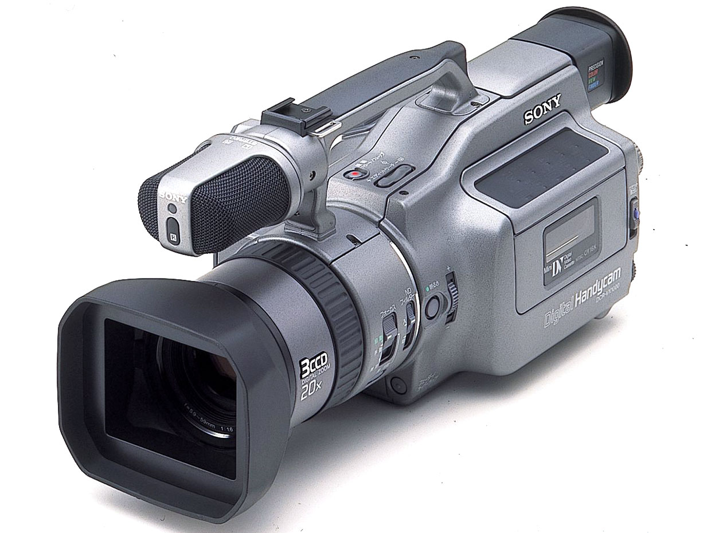
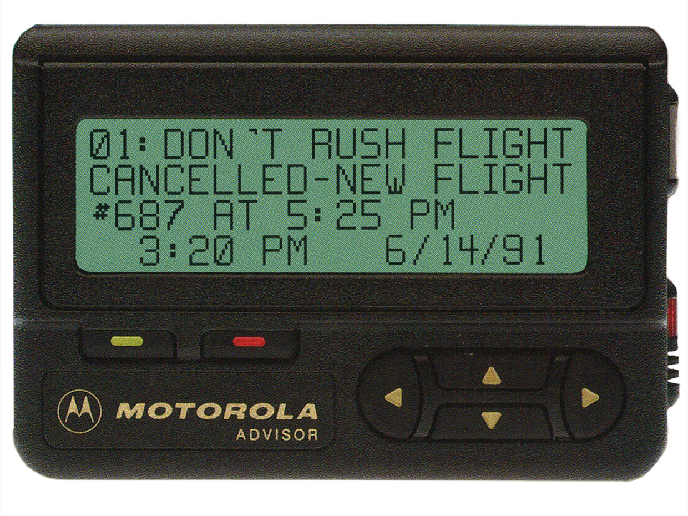
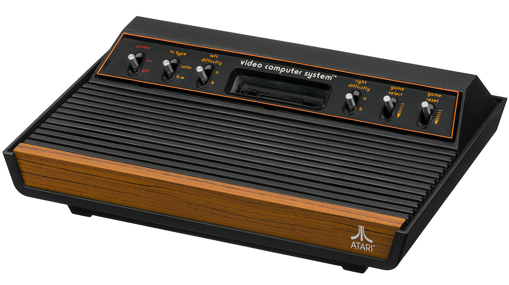
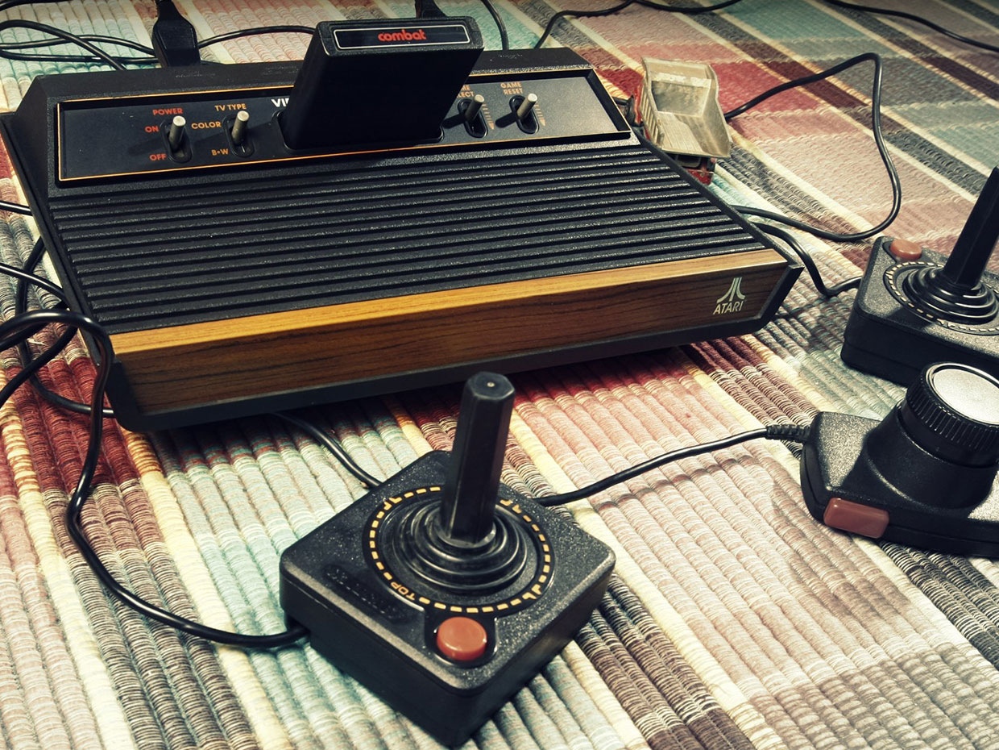
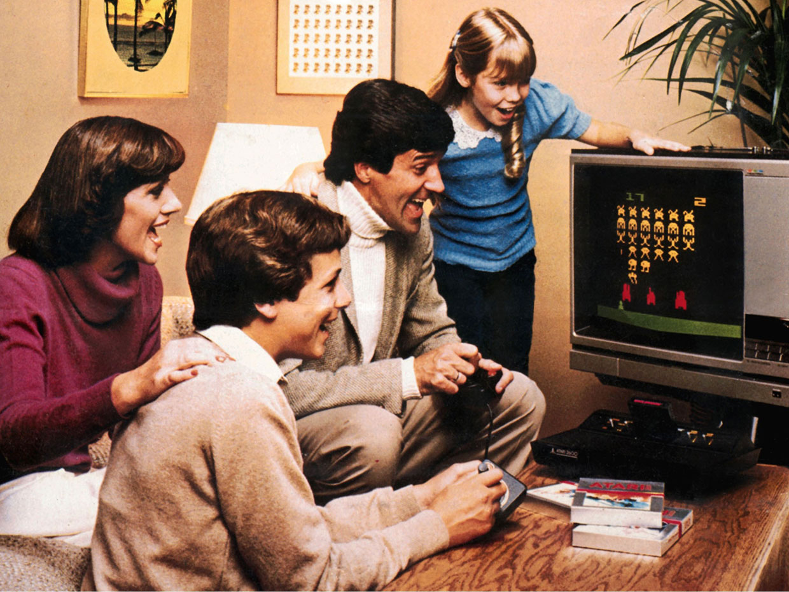
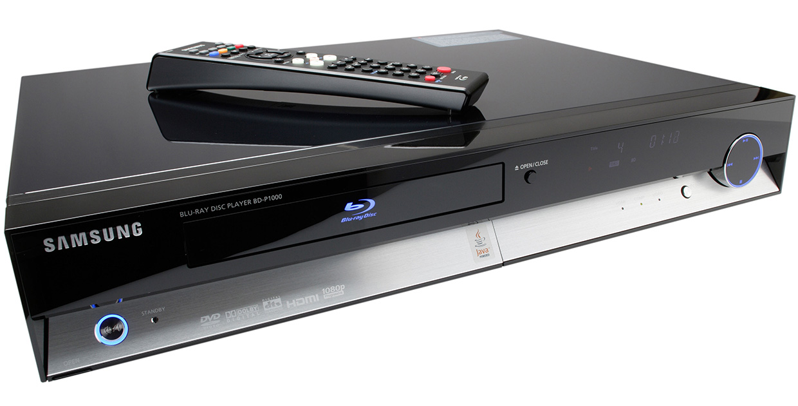
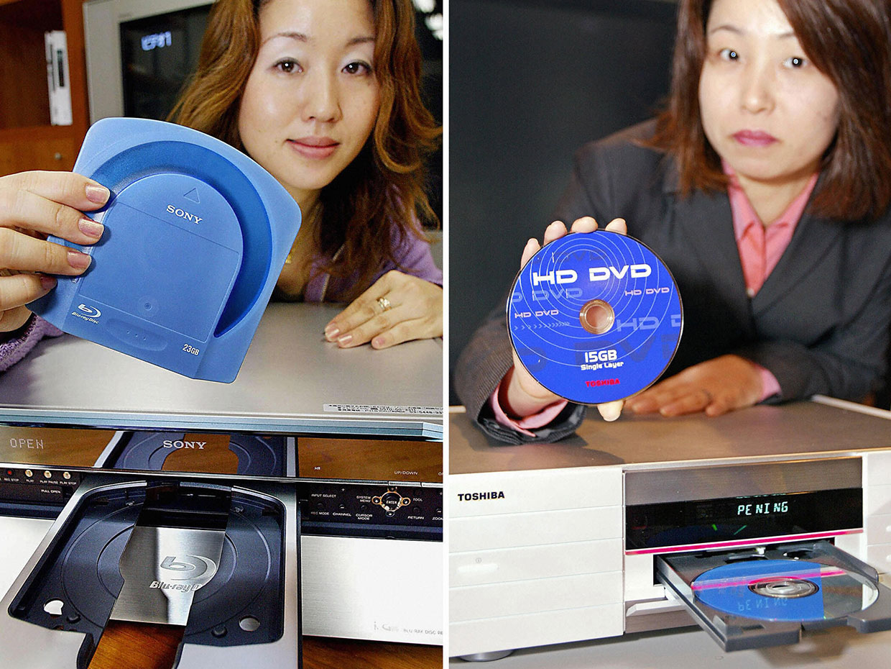
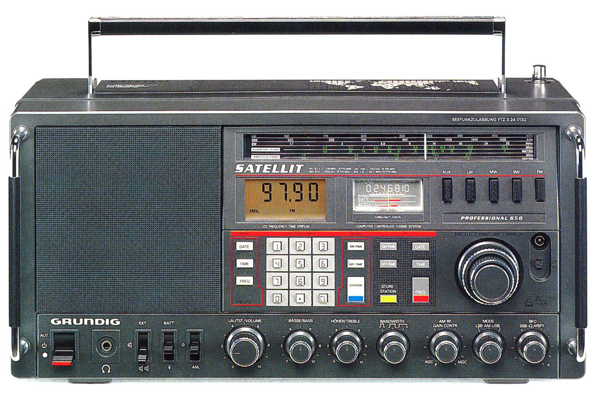
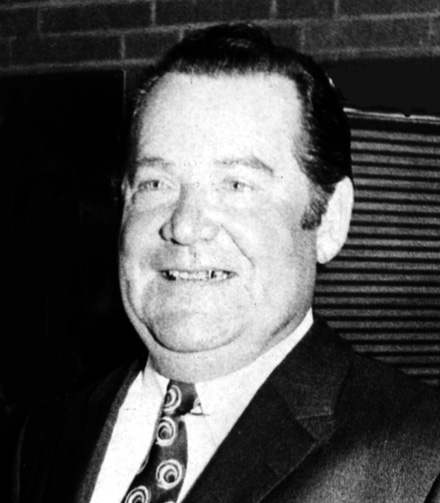
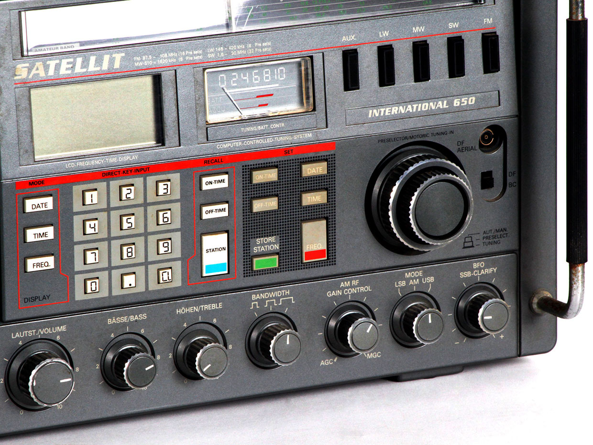

Зал славы потребительской электроники: истории лучших гаджетов последних 50 лет, часть 5

[Четвёртая часть](https://habr.com/post/435862/)

## Sony DCR-VX1000

  

### Цифровая видеокамера VX1000 сочетала профессиональные возможности с ценой, доступной для любителей

  
_Фаворит скейтбордистов: Sony DCR-VX1000, вышедшая на рынок в 1995 году, была одной из первых компактных цифровых видеокамер по цене ($3500) достаточно низкой, чтобы её могли себе позволить покупатели._

Представьте, насколько просто и даже скучно снимать цифровое видео высокого разрешения с вашего смартфона – устройства, весящего 150 грамм и умеющего кучу всего другого кроме съёмки. Но не так давно съёмка в цифре подразумевала покупку специального гаджета. А незадолго до этого цифровое видео вообще не мог снимать никто, кроме профессионалов с большим бюджетом.  
  
Одной из главных вех на пути к сегодняшним способным камерам смартфонов была [Sony DCR-VX1000](https://www.sony.net/Fun/design/history/product/1990/dcr-vx1000.html), видеокамера, снимавшая цифровое видео высокого качества по цене, подходящей для потребительского рынка, а именно $3500\. Она появилась в 1995 году и повсеместно была признана чудом портативности и возможностей: «Мои глаза узрели неземную красоту. Будущее домашнего видео прибыло на мой порог несколько недель назад», — [восхищался](https://www.chicagotribune.com/news/ct-xpm-1995-11-17-9511170072-story.html) обозреватель из Chicago Tribune.

Эта камера создана на базе улучшений цифровых камер, начавшемся 20 лет назад. В 1975 году Kodak изобрела первый цифровой фотоаппарат, используя [ПЗС-матрицу](https://ru.wikipedia.org/wiki/%D0%9F%D0%97%D0%A1-%D0%BC%D0%B0%D1%82%D1%80%D0%B8%D1%86%D0%B0) для получения изображений. Другие производители камер вскоре начали экспериментировать со своими ПЗС-камерами. К примеру, Sony использовала ПЗС в [фотоаппарате 1981 года Mavica](http://www.sonyinsider.com/2009/03/11/akio-morita-and-1981s-mavica-electronic-camera/), выдававшей аналоговый сигнал, [сохранявшийся на миниатюрную дискету](https://ru.wikipedia.org/wiki/Sony_Mavica).

Немного погодя японские компании начали доминировать на рынках видеокамер и кассетных видеоплееров. Первые камеры, записывавшие аналоговое видео на кассетную плёнку, появились в 1983 году. И хотя компактные диски для цифровой музыки появились годом ранее, видео оставалось аналоговым ещё десять лет, до тех пор, пока не снизилась стоимость получения цифровых изображений.

Доступные цифровые фотокамеры начали появляться в начале 1990-х. Цифровые видеокамеры также выходили на рынок, но были слишком дорогими для людей, игравшихся с ними не в рамках профессиональной деятельности. Что до широковещания, то Япония стала первым, и несколько лет оставалась единственным серьёзным рынком, экспериментировавшим с цифровым ТВ. В США (совместно с европейскими технологическими партнёрами) испытания передачи цифрового сигнала телевидения высокого разрешения по воздуху начались только в 1996 году.

Примерно тогда несколько японских производителей скооперировались для создания стандарта цифрового видео [DV](https://ru.wikipedia.org/wiki/DV), о котором объявили в 1995 году. В DV входили спецификации для форматирования цифрового видео, технологии сжатия для хранения (аудио оставалось несжатым) и характеристики кассет и плёнки.

Производители практически сразу начали выпускать DV-продукты. Sony DCR-VX1000 не была первым продуктом из их новой DV-линейки, но вскоре стала лучшим, отлично сочетая прекрасное качество видео и цену для «профессиональных любителей» – профессионал посчитал бы такую стоимость незначительной, а некоторые любители – доступной роскошью. Это был рост по цене и производительности по сравнению с линейкой Handycam, аналоговых видеокамер, ориентированных на широкого потребителя, стоивших порядка $1000. (В 1999 Sony представит свою первую цифровую Handycam, Digital8). А VX1000 была куда как доступнее аналоговой камеры Betacam, предназначенной для профессионалов и продававшейся по цене не менее $10 000.

VX1000 была первой цифровой видеокамерой, содержавшей три ПВЗ-матрицы. В то время другие видеокамеры оснащались одной ПВЗ, хотя конфигурация из трёх вскоре стала распространённой. В VX1000 была призма, расщеплявшая свет на красный, зелёный и синий. Каждая ПВЗ собирала свой цвет, а потом они комбинировались в одно полноцветное изображение. Эта схема давала камере необычную чёткость и насыщенность цветов.

Каждая ПВЗ записывала по 410 000 пикселей и выдавала изображение из 500 горизонтальных линий, сравнимое с тогдашним стандартным ТВ, у которого было 480 или 576 горизонтальных линий (NTSC в Северной Америке и PAL на других рынках). Цифровое видео от VX1000 хранилось на плёночных кассетах, а камера весила чуть меньше 1,5 кг.

VX1000 была первой камерой, использовавшей интерфейс IEEE 1394. Apple, ведшая разработку технологии, называла его FireWire; Sony назвала свой вариант i-Link. Этот интерфейс сделал VX1000 первой видеокамерой, позволявшей скачивать цифровую копию видео напрямую в компьютер. Эта возможность привлекла внимание растущего количества профессиональных видеооператоров, включая новостных. В то время студии редактирования видеозаписей могли стоить десятки тысяч долларов. А с помощью VX1000 видео можно было снять на относительно недорогую камеру и редактировать на ПК.

Sony дала камере надёжный корпус и сделала рукоятку так, чтобы её удобно было держать одной рукой. Система стабилизации изображений Super SteadyShot компенсировала дрожь и вибрацию при помощи датчиков движения, управлявших механизмом, физически сдвигавшим призмы или сенсоры. А ещё у неё была возможность позабавиться и поменять стандартные линзы на «рыбий глаз».

Последнее особенно поспособствовало тому, что VX1000 стала популярной среди скейтбордеров. Частой тенденцией популяризации того или иного гаджета является его принятие одной из субкультур – ранние хип-хоп диджеи любили вертушку Technics, сёрферы – GoPro, любители-видеооператоры – дрон DJI Phantom, и так далее.

По сей день некоторые скейтбордеры предпочитают VX1000 (или её потомков) по техническим и ностальгическим причинам. И они до сих пор тяготеют к использованию линз «рыбий глаз», по причинам, понять которые до сих пор невозможно.

## Пейджер Motorola Advisor

  

### Это был первый продукт, позволявший вам связаться с врачом, когда он был вам просто необходим

  
_Надпись: не торопитесь, рейс отменили, следующий рейс №687 будет в 17:25_

Хороший совет: Motorola Advisor, вышедший в 1990-м, был одним из первых пейджеров, способных выводить алфавитно-цифровой текст

В начале 90-х, когда [пейджеры](https://ru.wikipedia.org/wiki/%D0%9F%D0%B5%D0%B9%D0%B4%D0%B6%D0%B5%D1%80) были на пике популярности, лучшим из них был Motorola Advisor.

Первые пейджинговые системы появились в 1950-х, но распространение пейджеры получили только в 1980-х, когда беспроводные технологии улучшились достаточно для того, чтобы упростить их использование. И в то время Motorola была практически синонимом беспроводных коммуникаций.

Самые первые пейджеры были гораздо меньше, легче и более портативными, чем сотовые телефоны тех времён, которые не зря называли кирпичами. Типичный пользователь пейджера носил это устройство на бедре, и работал в области медицины, скорой помощи или в других профессиях, где нужно быстрое реагирование.

У первых пейджеров практически не было экранов, что означало, что для ответа на вызов требовалось сделать два звонка. После того, как пейджер прожужжал или пропищал, пользователю необходимо было найти телефон, естественно, стационарный. Им надо было позвонить в пейджинговую компанию, узнать оставленный вызывающим телефонный номер, а потом позвонить уже ему.

Чтобы избежать данной проблемы, производители пробовали разные подходы. Некоторые делали модели, позволявшие звонившим оставлять голосовые сообщения, хранящиеся на пейджере с возможностью воспроизведения. Другие встраивали в пейджеры небольшие экраны, где демонстрировался телефон или цифровой код. Люди составляли список кодов, и раздавали им звонящим и другим пользователям пейджеров. К примеру, 41 могло означать «перезвони», а 53 – «спасибо», и так далее.

К началу 1990-х [примерно 3 млн человек](https://www.encyclopedia.com/science-and-technology/technology/technology-terms-and-concepts/beeper) \[в США\] пользовалось пейджерами. Многим из новых пользователей пейджер не был необходим, им просто хотелось его купить – к примеру, директорам компаний. К 1993 году в [инструкции](https://www.manualslib.com/manual/106790/Motorola-A03dxs5862aa.html) к модели Advisor II было упомянуто, что она «идеально подходит для требовательных бизнес-окружений».

Первый Advisor, вышедший в 1990-м, стал одним из первых пейджеров, поддерживавших алфавитно-цифровые сообщения – до четырёх строк текста, до 20 символов в строке. Его можно было настроить на приём не только индивидуальных вызовов, но и до трёх групповых. А ещё он мог работать будильником. Он был компактным, 18,5х55х81 мм, и работал от одной батарейки АА.

Алфавитно-цифровые сообщения раскрывали весь потенциал пейджера. В сообщение из 80 символов часто можно было уместить достаточно информации, чтобы перезванивать было не нужно. Оглядываясь назад, можно сказать, что они были предтечей текстовых сообщений, и имели те же преимущества: полезность, удобство и краткость. В середине 1990-х количество людей, использовавших эти устройства, взлетело до небес, и оценки разнились от 25 [до 61 млн](http://fortune.com/2013/07/16/where-pagers-havent-gone-extinct-yet/) пользователей.

Motorola выпустила две модели Advisor, способные получать сообщения на различных комбинациях частот из диапазонов UHF, VHF и 900 МГц (частоту можно было выбирать). Они предлагали потрясающие для того времени скорости в 1600, 3200 или 6400 бод. Односторонний протокол передачи назывался Flex; его придумали в Motorola и использовали в основном для пейджеров (более поздняя версия, ReFlex, была двусторонней). В инструкции к Advisor был приведён полезный совет: «Указывайте номер своего пейджера на визитках и в сообщении автоответчика». Ого. Помните такие штуки, как автоответчики?

Через несколько лет смартфоны и текстовые сообщения начали вытеснять пейджеры. Тем не менее, пейджинг существует до сих пор. И по сей день их используют некоторые доктора, поскольку их сообщения лучше защищены, а каналы передачи данных более надёжны.

## Atari 2600

  

### Эта машина, наконец, дала нам возможность играть в Space Invaders дома

### Шестизарядник: самые первые игровые системы Atari 2600 продавались под именем «компьютерной видеосистемы», Video Computer System (VCS). Появившись в 1977 году, они были известны, как «шестёрки», из-за шести переключателей в верхней части приставки.

Влияние игровой приставки Atari 2600 сложно оценить количественно, хотя неплохой стартовой точкой может стать число $116 млрд. Агенство Рейтер в 2018 году именно так [оценило](https://www.reuters.com/sponsored/article/popularity-of-gaming) выручку игровой индустрии за 2017 год. Это выводит игровую индустрию вперёд телевизионной, заработавшей $105 млрд. При этом телевидение постепенно исчезает, а игры растут.

Компания [Atari](https://www.atari.com/), основанная в 1972-м, стала одной из первых и элитарных игровых компаний. Её основатели, [Нолан Бушнел](http://nolanbushnell.com/) и [Тэд Дабни](https://variety.com/2018/gaming/news/ted-dabney-atari-obit-1202824152/), вместе с коллегой-инженером [Элом Элкорном](https://www.retrogamer.net/profiles/developer/allan-alcorn/), изобрели Pong, первую успешную аркадную игру. Проведя в этом бизнесе несколько лет, они лучше других поняли его критические ограничения: для каждой игры требовалось придумать и создать свою отдельную электронику. Если бы Atari продолжала идти этим путём, разработка железа стала бы разорительно дорогой. Кроме того, этот подход был совершенно непрактичным для домашнего рынка – следующей цели Atari.

Требовалось железо широкого профиля. А тем временем индустрия полупроводников незадолго до этого начала производить микропроцессор – счётное устройство широкого профиля, как раз подходящее для этой задачи. Однако микропроцессоры пока ещё были слишком дорогими.

Случилось так, что в 1975 году цены на процессоры начали быстро падать. Компания MOS Technology только что представила 8-битный процессор, [6502](https://spectrum.ieee.org/tech-history/silicon-revolution/chip-hall-of-fame-mos-technology-6502-microprocessor), куда как более дешёвый по сравнению с конкурентами от более известных компаний. В следующем году Zilog представит похожий и недорогой процессор [Z80](https://spectrum.ieee.org/tech-history/silicon-revolution/chip-hall-of-fame-zilog-z80-microprocessor). Atari связалась с MOS Technology и попросила изготовить меньшую версию их чипа. MOS отреагировала на просьбу, создав [6507](https://dfarq.homeip.net/atari-2600-cpu/), который по сути представлял собой 6502 в меньшем корпусе (28 контактов вместо 40). Ограничение ввода/вывода привело к небольшим ограничениям по быстродействию, но для реализации идей Atari на краткосрочном периоде это было несущественно.

Вывод тоже надо было стандартизировать. У аркадных игр использовался встроенный дисплей, а у домашней консоли было преимущество в том, что дисплей можно было найти в любом доме – это был экран телевизора. Atari разработала схемы для вывода видео и звука на телевизор, и назвала полученную интегральную схему «адаптером телевизионного интерфейса» \[Television Interface Adaptor\].

Среди других основных компонентов были картридж памяти и игровой контроллер. Картриджами были модули ROM (память только для чтения), хранившие игровые инструкции, которые выполнял процессор и связанные с этим части схемы. Модули можно было легко менять – каждый новый модуль содержал свою игру. Это была не первая игровая консоль с подключаемыми программными модулями, но она первой хорошо продавалась.

  
  
_Развлечение для всей семьи: Atari 2600 была основана на коммерческом микропроцессоре и проигрывала игры, хранящиеся на картриджах – две этих особенности вскоре стали общепринятыми. Система была разработана для подключения к обычному телевизору._

Стоит отметить, что успех модульного подхода вдохновил появление целой индустрии. Несколько бывших инженеров из Atari основали [Activision](https://www.activision.com/), считающуюся первым сторонним разработчиком игр. Atari рассматривала стороннюю разработку как угрозу для себя, но в итоге договорилась на получение роялти от разработчиков.

[Первыми игровыми контроллерами](https://www.shortlist.com/tech/gaming/history-of-the-video-game-controller/3231) были джойстики и вращающиеся регуляторы. Затем последовали трэкболы, [колёса](https://ru.wikipedia.org/wiki/%D0%9A%D0%BE%D0%BB%D0%B5%D1%81%D0%BE_(%D0%B8%D0%B3%D1%80%D0%BE%D0%B2%D0%BE%D0%B9_%D0%BC%D0%B0%D0%BD%D0%B8%D0%BF%D1%83%D0%BB%D1%8F%D1%82%D0%BE%D1%80)) и клавиатуры.

Первые пару лет после появления в 1977 году, Atari 2600 продавалась неплохо. Но настоящий взлёт произошёл в 1980-м, когда компания начала рекламировать лицензированную версию Space Invaders. Затем она закрепила успех, выпустив в следующем году две собственных игры, Asteroids и Missile Command.

Однако, компания сама навредила себе, выпуская игры плохого качества, к примеру, игру, связанную с фильмом «Инопланетянин», которую компания усиленно продвигала. Компания уже начала сдавать, когда в 1983 году рухнул рынок игр. Это произошло из-за комбинации нескольких причин, включая насыщение рынка и конкуренцию, составляемую персональными компьютерами, устройствами ещё более широкого спектра применения. Atari продавали и перепродавали. Но линейка 2600 выжила. Последнюю 2600 выпустили в 1992 году.

Сегодня инновации, представленные в 2600, могут показаться банальными, но это лишь подчёркивает их важность. Принципы, на которых она была создана, и которые помогла сделать популярными – железо общего назначения и отдельный софт – держатся уже более 40 лет.

## Samsung BD-P1000

  

### Первый коммерческий проигрыватель Blu-ray получил смешанные оценки критиков, но выиграл потенциально разрушительную войну форматов

  
_Samsung BD-P1000 нельзя было назвать прекрасным проигрывателем. Но он делал это надёжно, появившись в июне 2006 года – достаточно рано, чтобы конкурировать с Toshiba и закончить дорогую затянувшуюся войну форматов_

Samsung BD-P1000, вышедший в 2006, был чем-то вроде поднятого на поле брани флага из области потребительской электроники – это была точка сборки для союзников и потенциальных союзников.

Как и любая великая битва, эта началась после долгих манёвров, которым предшествовало медленное кипение политической напряжённости. Чтобы разобраться в этом, начнём с первого потребительского оптического носителя — компакт-диска, который создали для хранения аудио, а не видео. CD-плееры были красными лазерами с длиной волны порядка 780 нм (технически говоря, инфракрасными), распознававшими выемки (или их отсутствие) на поверхности CD. Эти данные превращались в цифровые нули и единицы. Лазерный луч с меньшей длиной волны, естественно, смог бы распознавать выемки меньшего размера, а чем меньше выемка, тем больше их можно уместить на заданной площади. Используем голубой лазер, и вуаля – сохраняем больше данных.

Учитывайте это, наблюдая за увеличением разрешения цифрового видео, шедшего годами. Увеличение разрешения периодически создаёт спрос на новые технологии, способные хранить больше данных в более компактном формате. К началу века преобладающим носителем цифрового видео был DVD, и он уже достиг пределов ёмкости, 4.7 Гб на однослойном диске. DVD не подходили для хранения видео высокого разрешения (HD), которое вскоре должны были потребовать владельцы новых HDTV телевизоров, число которых неуклонно росло.

К 2002 году полупроводниковые лазеры, испускающие синий свет (с длиной волны 405 нм технически это был фиолетовый свет), только появлялись, и индустрия начала готовиться к их использованию с более ёмким форматом оптического диска (который ещё предстояло разработать), способного хранить HD-видео. В тот год компании Samsung, Sony, Panasonic, Pioneer, Philips, Thomson, LG Electronics, Hitachi и Sharp, а также Массачусетский технологический институт объединились, сформировав ассоциацию Blu-ray, для разработки стандарта дисков, читаемых при помощи синего лазера, и соответствующих проигрывателей.

А Toshiba работала над другим предложением, High Definition Digital Versatile Disc (HD-DVD), которое в итоге получит поддержку компаний Microsoft и Intel.

Blu-ray и HD-DVD были во многом схожи, но несовместимы. Ещё в 2005 году предпринимались попытки избежать дорогой войны форматов, которые неизбежно замедлили бы развитие рынка HD-фильмов и систем воспроизведения. Но обе стороны отказались сдаваться.

  
_Война дисков: в 2007 году шла война форматов оптических дисков между теми, кто поддерживал Blu-ray, например, Sony (слева), и теми, кто поддерживал HD-DVD, включая Toshiba (справа). Война закончилась через год, когда сдалась Toshiba._

В марте 2006 Toshiba первой вышла на рынок с плеером HD-DVD, выпущенным в Японии и продававшимся по $900. В следующем месяце Toshiba вышла на рынок США с парой систем, по $799 и $499. К концу года Microsoft представила проигрыватель HD-DVD, [работающий](https://spectrum.ieee.org/consumer-electronics/gadgets/the-consumer-electronics-hall-of-fame-microsoft-xbox) вместе с её игровой консолью Xbox.

Sony уже сделала прототипы проигрывателей Blu-ray, но в июне 2006 года первой на рынок их вывела Samsung (компании пришлось отодвинуть выход, назначенный сначала на май, на целый месяц). Сначала BD-P1000 продавался по $1000, но вскоре Samsung снизила цену, чтобы успешно конкурировать с Toshiba.

Проигрыватель от Samsung получил прохладные отзывы. Он надёжно проигрывал диски Blu-ray, но не обладал дополнительными удобствами, вроде нескольких входных разъёмов для внешних источников звука или поддержки звука 7.1 (стандарт Blu-ray поддерживал до восьми каналов аудио).

Плюсом была способность плеера улучшать качество DVD на лету – эту возможность добавили на последних этапах разработки, из-за чего, как говорят, и вышла задержка с выходом на рынок. Эта технология использовалась с ранними DVD стандартного разрешения, чтобы они лучше смотрелись на телевизорах высокого разрешения, которые тогда начали появляться. Ранние DVD появлялись, когда ещё существовали ЭЛТ-телевизоры с чересстрочной развёрткой. В такой системе для демонстрации полной картинки на экране необходимы два горизонтальных скана; один добавляет нечётные линии, другой – чётные. Но новомодные HDTV были разработаны для прогрессивной развёртки, в которой вся картинка сканировалась снова и снова, выдавая движущиеся изображения. Суффиксы i и p в разрешениях HDTV, например, 1080i или 1080p, как раз говорят о том, проводится ли измерение для чересстрочной развёртки (interlaced) или прогрессивной (progressive).

Коротко говоря, улучшение картинки превращало чересстрочное видео относительно низкого разрешения, хранящееся на DVD, в видео высокого разрешения для прогрессивной развёртки, использовавшейся на HDTV. Оно могло улучшить чересстрочное видео стандартного разрешения – конечно, не до качества HD, но всё равно результат был гораздо лучше, чем без этой техники. Для модели BD-P1000, Samsung купила эту технологию у Faroudja Laboratories.

Но давайте забудем всё это. Целью BD-P1000 были не технологические достижения. Целью было получить готовую систему Blu-ray, способную не отставать от Toshiba и сторонников HD-DVD, чтобы они не смогли завладеть рынком. И с этой точки зрения BD-P1000 стала триумфом, помогшим закончить очередную войну форматов в области электроники, казавшуюся бесконечной.

Приверженцы HD-DVD и Blu-ray воевали почти два года, но кумулятивная маркетинговая мощь партнёров по Blu-ray в итоге оказалась решающей. К 2007 году диски Blu-ray уверенно опережали HD-DVD по продажам. Киностудии, озабоченные пиратством, одна за другой решили, что предпочитают защиту от копирования, имевшуюся на Blu-ray. Затем они начали отказывать производителям HD-DVD в правах на издание их фильмов. Компании по прокату дисков (уже стремившиеся к закату, но в то время всё ещё бывшие важными участниками экосистемы кино) одна за другой объявляли об отказе от HD-DVD. В 2008 году Toshiba сдалась и началось царствование Blu-ray.

## Радиоприёмник Grundig Satellit 650

  

### Рынок дорогих коротковолновых радиоприёмников исчез в начале 2000-х. Но перед этим Grundig успела создать свой ореол славы

  
_Уважаемый радиоприёмник: Grundig Satellit 650 появился в 1986, весил почти 9 кг, и читался одним из лучших коротковолновых радиоприёмников из всех, когда-либо созданных_

Энтузиасты дальнего радиоприёма ([DXing, диэксинга](https://ru.wikipedia.org/wiki/DXing)) часто являются романтиками, хотя они, вероятно, будут это отрицать. Диэксерам шанс принять сигнал из какой-то удалённой и загадочной точки вроде австралийских пустошей, пустыни Намиб или одинокого Шетландского острова кажется овеянным особым очарованием. Поэтому, если им понравится какое-то оборудование, они не просто будут относиться к нему с приязнью, они будут ему [поклоняться](https://www.eham.net/reviews/detail/526). И одним из приёмников, заслужившим их неувядающую привязанность больше других, будет Grundig Satellit 650.

История Grundig как производителя начинается с [Макса Грюндига](https://ru.wikipedia.org/wiki/%D0%93%D1%80%D1%83%D0%BD%D0%B4%D0%B8%D0%B3,_%D0%9C%D0%B0%D0%BA%D1%81), начавшего делать и продавать радиоприёмники, частью в виде конструктора для сборки, в Германии вскоре после Второй Мировой войны. К середине 1980-х компания неплохо развернулась в Европе, производят кассетные магнитофоны, телевизоры, стереосистемы высокого класса, диктофоны, видеомагнитофоны, и, конечно же, радиоприёмники. У Grundig были успехи по продаже радиоприёмников в США в 1950-х и 60-х, но с тех пор она ушла с относительно большого рынка. Однако модель Satellit 650 планировалась для возврата к мировой дистрибуции, включая и США, если верить книге «Listening on the Short Waves, 1945 to Today» за авторством Джерома Берга (2008). В разных источниках указываются разные розничные цены для США, они варьируются от $900 до $1000.

  
_Предприниматель от электроники: Макс Грюндиг в 1970 году. Он начал с магазина радиотехники в 1930-х, и вырастил компанию до международного электронного конгломерата, продав её Philips в 1984._

Главным смыслом существования Grundig Satellit 650 был приём коротких волн (от 1,6 до 30 МГц), но он способен был работать в диапазоне AM (от 510 до 1620 КГц, который раньше называли «средними волнами»), и в спектре ниже, который раньше называли «длинными волнами» (от 148 до 420 КГц), а также с FM. Радио давало возможность запрограммировать до 60 частот, 32 из которых были зарезервированы для коротких волн. По качеству сборки приёмник был похож на танк и выдавал прекрасный звук.

Качество начиналось с системы настройки. Модель была оборудована преселектором, полосовым фильтром нижних частот. Преселектор нужен для отфильтровывания частот, соседних с выбранной оператором, что минимизирует интерференцию от других сигналов, идущих по соседним частотам. Такая возможность в то время встречалась в портативных коротковолновых приёмниках редко, если вообще не была уникальной для этой модели.

У Satellit 650 также был мощный усилитель на 15 Вт. Размер единственного динамика был довольно крупным для портативного приёмника, но он был не совсем простым. Компания решила использовать динамик, работающий под давлением, способный выдавать звук, сравнимый со звуком обычных динамиков в два раза большего размера.

Это был один из самых тяжёлых портативных радиоприёмников, он весил 8,5 кг, но его фанаты любили эту тяжесть. С их точки зрения это был редкий триумф потребительской электроники, в котором высокое качество корпуса, управления и дисплея (у приёмника был и аналоговый тюнер и цифровой дисплей) совпадало с качеством электроники.

  
_Что такое частота: у Satellit 650 был двойной дисплей для частот, аналоговый и цифровой, и в то время это была уникальная особенность среди коротковолновых приёмников_

Даже и сегодня в редких случаях появления приёмника в хорошем качестве на eBay его цена может достигать $500. До некоторой степени приверженность этой модели можно объяснить ностальгией, но всё же это радио происходит из эры, в которой конструкция коротковолновых приёмников дошла до своего пика, как пишет Берг. «К середине 1990-х период инноваций в портативных коротковолновых приёмников закончился, — писал он в книге. – Иногда на рынке появлялись новые модели, но это было старое вино в новых бутылках. Постепенно большинство крупных игроков, включая Sony, отошли от своих линеек портативных коротковолновых приёмников».

Grundig держался дольше. Он производил Satellit 650 с 1986 по 1990, или 1991, или даже 1993 (источники разнятся). Затем он выпустил более современную на вид и номинально более продвинутую модель Satellit 700 (радиолюбители на форумах спорят по поводу их технических преимуществ друг перед другом). В 2000 году компания представила Satellit 800, который, как отмечает Берг, был больше похож на 650, чем на 700.

Шло время, и с распространением глобальных сетей магия коротких волн становилась всё менее привлекательной для поколения, выращенного на беспроводных технологиях и интернете, в связи с чем рынок коротковолновых радиоприёмников быстро усыхал. После банкротства в 2003 году, Grundig в 2007-м купил турецкий концерн, сегодня известный, как [Arçelik A.Ş](http://www.arcelikas.com/page/2058/Grundig_Is_Now_In_Turkey_With_Its_All_Products). Название Grundig до сих пор появляется на коротковолновых приёмниках, которые в США и Канаде продаёт Etón Corp. В Европе Grundig процветает как компания, производящая различную потребительскую электронику. Но среди широкой линейки крупной и мелкой кухонной техники, стиральных машин и сушилок, телевизоров, стереосистем, пылесосов и продуктов личной гигиены очевидно отсутствие коротковолновых радиоприёмников.