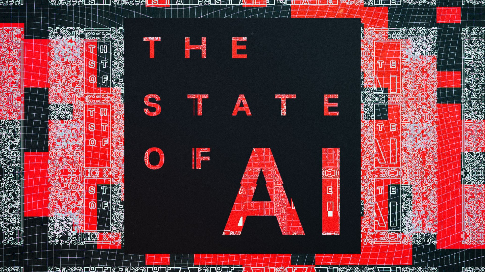
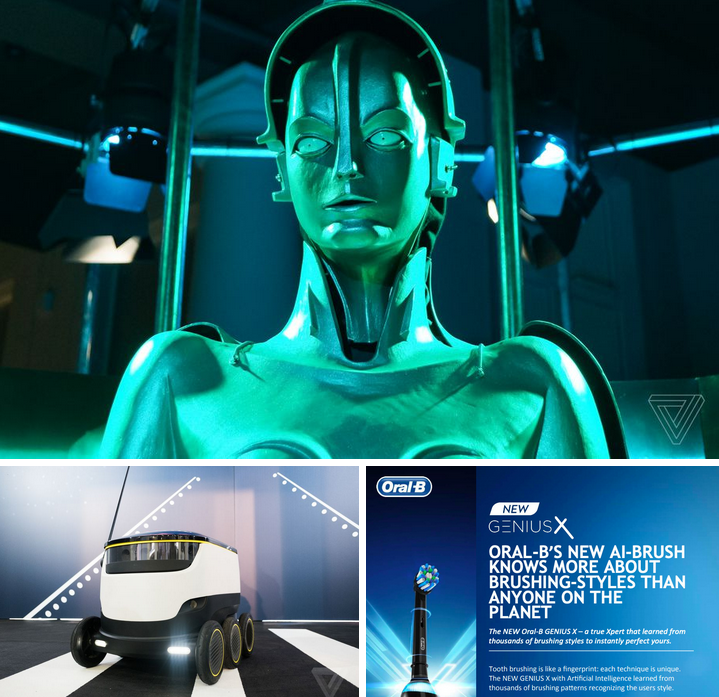

ИИ в 2019 году: текущее положение вещей / Блог компании Madrobots

Этот перевод — часть статьи [The Real-World AI issue](https://www.theverge.com/2019/1/28/18194816/ai-artificial-intelligence-issue).

Общеизвестный факт — если вы станете повторять любое слово много раз, то в итоге оно потеряет всякое значение, превратится в фонетическое ничто. Это причина того, почему для многих из нас термин «искусственный интеллект» уже давно перестал что-то означать. ИИ сейчас практически везде, от вашего ТВ до зубной щеки, но никогда еще этот термин не значил так мало.

Что-то пошло не так.

Несмотря на то, что термин «искусственный интеллект», вне всякого сомнения, применяется неверно, технология, связанная с ним, все же развиваются очень активно — и это одновременно хорошо и плохо. Технология проникает в [здравоохранение](https://www.theverge.com/2018/8/13/17670156/deepmind-ai-eye-disease-doctor-moorfields) и [военное дело](https://www.theverge.com/2018/4/12/17229150/pentagon-project-maven-ai-google-war-military), она помогает людям сочинять [музыку](https://www.theverge.com/2018/8/31/17777008/artificial-intelligence-taryn-southern-amper-music) и писать [книги](https://www.nytimes.com/2018/10/18/technology/ai-is-beginning-to-assist-novelists.html), она проверяет ваше [резюме](https://www.cnbc.com/2018/03/13/ai-job-recruiting-tools-offered-by-hirevue-mya-other-start-ups.html) и судит о вашей [кредитоспособности](https://qz.com/1276781/algorithms-are-making-the-same-mistakes-assessing-credit-scores-that-humans-did-a-century-ago/), а также улучшает фотографии, сделанные на мобильный телефон. Если кратко, то технология изменяет вашу жизнь, хотите вы этого или нет.  
  
В то же время достаточно сложно понять, что за ИИ обсуждается технологическими компаниями и маркетологами. Возьмем, к примеру, зубную щетку Oral-B Genius X, которая среди многих прочих устройств с [«добавлением ИИ»](https://oralb.com/en-us/geniusx) была представлена на CES. Если внимательно изучить пресс-релиз компании, становится ясно, что эта щетка просто помогает определить правильную длительность процедуры чистки зубов, обрабатывая именно там, где нужно. Да, в щетке есть несколько «умных» сенсоров, которые и обеспечивают функциональность устройства, но называть это искусственным интеллектом просто глупо.

Даже в том случае, когда нет излишней шумихи, есть непонимание сути термина. К примеру, освещение определенного события в прессе сопровождается [иллюстрацией с Терминатором](https://www.theguardian.com/technology/2018/jul/25/ai-artificial-intelligence-social-media-bots-wrong), причем это случается весьма часто. Иногда авторы путаются в том, что собственно такое искусственный интеллект. Все это сложно для того, кто не является экспертом, поэтому большинство людей определяют ИИ как компьютер с сознанием, который во много раз умнее человека. Эксперты же называют такой гипотетический искусственный разум сильной формой ИИ, но его создание — дело далекого будущего. Пока же не стоит преувеличивать.

  
_Что же такое ИИ? По часовой стрелке, начиная сверху: персонаж из фильма Metropolis, зубная щетка Oral-B, автономный робот-курьер._

Намного лучше называть то, что у нас есть «машинным обучением», а не ИИ. Эта технология оказывает очень сильное влияние на мир (вместе с глубоким обучением). У этих терминов нет ничего мистического, как у «искусственного интеллект» и они гораздо лучше описывают то, что представляет собой технология.

Как работает машинное обучение? За последние несколько лет я прочитал и просмотрел множество объяснений. И одно из наиболее полезных следующее: машинное обучение позволяет компьютерам самостоятельно учиться. Но что это значит? Еще один большой вопрос.

Давайте начнем с проблемы. Скажем, вы хотите создать программу, которая распознает котиков (всегда котики по какой-то причине). Вы можете попробовать реализовать это «дедовским» методом, задавая машине правила вроде «котики пушистые». Но что сделает программа, если вы покажете ей фотографию тигра? Разработка каждого правила вручную — долгий процесс, причем вы должны будете описать все нюансы, какие только могут прийти на ум. Лучше всего дать машине возможность обучаться самой. Так, вы даете ей огромную коллекцию фотографий котиков, а машина уже определяет паттерны, причем самостоятельно. Сначала это примитивный процесс, который затем усложняется.

Собственно, это и так ясно. Фактически, ранее вы, вероятно, уже читали похожие объяснения, и прошу меня простить за это. Но то, что важно — понять, как это работает. Какие могут быть последствия при обучении такой системы?

Главное это то, что вам не требуется программировать ее. Да, конечно, здесь много всего нужно настраивать, оптимизировать, необходимо улучшать эффективность обработки данных и все такое, но вы не говорите машине, что делать. И машина реально работает, выделяя паттерны, которые человек пропускает. Ну а поскольку машина работает лишь с единицами и нулями, есть множество сфер, где можно применить такую технологию, поскольку современный мир полон данных. С молотом машинного обучения в руке, вы сможете справиться с решением многих проблем, которые нужно решить незамедлительно.

Но здесь есть и недостатки, подумайте о них. Если вы не сможете обучить машину, то каким образом вы узнаете, как она принимает решения? Машинные системы не умеют объяснять свой ход решения определенной задачи. Так что вполне может оказаться, что алгоритм действует неверно. У машины нет осознания того, что она делает — то, чего мы ждем от человека. Вы можете сделать лучшую машину по распознаванию фоток котиков в мире, но машина не объяснит вам, что котята не умеют ездить на мотоциклах, или что котика с большой вероятностью назовут Васькой, а не «Мегалорт бессмертный».

Научить компьютер обучаться самостоятельно — это отлично. Но в ИИ системах нет разумности. Это вообще не разум, не органический разум, и играть по правилам людей машины не будут. Вы можете задать вопрос «Насколько умна книга? Что может сделать умного жареный хлеб?».

Так на каком этапе искусственного интеллекта мы находимся? После всех этих лет с передовицами, где говорилось о «скором большом прорыве» эксперты считают, что мы вышли на [плато](https://www.technologyreview.com/s/609611/progress-in-ai-isnt-as-impressive-as-you-might-think/).

Тем не менее, прогрессу это не помеха. Что касается исследований в ИИ сфере, то есть огромное количество возможностей для изучения, сейчас мы находимся лишь на самой вершине алгоритмического айсберга.

Кай-Фу Ли — венчурный капиталист и эксперт по искусственному интеллекту, описывает текущий момент как «возраст реализации» — когда технологии начинают выбираться из лабораторий во внешний мир. Бенедикт Эванс сравнивает машинное обучение с технологией реляционных баз данных — типом корпоративного ПО, которое произвелол революцию в целых отраслях. Но сейчас это обыденность. Скорее всего так произойдет и с машинным обучением — оно будет везде, и никто по этому поводу не будет переживать. Но все это — далекое будущее.

  
