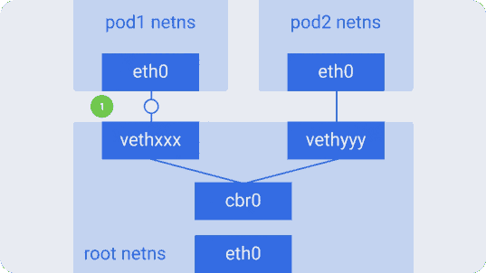
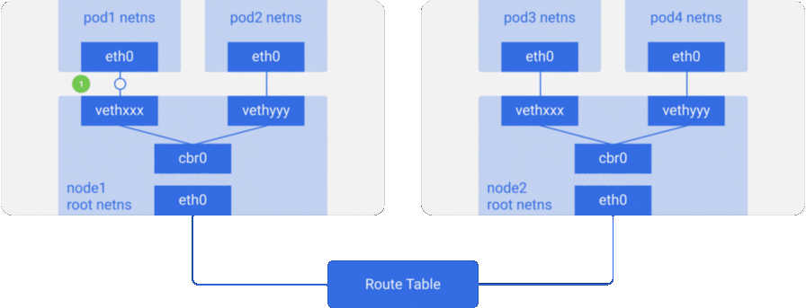
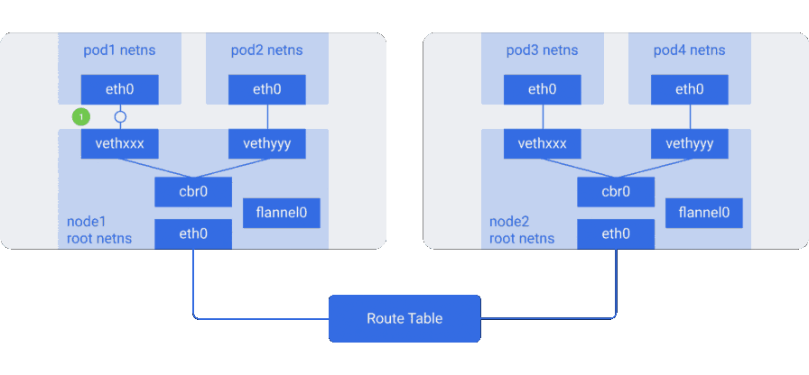
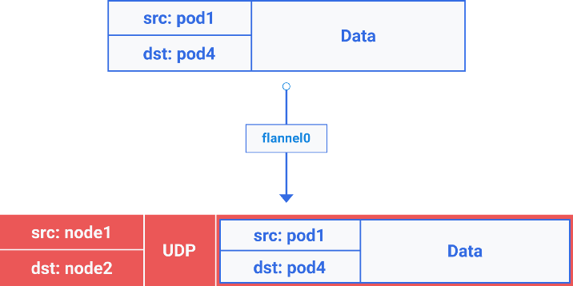

Иллюстрированное руководство по устройству сети в Kubernetes. Части 1 и 2 / Блог компании Флант

_**Прим. перев.**: Автор статьи — Amanpreet Singh — называет себя «всё ещё начинающим в мире сетей», однако именно это и побудило его разобраться в их базовом устройстве в Kubernetes (который он использует в production), а затем — поделиться с сообществом очень доступным материалом с наглядными иллюстрациями. В оригинале он разбит на [две](https://medium.com/@ApsOps/an-illustrated-guide-to-kubernetes-networking-part-1-d1ede3322727) [части](https://medium.com/@ApsOps/an-illustrated-guide-to-kubernetes-networking-part-2-13fdc6c4e24c), однако в этом переводе мы объединили их в одну статью._

Вот вы запустили множество сервисов в кластере Kubernetes и пожинаете плоды… или хотя бы собираетесь это сделать. Однако, даже несмотря на существование ряда утилит для настройки кластера и управления им, вам всё же интересно, как всё работает «под капотом». Куда смотреть, если что-то сломается? По себе знаю, что это важно.

С Kubernetes достаточно просто начинать работу. Но если посмотреть внутрь, там окажется сложная система. В ней множество «подвижных» компонентов, функционирование и взаимодействие которых необходимо понимать, если вы хотите подготовиться к возможным сбоям. Одной из наиболее сложных и, возможно, наиболее критичных составляющих Kubernetes является сеть.

Поэтому я решил разобраться, как именно она работает: прочитал документацию, послушал доклады и даже просмотрел кодовую базу — и вот что я выяснил…

## Сетевая модель Kubernetes

В основе сетевого устройства Kubernetes — важный архитектурный принцип: «**У каждого пода свой уникальный IP**».

IP пода делится между всеми его контейнерами и является доступным (маршрутизируемым) для всех остальных подов. Замечали когда-нибудь на своих узлах работающие pause-контейнеры? Их ещё называют «контейнерами-песочницами» _(sandbox containers)_, потому что их работа заключается в резервировании и удержании сетевого пространства имён _(netns)_, используемого всеми контейнерами пода. Благодаря этому IP пода не меняется даже в тех случаях, когда контейнер умирает и вместо него создаётся новый. Большим достоинством такой модели — IP для каждого пода _(IP-per-pod)_ — является отсутствие коллизий IP/портов на нижележащем хосте. А нам не нужно беспокоиться о том, какие порты используют приложения.

Поэтому единственное требование Kubernetes — все эти IP-адреса подов должны быть доступны/маршрутизируемы из остальных подов вне зависимости от того, на каком узле они расположены.

### Взаимодействие внутри узлов (intra-node)

Первый шаг — удостовериться, что поды одного узла способны общаться между собой. Затем эта идея расширяется до взаимодействия между узлами, с интернетом и т.п.

На каждом узле Kubernetes, которым в данном случае является Linux-машина, существует корневое сетевое пространство имён — _root netns_. Основной сетевой интерфейс — `eth0` — находится в этом root netns:

Аналогичным образом у каждого пода есть свой netns с виртуальным интерфейсом Ethernet, связывающим их с root netns. По сути это виртуальный линк с одним концом в root netns и другим — в netns пода.

Конец на стороне пода назван `eth0`, потому что под не знает о нижележащем хосте и думает, что у него своя корневая сетевая конфигурация. Другой конец назван как-нибудь вроде `vethxxx`. Вы можете увидеть все эти интерфейсы на своём узле Kubernetes, воспользовавшись командой `ifconfig` или `ip a`.

Таково устройство всех подов на узле. Для того, чтобы поды могли общаться друг с другом, используется Ethernet-мост Linux — `cbr0`. Docker использует похожий мост под названием `docker0`.

Вывести список мостов можно командой `brctl show`.

Предположим, пакет отправляется из `pod1` в `pod2`:

1.  Он через `eth0` покидает netns, принадлежащий `pod1`, и попадает в root netns через `vethxxx`.
2.  Попадает в `cbr0`, который выдаёт ему точку назначения с помощью ARP-запроса, спрашивающего: «У кого такой IP-адрес?».
3.  `vethyyy` отвечает, что у него нужный IP — так мост узнаёт, куда переслать пакет.
4.  Пакет достигает `vethyyy` и, проходя виртуальный линк, попадает в netns, принадлежащий `pod2`.

Так контейнеры одного узла общаются между собой. Очевидно, есть и другие способы взаимодействия, но этот, пожалуй, самый простой; его же использует и Docker.

### Взаимодействие между узлами (inter-node)

Как упоминалось выше, поды также должны быть доступны из всех узлов. И для Kubernetes вовсе не принципиально, как это реализовано. Посему можно использовать L2 (ARP между узлами), L3 (IP-маршрутизация между узлами — аналогично таблицам роутинга у облачных провайдеров), оверлейные сети и даже почтовых голубей. Каждому узлу назначается уникальный блок CIDR (диапазон IP-адресов) для IP-адресов, выдаваемых подам, так что у каждого пода свой уникальный IP, не конфликтующий с подами других узлов.

В большинстве случаев, особенно в облачных окружениях, облачный провайдер использует таблицы маршрутизации, чтобы гарантировать, что пакеты доходят до корректных получателей. То же самое можно настроить с помощью маршрутов на каждом узле. Также есть множество других сетевых плагинов, решающих свои задачи.

Рассмотрим пример с двумя узлами, аналогичный тому, что был выше. У каждого узла есть различные сетевые пространства имён, сетевые интерфейсы и мост.

Предположим, пакет следует из `pod1` на `pod4` (на другом узле):

1.  Он через `eth0` покидает netns, принадлежащий `pod1`, и попадает в root netns через `vethxxx`.
2.  Попадает в `cbr0`, который делает ARP-запрос в поисках точки назначения.
3.  Из `cbr0` переходит в основной сетевой интерфейс `eth0`, поскольку ни у кого на этом узле нет IP-адреса, соответствующего `pod4`.
4.  Покидает машину `node1`, оставаясь в сетевом проводе со значениями `src=pod1` и `dst=pod4`.
5.  В таблице маршрутизации настроен роутинг для блоков CIDR каждого узла — согласно ей, пакет отправляет на узел, блок CIDR которого содержит IP-адрес `pod4`.
6.  Пакет прибывает на основной сетевой интерфейс узла `node2` — `eth0`. Теперь, хотя `pod4` и не является IP-адресом `eth0`, пакет перенаправляется на `cbr0`, поскольку на узлах включён IP forwarding. Таблица маршрутизации узла просматривается на наличие маршрутов, соответствующих IP-адресу `pod4`. В ней обнаруживается `cbr0` как точка назначения для блока CIDR этого узла. Посмотреть таблицу маршрутизации узла можно с помощью команды `route -n` — она покажет маршрут для `cbr0` вроде такого:
    
    
    
7.  Мост забирает пакет, делает ARP-запрос и выясняет, что IP принадлежит `vethyyy`.
8.  Пакет проходит через виртуальный линк и попадает в `pod4`.

  

## Оверлейные сети

Оверлейные сети не требуются по умолчанию, однако они полезны в некоторых ситуациях. Например, когда нам не хватает пространства IP-адресов или сеть не может управлять дополнительными маршрутами. Или когда мы хотим получить дополнительные возможности управления, предоставляемые оверлеями. Частый случай — наличие ограничения на количество маршрутов, поддерживаемых в таблицах роутинга облачного провайдера. Например, для таблицы маршрутизации в AWS заявлена поддержка до 50 маршрутов без влияния на производительность сети. Если нам потребуется более 50 узлов Kubernetes, таблицы маршрутизации AWS перестанет хватать. В таких случаях поможет оверлейная сеть.

Оверлейная сеть инкапсулирует пакеты, проходящие по сети между узлами. Возможно, вы не захотите её использовать из-за того, что инкапсуляция-декапсуляция всех пакетов добавляет небольшую задержку и сложность. Зачастую это не нужно, что стоит учитывать, принимая решение об их использовании.

Чтобы понять, как ходит трафик в оверлейной сети, рассмотрим пример с [flannel](http://github.com/coreos/flannel) — Open Source-проектом от CoreOS:

Здесь мы видим конфигурацию, аналогичную предыдущей, однако в ней появилось новое виртуальное Ethernet-устройство под названием `flannel0` — оно находится в корневом пространстве имён (root netns). Это реализация Virtual Extensible LAN (VXLAN), которая для Linux — просто ещё один сетевой интерфейс.

Прохождение пакета из `pod1` в `pod4` (он находится на другом узле) выглядит примерно так:

1.  Пакет через `eth0` покидает netns, принадлежащий `pod1`, и оказывается в root netns на `vethxxx`.
2.  Проходит до `cbr0`, который делает ARP-запрос для обнаружения точки назначения.
3.  *   Поскольку ни у кого на этом узле нет IP-адреса, соответствующего `pod4`, мост отправляет пакет в `flannel0` — таблица маршрутизации узла настроена на использованиее `flannel0` в качестве цели для сетевого диапазона пода.
    *   Демон flanneld взаимодействует с Kubernetes apiserver или нижележащим etcd, откуда получает все IP-адреса подов и сведения о том, на каких узлах они расположены. Таким образом, flannel создаёт соответствующие сопоставления (в пользовательском пространстве) для IP-адресов подов и IP-адресов узлов. `flannel0` берёт пакет и заворачивает его в UDP-пакет с дополнительными заголовками, изменяющими IP-адреса источника и получателя на соответствующие узлы, отправляет его на специальный порт vxlan (обычно 8472):
        
        
        
        Хотя сопоставления находятся в пользовательском пространстве, реальная инкапсуляция и прохождение данных происходит в пространстве ядра, так что это достаточно быстро.
        
    *   Инкапсулированный пакет отправляется через `eth0`, поскольку он отвечает за роутинг трафика узла.
4.  Пакет покидает узел с IP-адресами узлов в качестве источника и назначения.
5.  Таблица роутинга облачного провайдера уже знает, как маршрутизировать трафик между узлами, поэтому пакет отправляется к узлу-получателю — `node2`.
6.  *   Пакет прибывает на `eth0` узла `node2`. Поскольку в качестве порта используется специальный vxlan — ядро отправляет пакет на `flannel0`.
    *   `flannel0` декапсулирует пакет и переносит его обратно в root netns. Пакет покидает узел с IP-адресами узлов в качестве источника и назначения. Дальнейший путь совпадает с тем, что был в случае обычной (неоверлейной) сети.
    *   Поскольку включён IP forwarding, ядро отправляет пакет на `cbr0` согласно таблице маршрутизации.
7.  Мост забирает пакет, делает ARP-запрос и выясняет, что нужный IP-адрес принадлежит `vethyyy`.
8.  Пакет проходит через виртуальный линк и попадает в `pod4`.

У различных реализаций могут быть незначительные отличия, но в целом именно так работают оверлейные сети в Kubernetes. Существует распространенное заблуждение, что их использование в Kubernetes необходимо, однако правда в том, что всё зависит от конкретных случаев. Так что сначала убедитесь, что применяете их только в случае реальной необходимости.

## P.S. от переводчика

Читайте также в нашем блоге:

*   «[Иллюстрированное руководство по устройству сети в Kubernetes. Часть 3](https://habr.com/company/flant/blog/433382/)»;
*   «[За кулисами сети в Kubernetes](https://habr.com/company/flant/blog/420813/)»;
*   «[Сравнение производительности сетевых решений для Kubernetes](https://habrahabr.ru/company/flant/blog/332432/)»;
*   «[Container Networking Interface (CNI) — сетевой интерфейс и стандарт для Linux-контейнеров](https://habrahabr.ru/company/flant/blog/329830/)»;
*   «Что происходит в Kubernetes при запуске kubectl run?»: [часть 1](https://habrahabr.ru/company/flant/blog/342658/) и [часть 2](https://habrahabr.ru/company/flant/blog/342822/);
*   «[Как на самом деле работает планировщик Kubernetes?](https://habrahabr.ru/company/flant/blog/335552/)»;
*   «[Инфраструктура с Kubernetes как доступная услуга](https://habrahabr.ru/company/flant/blog/341760/)».