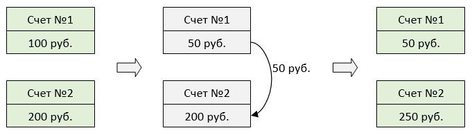
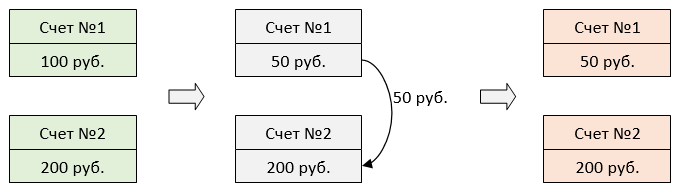
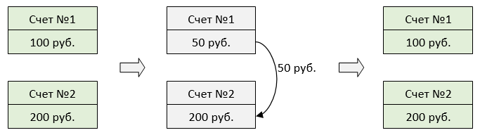
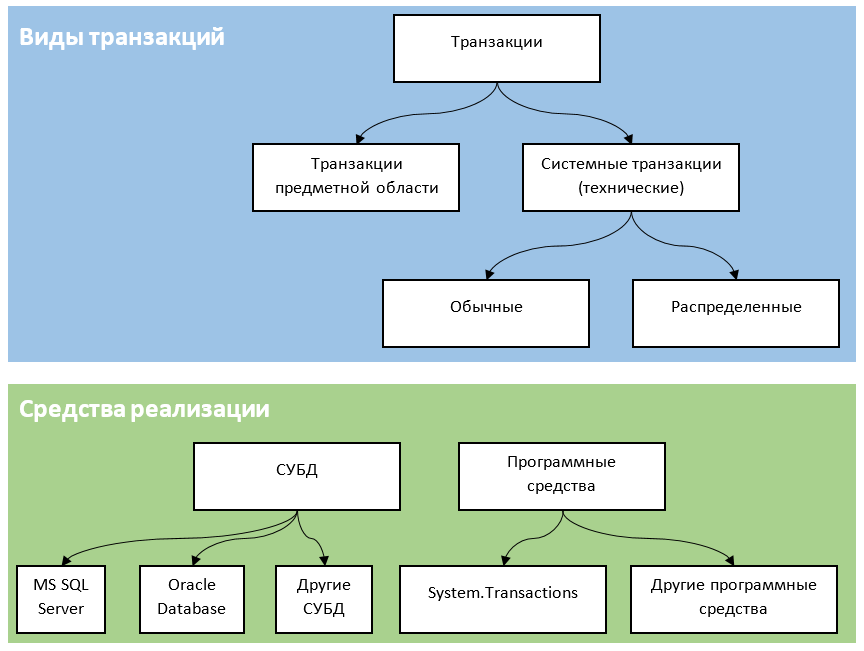
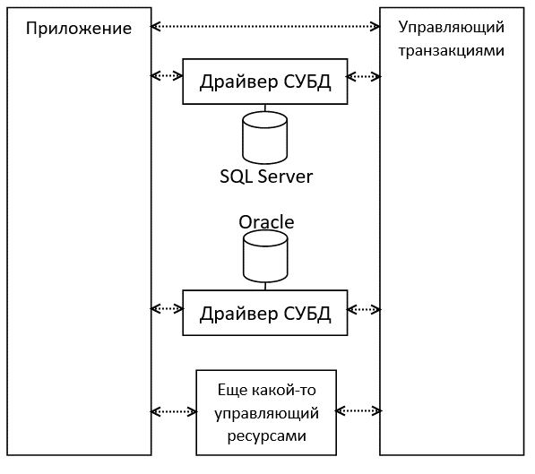
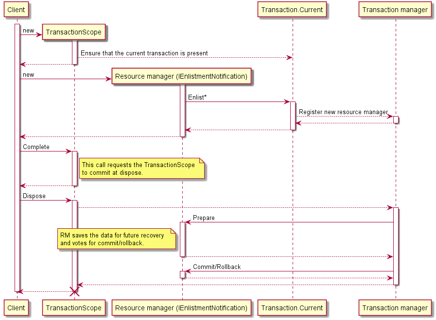
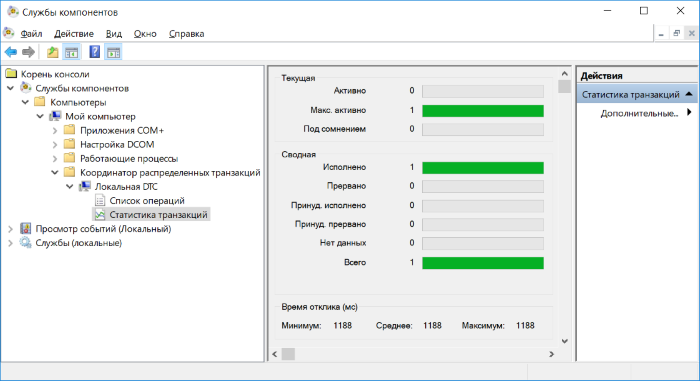
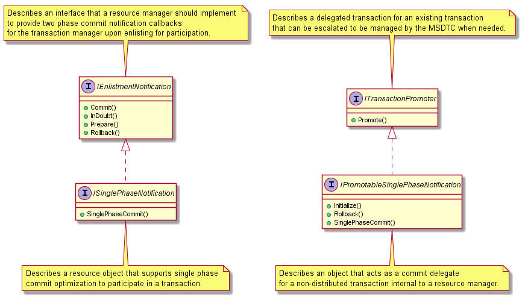
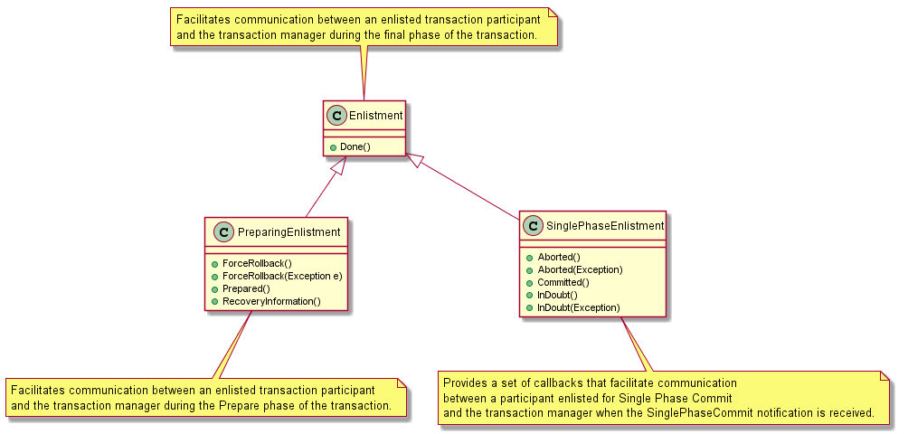

Инфраструктура System.Transactions в мире .NET / Блог компании CUSTIS

Встречали ли вы в C# конструкцию типа `using (var scope = new TransactionScope(TransactionScopeOption.Required))`? Это значит, что код, выполняющийся в блоке `using`, заключается в транзакцию и после выхода из этого блока изменения будут зафиксированы или отменены. Звучит понятно, пока не начинаешь копать глубже. И чем глубже копаешь, тем «страньше и страньше» становится. Во всяком случае, у меня при более близком знакомстве с классом `TransactionScope` и вообще транзакциями .NET возникла целая уйма вопросов.

Что за класс `TransactionScope`? Как только мы используем конструкцию `using (var scope = new TransactionScope())`, все в нашей программе сразу становится транзакционным? Что такое «управляющий ресурсами» (Resource Manager) и «управляющий транзакциями» (Transaction Manager)? Можно ли написать свой управляющий ресурсами и как он «подключается» к созданному экземпляру `TransactionScope`? Что такое распределенная транзакция и правда ли, что распределенная транзакция в SQL Server или Oracle Database — это то же самое, что и распределенная транзакция .NET?

В данной публикации я постарался собрать материал, помогающий найти ответы на указанные вопросы и сформировать понимание транзакций в мире .NET.  

  

## Введение

  

#### Что такое транзакции и какие проблемы они решают

Транзакции, о которых здесь идет речь, — это операции, переводящие систему из одного приемлемого состояния в другое и гарантированно не оставляющие систему в неприемлемом состоянии даже при возникновении непредвиденных ситуаций. Что это за приемлемые состояния, в общем случае зависит от контекста. Здесь мы будем считать приемлемой ситуацию, в которой обрабатываемые нами данные целостны. При этом подразумевается, что изменения, составляющие транзакцию, все вместе либо совершаются, либо не совершаются. Кроме того, изменения одной транзакции могут быть изолированы от изменений, вносимых в систему другой транзакцией. Основные требования, предъявляемые к транзакциям, обозначаются аббревиатурой ACID. Для первого знакомства с ними подойдет [статья в «Википедии»](https://ru.wikipedia.org/wiki/ACID).

Классический пример транзакции — перевод денег между двумя счетами. В этой ситуации снятие денег со счета № 1 без зачисления на счет № 2 неприемлемо, точно так же, как и зачисление на счет № 2 без снятия со счета № 1. Другими словами, мы хотим, чтобы обе операции — и снятие, и зачисление — выполнялись сразу. Если же какую-то из них выполнить не удастся, то и вторая операция выполняться не должна. Можно называть этот принцип «все или ничего». Более того, желательно, чтобы операции выполнялись синхронно даже в случае таких системных сбоев, как отключение электроэнергии, то есть чтобы мы видели систему в приемлемом состоянии, как только она станет доступна после восстановления.

В математических терминах можно сказать, что относительно системы существует инвариант, который мы хотели бы обязательно сохранить. Например, сумма на обоих счетах: нужно, чтобы после транзакции (перевода денег) сумма осталась такой же, как и до нее. Кстати, в классическом примере с переводом денег еще и фигурирует учет — предметная область, где естественным образом возникло понятие транзакции.

Проиллюстрируем пример с переводом денег между двумя счетами. На первой картинке изображена ситуация, когда перевод 50 рублей со счета № 1 на счет № 2 завершился успешно. Зеленый цвет подчеркивает, что система находится в приемлемом состоянии (данные целостны).

Теперь представим, что перевод осуществляется вне транзакции и после снятия денег со счета № 1 произошел сбой, из-за которого снятые деньги не были начислены на счет № 2. Система окажется в неприемлемом состоянии (красный цвет).

Если же ошибка произошла между операциями снятия и зачисления, но перевод осуществлялся в рамках одной транзакции, то операция снятия денег будет отменена. В результате система останется в исходном приемлемом состоянии.

Приведу примеры ситуаций из опыта нашей компании, в которых транзакции бывают полезны: учет товаров (учет количества товаров разных видов, которые находятся в определенных хранилищах и в пути), учет ресурсов хранилищ (учет объема помещения, который занимают товары определенного типа, объема помещения, свободного для размещения товаров, количества товаров, которое могут переместить сотрудники и автоматизированные системы хранилища за день).

Проблемы, возникающие при нарушении целостности данных, очевидны. Информация, предоставляемая системой, не просто становится недостоверной — она теряет связь с действительностью и превращается в бессмыслицу.

#### Какие транзакции здесь рассматриваются

Предоставляемые транзакциями выгоды известны. Так что же, для поддержания целостности данных нам нужна реляционная база данных, поскольку именно там делаются транзакции? Не совсем. Выше было сказано, что понятие транзакции зависит от контекста, и сейчас кратко рассмотрим, о каких транзакциях можно говорить при обсуждении информационных систем.

Для начала разделим понятия транзакций предметной области (бизнес-транзакций) и системных транзакций. Вторые могут быть реализованы в разных местах и разными способами.

Зайдем с самого высокого уровня — предметной области. Интересант может объявить, что существуют некоторые приемлемые состояния и он не желает видеть информационную систему вне этих состояний. Не будем придумывать лишних примеров: перевод денег между счетами здесь подходит. Только уточним, что перевод — это не обязательно перевод денег между расчетными счетами двух клиентов банков. Не менее важна и задача бухгалтерского учета, когда счета должны отражать источники и предназначение средств организации, а перевод — изменение распределения средств по этим источникам и предназначению. Это был пример **транзакции предметной области**.

Теперь посмотрим самые распространенные и интересные примеры реализации системных транзакций. В системных транзакциях разными техническими средствами обеспечиваются требования предметной области. Классическим проверенным решением такого рода являются **транзакции реляционных СУБД** (первый пример). Современные системы управления БД (как реляционными, [так и не очень](https://docs.intersystems.com/latest/csp/docbook/DocBook.UI.Page.cls?KEY=GCOS_tp)) предоставляют механизм транзакций, который позволяет или сохранить (зафиксировать) все сделанные за указанный период работы изменения, или отказаться от них (откатить). При использовании такого механизма операции снятия денег с одного счета и зачисления на другой счет, составляющие транзакцию предметной области, средствами СУБД будут объединены в системную транзакцию и либо выполнятся вместе, либо не выполнятся вовсе.

Пользоваться СУБД, конечно, не обязательно. Грубо говоря, можно вообще реализовать механизм транзакций СУБД на своем любимом языке программирования и наслаждаться неустойчивым и заваленным ошибками аналогом существующих инструментов. Зато ваш «велосипед» может быть оптимизирован для конкретных ситуаций предметной области.

Есть и более интересные варианты. Современные промышленные языки программирования (C# и Java в первую очередь) предлагают средства, предназначенные специально для организации транзакций с участием совершенно разных подсистем, а не только СУБД. В данной публикации будем называть такие транзакции программными. В случае C# это **транзакции из пространства имен System.Transactions** (второй пример), именно о них и рассказывается ниже.

Прежде чем перейти к транзакциям `System.Transactions`, нельзя не упомянуть еще одно интересное явление. Средства `System.Transactions` позволяют программисту самостоятельно реализовать [программную транзакционную память](https://ru.wikipedia.org/wiki/%D0%9F%D1%80%D0%BE%D0%B3%D1%80%D0%B0%D0%BC%D0%BC%D0%BD%D0%B0%D1%8F_%D1%82%D1%80%D0%B0%D0%BD%D0%B7%D0%B0%D0%BA%D1%86%D0%B8%D0%BE%D0%BD%D0%BD%D0%B0%D1%8F_%D0%BF%D0%B0%D0%BC%D1%8F%D1%82%D1%8C). В этом случае программные операции, влияющие на состояние системы (в случае классических императивных языков программирования это операция присваивания), по умолчанию включаются в транзакции, которые можно фиксировать и откатывать почти так же, как и транзакции СУБД. При таком подходе необходимость использовать механизмы синхронизации (в C# — `lock`, в Java — `synchronized`) значительно снижается. Дальнейшим развитием этой идеи является **программная транзакционная память, поддерживаемая на уровне платформы** (третий пример). Такое чудо ожидаемо обнаруживается в языке, изящность которого превосходит его промышленную применимость, — Clojure. А для рабоче-крестьянских языков существуют подключаемые библиотеки, предоставляющие функциональность программной транзакционной памяти.

Системные транзакции могут включать несколько информационных систем, в таком случае они становятся распределенными. Распределенными могут быть и транзакции СУБД, и программные; все зависит от того, какую функциональность поддерживает конкретное средство реализации транзакции. Подробнее распределенные транзакции рассматриваются в соответствующем разделе. Приведу картинку, чтобы было легче разобраться в обсуждаемых предметах.

#### TL;DR по разделу

Существуют процессы, которые состоят из нескольких неделимых (атомарных) операций, применяемых к системе, в общем случае не обязательно информационной. Каждая неделимая операция может оставить систему в неприемлемом состоянии, когда целостность данных нарушается. Например, если перевод денег между двумя счетами представлен двумя неделимыми операциями снятия со счета № 1 и зачисления на счет № 2, то выполнение только одной из этих операций нарушит целостность данных. Деньги или пропадут неизвестно куда, или появятся неизвестно откуда. Транзакция объединяет неделимые операции так, чтобы они выполнялись все вместе (разумеется, последовательно, если это необходимо) или не выполнялись вообще. Можно говорить о транзакциях предметной области и о транзакциях в технических системах, которые обычно реализуют транзакции предметной области.

## Транзакции на основе System.Transactions

  

#### Что это

В мире .NET существует программный каркас, предназначенный создателями платформы для управления транзакциями. С точки зрения программиста, пользующегося транзакциями, этот каркас состоит из типов `TransactionScope`, `TransactionScopeOption`, `TransactionScopeAsyncFlowOption` и `TransactionOptions` пространства имен `System.Transactions`. Если говорить про .NET Standard, то все это доступно начиная с [версии 2.0](https://github.com/dotnet/standard/blob/master/docs/versions/netstandard2.0.md).

Транзакции из пространства имен `System.Transactions` основываются на [стандарте X/Open XA от консорциума The Open Group](http://pubs.opengroup.org/onlinepubs/009680699/toc.pdf). В этом стандарте вводятся многие термины, обсуждаемые далее, и, главное, описываются распределенные транзакции, которым в данной публикации также посвящен специальный раздел. На этом же стандарте основываются реализации программных транзакций и в других платформах, например [в Java](https://ru.wikipedia.org/wiki/Java_Transaction_API).

Типовой сценарий использования транзакций для программиста C# следующий:

    using (var scope = new System.Transactions.TransactionScope(System.Transactions.TransactionScopeOption.Required))
    {
        // Какой-то транзакционный код, например работа с СУБД.
        scope.Complete();
    }

Внутри блока `using` помещается код, выполняющий работу, результаты которой должны быть зафиксированы или отменены все вместе. Классические примеры такой работы — это чтение и запись в БД или отправка и получение сообщений из очереди. Когда управление покинет блок `using`, транзакция будет зафиксирована. Если убрать вызов `Complete`, то транзакция откатится. Довольно просто.

Получается, что во время отката транзакции все операции, сделанные внутри такого блока `using`, будут отменены? И если я присвоил какой-нибудь переменной другое значение, то у этой переменной восстановится старое значение? Когда я впервые увидел подобную конструкцию, то так и подумал. На самом деле, конечно, откатятся не все изменения, а только очень _особенные_. Если бы откатывались вообще все изменения, то это и было бы программной транзакционной памятью, описанной выше. А сейчас посмотрим, что это за особенные изменения, которые могут участвовать в программных транзакциях на основе `System.Transactions`.

#### Управляющие ресурсами

Чтобы нечто поддерживало транзакции на основе `System.Transactions`, нужно, чтобы оно обладало информацией о том, что в данный момент идет транзакционная работа, и чтобы оно регистрировалось в каком-то реестре участников транзакции. Получить информацию о том, идет ли транзакционная работа, можно, проверив статическое свойство `Current` класса `System.Transactions.Transaction`. Вход в блок `using` указанного выше вида как раз устанавливает это свойство, если оно не было установлено раньше. А чтобы зарегистрироваться как участник транзакции, можно использовать методы типа `Transaction.Enlist_Smth_`. Кроме этого, нужно реализовать интерфейс, требуемый данными методами. Управляющий ресурсами (Resource Manager) — это именно такое «нечто», поддерживающее взаимодействие с транзакциями из `System.Transactions` (более конкретное определение дано ниже).

Какие бывают управляющие ресурсами? Если мы работаем из C# с СУБД, например SQL Server или Oracle Database, то обычно пользуемся соответствующими драйверами, а они и являются управляющими ресурсами. В коде они представляются типами `System.Data.SqlClient.SqlConnection` и `Oracle.ManagedDataAccess.Client.OracleConnection`. Еще, [говорят](http://fukyo-it.blogspot.com/2012/02/truly-understanding-net-transactions.html), MSMQ поддерживает транзакции на основе `System.Transactions`. Руководствуясь знаниями и примерами, почерпнутыми из интернета, можно создать и собственный управляющий ресурсами. Простейший пример приведен в следующем разделе.

Кроме управляющих ресурсами, у нас должен быть еще управляющий транзакциями (Transaction Manager), который будет следить за транзакцией и своевременно отдавать распоряжения управляющим ресурсами. В зависимости от того, какие управляющие ресурсами участвуют в транзакции (какие у них характеристики и где они расположены), к работе подключаются разные управляющие транзакциями. При этом выбор подходящей версии происходит автоматически и не требует вмешательства программиста.

Если говорить конкретнее, то управляющий ресурсами — это экземпляр класса, реализующего специальный интерфейс `System.Transactions.IEnlistmentNotification`. Экземпляр класса по указанию клиента регистрируется как участник транзакции, пользуясь статическим свойством `System.Transactions.Transaction.Current`. В дальнейшем управляющий транзакциями по мере необходимости вызывает методы указанного интерфейса.

Ясно, что во время выполнения может изменяться набор управляющих ресурсами, участвующих в транзакции. Например, после входа в блок `using` мы можем сначала сделать что-то в SQL Server, а потом — в Oracle Database. В зависимости от такого набора управляющих ресурсами и определяется используемый управляющий транзакциями. Если быть точнее, то по набору управляющих ресурсами определяется используемый транзакционный протокол, а уже на основе протокола определяется поддерживающий его управляющий транзакциями. Транзакционные протоколы мы рассмотрим [позже](https://habr.com/company/custis/blog/433136/#TransactionProtocols), когда будем говорить о распределенных транзакциях. Механизм автоматического выбора подходящего управляющего транзакциями во время выполнения при изменении участвующих в транзакции управляющих ресурсами называется продвижением транзакции (Transaction Promotion).

#### Виды управляющих ресурсами

Управляющие ресурсами можно разделить на две большие группы: долговечные и непостоянные.

Долговечный управляющий ресурсами (Durable Resource Manager) — управляющий ресурсами, который поддерживает транзакцию даже в случае недоступности информационной системы (например, при перезапуске компьютера). Непостоянный управляющий ресурсами (Volatile Resource Manager) — управляющий ресурсами, который не поддерживает транзакцию в случае недоступности информационной системы. Непостоянный управляющий ресурсами поддерживает транзакции только в оперативной памяти.

Классические долговечные управляющие ресурсами — это СУБД (или драйвер СУБД для программной платформы). Что бы ни произошло — хоть сбой в работе операционной системы, хоть отключение электроэнергии, — СУБД будет гарантировать целостность данных после того, как она снова придет в рабочее состояние. За это, разумеется, приходится платить некоторыми неудобствами, но в данной статье мы их рассматривать не будем. Пример непостоянного управляющего ресурсами — упомянутая выше программная транзакционная память.

#### Использование TransactionScope

При создании объекта типа `TransactionScope` можно указывать некоторые параметры.

Во-первых, есть настройка, сообщающая среде выполнения о том, что нужно:

1) пользоваться уже существующей к этому моменту транзакцией;

2) обязательно создавать новую;

3) наоборот, выполнять код внутри блока `using` вне транзакции.

За все это отвечает перечисление `System.Transactions.TransactionScopeOption`.

Во-вторых, можно задать уровень изоляции транзакции. Это параметр, который позволяет найти компромисс между независимостью изменений и скоростью работы. Самый независимый уровень — сериализуемый — гарантирует, что не существует таких ситуаций, когда изменения, внесенные в рамках одной еще не зафиксированной транзакции, можно увидеть в другой транзакции. Каждый следующий уровень добавляет по одной такой конкретной ситуации, когда одновременно выполняющиеся транзакции могут влиять друг на друга. Настройка уровня изоляции транзакции при создании `TransactionScope` носит рекомендательный характер для управляющих ресурсами. Они могут даже не поддерживать все уровни, представленные в перечислении `System.Transactions.IsolationLevel`.

Типовые сценарии работы c `TransactionScope` и существенные подводные камни (а именно вложенные транзакции) хорошо освещены в [этой статье на «Хабре»](https://habr.com/post/115480/).

#### Применимость программных транзакций

Следует сказать, что почти в любой информационной системе, находящейся в промышленной эксплуатации, запускаются процессы, которые могут привести систему в неприемлемое состояние. Поэтому бывает необходимо контролировать эти процессы, выяснять, является ли текущее состояние системы приемлемым, и, если нет, восстанавливать его. Программные транзакции — готовый инструмент для поддержания системы в приемлемом состоянии.

В каждом конкретном случае конструктивно было бы рассматривать стоимость:

1) интеграции процессов в инфраструктуру программных транзакций (нужно, чтобы эти процессы знали о `TransactionScope` и о многих других вещах);

2) поддержания этой инфраструктуры (например, стоимость аренды оборудования с Windows на борту);

3) обучения сотрудников (так как тема транзакций .NET мало распространена).

Нельзя забывать и о том, что от транзакционного процесса может потребоваться сообщать о своем прогрессе «внешнему миру», например вести журнал действий вне транзакции.

Очевидно, отказ от программных транзакций потребует создания или внедрения какого-то другого средства поддержания целостности данных, которое также будет иметь свою стоимость. В конце концов, возможны случаи, когда нарушения целостности данных так редки, что проще восстанавливать приемлемое состояние системы оперативными вмешательствами, чем поддерживать механизм автоматического восстановления.

#### Пример непостоянного управляющего ресурсами

Сейчас рассмотрим пример простейшего управляющего ресурсами, не поддерживающего восстановление после системного сбоя. У нас будет блок программной транзакционной памяти, хранящий некоторое значение, которое можно читать и перезаписывать. В отсутствие транзакции этот блок ведет себя как обычная переменная, а при наличии транзакции он сохраняет начальное значение, которое может быть восстановлено после отката транзакции. Код такого управляющего ресурсами представлен далее:

    internal sealed class Stm<T> : System.Transactions.IEnlistmentNotification {
        private T _current;
        private T _original;
    
        public T Value {
            get { return _current; }
            set {
                if (!Enlist()) {
                    _original = value;
                }
                _current = value;
            }
        }
    
        public Stm(T value) {
            _current = value;
            _original = value;
        }
    
        private bool Enlist() {
            var currentTx = System.Transactions.Transaction.Current;
            if (currentTx == null)
                return false;
            currentTx.EnlistVolatile(this, System.Transactions.EnlistmentOptions.None);
            return true;
        }
    
        #region IEnlistmentNotification
    
        public void Commit(System.Transactions.Enlistment enlistment) {
            _original = _current;
        }
    
        public void InDoubt(System.Transactions.Enlistment enlistment) { }
    
        public void Prepare(System.Transactions.PreparingEnlistment preparingEnlistment) {
            preparingEnlistment.Prepared();
        }
    
        public void Rollback(System.Transactions.Enlistment enlistment) {
            _current = _original;
        }
    
        #endregion IEnlistmentNotification
    }

Видно, что единственным формальным требованием является реализация интерфейса `System.Transactions.IEnlistmentNotification`. Из интересного стоит отметить методы `Enlist` (не являющиеся частью `System.Transactions.IEnlistmentNotification`) и `Prepare`. Метод `Enlist` как раз проверяет, работает ли данный код в рамках транзакции, и, если да, регистрирует экземпляр своего класса в качестве непостоянного управляющего ресурсами. Метод `Prepare` вызывается управляющим транзакциями перед фиксацией изменений. Наш управляющий ресурсами сигнализирует о своей готовности к фиксации, вызывая метод `System.Transactions.PreparingEnlistment.Prepared`.

Дальше приведен код, показывающий пример использования нашего управляющего ресурсами:

    var stm = new Stm<int>(1);
    using (var scope = new System.Transactions.TransactionScope(System.Transactions.TransactionScopeOption.Required)) {
        stm.Value = 2;
        scope.Complete();
    }

Если сразу после выхода из блока `using` прочитать свойство `stm.Value`, то там ожидаемо будет установленное значение `2`. А если убрать вызов `scope.Complete`, то транзакция откатится и в свойстве `stm.Value` будет значение `1`, заданное до начала транзакции.

Упрощенно последовательность вызовов при работе с транзакциями `System.Transactions` показана на приведенной ниже диаграмме.

Видно, что в данном примере рассмотрены не все возможности, предоставляемые инфраструктурой `System.Transactions`. Более полно мы рассмотрим их после того, как познакомимся с транзакционными протоколами и распределенными транзакциями в следующем разделе.

#### TL;DR по разделу

Программист может использовать класс `TransactionScope` для того, чтобы выполнить некоторый код в рамках имеющейся или новой транзакции. Транзакция фиксируется тогда и только тогда, когда у имеющегося экземпляра класса `TransactionScope` вызывается метод `Dispose`, при том что перед этим у него был вызван метод `Complete`. Программист может указывать, желает ли он непременно начать новую транзакцию, воспользоваться уже имеющейся или, наоборот, выполнить код вне имеющейся транзакции. В транзакции участвуют только управляющие ресурсами — программные компоненты, реализующие определенную функциональность. Управляющие ресурсами могут быть долговечными (восстанавливающимися после сбоя системы) и непостоянными (не восстанавливающимися). СУБД — пример долговечного управляющего ресурсами. Координацией управляющих ресурсами занимается управляющий транзакциями — программный компонент, который выбирается исполняющей средой автоматически, без участия программиста.

Непостоянный управляющий ресурсами — это класс, реализующий интерфейс `System.Transactions.IEnlistmentNotification` и в методе `Prepare` подтверждающий свою готовность к фиксации изменений или, наоборот, сигнализирующий об откате изменений. Когда вызывающая сторона что-то делает с управляющим ресурсами, он проверяет, открыта ли сейчас транзакция, и, если открыта, регистрируется с помощью метода `System.Transactions.Transaction.EnlistVolatile`.

## Распределенные транзакции

  

#### Что это

Распределенная транзакция задействует несколько информационных подсистем (на самом деле не все так просто, ниже об этом рассказано подробнее). Подразумевается, что изменения во всех системах, участвующих в распределенной транзакции, должны или фиксироваться, или откатываться.

Выше были представлены разные средства реализации транзакций: СУБД, инфраструктура `System.Transactions`, встроенная в платформу программная транзакционная память. Этими инструментами могут обеспечиваться и распределенные транзакции. Например, в СУБД Oracle Database изменение (а на самом деле и чтение) данных в нескольких БД в рамках одной транзакции автоматически превращает ее в распределенную. Далее же пойдет речь о программных распределенных транзакциях, которые могут включать разнородные управляющие ресурсами.

#### Транзакционные протоколы

Транзакционный протокол — набор принципов, по которым взаимодействуют участвующие в транзакции приложения. В мире .NET чаще всего встречаются следующие протоколы.

**Lightweight.** Используется не более одного долговечного управляющего ресурсами. Все транзакционные взаимодействия происходят внутри одного домена приложений, либо управляющий ресурсами поддерживает продвижение и однофазную фиксацию (реализует `IPromotableSinglePhaseNotification`).

**OleTx.** Допускается взаимодействие между несколькими доменами-приложениями и несколькими компьютерами. Допускается использование множества долговечных управляющих ресурсами. Все участвующие компьютеры должны находиться под управлением Windows. Используется удаленный вызов процедуры (Remote Procedure Calls, RPCs).

**WS-AT.** Допускается взаимодействие между несколькими доменами-приложениями и несколькими компьютерами. Допускается использование множества долговечных управляющих ресурсами. Участвующие компьютеры могут находиться под управлением различных ОС, не только Windows. Используется протокол передачи гипертекста (Hypertext Transmission Protocol, HTTP).

Выше было отмечено, что действующий транзакционный протокол влияет на выбор управляющего транзакциями, а на выбор протокола влияют характеристики управляющих ресурсов, участвующих в транзакции. Теперь перечислим известные управляющие транзакциями.

**Lightweight Transaction Manager (LTM)**. Представлен в .NET Framework 2.0 и в более поздних версиях. Управляет транзакциями, использующими протокол Lightweight.

**Kernel Transaction Manager (KTM)**. Представлен в Windows Vista и Windows Server 2008. Управляет транзакциями, использующими протокол Lightweight. Может вызывать транзакционную файловую систему (Transactional File System, TxF) и транзакционный реестр (Transactional Registry, TxR) в Windows Vista и Windows 2008.

**Distributed Transaction Coordinator (MSDTC)**. Управляет транзакциями, использующими протоколы OleTx и WS-AT.

Нужно также иметь в виду, что часть управляющих ресурсами не поддерживает все перечисленные протоколы. Например, MSMQ и SQL Server 2000 не поддерживают Lightweight, поэтому транзакции с участием MSMQ или SQL Server 2000 будут управляться MSDTC, даже если они являются единственными участниками. Технически это ограничение возникает от того, что указанные управляющие ресурсами, реализуя, конечно, интерфейс `System.Transactions.IEnlistmentNotification`, не реализуют интерфейс `System.Transactions.IPromotableSinglePhaseNotification`. В нем есть, кроме прочего, метод `Promote`, который исполняющая среда вызывает при необходимости перейти на более «крутой» управляющий транзакциями.

Сейчас должна стать очевидной неоднозначность понятия распределенной транзакции. Например, можно определять распределенную транзакцию как транзакцию, в которой участвует:

1) не менее двух любых управляющих ресурсами;

2) сколько угодно непостоянных управляющих ресурсами и не менее двух долговечных;

3) не менее двух любых управляющих ресурсами, обязательно расположенных на разных компьютерах.

Поэтому лучше всегда уточнять, о каких именно транзакциях идет речь.

И в этом контексте в первую очередь обсуждается MSDTC. Он представляет собой программный компонент Windows, управляющий распределенными транзакциями. Имеется графический интерфейс для конфигурации и наблюдения за транзакциями, который можно обнаружить в утилите «Службы компонентов», пройдя по пути «Компьютеры — Мой компьютер — Координатор распределенных транзакций — Локальная DTC».

Для конфигурации нужно выбрать пункт «Свойства» в контекстном меню узла «Локальная DTC», а для наблюдения за распределенными транзакциями — пункт «Статистика транзакций» в центральной панели.

#### Двухфазная фиксация

Если в транзакции участвует несколько управляющих ресурсами, то результаты их работы могут отличаться: например, у одного из них все завершилось успешно, и он готов фиксировать изменения, а у другого произошла ошибка, и он собирается откатить изменения. Однако суть распределенной транзакции заключается как раз в том, что изменения всех участвующих в транзакции управляющих ресурсов либо фиксируются все вместе, либо откатываются. Поэтому в таких случаях обычно применяется протокол двухфазной фиксации.

В общем суть этого протокола заключается в следующем. Во время **первой фазы** участвующие в транзакции управляющие ресурсами подготавливают информацию, достаточную для восстановления после сбоя (если это долговечный управляющий ресурсами) и для успешного окончания работы в результате фиксации. С технической точки зрения управляющий ресурсами сигнализирует о том, что он закончил первую фазу, вызывая метод `System.Transactions.PreparingEnlistment.Prepared` в методе `Prepare`. Либо управляющий ресурсами может уведомить об откате изменений, вызвав метод `ForceRollback`.

Когда все участвующие в транзакции управляющие ресурсами «проголосовали», то есть уведомили управляющий транзакциями о том, хотят ли они фиксировать или откатывать изменения, начинается **вторая фаза**. В это время управляющие ресурсами получают указание фиксировать свои изменения (если все участники проголосовали за фиксацию) или отказаться от изменений (если хотя бы один участник проголосовал за откат). Технически это выражается в вызове методов `Commit` и `Rollback`, которые реализуют управляющие ресурсами и в которых они вызывают метод `System.Transactions.Enlistment.Done`.

Управляющий ресурсами может вызвать метод `System.Transactions.Enlistment.Done` и во время первой фазы. В таком случае подразумевается, что он не собирается фиксировать никаких изменений (например, работает только на чтение) и не будет участвовать во второй фазе. Подробнее про двухфазную фиксацию можно прочитать [у Microsoft](https://docs.microsoft.com/en-us/dotnet/framework/data/transactions/committing-a-transaction-in-single-phase-and-multi-phase).

Есть еще [трехфазная фиксация](https://en.wikipedia.org/wiki/Three-phase_commit_protocol) и ее модификации со своими достоинствами и недостатками. Протокол трехфазной фиксации менее распространен, возможно, потому, что требует еще больше расходов на сообщения между взаимодействующими подсистемами.

#### Шпаргалка по интерфейсам System.Transactions

Что-то сложно получается. Чтобы немного разложить все по полочкам, я кратко опишу основные интерфейсы пространства имен `System.Transactions`, нужные для создания управляющего ресурсами. Вот диаграмма классов.

**IEnlistmentNotification.** Управляющий ресурсами обязательно реализует этот интерфейс. Управляющий транзакциями вызывает реализованные методы в следующем порядке. Во время первой фазы он вызывает метод `Prepare` (если только не сошлись звезды для вызова метода `ISinglePhaseNotification.SinglePhaseCommit`, о чем написано в следующем пункте). В рамках этого метода управляющий ресурсами сохраняет необходимую для восстановления после сбоя информацию, готовится к окончательной фиксации изменений на своей стороне и голосует за фиксацию или откат изменений. Если наступает вторая фаза, то в зависимости от доступности управляющих ресурсами и от результатов голосования управляющий транзакциями вызывает один из трех методов: `Commit`, `InDoubt`, `Rollback`.

**ISinglePhaseNotification.** Управляющий ресурсами реализует этот интерфейс, если хочет предоставить управляющему транзакциями возможность оптимизировать выполнение за счет редуцирования второй фазы фиксации. Если управляющий транзакциями видит только один управляющий ресурсами, то на первой фазе фиксации он пытается вызвать у управляющего ресурсами метод `SinglePhaseCommit` (вместо `IEnlistmentNotification.Prepare`) и тем самым исключить голосование и переход ко второй фазе. У этого подхода есть достоинства и недостатки, о которых понятнее всего написано у Microsoft [здесь](https://msdn.microsoft.com/en-us/library/cc229955.aspx).

**ITransactionPromoter.** Управляющий ресурсами реализует этот интерфейс (только не напрямую, а через интерфейс `IPromotableSinglePhaseNotification`), если хочет предоставить управляющему транзакциями возможность придерживаться протокола Lightweight даже при удаленном вызове, пока не наступят другие условия, которые потребуют усложнения протокола. Когда потребуется усложнить протокол, будет вызван метод `Promote`.

**IPromotableSinglePhaseNotification.** Управляющий ресурсами реализует этот интерфейс, чтобы, во-первых, реализовать интерфейс `ITransactionPromoter`, а во-вторых, чтобы управляющий транзакциями мог воспользоваться однофазной фиксацией, вызывая методы `IPromotableSinglePhaseNotification.SinglePhaseCommit` и `IPromotableSinglePhaseNotification.Rollback`. Управляющий транзакциями вызывает метод `IPromotableSinglePhaseNotification.Initialize`, чтобы отметить успешную регистрацию управляющего ресурсами по упрощенной схеме. Более-менее это можно понять из [документа Microsoft](https://docs.microsoft.com/en-us/dotnet/framework/data/transactions/optimization-spc-and-promotable-spn).

Еще немного посмотрим на класс `System.Transactions.Enlistment` и его наследников. Экземпляры этого типа предоставляет управляющий транзакциями, когда вызывает методы интерфейсов, реализуемые управляющим ресурсами.

**Enlistment.** Управляющий ресурсами может вызвать единственный метод этого типа — `Done`, — чтобы сигнализировать об успешном выполнении своей части работы.

**PreparingEnlistment.** С помощью экземпляра этого типа во время первой фазы фиксации управляющий ресурсами может сигнализировать о своем намерении зафиксировать или откатить изменения. Долговечный управляющий ресурсами также может получить информацию, требующуюся для восстановления после системного сбоя.

**SinglePhaseEnlistment.** С помощью экземпляра этого типа управляющий ресурсами может передать информацию управляющему транзакциями о результатах своей работы при использовании упрощенной схемы (однофазной фиксации).

#### Ограничения программных распределенных транзакций и альтернативы

Краткое исследование мнений, встречающихся в интернете, показывает, что во многих областях распределенные транзакции выходят из моды. Посмотрите, например, на [этот ехидный комментарий](https://habr.com/company/flant/blog/347518/#comment_10640160). Основной объект критики, о котором вкратце сказано [здесь](https://habr.com/company/nixsolutions/blog/321686/), — это синхронная (блокирующая) природа распределенных транзакций. Если пользователь отправил запрос, во время обработки которого была организована распределенная транзакция, то он получит ответ только после того, как (успешно или с ошибкой) закончат работу все подсистемы, включенные в транзакцию. При этом есть подкрепленное исследованиями мнение, что протокол двухфазной фиксации показывает плохую производительность, особенно с ростом числа вовлеченных в транзакцию подсистем, о чем упоминается, например, в [этой публикации на «Хабре»](https://habr.com/company/avito/blog/426101/).

Если создатель системы предпочитает вернуть ответ пользователю как можно скорее, отложив согласование данных на потом, то ему больше подойдет какое-нибудь другое решение. В контексте теоремы Брюера ([теоремы CAP](https://ru.wikipedia.org/wiki/%D0%A2%D0%B5%D0%BE%D1%80%D0%B5%D0%BC%D0%B0_CAP)) можно сказать, что распределенные транзакции подходят для случаев, когда согласованность данных (Consistency) важнее доступности (Availability).

Существуют и другие практические ограничения на использование программных распределенных транзакций. Например, опытным путем было установлено, что распределенные транзакции по протоколу OleTx не должны пересекать сетевые домены. Во всяком случае, долгие попытки заставить их работать не увенчались успехом. Кроме того, было выявлено, что взаимодействие между несколькими экземплярами Oracle Database (распределенных транзакций СУБД) накладывает серьезные ограничения на применимость программных распределенных транзакций (опять же не удалось завести).

Какие есть альтернативы распределенным транзакциям? Сначала надо сказать, что вообще без технических транзакций (обычных, не распределенных) будет обойтись очень сложно. В системе наверняка будут процессы, которые могут временно нарушить целостность данных, и потребуется каким-то образом обеспечить надзор за такими процессами. Точно так же и в терминах предметной области может возникнуть понятие, включающее процесс, реализующийся совокупностью процессов в разных технических системах, который должен начинаться и заканчиваться в области целостных данных.

Переходя к альтернативам распределенных транзакций, можно отметить решения на основе служб сообщений, например RabbitMQ и Apache Kafka. В [этой публикации на «Хабре»](https://habr.com/company/nixsolutions/blog/322214/) рассматривается четыре таких решения:

1) подсистема публикует сообщение, на основе которого происходит и запись в БД, и уведомление других подсистем;

2) подсистема пишет в БД, а уведомления других подсистем формируются на основе журнала транзакций БД (Transaction Log Tailing);

3) подсистема ведет в БД как таблицы сущностей, так и таблицы сообщений для внешних подсистем;

4) сущности в БД однозначно представляются очередью записей об их создании и изменениях (Event Sourcing).

Еще одна альтернатива — шаблон «Сага». Он предполагает каскад подсистем со своими локальными транзакциями. По завершении работы каждая система вызывает следующую (либо самостоятельно, либо при помощи координатора). Для каждой транзакции имеется соответствующая отменяющая транзакция, и подсистема может вместо передачи управления дальше, наоборот, инициировать отмену изменений, сделанных ранее предыдущими подсистемами. На «Хабре» есть несколько хороших статей о шаблоне «Сага». К примеру, в [этой публикации](https://habr.com/company/avito/blog/426101/) приводятся общие сведения о поддержании принципов ACID в микрослужбах, а в [этой статье](https://habr.com/company/oleg-bunin/blog/418235/) подробно рассматривается пример внедрения шаблона «Сага» с координатором.

В нашей компании в некоторых продуктах успешно используются программные распределенные транзакции через WCF, но бывают и другие варианты. Однажды, когда мы пытались подружить новую систему с распределенными транзакциями, у нас возникло много проблем, включая столкновение с описанными выше ограничениями и параллельные неприятности с обновлением программной инфраструктуры. Поэтому в условиях дефицита ресурсов на обкатывание другого капитального решения мы применили следующую тактику. Вызываемая сторона фиксирует изменения в любом случае, но отмечает, что они находятся в состоянии черновика, поэтому эти изменения пока не влияют на работу вызываемой системы. Потом уже вызывающая сторона при завершении своей работы через распределенную транзакцию СУБД активизирует изменения, сделанные вызываемой системой. Таким образом, вместо программных распределенных транзакций мы воспользовались распределенными транзакциями СУБД, которые в данном случае оказались гораздо надежнее.

#### Так это есть в .NET Core?

В .NET Core (и даже в .NET Standard) есть все необходимые типы для организации транзакций и создания своего управляющего ресурсами. К сожалению, в .NET Core у транзакций на основе `System.Transactions` есть серьезное ограничение: они работают только с протоколом Lightweight. Например, если в коде используется два долговечных управляющих ресурсами, то во время выполнения среда выбросит исключение, как только будет произведено обращение ко второму управляющему.

Дело в том, что .NET Core стараются делать независимым от операционной системы, поэтому завязка на такие управляющие транзакциями, как KTM и MSDTC, исключается, а именно они и нужны для поддержания транзакций с указанными свойствами. Возможно, будет реализовано подключение управляющих транзакциями в виде плагинов, но пока что это вилами по воде писано, поэтому рассчитывать на промышленное применение распределенных транзакций в .NET Core пока нельзя.

На опыте можно убедиться в различиях распределенных транзакций в .NET Framework и в .NET Core, написав одинаковый код, скомпилировав и запустив его на разных платформах.

**Пример такого кода, вызывающего последовательно SQL Server и Oracle Database.**

  

    private static void Main(string[] args) {
        using (var scope = new System.Transactions.TransactionScope(System.Transactions.TransactionScopeOption.Required)) {
            MsSqlServer();
            Oracle();
    
            scope.Complete();
        }
    }
    
    private static void Oracle() {
        using (var conn = new Oracle.ManagedDataAccess.Client.OracleConnection("User Id=some_user;Password=some_password;Data Source=some_db")) {
            conn.Open();
            using (var cmd = conn.CreateCommand()) {
                cmd.CommandText = "update t_hello set id_hello = 2 where id_hello = 1";
                cmd.ExecuteNonQuery();
            }
            conn.Close();
        }
    }
    
    private static void MsSqlServer() {
        var builder = new System.Data.SqlClient.SqlConnectionStringBuilder {
            DataSource = "some_computer\\some_db",
            UserID = "some_user",
            Password = "some_password",
            InitialCatalog = "some_scheme",
            Enlist = true,
        };
    
        using (var conn = new System.Data.SqlClient.SqlConnection(builder.ConnectionString)) {
            conn.Open();
            using (var cmd = conn.CreateCommand()) {
                cmd.CommandText = "update t_hello set id_hello = 2 where id_hello = 1";
                cmd.ExecuteNonQuery();
            }
            conn.Close();
        }
    }

Готовые для сборки проекты [находятся на GitHub](https://github.com/CUSTIS-public/NetDistributedTransactionsExample).

Запуск примера для .NET Core заканчивается ошибкой. От порядка вызова СУБД зависят место и тип выбрасываемого исключения, но в любом случае это исключение свидетельствует о недопустимой транзакционной операции. Запуск примера для .NET Framework заканчивается успешно, если в это время работает MSDTC; при этом в графическом интерфейсе MSDTC можно наблюдать регистрацию распределенной транзакции.

#### Распределенные транзакции и WCF

Windows Communication Foundation (WCF) — это программный каркас мира .NET, предназначенный для организации и вызова сетевых служб. По сравнению с более модными подходами REST и ASP.NET Web API он обладает своими достоинствами и недостатками. WCF очень хорошо дружит с транзакциями .NET, и в мире .NET Framework его удобно использовать для организации транзакций, распределенных между клиентом и службой.

В .NET Core эта технология работает только со стороны клиента, то есть создать службу нельзя, а можно только обратиться к уже существующей. Это, однако, не слишком важно, потому что, как сказано выше, с распределенными транзакциями в .NET Core дела вообще обстоят не очень хорошо.

**Как устроен WCF**

Для читателей, мало знакомых с WCF, дадим здесь самую краткую справочную информацию о том, что же представляет собой эта технология на практике. Контекст — две информационные системы, называемые клиентом и службой. Клиент во время выполнения обращается к другой информационной системе, поддерживающей интересующую клиента службу, и требует выполнить некоторую операцию. Потом управление возвращается клиенту.

Чтобы создать службу на WCF, обычно надо написать интерфейс, описывающий контракт создаваемой службы, и реализующий этот интерфейс класс. Класс и интерфейс размечаются особыми атрибутами WCF, выделяющими их среди остальных типов, и задают некоторые детали поведения во время обнаружения и вызова службы. Эти типы обертываются во что-то, работающее в виде сервера (например, в DLL, на которую натравливают IIS), и дополняются конфигурационным файлом (есть варианты), где указаны подробности реализации службы. После запуска к службе можно обращаться, например, по сетевому адресу; в интернет-обозревателе можно посмотреть контракты, которые реализует запрошенная служба.

Программист, желающий обратиться к существующей службе WCF, использует консольную утилиту или встроенный в среду разработки графический интерфейс, чтобы по имеющемуся адресу службы сформировать типы на языке C# (или на другом поддерживаемом языке), соответствующие контрактам службы. Файл с полученными типами включается в проект клиентского приложения, и после этого программист пользуется теми же терминами, что содержатся в интерфейсе службы, наслаждаясь благами прогресса (статической типизацией). Кроме этого, в конфигурационном файле клиента указываются технические характеристики вызываемой службы (возможна настройка и в коде, без конфигурационного файла).

WCF поддерживает разные виды транспорта, шифрования и иных более тонких технических параметров. Большинство из них объединяются понятием «привязка» (Binding). Есть три важных параметра службы WCF:

1) адрес, по которому она доступна;

2) привязка;

3) контракт (интерфейсы).

Все эти параметры устанавливаются в конфигурационных файлах службы и клиента.

В нашей компании WCF (и с распределенными транзакциями, и без них) широко используется во внедренных продуктах, однако, учитывая веяния моды, его использование в новых продуктах пока что находится под вопросом.

**Как завести распределенные транзакции в WCF**

Чтобы завести в WCF транзакции на основе `System.Transactions`, программисту нужно расставить в коде несколько атрибутов, убедиться, что используемые привязки поддерживают распределенные транзакции, на клиенте и в службе написано `transactionFlow="true"` и что на всех задействованных компьютерах запущен подходящий управляющий транзакциями (скорее всего, это будет MSDTC).

Привязки, поддерживающие распределенные транзакции: NetTcpBinding, NetNamedPipeBinding, WSHttpBinding, WSDualHttpBinding и WSFederationHttpBinding.

Метод (операцию) интерфейса службы надо пометить атрибутом `System.ServiceModel.TransactionFlowAttribute`. Тогда при определенных параметрах атрибута и при установке параметра `TransactionScopeRequired` атрибута `System.ServiceModel.OperationBehaviorAttribute` транзакция будет распределяться между клиентом и службой. Кроме того, по умолчанию считается, что служба голосует за фиксацию транзакции, если только во время выполнения не было выброшено исключение. Чтобы поменять это поведение, надо установить соответствующее значение параметра `TransactionAutoComplete` атрибута `System.ServiceModel.OperationBehaviorAttribute`.

**Код простейшей службы WCF, поддерживающей распределенные транзакции.**

    [System.ServiceModel.ServiceContract]
    public interface IMyService
    {
        [System.ServiceModel.OperationContract]
        [System.ServiceModel.TransactionFlow(System.ServiceModel.TransactionFlowOption.Mandatory)]
        int DoSomething(string input);
    }
    
    public class MyService : IMyService
    {
        [System.ServiceModel.OperationBehavior(TransactionScopeRequired = true)]
        [System.ServiceModel.TransactionFlow(System.ServiceModel.TransactionFlowOption.Mandatory)]
        public int DoSomething(string input)
        {
            if (input == null)
                throw new System.ArgumentNullException(nameof(input));
            return input.Length;
        }
    }

Очевидно, что он отличается от кода обычной службы только использованием атрибута `System.ServiceModel.TransactionFlow` и специальной настройкой атрибута `System.ServiceModel.OperationBehavior`.

  

**Пример конфигурации для этой службы.**

    <system.serviceModel>
        <services>
            <service name="WcfWithTransactionsExample.MyService" behaviorConfiguration="serviceBehavior">
                <endpoint address="" binding="wsHttpBinding" bindingConfiguration="mainWsBinding" contract="WcfWithTransactionsExample.IMyService"/>
                <endpoint address="mex" contract="IMetadataExchange" binding="mexHttpBinding"/>
            </service>
        </services>
        <bindings>
            <wsHttpBinding>
                <binding name="mainWsBinding" maxReceivedMessageSize="209715200" maxBufferPoolSize="209715200" transactionFlow="true" closeTimeout="00:10:00"
                openTimeout="00:10:00" receiveTimeout="00:10:00" sendTimeout="00:10:00">
                    <security mode="None"/>
                    <readerQuotas maxArrayLength="209715200" maxStringContentLength="209715200"/>
                </binding>
            </wsHttpBinding>
        </bindings>
    </system.serviceModel>

Обратите внимание на то, что используется привязка типа WSHttpBinding и атрибут `transactionFlow="true"`.  

  

#### TL;DR по разделу

Распределенные транзакции включают несколько управляющих ресурсами, и все изменения должны либо фиксироваться, либо откатываться. Некоторые современные СУБД реализуют распределенные транзакции, которые представляют удобный механизм связи нескольких БД. Программные (реализуемые не в СУБД) распределенные транзакции могут включать разные комбинации управляющих ресурсами на разных компьютерах под управлением разных операционных систем, но они имеют ограничения, которые нужно учесть перед тем, как полагаться на них. Современной альтернативой распределенным транзакциям являются решения на основе службы сообщений. В .NET Core распределенные транзакции пока что не поддерживаются.

WCF — это один из стандартных и проверенных инструментов создания и обращения к службам в мире .NET, поддерживающий несколько видов транспорта и шифрования. WCF очень близко дружит с распределенными транзакциями на основе `System.Transactions`. Настройка распределенных транзакций для WCF заключается в разметке кода несколькими атрибутами и в добавлении пары слов в конфигурационных файлах службы и клиента. Не все привязки WCF поддерживают распределенные транзакции. Кроме того, очевидно, транзакции в WCF имеют те же ограничения, что и без использования WCF. Платформа .NET Core пока что позволяет только обращаться к службам на WCF, а не создавать их.

## Заключение-шпаргалка

Эта публикация представляет собой обзор основ программных транзакций .NET. Некоторые выводы относительно тенденций в программных транзакциях можно найти в разделах, посвященных применимости и ограничениям обсуждаемых предметов, а в заключении собраны основные тезисы публикации. Предполагаю, что их можно использовать в качестве шпаргалки при рассмотрении программных транзакций как одного из вариантов реализации технической системы или для освежения в памяти соответствующей информации.

**Транзакции (предметной области, СУБД, программные)**. Требования предметной области иногда формулируют в виде транзакций — операций, которые, начинаясь в области целостных данных, по завершении (в том числе и неудачном) должны приходить также в область целостных данных (возможно, уже другую). Эти требования обычно реализуются в виде системных транзакций. Классическим примером транзакции является перевод денег между двумя счетами, состоящий из двух неделимых операций — снятия денег с одного счета и зачисления на другой. Кроме известных всем транзакций, реализуемых средствами СУБД, существуют и программные транзакции, например в мире .NET. Управляющие ресурсами — это программные компоненты, знающие о существовании таких транзакций и имеющие возможность включаться в них, то есть фиксировать или откатывать сделанные изменения. Управляющие ресурсами получают инструкции о фиксации и откате изменений от управляющего транзакциями, составляющего основу инфраструктуры `System.Transactions`.

**Долговечные и непостоянные управляющие ресурсами.** Долговечные управляющие ресурсами поддерживают восстановление данных после системного сбоя. Драйверы СУБД для .NET как раз обычно предлагают такую функциональность. Непостоянные управляющие ресурсами **не** поддерживают восстановление после сбоя. Программную транзакционную память — способ управления объектами в оперативной памяти — можно рассматривать как пример непостоянного управляющего ресурсами.

**Транзакции и управляющие ресурсами .NET.** Программист .NET пользуется программными транзакциями и создает собственные управляющие ресурсами с помощью типов из пространства имен `System.Transactions`. Эта инфраструктура позволяет использовать транзакции различной вложенности и изоляции (с известными ограничениями). Использование транзакций — дело не сложное, и заключается оно в обертывании кода в блок `using` с определенными характеристиками. Однако включаемые таким образом в транзакцию управляющие ресурсами должны поддерживать требуемую функциональность со своей стороны.

**Распределенные транзакции (СУБД, программные).** Распределенная транзакция охватывает несколько подсистем, изменения в которых должны быть синхронизированы, то есть они либо фиксируются все вместе, либо откатываются. Распределенные транзакции реализованы в некоторых современных СУБД. Программные распределенные транзакции (это уже не те, которые реализуются СУБД) накладывают дополнительные ограничения на взаимодействующие процессы и платформы. Распределенные транзакции постепенно выходят из моды, уступая решениям на основе служб сообщений. Чтобы превратить обычную транзакцию в распределенную, программисту почти ничего не надо делать: при включении в транзакцию управляющего ресурсами с определенными характеристиками во время выполнения управляющий транзакциями автоматически сделает все, что нужно. Обычные программные транзакции доступны в .NET Core и .NET Standard, а распределенные — не доступны.

**Распределенные транзакции через WCF.** WCF — это один из стандартных для .NET инструментариев создания и вызова служб, поддерживающий в том числе и стандартизированные протоколы. Другими словами, к определенным образом сконфигурированным службам WCF можно обращаться из любого приложения, не только .NET или Windows. Чтобы создать распределенную транзакцию поверх WCF, нужно разметить типы, составляющие службу, дополнительными атрибутами и внести минимальные изменения в конфигурационные файлы службы и клиента. В .NET Core и .NET Standard нельзя создавать службы WCF, но можно создавать клиенты WCF.

[Пример для проверки System.Transactions на GitHub](https://github.com/CUSTIS-public/NetDistributedTransactionsExample)