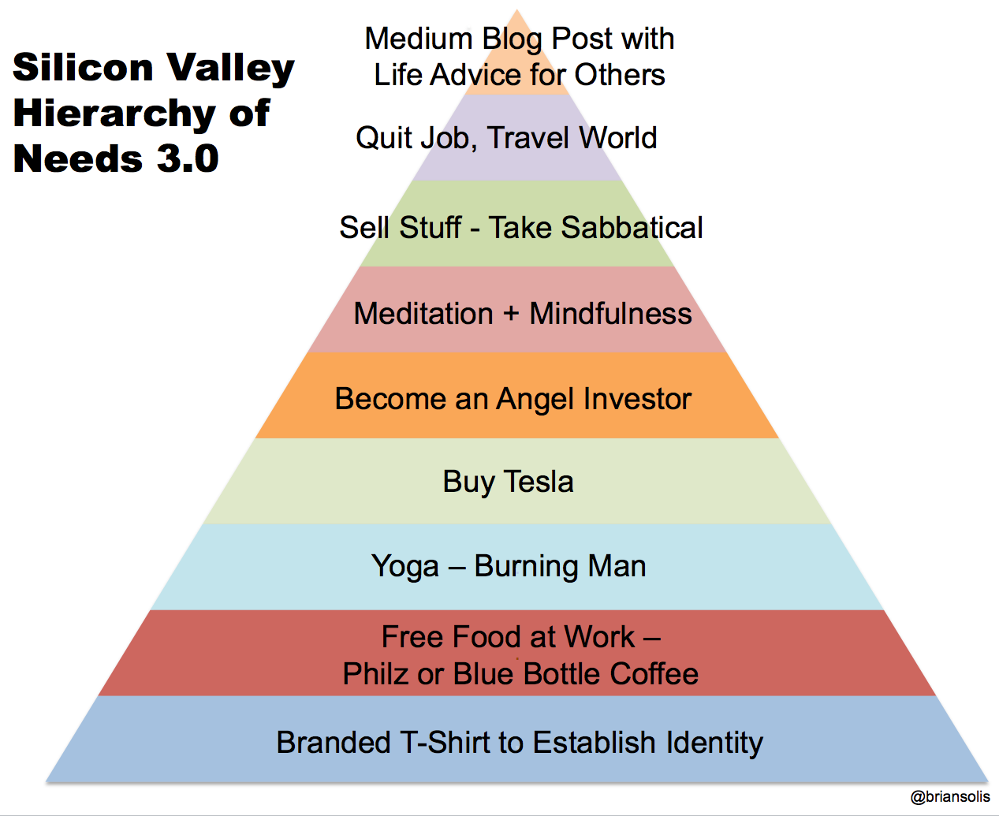

Как в Кремниевой долине относятся к опытным людям

 [ SLY_G](https://habr.com/users/SLY_G/ "Автор публикации") 9 января 2019 в 15:00

*   Перевод

Однажды я прочитал в одной статье, которую теперь не могу найти, высказывания директора одного стартапа-«единорога» \[_частная компания с капитализацией более $1 млрд / прим. перев._\], которые не понравились многим людям. Такие вещи вообще неприлично говорить по поводу других людей. Более того, такие вещи даже думать не стоит по отношению к другим людям – однако этот гражданин, очевидно, не справился с этим. Люди ахнули от дерзости, с которой говорилось об этих вещах, но упустили при этом тот факт, что многие на самом деле думают именно так. Даже сегодня.

И я сейчас говорю не про расизм или сексизм. Речь шла о пожилых людях в области технологий.

Насколько я помню, речь шла о следующем: считается, что вы должны зайти в этот бизнес, заработать денег, и отвалить, то есть, уйти на пенсию. Вы продаёте своё барахло и путешествуете по миру, изредка пописывая статейки на Medium. Ну, вся эта пирамида желаний, врубаетесь?  
  

_[Версия](https://www.briansolis.com/2015/09/silicon-valley-hierarchy-needs/) пирамиды Маслоу для Кремниевой долины. Снизу вверх:  
— купить футболку с брендом для установления идентичности  
— халявная жратва на работе, включая кофе из модных кофеен  
— заняться йогой, принять участие в [Burning Man](https://ru.wikipedia.org/wiki/Burning_Man)  
— купить автомобиль Tesla  
— стать [бизнес-ангелом](https://ru.wikipedia.org/wiki/%D0%91%D0%B8%D0%B7%D0%BD%D0%B5%D1%81-%D0%B0%D0%BD%D0%B3%D0%B5%D0%BB)  
— заняться осмысленной медитацией  
— продать своё барахло, взять отпуск на год  
— уволиться и путешествовать  
— писать статьи на Medium с советами для других людей о том, как правильно жить_

Поэтому, если вы до сих пор тут, и на вид вы уже старый, то что-то здесь не так. И в статье это сводилось к двум вариантам.

Первая возможность – чувак просто офигенно крутой. Это один из тех людей, что уже зашиб бабла, и теперь тусуется на работе только потому, что любит это дело. Ему это делать не обязательно.

Вторая – чувак представляет собой противоположность крутости, и умудрился не зашибить бабла, несмотря на то, что провёл в этом деле кучу времени. Нифига не заработал, живёт от зарплаты до зарплаты, нуждается в рабочем месте. В общем, поскольку он не добрался до вершины, несмотря на свой пожилой возраст, можно считать его лохом.

Оба варианта настолько далеки от действительности, что это даже не смешно. Однако есть люди, свято в это верящие, исходящие из этих принципов и применяющие их к другим людям – к тем, кого они интервьюируют, берут на работу, продвигают по службе, и, да – увольняют.

Кто-нибудь помнит этот пост или новость? Я пытаюсь его найти.

Если вы ещё не поняли, то люди с подобным стилем мышления устранили любые промежуточные варианты для всех людей, с их точки зрения недостаточно молодых. Если вы не можете каждую минуту быть невероятным и потрясающим, значит, вы мусор – а иначе что вы тут до сих пор делаете?

К сожалению, это не гипотетические рассуждения. Недавно мой товарищ, которому уже за 50, рассказал мне о беседе, которую он провёл со своим менеджером. Короче говоря, менеджер задал вопрос, которому я не перестаю удивляться:

> Почему ты до сих пор работаешь?

Такой короткой фразой менеджер умудрился выразить сразу столько всего. Во-первых, работник считается «старым». Исходя из этого, почему он не может себе позволить уволиться? Почему он не отправился в кругосветку? Что с ним не так, почему он не может выиграть джекпот? Учитывая все эти годы, потраченные на развитие его карьеры, почему он такой отстойный?

Скажу прямо: это не вырванная из контекста фраза, сказанная одним товарищем другому, типа «если у тебя столько бабок, почему ты до сих пор работаешь». Это был прямой враждебный вопрос, заданный менеджером, недостаточно умным, чтобы знать о том, что подобные вопросы заставляют нервничать штатных юристов компании, ибо судебные иски по дискриминации начинались и по меньшему поводу.

И, да, мой друг не отстойный. Он собирается перейти на другую работу и добиться там успеха, после чего все, кто следит за развитием событий, поймут, что проблема заключалась в компании.

Если вам нужно собрать здоровую команду, вам понадобится смесь из разных людей. Урезая целые сегменты работников вашей компании просто потому, что вы не видите их ценности, вы будете вредить самому себе.

Хотите – верьте, хотите – нет, но этому учат в старших классах на уроках по экономике. И, в государственных, кстати, школах. Дискриминация не окупается.

Теги:

*   [кремниевая долина](https://habr.com/search/?q=%5B%D0%BA%D1%80%D0%B5%D0%BC%D0%BD%D0%B8%D0%B5%D0%B2%D0%B0%D1%8F%20%D0%B4%D0%BE%D0%BB%D0%B8%D0%BD%D0%B0%5D&target_type=posts)
*   [карьера](https://habr.com/search/?q=%5B%D0%BA%D0%B0%D1%80%D1%8C%D0%B5%D1%80%D0%B0%5D&target_type=posts)
*   [it](https://habr.com/search/?q=%5Bit%5D&target_type=posts)