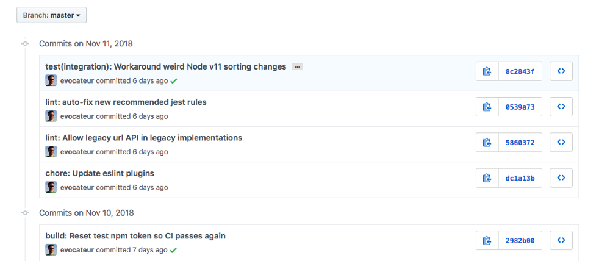

Как генерировать осмысленные коммиты. Применяем стандарт Conventional Commits / Блог компании Яндекс

_Привычный хаос в названиях коммитов. Знакомая картина?_

Наверняка вы знаете **[git-flow](https://nvie.com/posts/a-successful-git-branching-model/)**. Это отличный набор соглашений по упорядочиванию работы с ветками в Git. Он хорошо документирован и широко распространен. Обычно мы знакомы с правильным ветвлением и много говорим об этом, но, к сожалению, уделяем слишком мало внимания вопросу наименования коммитов, поэтому часто сообщения в Git пишутся бессистемно.

Меня зовут Ержан Ташбенбетов, я работаю в одной из команд Яндекс.Маркета. И сегодня я расскажу читателям Хабра, какие инструменты для создания осмысленных коммитов мы используем в команде. Приглашаю присоединиться к обсуждению этой темы.

  
Отсутствие договоренностей при наименования коммитов затрудняет работу с историей в Git. Такое было в нашей команде. До использования общего для всех регламента и внедрения автоматизации типичные коммиты выглядели следующим образом:

    SECRETMRKT-700: пропали логотипы партнеров
    Приложение падает, поправил.
    SECRETMRKT-701, SECRETMRKT-702: Отцентрировал картинки на всех ...

Во-первых, каждый разработчик писал сообщения как хотел: кто-то описывал задачу, кто-то перечислял внесенные изменения, кто-то использовал генератор случайных фраз. Всё было вразнобой. Во-вторых, номера задач, присутствовавшие в коммитах, часто укорачивали полезный текст. Всё это мешало эффективно работать с историей в Git.

По этой причине мы внедрили в команде стандарт _Conventional Commits_, стали генерировать коммиты в консольной утилите _commitizen_ и проверять результат с помощью _commitlint_. В результате коммиты изменились и стали выглядит так:

    refactor(tutorial): оптимизировать работу эпиков в тултипах
    feat(products): добавить банер с новогодними скидками
    fix(products): исправить в банере формат даты

Читать историю и распознавать внесенные изменения стало проще. Мы не отказались от указания номеров задач, всё аккуратно перенесено внутрь коммитов согласно конвенции _Conventional Commits_.

Дальше я расскажу, как добиться схожего порядка в Git.

* * *

  

## Лучшие практики, рекомендации и распространенные решения при наименовании коммитов

Если попробовать разобраться в том, какие практики применяются в индустрии, то можно обнаружить следующие варианты:

*   **Статьи с общими советами по написанию коммитов.** По большей части они вполне логичны и неплохо раскрывают тему, но чувствуется беспорядочность и отсутствие комплексного решения вопроса.
*   **Стандарты по написанию коммитов.** Их немного. Они представляют собой документы с четким перечнем правил, довольно часто написанных специально для крупной библиотеки или фреймворка. Эти стандарты подкупают системным подходом, популярностью и поддержкой в open-source сообществе.

  

> **Нам нужно больше порядка в коммитах!**

Методология **[Conventional Commits](https://www.conventionalcommits.org/)** выделяется на фоне других стандартов и заслуживает пристального изучения по ряду причин:

1.  Она хорошо документирована и проработана. В её спецификации даны ответы на наиболее распространенные вопросы.
2.  Создатели конвенции вдохновились требованиями к написанию коммитов, которые используются в популярном и проверенном временем фреймворке **[AngularJS](https://github.com/angular/angular.js/blob/master/DEVELOPERS.md#commits)**.
3.  Правил конвенции придерживаются несколько крупных и популярных open-source библиотек (таких как **[yargs](https://github.com/yargs/yargs)** и **[lerna](https://github.com/lerna/lerna)**).
4.  К плюсам отнесу подготовку к автоматическому формированию Release Notes и Change Log.

**Пример коммита по этому стандарту:**

    fix(products): поправить длину строки с ценой
    
    Часть заголовков неправильно отображается в мобильной версии из-за ошибок
    в проектировании универсальных компонентов.
    
    МЕТА ДАННЫЕ: SECRETMRKT-578, SECRETMRKT-602

  

* * *

  

## Основные тезисы Conventional Commits

  

*   Разработчик должен придерживаться следующей структуры коммитов:  
    
    > &lt;type&gt;(&lt;scope&gt;): &lt;subject&gt;
    > 
    > &lt;body&gt;
    > 
    > &lt;footer&gt;
    
*   У коммита должен быть заголовок, может быть тело и нижний колонтитул.
*   Заголовок коммита должен начинаться с типа (_type_), указывающего на специфику внесенных в кодовую базу изменений, и завершаться описанием.
*   Наряду с обязательными _feat_, _fix_ (использование которых строго регламентировано), допускаются и другие типы.
*   У коммита может быть область (_scope_). Она характеризует фрагмент кода, которую затронули изменения. Область следует за типом коммита. Стандарт не регламентирует четкий список областей. Примеры областей: eslint, git, analytics и т.д.
*   Описание коммита должно быть сразу после типа/области.
*   Тело коммита может быть использовано для детализации изменений. Тело должно быть отделено от описания пустой строкой.
*   Нижний колонтитул следует использовать для указания внешних ссылок, контекста коммита или другой мета информации. Нижний колонтитул должен быть отделен от тела пустой строкой.

#### Кроме перечисленых в конвенции правил мы используем следущие популярные рекомендации:

  

*   В теле коммита пишем _что_ было изменено и _почему_.
*   Используем следующие типы коммитов:  
    
    |     |     |
    | --- | --- |
    | **build** | Сборка проекта или изменения внешних зависимостей |
    | **ci** | Настройка CI и работа со скриптами |
    | **docs** | Обновление документации |
    | **feat** | Добавление нового функционала |
    | **fix** | Исправление ошибок |
    | **perf** | Изменения направленные на улучшение производительности |
    | **refactor** | Правки кода без исправления ошибок или добавления новых функций |
    | **revert** | Откат на предыдущие коммиты |
    | **style** | Правки по кодстайлу (табы, отступы, точки, запятые и т.д.) |
    | **test** | Добавление тестов |
    
*   Пишем описание в повелительном наклонении (_imperative mood_), точно также как сам Git.  
    
    > Merge branch 'fix/SECRETMRKT-749-fix-typos-in-titles'
    
*   Не закачиваем описание коммита знаками препинания.

_Стандарт коммитов _Conventional Commits_ используют котрибьюторы [**lerna**](https://github.com/lerna/lerna)_

* * *

  

Нужно добавить автоматизации и удобства. Для решения этого вопроса нам потребуется два инструмента: генератор коммитов и линтер коммитов, настроенный на проверку перед пушем в репозиторий.

* * *

  

Этот инструмент позволяет генерировать коммиты при помощи встроенного визарда. Кроме того, commitizen хорошо поддерживается сообществом и, благодаря дополнительным модулям, отлично настраивается.

1.  Установим утилиту **[commitizen](https://github.com/commitizen/cz-cli)** глобально (вам могут потребоваться права администратора).
    
        npm i -g commitizen
    
2.  Следом установим адаптер **[cz-customizable](https://github.com/leonardoanalista/cz-customizable)**. Он нужен для настройки шаблона с вопросами, которым пользуется утилита _commitizen_.
    
        npm i -D cz-customizable
    
3.  Создадим файл commitizen.js, он нужен для настройки cz-customizable. Поместим созданный файл в директорию ./config/git. Рекомендую не захламлять корень проекта конфигурационными файлами и стараться группировать файлы в подготовленной для этого папке. Содержимое:
    
    **Показать commitizen.js**
    
        "use strict";
        
        module.exports = {
          
          types: [
            {
              value: "build",
              name: "build:     Сборка проекта или изменения внешних зависимостей"
            },
            { value: "ci", name: "ci:        Настройка CI и работа со скриптами" },
            { value: "docs", name: "docs:      Обновление документации" },
            { value: "feat", name: "feat:      Добавление нового функционала" },
            { value: "fix", name: "fix:       Исправление ошибок" },
            {
              value: "perf",
              name: "perf:      Изменения направленные на улучшение производительности"
            },
            {
              value: "refactor",
              name:
                "refactor:  Правки кода без исправления ошибок или добавления новых функций"
            },
            { value: "revert", name: "revert:    Откат на предыдущие коммиты" },
            {
              value: "style",
              name:
                "style:     Правки по кодстайлу (табы, отступы, точки, запятые и т.д.)"
            },
            { value: "test", name: "test:      Добавление тестов" }
          ],
        
          
          scopes: [
            { name: "components" },
            { name: "tutorial" },
            { name: "catalog" },
            { name: "product" }
          ],
        
          
          
        
          
          messages: {
            type: "Какие изменения вы вносите?",
            scope: "\nВыберите ОБЛАСТЬ, которую вы изменили (опционально):",
            
            customScope: "Укажите свою ОБЛАСТЬ:",
            subject: "Напишите КОРОТКОЕ описание в ПОВЕЛИТЕЛЬНОМ наклонении:\n",
            body:
              'Напишите ПОДРОБНОЕ описание (опционально). Используйте "|" для новой строки:\n',
            breaking: "Список BREAKING CHANGES (опционально):\n",
            footer:
              "Место для мета данных (тикетов, ссылок и остального). Например: SECRETMRKT-700, SECRETMRKT-800:\n",
            confirmCommit: "Вас устраивает получившийся коммит?"
          },
        
          
          allowCustomScopes: true,
        
          
          allowBreakingChanges: false,
        
          
          footerPrefix: "МЕТА ДАННЫЕ:",
        
          
          subjectLimit: 72
        };
    
      
    
      
    
4.  Добавим в package.json ссылки на cz-customizable и созданный ранее конфигурационный файл:
    
    **Показать часть package.json**
    
        {
          "config": {
            "commitizen": {
              "path": "node_modules/cz-customizable"
            },
            "cz-customizable": {
              "config": "config/git/commitizen.js"
            }
          },
        }
    
      
    
5.  Давайте проверим получившийся результат. Наберите в терминале следующую команду:
    
        git cz
    

Визард commitizen сначала соберет информацию о типе, области коммита, затем последовательно запросит текст, который будет в описании, в теле, в нижнем колонтитуле и после вашего согласия создаст коммит.

> Обязательно **[посмотрите](https://asciinema.org/a/212473)** на пример работы настроенной утилиты commitizen и подключенного к нему адаптера cz-cusomizable

  

* * *

  
  

1.  Установим в проект **[husky](https://github.com/typicode/husky)** и **[commitlint](https://github.com/marionebl/commitlint)**:
    
        npm i -D husky @commitlint/cli
    
2.  С помощью husky добавим проверку коммитов. Для этого в package.json сразу после скриптов добавим следующий хук и укажем в нем ссылку на файл commitlint.js:
    
    **Показать часть package.json**
    
        {
          "scripts": {
            "test": "echo \"Error: no test specified\" && exit 1"
          },
          "husky": {
            "hooks": {
              "commit-msg": "commitlint -E HUSKY_GIT_PARAMS -g './config/git/commitlint.js'"
            }
          },
          "devDependencies": {
            "@commitlint/cli": "^7.2.1",
            "husky": "^1.1.3",
        }
    
      
    
      
    
3.  Создадим файл commitlint.js, необходимый для корректной работы линтера. Поместим созданный файл в директорию ./config/git. Содержимое файла:
    
    **Показать commitlint.js**
    
        
        
        module.exports = {
          rules: {
            
            "body-leading-blank": [2, "always"],
        
            
            "footer-leading-blank": [2, "always"],
        
            
            "header-max-length": [2, "always", 72],
        
            
            "scope-case": [2, "always", "lower-case"],
        
            
            "subject-empty": [2, "never"],
        
            
            "subject-full-stop": [2, "never", "."],
        
            
            "type-case": [2, "always", "lower-case"],
        
            
            "type-empty": [2, "never"],
        
            
            "type-enum": [
              2,
              "always",
              [
                "build",
                "ci",
                "docs",
                "feat",
                "fix",
                "perf",
                "refactor",
                "revert",
                "style",
                "test"
              ]
            ]
          }
        };
    
      
    
      
    

Всё. Теперь все коммиты будут проверяться перед отправкой в репозиторий :)

> Обязательно **[посмотрите](https://asciinema.org/a/212490)** на пример работы настроенной утилиты commitlint

  

* * *

  

### Так что выбрать commitizen или commitlint?

И то, и другое! В связке они приносят отличный результат: первый генерирует коммиты, второй их проверяет.

### Почему стандарты рекомендуют использовать повелительное наклонение?

Это крайне интересный вопрос. Коммит это изменение кода, сообщение в коммите можно расценивать как инструкцию по изменению этого кода. Сделать, изменить, добавить, обновить, поправить  — всё это конкретные инструкции для разработчика.

Кстати, повелительное наклонение рекомендовано в самой системе версионирования **[Git](https://git.kernel.org/pub/scm/git/git.git/tree/Documentation/SubmittingPatches)**:

    [[imperative-mood]]
    Describe your changes in imperative mood, e.g. "make xyzzy do frotz"
    instead of "[This patch] makes xyzzy do frotz" or "[I] changed xyzzy
    to do frotz", as if you are giving orders to the codebase to change
    its behavior.

### Зачем придерживаться каких-либо конвенций? Стоит ли тратить на это время? Какой в этом профит?

Стоит. В целом я заметил, что мы стали охотнее детализировать изменения, внесенные в кодовую базу. В теле коммита мы подробно расписываем почему пришлось использовать те или другие решения. Разбираться в истории стало объективно проще. Плюс наш продукт развивается, и мы ожидаем пополнения в команде. Уверен, что благодаря внедрению стандарта и автоматизации новичкам будет легче встроиться в процесс разработки.

Попробуйте и поделитесь результатом.

## Полезные ссылки:

  

*   **[Репозиторий](https://github.com/tashbenbetov/make-commit-messages-great-again)** со всем кодом из этой статьи.
*   Стандарт **[Conventional Commits](https://www.conventionalcommits.org/)**.
*   **[Commitlint](https://marionebl.github.io/commitlint)** инструмент для валидации коммитов.
*   Онлайн **[конфигуратор](https://commitlint.io/)** правильных коммитов.
*   Хорошие **[советы](https://chris.beams.io/posts/git-commit/)** на тему наименования коммитов.