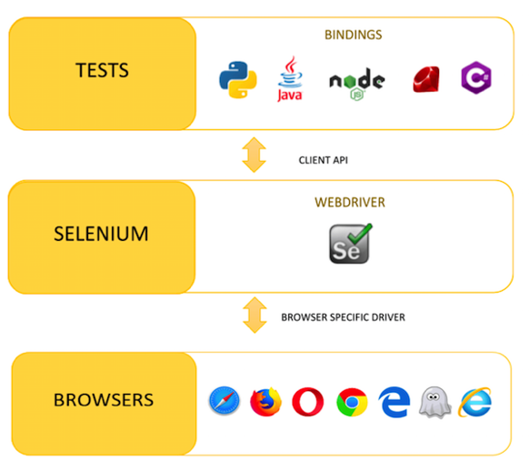
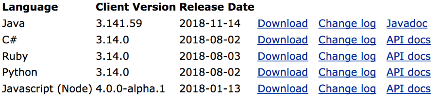
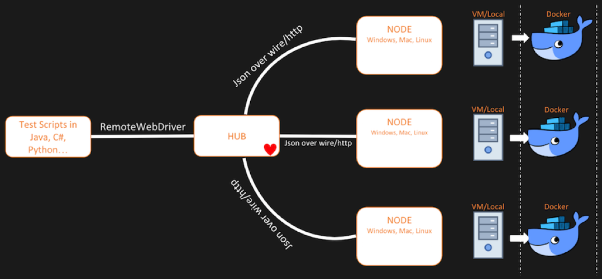
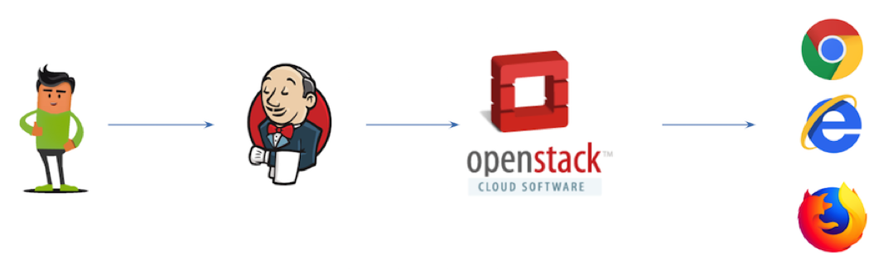
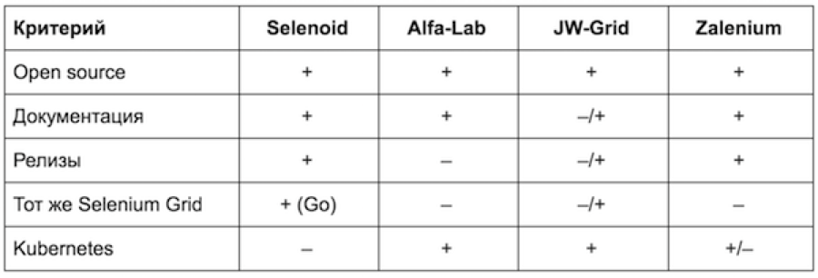
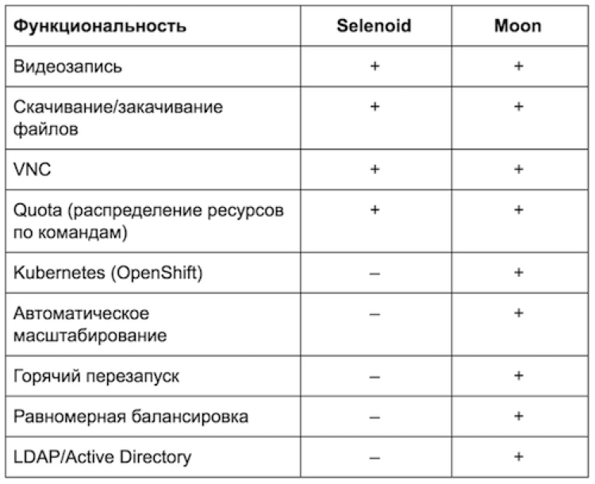
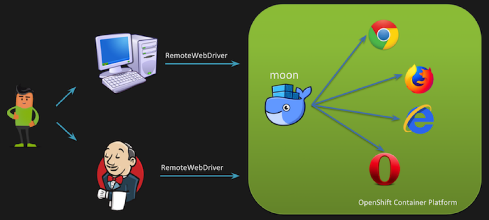
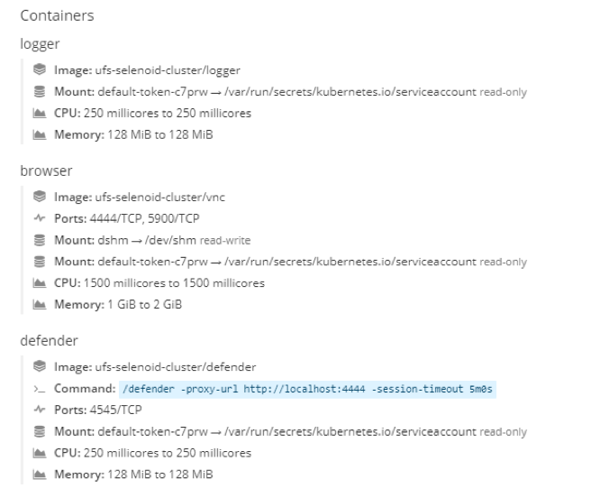
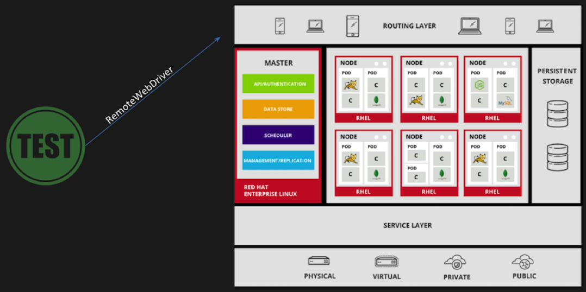
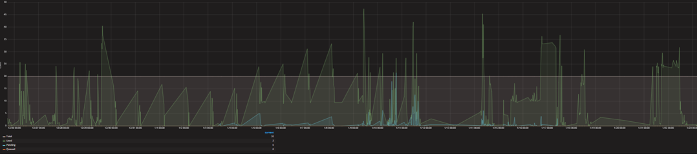

Как мы автоматизировали запуск Selenium-тестов через Moon и OpenShift / Блог компании Сбербанк

14 декабря на митапе в Санкт-Петербурге я (Артем Соковец) совместно с коллегой, Дмитрием Маркеловым, рассказывал о текущей инфраструктуре для автотестов в СберТехе. Пересказ нашего выступления — в этом посте.

  

## Что такое Selenium

Selenium — это инструмент для автоматизации действий веб-браузера. На сегодня данный инструмент является стандартом при автоматизации WEB.  

Существует множество клиентов для различных языков программирования, которые поддерживают Selenium Webdriver API. Через WebDriver API, посредством протокола JSON Wire, происходит взаимодействие с драйвером выбранного браузера, который, в свою очередь, работает с уже реальным браузером, выполняя нужные нам действия.  
На сегодня стабильная версия клиента — Selenium 3.Х.

  
Simon Stewart, к слову, обещал представить Selenium 4.0 на конференции [SeleniumConf Japan](http://conf.selenium.jp/).

## Selenium GRID

В 2008 году Philippe Hanrigou анонсировал Selenium GRID для создания инфраструктуры автотестов с поддержкой различных браузеров.

Selenium GRID состоит из хаба и нод (узлов). Node это просто java-процесс. Он может быть и на одной машине с Hub, может быть на другой машине, может быть в Docker контейнере. Hub — это по сути балансировщик для автотестов, определяющий узел, на какой следует отправить выполнение конкретного теста. К нему можно подключить и мобильные эмуляторы.

Selenium GRID позволяет запускать тесты на разных ОС и различных версиях браузеров. Также он существенно экономит время при прогоне большого количества автотестов, если, конечно, автотесты запускаются параллельно с использованием maven-surfire-plugin или другого механизма распараллеливания.

Само собой, Selenium GRID имеет и свои минусы. При использовании стандартной реализации приходится сталкиваться со следующими проблемами:

*   постоянным рестартом hub и node. Если хаб и узел долго не используются, то при последующем коннекте возможны ситуации, когда при создании сессии на ноде, эта самая сессия отваливается по таймауту. Для восстановления работы требуется рестарт;
*   ограничением на количество узлов. Сильно зависит от тестов и настроек грида. Без танцев с бубном оно начинает тормозить при нескольких десятках подключенных нод;
*   скудной функциональностью;
*   невозможностью обновлений без полной остановки сервиса.

  

## Первоначальная инфраструктура автотестов в СберТехе

Ранее в СберТехе была следующая инфраструктура для UI-автотестов. Пользователь запускал сборку на Jenkins-е, который с помощью плагина обращался в OpenStack за выделением виртуальной машины. Происходило выделение ВМ со специальным «образом» и нужным браузером, и только затем на этой ВМ выполнялись автотесты.

Если требовалось прогнать тесты в браузерах Chrome или FireFox, то выделялись Docker-контейнеры. А вот при работе с IE приходилось поднимать «чистую» ВМ, что занимало до 5 минут. К сожалению, Internet Explorer является приоритетным браузером в нашей компании.

Основная проблема была в том, что такой подход занимал очень много времени при прогоне автотестов в IE. Приходилось разделять тесты на suites и стартовать сборки параллельно, чтобы достичь хоть какого-то сокращения времени. Мы стали задумываться о модернизации.

## Требования к новой инфраструктуре

Посещая различные конференции по автоматизации, разработке и DevOps (Heisenbug, SQA Days, CodeOne, SeleniumConf и другие) у нас постепенно формировался список требований к новой инфраструктуре:

*   Сократить время на прогон регрессионных тестов;
*   Обеспечить единую точку входа для автотестов, что позволит облегчить их отладку для специалиста по автоматизации. Не редки случаи, когда локально все работает, а как только тесты попадают в pipeline – сплошные падения.
*   Обеспечить кроссбраузерность и мобильную автоматизацию (Appium-тесты).
*   Придерживаться облачной архитектуры банка: управление Docker-контейнерами должно происходить в OpenShift.
*   Сократить потребление памяти и CPU.

  

## Краткий обзор существующих решений

Определившись с задачами, мы проанализировали существующие на рынке решения. Основное, что мы рассмотрели, — продукты команды [Aerokube](https://github.com/aerokube) (Selenoid и Moon), решения Alfalab (Альфа Лаборатория), [JW-Grid](http://github.com/qa-dev/jsonwire-grid) (Авито) и [Zalenium](http://file///Users/asokovets/Downloads/zalando.github.io/zalenium).

Ключевым минусом Selenoid стало отсутствие поддержки OpenShift (обертка над Kubernetes). О решении Alfalab есть [статья на Хабре](http://habr.com/company/alfa/blog/331434/). Это оказался тот же Selenium Grid. Решение Авито описано в [статье](http://habr.com/company/avito/blog/352208). Доклад о нем мы видели на конференции Heisenbug. В нем тоже были минусы, которые нам не понравились. Zalenium — это опенсорсный проект, также не без проблем.

Рассмотренные нами плюсы и минусы решений сведены в таблицу:

В итоге мы остановили свой выбор на продукте от Aerokube — Selenoid.

## Selenoid vs Moon

Четыре месяца мы использовали Selenoid при автоматизации экосистемы Сбербанка. Это неплохое решение, но Банк движется в сторону OpenShift, а развернуть Selenoid в OpenShift нетривиальная задача. Тонкость в том, что Selenoid в Kubernetes управляет докером последнего, а Kubernetes про это ничего не знает и не может правильно шедулить другие ноды. Кроме того, для Selenoid в Kubernetes требуется GGR (Go Grid Router), в котором хромает распределение нагрузки.

Поэкспериментировав с Selenoid, мы заинтересовались платным инструментом Moon, который ориентирован именно на работу с Kubernetes и обладает рядом преимуществ по сравнению с бесплатным Selenoid. Он развивается уже два года и позволяет развернуть инфраструктуру под Selenium тестирования UI, не тратясь на DevOps инженеров, обладающих тайным знанием о том, как развернуть Selenoid в Kubernetes. Это важное преимущество — попробуйте проапдейтить кластер Selenoid без даунтайма и уменьшения емкости при запущенных тестах?

Moon был не единственным возможным вариантом. К примеру, можно было бы взять Zalenium, упомянутый выше, но фактически это тот же Selenium Grid. У него внутри хранится полный список сессий в хабе, и если хаб падает, то тестам конец. На этом фоне Moon выигрывает за счет того, что не имеет внутреннего состояния, поэтому падение одной из его реплик вообще незаметно. У Moon все «gracefully» — его можно перезапускать безбоязненно, не дожидаясь завершения сессии.

Zalenium имеет и другие ограничения. Например, не поддерживает Quota. Нельзя поставить две его копии за балансировщик распределения нагрузки, потому что он не умеет распределять свое состояние между двумя и более «головами». Да и в целом, он с трудом заведется на своем кластере. Zalenium использует PersistentVolume для хранения данных: логов и записанных видео тестов, но, в основном, это касается дисков в облаках, а не более отказоустойчивого S3.

## Инфраструктура автотестов

Нынешняя инфраструктура с использованием Moon и OpenShift выглядит следующим образом:

Пользователь может запускать тесты как локально, так и используя CI-сервер (в нашем случае Jenkins, но могут быть и другие). В обоих случаях мы посредством RemoteWebDriver обращаемся к OpenShift, в котором развернут сервис с несколькими репликами Moon. Далее запрос, в котором указан нужный нам браузер, обрабатывается в Moon, в результате чего посредством Kubernetes API инициирует создание пода с этим браузером. Затем Moon напрямую проксирует запросы в контейнер, где и проходят тесты.

По окончании прогона заканчивается сессия, под удаляются, ресурсы освобождаются.

## Запуск Internet Explorer

Конечно, не обошлось без сложностей. Как ранее говорилось, целевым браузером для нас является Internet Explorer — большинство наших приложений использует компоненты ActiveX. Поскольку у нас используется OpenShift, наши Docker-контейнеры работают на RedHat Enterprise Linux. Таким образом, встает вопрос: как запустить Internet Explorer в Docker-контейнере, когда хостовая машина у нас на Linux?

Ребята из команды разработчиков Moon поделились своим решением по запуску Internet Explorer и Microsoft Edge.

Недостаток такого решения в том, что Docker-контейнер должен запускаться в привилегированном режиме. Так инициализация контейнера с Internet Explorer после запуска теста у нас занимает 10 секунд, что в 30 раз быстрее по сравнению с использованием предыдущей инфраструктуры.

## Troubleshooting

В заключение мы хотели бы поделиться с вами решениями некоторых проблем, с которыми столкнулись в процессе развертывания и настройки кластера.

Первая проблема — это распространение сервисных образов. Когда moon инициирует создание браузера, помимо контейнера с браузером у нас запускаются дополнительные сервисные контейнеры — логгер, дефендер, видео-рекордер.

Все это запускается в рамках одного пода. И если образы данных контейнеров не закэшированы на нодах, то они будут доставаться с Docker-хаба. У нас на этом этапе все падало, поскольку использовалась внутренняя сеть. Поэтому ребята из Aerokube оперативно вынесли данную настройку в конфиг мапу. Если вы тоже используете внутреннюю сеть, советуем запулить данные образы в свой registry и указать путь до них в конфиг мапе moon-config. В файле service.json нужно добавить секцию images:

    "images": {
                 "videoRecorder": "ufs-selenoid-cluster/moon-video-recorder:latest",
                 "defender": "ufs-selenoid-cluster/defender:latest",
                 "logger": "ufs-selenoid-cluster/logger:latest"
     }
    

Следующую проблему выявили уже при запуске тестов. Вся инфраструктура динамически создавалась, но тест падал через 30 секунд со следующей ошибкой:

    Driver info: org.openqa.selenium.remote.RemoteWebDriver
    Org.openqa.selenium.WebDriverException: <html><body><h1>504 Gateway Time-out</h1>
    The server didn’t respond in time.
    

Почему это происходило? Дело в том, что тест посредством RemoteWebDriver первоначально обращается к routing layer OpenShift, который отвечает за взаимодействие с внешней средой. В роли данного слоя у нас выступает Haproxy, который перенаправляет запросы на нужные нам контейнеры. На практике тест обращался к данному слою, его перенаправляли на наш контейнер, который должен был создать браузер. Но он его создать не мог, так как ресурсы заканчивались. Поэтому тест уходил в очередь, а прокси-сервер через 30 секунд ронял его по таймауту, так как по дефолту на нем стоял именно этот интервал времени.

Как это решить? Все оказалось довольно просто – нужно было просто переопределить аннотацию haproxy.router.openshift.io/timeout для роутера нашего контейнера.

    $oc annotate route moon --overwrite haproxy.router.openshift.io/timeout=10m
    

Следующий кейс — работа с S3 совместимым хранилищем. Moon умеет записывать то, что происходит в контейнере с браузером. На одной ноде вместе с браузером поднимаются сервисные контейнеры, один из которых — это видеорекордер. Он записывает все, что происходит в контейнере и после окончания сессии отправляет данные в S3 совместимое хранилище. Чтобы отправлять данные в такое хранилище, нужно указать в настройках url, пароли-явки, а также название корзины.

Вроде все просто. Мы указали данные и начали запускать тесты, но файлов в хранилище не оказалось. После разбора логов мы поняли, что используемый для взаимодействия с S3 клиент ругался на отсутствие сертификатов, так как в поле url мы указывали адрес до S3 с https. Решение проблемы — указать незащищенный режим http или же добавить в контейнер свои сертификаты. Последний вариант сложнее, если вы не знаете, что находится в контейнере и как это все работает.

### И напоследок...

Каждый контейнер с браузером можно настроить самостоятельно — все доступные параметры есть в документации Moon. Обратим внимание на такие кастомные настройки, как privileged и nodeSelector.

Нужны они вот для чего. Контейнер с Internet Explorer, как упоминалось выше, должен запускаться только в привилегированном режиме. Работу в нужном режиме обеспечивает флаг privileged вместе с выдачей прав на запуск таких контейнеров сервис-аккаунту.

Чтобы запускать на отдельных нодах, нужно прописать nodeSelector:

    "internet explorer": {
        "default": "latest",
        "versions": {
          "latest": {
            "image": "docker-registry.default.svc:5000/ufs-selenoid-cluster/windows:7",
            "port": "4444",
            "path": "/wd/hub",
            "nodeSelector": {
              "kubernetes.io/hostname": "nirvana5.ca.sbrf.ru"
            },
            "volumes": ["/var/lib/docker/selenoid:/image"],
            "privileged": true
          }
        }
      }
    

Последний совет. Следите за количеством запущенных сессий. Мы выводим все запуски в Grafana:

## Куда мы стремимся

Нас не все устраивает в текущей инфраструктуре и решение пока нельзя назвать законченным. В ближайшем будущем мы планируем стабилизировать работу IE в Docker, получить «богатый» UI-интерфейс в Moon, а также апробировать Appium для мобильных автотестов.