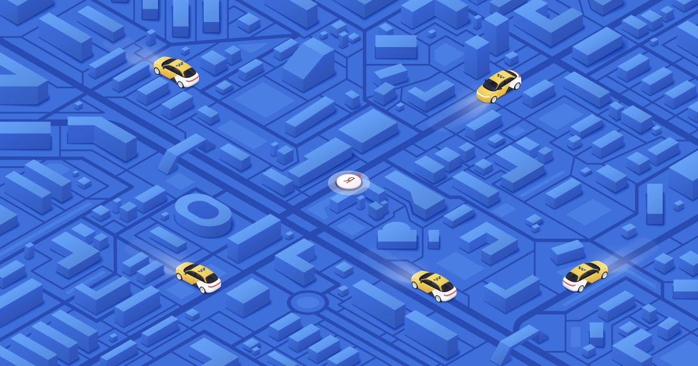
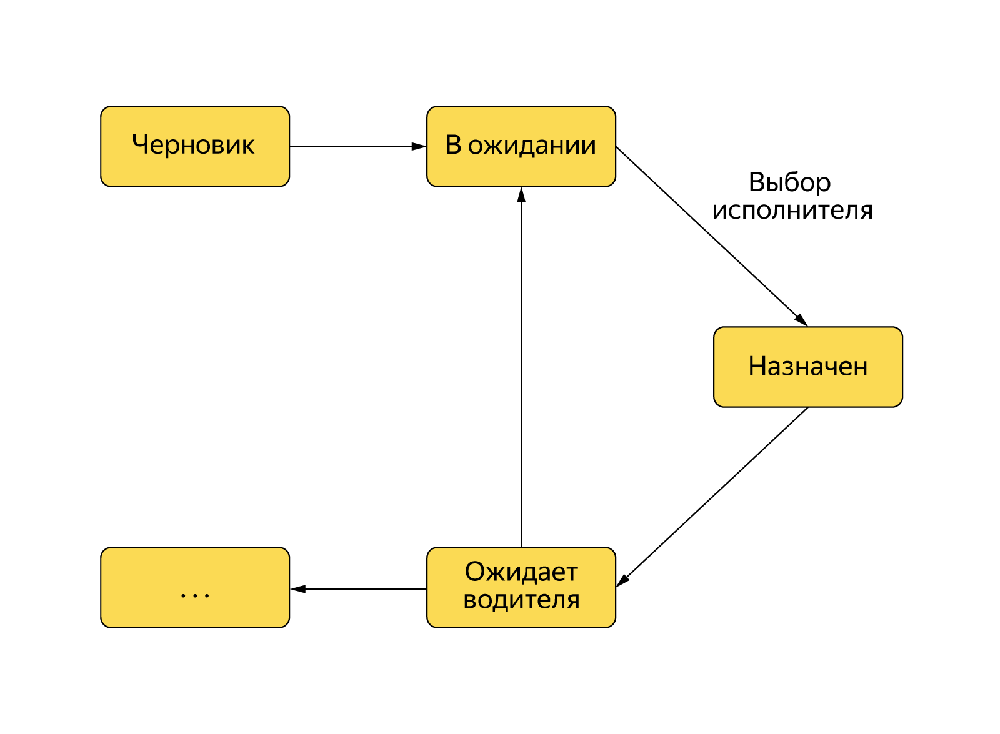
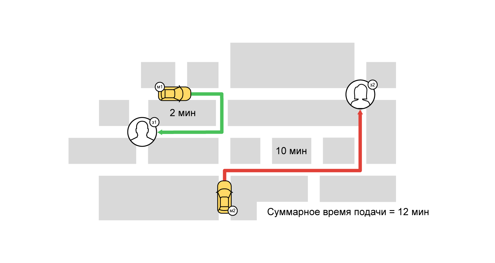
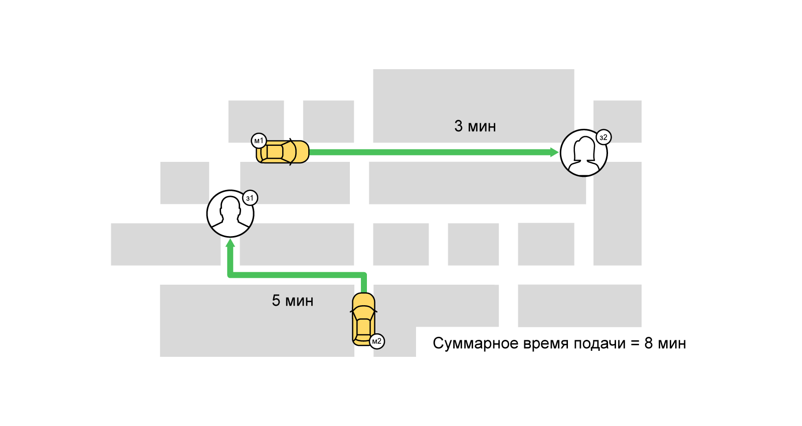
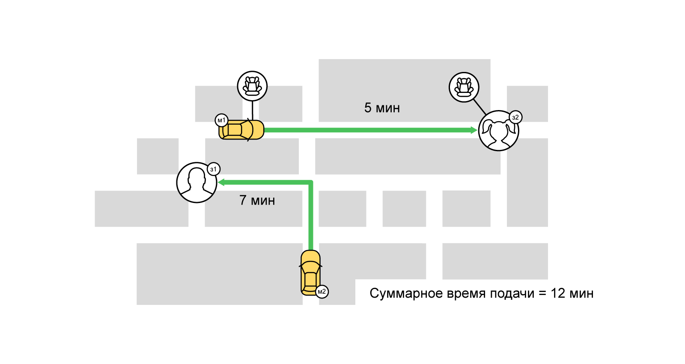
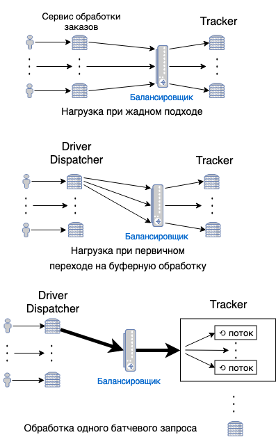

Как мы распределяем заказы между водителями в Яндекс.Такси / Блог компании Яндекс

Одна из главных задач в Яндекс.Такси — как сделать так, чтобы к пользователю быстро приезжала машина, а у водителя сокращалось время «холостого пробега» (то есть время, когда он на линии без пассажира). Казалось бы, всё просто: пользователь выбирает тариф, указывает дополнительные пожелания (детское кресло, например). Остаётся отфильтровать водителей на линии по этим критериям, выбрать ближайшего и предложить ему заказ. Однако всё так просто только на первый взгляд.

Сегодня я расскажу сообществу Хабра о том, как мы выбираем наиболее подходящего водителя и как этот процесс эволюционировал со временем. Вы узнаете о двух подходах к решению задачи.

### Общая архитектура поиска

Когда пользователь нажимает кнопку «Вызвать такси», в бэкенде создаётся объект заказа и начинается его обработка в соответствии с конечным автоматом. Чтобы заказ перешёл из состояния «В ожидании» в «Водитель назначен» — нужно найти водителя, предложить ему заказ и дождаться подтверждения, что заказ принят.

### Жадный (Greedy) подход

Очень долго в Яндекс.Такси работал [жадный](https://ru.wikipedia.org/wiki/%D0%96%D0%B0%D0%B4%D0%BD%D1%8B%D0%B9_%D0%B0%D0%BB%D0%B3%D0%BE%D1%80%D0%B8%D1%82%D0%BC) подход. При таком подходе на этапе поиска исполнителя делается запрос в микросервис Tracker, отвечающий за водителей. Tracker знает об автомобилях всё: от цвета и брендирования до [текущего местоположения](https://events.yandex.ru/lib/talks/6453/). В Tracker’e есть локальный геоиндекс по водителям и коннекторы к сервисам маршрутизации (роутерам) для построения маршрутов от точки А до точки Б (и даже через точки В, Г, Д). Поэтому, когда поступает запрос на поиск водителя, Tracker сначала определяет в локальном геоиндексе ближайшие машины по прямому радиусу с учётом «жёстких» ограничений заказа (класс автомобиля, требования — детское кресло, жёлтые номера). Затем уточняется время и длина маршрута подачи автомобиля и с учётом этой информации выбирается лучший вариант.

Позже эта логика эволюционировала: для каждого водителя стали рассчитывать его «скоринг» на заказ — функцию от времени подачи автомобиля. И ранжировали водителей уже по значению скоринга. В функции учитывается не только непосредственно время подачи, но и множество других факторов: от уровня спроса в точках А и Б до «опытности» водителя. Такое жадное назначение называется бонусным.

### Буферный (балковый) подход

Однако при жадном подходе ближайшего водителя получит тот, кто первый заказал такси. При этом некоторые пользователи могут вообще остаться без машины.

При повышенном спросе, когда начинается конкуренция за исполнителей, жадный подход не годится. Чтобы максимально удовлетворить спрос даже в самые нагруженные часы, мы используем множество подходов и алгоритмов. Один из них — буферное (балковое) назначение водителей на заказы. В его основе лежит хорошо известная задача из области комбинаторной оптимизации — [задача о назначениях](https://ru.wikipedia.org/wiki/%D0%97%D0%B0%D0%B4%D0%B0%D1%87%D0%B0_%D0%BE_%D0%BD%D0%B0%D0%B7%D0%BD%D0%B0%D1%87%D0%B5%D0%BD%D0%B8%D1%8F%D1%85). Вкратце её суть: пусть у нас есть N работ и M исполнителей, любой работник может выполнить любую задачу за время p(i,j)\[0<=i<N, 0<=j<M\]. Нужно назначить каждой задаче такого исполнителя, чтобы сократить суммарное время выполнения всех работ (при этом один исполнитель может взяться только за одну работу).

При решении такой задачи о назначениях наша «стоимость» выполнения работы (заказа) исполнителем (таксопарком и водителем) — значение функции скоринга от времени подачи автомобиля к пользователю. Задачу можно описать в терминах двудольных графов: с одной стороны — заказы, с другой — исполнители. Между заказами и исполнителями есть взвешенные рёбра (скоринг). Таким образом, одна из наших целей — минимизировать суммарное время подачи автомобилей, максимизировав количество выполненных заказов (максимальное паросочетание). Один из наиболее известных способов решить такую задачу — [венгерский алгоритм](https://ru.wikipedia.org/wiki/%D0%92%D0%B5%D0%BD%D0%B3%D0%B5%D1%80%D1%81%D0%BA%D0%B8%D0%B9_%D0%B0%D0%BB%D0%B3%D0%BE%D1%80%D0%B8%D1%82%D0%BC).

Очевидно, что при буферном назначении мы не можем дать водителя по запросу, как при жадном подходе. Сначала нужно положить заказ в очередь, потом разыграть, а после этого сообщить о найденном водителе. Это совсем не вписывалось в конечный автомат обработки заказа, и его пришлось немного усовершенствовать. Чтобы тестировать и создавать новое решение, не влияя на коллег, мы сразу договорились, что всё будем делать в отдельном микросервисе DriverDispatcher. Он станет принимать заказы, класть к себе в очередь, находить водителей и сохранять результаты розыгрышей.

Первым делом нам надо было подготовить Tracker к новому профилю нагрузки. Если при жадном подходе запросы на водителей просто индивидуально попадали на балансировщик Tracker’a и перенаправлялись на его инстансы с распределением нагрузки, то в буферном назначении все запросы были с одной машины: индивидуальные запросы просто забили бы пул соединений. Поэтому мы добавили в трекер возможность батчевой обработки запросов, которые внутри трекера обрабатывались параллельно. Попутно нам также пришлось решить проблему разумного количества запросов на батч-обработку. Со стороны клиента (DriverDispatcher’a) мы разбивали большой батч на несколько маленьких и отправляли на разные инстансы Tracker’a.

Первым делом нам надо было подготовить Tracker к новому профилю нагрузки. Если при жадном подходе запросы на водителей просто индивидуально попадали на балансировщик Tracker’a и перенаправлялись на его инстансы с распределением нагрузки, то в буферном назначении все запросы были с одной машины: индивидуальные запросы просто забили бы пул соединений. Поэтому мы добавили в трекер возможность батчевой обработки запросов, которые внутри трекера обрабатывались параллельно. Попутно нам также пришлось решить проблему разумного количества запросов на батч-обработку. Со стороны клиента (DriverDispatcher’a) мы разбивали большой батч на несколько маленьких и отправляли на разные инстансы Tracker’a.

Итак, трекер подготовлен, скоринг считается и в Tracker’e (жадное назначение), и в новом сервисе (DriverDispatcher’e), алгоритм решения задачи о назначениях отлажен и корректно работает. Появился вопрос, как интегрировать это всё в конечный автомат обработки заказа. Мы добавили отправку и удаление метаинформации о заказе в DriverDispatcher при переходе заказа из состояния в состояние. И это уже почти работало. Почти — потому что итерации поиска исполнителя на заказ не контролировались извне. Мы могли просто заменить поход в трекер за водителем на поход в наш сервис и отдавать водителя, когда он найден, а до этого просто отдавать 404. Но это плохо, потому что нужно предлагать заказ водителю сразу, как только мы нашли заказ, и даже несколько секунд задержки тут играют роль: водитель может просто повернуть не в ту сторону, и заказ станет неактуален. Для этого мы сделали возможность вызвать процесс поиска исполнителя, не влияя на запланированные задачи. Так мы сохранили логику поиска (с перезапросами) и добавили возможность вызвать его вне планировщика.

Таким образом нам удалось совместить основной конечный автомат обработки заказа с конечным автоматом обработки в буферном диспатче без влияния на работающую логику и без гонок между состояниями. Можно запускать первые эксперименты на живых пользователях.

Это всё очень здорово, но как же время поиска исполнителя, спросите вы. Если поиск происходит не сразу после поступления заказа, значит, время поиска увеличивается и в итоге компенсируется более быстрой подачей? Это не совсем так: с помощью различных методик (в т.ч. с помощью машинного обучения), мы смогли выделить кейсы, когда ожидание имеет смысл, в остальных же случаях время ожидания не меняется.

### Розыгрыш на пине

Ещё один способ найти исполнителя быстрее — начать искать его ДО создания заказа. Когда появляется новый [пин](https://habr.com/ru/company/yandex/blog/429226/) (то есть пользователь только вводит данные о заказе в приложение), [алгоритмы](https://vc.ru/yandex.taxi/50668-mashinnoe-obuchenie-molodec) машинного обучения оценивают вероятность того, что далее последует заказ, и решают, учитывать ли его при буферном поиске водителей. Мы можем найти машину заранее, а когда пользователь нажмёт кнопку заказа — тут же сделать предложение подходящему водителю.

### Заключение

Матчинг заказов и водителей — непростая задача, она требует учитывать множество факторов. Один из них — это контекст перемещений водителей при выборе кандидатов на заказ. Об этом мы расскажем в следующих постах.

### Другие посты о технологиях Такси

  

*   [Динамическое ценообразование, или Как Яндекс.Такси прогнозирует высокий спрос](https://habr.com/ru/company/yandex/blog/429226/)
*   [Как с помощью компьютерного зрения оценить состояние автомобиля. Опыт Яндекс.Такси](https://habr.com/ru/company/yandex/blog/433386/)
*   [Как Яндекс.Такси прогнозирует время подачи автомобиля с помощью машинного обучения](https://habr.com/ru/company/yandex/blog/431196/)