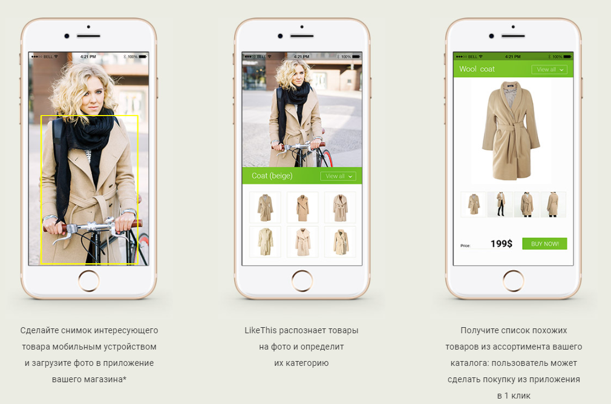
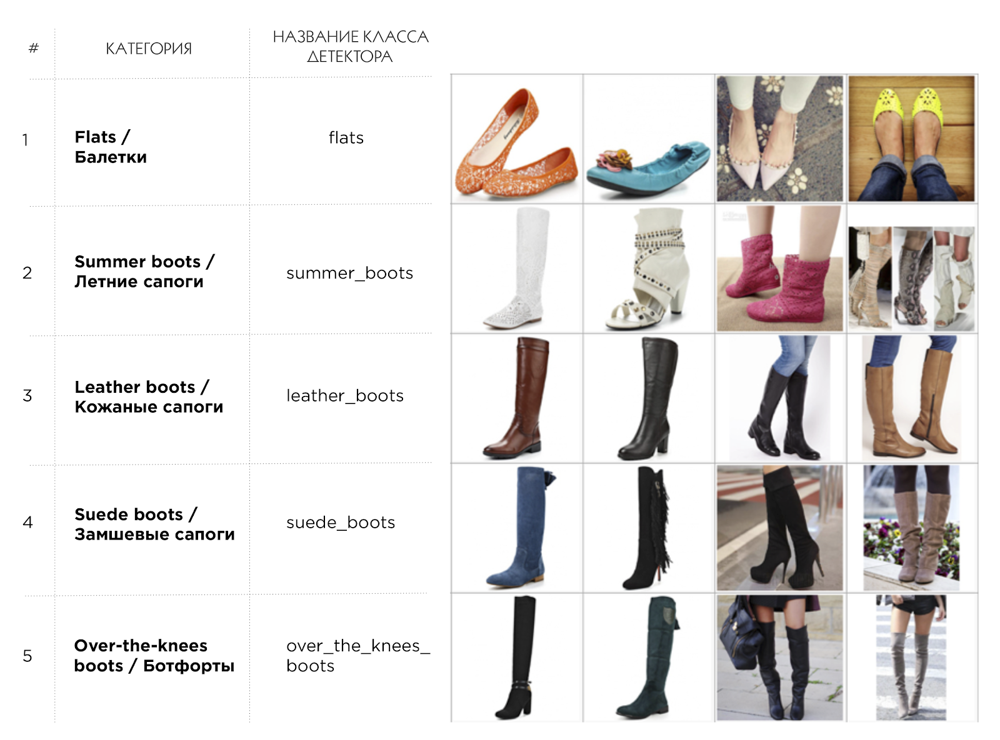
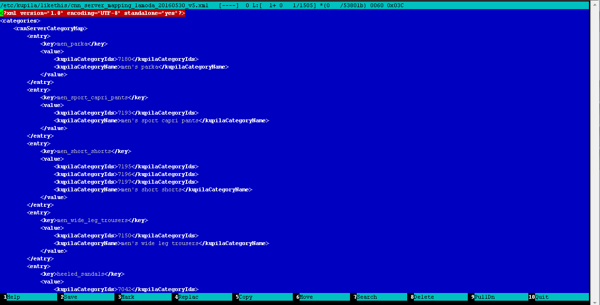
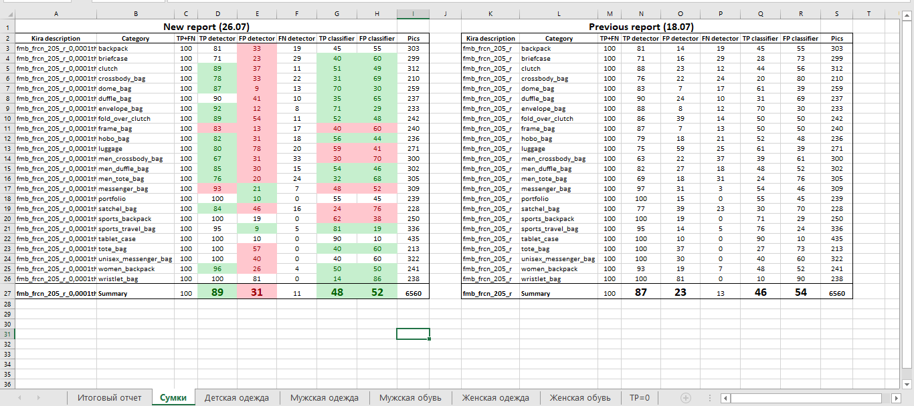
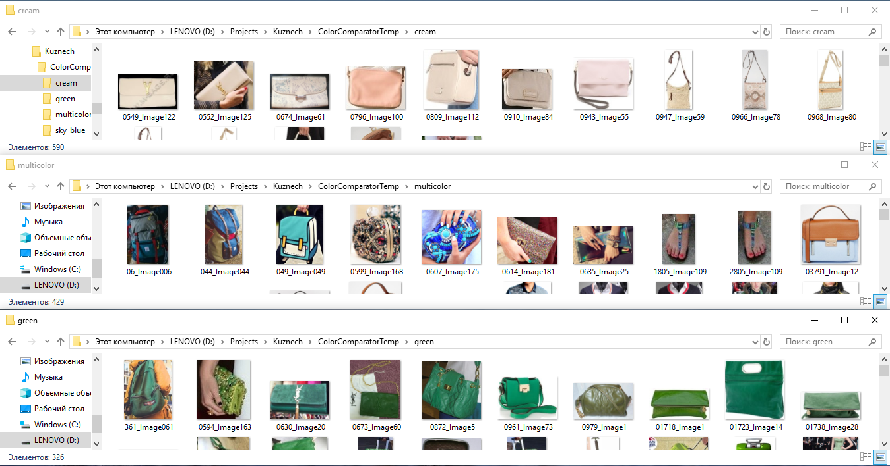

Как мы создали рекомендательный сервис по подбору одежды на нейронных сетях

В этой статье я хочу рассказать о том, как мы создали систему поиска похожей одежды (точнее одежды, обуви и сумок) по фотографии. То есть, выражаясь бизнес-терминами, рекомендательный сервис на основе нейронных сетей.

Как и большинство современных IT-решений, можно сравнить разработку нашей системы со сборкой конструктора Lego, когда мы берем много маленьких деталек, инструкцию и создаем из этого готовую модель. Вот такую инструкцию: какие детали взять и как их применить для того, чтобы ваша GPU смогла подбирать похожие товары по фотографии, — вы и найдете в этой статье.

Из каких деталей построена наша система:

*   детектор и классификатор одежды, обуви и сумок на изображениях;
*   краулер, индексатор или модуль работы с электронными каталогами магазинов;
*   модуль поиска похожих изображений;
*   JSON-API для удобного взаимодействия с любым устройством и сервисом;
*   веб-интерфейс или мобильное приложение для просмотра результатов.

В конце статьи будут описаны все “грабли”, на которые мы наступили во время разработки и рекомендации, как их нейтрализовать.

### Постановка задачи и создание рубрикатора

Задача и основной use-case системы звучит довольно просто и понятно:

*   пользователь подает на вход (например, посредством мобильного приложения) фотографию, на которой присутствуют предметы одежды и/или сумки и/или обувь;
*   система определяет (детектирует) все эти предметы;
*   находит к каждому из них максимально похожие (релевантные) товары в реальных интернет-магазинах;
*   выдает пользователю товары с возможностью перейти на конкретную страницу товара для покупки.

Говоря проще, цель нашей системы — ответить на знаменитый вопрос: “А у вас нет такого же, только с перламутровыми пуговицами?”  
  
Перед тем как бросаться в омут кодинга, разметки и обучения нейронных сетей, необходимо довольно четко определиться с теми категориями, которые будут внутри вашей системы, то есть те категории, которые будет детектировать нейронная сеть. Тут важно понимать, что, чем шире и детальнее список категорий, тем он является более универсальным так как большое количество узких небольших категорий типа mini-dress, midi-dress, maxi-dress всегда можно в “одно касание” объединить в одну категорию типа dress, НО НЕ наоборот. Другими словами, рубрикатор нужно хорошо продумать и составить в самом начале проекта, чтобы потом не переделывать по 3 раза одну и ту же работу. Мы составляли рубрикатор, взяв за основу несколько крупных магазинов, таких как Lamoda.ru, Amazon.com, и постарались сделать его с одной стороны максимально широким, с другой стороны максимально универсальным для того, чтобы в дальнейшем проще было связать категории детектора с категориями различных интернет магазинов (о том, как сделать эту связку я подробнее расскажу в разделе краулера и индексатора). Вот пример того, что получилось.

  
_Пример категорий рубрикатора_

В нашем каталоге на данный момент всего 205 категорий: женская одежда, мужская одежда, женская обувь, мужская обувь, сумки, одежда для новорожденных. Полная версия нашего классификатора доступна [по ссылке](http://likethis.me/files/Fashion_Classifier_Ru.pdf).

### Индексатор или модуль работы с электронными каталогами магазинов

Для того чтобы искать в дальнейшем похожие товары, нам необходимо создать обширную базу того, среди чего мы будем искать. По нашему опыту качество поиска похожих изображений напрямую зависит от размера поисковой базы, которая должна превышать как минимум 100К изображений, а лучше 1М изображений. Если вы добавите в базу 1-2 небольших интернет-магазина, то скорее всего не получите впечатляющих результатов просто потому что в 80% случаев ничего действительно похожего на искомую вещь нет в вашем каталоге.

Итак, чтобы создать большую базу изображений нужно обрабатывать каталоги различных интернет-магазинов, вот что включает в себя этот процесс:

*   для начала нужно найти XML-фиды интернет-магазинов, обычно их можно найти либо в свободном доступе в интернете, либо запросив у самого магазина, либо в различных агрегаторах типа Admitad;
*   фид обрабатывается (парсится) специальной программой — краулером, который скачивает все изображения из фида, складывает их на жесткий диск (точнее на сетевое хранилище, к которому подключен ваш сервер), записывает всю мета-информацию о товарах в БД;
*   далее запускается другой процесс — индексатор, который рассчитывает для каждого изображения бинарные 128-размерные вектора признаков. Можно объединить краулер и индексатор в один модуль или программу, но у нас исторически сложилось, что это были разные процессы. Это в основном было связано с тем, что изначально мы рассчитывали дескрипторы (хеши) для каждого изображения распределенно на большом парке машин, так как это был весьма ресурсоемкий процесс. Если вы работаете только с нейронными сетями, то вам хватит 1й машины с GPU;
*   бинарные вектора записываются в БД, все процессы завершаются и вуаля — ваша база товаров готов к дальнейшему поиску;
*   но еще остается одна маленькая хитрость: так как все магазины имеют различные каталоги с различными категориями внутри, то вам необходимо сопоставить категории всех фидов, которые содержатся в вашей БД с категориями детектора (точнее классификатора) товаров, мы называем это процессом создание маппинга. Это ручная рутинная, но весьма полезная работа, во время которой оператор, редактируя вручную обычный XML-файл, сопоставляет категории фидов в БД с категориями детектора. Вот что в итоге получается:

  
_Пример файла маппинга категорий: классификатора-категорий каталога_

### Детектирование и классификация

Для того чтобы найти что-то похожее на то, что наш глаз обнаружил на фотографии, нам необходимо это “что-то” сначала задетектировать (то есть локализовать и выделить объект). Мы прошли долгий путь по созданию детектора, начиная с обучения каскадов OpenCV, которые вообще не заработали на данной задаче, и заканчивая современной технологией детектирования и классификации [R-FCN](https://arxiv.org/pdf/1605.06409.pdf) и классификатора на основе нейронной сети [ResNet](https://arxiv.org/abs/1512.03385).

В качестве данных, которые использовались для обучения и тестирования (так называемые обучающая и тестовая выборки), мы брали всевозможные изображения из интернета:

*   поиск по Google/Яндекс картинкам;
*   сторонние размеченные дата-сеты;
*   социальные сети;
*   сайты модных журналов;
*   интернет магазины одежды, обуви, сумок.

Разметка проводилась при помощи самописного инструмента, результатом разметки стали наборы изображений и *.seg-файлов к ним, в которых хранятся координаты объектов и метки классов для них. В среднем на каждую категорию было размечено от 100 до 200 изображений, общее число изображений по 205 классам составило 65 000.

После того, как готова обучающая и тестовая выборки, мы делали перепроверку разметки, отдавая все изображения другому оператору. Это позволило отфильтровать большое количество ошибок, которые сильно влияет на качество обучения нейронной сети, то есть детектора и классификатора. Затем мы запускаем обучение нейронной сети стандартными средствами и “снимаем” очередной снепшот нейронной сети “с пылу с жару” через несколько дней. В среднем время обучения детектора и классификатора на объеме данных 65 000 изображений на GPU порядка Titan X составляет примерно 3 дня.

Готовую нейронную сеть необходимо как-то проверить на качество, то есть оценить стала ли текущая версия сети лучше предыдущей и на сколько. Как это делали мы:

*   тестовая выборка состояла из 12 000 изображений и была размечена точно таким же образом как обучающая;
*   мы написали небольшой инструмент, который прогонял всю тестовую выборку через детектор и составлял таблицу такого вида(полная версия таблицы доступна [по ссылке](http://likethis.me/files/QualityReport_fashion205_r_0,0001thr_26.07.xlsx));
*   эта таблица добавляется в Excel на новую вкладку и сравнивается с предыдущей вручную либо при помощи встроенных формул Excel;
*   на выходе мы получаем общие показатели TPR/FPR детектора и классификатора по всей системе в и по каждой категории по отдельности.

  
_Пример таблицы-отчета по качеству детектора и классификатора_

### Модуль поиска похожих изображений

После того как мы задетектировали предметы гардероба на фотографии, запускаем механизм поиска похожих изображений, вот как он функционирует:

*   для всех вырезанных фрагментов изображения (задетектированных товаров) рассчитываются нейросетевые 128-битные бинарные вектора признаков по форме и по цвету (откуда они берутся вектора смотрите ниже);
*   такие же вектора, рассчитанные ранее на этапе индексации, для всех изображений товаров, хранящихся в БД уже загружены в RAM компьютера (так как для поиска похожих нужно будет производить большое количество переборов и попарных сравнений, мы загрузили всю БД сразу в память, что позволило повысить скорость поиска в десятки раз, при этом база примерно в 100 тыс. товаров влезает не более чем в 2-3 ГБ оперативной памяти);
*   из интерфейса либо из захардкоженных свойств приходят коэффициенты поиска для данной категории, например в категории “платье” мы ищем больше по цвету, чем по форме (например 8-к-2 поиск цвет-форма), а в категории “туфли на каблуке” ищем 1-к-1 форма-цвет так как и форма и цвет здесь одинаково важны;
*   далее вектора для кропов (фрагментов) с входного изображения попарно сравниваются с изображением из базы с учетом коэффициентов (сравнивается расстояние Хэмминга между векторами);
*   в итоге на каждый вырезанный фрагмент-товар формируется массив похожих товаров из БД, также для каждого товара назначается вес (по простой формуле с учетом нормировки, чтобы все веса были в диапазоне от 0 до 1) для возможности вывода в интерфейс, а также для дальнейшей сортировки;
*   массив похожих товаров выводится в интерфейс посредством web-JSON-API.

Нейронные сети для формирования нейросетевых векторов по форме и цвету обучаются следующим образом.

1.  Для обучения нейронной сети по форме мы берем все размеченные изображения, вырезаем фрагменты по разметке и распределяем их по папкам в соответствии с классом: то есть все свитера в одной папке, все футболки в другой, а все туфли на высоком каблуке в третьей и т.д. Далее мы обучаем обыкновенный классификатор на основе этой выборки. Тем самым мы как бы “объясняем” нейронной сети свое понимание формы объекта.
2.  Для обучения нейронной сети по цвету мы берем все размеченные изображения, вырезаем фрагменты по разметке и распределяем их по папкам в соответствии с цветом: то есть в папку “green” помещаем все футболки, туфли, сумки и т.д. зеленого цвета (в одной папке скапливаются в итоге вообще любые объекты зеленого цвета), в папку “stripped” мы помещаем все вещи в полоску, а в папку “red-white” все красно-белые вещи. Далее мы обучаем отдельный классификатор по этим классам, как бы “объясняя” нейронной сети свое понимание цвета вещи.

  
_Пример разметки изображений по цвету для получения нейросетевых векторов признаков по цвету._

Интересно, что подобная технология отлично работает даже на сложных фонах, то есть когда фрагменты вещей вырезаются не четко по контуру (маской), а по прямоугольной рамке, которую определил разметчик.

Поиск похожих сделан на основе извлечения бинарных векторов признаков из нейронной сети таким образом: берётся выход предпоследнего слоя, сжимаем, нормализуем и бинаризуем. В нашей работе мы сжимали до 128-битного вектора. Можно делать немного по-другому, например как описано в статье Yahoo «[Deep Learning of Binary Hash Codes for Fast Image Retrieval](http://www.iis.sinica.edu.tw/~kevinlin311.tw/cvprw15.pdf)», но суть всех алгоритмов примерно одна — похожие изображению ищутся при помощи сравнения свойств, которыми оперирует нейронная сеть внутри слоев.

Изначально в качестве технологии поиска похожих изображений мы использовали хеши или дескрипторы изображений, основанные (точнее рассчитанные) по определенным математическим алгоритмам, таким как оператор Собеля (или контурный хеш), алгоритм SIFT (или особые точки), построение гистограммы или сравнение количества углов на изображении. Эта технология работала и давала какой-то более или менее вменяемый результат, но ни в какое сравнение с технологией поиска похожих изображений на основе свойств, выделенных нейронной сетью хеши не идут. Если попробовать объяснить разницу в 2х словах, то алгоритм сравнения изображений на основе хешей — это “калькулятор”, который настроили на сравнение картинок по какой-то формуле и он непрерывно работает. А сравнение с помощью признаков из нейронной сети — это “искусственный интеллект”, обученный человеком решать определенную конкретную задачу определенным образом. Можно привести такой грубый пример: если вы будете искать хешами свитер в черно-белую полоску, то вы с большой вероятностью найдете в качестве похожих просто все черно-белые вещи. А если будете искать при помощи нейронной сети, то:

*   на первых местах найдете все свитера с черно-белыми полосами,
*   затем все черно-белые свитера
*   и затем все свитера в полоску.

  

### JSON-API для удобного взаимодействия с любым устройством и сервисом

Мы создали простое и удобное WEB-JSON-API для общения нашей системы с любыми устройствами и системами, что, конечно, не является каким-либо новшеством, а скорее хорошим крепким стандартом разработки.

### Веб-интерфейс или мобильное приложение для просмотра результатов

Для визуальной проверки результатов, а также для демонстрации системы заказчикам мы разработали простенькие интерфейсы:

*   веб-интерфейс,[http://demo.likethis.me/](http://demo.likethis.me/)
*   мобильное приложение доступно [по ссылке](http://likethis.me/files/visualsearch-android-client.apk)

  

### Ошибки, которые были совершены в проекте

  

*   Изначально нужно более четко определять задачу и именно, исходя из задачи, подбирать фотографии для разметки. Если нужен поиск по UGC (User Generated Content) фотографиям — это один кейс и примеры для разметки. Если нужен поиск по фото из глянцевых журналов — это другой кейс, а если нужен поиск по фото, где один крупный объект расположен на белом фоне — это уже отдельная история и совсем другая выборка. Мы же смешали все это в одну кучу, что повлияло на к качеству работы детектора и классификатора.
*   На фотографиях всегда нужно размечать ВСЕ объекты, по крайней мере из того, что хоть как-то подходит под вашу задачу, например при подборе похожего подбора гардероба нужно было сразу разметить все аксессуары (бусы, очки, браслеты и т.д.), головные уборы и т.д. Потому что теперь, когда мы имеем огромную обучающую выборку, для того чтобы добавить еще одну категорию нам нужно переразметить ВСЕ фотографии, а это весьма объемная работа.
*   Детектирование скорее всего лучше проводить масковой сетью, переход к Mask-CNN и современному решению на основе Detectron является одним из направлений развития системы.
*   Неплохо было бы сразу решить каким образом вы собираетесь определять качество подбора похожих изображений — тут есть 2 метода: “на глазок” и это самый простой и дешевый метод и 2й — “научный” метод, когда вы собираете данные от “экспертов”(людей, которые тестирую ваш алгоритм поиска похожих) и на основе этих данных формируете тестовую выборку и каталог именно для поиска похожих изображений. Этот метод хорош в теории и выглядит довольно убедительно(для вас самих и для заказчиков), но на практике его реализация оказывается непростой и довольно дорогой.

  

### Заключение и дальнейшие планы развития

Данная технология вполне готова и пригодна для использования, сейчас она функционирует у одного из наших заказчиков в интернет-магазине в качестве рекомендательного сервиса. Также недавно мы взялись за разработку подобной системы в другой отрасли (то есть работаем теперь с другими типами товаров).

Из ближайших планов: перевод сети на Mask-CNN, а также переразметка и доразметка изображений для повышения качества работы детектора и классификатора.

В заключении хочется сказать, что по нашим ощущениям подобная технология и вообще нейронные сети способны решить до 80% сложных и высокоинтеллектуальных задач, с которыми ежедневно встречается наш мозг. Вопрос только в том, кто первым реализует подобную технологию и разгрузит человека от рутинной работы, освободив ему пространство для творчества и развития, что и является, по нашему мнению, высшим предназначением человека!

### Список литературы

  

*   [Технология R-FCN](https://arxiv.org/pdf/1605.06409.pdf)
*   [Нейронная сеть ResNet](https://arxiv.org/abs/1512.03385)
*   [Поиск похожих изображений при помощи нейронной сети](http://www.iis.sinica.edu.tw/~kevinlin311.tw/cvprw15.pdf)