Как организовывать Knowledge Sharing внутрь и наружу / Блог компании Lamoda

Какой путь видит неподготовленный тимлид, когда возникает необходимость чему-то научить своих коллег, будь то команда разработчиков или люди, которые сопровождают, поддерживают или продают его продукт? Правильно — слепить презентацию на 100500 слайдов, забронировать переговорку или конференц-зал, кинуть приглашение на почту, и ждать, что все отдаленно заинтересованные сами придут и сами приложат усилия, чтобы разобраться в вопросе. Нетрудно догадаться, что шанс на успех такого мероприятия равен 0,00%.

А вот почему именно, и как на самом деле нужно подходить к передаче знаний внутри компании, чтобы добиться результата, знает **Евгения Голева** ([cheaffa](https://habr.com/ru/users/cheaffa/)). И нам на [TeamLead Conf](http://teamleadconf.ru/) рассказала, а теперь и с вами поделится многолетним опытом обучения взрослых.

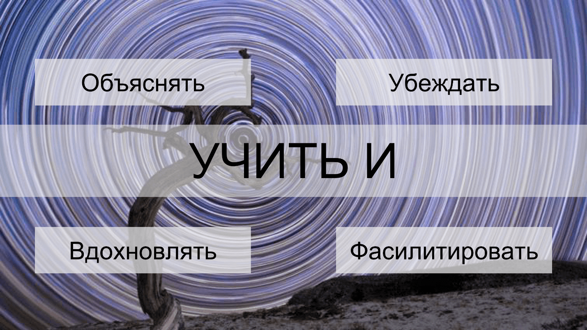  
  
**О спикере:** Евгения Голева уже 10 лет занимается обучением взрослых, в последнее время совмещает это с работой деврелом в Tech.Lamoda.

Вопреки расхожему мнению, Ламода — это не просто интернет-магазин, а огромная логистическая система. Сам сайт — это всего 10% разработки, ещё есть автоматизированный склад размером с футбольное поле (представьте себе еще 5 этажей вверх), собственная служба доставки в 600 городов, 3 колл-центра. Мировые fashion-бренды покупают у Ламоды услуги логистики в России и СНГ.

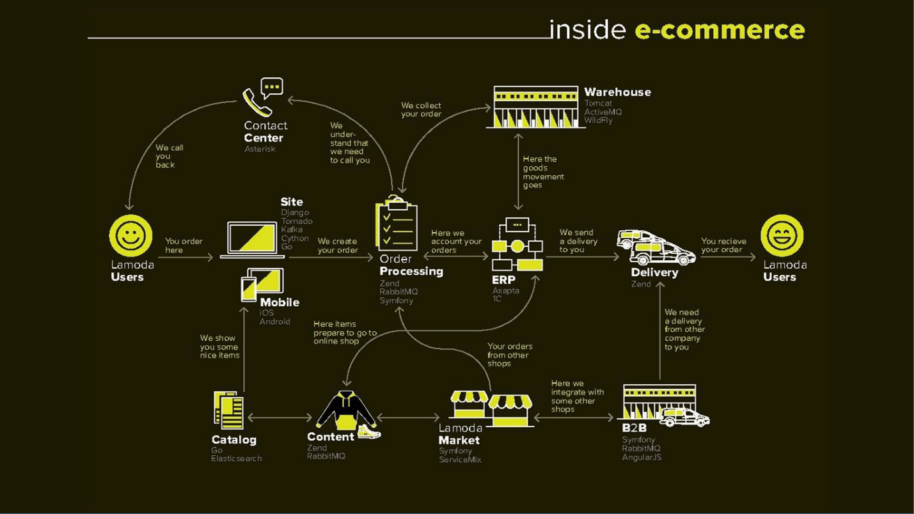

300 IT-специалистов разрабатывают и поддерживают более 100 внутренних сервисов, которыми пользуются все 5000 сотрудников. **Knowledge sharing происходит постоянно**. Большинство пользователей — это внутренние сотрудники. Иногда бывает так, что тимлиду приходится учить не только пользователей, но еще и соседние команды, новых сотрудников в своих командах и вообще всех, если появляются новые технологии. Временами хорошо бы поучить заказчиков, потому что они требуют невозможного.

На примере нескольких кейсов из будней Ламоды проиллюстрирую основные принципы обучения взрослых, которые вы сможете применять в своей работе.

Буду использовать следующую терминологию:

*   **Я — учитель.** В ситуации, когда либо я сам учу людей, либо я заказчик.
*   **Они, целевая аудитория — группа.**

  

## Кейс «Обучение разработчиков ERP»  

Запрос на обучение обычно выглядит следующим образом:

_— Есть ограничения: примерно столько времени, 2-3 презентации, 2 статьи и какое-то количество человек, которые согласны потратить час. Я приготовил презентацию, как ее сделать лучше, сколько человек и в какое время позвать на обучение?_

При таком подходе КПД мероприятия будет стремится к нулю, и вот почему.

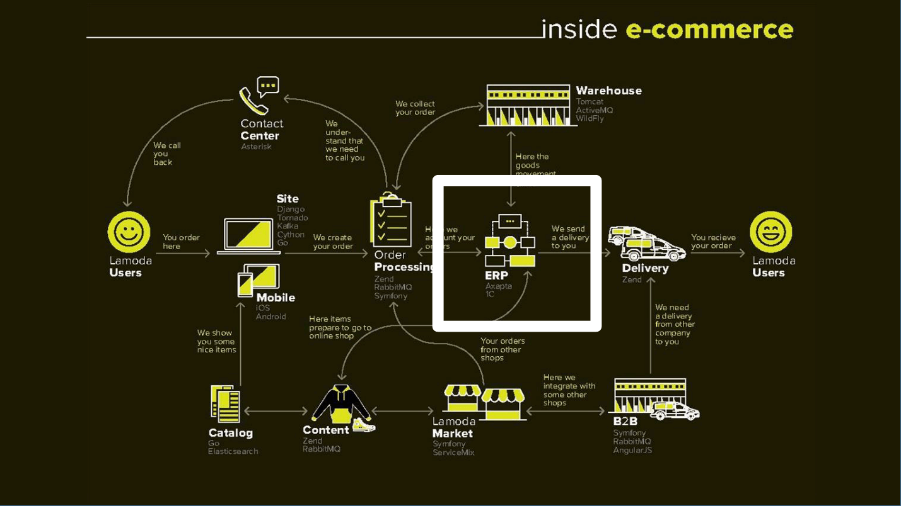

У нас есть ERP — финансовая система учета, которая состоит из двух частей:

1.  Axapta, потому что мы международная компания.  
    
2.  1С, потому что зарплату платим в России, Казахстане, Украине и Беларуси.  
    

ERP взаимодействует со всеми остальными системами. Кроме того, внутренних пользователей ERP немало.

Когда ребята из ERP приходят ко мне с предложением рассказать всем нашим разработчикам (300 человек!), как эти системы работают, я достаю из загашника свою схемку (слева учитель — я, справа — ЦА).

Начинаю задавать вопросы — пройдемся по ним по всем.

### Мои проблемы  

_— Никто не понимает, как работают наши системы. Ок, может быть, они и не обязаны? В чем на самом деле проблема? Что горит? Где болит?_

Через несколько итераций выясняется:

*   **Команды забывают важное.** Они учитывают процессы именно Ламоды, забывая про партнерские процессы, которые могут возникнуть в любой момент.
*   **Helpdesk задает много вопросов не по адресу** — не тем разработчикам, отвлекая их от текущей работы, и это не очень хорошо.

Казалось бы, была одна проблема — стало две. Но при этом они стали более конкретными и нам дальше легче понять, что с ними делать.

## Мой результат

Дальше думаем про результат, который хотим получить:

_— Если команды будут учитывать А (делать что-то конкретное), а Helpdesk будет задавать вопросы по адресу и пользоваться документацией, решит ли это проблему? Кажется, не до конца, т.к. еще хорошо бы, чтобы они учитывали Б и В._

Добавляем:

*   **Команды учитывают А, Б и В**.
*   **Helpdesk задает вопросы по адресу и пользуется документацией.**

Мы рассматриваем результат сразу, когда еще только говорим о проблеме, потому что это и есть цель нашего обучения:

1.  Проверяем, решает ли это проблему? Иногда бывает так, что обучение, для которого мы не продумали заранее результат, не решает проблему, а является просто тратой времени.  
    
2.  Результат нас фокусирует на том, что именно нужно вложить в головы людей.  
    

  

### Аудитория  

Кто обычно в команде принимает решения, где важно учитывать А, Б и В? Чаще всего это не вся команда, а только техлид. Поэтому, если про А, Б, В достаточно поговорить с техлидами, то это сокращает целевую аудиторию — нужно учить только техлидов и Helpdesk.

### Проблемы ЦА  

Дальше мы задаем вопрос, какие у ЦА проблемы?

Проблемы довольно очевидны:

*   **Перегруз техлидов информацией **— через них, и правда, проходит много систем.
*   **У Helpdesk аврал, SLA не выдержан**. Причем аврал часто возникает, когда случается инцидент, а поддержка не может найти нужного разработчика и страдает.

Здесь, когда мы ищем проблемы ЦА, мы находим мотивацию — те струны, за которые в дальнейшем будем дергать и пытаться помочь людям. В этом случае мы видим, что у техлидов мотивация, скорее, отрицательная. Занимать их двухчасовой лекцией про сложные системы будет жестоко. Мотивация же Helpdesk высокая, потому что это реально решает их проблемы и помогает в работе.

## Уровень ЦА

Потом мы должны посмотреть на уровень этих людей (у нас две ЦА).

#### Немного теории. Осознанная компетентность  

Схема осознанной компетентности ниже.  
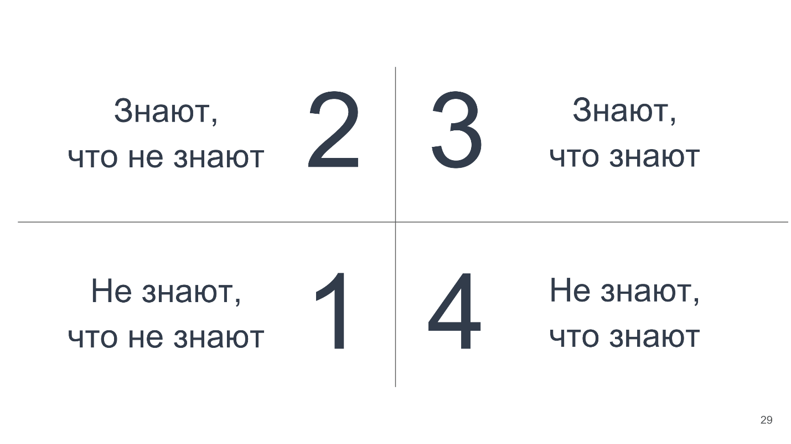

1.  **Не знают, что не знают.** Представьте себе ребенка 4 лет, который впервые увидел красную машинку с человеком за рулем. Он думает: «Вау, как здорово! Я тоже хочу крутить баранку — машинка едет от руля!».
2.  **Знают, что не знают.** В 10 лет ребенок уже догадывается, что машинка едет не от руля, а есть механизмы, которые как-то друг с другом складываются, и ему это предстоит изучить.
3.  **Знают, что знают.** В 18 лет человек идет учиться в автошколу, и там ему рассказывают про правила дорожного движения, как нужно отпустить педаль сцепления, чтобы не заглохнуть на горке. Он учится смотреть в зеркала и выруливать на нужную полосу, включив поворотник. Он страдает, но учится. У него есть длинный чек-лист, что нужно делать.
4.  **Не знают, что знают.** Спустя много лет он уже водит, как дышит: одной рукой бреется, другой достает что-то из кармана, чем он рулит — одному богу известно. И при этом он как-то умудряется еще вписываться в сложные повороты.

Это он уже в четвертом квадрате, но с тех пор, когда он последний раз заглядывал в ПДД, они изменились, и по компетенции ПДД он находится в первом квадранте.

Эта концепция не про уровень человека в целом, а именно про отдельные знания (компетенции). Человек может по разным компетенциям находиться в разных зонах одновременно, как и наш водитель.

Если говорить про обучение, то чаще всего имеется в виду зона 3, которая начинается со знаний.

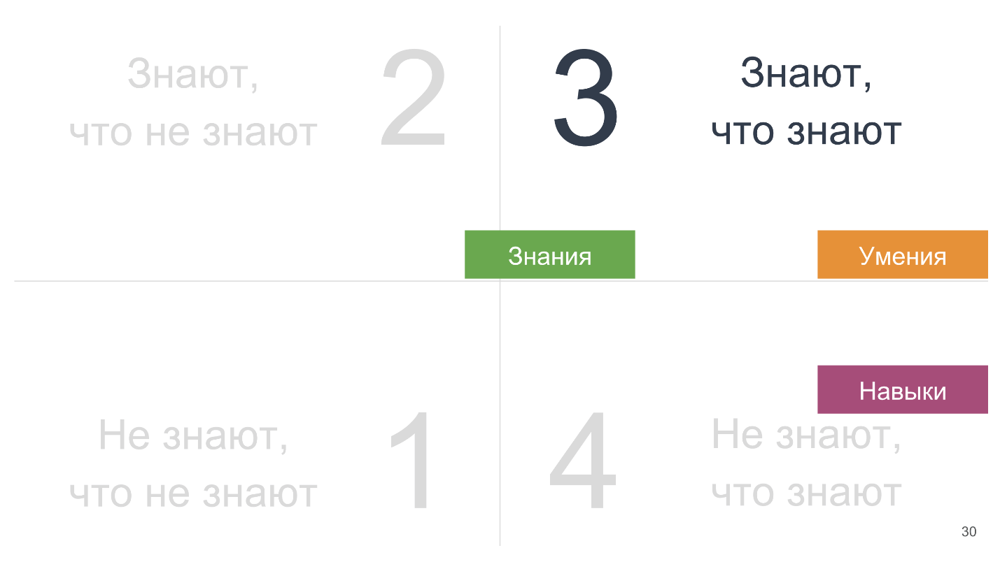

Знания частично находятся в зоне 2: у нас есть некоторый кругозор, но мы не копали вглубь. Знания накапливаются и при практике перетекают в умения — это технологии: делай раз, делай два, делай три — чек-листы от повторения становятся навыками.

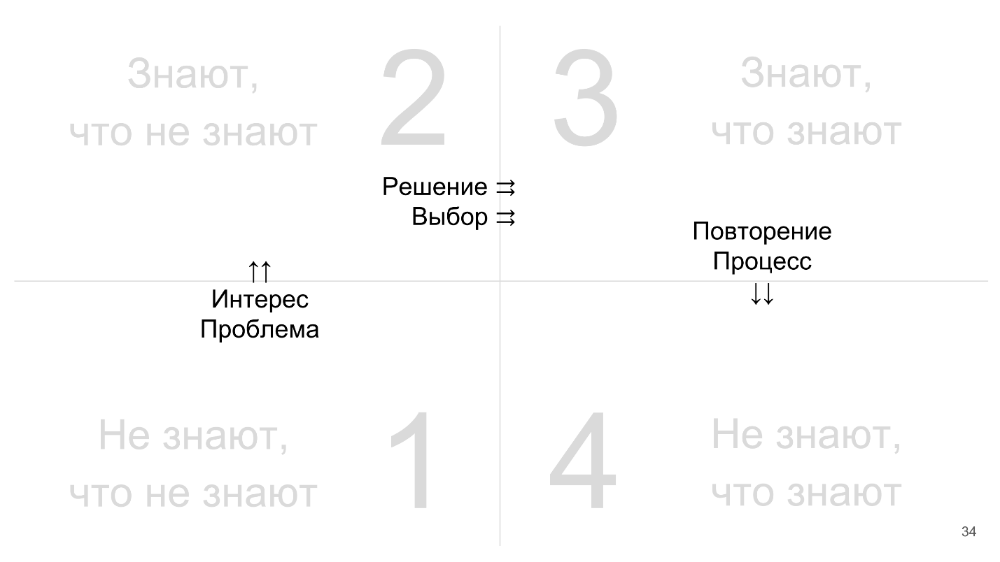

*   Переход **из первой зоны во вторую** происходит с детьми в случае интереса (распахнутые глаза, красная машинка). Но взрослые, к сожалению, уже более черствые, их можно цеплять на проблемы. Лучше, если есть интерес, но надежнее через проблемы.
*   **Из второй зоны в третью** человек переходит, когда у него уже есть отрывочные знания из разных областей. Чтобы выбрать, на какую из них прямо сейчас потратить свое время, принять решение и начать это изучать, требуется очень много энергии.

Многие из нас платили вперед за курсы английского (или любые другие курсы), а потом не ходили. Причины: не до конца принятое решение, не до конца сделанный выбор, слишком мало усилий было положено на осознание, что это нужно, и я буду это делать.

Я на этом так подробно останавливаюсь, потому что чаще начинают учить так: «Смотрите — технология: раз, два, три!» — «Классно, но я еще не готов это воспринять, не готов дойти до конца этого обучения, а вы в меня уже впихиваете». Скорее всего, человек просто отвалится на середине пути.

*   Переход **из третьей зоны в четвертую** происходит через повторение и процесс. Иногда мы научили людей, дали им какую-то технологию, но он не применима в их реальной жизни, их процесс устроен иначе. Важно помнить, что когда вы даете технологию, нужно обязательно проверить, что она подходит — не мешает и помогает.

Осознанная компетентность — это третья зона. Все остальные зоны — это неосознанная и некомпетентность.

Возвращаемся к кейсу с системами ERP, где хотели провести Knowledge Sharing на 300 человек.

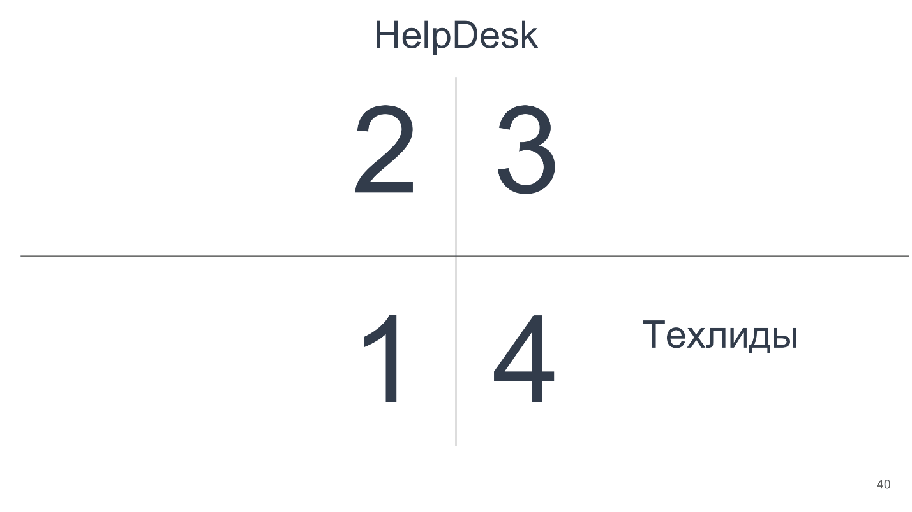

Helpdesk на схеме находится в третьей зоне на границе со второй. Они были бы во второй, если бы мы в первый раз показали им систему и сказали бы начинать ее поддерживать. Но они с ней уже работают, что-то делают и знают — то есть находятся в третьей зоне.

Техлиды находятся в четвертой зоне — они точно знают о том, что надо учитывать А, Б и В, и еще раз рассказывать им про это два часа, скорее, не стоит.

**Как мы решили эту проблему?**

Helpdesk обучали отдельно на двух встречах:

1.  Простая лекция, ответы на вопросы, 2 недели работы.  
    
2.  Через 2 недели лекция посложнее, ответы на появившиеся вопросы.  
    

Таким образом всем было актуально то, что происходит. Они были кровно заинтересованы.

Техлидов не звали на лекции, зато спросили:

_— Как вы это делаете?_

_— У нас такой workflow._

_— Хорошо, давайте мы в этот workflow поместим сюда, сюда и сюда чек-лист, и вы эти А, Б, В будете учитывать._

Ребята были счастливы — наконец-то им помогли сделать их работу.  
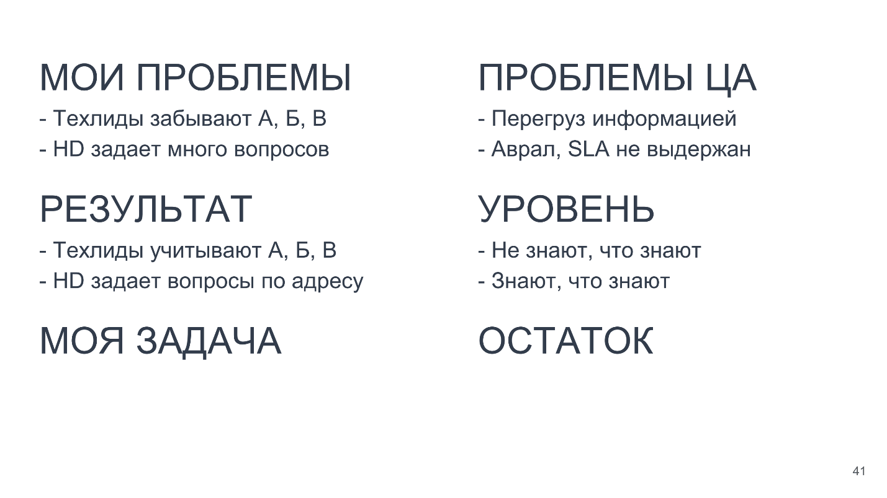

Остались пункты «Моя задача» и «Остаток». Задача в первом случае была учить, а во втором — помочь наладить процесс. Сухой остаток был совсем другой. В дальнейших кейсах вы увидите, как от уровня ЦА меняется наша задача и сухой остаток аудитории.

**Выводы из кейса «Обучение разработчиков ERP»:**

1.  Разный уровень ЦА — это разные подходы. С людьми надо работать по-разному.  
    
2.  Не всегда нужно учить.  
    

Но если не учить, то что?

Давайте посмотрим: у нас есть мои проблемы, проблемы ЦА, мой результат, уровень ЦА, а дальше — моя задача. Как она меняется?

## Новички  

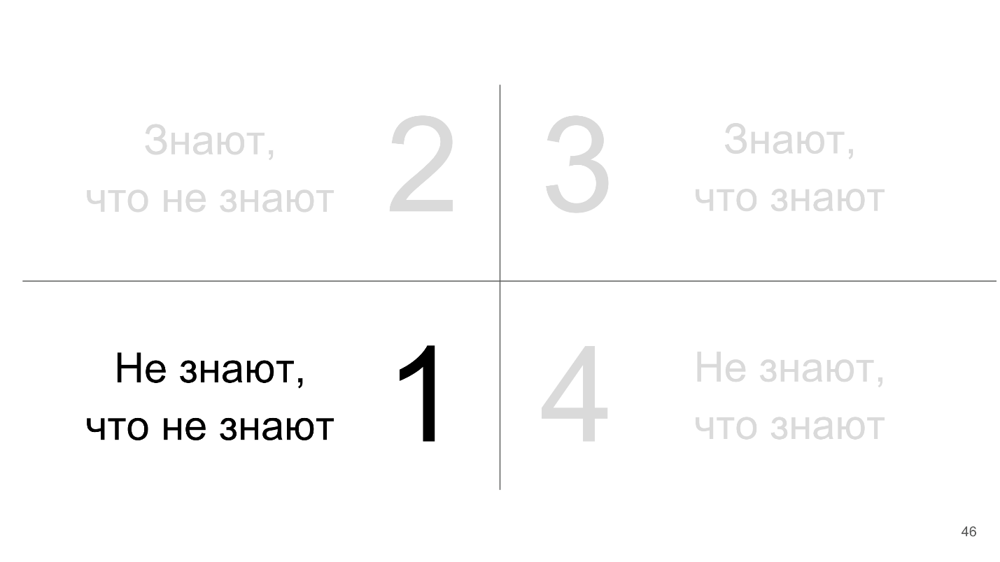

В первой зоне часто находятся новички. Они приходят, ничего не зная про компанию. В этот момент им сложно объяснять, как у нас все работает, лучше хотя бы какую-то карту дать. Здесь мы не учим, а решаем две задачи:

1.  самая простая — не демотивировать, **не напугать**;
2.  **заинтересовать** — это о тех самых горящих глазах.

Таким образом, наша задача, скорее, вдохновлять, а не учить. Горящие глаза сами собой не появятся, их кто-то должен зажечь.

## Кейс «Найм тестировщиков»  

Ко мне приходит руководитель QA и жалуется, что HR выбирают резюме неподходящих кандидатов, и просит помочь разобраться. Смотрим — рекрутеры «плавают» в базах данных, пишут кандидатам странное, не относящееся к делу.

Самая простая мысль — поменять рекрутеров. Но мы решили их учить. Вообще учить рекрутеров полезно — откуда они иначе узнают то, что нам нужно?

Рекрутеры находятся в зоне 2 нашей схемы, то есть «знают, что не знают» — о чем-то что-то слышали, но не очень понимают.

Какой **результат** хотелось бы получить от их обучения? Естественно, мы не ожидаем, что они внезапно начнут разбираться в базах. Хорошо бы, чтобы HR:

*   понимал, о чем говорит кандидат;
*   владел терминологией, которую можно погуглить.

Тогда **задача учителя**:

*   объяснить очень просто, без усложнений (это не все могут);
*   дать карту для ориентира.

**В остатке** получим ожидаемый результат: понимают, что говорят; знают ключевые слова.

История закончилась тем, что руководитель QA провел три встречи, на которых HR-специалисты прямо разворачивали БД, открывали окошки, посылали запросы, получали какие-то данные. Так они запомнили гораздо больше, чем если бы прослушали обзорную лекцию на 40 минут с определениями. Так удалось эффективно решить задачу объяснить «на пальцах».

## Кейс «Стажеры-аналитики»  

В следующем примере человек на грани из второй зоны в третью.

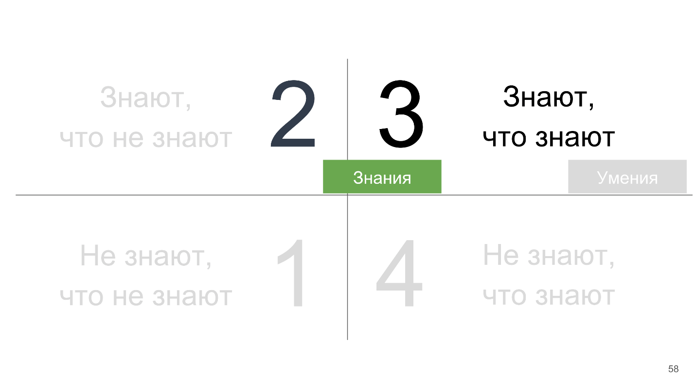

Каждый год мы набираем группу стажеров в аналитику. Довольно распространена практика — чтение курса лекций по БД, просто чтобы сопоставить терминологию, принятую в университете, и сленг в компании. Они с этим пойдут работать, и у них все будет хорошо.

Но мы подумали глубже. Здесь на самом деле **проблема** **целевой аудитории** — не проблема, а искреннее желание научиться. Та самая мотивация. Люди очень хотят учиться (ещё и за зарплату)! Именно эта ситуация идеальна для обучения.

**Результат**, который мы ожидаем:

*   меньше вопросов и ошибок определенных типов;
*   выше скорость работы.

Это измеряемые метрики, которые можно записывать и оценивать результаты обучения — то, что мы любим, и что позволяет понять, зачем мы потратили время.

**Задача:**

*   дать технологию;
*   показать шорткаты.

**Остаток:** то самое умение — раз, два, три.

Мы сделали сессию с прикладными задачами. Каждую неделю стажёрам за 10-15 минут рассказывали про какой-то способ решения, предлагали его попробовать. Если не получалось, разбирали, почему. Дальше стажеры еще практиковались на месте, неделю занимались ровно этими же задачами, после чего переходили на следующую тему.

Мы использовали так называемый [цикл Колба](https://ru.wikipedia.org/wiki/%D0%9C%D0%BE%D0%B4%D0%B5%D0%BB%D1%8C_%D0%9A%D0%BE%D0%BB%D0%B1%D0%B0).

Когда вы приходите на тренинг, вам обычно дают диагностическое упражнение. Если вы владеете навыком, на развитие которого направлен тренинг, то вы делаете это упражнение легко, играючи. Чаще же его проваливают, потому что навыка не хватает. В этот момент вы обдумываете полученный опыт, почему же а вас не получилось, и хотите узнать, как было нужно. Тут выходит тренер, или вы сами набрасываете идеи — как можно было сделать лучше, то есть собираете технологию, критически обдумываете и возводите на уровень абстракции: «Можно было так сделать». Дальше придумываете теорию и потом с этой теорией приступаете к следующему упражнению, в нем ее применяете («Кажется, работает!»), и уходите в жизнь, повторяя это раз за разом. Это и есть цикл Колба.

Если задача — учить людей именно умению или технологии, то удобно применять метод Колба.

Когда люди в третьей зоне и, казалось бы, знают и умеют, что может пойти не так?

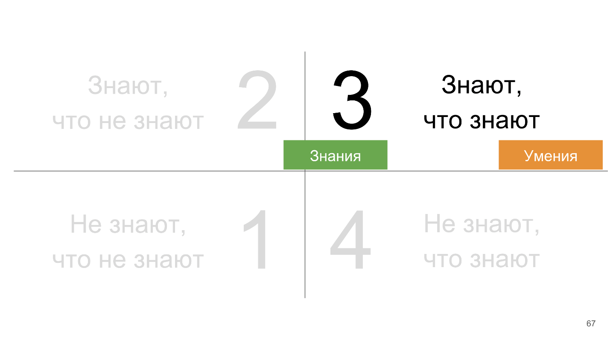

## Кейс «Падает база»  

Приходит ко мне Оля из BI (Business Intelligence) и говорит: «Раз в неделю у нас падает база, и кажется ее роняют маркетологи. Что делать?».

Можно, конечно, прийти к маркетологам и сказать: «Вы пишете плохие запросы — так не делайте! Делайте так». Куда мы после этого пойдем? Скорее всего, далековато. Поэтому мы пошли другим путем.

У нас **проблема** — падает база раз в неделю.

В **результате** мы хотим, чтобы люди:

*   перестали делать X;
*   начали делать Y — так, как нам надо.

А у них такой проблемы нет, но есть интерес или другая **проблема** — они бы хотели:

*   получать данные точнее;
*   получать данные быстрее.

Вообще, маркетологи не виноваты — у них огромное количество данных эпичного размера. Для того, чтобы построить прогноз поведения пользователей, они действительно берут данные из базы как могут, не думая про оптимизацию запросов. Это не в зоне их интересов. Если подумать над их проблемами и найти, как помочь, то люди с большей благосклонностью примут нашу помощь и обучение.

Наша **задача** — с одной стороны, решить проблемы маркетологов, с другой стороны — убедить их делать иначе (Y). Чтобы мы могли их убедить, в сухом **остатке** должна остаться какая-то фактология, что если делать Y, то получится лучший результат, чем если делать X.

Мы провели несколько сессий по SQL advanced для маркетинга. До этого ребята из BI пришли, сели с маркетологами, посмотрели, как они делают запросы, задали вопросы, зачем, почему. Подготовка была довольно длительной. После этого BI поняли, как помочь получать более качественные данные и не ронять каждый раз базу.

Это сработало — маркетологи с радостью пришли и начали учиться. Если бы этого не произошло, а просто стояло в календаре: «Приходите учиться SQL», они бы сказали: «Мы знаем SQL, не пойдем — у нас есть другие задачи!».

Таким образом, одна из моих задач как учителя — все-таки убеждать людей, а не только учить.

## Кейс «Фидбэк тимлидам для руководителей»  

Приходит ко мне руководитель разработки и предлагает: «Давай проведем обучение для руководителей отделов, как давать фидбэк тимлидам». Я задумалась: руководители отделов не первый год работают — наверное, они уже не раз давали фидбэк, и умеют это делать. Кажется, что они в четвертой зоне.  
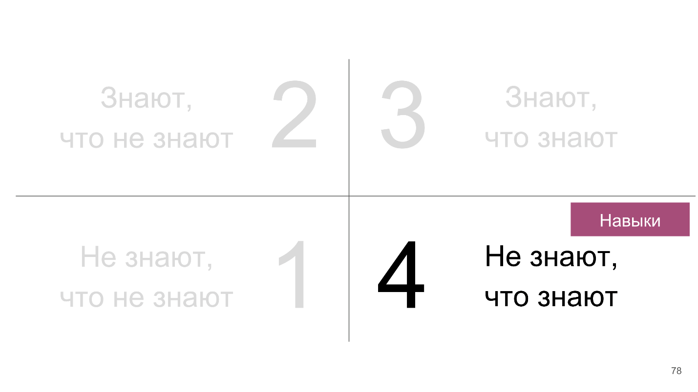

В чем на самом деле **проблема**? На Performance Review оказывается, что подходы к тимлидам в разных отделах несколько разные, за счет чего карьерное развитие людей, которые могли бы переходить из одного отдела в другой тимлидами, усложняется. Требования разные — непонятно, что делать.

Какой **результат** мы ожидаем? Мы бы хотели, чтобы у нас был единый подход во всех отделах.

Какая **проблема у руководителей отделов**? В целом и у них эта проблема есть, но не то, чтобы она была первостепенной. Однако можно зайти с другой стороны:

*   на других посмотреть;
*   себя показать.

**Задача:** давайте посмотрим на кейсы — кто как работает, кто с чем сталкивался, обменяемся опытом, систематизируем его. В сухом **остатке** ребята выходят со сложными кейсами и теперь уже могут хотя бы приблизительно представлять, как их решать.

Мы поработали над проблемой ЦА, теперь нужно поработать на свою задачу: выработать общие правила. В сухом остатке для того, чтобы получить наш результат, они должны не только правила выработать, но еще и согласиться, что действительно нужно делать единый подход, и принять решение придерживаться общих правил.  
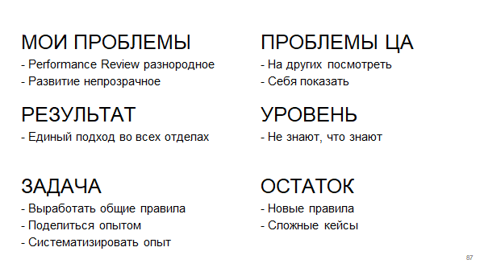

Если посмотреть на задачу чуть глубже — не просто обучение фидбэку, как просит заказчик, — то можно прийти к формату разбора сложных кейсов. Это тоже требует длительной подготовки: нужно прийти к каждому, сесть напротив него и спросить: «Дорогой, а что у тебя болит? Как у тебя это происходит? Какие сложные случаи были?».

Чтобы сделать качественное обучение, хорошо бы все-таки говорить о том, что болит у них, параллельно продвигая свои интересы.

Итак, одна из наших задач — помогать принимать решения.

## Рамки  

Когда мы посмотрели и на проблемы, и на результаты, и на уровень, определили свою задачу и какой сухой остаток люди вынесут, можно начинать говорить про ограничения. Мы помним, что у нас есть ограничения:  

Но еще часто забывают, что в первой колонке есть **бюджет**. Иногда он ненулевой, и его можно использовать.

**Важное замечание:** Многие думают, что учитель хорош, когда он в четвертой зоне — там, где водит машину, закрыв глаза. Это ошибочное мнение, потому что **лучшие учителя возникают из людей из третьей зоны**. Они осознают, что происходит, знают методологию и по ней могут объяснить. Поэтому не всегда эффективно учить самому. Если вы классно коммуницируете, но не можете объяснить, почему вы так делаете, каким именно методом, то лучше позвать человека, который находится в более осознанной зоне и может разложить по полочкам методологию. Иногда эффективнее потратить бюджет, чем делать это самому.

Во второй колонке иногда забывают про **процессы**. Я уже говорила, что процесс может как ограничивать, так и помогать. Думайте о процессе, вспоминайте о нем — может быть, его можно доработать так, чтобы было удобно людям делать то, что вы хотите, и не всегда для этого их нужно учить.

## Решение!  

Теперь наконец можно говорить про решение и обсуждать формат:

*   Индивидуально / 6 малая группа / 12-16 тренинговая группа / х * 12.
*   Лекция / встреча / демо / тренинг / воркшоп / деловая игра / симуляция.
*   Разовая / несколько встреч / регулярный клуб.
*   Рабочее / нерабочее время.
*   Будни / Выходные.
*   1 час / 2-4 часа / 8 часов в день.
*   Утро / обед / вечер.

Важный параметр — количество занятий. Некоторые навыки без регулярного повторения не усваиваются. Если дать человеку один раз технологию, скорее всего он ее не усвоит. Поэтому у нас есть, например, клуб спикеров, о котором я [рассказывала](https://youtu.be/Eqtzj2JIJQw) в феврале, куда люди регулярно приходят и учатся публично выступать. Если не повторять, люди вместо того, чтобы из третьей зоны перейти в четвертую, сваливаются во вторую. Некоторые вещи обязательно нужно регулярно повторять.

## Итоги  

  

*   **Проблемы ЦА — это ее мотивация.** На это важно смотреть, и это большая подготовительная работа. Даже если не вы сами учите, а заказываете обучение, к вам приходят несчастные HR и спрашивают: «Какие же у вас там проблемы?», важно не выдать свои проблемы за проблемы людей. Чаще всего это разные проблемы. Если люди из Training&Development будут решать ваши проблемы, они не попадут в ЦА. Важно знать, что же на самом деле болит у людей, как вы можете им помочь.
*   **Разный уровень — разная задача.** Не нужно пытаться учить людей в зоне 1, 2, 4! Старайтесь правильно оценивать этот уровень.
*   **Не всегда нужно учить**. Но если учите, то делайте это по Колбу.

**Учить и...**

Помимо обучения хорошо бы уметь вдохновлять, объяснять, убеждать, фасилитировать и настраивать процессы.

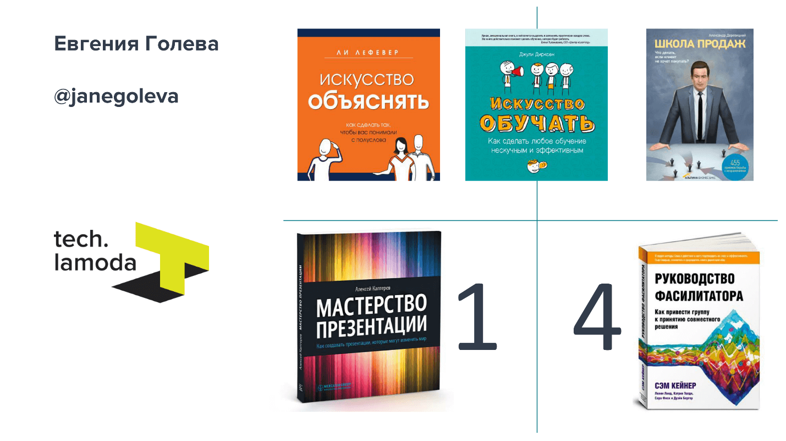

Про это все рассказывается в книжках, которые я для вас собрала — они размещены на схеме как раз в тех зонах, в которых они нужны.

> Больше полезных рекомендаций по работе с командами можно будет получить на [TeamLead Conf](http://teamleadconf.ru/moscow/2019/) в Москве 25 и 26 февраля. А конкретно управление знаниями обсудим на **KnowledgeConf 26 апреля,** начиная с того, какие инструменты использовать для документации, как снижать риски, до того, как быстрее онбордить новых сотрудников и бороться с автобусным фактором. [Подавайте заявки](https://conf.ontico.ru/lectures/propose?conference=kc2019), если шарите в knowledge sharing как Евгения!
> 
> Подписка на [рассылку](http://eepurl.com/bPteUf) поможет не пропустить новинки, такие как эта статья-расшифровка.