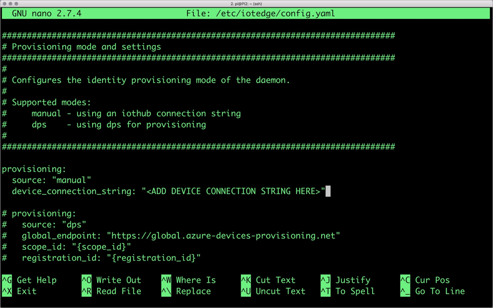
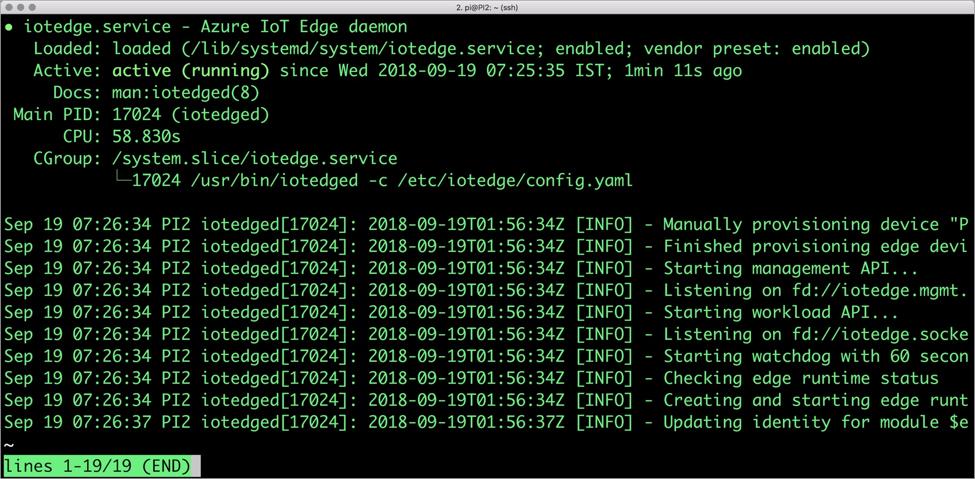
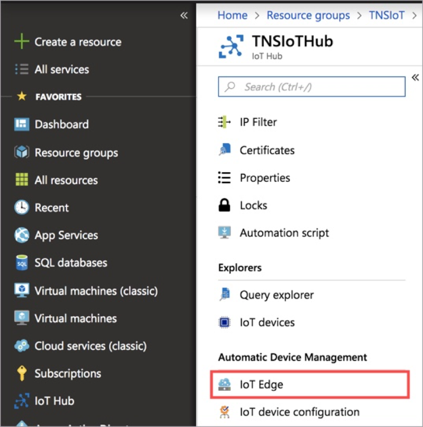
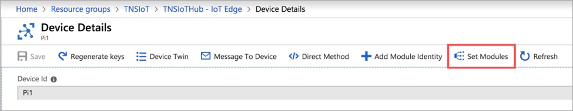
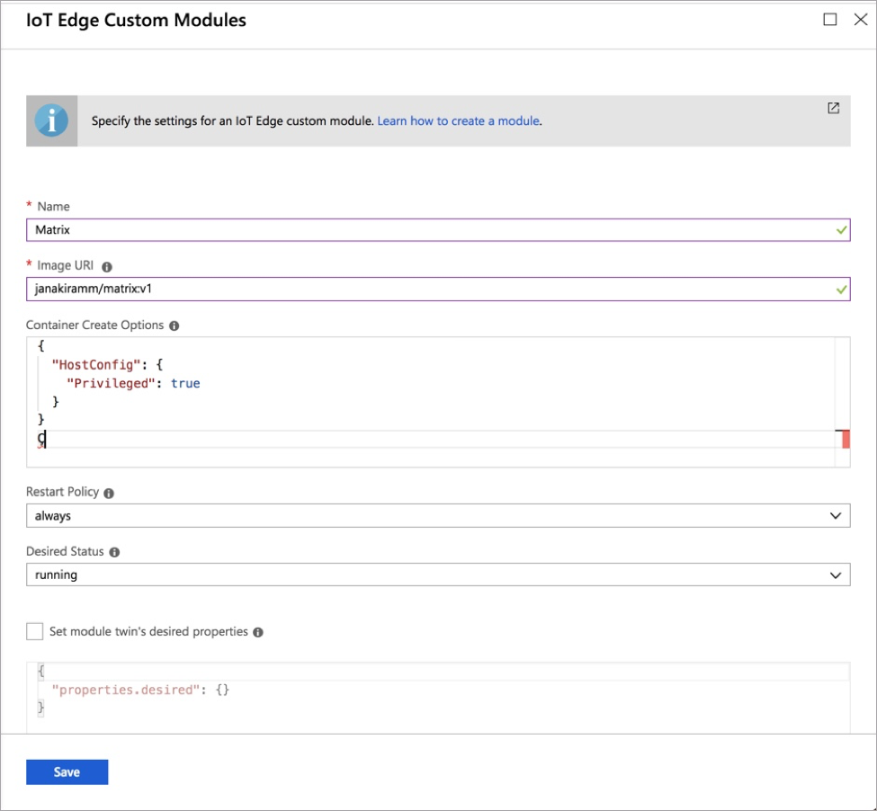
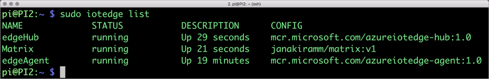
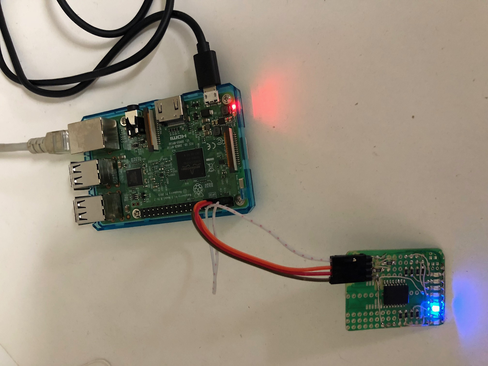

Как подключить Raspberry PI к Azure IoT: пошаговая инструкция

[sashalisik](https://habr.com/ru/users/sashalisik/ "Автор публикации") 14 января 2019 в 17:06

Привет, Хабр! Представляю вашему вниманию перевод статьи [Connecting Raspberry PI via Azure IoT: Step-By-Step Tutorial](https://indeema.com/blog/connecting-raspberry-pi-via-azure-iot--step-by-step-tutorial).

В этом посте мы расскажем, как подключить Raspberry Pi как периферийное устройство для передачи сигналов к светодиодной панели, использовав модуль Azure IoT Edge.

В большинстве шагов мы будем использовать Azure CLI, а также Azure Portal для запуска Azure IoT Edge.

**Для этого нам будут нужны:**

*   Raspberry Pi 3 Model B+ (светодиодная панель)
*   Аккаунт на Microsoft Azure
*   Последняя версия Azure CLI
*   Расширение (компонент) Azure IoT CLI

  

### Устанавливаем и настраиваем Azure IoT

Сейчас мы установим Azure CLI, создадим IoT Hub и подключим наши устройства. Мы также создадим идентификатор для Raspberry Pi и используем его параметры доступа для распознавания в IoT Hub. Кроме этого, мы используем add-edge-enabled чтобы подключить Raspberry Pi к Azure IoT Edge.

Чтобы установить и первично настроить Azure IoT, нужно:

1.  Установить на компьютер последнюю версию Azure CLI с [docs.microsoft.com/en-us/cli/azure/install-azure-cli?view=azure-cli-latest](https://docs.microsoft.com/en-us/cli/azure/install-azure-cli?view=azure-cli-latest)
2.  Настроить Azure CLI, используя:
    
        $ az extension add --name azure-cli-iot-ext</li>
    
3.  Скомпоновать ресурсную группу для нашего проекта:
    
        $ az group create --name rasp-IoT --location westus
    
4.  Создать шлюз для подключения периферийных устройств к Azure IoT:
    
        $ az iot hub create --resource-group rasp-IoT --name rasp-IoT-Hub --sku S1
    
5.  Создать идентификаторы для Raspberry Pi и устройства:
    
        $ az iot hub device-identity create --hub-name rasp-IoT-Hub --device-id myPi001 --edge-enabled
    
      
    Эта команда выдаст специфическую строку, которая будет нужна для подключения устройства.
6.  Скопировать выводимую строку в файл или буфер обмена. Мы используем ее позже, чтобы подключить устройство к IoT Hub.

  

### Подключаем Raspberry Pi

Модули Azure IoT Edge работают как контейнеры. Чтобы подключить Raspberry Pi к Azure IoT Hub и Azure IoT Edge нам нужно:

1.  Установить Docker на Raspberry Pi:
    
        $ curl -fsSL get.docker.com -o get-docker.sh && sh get-docker.sh
    
      
    Можно также проверить его версию, используя команду: $ sudo docker version
2.  Установить Azure IoT Edge Runtime, который будет работать как фоновый демон:
    
        $ curl -L https://aka.ms/libiothsm-std-linux-armhf-latest -o libiothsm-std.deb && sudo dpkg -i ./libiothsm-std.deb
    
      
    
        $ curl -L https://aka.ms/iotedged-linux-armhf-latest -o iotedge.deb && sudo dpkg -i ./iotedge.deb
    
      
    
        $sudo apt-get install -f
    
      
    
        $ curl -L https://aka.ms/iotedged-linux-armhf-latest -o iotedge.deb && sudo dpkg -i ./iotedge.deb
    
      
    
        $sudo apt-get install -f
    
3.  Подключить наше устройство к Azure IoT Hub, используя:
    
        $ az iot hub device-identity create --hub-name rasp-IoT-Hub --device-id myPi001 --edge-enabled
    
      
    Мы уже использовали эту команду для создания идентификатора для Raspberry Pi.
4.  Открыть `/etc/iotedge/config.yaml` файл в любом редакторе и заменить “ADD DEVICE CONNECTION STRING HERE” на специфическую строку для подключения устройства, которую мы ранее скопировали в файл/буфер.
    
    
    
5.  Перезапустить фоновый процесс IoT Edge и проверить его статус:

  

    $ sudo systemctl restart iotedge

  

    $ sudo systemctl status iotedge

Теперь мы можем установить модуль управления светодиодной панелью.

### Разворачиваем модули Azure IoT Edge

Ниже приведен простой пример, который четко показывает концепцию, разворачивание и управление модулями Azure IoT Edge:

1.  Запустите Azure Portal в браузере.
2.  Перейдите на IoT Hub и с Automation Device Management выберите IoT Edge.
    
    
    
3.  В IoT Edge Devices, выберите устройство PI1 и нажмите Set Modules.
    
    
    
4.  Разверните список Add и выберите IoT Edge Module чтобы развернуть кастомный модуль.
    
    
    

Теперь мы будем использовать Azure Portal чтобы развернуть контейнер как модуль. Перед этим нам нужно создать образ докера и сохранить его в Docker Hub как пример.

Перейдите на IoT Edge Custom Modules и выполните такие шаги:

1.  В поле Name, введите Matrix. Это будет названием нашего модуля.
2.  В поле Image URI, введите janakiramm/matrix:v1.
3.  Поскольку на нужен доступ к локальной шине I2C на Raspberry Pi, нужно запустить контейнер в режиме Privileged. Чтобы его включить, в Container Create Options вставьте следующую JSON строку:
    
        {
        	“HostConfig”: {
        	    “Privileged”: true
        	     }
        	}
    
4.  Оставьте в следующих поляк настройки по умолчанию.
5.  Нажмите Save для подтверждения развертывания.  
    

Это запустит развертывание кастомных модулей на периферийном устройстве.

Вы также можете проверить подключение модуля к устройству используя iotedge CLI на Raspberry Pi:

    $ sudo iotedge list

Как только модуль будет успешно развернут, диоды на панели, подключенной к Raspberry Pi, начнут мигать.

Используя облачный сервис Azure IoT, можно создать намного более сложные и многофункциональные IoT решения. К примеру, мгновенно масштабировать кастомные разработки на периферийных устройствах и посылать только текущие данные на облако, пока основные функции используются локально.

Мы считаем, что это звучит очень многообещающе.

### Фишки для децентрализации в Azure

Появилась новая крутая фича, которая отличает Microsoft от других поставщиков облачных услуг и, мы считаем, осуществляет концепцию полной децентрализации WEB 3.0 полнее всего. Конечно же, мы имеем в виду технологии распределенного реестра.

На Azure Blockchain Workbench можно внедрять инновационные блокчейн-решения на глобально доступной платформе. Честно говоря, мало что может соперничать с «вау-эффектом», который профессиональные децентрализованные приложения (DApps) вызывают у пользователей.

И все же, имеется в виду не только вопиющая популярность крипто и хайп вокруг ICO. Используя Azure Blockchain Workbench, разработчики могут внедрить уникальные возможности распределенного реестра в свои проекты, в том числе к IoT решениям. И именно это несет добавочную ценность результатов, которые получают заказчики.

Технология распределенного реестра обещает вывести доставку ценности на полностью новый уровень, так что даже поверхностное изучение соответственного облачного сервиса (как тот же Azure Blockchain Workbench) потребует отдельного поста. Мы, конечно, абсолютно не против «нырнуть» в особенности Azure Blockchain если вам так же интересна эта тема.

Оставайтесь на связи, следите за обновлениями и рассказывайте, о чем еще вам интересно почитать.

Теги:

*   [microsft azure](https://habr.com/ru/search/?q=%5Bmicrosft%20azure%5D&target_type=posts)
*   [Rasbperry PI](https://habr.com/ru/search/?q=%5BRasbperry%20PI%5D&target_type=posts)