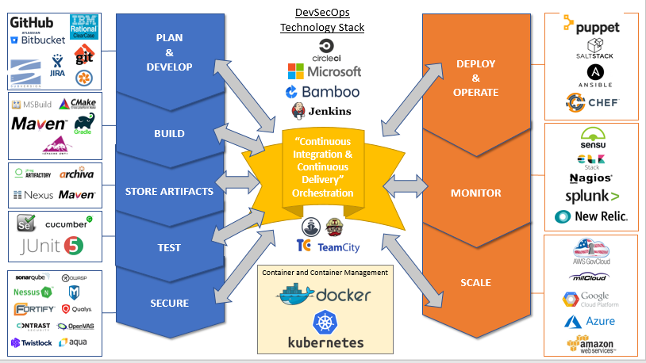
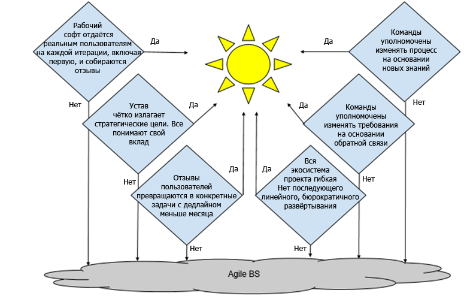

Как распознать липовые проекты Agile

 [ m1rko](https://habr.com/ru/users/m1rko/ "Автор публикации") сегодня в 09:46

*   Перевод

От переводчика: это инструкция _[DIB Guide: Detecting Agile BS](https://media.defense.gov/2018/Oct/09/2002049591/-1/-1/0/DIB_DETECTING_AGILE_BS_2018.10.05.PDF) (версия 0.4)_, которую Комитет по инновациям Министерства обороны США (DIB) опубликовал в открытом доступе 9 октября 2018 года.

Agile — модное словечко в разработке ПО, так что все софтверные проекты Минобороны теперь почти по умолчанию объявлены «гибкими». Настоящий документ поможет руководителям программ и специалистам Минобороны отличить софтверные проекты с действительно гибкой методологией от проектов, которые под маской Agile просто используют «водопад» или «спираль» (“agile-scrum-fall”).  

Эксперты и энтузиасты Agile определяет ключевые показатели, которые характеризуют эту культуру и подход к гибкой разработка. В своей работе DIB разработал собственные руководящие принципы, примерно отражающие истинные ценности Agile:

| Ценность Agile | Принцип DIB |
| --- | --- |
| Индивидуумы и взаимодействия важнее процессов и инструментов | «Компетентность важнее процесса» |
| Работающий софт важнее полной документации | «Сократить время от начала проекта до развёртывания простейшего базового функционала» |
| Сотрудничество с клиентом по согласованию контракта | «Внедрение культуры DevSecOps для программных систем» |
| Реагирование на изменения важнее плана | «Программы должны начинаться с малого, быть итеративными и строиться на успехе — или их быстро сворачивают» |

Ключевые признаки, что проект не очень гибкий:

*   Никто из команды разработчиков не общается с пользователями и не отслеживает программное обеспечение в действии; мы имеем в виду _реальных_ пользователей _реального_ кода. (Отдел оценки программ не считается реальным пользователем, также как старший офицер, если только он не использует программу в своей работе). Приемлемые альтернативы общению с пользователями: наблюдение за их работой, передача им прототипов для получения отзывов и другие методы исследований, которые не предусматривают большого количества словесного общения.
*   Отсутствует постоянная обратная связь от _пользователей_ для команды разработчиков (отчёты об ошибках, оценки). Недостаточно поговорить один раз в начале проекта для проверки требований!
*   Соответствие требованиям считается более важным, чем получение минимально полезного результата как можно быстрее.
*   Заинтересованные стороны (разработка, тестирование, DevOps, безопасность, подрядчики, конечные пользователи и т. д.) действуют более или менее автономно (например, «это не моё дело»).
*   Конечные пользователи не участвуют в разработке; как минимум, они должны присутствовать при планировании релиза и в приёмочном тестировании.
*   Недостаточная культура DevSecOps, когда вручную выполняются процессы, которые можно и нужно автоматизировать (например, тестирование, непрерывная интеграция, непрерывная поставка).

Некоторые типичные инструменты для гибкой разработки (они меняются по мере  
появления лучших):

*   Git, ClearCase или Subversion — система управления версиями для отслеживания изменений в исходном коде. Git является стандартом _де-факто_ в современной разработке.
*   BitBucket или GitHub — хостинг репозиториев. Также отслеживает тикеты, имеет «приложения» для непрерывной интеграции и другие инструменты для повышения производительности. Широко используется сообществом open source.
*   Jenkins, Circle CI или Travis CI — сервис непрерывной интеграции для сборки и тестирования проектов Bitbucket и GitHub.
*   Chef, Ansible или Puppet — програмное обеспечение для создания «рецептов» конфигурации и трансляции задачи по конфигурации ипи поддержке на ряд серверов.
*   Docker — компьютерная программа, которая выполняет виртуализацию на уровне операционной системы, также известную как «контейнеризация».
*   Kubernetes или Docker Swarm для оркестрации контейнеров.
*   Jira или Pivotal Tracker — тикеты, мониторинг и управление.

Графическая версия:

  

*   Как вы тестируете код? (Неправильные ответы: «У нас есть специальная организация для тестирования», «За тестирование отвечает отдел тестирования и оценки продукта»)  
    *   Расширенная версия: какой набор инструментов вы используете для юнит-тестов, регрессивного тестирования, функциональных тестов, сканирования безопасности и сертификация развёртывания?
*   Насколько автоматизированы конвейеры разработки, тестирования, безопасности и развёртывания?  
    *   Расширенная версия: какой набор инструментов вы используете для непрерывной интеграции (CI), непрерывной доставки (CD), регрессионного тестирования, документации программы; ваша инфраструктура определяется кодом?
*   Кто ваши пользователи и как вы взаимодействуете с ними?  
    *   Расширенная версия: какие механизмы вы используете, чтобы получить прямую обратную связь от пользователей? Какой набор инструментов вы используете для создания отчётов об ошибках и отслеживания тикетов? Как распределяете работу по устарнению багов между командами? Как сообщаете пользователям, что их вопросы решаются и/или уже решены?
*   Каков срок по текущему и будущим циклам для релиза?  
    *   Расширенная версия: какие программные платформы вы поддерживаете? Вы используете контейнеры? Какие у вас средства управления конфигурацией?

  
  

*   Сколько программистов входят в состав организации, которая распределяет бюджет, и каковы основные этапы программы? (Неправильные ответы: «Мы не знаем», «Ноль», «Это зависит от определения программиста»)
*   Каковы управленческие метрики для разработки и эксплуатации; как они используются для информирования о приоритетах, выявления проблем; как часто их просматривает и использует руководство?
*   Чему вы научились за три последних спринта и как применили новые знания? (Неправильные ответы: «Что такое спринт?», «Мы ждём одобрения руководства»)
*   Кто те пользователи, которые извлекают пользу от каждого цикла спринта? Можно поговорить с ними? (Неправильные ответы: «Мы не развёртываем код напрямую для пользователей»)

  
  

*   Как вы общаетесь с разработчиками? Они наблюдают за вашей работой и задают релевантные вопросы, которые свидетельствуют о глубоком понимании ваших потребностей? Когда в последний раз они сидели рядом и обсуждали функции, которые вы хотите видеть?
*   Как отправлять предложения по новым функциям или сообщать о проблемах или ошибках в коде? Какие отзывы вы получаете на свои запросы/отчёты? Вас когда-нибудь просили попробовать прототипы новых программных функций и наблюдали, как вы их используете?
*   Сколько времени требуется для реализации в приложении запрошенной функции?

  
  

*   Поставляется ли рабочая версия программного обеспечения хотя бы небольшой выборке реальных пользователей на каждой итерации (включая первую) и собираются ли отзывы? (подсказка: каждые две недели)
*   Существует ли устав продукта, в котором изложены миссия и стратегические цели? Понимают ли все члены команды и то, и другое? Видят ли они, как их работа способствует достижению целей?
*   Превращаются ли отзывы пользователей в конкретные задания для спринтерских команд со сроком выполнения меньше месяца?
*   Уполномочены ли команды изменять требования на основе отзывов пользователей?
*   Имеют ли команды право изменять свой процесс на основе того, что они узнали в ходе разработки?
*   Является ли гибкой вся экосистема вашего проекта? (Если за гибкой разработкой следует линейная, бюрократическая процедура внедрения — это провал.)

Для команд Agile ответом на все эти вопросы должно быть «да».

Графическая версия:

Более подробная информация о некоторых функциях программ Минобороны содержится в Приложении А ([«Десять предписаний по программному обеспечению»](https://media.defense.gov/2018/Apr/22/2001906836/-1/-1/0/DEFENSEINNOVATIONBOARD_TEN_COMMANDMENTS_OF_SOFTWARE_2018.04.20.PDF)), Приложении B ([«Метрики для разработки программного обеспечения»](https://media.defense.gov/2018/Jul/10/2001940937/-1/-1/0/DIB_METRICS_FOR_SOFTWARE_DEVELOPMENT_V0.9_2018.07.10.PDF)) и Приложении C («Ошибки и правила программного обеспечения» \[ссылка будет добавлена позже\]).

Теги:

*   [гибкая разработка](https://habr.com/ru/search/?q=%5B%D0%B3%D0%B8%D0%B1%D0%BA%D0%B0%D1%8F%20%D1%80%D0%B0%D0%B7%D1%80%D0%B0%D0%B1%D0%BE%D1%82%D0%BA%D0%B0%5D&target_type=posts)
*   [Git](https://habr.com/ru/search/?q=%5BGit%5D&target_type=posts)
*   [GitHub](https://habr.com/ru/search/?q=%5BGitHub%5D&target_type=posts)
*   [непрерывная интеграция](https://habr.com/ru/search/?q=%5B%D0%BD%D0%B5%D0%BF%D1%80%D0%B5%D1%80%D1%8B%D0%B2%D0%BD%D0%B0%D1%8F%20%D0%B8%D0%BD%D1%82%D0%B5%D0%B3%D1%80%D0%B0%D1%86%D0%B8%D1%8F%5D&target_type=posts)