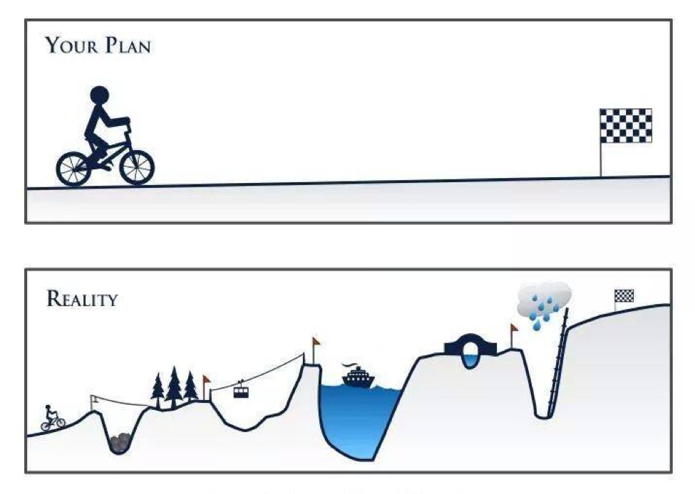
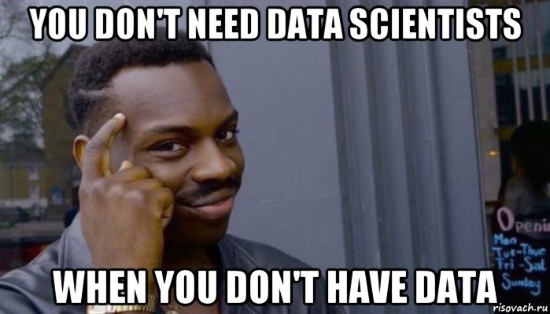

Как создать отдел Data Science и не облажаться / Блог компании ID Finance

Data Science начал приходить не только в большие компании, но и в маленькие, и даже в стартапы. Однако очень часто у топ-менеджеров нет понимания, что требуется для его успешного применения. Многие думают, что один дата-саентист за месяц решит все проблемы компании, а искусственный интеллект по щелчку начнет идеально работать во всех отделах. К сожалению, это не так. Меня зовут Иван Серов и в этом посте я расскажу, с чего нужно начинать создавать отдел DS и с какими трудностями это сопряжено.  

### Управление ожиданиями

Одно из самых важных в создании отдела — сразу заложить ожидания и KPI. С DS, как и с любой другой инновацией, нужно пройти весь цикл, который будет начинаться с операционных потерь. В лучшем случае отбить затраты на архитектуру и специалистов можно через полгода, а чаще — через год-два-три в зависимости от размера компании. Необходимо быть к этому готовым и не бросать все после пары неудач. Часто топ-менеджеры закрывают отдел через год, потому что он не успел выйти на прибыль. Из-за этого теряется доверие к DS. Лишь поставив необходимые ожидания и цели (желательно, по [SMART-у](https://www.wikiwand.com/ru/SMART)) можно сделать успешный отдел.

### Начните с малого

Лучше всего для начала сделать так называемый proof of concept проект – он не очень сложный и недолгий, но сможет принести бизнесу выгоду. Например, увеличить выручку на 2% за счёт рекомендательной системы. Не стоит пытаться сделать ансамбль из 5 кастомных нейросетей и работать над ним весь год. Например, даже для проектов по классификации текстов можно начать с простых алгоритмов (таких как bag of words) и уже получить прирост. В итоге, этот пилотный проект будет отправной точкой для дальнейшего развития и даст менеджменту понимание, что деньги идут на полезные вещи и DS нужно развивать. Это в дальнейшем даст время для работы над более сложными вещами. В условиях отсутствия компетенций, для пилотного проекта имеет смысл нанять внешнюю команду DS-консультантов. Они могут помочь воплотить ваши желания в жизнь с довольно хорошим качеством, либо понять, какие проекты можно делать в вашей индустрии, с чего стоит начать и как вам стоит строить дальнейшую AI-стратегию.

### Соберите данные

Здесь всё одновременно просто и сложно: в идеале компания должна использовать все данные, которые у неё имеются. Например, если вы онлайн-ритейлер, у вас есть, как минимум, данные по продажам конкретных товаров, поведению клиентов на сайте и маркетинг рассылкам. Уже на этом можно построить множество моделей, например, систему персональных рассылок.

На деле же собрать все данные компании в одну базу часто – большая проблема из-за различия источников, отсутствия четкого взаимодействия между отделами или даже отсутствия BI-специалистов в компании. Организациям, у которых все данные хранятся в excel стоит сначала начать собирать их в базу данных (SQL), а уже потом думать о DS.

Все имеющиеся данные необходимо собирать в том виде, в котором их будет удобно брать аналитикам и дата-саентистам (чаше всего это SQL). Нужно заранее договориться с BI отделом о том, в каком виде вы хотите получать данные, обрабатывать и использовать в продакшене.  
При малом количестве данных, вы можете покупать их у сторонних компаний. Например, у телекома: связывать эти данные по номеру телефона с вашими и таким образом их обогатить. Но в каждом из таких случаев, надо рассчитать, есть ли от этого выгода.

### Найдите аналитиков

Важно, чтобы в компании на момент создания отдела DS уже был отдел аналитики. Это те ребята, которые помогут саентистам найти данные, рассказать, что они значат, как правильно собрать нужные переменные и многое другое. Аналитика – это первый шаг в движении компании к тому самому Data Driven подходу принятия решений (то есть когда все решения в компании основываются на полученных данных, а не на желании менеджмента). Они помогут извлечь выгоду из данных без использования моделей, а отчеты помогут менеджменту принимать правильные решения. К тому же, в будущем именно аналитики будут мониторить состояние всех DS моделей и подготавливать по результатам отчёты.

### Подберите команду

Про этот пункт уже написано множество статей, я лишь постараюсь просуммировать, что уже было сказано. Итак, хорошая DS команда чаще всего стоит из:

*   Project Manager – руководит проектом, отвечает за всю бизнес-часть;
*   Data Scientist – строит модели;
*   Data Engineer – собирает данные и готовит продакшен-пайплайны;
*   Разработчик – внедряет DS-решение.

Все роли очень вариативны и могут меняться в зависимости от ваших желаний. Например, иногда в команде еще может быть business analyst, иногда может быть сразу несколько дата-саентистов, иногда data engineer и разработчик могут быть одним лицом. Вариантов команды очень много и необходимо отталкиваться от ваших потребностей. Либо попробовать несколько вариантов и выбрать лучший.

Помимо стандартной команды для создания отдела с нуля необходимы не только хорошие специалисты из списка выше, но и евангелист, который будет объяснять всем, что такое DS и в чём может заключаться его польза для других отделов – тот самый Chief AI Officer/Chief Data Officer/ Chief Digital Officer (название выбирайте сами). Важно упомянуть, что, если нанять одного дата-саентиста и скинуть на него задачи и аналитика, и архитектора, и разработчика, то не стоит ожидать быстрого результата, к тому же, это может лишить этого человека мотивации, а компанию успешного в будущем отдела.

Если компания большая и в ней есть много возможностей для развития Big Data, то также нужен Data Architect, который настроит архитектуру, многопоточный сбор данных и развернет Hadoop или Spark (системы для обработки больших массивов данных), с которым уже будут работать дата-саентисты компании.

### Не забывайте про внутренние коммуникации и тренинги

После пилотного проекта необходимо активно развивать команду. Компании стоит организовывать как минимум два типа тренингов:  
Для дата-саентистов — это могут быть воркшопы по разным темам, еженедельные встречи, хакатоны, мастер-классы. Также, стоит обратить внимание на покупку онлайн-курсов для команды (например, с coursera) и возможно, даже поставить это в KPI. Это поможет поддерживать команду на должном уровне в быстро развивающейся сфере и улучшит внутреннее взаимодействие.  
Для проджект-менеджеров и топ-менеджеров – это также могут быть воркшопы в виде разбора бизнес-кейсов или AI-стратегий компаний, или, например, курсы по базовому понимаю технологии machine learning и deep learning (что можно, а что нельзя сделать, основы технологий). Это как раз поможет менеджменту сформировать ожидания от DS.

Также, скорее всего еще до создания DS отдела в компании уже есть заинтересованные люди – это могут быть разработчики, которые прошли какие-то курсы по DS, либо люди из бизнеса, которые хотят быть менеджерами DS проектов – их стоит привлекать в отдел и помогать развиваться. Например, обучив разработчика методам машинного обучения, можно получить хорошего и мотивированного специалиста, который знает внутреннее устройство компании и стоит дешевле среднего по рынку дата-саентиста, которому к тому же нужно время, чтобы во всем разобраться.

### Внешние коммуникации – это важно

Про этот пункт часто забывают, однако он не менее важен, чем остальные. Рынок специалистов в машинном обучении находится в большом кадровом недостатке (в последние годы всё начало улучшаться, но всё же), каждый хороший дата-саентист понимает свою ценность и скорее сам выбирает компанию, в которой хочет работать – поэтому предложить большую зарплату сейчас уже недостаточно, необходимо увлечь проектами. Для этого следует грамотно выстроить ваши внешние коммуникации – работать с медиа, лидерами мнений, сообществом, рассказывать о реализованных проектах, писать статьи в различные тематические издания, выступать на конференциях, по возможности спонсировать индустриальные события вроде хакатонов и так далее – это лишь малая часть того, что стоит делать, чтобы привлекать таланты в компанию.

На этом всё, в заключение лишь скажу, что я специально не упоминал трудности в самом процессе работы отдела Data Science, а лишь рассказывал, что нужно для его создания. Если есть что добавить – добро пожаловать в комментарии.