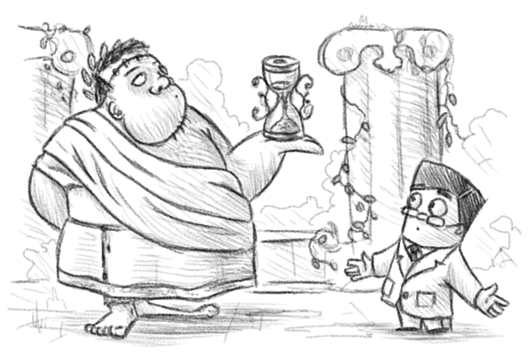

Как у нас не получилось переделать архитектуру компании / Блог компании Мосигра

В прошлом году я начал рассказывать, как мы ожирели, а потом рефакторились. Напомню, тогда мы выбрали путь тактических полумер: разделили большую компанию на 4 инкапсулированных объекта и тем очень сократили цепочки управления. В начале этого года настало время наконец-то заняться правильной архитектурой.

Это оказалось очень нетривиальной задачей, и до конца мы её не решили. Но зато открыли много нового полезного в процессе. Например, мы уже поняли, что ИТ-отделов в компании должно быть два: тактический и стратегический. Тактический — это хелпдеск, железнячники, отслеживание ресурсов и лицензий, мониторинг и вообще всё то, что повторяется больше 2 раз. Стратегический — это реализация major-фич, планирование на 2-3 года вперёд и финансы.

Потом оказалось, что то же самое применимо к кадровому отделу. Тактический кадровый занимается всей документация, отпусками-справками и наймом линейного персонала, а стратегический, например, хантит и обучает сотрудников, которые через полгода могут стать руководителями.

Но давайте начну с методологии.

## Методология

Предполагается, что вам нужно сначала понять, что делает ваша компания и зачем. Вообще, главный вопрос всегда именно «Зачем?». Как инструмент подходит нормальная миссия, которая будет определять принцип принятия решений. Как это ни странно, именно из миссии складывается будущая структура. Потому что она — документ, который описывает желаемое состояние, допустимые и недопустимые способы его достижения. Это я про миссию, которую делали с головой, формализуя суть компании, а не про документ «чтобы был и на сайте повесить».

Я сейчас сильно упрощу, но мы решили, что для нас самое главное — это доставить до любого человека его любимые игры. Для решения этой задачи можно возить лучшие игры мира, можно производить отличные игры в России, можно заниматься розницей и интернет-торговлей, можно вообще отказаться от своей розницы и торговать через кого-то и т.п. Главное — чтобы лично у вас оказались крутейшие игры. Второй вектор — делать честный прибыльный бизнес. С нуля до текущего момента получалось (ладно, прибыльный — с перебоями), глупо будет бросать такой челлендж. Это отчасти делает нашу жизнь игрой на hardcore-сложности )

Две этих цели плюс имеющиеся наработки (сильный бренд, сильная розница, клиентоориентированность, уникальный маркетинг), задаёт некую систему координат для построения архитектуры компании.

Осталось определиться с конкретными измеримыми целями на 5 лет. От них будет идти планирование сверху: они будут приоритетами для размещения отдельных модулей.

Дальше надо взять и расчертить компанию на блоки, которые производят какие-то функции. Здесь обычно случается много споров, но как-то так получилось, что у нас почти все умеют детерменировать задачи (то есть обладают навыками алгоритмизации хотя бы базовыми), поэтому сложилось быстро.

В методологии мы исходим из чего-то вроде контейнерной виртуализации (микросервисной структуры).

**Есть три вида объектов в компании:**  
• Генерирующие прибыль.  
• Производящие нечто с понятной ценой единицы.  
• Производящие нечто шаманское.

**Первый пример**: розница (как большая абстракция верхнего уровня) генерирует прибыль. Ты в неё загружаешь товар на входе, она его перемалывает и даёт деньги на выходе.

**Второй пример**. Предположим, нам нужно сделать игру по уже подготовленным и проверенным макетам. Производство игры (печать, сборка, закупка компонентов, литьё пластика, окраска дерева и т.п.) стоит денег. В теории это можно заказать это внутри группы компаний на собственном производстве, а можно снаружи в какой-то внешней типографии или нескольких.

Сравнивать очень просто: известна цена за единицу игры нашего производства, известны критерии качества и SLA. Если кто-то делает дешевле при том же качестве и SLA — очевидно, все вызовы к производству могут переадресоваться на этот другой микросервис. Просто заменяется модуль в архитектуре. Единственный момент — важно учесть в оценке такие факторы как «у них всегда приоритет нашей продукции» и «они никуда не денутся через 3 года».

Всё то, что может производить товар или услугу по понятной цене и с фиксированным SLA — это просто контрагент, который почему-то находится на территории компании. Как в истории про одного производителя деревянных окон: они столкнулись с проблемой отсутствия материала в сезон и сделали свою лесопилку. Через два года этот их бизнес понял, что выгоднее продавать доски другим компаниям, и они столкнулись с проблемой отсутствия материалов, для чего запустили ещё одну собственную лесопилку…

Это похоже на столовую при заводе, которая может продать обед и кому-то снаружи, необязательно рабочему. Или на бухгалтерскую компанию, которая сначала обслуживает несколько разных юрлиц в холдинге, а потом начинает торговать наружу. У нас так в своё время ИТ-аутсорсинг и специалист по контекстной рекламе выделились.

**Третий тип** — производство чего-то шаманского — это, например, пиар. Когда нет цены за единицу, а объект производится целостно и магически.

Например, работа эникея – это объект второго класса, а работа ИТ-директора, который думает про развитие компании — уже может быть третьего.

## Подключаем модули!

Дальше всё просто: надо понять цепочки производства. Берём каждый модуль и выписываем, кому он нужен. Задача – замкнуть всё это на модули генерации прибыли. Они и будут оплачивать работу сервисов второго и третьего типа. Получится структура процессов (точнее, пока взаимных требований и бюджетирования).

Например, розница потребляет ИТ-поддержку, тактический маркетинг, производство печатной продукции, логистику и т.п. (но не потребляет стратегический маркетинг). Модуль логистики, симбиотичный рознице, может понадобиться ещё и опту и т.п.

Розница ставит понятные SLA и оплачивает всё это внутри компании. Или вот розница договорилась в начале года с эвент-отделом о том, сколько надо мероприятий и каких – розница выдала на это бюджет.

А дальше магия: руководитель эвент-отдела отчитывается не перед кем-то абстрактным выше, а перед своим внутренним заказчиком. И старается сделать лучше ему. Или же просто проводит корпоративы сам (эвент зарабатывает и этим). Или старается делать всё и сразу. Так получается дисперсия управления, дисперсия ответственности и очень, очень хорошая децентрализация. А она определяет скорость изменений компании.

**Вообще, вся структура подобного плана заточена под три вещи:**

*   Пороги управляемости: один человек не может руководить больше чем 7 подчинёнными. То есть у CEO не может быть больше 7 руководителей подразделений в компании. Если их 10 – значит, часть надо кластеризовать в подразделение «всякая фигня» (её часто называют «стратегическим развитием») и поставить одного директора по фигне. То есть по развитию.
*   Гибкость и скорость изменений. Это чертовски важно – быстро меняться. Это требование by design определяет такую структуру. Децентрализация решений ставится на первое место. Современный бизнес не меняется от релиза к релизу, а постоянно мутирует без остановки.
*   Понимание, что тактика всегда пожирает функцию развития. Это значит, что нужно разносить модули, которые обеспечивают поддержание работы чего-то и модули, которые двигают компанию вперёд. Тот же пиар — он, в целом, как коммерческий инструмент нафиг никому отдельному в компании не нужен, потому что работает множителем. Ну, если хороший пиар — легче договариваться с партнёрами. Легче закрывать вакансии. Легче продавать. Но оценить его шаманский эффект сложно, поэтому он выносится на уровень подчинения генерирующему прибыль модулю CEO (в нашем случае) и сидит там как стратегический ресурс. Поэтому же разделены многие отделы на тактические и стратегические. Нельзя одновременно думать о продажах сегодня и развитии, например.

Вот примерно так. Мы ещё не ушли в новую структуру, потому что преобразование будет долгим. Но теперь мы мыслим порталами, и понимаем, как надо перекоммутировать всё в компании. Следующий год будем расти и делать процессы заново.

А не получилось у нас потому, что мы придумали структуру, которая будет через 3 года. Потом промежуточную структуру, которая нужна для трансформации. Потом попробовали продумать план изменений, и поняли, что не потянем. Пробежались ещё пару раз по процессам, и стало ясно, что мы ещё не до конца знаем, чем точно занимаемся: возможностей море, но часть из них надо обрезать, чтобы сфокусироваться на двух-трёх реально важных вещах.

Вот как раз сейчас сидим и думаем.