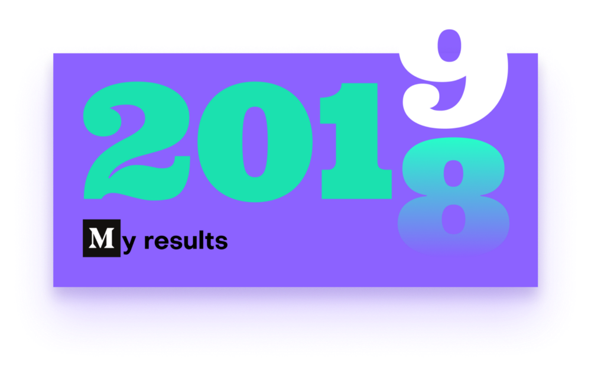
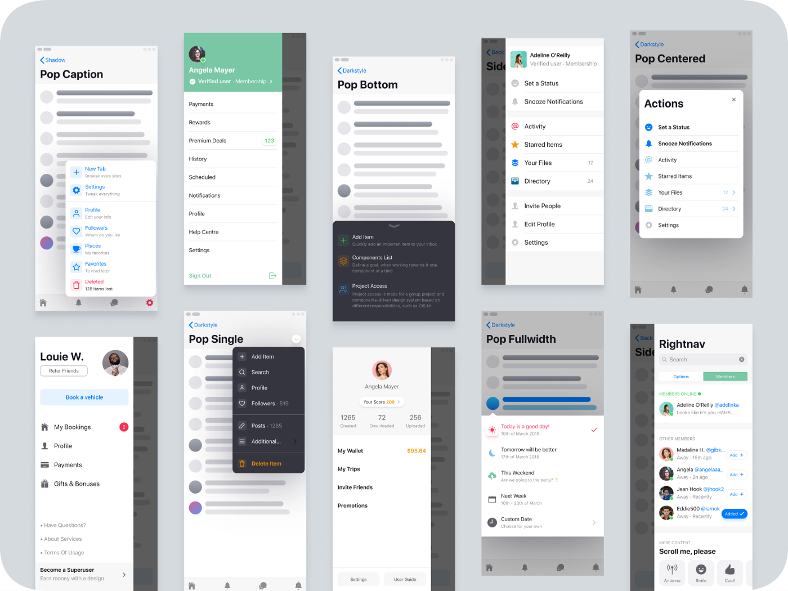
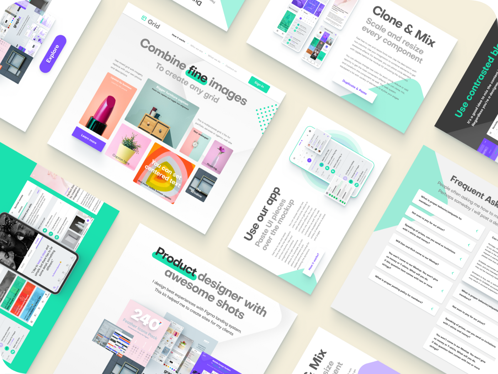
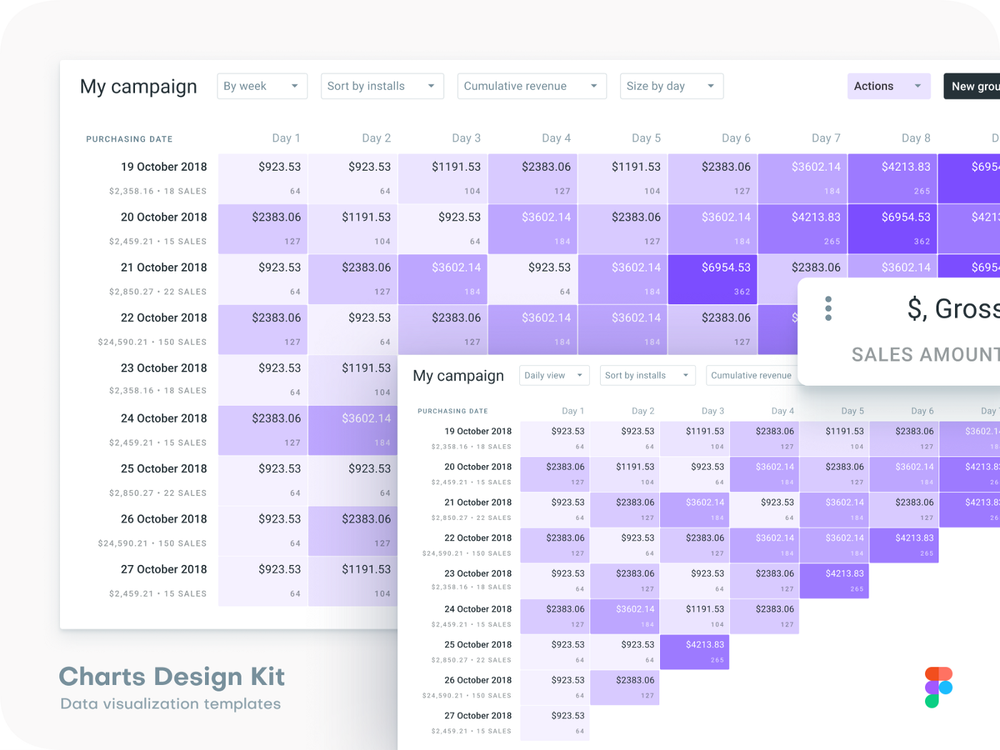
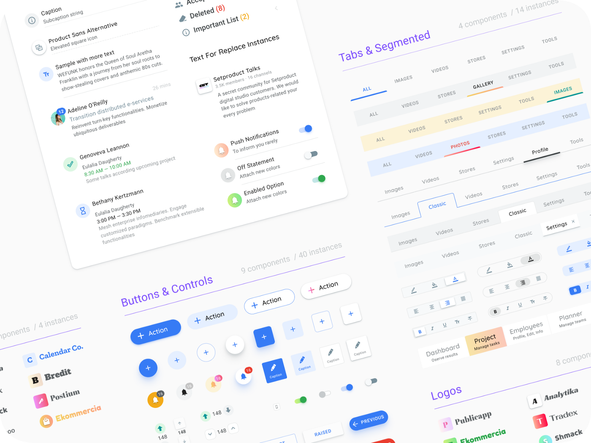
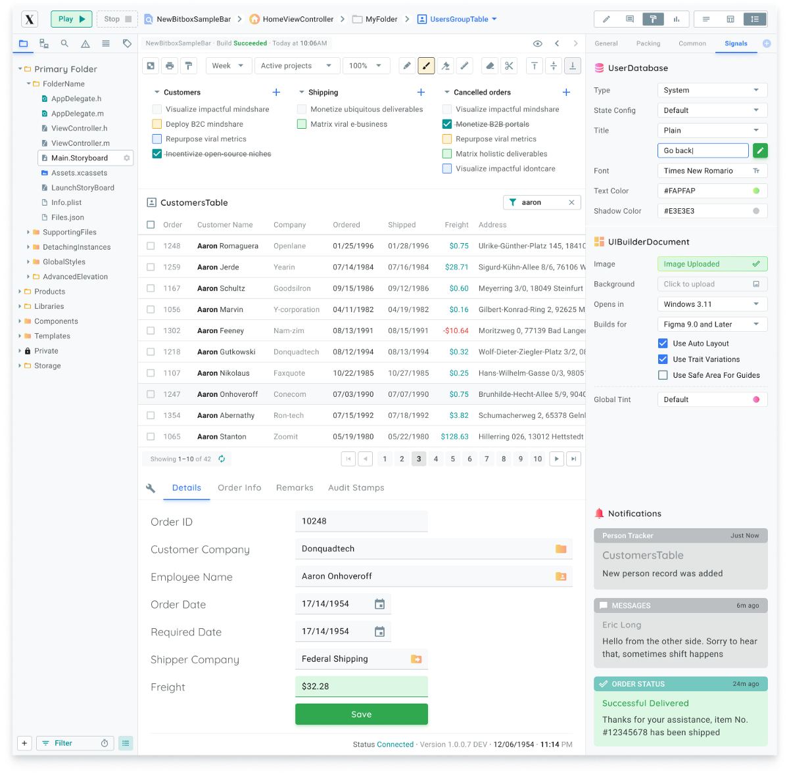
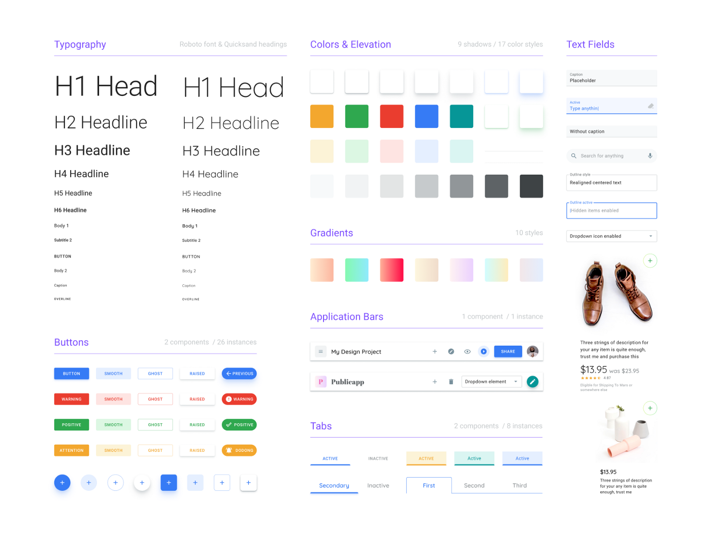
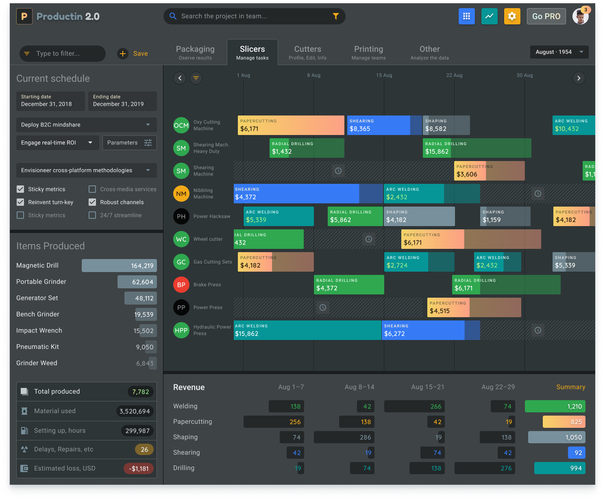
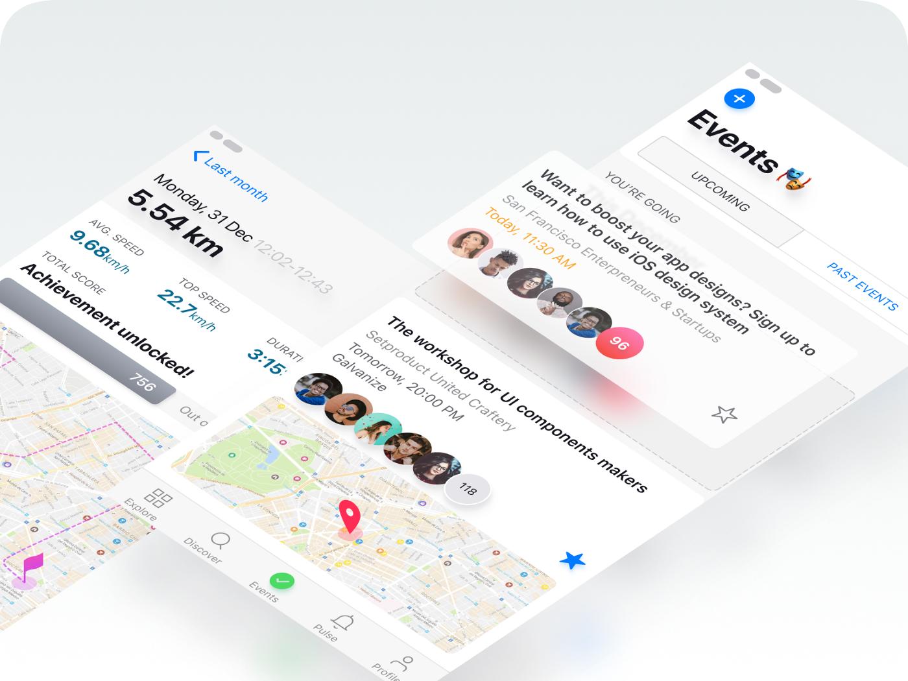
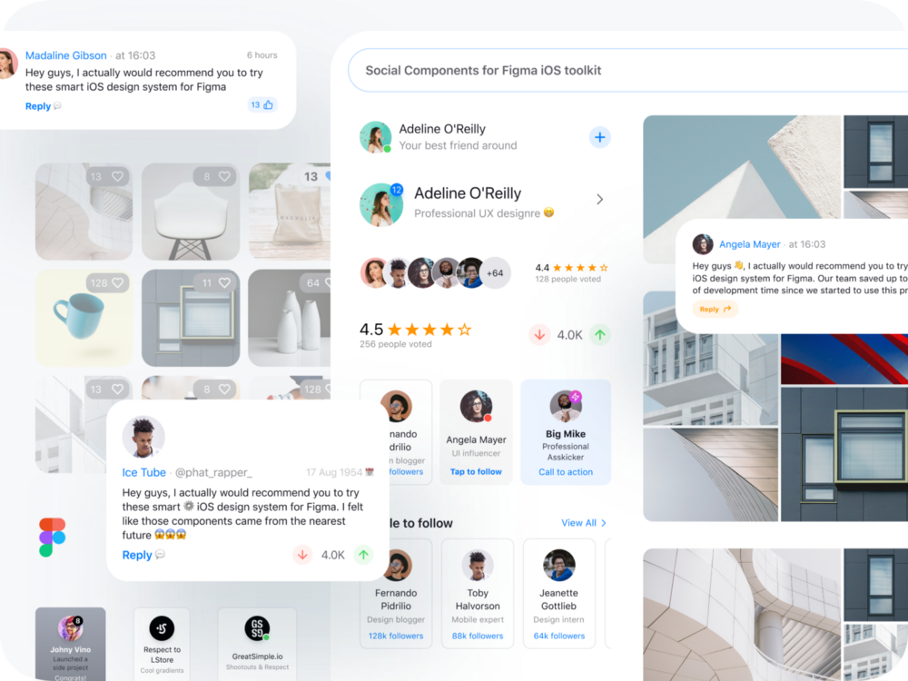

Как я дизайн монетизировал. 15 инсайтов о создании цифрового продукта, который продается

  
Итоги года для UI дизайнера, у которого не было ни одного интересного проекта в портфолио и он решил создать свой собственный продукт для популярной теперь дизайн-платформы [Figma](http://figma.com/).

Раньше я всегда относился скептически к таким постам. Но после того как минул ровно год, давший мне опыта и мудрости лет на 10, я все понял: _мне просто нечего было сказать._

Я не работал в больших компаниях, не устраивал-дизайн спринты и не сидел бок о бок с крутыми парнями в коворкингах. Я в дизайне уже не менее 16 лет, я самоучка, и однажды у меня не оказалось ни одного интересного проекта в портфолио, который бы круто работал и современно выглядел. Все мои последние годы стабильного фриланса — это клиенты с обычными заказами. Они приходят и уходят. И 80% из них позднее выбрасывают в топку всё ваше творчество. Потому что по законам рынка это число терпит неудачу после запуска проекта.  
  
Поэтому мне очень хотелось свой продукт. Который бы приносил пользу людям, которые столкнутся в будущем с аналогичными задачами и экономил их время. Которому можно было бы быстро придавать нужную форму и оптимизировать её со временем.

Я практически не заметил как пролетел год. Год, за который я выпустил несколько дизайн-систем для Фигмы, получил массу позитивных фидбеков, собрал полезнейших советов и пожеланий, спланировал куда свой продукт можно направить далее, и в конечном итоге попал в категорию ресурсов этого дизайн инструмента.

**И вот, что я в итоге понял...**

## Следите за тем, что происходит в индустрии

Ежедневно появляются новые инструменты, фреймвроки и веб-приложения. И вместе с ними появляется спрос на то, что поможет людям быть еще эффективнее. Дизайн-рынок колоссально развивается и уже сегодня это еще интереснее чем, к примеру, два года назад. Приходят инвестиции и за крупные доли сражаются гиганты с серьезными технологиями. И если вы следите за рынком, на котором работаете и понимаете его достаточно хорошо — рано или поздно вы найдете идею, которую можно проверить на валидность и вы будете достаточно хорошо заряжены, чтобы мотивации хватило зайти далеко. Я постоянно мониторю ключевые западные дизайн-ресурсы, чтобы строить собственные прогнозы: [DN](http://designernews.co/), [Webdesignernews](http://webdesignernews.com/), [Reddit](https://www.reddit.com/r/FigmaDesignSystems/), [Producthunt](http://producthunt.com/). Что обсуждают люди в комментариях? Какие посты получают больше всего upvotes? Это все имеет значение.

## Вам не обязательно быть командой

Мы живем в удивительное время, когда кто угодно, находясь в любой отдаленной точке планеты с ноутбуком создает что-то нужное, за что люди готовы платить деньги. Он делает это в одиночку, воспользовавшись готовыми решенями, которые доступны каждому. Сейчас глобальный тренд на side-project’ы, которые запускаются индивидуальными дизайнерами и разработчиками. Люди создают проекты, которые их волнуют, собирают аудиторию, которая становится лояльной, а потом плавно внедряют премиум-сервисы за $ подписку. Так и рождаются успешные проекты. А уже потом они превращаются в команды, переходя на следующий уровень. Но в одиночку сейчас можно сделать очень многое, благодаря крутым инструментам, многие из которых сделаны как раз одним человеком.

## Запрыгивайте на подножку уходящего состава

Если на рынке появляется новый продукт, к которому есть интерес в сообществах, возможно удастся заработать вместе с ним. Для небольших команд или solo-preneur’ов вроде меня это самый воплотимый путь к продукту, который приносит прибыль. Это как раз мой случай с Фигмой: я просто понимал, что мне в ней удобно работать и я стал эффективнее. Я предположил, что большинство дизайнеров подумают также и им потребуются готовые компоненты, чтобы не тратить время на пиксели. И эта идея оказалось валидной. Воркфлоу дизайнера сильно эволюционировал, благодаря новому подходу. Вы просто строите собственную библиотеку компонентов и темплейтов и для каждого следующего клиента быстро и эффектино создаете новые шаблоны, лишь присоединяя новый стиль и цвет. Со временем в вашей базе окажутся все элементы мира и можно будет работать с кружкой кофе во второй руке :) И мои продукты как раз об этом.

## Вам потребуется весь ваш предыдущий опыт

Если когда-нибудь меня спросят, это первое о чем я скажу. Вы должны быть хороши в своём деле. Чтобы создать продукт, нужно понимать задачи, которые с помощью него будут решать люди. Вы сможете лучше понимать их, если сами решали такие задачи когда-то в огромном количестве. Это и есть ваш опыт. И без него будет сложно создать универсальный design asset (или вставьте тут то, что ближе к вашей деятельности). В течение последних 5 лет я сделал немало производственных интерфейсов и различных мобильных концептов на своей постоянной работе. К сожалению ни один проект не выстрелил, но без этого опыта я бы не смог проделать такую работу за год.

## Если продукт не продаётся, вам нужно еще больше опыта

Однажды мой босс сказал “Мало сделать хороший продукт. Его необходимо как-то продавать…”. Это суровая реальность. Даже если вы нарисовали лучший дизайн кит в этой галактике — сейчас об этом знаете лишь только вы. И потребуется много аналитики, экспериментов и попыток, чтобы объяснить это людям. За этот год я продал несколько тысяч лицензий, 10 раз обновлял и видоизменял свой сайт и до сих пор не перестаю экспериментировать с подачей контента. Если однажды вы скажете “О! Теперь это выглядит классно” и потом через месяц-другой вы не подумаете “О боже, кто написал/нарисовал этот бред”, скорее всего вы топчетесь на месте и нужно что-то менять. И если ваш классный продукт не продается, вам нужно еще больше опыта, чтобы пройти эту мертвую точку.

## Продавайте в собственном пространстве

Рынок цифровых дизайн-продуктов интенсивно развивается и сегодня все больше дизайнеров пытаются создать что-то полезное для своих коллег по цеху. Большинство из них пытаются продавать свои изделия используя только популярные площадки, но этого недостаточно. Почти все известные UI маркетплейсы завалены тонной однообразных цветных экранов, вставленных в одинаковые мокапы телефонов и в 80% случаев ваша поделка потеряется среди них. Дизайнеры копируют друг друга и ищут идеи не там, где следует. Если вы планируете идти далеко, задумайтесь заранее о том, чтобы основным источником продаж сделать свой собственный ресурс. Это как минимум исключит трудности выбора для посетителей, т.к. внутри вашего пространства они будут выбирать исключительно среди ваших продуктов.

## Иногда, проще сделать следующий продукт

К этому вы возможно придёте, если ваше терпение не закончится раньше времени. 20% продуктов дают 80% прибыли. Если вы уже сделали несколько продуктов, то скорее всего малая часть из них будут генерировать львиную долю прибыли. Все остальные — это те продукты, после которых вы делали следующие попытки, т.к. нет никакого смысла пытаться оживить покойника. Если после нескольких попыток, вы не видите цифр, которые вас устраивают, значит это направление нужно поставить на паузу и исследовать новое. Возможно вы и один перед монитором, но никто не запрещает вести дела, словно вы крупная компания.

## Делайте всё так, словно вы организация

Планировать задачи, управлять ими в трекере, исследовать гепотезы, собирать аналитику и проводить оптимизацию. Для соло-разработчика self-management должен быть пожалуй на первом месте, т.к очень легко сбиться с пути или зарыться в рутине только потому, что вы выбрали неправильную последовательность действий до начала разработки. Например, мне удалось только спустя несколько месяцев практики понять, что переиспользование собственных идей даёт прирост эффективности. И теперь при создании очередноого шота в Dribbble, я буду использовать эту картинку и в других соцсетях, или как рекламный баннер, или вообще сделаю из неё заголовок сайта, т.к. я вижу позитивную реакцию аудитории.

## Сразу устанавливайте высокую планку

Вы не можете создать что-то, кроме качественного продукта, иначе нет смысла пытаться. Однажды выпустив такой, за вами начнут наблюдать люди и это будет началом вашей хорошей репутации. Высокая планка это не удел перфекционистов, это подход разработчика, который знает области применения своего продукта и может протестировать его в этих направлениях до релиза. Например, поиск багов оказался затруднительным для меня, но все встало на свои места, когда я начал сам использовать свои изделия по назначению. И я не сразу научился создавать дизайн-наборы, с продуманными на три шага вперёд компонентами. Пользователи приобретали их, я стал получать позитивные отзывы и осознал вскоре, что это и есть репутация, которая движется тенью за качественным продуктом.

## Всегда есть, что улучшить

Главное преимущество работы над своим продуктом или детищем — это постоянная эволюция. Как ваша так и той сущности, над которой вы работаете. Поэтому не бывает стадии “Ну всё, этого достаточно!”. Этого не достаточно, потому что завтра другая команда дизайнеров сделает это быстрее, качественнее да еще и выпустит бесплатно. В моем случае я всегда мог оптимизировать типографику, цвета, рабочий процесс, да и сам продукт в конце концов, особенно когда я старался смотреть на результаты своей работы объективно. Поэтому я уверен в том, что всегда есть, что улучшить.

## Ваши покупатели сами подскажут, что делать дальше

Я думаю что это один из самых важных инсайтов года. Хоть он давно известен всем и многие вторят это, но всю важность этого понимаешь только на своем опыте. Слушайте ваших клиентов! У меня часто бывало так, что после релиза и небольшого перерыва я задавал себе вопрос “Окей, что делать дальше?”. А потом на следующий день мне приходило пару писем от довольных покупателей с некоторыми пожеланиями и все вопросы отпадали сами собой. Сейчас у меня обширные планы на следующий год и лишь только потому, что в декабре я получил несколько важных сообщений и не стеснялся вытащить больше информации. Ваши клиенты сами подскажут, что делать дальше…

## Начинайте постить и создавать лояльную аудиторию

Одной из моих ошибок было то, что я слишком поздно начал это делать. Мне стоило гораздо раньше спросить инвайт на [Dribbble](http://dribbble.com/) или начать разбираться в специфике создания крутых презентаций на Behance. Однако в то время у меня не было продукта и я вряд ли бы понял важность создания аудитории. Опять это пресловутое “лучше поздно, чем никогда”. Зато сейчас я полностью отдаю себе отчёт в том для чего я практически каждый день генерирую контент в соц.сетях, пишу статьи и создаю видео-ролики. Действительно, в наши дни конкуренция высокая, набирать подписчиков непросто. Но именно это мотивирует больше экспериментировать с графикой и текстом, чтобы возможно придумать новое направление и заинтересовать людей своим контентом. И если вы правильно анализируете информацию — количество лайков или комментариев к вашим постам станет индикатором интереса к вашим идеям.

## Найдите свою специализацию или нишу

В наши дни дизайн очень многогранен и имеет множество направлений. Вы можете быть специалистом только по мобильным приложениям, или же по иллюстрациям. А может быть вы больше архитектор дизайн систем, чем художник. Или предпочитаете создавать анимацию в интерфейсах. Понимание своей специализации и углубление в неё помогает выделиться из толпы и создавать нишевые продукты, т.к. вы начинаете лучше понимать нишевые проблемы ваших постянных клиентов. Например, меня очень вдохновляет сейчас то, что предприимчивые иллюстраторы начинают мыслить компонентно. Они заранее отрисовывают персонажей в разных ракурсах и состояниях, а вы уже сами собираете себе сцену, словно паззл. Подумайте, можно ли такой подход применить на вашу специализацию в дизайне? Быть может это следующий хороший продукт…

## Окружите себя людьми занятыми своим делом

Пускай это звучит как цитата из классической западной бизнес-литературы, но оказывается это работает! В такой компании вы всегда сможете получить обратную связь и множество точек зрения. И не важно в какой индустрии заняты эти люди. Любой человек занятый собственным делом каждый день решает проблемы. И чей-то алгоритм решения сложной ситуации вполне может подойти вам, останется лишь адаптировать его к вашей проблеме. Удивительно, но за последние несколько лет рядом со мной появилось 3 таких человека. У одного свой [интернет магазин крутой посуды](https://www.superposuda.ru/), второй вместе с женой развивает [сеть маникюрных салонов](http://nikinail.ru/), а третий недавно выстрелил оформив государственный проект. И я рад, что у меня была возможность задавать им вопросы, показывать результаты своей деятельности и получать обратную связь.

## Осознайте свое преимущество

Дизайн сфера это такая же конкурентная среда как и многие. Верхушка айсберга давно захвачена сильными командами и 20% топовых дизайнеров на Dribbble получают 80% всех заказов. Остальное делим между собой мы — те, кто начал много позже. Но никто не имеет права говорить вам, что невозможно забраться выше. Если вы осознаёте свое преимущество, это поможет поддерживать мотивацию на высоком уровне. Когда-то не так давно я сильно опасался, что кто-то может взять и повторить мои разработки. Но после того как я осознал задекларировал себе в мозгу в чем именно я хорош, мне стало гораздо комфортней работать и меньше опасаться. Я просто вижу, что минимум дизайнеров настолько глубоко ковыряются в каждом пикселе :) А мне просто это нравится…

**Спасибо, что дочитали**. Буду рад услышать в комментариях ваши личные инсайты за прошедший год. Если они будут больше про жизнь, чем про работу, это даже интереснее. Кстати, это был кросс-пост [моего поста](https://vc.ru/design/54363-kak-ya-dizayn-monetiziroval-moi-15-insaytov-o-sozdanii-uspeshnogo-cifrovogo-produkta) с VC.ru. Уж так вышло, Хабр…

Если вам нравится Фигма, я все таки рекомендую обратить внимания на мои готовые библиотеки компонентов. Они помогают фрилансерам завершать больше заказов в месяц, программистам позволяют создавать красивые приложения самостоятельно, а тимлиды пробегают спринты быстрее, используя мои продукты для командной работы.

_Написано и сделано с любовью к моей семье._