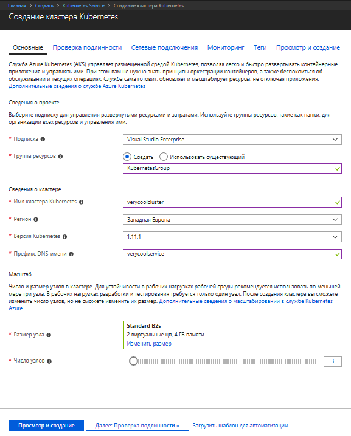
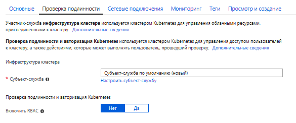
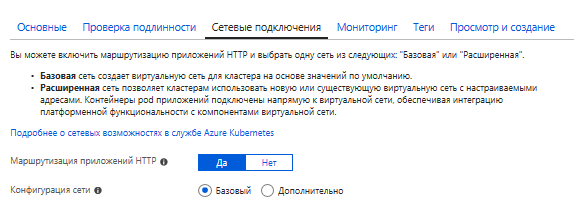
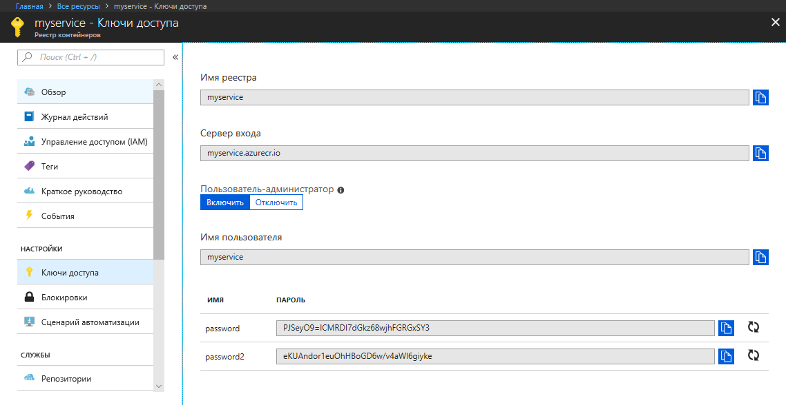
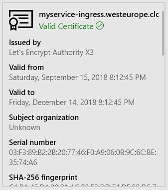

Кибернетический оркестр. Оркестрация контейнеров Docker с приложениями .NET Core в облаке / Блог компании Microsoft

Для обеспечения балансировки нагрузки, масштабируемости и повышения отказоустойчивости могут использоваться вспомогательные средства — оркестраторы. Среди них большой популярностью сейчас пользуется сервис Kubernetes. Самый простой способ попробовать его в деле — развернуть его в облаке, чем мы сегодня и займемся.

_Примечание: мы продолжаем серию публикаций полных версий статей из журнала Хакер. Орфография и пунктуация автора сохранены._

  

## Разворачиваем AKS

Заходим на [портал Azure](https://portal.azure.com/), нажимаем «Создать ресурс» и находим сервис под названием Kubernetes Service.

Выбираем имя и префикс DNS на свой вкус. Имя влияет на то, как вы будете обращаться к вашему кластеру, а вот префикс влияет на его FQDN адрес.

Самая недорогая виртуальная машина на данный момент стоит чуть более 30 долларов в месяц.

Вторым шагом предлагается создать service principal. Service principal это своеобразный сервисный аккаунт под которым могут выполнятся какие-то определенные задачи. Плюсы в том, что права такого аккаунта можно ограничить. Кроме того, можно создать любое количество подобных аккаунтов (в то время как количество обычных аккаунтов ограничено подпиской). Найти созданные аккаунты service principal можно в Active Directory среди App Registrations

RBAC (role-based access control) – это возможность ограничить или предоставить доступ к определенным ресурсам (или группам ресурсов). То есть вы сможете разграничить какие пользователи вашей подписки имеют права доступа, а какие не имеют.

На данный момент процесс занимает примерно минут 20, но все может зависеть от конфигурации.

Найти официальные руководства можно по ссылкам  
[Создание кластера AKS с помощью портала](https://docs.microsoft.com/ru-ru/azure/aks/kubernetes-walkthrough-portal)  
[Создание кластера AKS с помощью CLI](https://docs.microsoft.com/ru-ru/azure/aks/kubernetes-walkthrough)

Для работы нам понадобится командная строка Azure – CLI (Command Line Interface). Ее можно установить как под Windows, так и под macOS или Linux. Лично я предпочитаю использовать Azure Cloud Shell. Это командная строка, которая запускается из загруженной в браузер страницы портала Azure. Для работы она требует созданного blob хранилища. Его стоимость составит несколько центов в месяц и потому я предпочитаю не парится по поводу установки CLI на свою машину.

Kubernetes поддерживает различные технологии контейнеров, но давайте рассмотрим самую популярную – Docker. [docker.hub](https://hub.docker.com/) позволяет хранить один приватный образ докера бесплатно. Если нужно больше, то можно разместить их за деньги. Но за деньги приватный образ докера можно разместить и в Azure Container Registry. Сейчас цены стартуют от 5-ти долларов в месяц (за базовый SKU).

Я создал сервис ACR под именем myservice. Если вы тоже решите воспользоваться ACR, то создав сервис вам необходимо будет получить его ключи.

Затем станет возможным залогиниться выполнив команду:

  

    docker login myservice.azurecr.io 

Ввести взятые с портала имя пользователя (myservice) и пароль (PJSeyO9=lCMRDI7dGkz68wjhFGRGxSY3)

Теперь зайдя в директорию с проектом, можно будет построить образ, одновременно пометив его нужным тегом. А после этого отправить его в облачный сервис:

  

    docker build -t myservice.azurecr.io/myservice .
    
    docker push myservice.azurecr.io/myservice

  

## Секреты, секреты… Предоставляем доступ к образу и сохраняем настройки.

При работе с развернутым AKS необходимо получить его креды. Иначе команды kubectl не будут выполняться. Для получения доступа к AKS выполняется следующая команда:

  

    az aks get-credentials --resource-group KubernetesGroup --name verycoolcluster

Для того чтобы получить доступ к образу докера, расположенному в репозитории докера в приватном контейнере, необходимо создать секрет. Если у вас публичный образ, то этот шаг вы можете пропустить.

Для создания файла секрета необходимо выполнить команду такого вида:

  

    kubectl create secret docker-registry regcred --docker-server=<your-registry-server> --docker-username=<your-name> --docker-password=<your-pword> --docker-email=<your-email>

Если ваш образ находится в репозитории докера, то значением &lt;your-registry-server&gt; будет [https://index.docker.io/v1/](https://index.docker.io/v1/)

Для Azure Container Registry FQDN будет &lt;registry-name&gt;.azurecr.io

То есть чтобы создать секрет для контейнера в моем случае я выполнил:

  

    kubectl create secret docker-registry regcred --docker-server="myservice.azurecr.io" --docker-username="myservice" --docker-password="PJSeyO9=lCMRDI7dGkz68wjhFGRGxSY3" --docker-email="asommer@yandex.ru"

Посмотреть содержимое созданного файла секрета теперь можно с помощью команды:

  

    kubectl get secret regcred --output=yaml

  

Если вы используете AKS, то можно не создавать файл секрета, а предоставить доступ сервису AKS к сервису ACR иным способом — выполнив особый скрипт. Взять его можно со следующей странички:

[Authenticate with Azure Container Registry from Azure Kubernetes Service](https://docs.microsoft.com/en-us/azure/container-registry/container-registry-auth-aks)

  

    #!/bin/bash
    
    AKS_RESOURCE_GROUP=KubernetesGroup
    AKS_CLUSTER_NAME=verycoolcluster
    ACR_RESOURCE_GROUP=MyACRGroup
    ACR_NAME=myservice
    
    # Get the id of the service principal configured for AKS
    CLIENT_ID=$(az aks show --resource-group $AKS_RESOURCE_GROUP --name $AKS_CLUSTER_NAME --query "servicePrincipalProfile.clientId" --output tsv)
    
    # Get the ACR registry resource id
    ACR_ID=$(az acr show --name $ACR_NAME --resource-group $ACR_RESOURCE_GROUP --query "id" --output tsv)
    
    # Create role assignment
    az role assignment create --assignee $CLIENT_ID --role Reader --scope $ACR_ID

Можно просто модифицировать значения переменных AKS_\* и ACR_*, затем скопировать скрипт и вставить его в Azure CLI или Cloud Shell.

Kubernetes содержит в себе безопасное хранилище учетных данных. То есть можно создать файл с настройками и доступ к этим настройкам получить извне будет затруднительно. В этом файле обычно находятся строки подключения к базам данных и какие-то креды. Если такой информации у вас в приложении нет (что правда?), то этот шаг вы можете пропустить.

Для того чтобы создать файл с настройками из командной строки нам сначала необходимо рассмотреть команды vi.

  

    vi <имя файла>

создаст файл, если он отсутствует или откроет существующий

Для того чтобы сохранить введенные изменения нажмите ESC и после этого ZZ

Для того чтобы просто выйти без сохранения ESC и после :q!

Очень сокращенное описание, но его должно хватить. Могу добавить, что может очень пригодится использование клавиши Insert.

Итак, через Azure Cloud Shell создаете файл с произвольным названием (допустим, appsettings.json) и необходимым для вас содержимым. Допустим таким:

  

    {
      "ConnectionString": "some secret string goes there"
    }

И после выполняете команду:

  

    kubectl create secret generic secret-appsettings --from-file=/home/youraccount/appsettings.json

Эта команда создаст секрет с настройками под именем secret-appsettings  
Узнать на какой путь заменить /home/youraccount вы можете с помощью команды pwd

  

## Создание deployment

Deployments предназначены для stateless сервисов. Они описывают то, как Pods и ReplicaSets будут созданы и как они будут обновляться. Pod – это группа контейнеров (или же один контейнер), которые работают в одном окружении. Предназначением ReplicaSet является управление тем, что указанное количество pod будет запущено и будет постоянно работать.  
Исходя из созданного ранее я создаю файл deploy.yaml который создаст 3 пода. Файл содержит следующий код (напоминаю, что пробелы в yaml очень важны):

  

    apiVersion: apps/v1beta1
    kind: Deployment
    metadata:
      name: mydeployment
    spec:
      replicas: 3  
      minReadySeconds: 10
      strategy:
        type: RollingUpdate
        rollingUpdate:
          maxUnavailable: 1
          maxSurge: 1
      template:
        metadata:
          labels:
            app: myapp
        spec:
          containers:
          - name: app
            image: myservice.azurecr.io/myservice:latest
            ports:
            - containerPort: 80
              name: http
              protocol: TCP
            imagePullPolicy: Always
            env:
            - name: "ASPNETCORE_ENVIRONMENT"
              value: "Production"
            volumeMounts:
            - name: secrets
              mountPath: /app/secrets
              readOnly: true
          imagePullSecrets:
          - name: regcred
          volumes:
          - name: secrets
            secret:
              secretName: secret-appsettings

Рассмотрим код. В начале описывается количество реплик и стратегия обновления. Затем деплойменту задается имя (myapp) и указывается ссылка на образ контейнера. Прописываются порты. 80 – это стандартный порт для http. Далее идут ASP.NET Core-овские настройки environment-а. Затем монтируются креды приватного образа докера и секретные настройки приложения, которые мы не так давно создавали.

  

      strategy:
        type: RollingUpdate
        rollingUpdate:
          maxUnavailable: 1
          maxSurge: 1

Этот кусок отвечает за процесс обновления. maxSurge – количество подов создаваемых сверх существующих при обновлении (в штуках или процентах). maxUnavailable – максимальное количество подов, которые могут становится недоступными во время процесса обновления.  
deployment можно создать с помощью команды:

  

    kubectl apply -f deploy.yaml

  

## Знакомьтесь — Ingress

Для того чтобы предоставить доступ к сервисам кластера и организовать балансировку нагрузки используется сервис под названием ingress. Довольно популярным решением является ingress созданный на основании nginx. Проще всего его установить используя пакетный менеджер Kubernetes, который называется helm. Плюсом Azure Cloud Shell является то, что helm уже в нее установлен. Что остается сделать для установки nginx-ingress. Ввести:

  

    helm init

Подождать немного и выполнить:

  

    helm install stable/nginx-ingress --namespace kube-system --set rbac.create=false

  

## Создание SSL сертификатов с помощью LetsEncrypt

Так как SSL сертификат привязывается к какому-то доменному имени, то зададим нашему ресурсу DNS имя.

Выполним следующую команду и возьмем внешний (external) IP

  

    kubectl get service -l app=nginx-ingress --namespace kube-system

Подставим IP и придуманное нами имя для субдомена в следующий скрипт

  

    #!/bin/bash
    
    # Public IP address of your ingress controller
    IP="168.63.19.2"
    
    # Name to associate with public IP address
    DNSNAME="myservice-ingress"
    
    # Get the resource-id of the public ip
    PUBLICIPID=$(az network public-ip list --query "[?ipAddress!=null]|[?contains(ipAddress, '$IP')].[id]" --output tsv)
    
    # Update public ip address with DNS name
    az network public-ip update --ids $PUBLICIPID --dns-name $DNSNAME

Этот скрипт просто скопируем, вставим в командную строку и таким образом выполним. В качестве имени для субдомена я задал очень "оригинальное" имя — myservice-ingress

Установим менеджер сертификатов аналогичным способом скопировав и вставив в командную строку следующий скрипт. Здесь даже ничего особо менять не нужно.

  

    helm install \
    --name cert-manager \
    --namespace kube-system \
    stable/cert-manager \
    --set ingressShim.defaultIssuerName=letsencrypt-prod \
    --set ingressShim.defaultIssuerKind=ClusterIssuer \
    --set rbac.create=false \
    --set serviceAccount.create=false

  

Если бы у нас кластер был с RBAC, то скрипт был бы другим.

  

    helm install stable/cert-manager --set ingressShim.defaultIssuerName=letsencrypt-staging --set ingressShim.defaultIssuerKind=ClusterIssuer

Если файл сертификата имеется в наличии, то можно его добавить как-то так:

  

    kubectl create secret tls tls-secret --cert CERT.crt --key KEY-FOR-CERT.key

Но так как у нас сертификата подписанного CA нет, то придется немного потанцевать с бубном. Мы создадим CA с помощью бесплатного сервиса под названием [LetsEncrypt](https://letsencrypt.org/). LetsEncrypt это Certificate Authority, который выдает сертификаты совершенно бесплатно. Такая вот альтруистическая организация, целью которой является безопасный интернет.

Итак, создаем файл cluster-issuer.yaml Он описывает организацию выдавшую сертификат.

  

    apiVersion: certmanager.k8s.io/v1alpha1
    kind: ClusterIssuer
    metadata:
      name: letsencrypt-prod
    spec:
      acme:
        server: https://acme-v02.api.letsencrypt.org/directory
        email: youeemail@yourdomain.ru
        privateKeySecretRef:
          name: letsencrypt-prod
        http01: {}

Вам необходимо только заменить e-mail на ваш адрес и можно выполнять:

  

    kubectl apply -f cluster-issuer.yaml

Затем создаем файл сертификата certificate.yaml указав имя созданного ClusterIssuer и домен для которого предназначен сертификат — myservice-ingress.westeurope.cloudapp.azure.com

  

    apiVersion: certmanager.k8s.io/v1alpha1
    kind: Certificate
    metadata:
      name: tls-prod-secret
    spec:
      secretName: tls-prod-secret
      dnsNames:
      - myservice-ingress.westeurope.cloudapp.azure.com
      acme:
        config:
        - http01:
            ingressClass: nginx
          domains:
          - myservice-ingress.westeurope.cloudapp.azure.com
      issuerRef:
        name: letsencrypt-prod
        kind: ClusterIssuer

Выполняем:

  

    kubectl apply -f certificate.yaml

  

## Создание сервиса и Ingress

В Kubernetes можно создавать сервисы четырех различных типов.  
Сервисом по умолчанию является ClusterIP. Доступ к этому сервису возможен только из кластера по внутреннему IP.

NodePort автоматически создает сервис ClusterIP. Доступ к NodePort возможен извне по следующему маршруту :  

Балансировщик нагрузки LoadBalancer предоставляет доступ к сервису извне, автоматически создавая сервисы NodePort и ClusterIP.

ExternalName связывает сервис со внешним именем.

Нам хватит базового сервиса:

  

    apiVersion: v1
    kind: Service
    metadata:
      name: myservice
    spec:
      type: ClusterIP
      ports:
        - port: 80
          name: http
          targetPort: http
      selector:
        app: myapp

Значением selector мы указываем имя нашего деплоймента.  
Остается создать сервис

  

    kubectl apply -f service.yaml

И в качестве заключительного этапа создаем ingress с которым я вас уже знакомил чуть выше в этой статье. В yaml мы укажем имя cluster-issuer и сертификата. Их мы создавали ранее.

  

    apiVersion: extensions/v1beta1
    kind: Ingress
    metadata:
      name: myingress
      annotations:
        kubernetes.io/ingress.class: nginx
        certmanager.k8s.io/cluster-issuer: letsencrypt-prod
        nginx.ingress.kubernetes.io/rewrite-target: /
    spec:
      tls:
      - hosts:
        - myservice-ingress.westeurope.cloudapp.azure.com
        secretName: tls-prod-secret
      rules:
      - host: myservice-ingress.westeurope.cloudapp.azure.com
        http:
          paths:
          - path: /
            backend:
              serviceName: myservice
              servicePort: 80

Через какое-то время после создания ingress с помощью все той же команды kubectl apply, наш микросервис должен стать доступным по адресу [https:// myservice-ingress.westeurope.cloudapp.azure.com](http://myservice-ingress.westeurope.cloudapp.azure.com/). Кликнув на замочек в адресной строке браузера рядом с https можно убедиться, что сертификат валидный и выдан CA.

Напоминаем, что это полная версия [статьи из журнала Хакер](https://xakep.ru/2018/10/08/kubernetes-docker/). Ее автор — [Алексей Соммер](https://habrahabr.ru/users/asommer/).