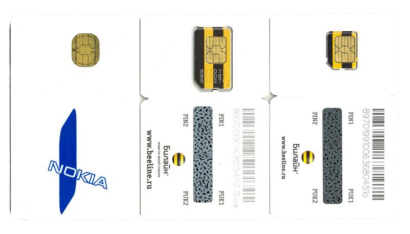
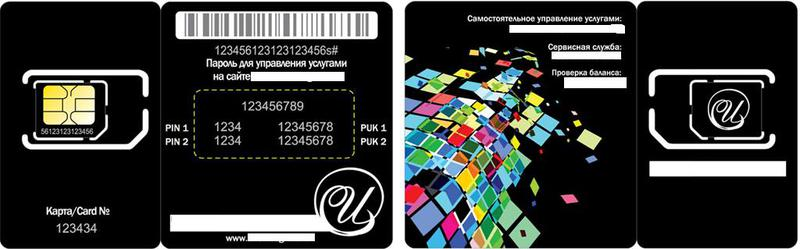
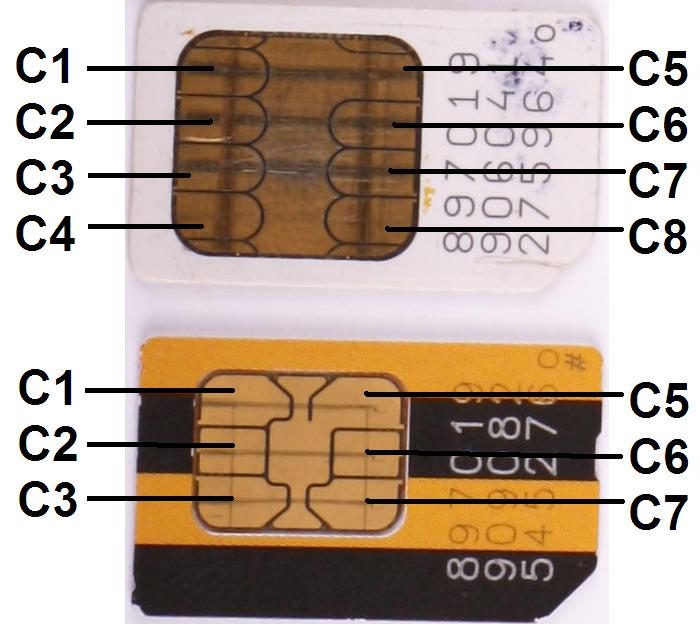
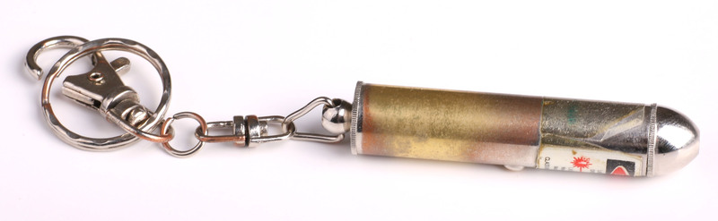
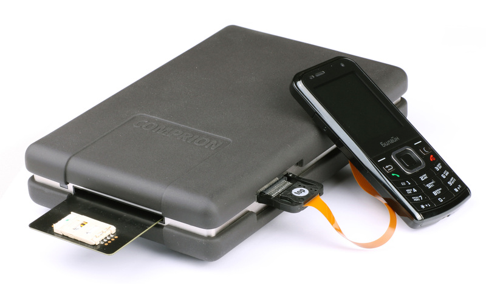

Ковыряемся в SIM-карте: процессор, память, файловая система + I/O / Блог компании ВымпелКом (Билайн)

Трудно найти человека, не знающего, что такое SIM-карта или Subscriber Identity Module — модуль идентификации абонента. Этот кусочек пластика с золотистыми контактами на одной из поверхностей является ключом к услугам, предоставляемым оператором мобильной связи. А ещё внутри SIM-карты находится специализированный компьютер с достаточно сложной функциональностью.

#### SIM-карта — это та же процессорная кредитка, но в профиль

SIM-карта на самом деле одна из разновидностей более общей сущности – процессорной «умной карты» (Smart Card).

  
Процессор в теле SIM-карты

**Такие «умные карты» могут использоваться в различных целях:**

*   Идентификации абонентов мобильной связи.
*   Предоставления доступа к зашифрованному контенту различных платных систем, например, телевидения.
*   Как банковские карты
*   Для идентификация пользователя, которому предоставляется доступ к корпоративным сетям и т.п.

В различных системах мобильной связи модули идентификации абонентов называются по-разному. В стандартах GSM использовалось название SIM – Subscriber Identity Module, которое и закрепилось в обиходе. Модуль идентификации, используемый в сетях UMTS (3G) часто называют USIM – Universal Subscriber Identity Module, что на самом деле не совсем верно! Сам модуль называется UICC – Universal Integrated Circuit Card – универсальная карта с интегральной схемой («умная карта»), а USIM – это приложение (application), которое работает внутри UICC и используется для идентификации и обслуживания абонента в сети UMTS (3GPP TR 21.905).

В сетях CDMA для идентификации абонентов используется R-UIM – Removable User Identity Module. Слово Removable (сменяемый) подчеркивает его новый статус, поскольку раньше, в сетях IS-95 (стандарт связи, на базе которого работали сети CDMA в США, России и других странах, например, СОНЕТ в Москве) элементы, идентифицирующие абонента, размещались среди электронных компонентов телефона. Очевидно, что использование R-UIM существенно упрощает и замену телефона при его неисправности или покупке нового, и позволяет воспользоваться телефоном другого стандарта в роуминге.

Но далее речь пойдет о модулях идентификации абонентов, используемых в сетях GSM-UMTS, которые по традиции будем называть SIM или картами.

#### Померяемся картами?

В настоящее время стандартизированы три формата модулей идентификации абонентов GSM-UMTS.

  
Три формата модулей идентификации абонента GSM-UMTS

ID-1 UICC – самый первый вариант – имеет размер обычной банковской карты. Многие помнят его по моделям 90-х годов – Motorola 8900, StarTAC и других. В настоящее время в новых моделях мобильных терминалов практически не используется из-за больших габаритов.

Plug-in UICC – наиболее распространенный сейчас формат. Обычно такие модули выламываются из карт размера ID-1 по просечкам, сделанным во время изготовления.

Mini-UICC – формат карт, который начала использовать компания Apple в iPhone 4, iPad, iPad 2. Сейчас и другие производители мобильных телефонов и других устройств намерены выпускать модели, в которые нужно будет вставлять модули именно такого формата. Иногда этот формат называют 3FF, или в просторечии «микро-SIM». И эти карты обычно выламываются из карты формата ID-1. Причины появления такого разнообразия очевидны – экономия места внутри корпуса телефона.

Универсальную просечку, позволяющую по выбору пользователя выломать из пластика карты ID-1 модуль размером как Plug-in, так и Mini-UICC, стараются не делать по соображениям надежности – при попытке выломать карту под формат Plug-in очень легко повредить остающиеся тонкие перемычки, после чего карта Plug-in будет ненадежно держаться в телефоне.

  
Карта ID-1 с «универсальной» просечкой для Plug-in и Mini-UICC

А смещение SIM-карты в держателе грозит проблемами с работой телефона. Минимальная неприятность – телефон просто не ощущает присутствия SIM и не регистрируется в сети. В худшем варианте может получиться, как при перепутывании проводов – попадание напряжения не по адресу и замыкание с непредсказуемыми последствиями.

Производители мобильных терминалов кто активно, кто менее решительно, обычно возражают и против использования адаптеров, которые рекламируются для использования в них карт формата Mini-UICC в телефонах, рассчитанных на карты формата Plug-in. Адаптер имеет чуть большую толщину, чем модуль Plug-in, а кроме того, щели на стыке карты и адаптера могут при установке SIM ломать контакты в телефоне, лишая пользователя шансов на гарантийный ремонт.

В некоторые устройства, работающие в мобильной сети (навигаторы, устройства для контроля местоположения транспортных средств и т.п.) модули идентификации абонентов могут просто впаиваться в виде микросхем, но обычным абонентам с такими модулями обычно сталкиваться не приходится.

#### Cколько должно быть контактов?

В обиходе встречаются модули с разным рисунком контактной площадки и разным числом контактов. Некоторые производители используют «фирменный» рисунок контактной площадки, в качестве своей визитной карточки.

Стандартами предусмотрены 8 позиций для площадок, через которые модули соединяются с мобильными терминалами, но не всегда используются все из них. Часто встречаются карты с 6-ю контактами, а остальная металлизированная часть обычно подключена к «земле».

  
Карты с 6-ю и 8-ю контактами

Используемые контакты:  
**С1** — Vcc — питание;  
**С2** — Reset – контакт управления картой;  
**С3** — CLK — Clock – тактовая частота;  
**C5** — общий («земля»);  
**С6** — Vpp – напряжение программирования, которое используется при записи служебной информации  
**C7** — I/O – линия последовательного интерфейса ввода/вывода.

Стандартами предусмотрено использование и контактов C4 и С8 в режиме обмена информацией с мобильным терминалом в режиме USB, обеспечивающем более высокую скорость передачи информации, чем через обычный I/O интерфейс SIM.

На практике сейчас режим USB-интерфейса фактически не используется, поскольку оборудование с этим интерфейсом практически не производится и не заказывается потребителями, поэтому эти контакты, даже если они есть на карте, соединены с «землей». В дальнейшем будет обсуждаться работа через линию I/O интерфейса.

#### Куда они воткнули компьютер?

Сравнивая электронное содержимое SIM с компьютером (особенно, с карманным), можно найти много одинаковых по функции элементов:

*   Процессор (CPU);
*   Оперативная память (ОЗУ, RAM);
*   Постоянная память для хранения операционной системы ПЗУ (ROM);
*   Память для хранения информации пользователей;
*   Файловая система;
*   Контроллер ввода-вывода (I/O controller).

Есть и отличия — то, чего нет в модуле:

*   Элементы интерфейса с человеком, которые попросту не нужны модулю.
*   Источник питания (используется питание терминала)
*   Генератор тактовой частоты (аналогично, снабжение из терминала).

Дополнительную информацию об архитектуре и производстве SIM можно посмотреть [вот в этом топике](http://habrahabr.ru/blogs/telecom/93210/).

Объем памяти, которую можно использовать для хранения информации в SIM, бывает разный и постепенно растет по мере развития технологий. Несколько лет назад была вспышка эйфории от появления технологии, позволяющей разместить в SIM гигабайты информации. Именно тогда после жаркой дискуссии в отрасли и двух туров голосования в GSM Association, был выбран стандарт USB для работы с большими объемами информации. Но потом эйфория стихла, и сейчас на рынке не так уж много и мобильных терминалов, способных работать с такими SIM, да и сами SIM с гигабайтным объемом памяти не пользуются особым спросом у операторов.

#### Можно ли хранить HD-фильмы на SIM-картах?

А зачем нужны большие объемы памяти SIM-карт и какие объемы памяти реально нужны?  
Память SIM используется для нескольких целей:

*   **Хранение информации, которая жизненно необходима для работы телефона** с этой SIM в сети мобильной связи. Например, это IMSI – International Mobile Subscriber Identity — последовательность цифр, которая не только идентифицирует конкретную SIM и ее владельца, но и указывает, какой оператор из какой страны ее выпустил. Эта информация помогает в роуминге быстро разобраться, где узнавать, какие услуги можно предоставлять телефону с этой картой, ведь первые три цифры IMSI – это код страны, а следующие две цифры – код сети (в Америках код сети состоит из трех цифр). Это Ki – секретный ключ, который обеспечивает возможность для сети убедиться, что это действительно «своя» SIM-карта, а не какой-то мошенник использует чужой IMSI для получения доступа к услугам. Плюс файлы для хранения другой служебной информации.
*   **Хранение пользовательской информации**. Обычно в картах размещается телефонная книга, принятые SMS-ки. В картах для сети UMTS телефонная книга может иметь существенно большую функциональность, чем просто список имен и соответствующих им номеров телефонов. Можно к имени привязывать несколько номеров, добавлять адрес электронной почты и другую информацию. Однако в связи с развитием этих же функций в самих телефонах, эти возможности SIM практически не используются.
*   **Размещение файлов приложений**, которые могут выполняться во встроенной в SIM виртуальной Java-машине и обеспечивать предоставление некоторых услуг. Если оператор активно использует услуги на базе приложений, выполняемых в SIM-карте, то эта часть может занимать наиболее значимую часть памяти карты.

Очевидно также, что увеличение объема памяти удорожает SIM, и поэтому сейчас операторы, чаще всего, стараются ограничиться объемами, минимально необходимыми для размещения нужной информации.

#### Кто кем рулит?

Кроме того, что телефон или другой мобильный терминал предоставляет SIM-карте питание и сигнал тактовой частоты, он полностью отвечает и за обмен информацией между устройствами – телефон всегда выступает в роли ведущего, а карта всегда является ведомым.

Телефон посылает в SIM команды/запросы, а SIM только отвечает на них, сопровождая ответы информацией о статусе ответа.

В информации о статусе карта может подтвердить, что команда выполнена успешно, попросить дополнительное время на подготовку ответа, сообщить об ошибках различного типа или сообщить, что у нее есть специальная информация для телефона, которую тот может получить, послав в следующей команде специальный запрос на выборку.

Этот механизм передачи информации из карты в телефон обычно называют SIM (или Card) Application Toolkit, STK. Он используется для реализации различных услуг, в основе которых лежат программы-приложения (обычно написанные на JavaCE – Java Card Edition), исполняемые внутри SIM. В меню телефонов, с установленными SIM-картами основных операторов, можно найти пункты и целые деревья меню, сформированные на основе информации, предоставленной приложениями, работающими в SIM-картах.

На этой же технологии основана работа услуг реального времени, например, постоянно предоставляющих информацию об актуальном балансе.

Возможна организация роуминга для небольших компаний с использованием переключения двух IMSI в одной карте – одного, соответствующего своей сети, а другого – предоставленного «взаймы» другим оператором — «старшим братом». Например, сети «Билайн», работающие в странах СНГ, используют механизм Dual IMSI для предоставления услуг роуминга своим абонентам. В их SIM-картах прописаны один IMSI своей сети, а другой IMSI, соответствующий российской сети «Билайн». В российской сети «Билайн» эти IMSI зарезервированы в HLR для предоставления услуг роуминга «дочерним» компаниям и организованы каналы связи с ними. Абонент «Билайн» из «дочерней» компании, находясь, например, в европейской стране, с помощью STK-меню переключает режим работы SIM в роуминговый. В результате телефон с такой SIM-картой представляется для роуминговой сети, как принадлежащий абоненту российской сети «Билайн». Дальше все происходит, как обычно, только российская сеть «Билайн» организует передачу информации по поручению «дочерней» сети.

Внутри SIM можно организовать даже WEB-сервер! Так что, если кого-то смущает «рабское положение» SIM, он вполне может считать ее сервером.

#### Как оно включается и почему медленно грузит книгу?

После включения и запуска операционной системы телефон подает на SIM напряжение питания Vcc. Стандартами предусмотрены три номинала напряжений питания SIM – 5В, 3В и 1,8В.  
Раньше выпускались карты, способные работать только при напряжении 5В. После появления телефонов, которые подавали на карту напряжение не более 3В, эти старые SIM постепенно были заменены новыми, способными работать от напряжения 3В, которые выдерживают и работу в телефонах, предоставляющих 5В.

Поскольку телефонов, которые предоставляют SIM-картам напряжение только 1,8В, пока не встречалось, современные SIM-карты проблем совместимости из-за напряжений питания не создают.

После того, как на телефон подано напряжение питания, подается сигнал тактовой частоты, и после установления стабильного режима поднимается напряжение на контакте Reset. Это служит для SIM-карты сигналом начала работы с нею, на что она отвечает последовательностью байтов, которая называется ATR (Answer To Reset).

Байты ATR содержат базовую информацию о возможностях карты и поддерживаемых протоколах обмена информацией. В частности, он могут подсказать телефону возможные варианты ускорения обмена информацией через интерфейс путем увеличения тактовой частоты и скорости передачи информации.

Прочитав информацию из ATR, телефон может запустить процедуру PPS (Protocol and Parameter Selection) согласования режима обмена информацией телефона с картой. Если телефон не способен найти вариант, приемлемый и для него и для SIM, то общение с картой продолжится в режиме по умолчанию (со скоростью 9600 бит/сек).

В таких случаях абоненты часто жалуются на слишком большую продолжительность считывания телефонной книжки из SIM-карты в телефон, почему-то укоряя при этом оператора, выпустившего SIM-карту.

#### «Привет, ты кто?»

В процессе включения SIM-карта и мобильный терминал (телефон) обмениваются «визитными карточками». Телефон считывает из SIM файл, содержащий SST – SIM Service Table — определенным образом закодированную информацию о тех функциях STK, которые SIM умеет выполнять. В свою очередь телефон отправляет в SIM-карту TERMINAL PROFILE — определенным образом закодированную информацию о том, какие функции общения с SIM он сможет поддерживать. В результате обе стороны получают информацию о способностях партнера и могут правильно взаимодействовать при реализации услуг на базе STK.

#### Файловая система и безопасность

SIM имеет многоуровневую иерархическую файловую структуру с разграничением доступа.  
Доступ к файлам регулируется необходимостью предварительного предъявления пользователем кодов доступа разных типов.

Часть этих кодов доступа хорошо известна – это Personal Identification Numbers — PIN (он же PIN1) и PIN2. Другие коды используются для административного доступа к служебным файлам.

Что дает такое разграничение? Активированный запрос PIN позволяет обезопасить деньги на лицевом счете, связанном с SIM-картой, от несанкционированного использования посторонними лицами.

Другим важным приемом обеспечения безопасности является, например, невозможность считывания информации из некоторых файлов, например, считывание ключа Ki, который используется в различных криптографических алгоритмах при аутентификации абонента и формировании ключей шифрования трафика.

#### Почему полезно читать инструкции

Несколько лет назад на круглом столе по перспективам смартфонов, организованном одним из производителей, один из участников пожаловался мне, что у «Билайн» не хватает услуги очень полезной для родителей. Он хотел, чтобы родители могли бы ограничить для своих чад возможность позвонить только на определенный набор телефонных номеров – домой, родителям, бабушкам с дедушками, а на остальные номера телефон ребенка звонить не должен.

Каково же было его удивление, когда я показал ему работу функции FDN – Fixed Dialing Numbers, которая реализуется совместными действиями телефона и SIM-карты. Разрешенные номера с помощью телефона просто записываются в определенный файл SIM-карты, и доступ на изменение этого списка блокируется с помощью PIN2. После этого телефон с такой SIM будет отказываться звонить по номерам, не указанным в списке FDN.

Правда, нужно отметить, что не все телефоны поддерживают работу этой услуги.

#### Мойте руки перед едой

Кожа пальцев покрыта органическими жирными кислотами, которые при контакте вызывают коррозию металлических деталей. Мелкие детали — это как раз про контакты SIM-карты.  
На фотке лазерная указка, поверхность которой после довольно редкого использования лишилась нескольких слоев металлического покрытия – хромирования и меднения как раз из-за этих жирных кислот! Как известно, «радиотехника – это наука о контактах», а у SIM их много!

  
Лазерная указка, пострадавшая от жирных кислот на пальцах

Подобная участь не должна постичь контакты SIM-карты, а для этого нужно всеми способами оберегать контакты SIM от загрязнения, и стараться не трогать их пальцами!

Если уж проблема с контактами между телефоном и SIM возникла, то помочь может аккуратная очистка контактов мягким ластиком. Только не нужно после операции очистки убирать крошки с контактов пальцами, иначе все проблемы начнутся сначала! Лучше просто сдуть их или аккуратно смыть спиртом.

#### Менять или не менять?

Однажды в офис «Билайн» пришел абонент, которого из сервиса по ремонту телефонов отправили менять SIM-карту, потому, что его вполне новый телефон самопроизвольно выключался во время звонка, проверки баланса, отправке SMS.

Пришлось объяснить ему, что выключение телефона не имеет никакой связи с исправностью SIM. С помощью ластика, я аккуратно почистил контакты на батарее и в телефоне, после чего телефон стал нормально работать. Попутно прочел абоненту маленькую лекцию о гигиене.

Конечно, не во всех случаях ситуация столь очевидна, и определить, кто виноват – телефон или SIM в том, что услуги не работают, не просто – ведь их общение происходит практически интимно. Особенно важно разобраться в причинах конфликтов при разработке новых услуг, использующих STK или при обнаружении проблем несовместимости SIM с какими-то моделями телефонов или других мобильных терминалов.

В таких случаях неоценимую услугу оказывает анализатор протоколов обмена информацией на интерфейсе SIM-терминал:

  
Анализатор протоколов обмена информацией между SIM и мобильным терминалом.

Вместо SIM-карты в терминал вставляется специальный пробник, а SIM подключается через гибкий шлейф. Во время работы вся информация о событиях, происходящих на интерфейсе, записывается в память подключенного к анализатору компьютера.

Сравнение собранной информации с требованиями стандартов, позволяет однозначно и убедительно установить виновную в конфликте сторону.

Конечно, в материале затронуты лишь некоторые особенности SIM-карт и их работы в телефонах, но если есть интерес к этой теме, просто задавайте вопросы, я обстоятельно отвечу.

P.S. Сегодня Boomboorum написал ещё обзор [нашего офиса](http://habrahabr.ru/blogs/office/133358/).