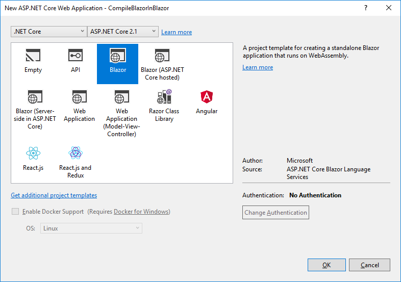
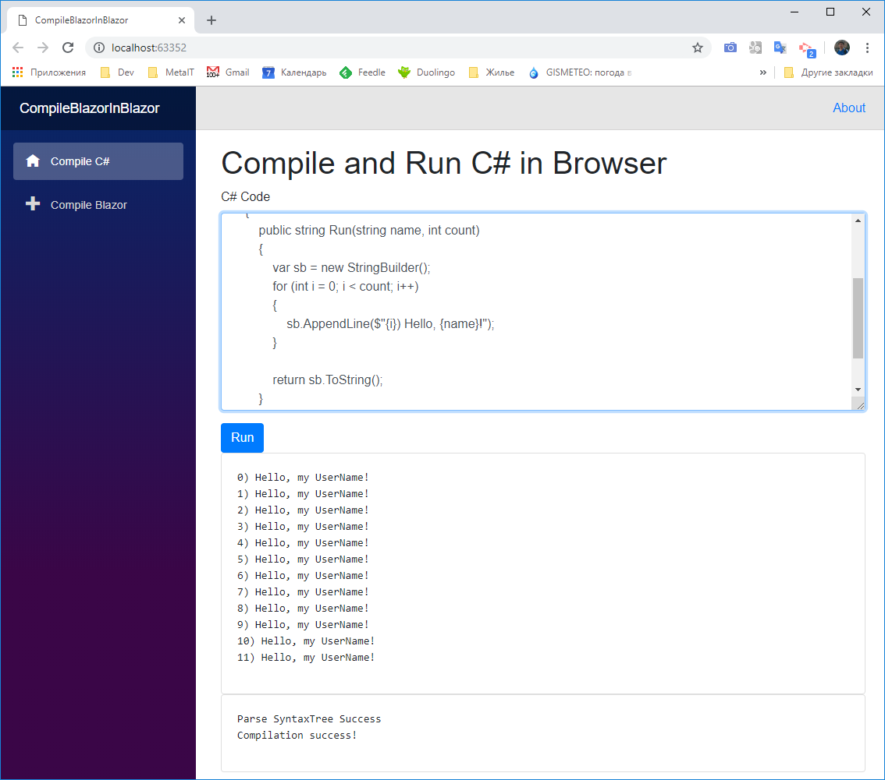
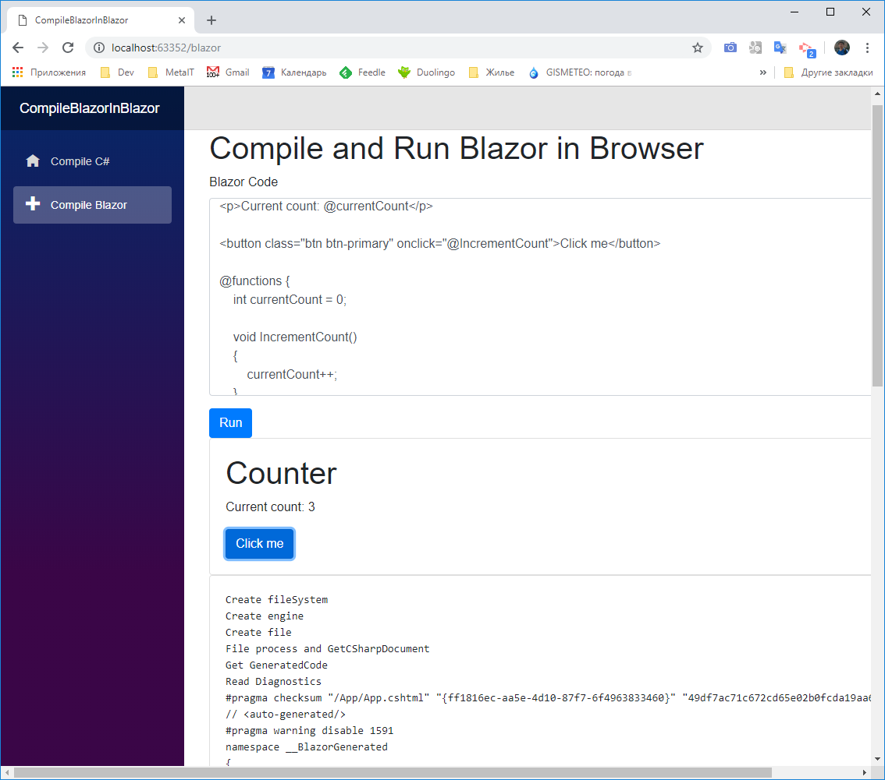

Компиляция и запуск C# и Blazor внутри браузера

[SamProf](https://habr.com/ru/users/SamProf/ "Автор публикации") 20 декабря 2018 в 19:01

Если вы Web-разработчик и ведете разработку для браузера, то вы точно знакомы с JS, который может исполняться внутри браузера. Существует мнение, что JS не сильно подходит для сложных вычислений и алгоритмов. И хотя в последние годы JS cделал большой рывок в производительности и широте использования, многие программисты продолжают мечтать запустить системный язык внутри браузера. В ближайшее время игра может поменяться благодаря WebAssembly.

Microsoft не стоит на месте и активно пытается портировать .NET в WebAssembly. Как один из результатов мы получили новый фреймворк для клиенской разработки — Blazor. Пока не совсем очевидно, сможет ли Blazor за счет WebAssembly быть быстрее современных JS — фреймворков типа React, Angular, Vue. Но он точно имеет большое преимущество — разработка на C#, а так же весь мир .NET Core может быть использован внутри приложения.

Процесс компиляции и выполнения такого сложного языка как C# — это сложная и трудоемкая задача. `А можно ли внутри браузера скомпилировать и выполнить С#?` — Это зависит от возможностей технологии (а точнее, ядра). Однако в Microsoft, как оказалось, уже все подготовили для нас.

Для начала создадим Blazor приложение.

После этого нужно установить Nuget — пакет для анализа и компиляции C#.

  

    Install-Package Microsoft.CodeAnalysis.CSharp

Подготовим стартовую страницу.

  

    @page "/"
    @inject CompileService service
    
    <h1>Compile and Run C# in Browser</h1>
    
    

        

            <label for="exampleFormControlTextarea1">C# Code</label>
            <textarea class="form-control" id="exampleFormControlTextarea1" rows="10" bind="@CsCode"></textarea>
        

        <button type="button" class="btn btn-primary" onclick="@Run">Run</button>
        

            

                <pre>@ResultText</pre>
            

        

        

            

                <pre>@CompileText</pre>
            

        

    

    
    @functions
    {
        string CsCode { get; set; }
        string ResultText { get; set; }
        string CompileText { get; set; }
    
        public async Task Run()
        {
            ResultText = await service.CompileAndRun(CsCode);
            CompileText = string.Join("\r\n", service.CompileLog);
            this.StateHasChanged();
        }
    }

Для начала надо распарсить строку в абстрактное синтаксическое дерево. Так как в следующем этапе мы будем компилировать Blazor компоненты — нам нужна самая последняя (`LanguageVersion.Latest`) версия языка. Для этого в Roslyn для C# есть метод:

  

    SyntaxTree syntaxTree = CSharpSyntaxTree.ParseText(code, new CSharpParseOptions(LanguageVersion.Latest));

Уже на этом этапе можно обнаружить грубые ошибки компиляции, вычитав диагностику парсера.

  

                foreach (var diagnostic in syntaxTree.GetDiagnostics())
                {
                    CompileLog.Add(diagnostic.ToString());
                }

Далее выполняем компиляцию `Assembly` в бинарный поток.

  

    CSharpCompilation compilation = CSharpCompilation.Create("CompileBlazorInBlazor.Demo", new[] {syntaxTree},
        references, new CSharpCompilationOptions(OutputKind.DynamicallyLinkedLibrary));
    
    using (MemoryStream stream = new MemoryStream())
    {
        EmitResult result = compilation.Emit(stream);
    }
    

Следует учесть, что нужно получить `references` — список метаданных подключенных библиотек. Но прочитать эти файлы по пути `Assembly.Location` не получилось, так как в браузере файловой системы нет. Возможно, есть более эффективный способ решения этой проблемы, но цель данной статьи — концептуальная возможность, поэтому скачаем эти библиотки снова по Http и сделаем это только при первом запуске компиляции.

  

    foreach (var assembly in AppDomain.CurrentDomain.GetAssemblies())
    {
        references.Add(
            MetadataReference.CreateFromStream(
                await this._http.GetStreamAsync("/_framework/_bin/" + assembly.Location)));
    }
    

Из `EmitResult` можно узнать была ли успешной компиляция, а так же получить диагностические ошибки.  
Теперь нужно загрузить `Assembly` в текущий `AppDomain` и выполнить скомпилированный код. К сожалению, внутри браузера нет возможности создавать несколько `AppDomain`, поэтому безопасно загрузить и выгрузить `Assembly` не получится.

  

    Assembly assemby = AppDomain.CurrentDomain.Load(stream.ToArray());
    var type = assemby.GetExportedTypes().FirstOrDefault();
    var methodInfo = type.GetMethod("Run");
    var instance = Activator.CreateInstance(type);
    return (string) methodInfo.Invoke(instance, new object[] {"my UserName", 12});
    

На данном этапе мы скомпилировали и выполнили C# код прямо в браузере. Программа может состоять из нескольких файлов и использовать другие .NET библиотеки. Разве это не здорово? Теперь идем дальше.

  

Компоненты Blazor — это модифицированные `Razor` шаблоны. Поэтому чтобы скомпилировать Blazor комопнент, нужно развернуть целую среду для компиляции Razor шаблонов и настроить расширения для Blazor. Нужно установить пакет `Microsoft.AspNetCore.Blazor.Build` из nuget. Однако, добавить его в наш проект Blazor не получится, так как потом линкер не сможет скомпилировать проект. Поэтому нужно его скачать, а потом вручную добавить 3 библиотеки.

  

    microsoft.aspnetcore.blazor.build\0.7.0\tools\Microsoft.AspNetCore.Blazor.Razor.Extensions.dll
    microsoft.aspnetcore.blazor.build\0.7.0\tools\Microsoft.AspNetCore.Razor.Language.dll
    microsoft.aspnetcore.blazor.build\0.7.0\tools\Microsoft.CodeAnalysis.Razor.dll

Создадим ядро для компиляции `Razor` и модифицируем его для Blazor, так как по умолчанию ядро будет генерировать код Razor страниц.

  

    var engine = RazorProjectEngine.Create(BlazorExtensionInitializer.DefaultConfiguration, fileSystem, b =>
        {
            BlazorExtensionInitializer.Register(b);                    
        });
    

Для выполнения не хватает только `fileSystem` — это абстракция над файловой системой. Мы реализовали пустую файловую систему, однако, если вы хотите компилировать сложные проекты с поддержкой `_ViewImports.cshtml` — то нужно реализовать более сложную структуру в памяти.  
Теперь сгенерируем код из Blazor компонента C# код.

  

                var file = new MemoryRazorProjectItem(code);
                var doc = engine.Process(file).GetCSharpDocument();
                var csCode = doc.GeneratedCode;

Из `doc` можно также получить диагностические сообщения о результатах генерации C# код из Blazor компонента.  
Теперь мы получили код C# компонента. Нужно распарсить `SyntaxTree`, потом скомпилировать Assembly, загрузить её в текущий AppDomain и найти тип компонента. Так же как в предыдущем примере.

Осталось загрузить этот компонент в текущее приложение. Есть несколько способов, как это сделать, например, создав свой `RenderFragment`.

  

    @inject CompileService service
    
        

            

                @Result
            

        

    
    @functions
    {
        RenderFragment Result = null;
        string Code { get; set; }    
    
        public async Task Run()
        {
                var type = await service.CompileBlazor(Code);
                if (type != null)
                {         
                    Result = builder =>
                    {
                        builder.OpenComponent(0, type);
                        builder.CloseComponent();
                    };
                }
                else
                {             
                    Result = null;
                }
        }
    }
    

  

Мы скомпилировали и запустили в браузере Blazor компонент. Очевидно, что полноценная компиляция динамического кода C# прямо внутри браузера может впечатлить любого программиста.

Но тут следует учитывать такие "подводные камни":

  

*   Для поддержки двунаправленного биндинга `bind` нужны дополнительные расширения и библиотеки.
*   Для поддержки `async, await`, аналогично подключаем доп. библиотеки
*   Для компиляции связанных Blazor компонентов потребуется двухэтапная компиляция.

Все эти проблемы уже решены и это тема для отдельной статьи.

[GIT](https://github.com/BlazorComponents/CompileBlazorInBlazor)

[Demo](https://blazorcomponents.github.io/CompileBlazorInBlazor/)

Теги:

*   [blazor](https://habr.com/ru/search/?q=%5Bblazor%5D&target_type=posts)
*   [c#](https://habr.com/ru/search/?q=%5Bc%23%5D&target_type=posts)
*   [.net](https://habr.com/ru/search/?q=%5B.net%5D&target_type=posts)
*   [.net core](https://habr.com/ru/search/?q=%5B.net%20core%5D&target_type=posts)
*   [razor](https://habr.com/ru/search/?q=%5Brazor%5D&target_type=posts)
*   [compilation](https://habr.com/ru/search/?q=%5Bcompilation%5D&target_type=posts)