Комплексный подход к визуализации событий безопасности и измерению её эффективности

Привет, Хабр! Представляем вашему вниманию перевод статьи [A Full-Scale Security Visualization Effectiveness Measurement and Presentation Approach](https://ieeexplore.ieee.org/document/8455963)

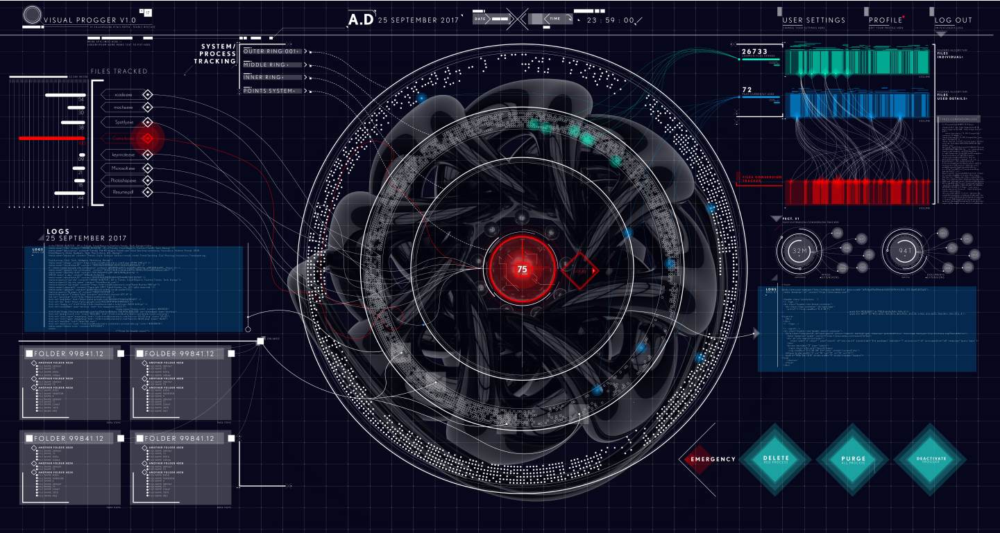

**_От автора перевода_**

_Визуализация оказывает неоценимую помощь экспертам в получении выводов и знаний об объекте исследований, особенно, если такие исследования связаны с обработкой большого объёма данных. При этом, выбор способов визуализации, как правило, носит творческий характер и не является обоснованным выбором на основании каких-либо количественных оценок. В статье предпринята попытка получения количественных оценок визуализации._

_Кроме того, необходимо отметить, что вопросам исследования визуализации в русскоязычных источниках уделяется мало внимания. Исследования, описанные в статье, находятся на стыке нескольких областей знаний: безопасность информации, психологии, науки о данных, что позволяет читателю познакомиться с ранее неизвестными для него темами. Также интерес представляет обширная библиография по теме изучения визуализации._

_Основные термины, используемые в тексте статьи, отмечены курсивном и для них в скобках указано значение иностранного термина. Определения таких терминов приведены после текста статьи._

  

Что делает визуальное представление событий безопасности эффективным? Как мы измеряем эффективность визуализации в контексте изучения, анализа, понимания сообщений об инцидентах безопасности информации? Обнаружение и понимание компьютерных атак имеют определяющее значение для принятия решений не только на техническом уровне, но и на уровне управления политикой безопасности. Наше исследование охватывает оба вопроса, что позволило дополнить нашу систему/платформу оценки эффективности визуализации событий безопасности (SvEm), предоставляя комплексный подход к оценке эффективности как для теоретических, так и для ориентированных на пользователя методов визуализации. За счёт использования интерактивной трёхмерной визуализации наша платформа SvEm позволяет повысить эффективность как одного пользователя, так и нескольких пользователей в ходе их совместной работы. Были исследованы такие показатели эффективности, как _зрительная наглядность_ (visual clarity), видимость (visibility), скорость искажений (distortion rate) и время отклика (просмотра) пользователя (user response (viewing) times).

Ключевыми компонентами платформы SvEm являются:

*   размер и разрешение дисплея мобильного устройства;
*   _сущности_ (entity) инцидентов безопасности;
*   _когнитивные активаторы_ (cognition activators) оповещения пользователя;
*   система оценки угроз;
*   _нагрузка на рабочую память_ (working memory load);
*   управление использованием цвета.

Чтобы оценить нашу платформу комплексной оценки эффективности визуализации событий безопасности, мы разработали (с использованием веб\- и мобильных технологий) приложение VisualProgger для визуализации событий безопасности в режиме реального времени. Наконец, визуализация SvEm направлена на повышение _концентрации внимания_ (attention span) пользователей путём обеспечения постоянной _когнитивной нагрузки_ (cognitive load) при увеличили _нагрузки на рабочую память_ наблюдателя. В свою очередь визуализация событий безопасности предоставляет пользователю возможность для возникновения _озарения_ (insight) о состоянии защищённости информации. Наша оценка показывает, что наблюдатели работают лучше с предварительным знанием (_нагрузка на рабочую память_) о событиях безопасности, а также что круговая визуализация лучше привлекает и поддерживает _концентрацию внимания_ пользователя. Эти результаты позволили определить направления будущих исследований, связанных с оценкой эффективности визуализации событий безопасности.

[1 Введение](https://habr.com/ru/post/436620/#1)  
[2 История вопроса и область исследований](https://habr.com/ru/post/436620/#2)  
[3 Связанные работы](https://habr.com/ru/post/436620/#3)  
[3.1 Методы оценки визуальных представлений информации](https://habr.com/ru/post/436620/#31)  
[3.2 Метод оценки: ранжирование визуальных представлений корреляций](https://habr.com/ru/post/436620/#32)  
[3.3 Методы графического представления](https://habr.com/ru/post/436620/#33)  
[3.4 Ошибки восприятия в визуализациях](https://habr.com/ru/post/436620/#34)  
[3.5 Понятия когнитивности, восприятия и озарения в визуализации](https://habr.com/ru/post/436620/#35)  
[4 Схема платформы SvEm](https://habr.com/ru/post/436620/#4)  
[4.1 Архитектура серверной части системы](https://habr.com/ru/post/436620/#41)  
[4.2 Технические аспекты визуализации событий безопасности](https://habr.com/ru/post/436620/#42)  
[4.3 Сущности, отношения и пространства инцидентов безопасности](https://habr.com/ru/post/436620/#43)  
[4.4 Цветовой стандарт визуализации безопасности](https://habr.com/ru/post/436620/#44)  
[4.5 Когнитивные требования для визуализации безопасности](https://habr.com/ru/post/436620/#45)  
[5 Результаты: платформа визуализации безопасности](https://habr.com/ru/post/436620/#5)  
[5.1 Теория SvEm](https://habr.com/ru/post/436620/#51)  
[5.2 Поток обработки данных](https://habr.com/ru/post/436620/#52)  
[5.3 Пример 1. Приложение для совместной работы с визуализацией событий безопасности в режиме реального времени](https://habr.com/ru/post/436620/#53)  
[5.4 Пример 2. Визуализация программы-вымогателя Locky](https://habr.com/ru/post/436620/#54)  
[5.5 Пример 3. Эффективное взаимодействие с визуализацией дополненной реальности](https://habr.com/ru/post/436620/#55)  
[5.6 Масштабирование визуализации в соответствии с размерами дисплея](https://habr.com/ru/post/436620/#56)  
[6 Оценка и тестирование платформы SvEm](https://habr.com/ru/post/436620/#6)  
[6.1 Концептуальная модель SvEm](https://habr.com/ru/post/436620/#61)  
[6.2 Тестирование производительности платформы SvEm](https://habr.com/ru/post/436620/#62)  
[6.3 SvEm-оценка пользователей](https://habr.com/ru/post/436620/#63)  
[6.4 Оценка когнитивной нагрузки](https://habr.com/ru/post/436620/#64)  
[6.5 Система обнаружения угроз](https://habr.com/ru/post/436620/#65)  
[7 Заключение](https://habr.com/ru/post/436620/#7)  
[8 Благодарности](https://habr.com/ru/post/436620/#8)  
[9 Ссылки на использованные источники](https://habr.com/ru/post/436620/#9)

Визуализации событий безопасности (security visualizations) оказываются полезными при формировании представления о состоянии защищённости, но насколько они эффективны? Помогает ли визуализация принятию решения в критической ситуации или только отвлекает внимание? Настоящее исследование создаёт основу для оценки эффективности и разработки визуальных представлений в области безопасности информации.

Наше основное внимание направлено на улучшение платформы SvEm [\[11\]](https://habr.com/ru/post/436620/#_11) путём проведения комплексной оценки эффективности визуальных представлений событий безопасности на каждом этапе восприятия визуализации. Предполагается, что читатель уже имеет представление о визуализации в области безопасности информации.

Мы рассматриваем вопросы производительности процессов обработки данных, _зрительной наглядности_, а также удобного использованию функций интерактивной работы пользователя с данными. Для измерения эффективности визуализации событий безопасности требуется комплексная оценка как веб-, так и мобильных платформ, а также времени реакции пользователей при взаимодействии с ними.

В тот момент, когда пользователь взаимодействует с некоторым визуальным представлением событий безопасности, мы заинтересованы в том, чтобы, во-первых, понять, как визуализация может наиболее быстро привлечь внимание пользователя, а, во-вторых, каким образом можно измерить продолжительность концентрации его внимания. Для этого необходимо наблюдение за эффективностью _когнитивной нагрузкой_ пользователя и _нагрузкой на его рабочую память_. Визуализация наиболее эффективна, когда _когнитивная нагрузка_ уменьшается, а _нагрузка на рабочую память_ растёт.

В большинстве научных исследований, направленных на изучение платформ визуализации и пользовательского интерфейса, понятие повышения эффективности означает повышение производительности за счёт сокращения времени достижения значимых результатов. В статье для разработанной нами платформы понятие «эффективность» связано с визуализацией событий безопасности как целостным и комплексным подходом, который призван максимально упростить восприятие существенной информации в результате взаимодействия пользователя с визуализацией.

В настоящей статье мы измеряем эффективность всего процесса визуализации безопасности: как процесса графического отображения, так и процесса взаимодействия с пользователем. Мы также уверены, что визуализация событий безопасности способствует автоматизированному анализу данных, получая полезные сведения из необработанных данные о событиях безопасности (сетевых атаках). Визуальные представления событий безопасности наглядно и в динамике показывают пользователю инциденты безопасности, а также связи инцидентов между собой [\[14\]](https://habr.com/ru/post/436620/#_14). Интерактивность вызывает интерес пользователя к совершению необходимых взаимодействий с визуализаций для формирования представления о пространстве проведения компьютерных атак. Визуализация также облегчает возможность обработки больших объёмов данных и наглядного отображения тенденций и модели.

Тем не менее, существуют проблемы, связанные с представлением информации и производительностью, поэтому целью настоящей статьи является измерение эффективности процессов визуализации событий безопасности. Наше исследование обеспечивает связь между когнитивными знаниями пользователей и платформой измерения эффективности визуализации событий безопасности (SvEm – security visualization effectiveness measurement) [\[11\]](https://habr.com/ru/post/436620/#_11). Наш подход измерения эффективности охватывает этапы планирования, проектирования, внедрения, оценки, валидации и взаимодействия с пользователем (целевой аудиторией).

В следующем разделе мы рассмотрим результаты существующих исследований по измерению эффективности визуализации. Затем обсудим результаты разработки платформы SvEm. В заключении мы представим направления будущих исследований.

Пока пользователи выбирают способы визуализации на основании своих индивидуальных предпочтений и потребностей, существует необходимость в оценке эффективности таких способов. Современные подходы [\[11\]](https://habr.com/ru/post/436620/#_11), [\[12\]](https://habr.com/ru/post/436620/#_11), [\[17\]](https://habr.com/ru/post/436620/#_11), [\[40\]](https://habr.com/ru/post/436620/#_11) используют такие показатели, как _производительность пользователя_ (user performance), _наглядность_ (clarity), степень _качества/искажения_ изображения (image quality/distortion rate), оценка восприятия (perception assessment), мера визуализации взаимосвязей (visualization correlation measurement), измерения активности мозга (brain activity measurement) и степень соответствия визуализации (how well visualization). Рассмотрим имеющиеся источники более подробно.

## 3.1 Методы оценки визуальных представлений информации

В большинстве методов оценки учитываются только технические аспекты изображений, такие как _наглядность_ и узнаваемость. Однако наиболее предпочтительными оказываются визуальные представления, которые привлекают наблюдателей и способны самостоятельно передать суть информации без необходимости дополнительных разъяснений. Это является самым ожидаемым результатом для большинства художников и экспертов по визуализации. Та основа, что присутствует как в визуализации, так и у пользователей, пробуждает у них познавательные способности, запускающие механизмы эффективности. Таким образом, для повышения эффективность требуются некоторые методы оценки, позволяющие улучшить визуализацию.

## 3.2 Метод оценки: ранжирование визуальных представлений корреляций

Подход, успешно используемый в учебных занятиях на наборах данных, обычно применяется для получения научных оценок производительности, прозрачности и целостности. Харрисон в [\[12\]](https://habr.com/ru/post/436620/#_12) показал возможность применения закона Вебера [\[4\]](https://habr.com/ru/post/436620/#_4), [\[15\]](https://habr.com/ru/post/436620/#_15) и закона восприятия [\[15\]](https://habr.com/ru/post/436620/#_15) при ранжировании визуализации корреляции [\[20\]](https://habr.com/ru/post/436620/#_20). Другие подходы рассматривают корреляцию обучающего и наилучшего наборов данных, изображаемую при помощи диаграмм рассеяния и диаграмм с параллельными координатами [\[33\]](https://habr.com/ru/post/436620/#_33). Последние психологические и когнитивные исследования [\[15\]](https://habr.com/ru/post/436620/#_15) показали, что законы восприятия [\[20\]](https://habr.com/ru/post/436620/#_20) могут быть применены для моделирования восприятия людьми в рассматриваемой визуализации определённых свойств данных. Ренсинк продемонстрировал использование закона Вебера [\[33\]](https://habr.com/ru/post/436620/#_33) при создании модели Вебера Fit [\[12\]](https://habr.com/ru/post/436620/#_12). В этих исследованиях утверждается, что есть взаимосвязь между людьми и представленными данными. Человеческое восприятие способно различать взаимосвязи и объективные отличия в коррелируемых данных. Данное утверждение выражается следующей линейной зависимостью:

dp=kdSS

где

dp

– дифференциал изменения восприятия;

k

– экспериментально полученный относительный порог (weber fraction);

dS

– дифференциал увеличения корреляции данных.

Ряд статистических исследований [\[12\]](https://habr.com/ru/post/436620/#_12) было проведено при помощи ранговых критериев:

*   критерий Крускала-Уоллиса [\[26\]](https://habr.com/ru/post/436620/#_26) для оценки отношения между визуализацией и корреляциями;
*   критерий Уилкоксона-Манна [\[16\]](https://habr.com/ru/post/436620/#_16), [\[29\]](https://habr.com/ru/post/436620/#_29) критерий для сравнения пар визуализаций;
*   коррекция Бонферрони [\[36\]](https://habr.com/ru/post/436620/#_36) для решения проблемы множественных сравнений и уменьшения ложно положительных результатов.

Хотя данный метод ранжирования визуализации корреляций доказал свою эффективность, он не имеет отношения к настоящей работе.

## 3.3 Методы графического представления

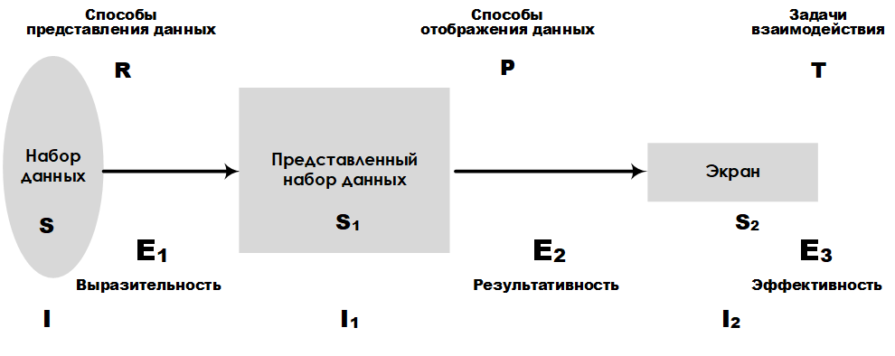

_Рис. 1\. Схема платформы E3_

Большинство устройств, подключённых к сети Интернет имеет возможность ведения журналов, что позволяет обеспечить высокую скорость сбора данных. Следовательно, требуется применение специальных способов представления информации, полученной из наборов данных. Рассмотрим в качестве примера графическую платформу для представления больших наборов данных E3, разработанную Леунгом К. Я и Апперли Д. Марком [\[24\]](https://habr.com/ru/post/436620/#_24). Аналитическая платформа E3 позволяет сравнивать различные способы представления данных с учётом объёмами таких данных. Основные характеристики, такие как выразительность (expressiveness), эффективность (efficiency) и результативность (effectiveness), позволяют ранжировать точность представления и задачи восприятия. На рис. 1 показана схема платформы E3, на которой отмечены ключевые компоненты и их связи с этапами проектирования системы представления больших наборов данных.

## 3.4 Ошибки восприятия в визуализациях

Другой распространённый метод измерения визуализации включает расчёт частоты ошибок (error rate) измерения качества или искажения изображения. На рис. 2 показана структура проекта, включающего этапы предварительной обработки, фильтрации, разделения канала и объединения ошибок.

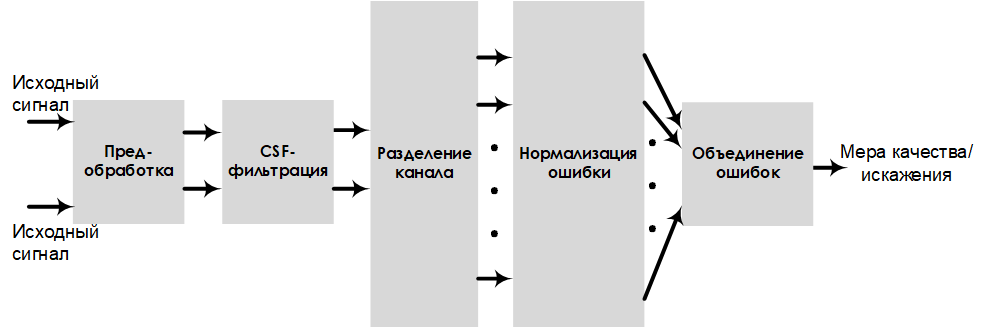

_Рис. 2\. Схема проекта, оценивающего чувствительность к ошибкам_

В этой модели качество изображения оценивается по показателям _зрительной наглядности_ и _искажениям_ изображения. Выполнение предварительной обработки и фильтрации улучшает результаты измерения качества/искажения (которые достаточно легко преобразовываются из одного в другой).

## 3.5 Понятия когнитивности, восприятия и озарения в визуализации

В психологии измерение эффективности визуализации осуществляется на основе оценок когнитивности (сognition), _восприятия_ (perception), _концентрации внимания_ и _нагрузки на рабочую память_ человека. Рациональное соотношение между познавательной способностью пользователя и _нагрузкой на рабочую память_ может быть определено с помощью оценки _умственных усилий_ (mental effort) (рис. 3). Например, оценка идеального пользователя (ideal user), при которой скорость чтения высока, а _умственные усилия_ низкие, находится в области А (рис. 3) [\[30\]](https://habr.com/ru/post/436620/#_30).

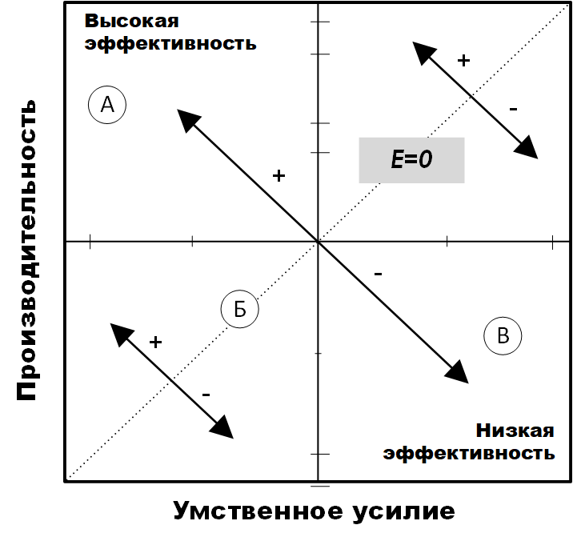

_Рис. 3\. Эффективность _умственных усилий_ [\[30\]](https://habr.com/ru/post/436620/#_30)_

Это также означает, что _нагрузка на рабочую память_ пользователя высока. Исследования пользователя предоставили средства для оценки _когнитивной нагрузки_ [\[17\]](https://habr.com/ru/post/436620/#_17), в частности способы оценки _умственных усилий_ и _производительности_, которые связаны с эффективностью визуализации.

Исследования [\[40\]](https://habr.com/ru/post/436620/#_40), [\[34\]](https://habr.com/ru/post/436620/#_34), [\[35\]](https://habr.com/ru/post/436620/#_35), проведённые InfoVis, показали возможность использования _озарения_ в качестве меры оценки технологий. _Озарение_ [\[40\]](https://habr.com/ru/post/436620/#_40) определяется как мера точного и глубокого понимания чего-либо, т. е. единица измерения открытия. Озарение часто приходит не в ходе решения специально поставленных для этого задач, а, как правило, является побочным продуктом исследований без начальной цели на достижение озарения.

Также важную роль в определении _озарения_ является процесс осмысления (sensemaking) [\[32\]](https://habr.com/ru/post/436620/#_32), хотя модель «информация-схема-озарение-продукт», используемая в данной работе, включает _озарение_ как компонент.

Обобщая результаты схожих работ, мы видим, что оценка эффективности визуализации затрагивает не только технологии, но и человека, который пользуется визуализацией. Рассмотрев в этом разделе ключевые сферы, связанные с эффективностью визуализации, у нас теперь есть чёткое понимание места настоящих исследований в методологии оценивания визуализации. Тем не менее, наша платформа ограничена визуализацией в области безопасности информации, связанной с оценкой эффективности измерений в отношении оперативной информации об инцидентах безопасности.

В целях реализации платформы, которая будет оценивать эффективность визуализации событий безопасности, важным этапом является этап проектирования. Поэтому в данном разделе мы представляем проектное решение нашей платформы. Платформа оценки эффективности визуализации безопасности SvEm состоит из следующих компонентов: рабочая поверхность мобильного дисплея, объекты инцидентов безопасности, события оповещения пользователя, система оценки угроз, загрузка оперативной памяти и компонент управления использованием цвета. Эти компоненты рассмотрены далее.

## 4.1 Архитектура серверной части системы

Инфраструктура серверной части платформы визуализации событий безопасности SvEm предназначена для размещения как статических, так и динамических (real-time) сценариев визуализации. Она управляет всеми процессами анализа, происходящими при работе с базой данных, а также в ходе сборки и агрегирования сведений. Архитектура нашей системы построена с использованием следующих технологий: Windows Progger (Logging Tool), Redis, MongoDB, Nodejs и WebGL. Windows progger (версия linux progger для Windows [\[21\]](https://habr.com/ru/post/436620/#_21)) – это инструмент ведения журнала событий на системном уровне (уровне ядра), который в настоящее время разрабатывается с упором на обеспечение безопасности в компьютерных и облачных системах. Redis [\[2\]](https://habr.com/ru/post/436620/#_2) облегчает связь между кешем и базой данных для Windows Progger и mongoDB. Все данные постоянно хранятся в mongoDB [\[3\]](https://habr.com/ru/post/436620/#_3), в то время как nodejs [\[39\]](https://habr.com/ru/post/436620/#_39) и webgl [\[5\]](https://habr.com/ru/post/436620/#_5), [\[31\]](https://habr.com/ru/post/436620/#_31) снижают сложность интерфейса клиентской части платформы визуализации.

Архитектура серверной части спроектирована с учётом особенностей процесса обработки данных при управлении их хранением. Предварительно обработанные данные создаются в результате выполнения сценария визуализации. Например, в режиме реального времени ведётся запись в журнал ядра системы компьютера с целью _отслеживания_ и _визуализации источников_ создания, изменения и удаления файлов.

Кроме того, данные стандартизированы для возможности оценки эффективности визуализаций безопасности в веб\-и мобильных платформах. Требования к веб\- и мобильным устройствам обеспечили эффективное решение задач запроса, обработки, анализа, рендеринга и масштабирования данных, решаемых в интересах визуализации событий безопасности. На рис. 4 показаны основные инструменты и библиотеки, необходимые для размещения серверной части платформы визуализации безопасности SvEm.

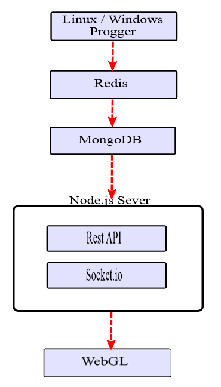

_Рис. 4\. Архитектура серверной части SvEm_

При проектировании платформы необходимо учитывать множество особенностей приложения, к основным из которых также относятся обеспечение безопасности, производительности обработки данных и _наглядности_ представления визуализации. Данные задачи для нашей платформы являются основными.

## 4.2 Технические аспекты визуализации событий безопасности

При разработке визуальных представлений должны быть учтены размеры мобильного устройства. Например, ограничения дисплея в 1920 x 1080 пикселей для IPhone 6s Plus с высотой 122 мм и шириной 68 мм (рис. 5), делают необходимым наличие элементов управления отображением в визуальном представлении.

_Рис. 5\. Параметры дисплея мобильного устройство_

Элементы управления включают элементы регулирования объёма обрабатываемых данных, выбора способа визуализации и типов визуализации, которые лучше всего соответствуют размерам экрана.

Чёткое понимание этих ограничений позволяет разработчикам визуализации событий безопасности принять во внимание возможность многомерного и/или кругового отображения. Подобные проекты позволят учесть большое количество атрибутов данных об инциденте безопасности.

### 4.2.1 Проект визуализации _отслеживания_ (attribution visualization design)

Процесс _отслеживания_ (attribution) [\[38\]](https://habr.com/ru/post/436620/#_38) в контексте информационной безопасности связан с определением источника компьютерной атаки. В визуализации событий безопасности изображение данного процесса является достаточно сложной задачей. Необходимо наличие достаточного набора исходных данных и чёткое понимание процесса _отслеживания_. Наш проект _отслеживания_ направлен на построение пути между источником и целями атаки. Основное внимание уделяется установлению источника компьютерной атаки, поскольку большинство точек траектории относятся к жертвам. Несмотря на наш проект визуализации _отслеживания_, на основании данных о реальных атаках нельзя в полном объёме визуализировать процесс _отслеживания_. Поэтому мы предлагаем набором шаблонов для прогнозной аналитики, при помощи которых могут быть связаны точки между ключевыми идентификаторами атаки для отслеживания с более высокого уровня при помощи визуализации.

### 4.2.2 Проект визуализации источников (provenance visualization design)

Ещё одна ключевая особенность платформы – эффективное отображения источников на основании большого объёма собранных данных. Большой объем данных преобразуется в визуализацию для мобильных платформ с учётом необходимости масштабирования и ограниченности рабочей области экрана.

Наша платформа использует проекты визуализации _отслеживания_ и _источников_ с краткой сводкой данных для оповещения пользователей о событиях безопасности. Отображение _источников_ имеет решающее значение для экспертов по безопасности и конечных пользователей, чтобы быть в курсе обстановки. На рис. 6 представлен проект визуализации _источников_ с информацией о времени, типе и источнике атаки.

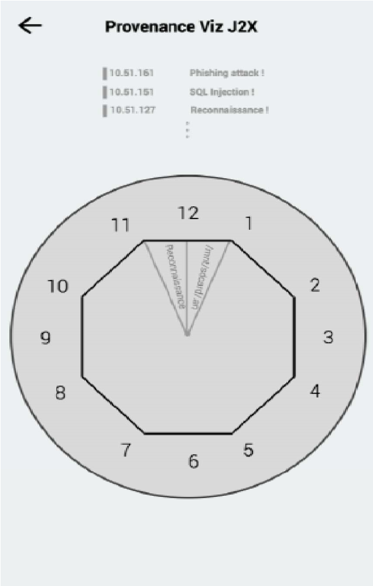

Рис. 6\. Проект визуализации _источников_ для мобильного устройства

Этот круговой проект призван обратить внимание пользователя на предоставленной информации и уменьшить количество перемещений по вкладкам для получения дополнительной информации.

### 4.2.3 Типы проектов визуализации

Другой важный аспект эффективности визуализации – предоставление пользователям (наблюдателям) возможность выбора из нескольких вариантов проектов визуализации в зависимости от требований к просмотру отображаемых данных. Это позволяет удовлетворить потребности более широкого круга аудитории.

В качестве элементов для визуализации событий безопасности в режиме реального времени наша инфраструктура предоставляет следующие варианты визуальных проектов [\[6\]](https://habr.com/ru/post/436620/#_6): «Завиток (спираль)», «Сфера» и «Сетка».

Как показано на рис. 7, проект «Завиток (спираль)» основан на принципе/законе Гештальта о непрерывности [\[37\]](https://habr.com/ru/post/436620/#_37).

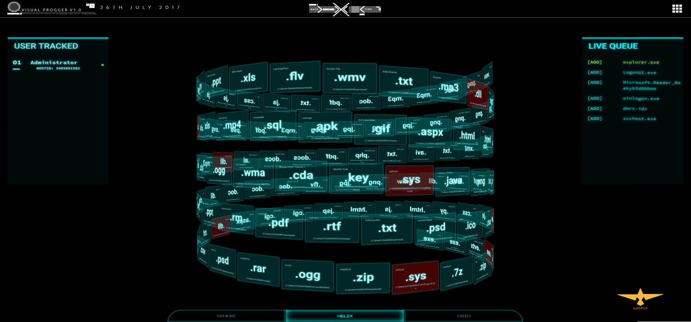

_Рис. 7\. Проект визуализации «Завиток (спираль)»_

Данная визуализация отображает порядок выполнения файлов и процессов в соответствии с подходом «первым вошёл, первым показал». Когда пользователь обратил внимание на конкретный файл, шаблон или некоторую группу с одинаковым поведением/цветом, он мысленно воспринимает наглядный образ, который легко понять.

Проект визуализации «Сфера» опирается на закон Гештальта о замкнутости/завершении, где все воспринимается как часть целого. На рис. 8 показана визуализация контента системы (цветом отмечены важные элементы).

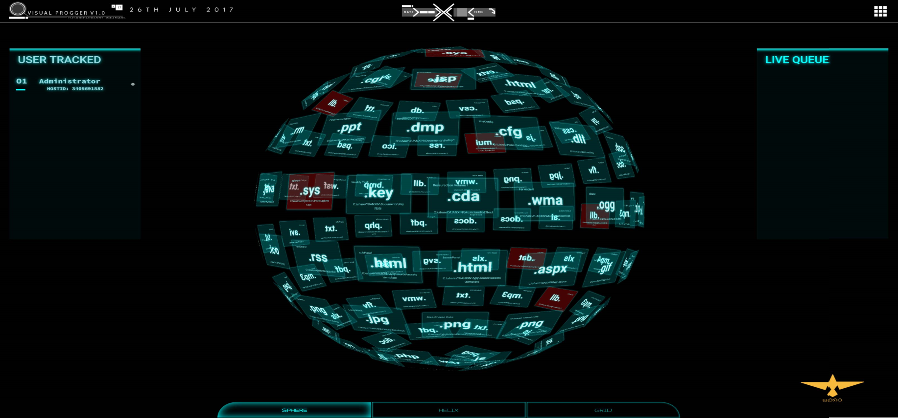

_Рис. 8\. Проект визуализации «Сфера»_

Данный способ является простым и понятным, а визуализацию можно масштабировать в зависимости от параметров дисплея мобильного устройства. Независимо от того, сколько файлов или процессов требуется показать, сферический подход формирует визуализацию, в которой все части представляют собой сумму целого.

Проект визуализации «Сетка» реализует многоуровневый подход к визуализации, при котором новые файлы визуально отображаются на переднем плане сетки визуализации. Этот дизайн привлекает внимание наблюдателей к новым файлам/процессам, представляющим интерес. Постоянное внимание наблюдателя удерживает их в фокусе, в то же время оставляя возможность другим механизмам оповещения передать информации наблюдателю. На рис. 9 показан пример проекта «Сетка» с несколькими слоями для файлов и процессов.

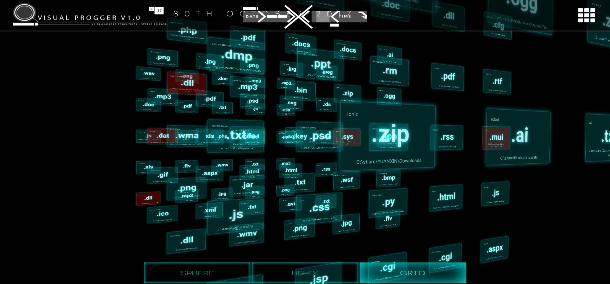

_Рис. 9\. Проект визуализации «Сетка»_

Дополнительно мы предоставляем проект «Вложенные кольца» (circular-layered), показанный на рис. 10.

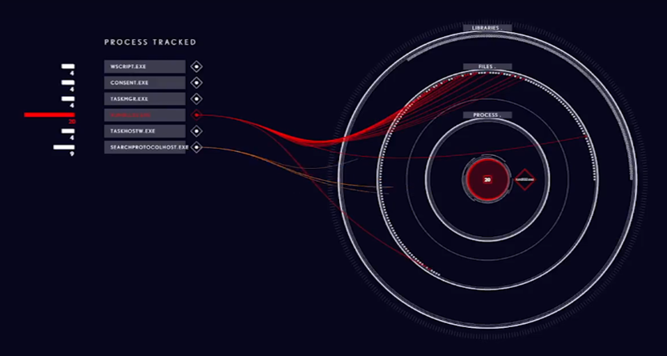

_Рис. 10\. Проект визуализации для мобильного устройства программы-вымогателя Locky_

Проект позволяет связать несколько атрибутов и категорий различных файлов и процессов. Результативность в этом случае проявляется в переходах между слоями, позволяя наблюдателям увидеть и понять, как работают различные файловые системы. Использование подхода к построению многоуровневых визуализаций позволяет связать между собой как различные уровни иерархии информации, так и информационные отношения.

### 4.2.4 Компоненты оценки угроз

Компоненты оценки угроз, который позволяет выявить и наглядно представить угрозы, является ещё одним важным компонент инфраструктуры SvEm. Наша схема оценки угроз (рис. 11) охватывает аномалии, вредоносные программы и настраиваемые механизмы обнаружения.

_Рис. 11\. Схема механизма анализа угроз_

Наборы данных фильтруются с помощью тестовых/обучающих и зафиксированных данных [\[10\]](https://habr.com/ru/post/436620/#_10) и баз данных сигнатур известных угроз. Обнаружение аномалий осуществляется в соответствии с алгоритмом, который будет рассмотрен в разделе об оценке и валидации. Наш базовый набор данных состоит из известных (предварительно обнаруженных) угроз, журналов, заполненных пользователем, а также известных моделей угроз и схемы поведения. Это создаёт лучшую среду для контроля и мониторинга.

## 4.3 Сущности, отношения и пространства инцидентов безопасности

  

### 4.3.1 Сущность

_Сущности, отношения_ (entities relationships) и _пространства безопасности_ (security landscapes) являются основными рабочими компонентами нашей платформы. К _сущностям_ относятся: субъекты угроз, вредоносные полезные нагрузки, скомпрометированные IP-адреса и многие другие. Эти объекты представляют интерес для того, как работает теория измерения эффективности SvEm. На производительность нашей платформы влияет возможность идентификации этих _сущностей_ с помощью визуализации за наименьшее время.

### 4.3.2 Отношения сущностей

_Отношения сущностей_, также известные как _ссылки_ (links), жизненно необходимы для нашей платформы. Функции _отношений сущностей_ связывают _сущности_ вместе. Эти ссылки также активируют когнитивные функции пользователя, которые помогают ему воспринимать скрытую информацию и потенциально способствуют _озарениям_ о состоянии защищённости.

### 4.3.3 Пространства инцидентов безопасности

_Пространства безопасности_ создают область инцидентов и среду для пользователей (наблюдателей), чтобы сконцентрировать их мысленные образы на определённом инциденте безопасности. Привычное пространство помогает пользователю мысленно ограничить область его взаимодействия с визуализацией.

## 4.4 Цветовой стандарт визуализации безопасности

Очень важно стандартизировать использование цветов для визуализации событий безопасности. Большие объёмы данных о _сущностях_, которые могут представлять интерес, требует упрощения визуализации событий безопасности в интересах ускорения процесса обработки информации. Например, использование цветов «красный» и «оранжевый» в одном визуальном пространстве автоматически создаёт путаницу для пользователей, что усложняет весь процесс визуализации. Наш стандартизированный набор цветов показан на рис. 12: «красный, жёлтый, зелёный, синий, фиолетовый и оранжевый».

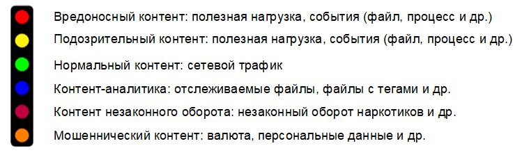

_Рис. 12\. Цветовой стандарт визуализации событий безопасности_

Эти цвета подразделяются на две группы: основную и дополнительную. Основную группу цветов составляют: красный, жёлтый, зелёный и синий цвета. К дополнительной группе относятся: фиолетовый и оранжевый. Дополнительные цвета предназначены для визуализации событий безопасности правоохранительными органами, использующими цветовые схемы, соответствующие системе уведомлений Интерпола [\[1\]](https://habr.com/ru/post/436620/#_1), [\[18\]](https://habr.com/ru/post/436620/#_18). Например, оранжевый цвет используется только для отображения оборота незаконного контента и рассматривается как самостоятельный тип визуализации.

Цветовой стандарт направлен на обеспечение простоты предварительного ознакомления в специально созданной для этого комфортной среде. С точки зрения разработчика, важно правильно понимать, как в визуализации цвета соотносятся с атрибутами событий безопасности. Это создаёт необходимость управления цветом во избежание неправильной интерпретации визуализации из-за возможных проблем наложения цветов при представлении инцидентов безопасности.

## 4.5 Когнитивные требования для визуализации безопасности

Обработка информации является естественной функцией человека, которую невозможно контролировать при помощи технологий. Однако существуют методы, которые можно применить при обработке информации для конкретной визуализации событий безопасности, в качестве форм управления. Применение таких методов направлено на снижение _когнитивного искажения_ (cognitive bias) [\[13\]](https://habr.com/ru/post/436620/#_13), которое часто приводит к неправильному восприятию, неточным суждениям и нелогичным выводам.

Поэтому наиболее важной частью проектирования нашей платформы SvEm является определение когнитивно-психологических признаков в визуализации событий безопасности. Это позволяет задать требования к эффективности всего процесса визуализации пользовательских задач.

Заданы требования к _когнитивной нагрузке_, _нагрузке на рабочую память_, _когнитивным активаторам_ пользователя.

Также определены следующие психологические задачи:

*   на уровне _внимания_ (attention process);
*   на уровне _подпорогового внимания_ (pre-attentive process);
*   на уровне _умственного усилия_ (для памяти).

С точки зрения приложения визуализации событий безопасности _когнитивные активаторы_ оповещения предназначены для связи наблюдателя с представленной визуализацией. Данные _активаторы_ мы называли терминами _временное удержание_ (Semi-permanent Hold) и _постоянное удержание_ (Permanent Hold). В разделе, посвящённом оценке (раздел VI), будет показано, какую важную роль они играют в нашей платформе.

  

## 5.1 Теория SvEm

Начнём с более детального объяснения нашего алгоритма SvEm. Алгоритм SvEm основан на следующих показателях:

*   теоретической оценке _искажения_ (dsvem);
*   теоретической оценке _времени_ (tsvem).

Теоретические оценки _искажения_ и _времени_ рассчитываются по формулам (1) и (2) соответственно:

dsvem=(w∗h)/Svf∗dnCl∗tme∗nclicks>50%(1)

секtsvem=(Cl∗tme)nclicks∗Svf/dn≤0,25сек(2)

где

w∗h

– размеры рабочей поверхности мобильного устройства;

Svf

– количество визуальных элементов безопасности (например, инфицированный IP-пакет, метка времени и др.);

dn

– _n_-размерная область визуализации событий безопасности;

Cl

– _когнитивная нагрузка_ (количество идентифицируемых признаков во время предварительного ознакомления);

tme

– _нагрузка на рабочую память_ (усилие, основанное на временных оценках рабочей памяти);

nclicks

– количество взаимодействий с визуализацией.

Теоретические оценки SvEm основаны на скорости _искажения_ и _времени_. Несмотря на то, что коэффициент искажений составляет 50%, наша общая оценка измеряется относительно «высокой» или «низкой» оценки, что делает её более реалистичной. На скорость искажений влияют следующие факторы:

*   размеры и разрешение телефона;
*   знания пользователей;
*   количество кликов пользователя.

SvEm-_время_ измеряется относительно постоянной: 0,25 секунды [\[27\]](https://habr.com/ru/post/436620/#_27), известной в психологии как минимальное время, необходимое человеку для понимания информации в процессе её восприятия. Таким образом, наша общая оценка рассчитывается как среднее значение и сравнивается с многочисленными результатами других измерений.

Производительность приложений, а также способы управления данными реализованы с учётом улучшения качества итоговых значений показателей _искажения_ и _времени_. Управление отображением данных в визуальном пространстве нашего приложения осуществляется для достижения баланса при выполнении сложных аппаратных вычислений визуализации.

_Когнитивная нагрузка_ (

Cl

) и _нагрузка на рабочую память_ (

tme

) рассчитываются на основании предшествующих результатов теоретических исследований. Наш алгоритм SvEm реализует известные методы.

## 5.2 Поток обработки данных

Одним из достоинств платформы SvEm является возможность управления данными на протяжении всего процесса: от записи в базу данных до вывода визуализации с использованием технологии WebGL. На рис. 13 показана схема потока данных, на которой изображены основные компоненты серверной части.

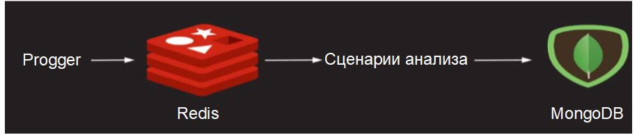

_Рис. 13\. Результаты процесса обработки данных_

Использование Progger, Redis и MongoDB обеспечивает необходимое управление потоком данных. Большой объем данных передаётся в интерфейс визуализации безопасности с учётом особенностей используемой мобильной платформы (вычислительной мощности оборудования, размеров дисплея и его разрешения). Это позволяет нашим сценариям анализа масштабировать данные соответствующим образом для улучшения наглядности за счёт использования более простых форм представления.

Рассмотрим несколько примеров использования нашей платформы, Примеры разработаны на основании результатов анализа данных, полученных в ходе тестирования платформы. Видео-демонстрация примеров может быть просмотрена по указанной ссылке: [пример использования платформы визуализации безопасности SvEm](https://wiki.dataprivacyfoundation.org/index.php/Visual_Progger) (https://wiki.dataprivacyfoundation.org/index.php/Visual_Progger).

## 5.3 Пример 1. Приложение для совместной работы с визуализацией событий безопасности в режиме реального времени

Средство визуализации журналов безопасности VisualProgger было создан нашей командой для визуального исследования истории возникновения событий, зафиксированных программой Progger [\[21\]](https://habr.com/ru/post/436620/#_21). VisualProgger ориентирован на визуализацию событий безопасности в режиме реального времени и позволяет повысить эффективность анализа за счёт _наглядности_, высокой производительности и использования _активаторов когнитивного восприятия_. В ходе анализа данных, проведённого с применением анимированной визуализации и механизмов своевременного оповещения, была выявлена важная информация о состоянии защищённости.

Функциональные возможности VisualProgger: VisualProgger предоставляет функции визуализации событий безопасности как в режиме реального времени, так и для ранее зафиксированных данных, например, наблюдаемых в ходе проведения кибер-учений между красной и синей командами (атакующими и защищающимися) [\[10\]](https://habr.com/ru/post/436620/#_10). В сценарии визуализации для реального времени мы разработали и применили способ оповещения, позволяющий увеличить концентрацию внимания пользователя. Мы назвали этот способ «когнитивные активаторы SvEm» (SvEm:cognitive-activators). Реализованы следующие _активаторы_:

1.  «_Временное удержание_»: анимированная функция, показанная на рис. 14, позволяющая временно скрывать наиболее важные (подозрительные) файлы в течение как минимум 3 секунд, чтобы привлечь внимание наблюдателя;
2.  «_Постоянное удержание_»: постоянный цветной индикатор файла, отмечающий вредоносный (подозрительный) файл. Цвета красный или жёлтый используются в зависимости от того, насколько важен файл;
3.  «_Критический файл обнаружен_» (Critical-File Detected): идентификатор оповещения, привлекающий внимание наблюдателя;
4.  «_Звуковое оповещение_» (Sound alert): дополнительный идентификатор оповещения, позволяющий привлечь внимание наблюдателя (особенно важен для дальтоников).

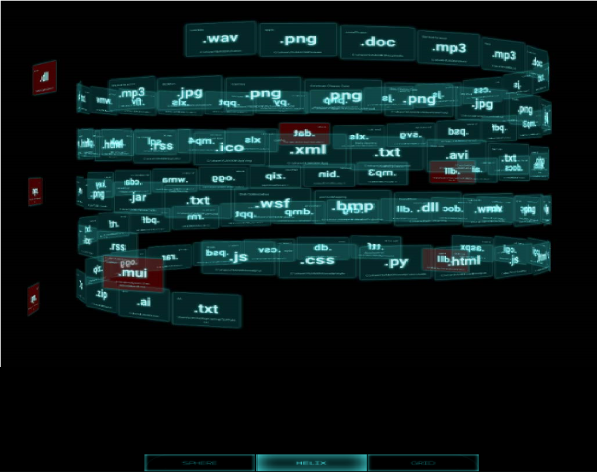

_Рис. 14\. Демонстрация _активатора_ «Временное удержание»_

Рассмотренные когнитивные активаторы SvEm в основном используются для отображения файлов и вредоносных атрибутов, важных с точки зрения безопасности информации. Файлы и атрибуты отображаемых данных преобразуются в некоторые визуальные представления событий безопасности, чтобы за счёт обеспечения лучшей информативности помочь в принятии решений.

## 5.4 Пример 2. Визуализация программы-вымогателя Locky

Визуализация событий безопасности программы-вымогателя Locky, показанная на рис. 15, использует проект «Вложенные кольца», разработанный специально для того, чтобы сосредоточить внимание пользователя только на демонстрируемой визуализации.

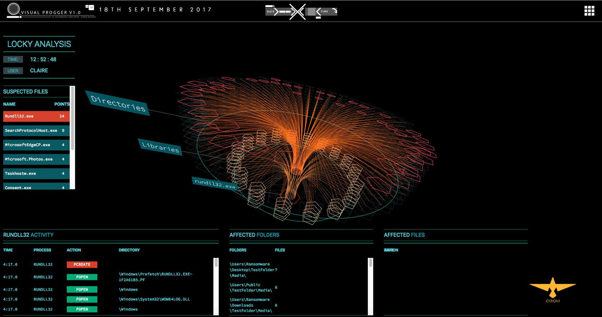

_Рис. 15\. Визуализация программы-вымогателя Locky, шифрующего файлы_

Проект «Вложенные кольца» позволяет на мобильных платформах расположить данные друг над другом в виде слоёв. Таким способом может быть отображена классификация библиотек, процессов и файлов заражённой системы. Возможность визуально отследить порядок обнаружения программой-вымогателем Locky файлов (.docx, .png, .jpeg, .xlsx и др.) перед их шифрованием в ходе реализации атаки, даёт пользователю чёткое представление о работе вымогателя. Зашифрованные файлы затем подсвечиваются красным цветом, чтобы показать, какой именно файл был зашифрован.

Зашифрованные файлы (критические файлы), отмеченные красным, могут быть выбраны наблюдателями (при наведении мыши, щелчке и или других действиях) для последующего анализа (рис. 16).

_Рис. 16\. Визуализация просмотра событий о файлах, зашифрованных программой-вымогателем Lockу_

Благодаря этим функциям пользователи заинтересованы в проведении интерактивных исследований с использованием визуализации, что также увеличивает время взаимодействия пользователя с визуализацией.

## 5.5 Пример 3. Эффективное взаимодействие с визуализацией дополненной реальности

Дополненная реальность (Augmented Reality, AR) в области визуализации безопасности информации даёт пользователю интересный опыт и открывает для него новые возможности. Она привлекает внимание наблюдателя к инцидентам безопасности за счёт использования визуализации. Предоставление наблюдателям 3-мерной визуализации с цветными интерпретациями способствует более высокой скорости анализа с приложением меньших _умственных усилий_ [\[28\]](https://habr.com/ru/post/436620/#_28). В свою очередь, наблюдатели стремятся изучить дополнительные детали, чтобы получить необходимые знания о безопасности.

Наша визуализация дополненной реальности (рис. 17) позволяет пользователям мобильных телефонов использовать персональные мобильные платформы для визуализации кибер-учений красно-синих команд (атака/защита).

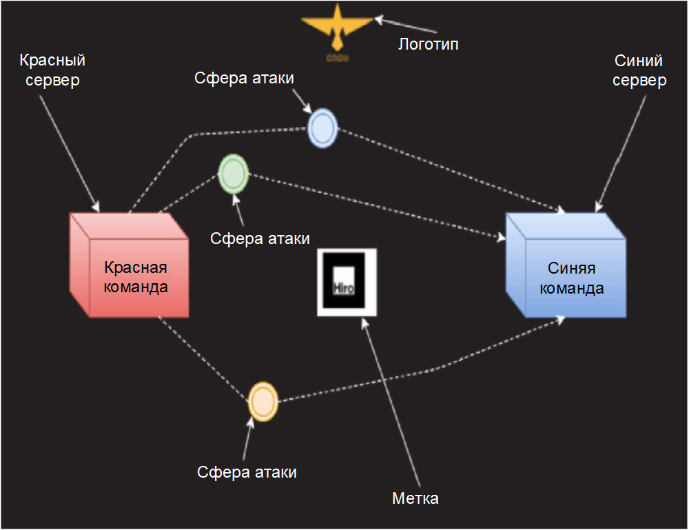

_Рис. 17\. Проект клиентской части визуализации дополненной реальности_

Создание опыта дополненной реальности усиливает способность наблюдателя к восприятию информации [\[41\]](https://habr.com/ru/post/436620/#_41). Таким образом, благодаря верной информации, отобранной с помощью AR-визуализации, наблюдатели смогли обработать больший объем данных и принять лучшие решения, способствующие повышению защищённости.

При помощи разноцветных сфер (рис. 17), выражающих различные аспекты атаки, в реальном режиме времени демонстрируется выполнение моделируемой компьютерной атаки. Через взаимодействие с интерактивной AR-визуализацией пользователь может понять характеристики компьютерных атак, проводимых красной командой.

## 5.6 Масштабирование визуализации в соответствии с размерами дисплея

С учётом ограничений, накладываемых на мобильные платформы, а также из-за большого объёма постоянно собираемых данных, возникает потребность в особых подходах к визуализации с целью наглядного представления компьютерных атак. Диаграмма с параллельными координатами [\[9\]](https://habr.com/ru/post/436620/#_9), [\[19\]](https://habr.com/ru/post/436620/#_19) позволила создать объёмный дизайн визуализации, который вмещает весь необходимый объём данных. На рис. 18 показано распределение сетевого трафика с данными безопасности между уровнями приложения, системы и сети.

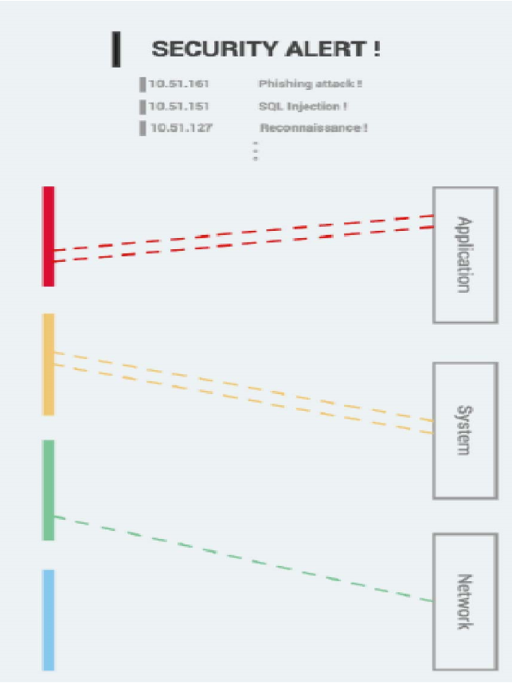

_Рис 18\. Многомерная визуализация событий безопасности с использованием диаграммы с параллельными координатами_

  

## 6.1 Концептуальная модель SvEm

Мы построили модель SvEm на основании результатов научных исследований в области вычислительной техники и психологии, заключавшихся в применении комплексного подхода к измерению эффективности для следующих основных компонентов:

*   _пользователь_;
*   _визуализация_;
*   _когнитивное восприятие пользователя_ (user cognition).

Это позволило нам разработать концептуальную модель, учитывающую накопленный пользователями опыт визуализации инцидентов безопасности. На рис. 19 представлена модель SvEm, состоящая из всех вышеперечисленных компонентов эффективности: пользователя, визуализации и сопутствующих факторов, когнитивного восприятия пользователя.

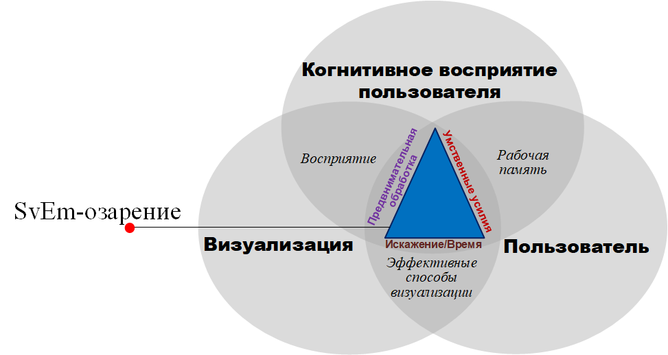

_Рис. 19\. Модель SvEm, иллюстрирующая взаимосвязь компонентов «Пользователь», «Визуализация» и «Когнитивное восприятие пользователя»_

Пересечения указанных компонентов определяют закономерности, характеризующие цели извлечения знаний о безопасности из визуализации.

В центре модели SvEm расположен механизм, посредством которого восприятие возникает как результат объединения _когнитивного восприятия_, _пользователя_ и _визуализации_. В результате наблюдения, совершаемого пользователем в процессе восприятия, возникают запросы на уровне _подпорогового внимания_ (pre-attentive). В случае сопоставления визуализации событий безопасности _умственные усилия_, возникающие у пользователя (наблюдателя), используют его познавательные способности, которые вовлечены в процесс мышления. Весь этот процесс создаёт _нагрузку на рабочую память_ пользователя в зависимости от конкретной представленной визуализации событий безопасности. Принимая во внимание приведённую взаимосвязь отношений между _пользователем_, _когнитивным восприятием пользователя_ и _визуализацией_, наши эффективные способы визуализации создают окончательное отношение связи между _пользователем_ и представленной _визуализацией_. В результате определяется _искажение_ и/или _время_. Возникновение SvEm-_озарения_ (SvEm-insight) происходит, когда все компоненты SvEm-модели согласованы, при этом значение _умственных усилий_ определено как низкое, что приводит к преобразованию и передаче для обработки пользователем правильной информации о событиях безопасности.

## 6.2 Тестирование производительности платформы SvEm

Мы протестировали производительность платформы SvEm по следующим направлениям:

*   _наглядность_ отображения визуализации;
*   производительность передачи данных между серверной и клиентской частью;
*   оценка отображения _когнитивных активаторов_.

Тестирование _наглядности_ отображения визуализации проводилось на этапе разработки приложения. Оно заключалось в проектировании архитектуры узлов обработки данных на основании стандарта визуализации безопасности (SCeeVis). Например, использование технологии 3-мерной графики WebGL даёт для пользовательского интерфейса новые возможности интерактивного визуального обзора при обработке большого объёма информации. Архитектура приложения позволила обрабатывать больший объём данных и представлять их на клиентской стороне.

На рис. 20 показаны оценки производительности в ходе передачи данных.

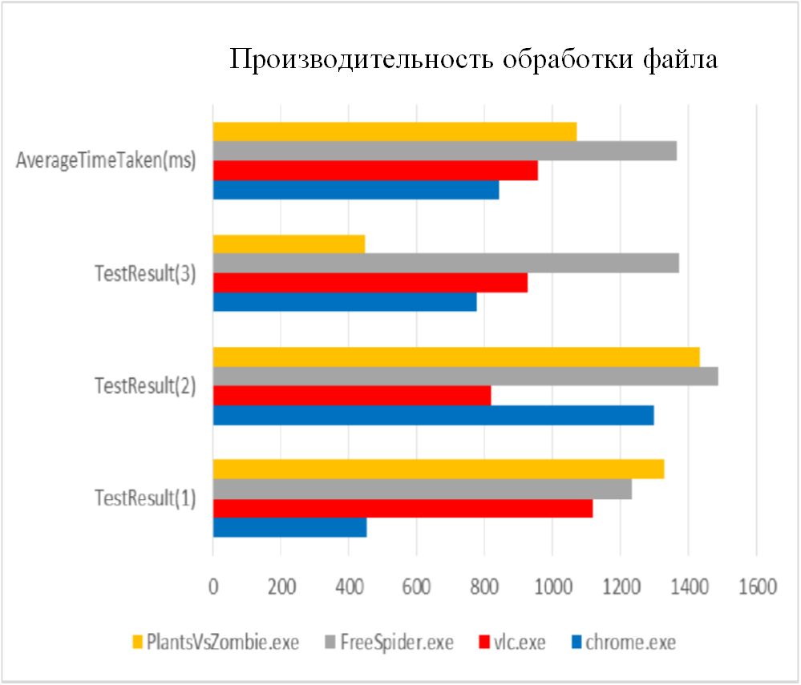

_Рис. 20\. Оценка производительности приложения VisualProgger_

Для оценки производительности фиксировалось среднее время передачи данных (в миллисекундах) различными исполняемыми файлами (.exe) при передаче данных разного типа и размера.

## 6.3 SvEm-оценка пользователей

В ходе оценки получен следующий вывод: для того, чтобы визуализация была эффективной, _нагрузка на рабочую память_ имеет решающее значение при высокой производительности чтения. Для оценки эффективности платформы SvEm использовались ответы пользователей. Цветовой стандарт способствовал повышению эффективности работы пользователей, позволяя им быстрее обрабатывать шаблоны поведения посредством классификации и отслеживания взаимосвязей. Если пользователям был известен цветовой стандарт, то они могли быстрее обрабатывать связи между точками событий, чем в случае применения подхода к визуализации, при котором вместо цвета использовались атрибуты безопасности.

Внедрение _когнитивных активаторов_ SvEm в нашу платформу предоставило пользователям механизм привлечения внимания в ходе отслеживания событий безопасности. Это автоматически стимулирует когнитивные возможности наблюдателя, побуждая его к дальнейшему взаимодействию с представленной визуализацией.

## 6.4 Оценка когнитивной нагрузки

Предыдущие исследования в области психологии внесли значительный вклад в обучение пользователей, а теоретические доказательства [\[7\]](https://habr.com/ru/post/436620/#_7), [\[8\]](https://habr.com/ru/post/436620/#_8) позволили улучшить понимание _когнитивной нагрузки_ пользователей. Чтобы определить отношение между восприятием, познанием и платформой SvEm мы применили известный психологический подход, связанный с методом определения _когнитивной нагрузки_ и _нагрузки на рабочую память_, а также концепцией связи восприятия пользователя и процессов познания. Подход применялся в условиях, когда сознание пользователя было способно воспринимать объекты (такие как, изображения узлов безопасности) в ходе взаимодействия с визуализацией событий безопасности. Соответственно, пользователи могли думать о ключевых словах, относящихся к представленным изображениям узлов безопасности, тем самым улучшая своё восприятия, которое, в свою очередь, связано с предыдущим опытом взаимодействия с визуализацией. Этот процесс в представленном инциденте безопасности выполнялся при высокой нагрузке на рабочую память.

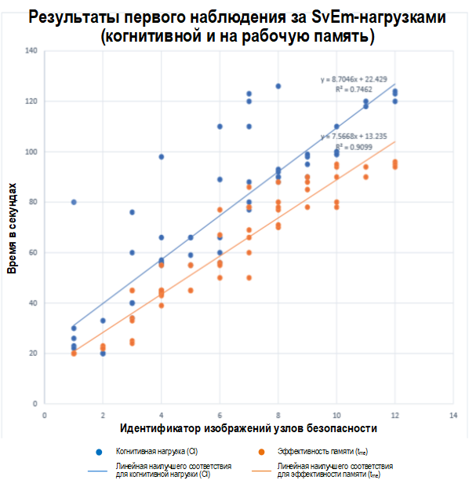

_Рис. 21\. Сравнение оценок _когнитивной нагрузки_ и _нагрузки на рабочую память_ у наблюдателей_

Таким образом, мы провели различные эксперименты с пользователем и получили следующие результаты (рис. 21). Эксперимент продемонстрировал постоянство производительности _когнитивной нагрузки_ и _нагрузки на рабочую память_ наблюдателей: с увеличением _нагрузки на рабочую память_, когнитивная нагрузка также увеличилась, но сохранила предел. На рис. 21 линии наилучшего соответствия показывают, что обе характеристики являются линейными, а _когнитивная нагрузка_ имеет постоянный предел нагрузки (ёмкость), следовательно, не перекрывает производительность _нагрузки на рабочую память_. Это идеальная ситуация для пользователя (наблюдателя) при проведении анализа визуализаций событий безопасности.

## 6.5 Система обнаружения угроз

Для фильтрации данных, собранных при помощи Progger, были использованы известные сигнатурные алгоритмы обнаружения аномалий и вредоносных программ. На основании реальных данных мы предварительно выбрали следующие алгоритмы, соответствующие нашим ожиданиям: фактор локальных выбросов (Local Outlier Factor, LOF) [\[22\]](https://habr.com/ru/post/436620/#_22), DBscan [\[23\]](https://habr.com/ru/post/436620/#_23) и K-ближайших соседей (KNN) [\[25\]](https://habr.com/ru/post/436620/#_25). Это позволило нам проверить производительность системы оценки обнаружения угроз. Нормальное действие будет иметь оценку в диапазоне от 10 до 80, а аномальное поведение будет выражаться отрицательным значением. Аналогично, подозрительные файлы в системах также сканируются на основе сохранённой базы данных сигнатур. На рис. 22 показаны нормальное и ненормальное поведение и вредоносные записи.

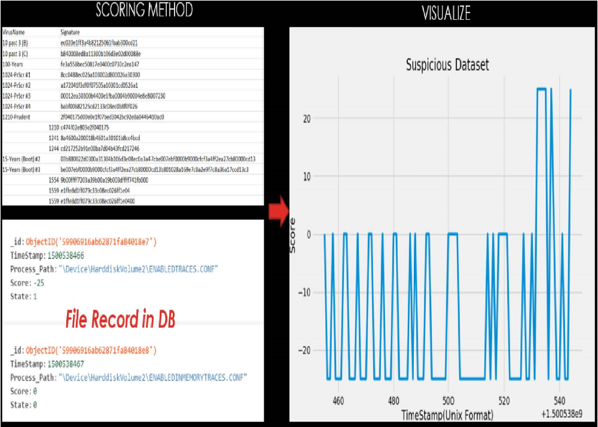

_Рис. 22\. Результаты работы системы обнаружения аномалий_

Кроме того, сканирование файлов в системе и наличие предварительно настроенной истории журнала помогает определить известные пути к файлам. Поэтому, если известный или подозрительный файл появятся в другом месте, он автоматически помечается жёлтым или красным цветом.

Мы проанализировали производительность нашей системы оценки угроз на подготовленных реальных наборах данных. В качестве фильтров применялись несколько алгоритмов обнаружения аномалий и вредоносных сигнатур. Для выявления аномалий и вредоносных файлов наша система оценки использует приложение Progger (механизм регистрации событий). Для изображения файлов, представляющих интерес, выбрана следующая цветовая схема: вредоносные данные (красный цвет), подозрительные данные (жёлтый цвет), отслеживаемая оперативная информация (синий цвет) и легитимные данные (зелёный цвет).

В статье представлен комплексный подход к оценке эффективности платформы визуализации событий безопасности, с указанием методик, учитывающих как технические аспекты, так и психологические особенности пользователей. Была представлена концептуальная модель, иллюстрирующая, взаимодействие компонент «_пользователь_», «_визуализация_», «_когнитивное восприятие пользователя_», позволяющая получить и улучшить оценки эффективности визуализации событий безопасности. Использование когнитивных активаторов SvEm позволяет повысить концентрацию внимания пользователей и увеличить их объём внимания. Мы оценили нашу платформу SvEm на основе имеющихся платформ и базовых наборов данных. Таким образом, мы подтверждаем, что пользователи достаточно хорошо справляются с высокими _нагрузками на рабочую память_ и эффективно взаимодействуют с разработанными визуализациями с целью получения необходимых сведений о событиях безопасности.

## 7.1 Направления дальнейших исследований

В будущем мы хотели бы дополнительно оценить эффективность нашей платформы для пользователей из других областей (здравоохранение, финансовое образование и т. д.), а также провести анализ того, как они реагируют при взаимодействии с платформой.

Авторы хотели бы поблагодарить Марка А. Уилла, Кэмерона Брауна, Мину Мунгро, членов Исследователей кибербезопасности Waikato (CROW Lab) и вклад наших стажеров \[Исаия Вонг, Цзя Ченг Ип, Вэнь Лян Го, Синь Ли Юань\] из политехнического института Наньян, Сингапур. Этот проект поддерживается STRATUS («Технологии безопасности, обеспечивающие прозрачность, доверие и ориентацию на пользователя при предоставлении облачных услуг») ([https://stratus.org.nz](https://stratus.org.nz/)), инвестиционным проектом в области науки, финансируемый Министерством бизнеса, инноваций и занятости Новой Зеландии. (MBIE)). Эта работа была также частично поддержана стипендиальной программой Новой Зеландии и Тихоокеанского региона (NZAid).

1\. M. Anderson. Policing the world: Interpol and the politics of international police co-operation. Clarendon Press Oxford, 1989.

2\. J. L. Carlson. Redis in Action. Manning Publications Co., Greenwich, CT, USA, 2013.

3\. K. Chodorow. MongoDB: The Definitive Guide: Powerful and Scalable Data Storage. ” O’Reilly Media, Inc.”, 2013.

4\. H. Choo and S. Franconeri. Enumeration of small collections violates webers law. Psychonomic bulletin & review, 21(1):93–99, 2014.

5\. J. Congote, A. Segura, L. Kabongo, A. Moreno, J. Posada, and O. Ruiz. Interactive visualization of volumetric data with webgl in real-time. In Proceedings of the 16th International Conference on 3D Web Technology, pages 137–146. ACM, 2011.

6\. EOOD and M. Angelov. 20 Impressive Examples for Learning WebGL with Three.js, Nov. 2017.

7\. C. Firestone and B. J. Scholl. Enhanced visual awareness for morality and pajamas? perception vs. memory in top-downeffects. Cognition, 136:409–416, 2015.

8\. C. Firestone and B. J. Scholl. Cognition does not affect perception: Evaluating the evidence for” top-down” effects. Behavioral and brain sciences, 39, 2016.

9\. Y.-H. Fua, M. O. Ward, and E. A. Rundensteiner. Hierarchical parallel coordinates for exploration of large datasets. In Proceedings of the conference on Visualization’99: celebrating ten years, pages 43–50. IEEE Computer Society Press, 1999.

10\. J. Garae, R. K. Ko, J. Kho, S. Suwadi, M. A. Will, and M. Apperley. Visualizing the new zealand cyber security challenge for attack behaviors. In Trustcom/BigDataSE/ICESS, 2017 IEEE, pages 1123–1130. IEEE, 2017.

11\. J. Garae and R. K. L. Ko. Visualization and Data Provenance Trends in Decision Support for Cybersecurity, pages 243–270. Springer International Publishing, Cham, 2017.

12\. L. Harrison, F. Yang, S. Franconeri, and R. Chang. Ranking visualizations of correlation using weber’s law. IEEE transactions on visualization and computer graphics, 20(12):1943–1952, 2014.

13\. M. G. Haselton, D. Nettle, and D. R. Murray. The evolution of cognitive bias. The handbook of evolutionary psychology, 2005.

14\. J. Heer, F. B. Vi´egas, and M. Wattenberg. Voyagers and voyeurs: supporting asynchronous collaborative information visualization. In Proceedings of the SIGCHI conference on Human factors in computing systems, pages 1029–1038. ACM, 2007.

15\. V. A. C. Henmon. The time of perception as a measure of differences in sensations. Number 8. Science Press, 1906.

16\. R. V. Hogg and A. T. Craig. Introduction to mathematical statistics.(5”” edition). Upper Saddle River, New Jersey: Prentice Hall, 1995.

17\. W. Huang, P. Eades, and S.-H. Hong. Measuring effectiveness of graph visualizations: A cognitive load perspective. Information Visualization, 8(3):139–152, 2009.

18\. J. J. Imhoff and S. P. Cutler. Interpol: Extending law enforcement’s reach around the world. FBI L. Enforcement Bull., 67:10, 1998.

19\. A. Inselberg and B. Dimsdale. Parallel coordinates for visualizing multi-dimensional geometry. In Computer Graphics 1987, pages 25– 44. Springer, 1987.

20\. M. Kay and J. Heer. Beyond weber’s law: A second look at ranking visualizations of correlation. IEEE transactions on visualization and computer graphics, 22(1):469–478, 2016.

21\. R. K. Ko and M. A. Will. Progger: an efficient, tamper-evident kernelspace logger for cloud data provenance tracking. In Cloud Computing (CLOUD), 2014 IEEE 7th International Conference on, pages 881–889. IEEE, 2014.

22\. A. Lazarevic, L. Ertoz, V. Kumar, A. Ozgur, and J. Srivastava. A comparative study of anomaly detection schemes in network intrusion detection. In Proceedings of the 2003 SIAM International Conference on Data Mining, pages 25–36. SIAM, 2003.

23\. K. Leung and C. Leckie. Unsupervised anomaly detection in network intrusion detection using clusters. In Proceedings of the Twenty-eighth Australasian conference on Computer Science-Volume 38, pages 333– 342. Australian Computer Society, Inc., 2005.

24\. Y. K. Leung and M. D. Apperley. E3: Towards the metrication of graphical presentation techniques for large data sets. In International Conference on Human-Computer Interaction, pages 125–140. Springer, 1993.

25\. Y. Liao and V. R. Vemuri. Use of k-nearest neighbor classifier for intrusion detection. Computers & security, 21(5):439–448, 2002.

26\. P. E. McKight and J. Najab. Kruskal-wallis test. Corsini Encyclopedia of Psychology, 2010.

27\. T.Okoshi,J.Ramos,H.Nozaki,J.Nakazawa,A.K.Dey,andH.Tokuda. Attelia: Reducing user’s cognitive load due to interruptive notifications on smart phones. In Pervasive Computing and Communications (PerCom), 2015 IEEE International Conference on, pages 96–104. IEEE, 2015.

28\. T. Olsson, E. Lagerstam, T. K¨arkk¨ainen, and K. V¨ a¨an¨anen-VainioMattila. Expected user experience of mobile augmented reality services: a user study in the context of shopping centres. Personal and ubiquitous computing, 17(2):287–304, 2013.

29\. ¨ O. ¨Ozt¨urk and D. A. Wolfe. An improved ranked set two-sample mannwhitney-wilcoxon test. Canadian Journal of Statistics, 28(1):123–135, 2000.

30\. F. Paas, J. E. Tuovinen, H. Tabbers, and P. W. Van Gerven. Cognitive load measurement as a means to advance cognitive load theory. Educational psychologist, 38(1):63–71, 2003.

31\. T. Parisi. WebGL: up and running. ” O’Reilly Media, Inc.”, 2012.

32\. P. Pirolli and S. Card. The sensemaking process and leverage points for analyst technology as identified through cognitive task analysis. In Proceedings of international conference on intelligence analysis, volume 5, pages 2–4, 2005.

33\. R. A. Rensink and G. Baldridge. The perception of correlation in scatterplots. In Computer Graphics Forum, volume 29, pages 1203– 1210. Wiley Online Library, 2010.

34\. P. Saraiya, C. North, and K. Duca. An insight-based methodology for evaluating bioinformatics visualizations. IEEE transactions on visualization and computer graphics, 11(4):443–456, 2005.

35\. P. Saraiya, C. North, V. Lam, and K. A. Duca. An insight-based longitudinal study of visual analytics. IEEE Transactions on Visualization and Computer Graphics, 12(6):1511–1522, 2006.

36\. E. W. Weisstein. Bonferroni correction. 2004.

37\. M. Wertheimer. A brief introduction to gestalt, identifying key theories and principles. Psychol Forsch, 4:301–350, 1923.

38\. D. A. Wheeler and G. N. Larsen. Techniques for cyber attack attribution. Technical report, INSTITUTE FOR DEFENSE ANALYSES ALEXANDRIA VA, 2003.

39\. J. R. Wilson and J. Carter. Node. js the right way: Practical, server-side javascript that scales. Pragmatic Bookshelf, 2013.

40\. J. S. Yi, Y.-a. Kang, J. T. Stasko, and J. A. Jacko. Understanding and characterizing insights: how do people gain insights using information visualization? In Proceedings of the 2008 Workshop on BEyond time and errors: novel evaLuation methods for Information Visualization, page 4. ACM, 2008.

41\. F. Zhou, H. B.-L. Duh, and M. Billinghurst. Trends in augmented reality tracking, interaction and display: A review of ten years of ismar. In Proceedings of the 7th IEEE/ACM International Symposium on Mixed and Augmented Reality, pages 193–202. IEEE Computer Society, 2008.

**_Об авторах статьи_**

Джеффри Гарае (Jeffery Garae), аспирант лаборатории Кибербезопасности кафедры Компьютерных наук университета Вайкато (Новая Зеландия)

Райан Ко (Ryan Ko), PhD, руководитель лаборатории Кибербезопасности кафедры Компьютерных наук университета Вайкато (Новая Зеландия)

Марк Апперли (Mark Apperley), PhD, заведующий кафедрой Компьютерных наук университета Вайкато (Новая Зеландия)

## **_Термины и определения, использованные в статье_**

**Внимание** (attention) – концентрация умственного усилия на сенсорных или мысленных событиях. (Роберт Солсо – Когнитивная психология)

**Восприятие** (perception) – общий результат того, что поступает через нашу сенсорную систему и что мы уже знаем о мире благодаря опыту. (Роберт Солсо – Когнитивная психология)

**Зрительная наглядность** (visual clarity) – специально созданные или подобранные графические (схемы, таблицы), художественно-изобразительные (рисунки, репродукции), натуральные (предметы окружающей действительности) пособия, рассчитанные на зрительное восприятие, используемые как средство контроля и оценки деятельности испытуемого в процессе тестирования.

**Когнитивная нагрузка** (cognitive load)

1\. Многомерный конструкт, который определяет, как нагрузка влияет на выполнение учащимся определённых задач. (Paas F. et al." Cognitive load measurement as a means to advance cognitive load theory //Educational psychologist. — 2003. — Т. 38. — №. 1. — С. 63-71)

2\. Количество идентифицируемых признаков во время предварительного ознакомления.

**Когнитивное искажение** (cognitive bias) – систематическая ошибка в суждениях. (Александров А. А. Интегративная психотерапия )

**Концентрации внимания** (attention span) – одна из характеристик внимания, отражающая степень или интенсивность сосредоточенности субъекта на выполнении какой-либо деятельности или на каком-либо предмете. (Психология человека от рождения до смерти. — СПб.: ПРАЙМ-ЕВРОЗНАК. Под общей редакцией А.А. Реана. 2002.)

**Озарение / инсайт / просветление** (insight) – Интуитивное проникновение в суть задачи. (Роберт Солсо – Когнитивная психология)

**Подпороговое внимание** (pre-attentive) – бессознательное распознавание на экране монитора стимул со скоростью менее 200 мс. (http://humanoit.ru/blog/166)

**Умственные усилия** (mental effort) – аспект когнитивной нагрузки, который относится к познавательной способности, которая фактически выделяется для удовлетворения требований, предъявляемых заданием; таким образом, можно считать, что оно отражает фактическую когнитивную нагрузку. Умственное усилие измеряется, пока участники исследований работают над заданием (\[40\])

**Визуализация истории происхождения** (provenance visualization) – отображение источников на основании большого объёма собранных данных.

**Визуализация отслеживания** (attribution visualization) – отображение пути между источником и целями атаки.

**Временное удержание** (semi-permanent hold) – когнитивный активатор, представляющий собой анимированную функцию, позволяющую временно скрывать наиболее важные (подозрительные) файлы в течение как минимум 3 секунд, чтобы привлечь внимание наблюдателя.

**Когнитивный активатор** (cognitive activator) – механизм привлечения внимания пользователя в ходе отслеживания событий безопасности.

**Нагрузка на рабочую память** (working memory load) – усилие, основанное на временных оценках рабочей памяти.

**Отслеживание / атрибуция** (attribution ) – процесс определения личности и/или местоположения злоумышленника или посредника, через которого он действует.

**Постоянное удержание** (permanent hold) – когнитивный активатор, представляющий собой постоянный цветной индикатор файла, отмечающий вредоносный (подозрительный) файл.