Ликбез по электротравмам (часть вторая): лонгрид о первой помощи и реанимации / Блог компании Pult.ru

По многочисленным просьбам, рассказываем о первой помощи при поражении электрическим током. Напомню, что мы намеренно [коснулись этой темы](https://habr.com/ru/company/pult/blog/437566/) в связи с участившимися [сообщениями в СМИ](https://habr.com/ru/company/pult/blog/432992/) об электротравмах, полученных при использовании смартфонов, наушников и др. гаджетов. В пособиях, статьях и учебниках предлагаются различные алгоритмы и методики оказания такой помощи. Это создает проблемы для людей, оказывающих помощь, которые порой не могут решить, как правильно. Ситуация в очередной раз демонстрирует, что медицина вторая по точности наука после богословия.

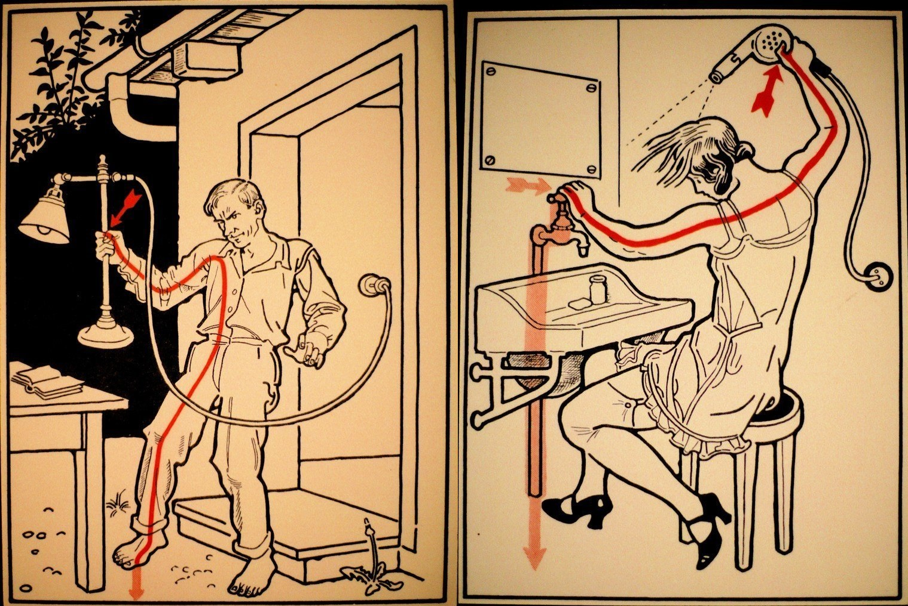

При этом большинство людей хотят четко представлять “как правильно” и “как эффективно”, а не додумывать и спорить, автор какого пособия прав и чей преподаватель. Под катом вас ждёт лонгрид о первой помощи при электротравме с упором в сердечно-легочную реанимацию (с которой больше всего путаницы). Запихнуть всё в одну статью будет тяжело, поэтому в данный момент мы обойдемся первой помощью для взрослых, ещё один материал я посвящу возрастным особенностям.

_Для тех, кому лень читать много, создан раздел, объединивший всё написанное в максимально сокращенном виде.  
_

### Последовательность оказания первой помощи при поражении электрическим током

Последовательность действий — это самое важное, что необходимо знать при оказании помощи человеку с электротравмой. Поражение электрическим током часто заканчивается смертью, а несоблюдение последовательности действий приводит сразу к нескольким смертям или тяжелым последствиям у нескольких человек. Например, так, как произошло в Мексике в прошлом году на приведенном ниже видео:

_Ролик содержит кадры на которых умирают люди, что может отразится на психическом состоянии детей и чуствительных взрослых_

Главное, на что направлена описанная последовательность — это максимально снизить вероятность поражения того, кто оказывает помощь. Начнем по пунктам:

**_Освобождение от тока_**  
Прекратить действие электрического тока на пострадавшего, путём отключения  
источника тока. При невозможности — убрать от пострадавшего проводник при помощи сухих(!) предметов, созданных из диэлектриков. Важно помнить, что классический пример с палкой или шваброй, которые есть в некоторых пособиях, не очень хороший, ввиду того, что швабры бывают мокрыми, равно как и древесина, лежащая на земле.

В идеале использование диэлектрических перчаток, которые считаются идеальным средством для защиты от напряжения до 1 кВ, что вполне соответствует электротравме от бытовых приборов и заряжающихся гаджетов. Когда речь о более высоком напряжении, и как следствие более серьезном токе (высоковольтные линии, промышленные электроустановки, подстанции) необходимо использовать диэлектрические боты и диэлектрический коврик.

В отдельных рекомендациях советуют надеть сухие шерстяные или хозяйственные резиновые перчатки, резиновые сапоги, можно дополнительно положить под ноги изолирующий материал (резиновый коврик, доску), после чего при помощи сухого диэлектрика убрать проводник с тела или (если первое невозможно) оттащить тело от проводника за одежду.

Рекомендуется также оттащить пораженного как минимум на 4-5 м при бытовой электротравме (напряжение до 1кВ) и на в обязательном порядке переместить на 10 метров при поражении промышленными токами.

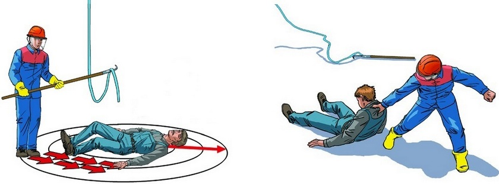

Также, в крайних случаях, допускается отсекание источника (например провода) топором с сухой диэлектрической рукояткой.

На тему того, чем лучше убрать проводник с тела пострадавшего, когда нет специальных средств, можно написать диссертацию. Для тех, у кого есть большое желание углубиться в тему, рекомендую для начала ознакомиться с тем, что такое электрическая [прочность диэлектрика](https://ru.wikipedia.org/wiki/%D0%AD%D0%BB%D0%B5%D0%BA%D1%82%D1%80%D0%B8%D1%87%D0%B5%D1%81%D0%BA%D0%B0%D1%8F_%D0%BF%D1%80%D0%BE%D1%87%D0%BD%D0%BE%D1%81%D1%82%D1%8C). Понимая, какой электрической прочностью обладают материалы, из которых изготовлены окружающие вас предметы, и зная характеристики тока, вы сможете легко найти подходящий предмет.

Важно также понимать, что отключение источника влечет за собой отключение света. Это следует принимать в расчет, когда помощь оказывается в темное время или в помещении без естественного освещения.

**_Осмотр (Пульс, дыхание, сознание, кровотечения, ожоги)_**  
После освобождения от действия тока, следует вызывать скорую и провести осмотр пострадавшего. Главное в таком осмотре оценить состояние функций, без которых пострадавший не сможет жить — это кровообращение (пульс сначала на сонной, а при наличии — на лучевой артерии) и дыхание (можно определить по экскурсиям грудной клетки, запотеванию стекол или зеркал, выслушиванию, тактильному ощущению движения воздуха).

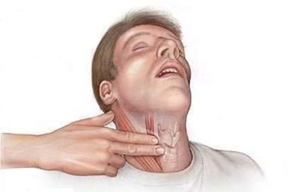  
_определение пульса на сонной артерии_

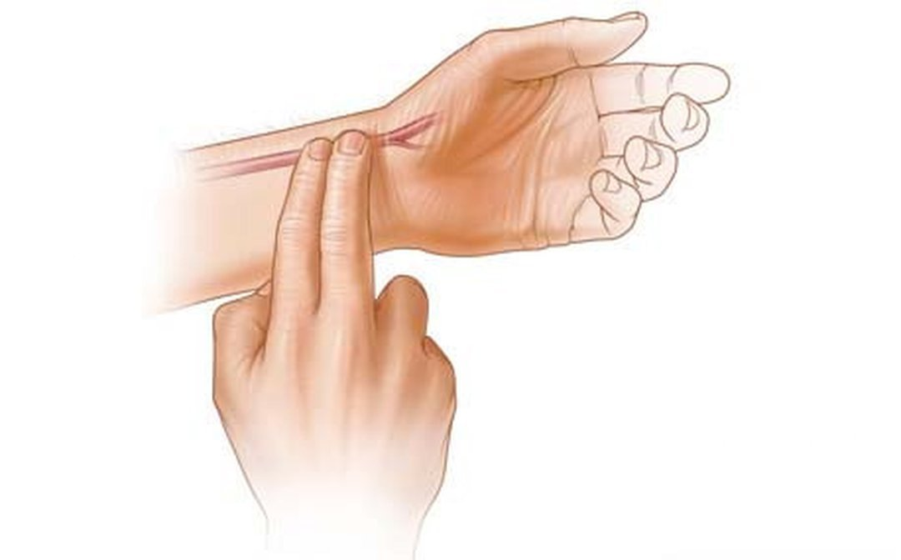  
_определение пульса на лучевой артерии_

Также во время первичного осмотра оценивают наличие сознания, что не настолько важно для жизни, но может дать существенную информацию о тяжести состояния пострадавшего. Можно попытаться привести пораженного в чувства при помощи нашатыря. Если даже от дурно пахнущего нашатыря ударенный током не пришел в сознание, то мы, вероятнее всего, имеем дело с тяжелым поражением. В этом состоянии клиническая смерть (остановка сердца и дыхания) могут наступить в любой момент и пострадавший нуждается в повышенном внимании к его витальным функциям (пульсу, дыханию).

Более того, ряд авторов пишет, что после электротравмы бывают отдаленные последствия и на фоне внешнего благополучия может внезапно развиться остановка сердца (что, вероятно, связано с поражением пучков Гиса). Поэтому крайне важно постоянно наблюдать за состоянием пораженного до приезда скорой. Даже если он в сознании и выглядит слегка возбужденным “бодрячком”.

Если пульса и (или) дыхания нет — речь о клинической смерти, нужно немедленно переходить к сердечно-легочной реанимации (о которой я подробно напишу в следующем разделе). Важно начать реанимацию в первые минуты после наступления клинической смерти (остановки кровообращения и (или) дыхания). По прошествии 5 минут наступают необратимые изменения в коре головного мозга.

Интересен также случай, когда пульс есть только на сонной артерии (на шее), но нет на лучевой (на запястье). Это крайне обманчивое состояние, которое говорит о декомпенсированном шоке и падении артериального давления ниже 60 мм. рт. ст. В подобной ситуации необходимо приготовиться к остановке дыхания и (или) сердечной деятельности, после наступления которых логично начать сердечно-легочную реанимацию.

_Кровотечение_  
В случае, если дыхание и пульс присутствует, имеет смысл обратить внимание на наличие кровотечений, которые иногда бывают при электротравме. Поражения током редко приводят к обильными кровотечениями, скорее всего это будут капиллярные или венозные кровотечения в местах входа и выхода разряда. Венозное требует остановки при помощи давящей повязки. Капиллярное остановится само, но чтобы не инфицировать рану, следует (по возможности) закрыть её чем-нибудь стерильным, например, бактерицидным лейкопластырем.

_Ожоги_  
Также на коже могут присутствовать ожоги. Если ожоговая поверхность занимает большую площадь и вызывает нестерпимую боль, её необходимо охладить, при помощи большого количества воды (важно делать это на безопасном расстоянии от источника тока). В дальнейшем ожоги нужно по-возможности закрыть чем-нибудь стерильным, бинтом, например. Важно не отрывать куски пригоревшей одежды, если таковые имеются, а оставить их на месте, закрыв повязкой вместе с пораженной тканью.

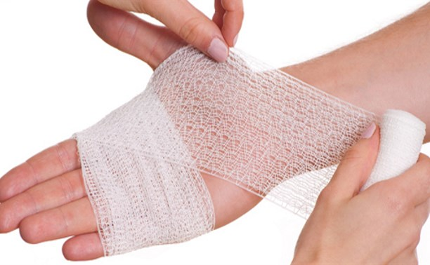

_Переломы и вывихи_  
Как мы выяснили в предыдущей статье, механические травмы вполне вероятны при поражении током, причем могут появиться как от опосредованного, так и от непосредственного действия тока. Т.е., если пораженный не падал с высоты и не бился всеми частями тела об пол — это совсем не означает, что у него не может быть перелома или вывиха.

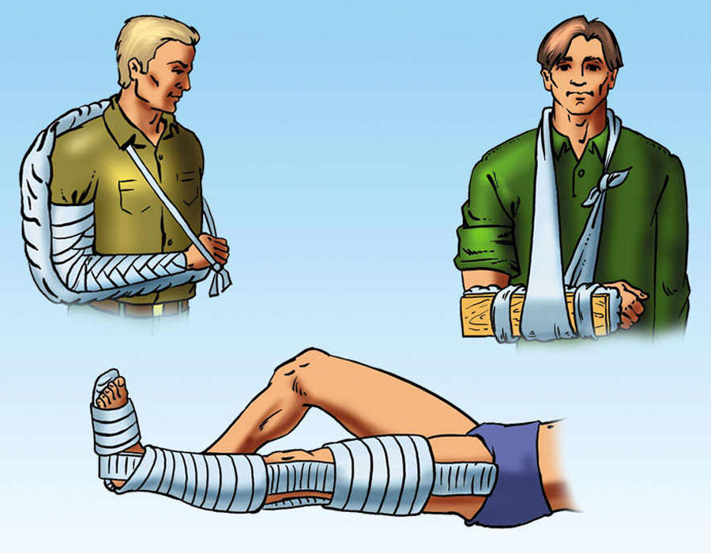

При осмотре о переломе может свидетельствовать отёк тканей, деформация конечностей, гематома в месте перелома и само-собой боль. О вывихах обычно говорит боль, патологическая (не свойственная в норме) подвижность в суставе, деформация в области сустава. Переломы и вывихи необходимо иммобилизировать — сиречь обездвижить, скорее всего этим займется скорая. Если вы намерены встретить механическую травму при поражении током вне района выезда бригады скорой помощи, почитайте подробнее о транспортной иммобилизации.

_Общие мероприятия_  
Также пораженного необходимо напоить горячим (не путать с горячительным), дать одеяло (избегать потерю тепла как при шоковом состоянии), предложить валидол в качестве плацебо. Также важно обеспечить психологический покой, если пострадавший сердечник с аритмией и жалуется на приступ, следует помочь ему найти противоаритмические, назначенные врачом, которые могут оказаться у него с собой или поблизости.

### СЛР

**_Муки выбора. А какой алгоритм правильный?_**  
С этой темой тоже все не так просто, как кажется. Пожалуй, все видели как в фильмах выполняют непрямой массаж сердца, а страстные спасатели Малибу проводят интенсивную и соблазнительную искусственную вентиляцию легких методом изо рта в нос (зачеркнуть) в рот. Некоторые, вероятно, также успели заметить, что во всех фильмах это делают по-разному и в большинстве случаев неправильно.

Все водители обучались в автошколах навыкам элементарной реанимации, как правило, по методу Питера Сафара (Рeter Safar), более известную как ABCD. При этом подавляющее большинство водителей успело порядочно подзабыть, что означает это буквосочетание. Прочие люди обучались в разных местах и в разное время и могут знать другие методики. Например, медики, учившиеся в суровые 90-е, вспоминают российский алгоритм “УНИВЕРСАЛ”, кто-то помнит безымянные советские нормы, основанные на том-же Сафаре и т.п. Однако, когда доходит до дела, возникает ступор и непонимание, как лучше сделать.

В 2010-м году, когда СЛР по Сафару исполнилось 50 лет и в этом же году её наконец признали малоэффективной по современным меркам, заменив более прогрессивным алгоритмом. В связи с этим, настоятельно рекомендую забыть всё, что вы помнили до этого и обратить внимание на то, что сегодня принято ВОЗ и АКА (Американской Кардиологической Ассоциацией). В этой статье мы рассмотрим алгоритм CAB. Именно об особенностях последней версии этого алгоритма (в адаптированном для людей без специальных медицинских знаний виде) я напишу ниже.

_У кого есть большое желание узнать об эволюции представлений об СЛР, могут почитать [эту статью.](https://www.emhelp.ru/%D0%BA-%D1%80%D0%B0%D0%B7%D0%BC%D1%8B%D1%88%D0%BB%D0%B5%D0%BD%D0%B8%D1%8E/abcd-%D0%B8%D0%BB%D0%B8-cab/)  
_

**_CAB — это наше всё_**  
Порядок букв в аббревиатуре CAB указывает на последовательность, в которой выполняются реанимационные действия:

*   C — circulation (кровообращение) — непрямой массаж сердца (в ряде рекомендаций — прекардиальный удар);
*   A — airways (дыхательные пути) — восстановление проходимости дыхательных путей (если с ней есть проблемы);
*   B — breathing (дыхание) — искусственная вентиляция лёгких.

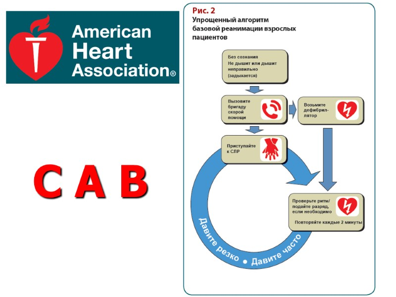

_Подготовительный этап_  
Пораженный (который уже удален на достаточное расстояние от источника тока) должен быть уложен на твердую, ровную, сухую поверхность. Имеет смысл подложить что-нибудь под его ноги, освободить от одежды, мешающей оказывать помощь. Допускается снимание/расстегивание/разрывание/разрезание одежды затрудняющей доступ к грудной клетке. При этом история знает случаи когда даже парамедикам предъявляли финансовые претензии за дорогое бельё. В связи с этим некоторые авторы уточняю, что если можно быстро расстегнуть — лучше расстегнуть, а не разрезать. После подготовительного этапа можно приступать к реанимационным мероприятиям.

_Прекардиальный удар: за что его любят и не любят_  
Такой удар является единственным способом механической дефибрилляции и может быть эффективен ввиду генезиса клинической смерти (которая при электротравме часто вызывается фибрилляцией). Ввиду его вероятной травматичности, приём не используют волонтёры национальных обществ Красного Креста, также его убрали из многих международных рекомендаций и пособий.

При этом метод доказал свою эффективность в первую минуту фибрилляции. Чтобы быть объективным, я опишу методику нанесения, с оговоркой — прием действительно травматичен, не считается обязательным в комплексе СЛР и полную ответственность за её последствия несет наносящий.

Удар следует наносить в случае 100%-й уверенности, что кровообращение отсутствует, пульса нет, а остановка сердца произошла у вас на глазах. Если вы не уверены в правильности нанесения удара — не проводите его и переходите к непрямому массажу сердца. Удар наносится ребром сжатой в кулак ладони по грудине, удар должен приходится в место на 2 сантиметра выше мечевидного отростка грудины (т.е. там, где показано на рисунке). Сам мечевидный отросток нужно пропальпировать (нащупать) и обязательно закрыть пальцами. Только после этого можно нанести один (!) резкий удар выше пальцев (закрывающих отросток) с расстояния не более 20 см.

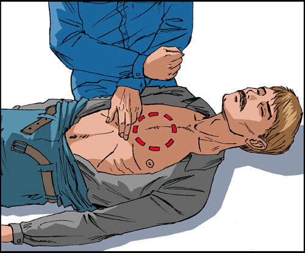

**Не нужно колотить по грудине со всей дури** в приступе безумного героизма.

### Нельзя бить от плеча

, главное не сила, а то, насколько резко удар нанесен. Важно понимать, что при проведении реанимации у оказывающего помощь выделяется немало адреналина и недюжинная сила появляется даже у хрупких на вид девушек.

_Непрямой массаж — правильно 30, а не 10-15_  
Непрямой массаж является самым статистически эффективным методом элементарной сердечно-легочной реанимации и представляет собой компрессию в том же месте, в котором проводился прекардиальный удар — строго посередине груди, на 2-3 сантиметра выше мечевидного отростка. Важно не смещать руки в вправо или в лево, в таких случаях легко повредить ребра, а отломками ребер органы грудной полости.

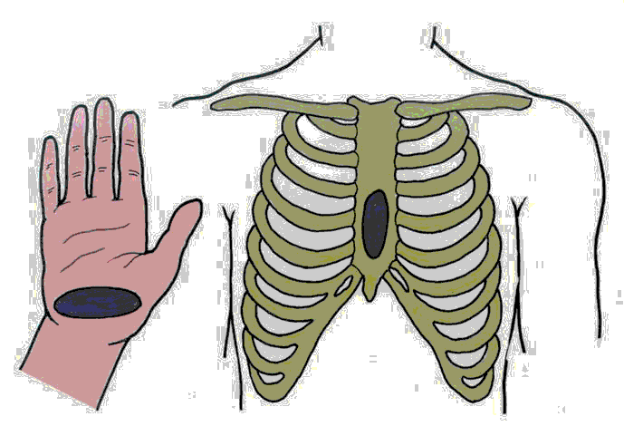  
_Место проведения непрямого массажа_

Компрессии при выполнении непрямого массажа совершаются основанием ладони одной из рук, вторая давит сверху, пальцы приподнимаются для исключения давления на ребра. Важный момент, руки должны быть выпрямлены, сгибание в локтях не допускается. Глубина компрессионных движений должна составлять 5 см. При такой глубине удается сжать сердце чтобы обеспечить давление крови достаточное для кровоснабжения головного мозга.

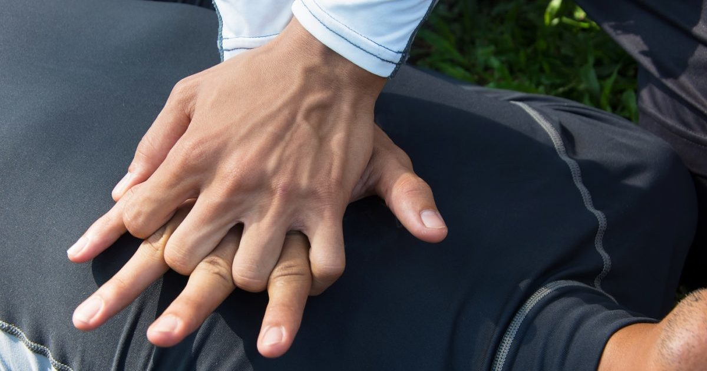

Вызывает множество дискуссий вопрос, с какой частотой необходимо выполнять компрессии. Современные алгоритмы предполагают серии по 30 компрессий, чередующиеся с двумя искусственными вдохами, со скорость 100-120 компрессий в минуту. Идеальным можно считать скорость, при которой за одну секунду проводится две компрессии (т.е. серия 30 компрессий за 15 секунд). Еще один важный нюанс в современном алгоритме: не имеет значение, сколько людей оказывают помощь, от этого не меняется количество компрессий и искусственных вдохов.

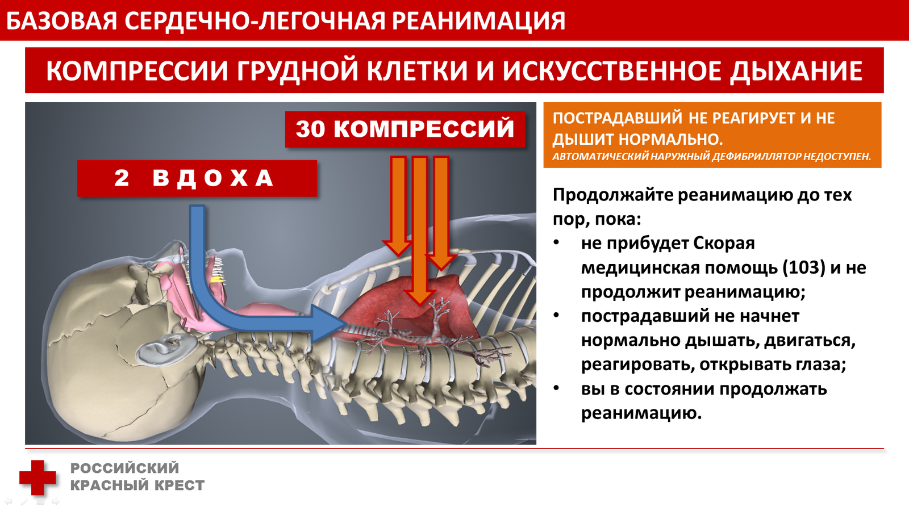

Как человек, периодически выполнявший описанные выше действия, могу сказать, что занятие это крайне утомительное, а проводить его имеет смысл часто на протяжении длительного времени (до приезда скорой или появления признаков биологической смерти). Поэтому в идеале проводить такого рода мероприятия вдвоём или даже втроём, дабы периодически менять друг-друга.

Интересно, что большинство русскоязычных видеороликов на YouTube по теме СЛР созданы по старой системе ABC. Современный алгоритм CAB как-будто обходят стороной, хотя практически везде он стал нормой. Одно из лучших, по моему убеждению, русскоязычных видео по реанимации сделали в казахстане:

Существуют также автоматические дефибрилляторы, их могут устанавливать в метро, в аэропортах и офисах. Про них ничего рассказывать не буду, они говорящие, сами всё расскажут.

_Дыхательные пути_  
После первой серии непрямого массажа рекомендуют оценить проходимость дыхательных путей. Вместо проверки, которая была в системе сафара, в новом алгоритме рекомендуют сразу повернуть голову пораженного на бок и чем-нибудь (например, носовым платком или куском одежды) очистить ротовую полость.

После этого достаточно сделать один искусственный вдох (см. ниже) для оценки проходимости, если происходит экскурсия грудной клетки, значит дыхательные пути проходимы. Если нет проходимости, воздух будет попадать в желудок, тот будет надуваться как шарик, отчего эпигастрия будет увеличиваться в объёме.

Без интубации или на худой конец ларингеальной маски с комбитюбом очень сложно что-то предложить в подобной ситуации. Для того, чтобы ухватить кубический сантиметр шанса, имеет смысл выполнить [прием Геймлиха](https://youtu.be/p9tF9-A2XSY), повторить очищение дыхательных путей, попытавшись таким образом восстановить проходимость.

_Искусственная вентиляция — в рот, в нос и в другие места_  
Искусственная вентиляция лёгких (ИВЛ) — самый спорный момент в современном алгоритме СЛР. Могу отметить, что на первой минуте после наступления клинической смерти кровь достаточно насыщена кислородом, чтобы вообще не проводить искусственную вентиляцию.

Я по опыту знаю, что ИВЛ с кислородом в первую-вторую минуту дают отличный результат, но только в случаях, когда клиническая смерть вызвана респираторными причинами, например, тяжелым отравлением продуктами горения. В случае с электротравмой всё не так однозначно, так как клиническая смерть может наступить как от фибрилляции, так и от паралича дыхательного центра.

При этом компрессии грудной клетки при непрямом массаже способствуют пассивной вентиляции. На этом основании некоторые авторы вовсе не рекомендуют проводить ИВЛ (на уровне базовых мероприятий для людей, не имеющих медицинской квалификации), но сейчас нет достоверных данных, что такой пассивной вентиляции достаточно.

Итак, будем считать, что после восстановления проходимости дыхательных путей имеет смысл проводить искусственную вентиляцию, дабы гарантировать насыщение крови кислородом. Выделяют 2 классических безаппаратных метода ИВЛ “изо рта в рот” и “изо рта в нос” (последний применяется редко, в случаях, когда имеются повреждения щек.

Перед проведением обязательно положить на рот пострадавшего платок, несколько слоёв бинта и т.п, дабы обезопасить себя от разнообразной гадости, которая может находится в его ротовой полости. Полагаю, немногие хотят быть героями с туберкулёзом или ещё каким-нибудь чудесным, респираторно передающимся заболеванием.

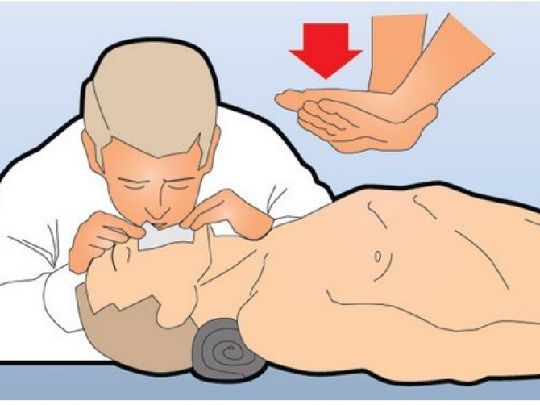

Методика проведения ИВЛ по методу “изо рта в рот” проста: набираем в легкие воздух и выдыхаем в рот пораженному, стараясь избежать наличие щелей и разгерметизации. Как я уже отмечал, на два искусственных вдоха должно приходится 30 компрессий непрямого массажа. Вентиляция по методу «изо рта в нос» проводится аналогично, лишь с тем отличием, что рот и поврежденные щеки герметизируются (зарываются руками).

Более эффективным считается применение S-образного воздуховода, который есть не всегда и не у всех. Его нужно правильно вводить, как показано в этом видео:

Самым эффективным методом ИВЛ, который могут применять люди без медицинского образования, считается вентиляция при помощи мешка Амбу. Респираторная маска мешка прижимается к лицу пострадавшего, после чего производятся компрессии мешка. Но, как правило, таких полезных вещей как мешок Амбу и S-образный воздуховод не находится на месте происшествия.

### Кратко о самом важном для тех, кому лениво читать

  

1.  Перед оказанием помощи отключаем ток. Если нельзя отключить, убираем источник тока от пострадавшего, используя сухие диэлектрические предметы, по возможности резиновые, в идеале специальные диэлектрические перчатки, пострадавшего относим подальше (на 5 м — бытовая сеть, на 10 м — промышленная или линии электропередач).
2.  Оцениваем сознание, пульс, дыхание. Если их нет, начинаем реанимацию. Если есть — определяем наличие кровотечений и травм. Вызываем скорую.
3.  Реанимацию проводим по алгоритму CAB. Если не уверены в том, что сможете нанести прекардиальный удар правильно — не используем его (если вы волонтер Красного Креста — в любом случае не используем). Комбинируем 30 компрессий грудной клетки с двумя искусственными вдохами.
4.  Ожоги закрываем стерильной повязкой, предварительно охладив ожоговую поверхность водой.
5.  Венозные кровотечения останавливаем давящей повязкой, капиллярные — закрываем асептической.
6.  Механические травмы иммобилизируем, лучше шинами.
7.  Пораженному обеспечиваем покой, даем одеяло, даем выпить горячего и наблюдаем за его состоянием.

  

### Итог

Я искренне надеюсь, что представленная информация никогда не пригодится нашим читателям и что они никогда не попадут в ситуацию, в которой им придется применять её на практике. Между тем уверен, что она не будет лишней — предупрежден, значит вооружен. Напишите о том, что думаете в комментариях, возможно, я о чем-то забыл, задавайте вопросы, постараюсь подробно ответить.

_Использован фотоконтент:  
Российского Красного Креста  
[bezperelomov.com](http://bezperelomov.com/)  
[multiurok.ru/files/okazaniie-piervoi-pomoshchi-pri-eliektrotravmakh.html](https://multiurok.ru/files/okazaniie-piervoi-pomoshchi-pri-eliektrotravmakh.html)  
[www.passeidireto.com/arquivo/55103532/apostila---o-ambiente-e-as-doencas-do-trabalho/34](https://www.passeidireto.com/arquivo/55103532/apostila---o-ambiente-e-as-doencas-do-trabalho/34)  
[deskgram.net/p/1660912047285500775_6215093419](https://deskgram.net/p/1660912047285500775_6215093419)_

__Рекламная нагрузка  
Напомню, что [мы продаём](https://www.pult.ru/) электронику, разную, много. Если соблюдать правила эксплуатации, электроника которую мы продаём не приводит к поражению электрическим током. Более того, нам не известно ни одного случая, когда бы наши покупатели получили электротравму от приобретенных у нас товаров.__