Ликбез по электротравмам: от ожогов и катаракты до переломов и фибрилляции / Блог компании Pult.ru

В комментариях к нашей [статье о смерти малайзийского школьника в наушниках](https://habr.com/ru/company/pult/blog/432992/) мы обещали сделать пост об электротравмах, а также об особенностях патогенного влияния электрического тока на органы и ткани человеческого тела. Обещали — выполняем.

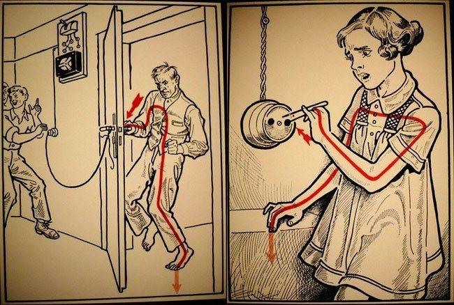

Пост подготовлен совместно с [dlinyj](https://habr.com/ru/users/dlinyj/), который выступил в качестве рецензента и консультанта в вопросах физики электричества и охраны труда, а также соавтора раздела “Что убивает ток или напряжение?”. Под катом я подробно описал механизмы получения электротравмы, медицинские последствия, а также проанализировал несколько трагических случаев, связанных с необычными электротравмами. При подготовке материала использован мой собственный медицинский опыт, факты, известные из СМИ, а также доступную в сети литературу и документы (фото поражений, содержащиеся в статье, некоторые читатели могут счесть шокирующими и неприемлемыми).

> Предупреждение от модератора. Публикация содержит изображения частей тела травмированных людей, которые могут оказать влияние на психическое состояние чувствительных взрослых и детей.

### Что убивает: ток или напряжение?

Начнем с этого холиварообразующего вопроса, без которого не обходится, пожалуй, ни один популярный пост об электротравме. Без долгих рассуждений напишу — основным поражающим фактором является ток, убивает именно он. Как мы все знаем из школьного курса физики, ток=напряжение/сопротивление. Полагаю, что корректно говорить о том, что напряжение (разность потенциалов) является условием поражения, но само по себе не наносит повреждений.

Например, напряжение статических разрядов в момент снятия шерстяного свитера достигает нескольких киловольт, при этом они не наносят никаких существенных повреждений, так как ток мизерный. Поэтому в таких случаях напряжение сравнивают с высотой, которая сама по себе не приводит к смерти и не может являться её причиной, в отличие от самого факта падения, при котором высота становится значимым условием для наступления смерти.

### 

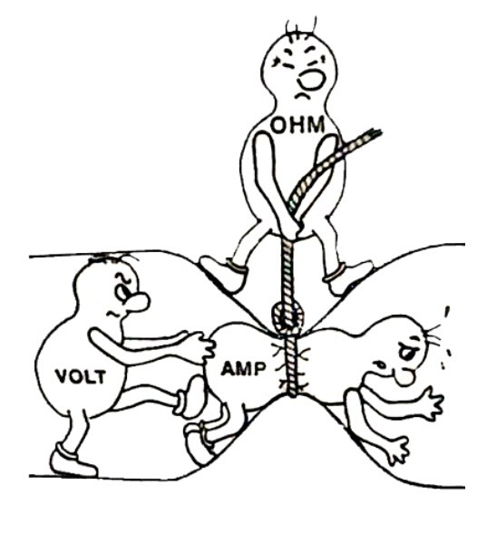

> Следует вспомнить, что такое электрический ток. Как следует из русского названия, ток — течение, то есть протекание заряженных частиц. Какое их количество протекает за единицу времени через единицу сечения проводника. Чем больше количество частиц, тем больше ток. Именно течение частиц и является причиной поражения человека. Величина тока, которая может пройти через человека, определяется приложенным напряжением, внутренним сопротивлением источника тока и сопротивлением тела человека.
> 
> Как правило, источники тока (и напряжения) имеют выходной ток на несколько порядков превышающий смертельный для человека, и в таком случае определяющим фактором величины тока оказывается сопротивление тела человека и величина приложенного напряжения. Сопротивление тела человека зависит от индивидуальных особенностей человека и его физического состояния. Например, потный человек имеет очень низкое удельное сопротивление, и были случаи, когда человека убивало напряжение на контактах обычного аккумулятора. [dlinyj](https://habr.com/ru/users/dlinyj/)

### Электротравма по нормам ВОЗ, процессы в тканях и тяжесть поражения

Сегодня в различной литературе можно встретить массу классификаций и определений поражения человека электрическим током — они все интересны, но вносят много путаницы. По моему мнению, следует придерживаться общепринятого определения, которое принято в ВОЗ.

Так, согласно нормам ВОЗ, поражение током принято называть электротравмой (никаких ударов и иных видов поражения отдельно не выделяют). Согласно ВОЗовским нормам, любая травма — есть физическое повреждение органов и тканей, возникшее под воздействием того или иного вида энергии. Поэтому электротравма — любые повреждения (нарушения деятельности), вызванные воздействием тока, сиречь электрической энергии.

_**Типы воздействия тока**_  
Выделяют три типа воздействия электрического тока на организм, которые подпадают под определение электротравмы:

*   биологическое — раздражение и возбуждение мышечных и нервных волокон, нарушение биоэлектрических процессов;
*   термическое — ожоги и нагрев тканей под действием тока;
*   электролитическое — изменение физико-химического состава и свойств биологических жидкостей (крови, лимфы, ликвора и т.п.).

Электрический ток способен поражать все без исключения ткани и органы. В первую очередь страдают кожа, периферическая и центральная нервная система, мышцы, сухожилия, сердечно-сосудистая система. Несколько реже бьет по костям, суставам, органам ЖКТ, но если бьет, то сильно, почти наверняка.

_**Тяжесть поражения**_  
Итак, перечислим факторы, от которых зависит тяжесть электротравмы:

*   путь тока, локализация поражения;
*   величины поражающего тока тока (А);
*   род тока (переменный или постоянный);
*   частоты тока (Гц);
*   сопротивление тела (Ом);
*   влажность и температура воздуха (при повышении температуры начинается потоотделение, что снижает сопротивление тела);
*   состояние кожных покровов (наличие ран, кожных заболеваний, пота и т.п.);
*   также при оценке принимается во внимание напряжение, но вопреки устоявшемуся стереотипу, не имеет определяющего значения.

_**Сопротивление тела**_  
Сопротивление тела, пожалуй, один из важнейших и самых сложных факторов. Оно является переменным и зависит от сложных биохимических и биофизических особенностей, свойств тканей в текущий момент времени, особенностей окружающей среды. Иными словами — это один из факторов, который делает любой прогноз поражения электрическим током (с известной величиной) сравнимым по точности с богословскими трактатами 14 века или предсказаниями Нострадамуса.

В таблице ниже представлены диапазоны сопротивлений тканей нашего организма, из нее легко понять, что значения варьируются в очень широких пределах.

**_Классификация токов по типу воздействия_**  
Величины поражающего тока условно разделены на 3 диапазона, в зависимости от того, какое преимущественное воздействие ток оказывает. Таким образом, выделяют токи:

*   неощущаемые — от 0,5 – 1,5 мА;
*   ощущаемые — 3 мА — воздействие тока ощущается тактильно;
*   отпускающие — 6 мА — вызывает мышечный спазм, при это схватившись за проводник, пораженный может его отпустить ;
*   неотпускающие — от 10 до 15 мА — пораженный не может отпустить проводник без посторонней помощи;
*   удушающие от 25 до 50 мА — способен вызвать паралич дыхательного центра;
*   фибрилляционные от 100 до 200 мА — вызывающий фибрилляцию (беспорядочное сокращение) сердечных камер — один из типов остановки сердца.;

*Иногда дополнительно выделяют т.н. “термические" или «тепловые» — низкий постоянные токи (от 5 А), вызывающие ощущение тепла, жжения.

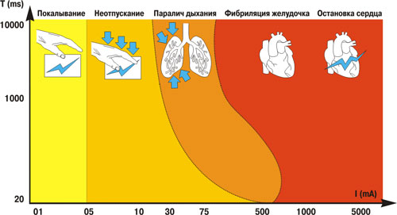

На таблице ниже соотнесены диапазоны значений переменного и постоянного тока и поражения, которые они способны вызвать (приводится, согласно пособию доцента кафедры инженерной экологии и охраны труда Московского энергетического института  
С.Г.Новикова).

_Пути тока_  
Ещё одним важным и часто решающим фактором становится путь тока, который зависит от мест входа и выхода разряда. Наиболее опасными путями считаются те, которые проходят через жизненно важные органы (головной и спинной мозг, сердце, лёгкие, печень, почки). Характерные случаи с электротравмой через наушники, когда путь тока протекает через голову (практически во всех известных инцидентах закончился смертью).

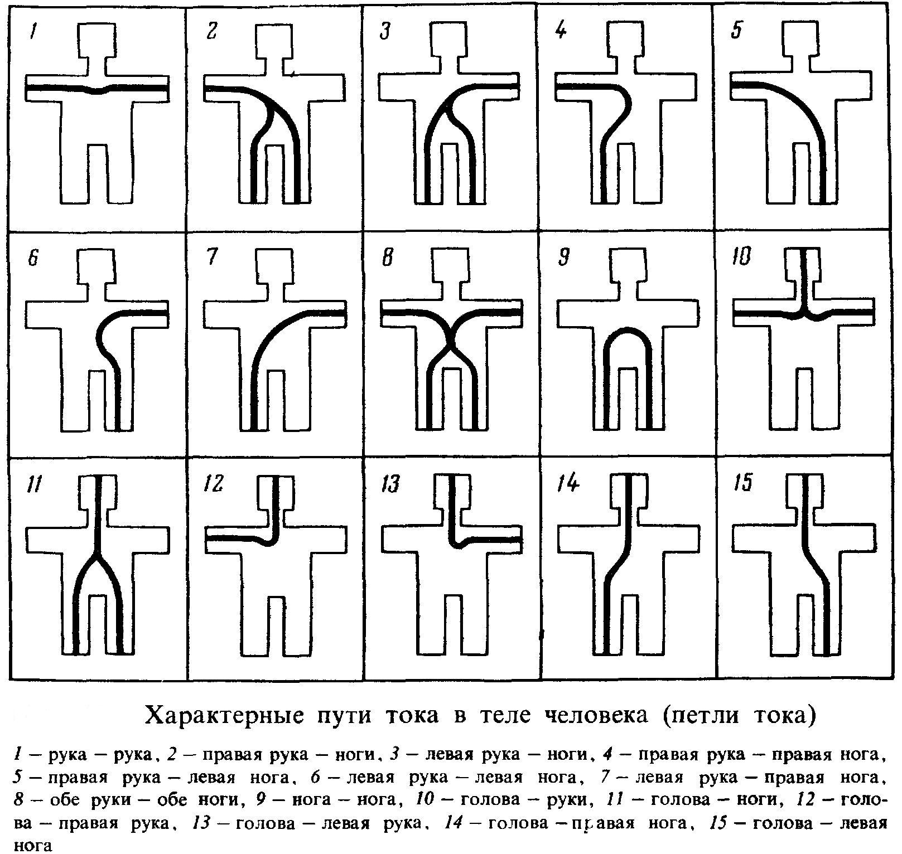

Если путь тока не проходит через жизненно важные органы, то влияние на них происходит исключительно рефлекторно, а соответственно, опасность для жизненно важных функций значительно меньше. Пути тока через человеческое тело иногда называют петлями. Наиболее опасными из них считаются: «рука-рука» (40% летальных исходов), “голова-ноги" и “голова-рука” (вместе около 20 %),”правая рука — ноги” (20%), «левая рука-ноги» (17%), на прочие смертельные случаи приходится приблизительно 3%.

В представленной ниже таблице указано процентное соотношение поражающего электрического тока, проходящего через сердце, при различных путях тока:

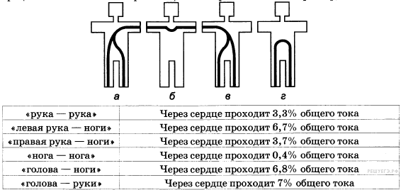

**_Немного о механизме повреждения тканей_**  
Согласно Илишевой, после того как ток преодолевает сопротивление кожи, он пронизывает ткани и вызывает электролиз, который, в свою очередь, приводит к нарушению ионного баланса в клеточных образованиях. Быстрое омертвение тканей при электротравме вызывается как раз поляризацией мембран клетки во время электролиза. Происходит следующее:

*   у анода концентрируются ионы с положительным зарядом, среда становится кислой;
*   у катода возникает скопление отрицательно заряженных ионов, что провоцирует щелочную реакцию.

Эти процессы концентрации ионов изменяют состояние клеток и приводят к коагуляционному некрозу в участках с кислой реакцией и колликвационному в участках со щелочной.

При действии тока на нервные волокна отмечаются периневральный отек, некроз (омертвение) нейрональных структур, тромбоз окружающих сосудов. Аналогичные процессы возникают в мышечной ткани. Перед развитием некроза нервная ткань раздражается, а в мышцах возникает тонус и судорожные сокращения, которые в свою очередь приводят к механическим повреждениям (см. далее).

Кожа поражается в основном в местах входа и выхода заряда, термические явления могут вызвать ожоги и вкрапления инородных металлических частиц (см. ниже), а электрохимическое действие тока — изменения цвета кожных покровов (см. метки тока).

### Виды поражений электрическим током

Некоторые авторы выделяют три вида электротравм, а именно местные, общие и смешанные. К местным причисляют ожоги, электрические знаки (метки), металлизацию кожи и механические повреждения. Общими называют такие поражения током, при которых выражена общая симптоматика, в виде поражения центральной нервной и сердечно-сосудистой системы. Смешанные имеют признаки как местной, так и общей.

На самом деле, такое разделение очень условно. Чаще всего возникают смешанные электротравмы. Их процент значительно выше чем 50% заявленных в некоторых пособиях по охране труда, которые очевидно писали люди не имевшие дела с электротравмами на практике. За 9 лет в медицине катастроф мне довелось сталкиваться только со смешанным типом. Полагаю, что так случается в силу того, что удар током, способный вызвать местное повреждение, наверняка, вместе с ним приведет к развитию общей симптоматики. Поэтому, полагаю, правильнее говорить о местных и общих проявлениях электротравмы, но не о местных и общих электротравмах.

**_Электроожоги_**  
Среди местных проявлений более распространены т.н. электрические ожоги, которые делят на контактные и дуговые. Я пишу “т.н.”, в силу того, что ожог вызывается высокой температурой проводника или пламени электрической дуги, т.е. по факту он термический, но отягощен другими поражающими факторами электротравмы.

Контактные развиваются при непосредственном соприкосновении кожи с поверхностью проводника, где за счет высокой плотности тока и сопротивления кожи локально повышается температура. Для них характерна сравнительно небольшая площадь поражения (как правило, 1% кожи и менее) с различной глубиной поражения и тяжестью состояния.

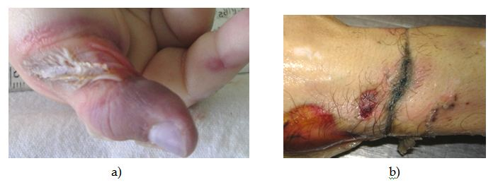

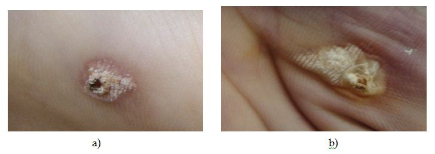  
_Контактные электроожоги_

Дуговые, зачастую тяжелее, нередко сопровождаются обширными 50 % и более, и глубокими (до 4 степени) поражениями. Это связано с более высокой температурой, а также, зачастую, с более высокой площадью поражения. Дуговые ожоги чаще вызывают ожоговый шок и ожоговую болезнь. В случаях с электротравмой от гаджетов и бытовых приборов — дуговые ожоги — штука не столь брутальная, так как дуга, зачастую, небольшая, а соответственно, и площадь поражения меньше.

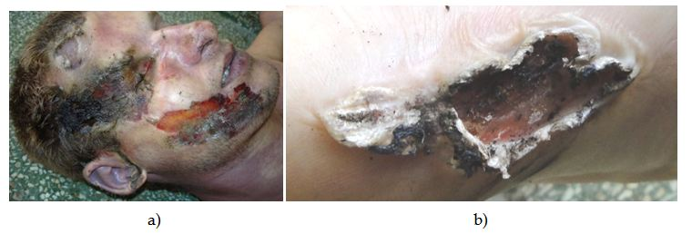

_Дуговые электроожоги_

**_Метки тока_**  
Метки (они же знаки) представляют собой серые или желтоватые пятна овальной формы с небольшим углублением в центре. Знаки могут появиться сразу или со временем, описаны случаи, когда они бесследно исчезали. Этот признак часто встречается при тяжелой общей симптоматике в местах входа и выхода заряда. Не требует специальной помощи, но может быть использован как ценный диагностический признак.

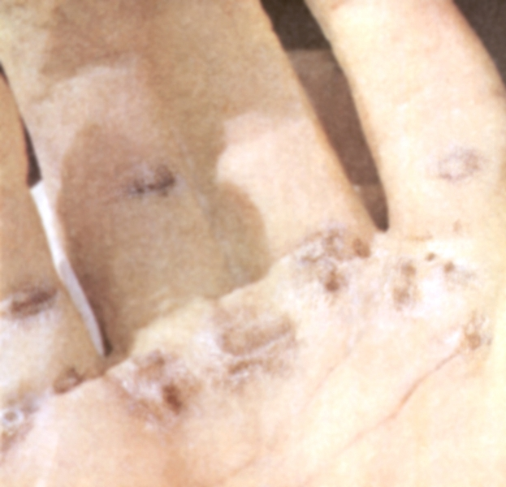

_Метки тока на ладони_

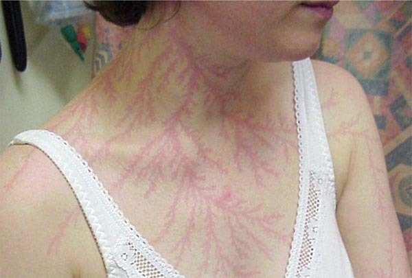

_Метки тока после удара молнией_

**_Металлизация_**  
Металлизация представляет собой внутридермальное (находящееся в толще кожи) проникновение небольших частиц металла, которые расплавились под действием электродуги. Металл нагретый дугой, повреждая верхние слои кожи, быстро остывает, передавая тепло очень теплоемкой коже и застывает в термокоагулированной ожоговой поверхности (в струпе).

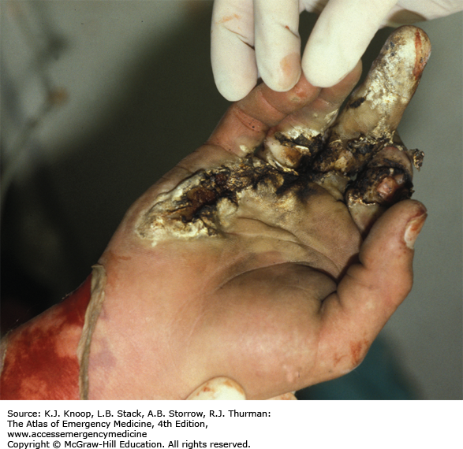

_металлизация_

При незначительных, неглубоких (до росткового слоя кожи) поражениях кожи металлизация может исчезнуть бесследно, равно как и связанные с ней болевые ощущения, но чаще эти поражения более глубокие и оставляют рубцы.

**_Поражения глаз_**  
Особенно опасна металлизация роговицы глаза. Такое поражение приводит к временной, нуждающейся в длительном лечении, а иногда и неизлечимой слепоте. Из местных офтальмологических проявлений можно также выделить помутнение хрусталика (катаракту), которая иногда возникает при прохождении разряда через голову.

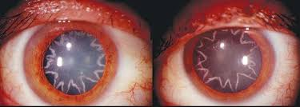

_Парная звездчатая катаракта после электротравмы_

**_Переломы и другие механические повреждения_**  
Что интересно, электротравма может приводить к тяжелым механическим повреждениям, например, вывихам, разрывам связок, переломам, а также вызывать кровотечения из поврежденных сосудов. Основной причиной таких повреждений считаются судороги, развившиеся в результате раздражающего воздействия тока.

Так, у малазийского школьника, о котором мы писали, возникло кровотечение в местах контакта кожи с наушниками.

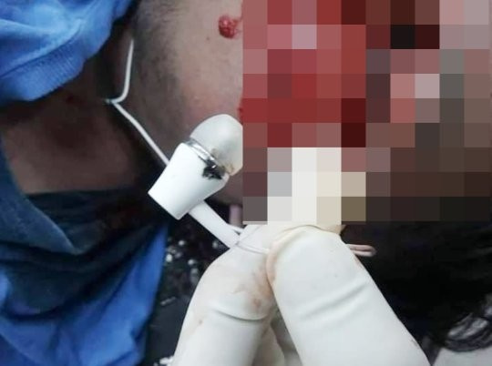

_Кровотечение из уха, после электротравмы через наушники_

В 2017-м году в Первоуральске [был зафиксирован](http://www.obltv.ru/news/incidents/devochka-iz-pervouralskaya-poluchila-perelom-ruki-ot-udara-tokom/) случай переломов костей предплечья у ребенка в результате полученной электротравмы. К механическим повреждениям вследствие поражения током не принято относить травмы, полученные опосредованно, например, при падении после получения удара током.

**_Общие проявления_**  
Общее действие тока приводит к нарушению работы жизненно важных органов и систем, ток способен поражать все органы и ткани человека. В зависимости от факторов, описанных выше, эффект может быть совершенно разным по тяжести и выраженности клиники.

Выделяют 4 степени тяжести поражения током:

*   1-я — судороги при сохраненном сознании;
*   2-я — судороги с потерей сознания, но без нарушений дыхания и кровообращения;
*   3-я — судороги в сочетании с потерей сознания, а также нарушениями дыхания (тахипноэ, диспноэ) и (или) сердечной деятельности (аритмия, тахикардия);
*   4-я — клиническая смерть, как правило, наступившая в результате фибрилляции или поражения дыхательного центра (находится в продолговатом мозге).

*Клиническая смерть — отсутствие дыхания, сердечной деятельности, сознания.  
*Фибрилляция — беспорядочное сокращения сердечных камер.

### Гаджеты и электротравмы

Повсеместное распространение гаджетов привело к ощутимому росту количества электротравм, полученных в быту. Совершенно естесвенно, что все они вызваны гаджетами, заряжающимися от сети, и, зачастую, в ситуациях, когда пользователь беспечно пренебрегает правилами электробезопасности. Между подобными случаями есть много общего. Проводя небольшой контент анализ по случаям за последние 8 лет, я обратил внимание, что большинство происходят в развивающихся странах с жарким влажным климатом (Китай, Индия, Малайзия, Бразилия).

В подавляющем большинстве случаев причиной поражения становится гаджет, заряжающийся от низкокачественного зарядного с проблемной гальванической развязкой. В этих странах распространено каркасное домостроение с металлическими опорными конструкциями, к которым при помощи токопроводящих элементов крепятся напольные покрытия. Всего я насчитал 42 случая с такого рода электротравмами. К регионам с жарким климатом, сравнительно низким уровнем жизни и дешевыми каркасными домами относилось 36.

Ниже приведу лишь наиболее известные и громкие инциденты, не скрою, что, делая эту выборку, я старался привести примеры близкие к случаю в Малайзии (наушники+смартфон+зарядка), дабы продемонстрировать не единичность и стопроцентную летальность:

[Малазийский инцидент, 2018 г. Подросток, наушники, заряжающийся смартфон.](https://www.dailymail.co.uk/news/article-6470735/Malaysian-boy-electrocuted-wearing-headphones-phone-plugged-charger.html)

[Бразилия, 2018 г. Случай с девушкой и наушниками (возможно, влияние молнии)](https://www.dailymail.co.uk/news/article-5413287/Brazilian-girl-electrocuted-mobile-phone.html)  
[Индия, 2018\. Электротравма в наушниках (женщина, 46 лет.](https://www.khaleejtimes.com/international/india/Woman-gets-electrocuted-with-earphones-while-listening-to-music)

[Индия, 2018\. Электротравма в наушниках (Тад Сингх, мужчина, 22 года)](https://www.ndtv.com/india-news/yamunanagar-man-electrocuted-while-listening-to-music-his-phone-was-charging-1863557)

[Электротравма при отсоединении смартфона от кабеля USB. Случай в интернет кафе города Ухань, Китай — 2016, (подросток, интернет-кафе, смартфон, ПК).](https://mashable.com/2016/04/22/teenager-electrocuted-internet-cafe/#H5y_wXcGluqV)

[Малайзия 2017\. Случай с подключеннным к розетке смартфоном.](https://mashable.com/2016/04/18/woman-electrocuted-phone/#c0ZGTjH_XGqw)

[Лондон. Удар током от заряжающегося смартфона в ванной (мужчина, 32 года)](https://www.digitaltrends.com/mobile/iphone-charging-accident/)

[Китай. Кома вследствие электротравмы — 2013, заряжающийся смартфон.](https://www.dailymail.co.uk/news/article-2370130/iPhone-charger-puts-Beijing-man-30-coma-electric-shock-days-air-stewardess-died-charging-Apple-mobile.html)

[Китай, 2017\. Девушка -подросток, 14 лет, поврежденный USB-кабель зарядного устройства смартфона.](https://www.dailymail.co.uk/news/article-5085165/Girl-14-electrocuted-faulty-iPhone-charger-Vietnam.html)

Еще раз подчеркну, все известные мне случаи с электротравмой через наушники — летальные, что подтверждает опасность петель “голова-конечности”.

Одна из описанных выше ситуаций была зафиксирована на видео в Китае в 2016-м году. Отсоединяя смартфон от ПК, геймер получил смертельный разряд. Меня там особенно поразило поведение окружающих, которые практически не оказывали помощь.

_Видео не рекомендуется для просмотра детям и впечатлительным_

Во всех случаях, кроме Бразильского (где, вероятно, имел место удар молнии), фигурировало заземление (через ванны, элементы напольных покрытий, заземленный металлический стол).

Так или иначе, все подобные случаи укладываются в существующие представления об электротравмах и подтверждают многое из написанного выше. При подробном анализе, кажущаяся парадоксальность превращается во вполне обыденную историю для ожоговых центров, реанимационных отделений и патологоанатомических бюро.

### Итог

Я искренне надеюсь, что представленный ликбез был полезен. Будем признательны если вы поделитесь своим мнением в комментариях. Возможно, вам доводилось пережить электротравму или её последствия, или вы регулярно сталкиваетесь с этим на работе, расскажите другим о своём опыте. Возможно выйдет ещё один пост касающийся первой помощи — напишите если это для вас актуально.

_Использован фотоконтент:_

_[steemit.com/comedy/@grow-pro/finding-my-funny-ass-underwater-flooding-and-funny-gifs-w-grow-pro](https://steemit.com/comedy/@grow-pro/finding-my-funny-ass-underwater-flooding-and-funny-gifs-w-grow-pro)  
[www.intechopen.com/books/forensic-medicine-from-old-problems-to-new-challenges/epidemiology-and-diagnostic-problems-of-electrical-injury-in-forensic-medicine](https://www.intechopen.com/books/forensic-medicine-from-old-problems-to-new-challenges/epidemiology-and-diagnostic-problems-of-electrical-injury-in-forensic-medicine)  
[cdn.intechweb.org/pdfs/19164.pdf](http://cdn.intechweb.org/pdfs/19164.pdf)  
[accessmedicine.mhmedical.com/content.aspx?bookid=1763&sectionid=125437574&jumpsectionid=125437642](https://accessmedicine.mhmedical.com/content.aspx?bookid=1763&sectionid=125437574&jumpsectionid=125437642)  
[vpr.sdamgia.ru/problem?id=807](https://vpr.sdamgia.ru/problem?id=807)  
[ppt-online.org/44358](https://ppt-online.org/44358)_

_Рекламная нагрузка  
[Мы продаём](https://www.pult.ru/) электронику, разную, много. Если соблюдать правила эксплуатации, электроника которую мы продаём не приводит к поражению электрическим током. Более того, нам не известно ни одного случая, когда бы наши покупатели получили электротравму от приобретенных у нас товаров._