Машинное обучение это весело! Часть 1

_Часть цикла статей [Adam Geitgey](https://medium.com/@ageitgey?source=post_header_lockup) – “Машинное обучение это весело!”: [ч.1](https://algotravelling.com/ru/%D0%BC%D0%B0%D1%88%D0%B8%D0%BD%D0%BD%D0%BE%D0%B5-%D0%BE%D0%B1%D1%83%D1%87%D0%B5%D0%BD%D0%B8%D0%B5-%D1%8D%D1%82%D0%BE-%D0%B2%D0%B5%D1%81%D0%B5%D0%BB%D0%BE-1/), [ч.2](https://algotravelling.com/ru/%D0%BC%D0%B0%D1%88%D0%B8%D0%BD%D0%BD%D0%BE%D0%B5-%D0%BE%D0%B1%D1%83%D1%87%D0%B5%D0%BD%D0%B8%D0%B5-%D1%8D%D1%82%D0%BE-%D0%B2%D0%B5%D1%81%D0%B5%D0%BB%D0%BE-2/), [ч.3](https://algotravelling.com/ru/%D0%BC%D0%B0%D1%88%D0%B8%D0%BD%D0%BD%D0%BE%D0%B5-%D0%BE%D0%B1%D1%83%D1%87%D0%B5%D0%BD%D0%B8%D0%B5-%D1%8D%D1%82%D0%BE-%D0%B2%D0%B5%D1%81%D0%B5%D0%BB%D0%BE-3/), [ч.4](https://algotravelling.com/ru/%D0%BC%D0%B0%D1%88%D0%B8%D0%BD%D0%BD%D0%BE%D0%B5-%D0%BE%D0%B1%D1%83%D1%87%D0%B5%D0%BD%D0%B8%D0%B5-%D1%8D%D1%82%D0%BE-%D0%B2%D0%B5%D1%81%D0%B5%D0%BB%D0%BE-4/), [ч.5](https://algotravelling.com/ru/%D0%BC%D0%B0%D1%88%D0%B8%D0%BD%D0%BD%D0%BE%D0%B5-%D0%BE%D0%B1%D1%83%D1%87%D0%B5%D0%BD%D0%B8%D0%B5-%D1%8D%D1%82%D0%BE-%D0%B2%D0%B5%D1%81%D0%B5%D0%BB%D0%BE-5/), [ч.6](https://algotravelling.com/ru/%D0%BC%D0%B0%D1%88%D0%B8%D0%BD%D0%BD%D0%BE%D0%B5-%D0%BE%D0%B1%D1%83%D1%87%D0%B5%D0%BD%D0%B8%D0%B5-%D1%8D%D1%82%D0%BE-%D0%B2%D0%B5%D1%81%D0%B5%D0%BB%D0%BE-6/), [ч.7](https://algotravelling.com/ru/%D0%BC%D0%B0%D1%88%D0%B8%D0%BD%D0%BD%D0%BE%D0%B5-%D0%BE%D0%B1%D1%83%D1%87%D0%B5%D0%BD%D0%B8%D0%B5-%D1%8D%D1%82%D0%BE-%D0%B2%D0%B5%D1%81%D0%B5%D0%BB%D0%BE-7/), [ч.8](https://algotravelling.com/ru/%D0%BC%D0%B0%D1%88%D0%B8%D0%BD%D0%BD%D0%BE%D0%B5-%D0%BE%D0%B1%D1%83%D1%87%D0%B5%D0%BD%D0%B8%D0%B5-%D1%8D%D1%82%D0%BE-%D0%B2%D0%B5%D1%81%D0%B5%D0%BB%D0%BE-8/)._

* * *

## Самое простое введение в машинное обучение

Вы много раз слышали, как люди говорят о машинном обучении, но смутно представляете себе, что это? Вам стыдно, потому что не можете поддержать разговор с коллегами? Так давайте же исправим это!

Этот курс предназначен для начинающих знакомство с машинным обучением. Многие пытались прочесть [статью из Википедии](https://ru.wikipedia.org/wiki/%D0%9C%D0%B0%D1%88%D0%B8%D0%BD%D0%BD%D0%BE%D0%B5_%D0%BE%D0%B1%D1%83%D1%87%D0%B5%D0%BD%D0%B8%D0%B5), но не смогли ничего понять и отчаялись получить простое объяснение. Но вот оно перед вами!

Содержание статей рассчитано на широкую аудиторию и будет достаточно поверхностным. Но разве это кого-то волнует? Чем больше людей заинтересуются машинным обучением, тем лучше.

## Что такое машинное обучение?

Машинное обучение – это идея о существовании общих алгоритмов, которые способны рассказать нам что-то интересное о наборе данных без необходимости писать специфичный для данной проблемы код. Вместо написания кода вы передаете данные в общий алгоритм, и он строит свою собственную логику на их основе.

Например, один из видов алгоритма – алгоритм классификации. Он способен помещать данные в разные группы. Тот же алгоритм классификации, который используется для распознавания рукописных цифр, может также использоваться для классификации писем на спам и не-спам без изменения строчки кода. Это тот же алгоритм, но обученный на других данных, поэтому на выходе получается другая логика классификации.

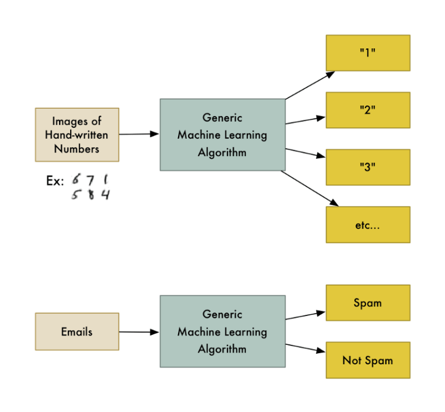

«Машинное обучение» – это общий термин, охватывающий множество таких обобщенных алгоритмов.

## Два типа алгоритмов

Алгоритмы машинного обучения входят в одну из двух основных категорий – **обучение с учителем** (_supervised learning_) и **обучение без учителя** (_unsupervised learning_). Разница между ними простая, но важная.

### Обучение с учителем

Представьте, что вы агент по недвижимости. Бизнес растет, и вы нанимаете кучу новых агентов-стажеров себе в помощь. Но есть одна проблема – вы можете заглянуть в дом и хорошо оценить его стоимость, а ваши ученики не обладают таким опытом и не могут справиться с этой задачей.

Чтобы помочь стажерам (и, возможно, освободить время для отпуска), вы решили написать небольшое приложение. Оно поможет оценить стоимость дома исходя из его размера, местоположения и стоимости похожих домов.

Для этого в течении трех месяцев вы лезете в тетрадку каждый раз, когда кто-то продает дом в вашем городе. Для каждого дома вы записываете кучу деталей: количество спален, размер в квадратных футах, район и т. д. Но самое главное, вы записываете цену продажи:

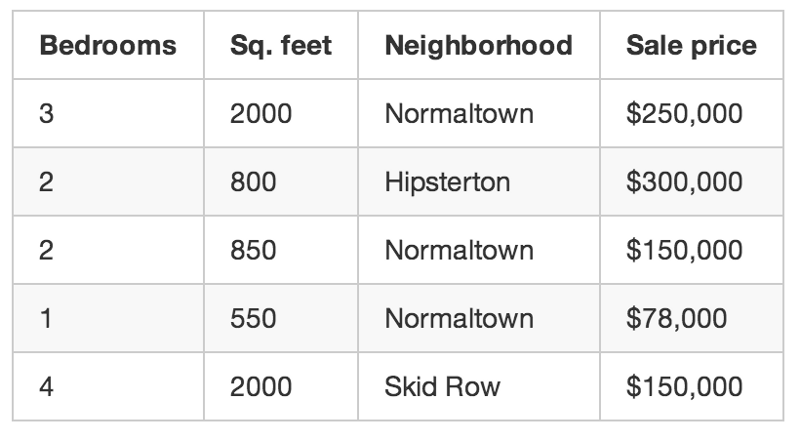

Используя обучающие данные, вы хотите создать программу, которая будет оценивать стоимость любого дома в вашем районе:

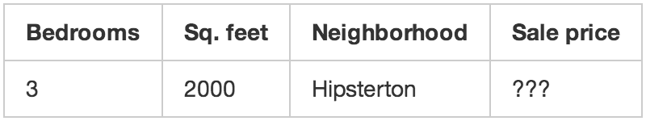

Это называется **обучением** **с учителем**. Вы знаете стоимость каждого дома, а значит, можете понять исходную зависимость цены от факторов.

Чтобы создать приложение, вы загружаете свою обучающую выборку в алгоритм. Он пытается выяснить, какую математику нужно проделать, чтобы цифры сошлись.

Это похоже на наличие ключа с ответами на математический тест:

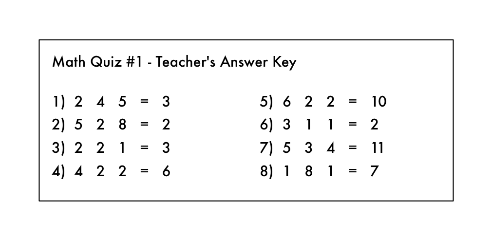

Исходя из этого, можете ли вы выяснить, какие математические задачки были на экзамене? Вы знаете, что вы должны «сделать что-то» с цифрами слева, чтобы получить ответы справа.

При **обучении** **с учителем** вы позволяете компьютеру выработать эти соотношение за вас. И как только вы знаете, какая математика требуется для решения этой конкретной проблемы, вы можете ответить на любую другую проблему того же типа!

### Обучение без учителя

Вернемся к нашему первому примеру с агентом по недвижимости. Что делать, если вы не знаете цену продажи для каждого дома? Даже если все, что вы знаете про каждый дом, это размер, расположение и т. д., то оказывается, вы все равно можете получить интересные результаты. Это называется **обучением** **без учителя**.

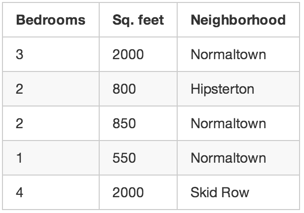

Это похоже на то, как кто-то дает вам список чисел на листе бумаги и говорит: «Я действительно не знаю, что означают эти цифры, но, может быть, ты можешь выяснить, существует ли тут взаимосвязь или что-то еще – удачи!»

Итак, что можно сделать с этими данными? Во-первых, у вас может быть алгоритм, который автоматически идентифицирует разные сегменты рынка в ваших данных. Может быть, вы узнаете, что покупатели жилья по соседству с местным колледжем действительно любят маленькие дома с большим количеством спален, а покупатели жилья в пригороде предпочитают дома с тремя спальнями с множеством квадратных метров. Знание об этих различиях клиентских предпочтений может помочь вам в маркетинге.

Еще одна интересная вещь, которую вы могли бы сделать, – это автоматически идентифицировать любые дома, которые отличались от других. Возможно, эти дома – гигантские особняки, и вы можете направить в них своих лучших продавцов, потому что у них большие комиссионные.

Обучение с учителем – это то, на чем мы сосредоточимся в оставшейся части этой статьи, но это не потому, что обучение без учителя бесполезно или неинтересно. На самом деле, обучение без учителя с каждым днем становится более важным, поскольку алгоритмы улучшаются, а значит, их можно использовать без необходимости маркировать данные правильным ответом.

_Примечание: есть еще много [других](https://ru.wikipedia.org/wiki/%D0%9C%D0%B0%D1%88%D0%B8%D0%BD%D0%BD%D0%BE%D0%B5_%D0%BE%D0%B1%D1%83%D1%87%D0%B5%D0%BD%D0%B8%D0%B5#.D0.A1.D0.BF.D0.BE.D1.81.D0.BE.D0.B1.D1.8B_.D0.BC.D0.B0.D1.88.D0.B8.D0.BD.D0.BD.D0.BE.D0.B3.D0.BE_.D0.BE.D0.B1.D1.83.D1.87.D0.B5.D0.BD.D0.B8.D1.8F)__ алгоритмов машинного обучения. Но и это отличное место для старта._

## Это круто, но разве возможность оценить стоимость дома действительно считается «обучением»?

Человек мозг может подойти к любой ситуации и научиться справляться с ней без каких-либо четких инструкций. Если вы продаете дома в течение длительного времени, у вас будет инстинктивно «чувство» правильной цены для дома, лучший способ продать этот дом, вид клиента, который будет заинтересован и так далее. Цель исследования [сильного искусственного интеллекта](https://ru.wikipedia.org/wiki/%D0%A1%D0%B8%D0%BB%D1%8C%D0%BD%D1%8B%D0%B9_%D0%B8_%D1%81%D0%BB%D0%B0%D0%B1%D1%8B%D0%B9_%D0%B8%D1%81%D0%BA%D1%83%D1%81%D1%81%D1%82%D0%B2%D0%B5%D0%BD%D0%BD%D1%8B%D0%B5_%D0%B8%D0%BD%D1%82%D0%B5%D0%BB%D0%BB%D0%B5%D0%BA%D1%82%D1%8B) – иметь возможность достичь таких же способностей с помощью компьютеров.

Но нынешние алгоритмы машинного обучения еще не настолько хороши – они работают только тогда, когда сосредоточены на очень специфической ограниченной проблеме. Возможно, лучшим определением для «обучения» в этом случае является «вычисление уравнения для решения конкретной проблемы на основе некоторой выборки данных».

К сожалению, «машина, определяющая уравнение для решения конкретной проблемы на основе некоторой выборки данных», не является отличным названием. Поэтому люди придумали «машинное обучение» вместо этого.

Конечно, если вы читаете это через 50 лет, и человечество уже разгадало алгоритм сильного ИИ, то весь этот пост будет казаться немного странным. Тогда перестаньте читать и скажите своему слуге-роботу, чтобы он сделал вам бутерброд, человек из будущего.

## Давайте напишем программу!

Итак, как бы вы написали программу для оценки стоимости дома, как в нашем примере выше? Подумайте об этом секунду, прежде чем читать дальше.

Если бы вы ничего не знали о машинном обучении, вы, вероятно, попытались бы написать несколько основных правил для оценки цены дома вроде этого:

def estimate\_house\_sales\_price(num\_of_bedrooms, sqft, neighborhood):
  price = 0
 _# In my area, the average house costs $200 per sqft_  price\_per\_sqft = 200
  if neighborhood == "hipsterton":
   _ # but some areas cost a bit more_
    price\_per\_sqft = 400
  elif neighborhood == "skid row":
   _ # and some areas cost less_
    price\_per\_sqft = 100
  _\# start with a base price estimate based on how big the place is_
  price = price\_per\_sqft * sqft
  _\# now adjust our estimate based on the number of bedrooms_
  if num\_of\_bedrooms == 0:
    _\# Studio apartments are cheap_
    price = price — 20000
  else:
   _ # places with more bedrooms are usually
    # more valuable_
    price = price + (num\_of\_bedrooms * 1000)
  return price

Если вы будете возиться с этим часами напролет, то можете получить что-то правдоподобное. Но ваша программа никогда не будет идеальной, и ее будет сложно поддерживать по мере изменения цен.

Было бы лучше, если бы компьютер мог просто реализовать эту функцию за вас? Кого волнует, что именно функция делает, до тех пор пока она возвращает правильное число:

def estimate\_house\_sales\_price(num\_of_bedrooms, sqft, neighborhood):
  price = &lt;компьютер, плз сделай математику за меня&gt;
  return price

Один из способов посмотреть на эту проблему такой: **цена** – это вкусное блюдо, а **количество спален**, **площадь в квадратных футах** и ​​**район –** это ингридиенты. Если бы мы знали, насколько каждый ингредиент влияет на цену, то возможно, поняли бы точное соотношение ингредиентов нужно для окончательной цены.

Это сократит нашу первую программу (со всеми этими безумными if и else) вплоть до чего-то очень простого:

def estimate\_house\_sales\_price(num\_of_bedrooms, sqft, neighborhood):
 price = 0
 # a little pinch of this
 price += num\_of\_bedrooms * **.841231951398213
** # and a big pinch of that
 price += sqft * **1231.1231231
** # maybe a handful of this
 price += neighborhood * **2.3242341421
** # and finally, just a little extra salt for good measure
 price += **201.23432095
** return price

Способ в лоб определить лучшие веса будет примерно таким:

### **Шаг 1:**

Положим все веса равными **1.0**:

def estimate\_house\_sales\_price(num\_of_bedrooms, sqft, neighborhood):
  price = 0
  # a little pinch of this
  price += num\_of\_bedrooms * **1.0**  # and a big pinch of that
  price += sqft * **1.0
**  # maybe a handful of this
  price += neighborhood * **1.0
**  # and finally, just a little extra salt for good measure
  price += **1.0
**  return price

### **Шаг 2:**

Прогоним каждый дом через нашу функцию и посмотрим, насколько сильно она ошиблась:

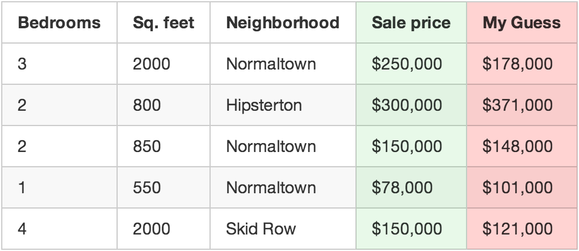

Например, если первый дом был продан за 250 000 долларов, а функция угадала, что он был продан за 178 000 долларов, то мы ошиблись на 72 000 долларов.

Теперь возведем в квадрат число, которое вы получаете для каждого дома в вашем наборе данных. Предположим, что в вашем наборе данных было всего 500 продаж, сумма квадратов отклонений от правильной цены составила в общей сложности 86 123 373 доллара. Вот насколько “неправильна” сейчас наша функция.

Теперь возьмем эту общую сумму и разделим ее на 500, чтобы получить среднее значение того, как сильно мы ошибаемся с ценой каждого дома. Назовем эту среднюю ошибку функцией потерь (loss function).

Если бы мы могли сделать эту функцию потерь равной нулю, играя с весами, то наша функция была бы идеальной. Это будет означать, что в каждом случае наша функция прекрасно угадывала цену дома на основе входных данных. Итак, это наша цель – добиться, чтобы функция потерь была как можно меньше, используя разные веса.

### Шаг 3:

Повторим шаг 2 снова и снова с **каждой возможной комбинацией весов**. Какая бы комбинация весов ни делала функцию потерь, близкую к нулю, мы ее и используем. Когда мы найдем веса, которые работают, мы решили проблему!

## Время для взрыва мозга

Это очень просто, правда? Теперь подумаем о том, что мы только что сделали. Мы взяли некоторые данные, проделали три простых, действительно простых шага, и получили функцию, которая может угадать цену любого дома в нашем районе. Берегись ЦИАН!

Но вот еще несколько фактов, которые окончательно взорвут ваш мозг:

1.  Исследования, проведенные во многих областях (например, лингвистика / перевод) за последние 40 лет, показали, что эти общие алгоритмы обучения для «приготовления рагу из чисел» (фраза, которую я только придумал), превосходят методы, когда реальные люди пытаются сформулировать правила сами. «Наивный» подход машинного обучения в конечном счете побеждает экспертов.
2.  Полученная нами функция совершенно глупая. Она даже не знает, что такое «квадратные футы» или «спальни». Все, что она знает, это то, что для правильного ответа ей нужно покопаться в некотором количестве этих чисел.
3.  Вероятно, вы также не знаете, почему будет работать определенный набор весов. Итак, мы только что написали функцию, которую мы не понимаем, но она работает.
4.  Представим, что теперь вместо параметров «квадратные_футы» и «количество_спален», наша функция получила на вход массив чисел. Допустим, каждое число представляет яркость одного пикселя изображения, снятого камерой на автомобиле. Теперь предположим, что вместо вывода прогноза с названием «цена» функция выдала прогноз под названием «угол_поворота_руля». Мы только что создали функцию, которая может управлять автомобилем сама по себе!

С ума сойти, правда?

## А как же «переберем все значения» в шаге 3?

Конечно, мы не можем просто попробовать каждую комбинацию всех возможных весов, чтобы найти оптимальные значения. Это займет буквально вечность, потому что числа никогда не иссякнут.

Чтобы этого не произошло, математики придумали множество [умных способов](https://ru.wikipedia.org/wiki/%D0%93%D1%80%D0%B0%D0%B4%D0%B8%D0%B5%D0%BD%D1%82%D0%BD%D1%8B%D0%B9_%D1%81%D0%BF%D1%83%D1%81%D0%BA) быстро найти хорошие значения для этих весов, не прибегая к полному перебору. Вот один из способов:

Во-первых, напишем простое уравнение из шага 2:

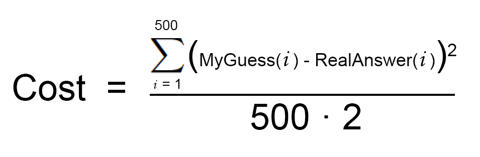

Теперь давайте перепишем точно то же самое уравнение, но используя кучу жаргона из машинного обучения (который вы можете игнорировать сейчас):

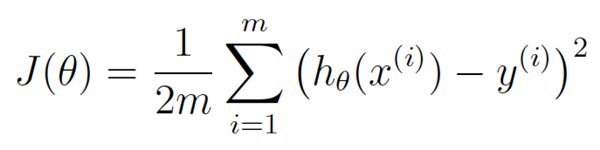

Это уравнение показывает, насколько сильно ошибается наша функция оценки стоимости.

Если мы построим построим функцию потерь для всех возможных значений наших весов для **количества_спален** и **квадратных_футов**, то получим примерно вот такой график:

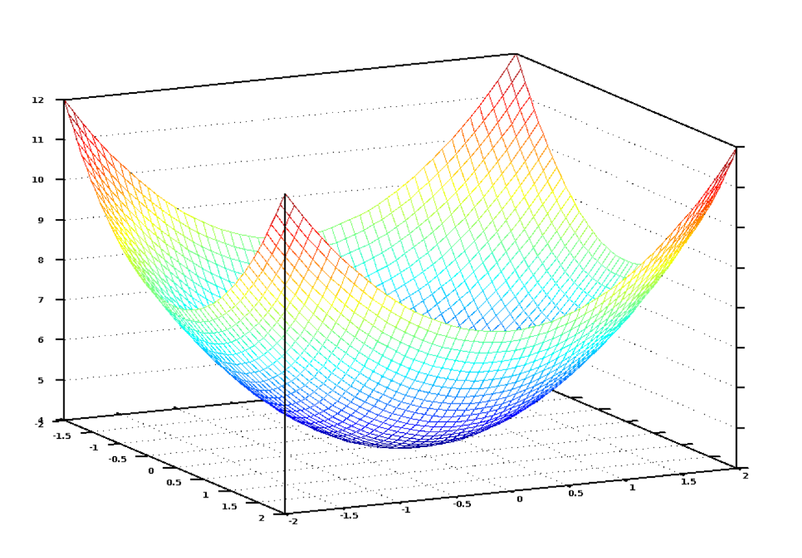

На этом графике самая низкая самая точка соответствует наименьшим потерям – в ней функция ошибается меньше всего. Верхние красные точки – это то место, где мы больше всего неправы. Поэтому, если мы сможем найти веса, которые приведут нас к самой низкой точке на этом графике, то получим ответ!

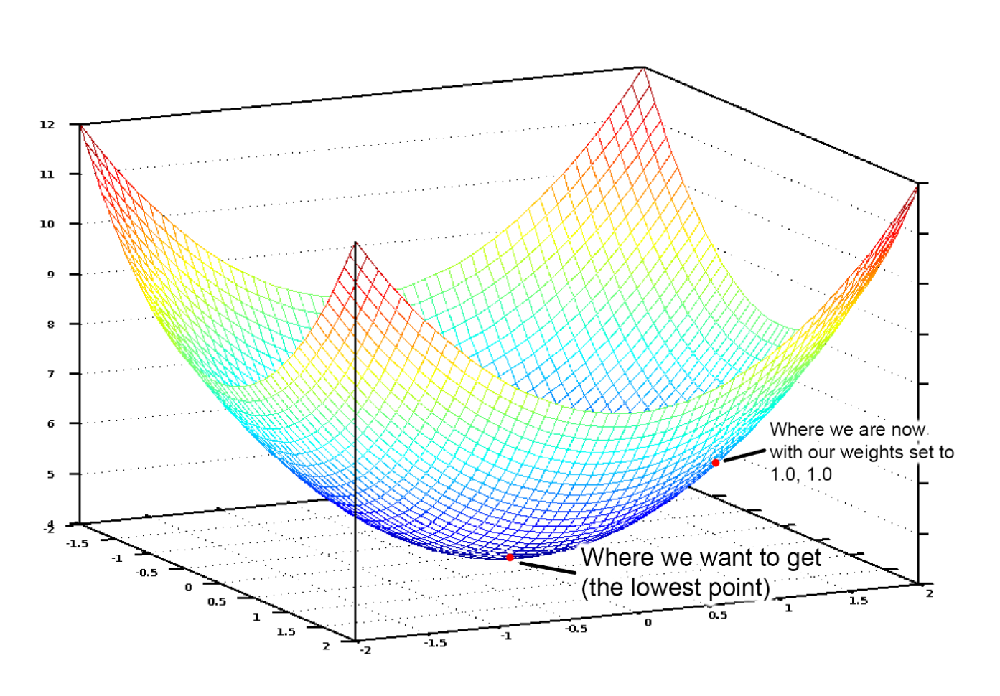

Поэтому нам просто нужно настроить наши веса так, чтобы мы «шли вниз по склону» на этом графике, приближаясь к нижней точке. Если внося небольшие коррективы в наши веса, мы всегда движемся к самой низкой точке, то мы в конечном итоге доберемся туда без необходимости проверять много разных весов.

Если вы помните хоть что-нибудь из математического анализа, то наверное помните, что производная от функции показывает вам наклон касательной функции в любой точке. Другими словами, это говорит нам, какой путь является движением вниз в любой точке на нашем графике. Мы можем использовать эти знания, чтобы спускаться вниз.

Итак, если мы вычислим частную производную нашей функции потерь по каждому из наших весов, то мы можем вычесть это значение из каждого веса. Это приблизит нас еще на один шаг ближе к нижней части холма. Продолжая делать это, в конце концов мы достигнем нижней части холма и получим наилучшие возможные значения для наших весов. (Если ничего непонятно, то не волнуйтесь и продолжайте читать).

Так в общих чертах выглядит один из лучших способов найти оптимальные веса для функции потерь, и называется он **общим** **градиентным спуск****ом**. Не бойтесь [копнуть глубже](http://hbfs.wordpress.com/2012/04/24/introduction-to-gradient-descent/), если вам интересно узнать подробности.

Когда мы используем библиотеки машинного обучения для решения реальной проблемы, все это будет сделано автоматически. Но все же полезно иметь хорошее представление о том, что происходит.

## Что мы пропустили?

Трехшаговый алгоритм, который я описал, называется **многомерной линейной регрессией**. Мы оцениваем уравнение прямой, которая соответствует всем нашим точкам обучающей выборки. Затем вм используем это уравнение, чтобы предсказать цену продажи домов, которые мы никогда раньше не видели, в зависимости от того где этот дом окажется на нашей прямой. Это действительно мощная идея, и вы можете решить с ней «настоящие» проблемы.

Но хотя подход, который я показал, может работать в простых случаях, он не будет работать всегда. Одна из причин заключается в том, что цены на жилье не всегда достаточно просты, чтобы следовать непрерывной линии.

Но, к счастью, есть много способов справиться с этим. Существует множество других алгоритмов машинного обучения, которые могут обрабатывать нелинейные данные (например, [нейронные сети](https://ru.wikipedia.org/wiki/%D0%98%D1%81%D0%BA%D1%83%D1%81%D1%81%D1%82%D0%B2%D0%B5%D0%BD%D0%BD%D0%B0%D1%8F_%D0%BD%D0%B5%D0%B9%D1%80%D0%BE%D0%BD%D0%BD%D0%B0%D1%8F_%D1%81%D0%B5%D1%82%D1%8C) или [SVM](https://ru.wikipedia.org/wiki/%D0%9C%D0%B5%D1%82%D0%BE%D0%B4_%D0%BE%D0%BF%D0%BE%D1%80%D0%BD%D1%8B%D1%85_%D0%B2%D0%B5%D0%BA%D1%82%D0%BE%D1%80%D0%BE%D0%B2) с [ядрами](https://en.wikipedia.org/wiki/Kernel_method)). Существуют также способы более умного использования линейной регрессии, которые позволяют получать более сложные линии. Во всех случаях применяется одна и та же основная идея – нахождение лучших весов.

Кроме того, я проигнорировал идею **переобучения**. Легко подобрать набор весов, который всегда идеально подходит для прогнозирования цен домов в исходном наборе данных, но никогда не работает для новых домов, которые не были в исходном наборе данных. Но есть способы справиться с этим (например, [регуляризация](https://ru.wikipedia.org/wiki/%D0%A0%D0%B5%D0%B3%D1%83%D0%BB%D1%8F%D1%80%D0%B8%D0%B7%D0%B0%D1%86%D0%B8%D1%8F_(%D0%BC%D0%B0%D1%82%D0%B5%D0%BC%D0%B0%D1%82%D0%B8%D0%BA%D0%B0)) и [кросс-валидация](https://ru.wikipedia.org/wiki/%D0%9F%D0%B5%D1%80%D0%B5%D0%BA%D1%80%D1%91%D1%81%D1%82%D0%BD%D0%B0%D1%8F_%D0%BF%D1%80%D0%BE%D0%B2%D0%B5%D1%80%D0%BA%D0%B0)). Изучение того, как бороться с этой проблемой, является ключевой частью навыков машинного обучения.

Другими словами, в то время как базовая концепция довольно проста, требуется некоторое умение и опыт для применения машинного обучения и получения полезных результатов. Но это умение, которое может освоить любой разработчик!

## Машинное обучение – это магия?

Как только вы начинаете понимать, насколько легко машинные методы обучения могут быть применены к проблемам, которые кажутся действительно трудными (например, распознавание рукописного текста), у вас начинает возникать ощущение, что вы можете использовать машинное обучение для решения любой проблемы и получить ответ, если у вас будет достаточно данных. Просто скармливаете данные компьютеру и смотрите, как он волшебным образом находит взаимосвязь!

Но важно помнить, что машинное обучение работает только в том случае, когда проблема действительно разрешима с данными, которые у вас есть.

Например, если вы построите модель, которая предсказывает цены на жилье в зависимости от типа комнатных растений в каждом доме, это никогда не сработает. Просто нет каких-либо зависимостей между комнатными растениями в доме и ценой на этот дом. Поэтому независимо от того, насколько сильно компьютер будет стараться, он никогда не сможет вывести соотношение между ними.

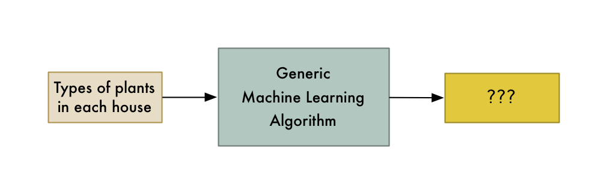

Поэтому помните, что если эксперт не может использовать данные для решения проблемы вручную, то компьютер, вероятно, также не сможет этого сделать. Вместо этого сосредоточьтесь на проблемах, когда человек может решить проблему, но где было бы здорово, если бы компьютер мог решить ее намного быстрее.

## Где узнать больше про машинное обучение

На мой взгляд, самая большая проблема с машинным обучением прямо сейчас заключается в том, что она в основном живет в мире научных кругов и коммерческих исследовательских групп. Существует не так много простых для понимания материалов для тех, кто хотел бы получить широкое понимание, не становясь фактически экспертом. Но с каждым днем ситуация становится все лучше.

Если вы хотите применить на практике все, что узнали в этой статье, то обратите внимание на [мой курс](https://www.lynda.com/Data-Science-tutorials/Machine-Learning-Essential-Training-Value-Estimations/548594-2.html?lpk35=9149&utm_medium=ldc-partner&utm_source=CMPRC&utm_content=524&utm_campaign=CD20575&bid=524&aid=CD20575). Он шаг за шагом проведет вас по этой статье, включая написание кода. Попробуйте!

Если вы хотите копнуть глубже, то бесплатный курс по машинному обучению от [Andrew Ng на Coursera](https://www.coursera.org/learn/machine-learning) это отличное место для начала. Он доступен для всех, у кого есть степень по информатике и кто помнит минимальное количество математики.

Кроме того, вы можете поиграться с кучей алгоритмов машинного обучения, загрузив и установив [SciKit-Learn](http://scikit-learn.org/stable/). Это пакет для языка python, который имеет версии «черного ящика» всех стандартных алгоритмов.