Машинное обучение это весело! Часть 2

## Более точные оценки

В [первой части](https://algotravelling.com/ru/machine-learning-fun-part-1-2/) мы создали простой алгоритм, который оценивал стоимость дома на основе его характеристик. Исходя из примерно таких данных:

Мы пришли к вот такой простой функции:

def estimate\_house\_sales\_price(num\_of_bedrooms, sqft, neighborhood):
 price = 0
\# a little pinch of this
 price += num\_of\_bedrooms * **0.123** \# and a big pinch of that
 price += sqft * **0.41** \# maybe a handful of this
 price += neighborhood * **0.57** return price

Другими словами, мы оценивали стоимость дома путем умножения каждой из его характеристик на **вес**. Затем мы просто сложили эти числа, чтобы получить стоимость дома.

Вместо использования кода давайте представим ту же функцию в виде диаграммы:

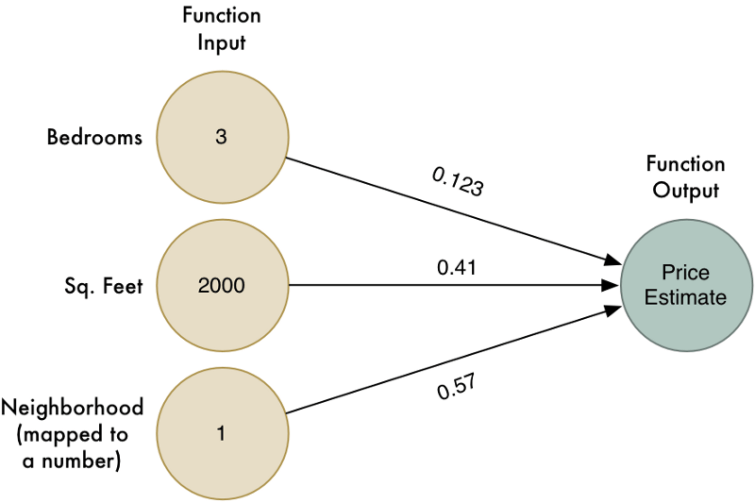

Однако, этот алгоритм работает только для простых задач, где результат имеет _линейную_ зависимость от входных данных. Что делать, если цены на жилье образуются не так просто? Например, район может быть важным для больших и маленьких домов, но не иметь значения для домов среднего размера. Как мы бы могли отразить такие сложные детали в модели?

Поступая умнее, мы бы могли запускать этот алгоритм несколько раз с различными весами, каждый из которых захватывал бы разные краевые случаи:

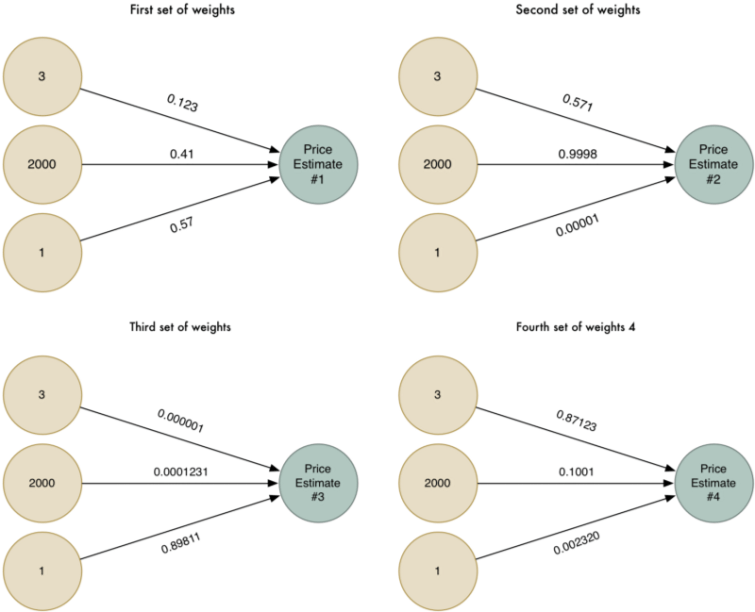

Теперь у нас есть четыре разные оценки стоимости дома. Давайте объединим их в одну, пропустив через тот же алгоритм (но с использованием другого набора весов)!

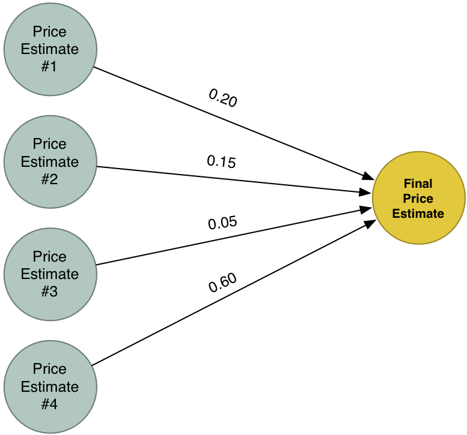

Наш новый _суперответ_ объединяет оценки четырех различных попыток решить одну из ту же задачу. Благодаря этому он может моделировать больше случаев, чем мы могли бы рассмотреть в одной простой модели.

## Что такой нейронные сети?

Давайте объединим наши четыре оценки в одну большую диаграмму:

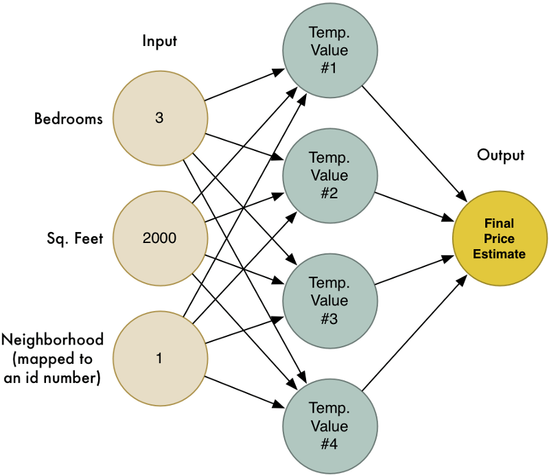

Это и есть нейронная сеть! Каждый модуль знает, как применять веса к входным данным и вычислять искомое значение. Объединив множество этих модулей, мы можем моделировать сложные функции.

Есть много вещей, которые я пропускаю, чтобы сделать статью короткой (включая [масштабирование](https://en.wikipedia.org/wiki/Feature_scaling) и [функцию активации](https://en.wikipedia.org/wiki/Activation_function)), но самая важная часть состоит вот в этих идеях:

*   Мы создали простую функцию оценки, которая принимает набор входных данных и умножает их на весовые коэффициенты для получения результата. Назовем эту простую функцию _**нейроном**_.
*   Объединив множество простых _**нейронов**_, мы можем моделировать функции, которые слишком сложны для моделирования одним единственным нейроном.

Это похоже на LEGO! Мы не можем много намоделировать с помощью одного блока LEGO, но мы можем смоделировать что угодно, если у нас будет достаточно базовых блоков LEGO:

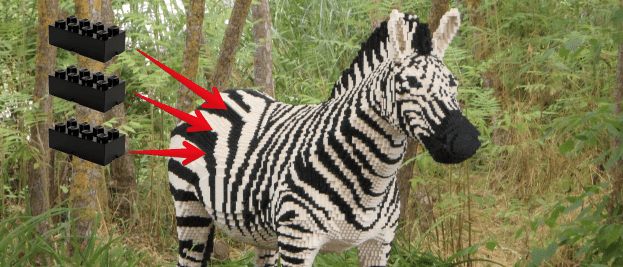

## Нейронные сети с памятью

Нейронная сеть, которую мы видели, всегда возвращает один и тот же ответ, когда вы даете ей одинаковые входные данные. У нее нет памяти. В терминах программирования это алгоритм без учета [состояния](https://ru.wikipedia.org/wiki/%D0%A1%D0%BE%D1%81%D1%82%D0%BE%D1%8F%D0%BD%D0%B8%D0%B5_(%D0%B8%D0%BD%D1%84%D0%BE%D1%80%D0%BC%D0%B0%D1%82%D0%B8%D0%BA%D0%B0)).

Во многих случаях (например, оценка стоимости дома), это именно то, чего вы хотите. Но единственное, чего не может модель такого типа, – находить взаимосвязь в последовательных данных.

Представьте, что я вручил вам клавиатуру и попросил вас написать рассказ. Но прежде чем начать, моя задача – угадать самую первую букву, которую вы наберете. Какую букву мне следует назвать?

Я могу использовать свои знания русского языка, чтобы увеличить шансы угадать правильно. Например, вы, вероятно, наберете букву, которая является типичной в начале слова. Если бы я посмотрел рассказы, которые вы писали в прошлом, я мог бы сузить гипотезу еще больше, основываясь на словах, которые вы обычно используете в начале. Когда у меня появятся все эти данные, я смогу использовать их для построения нейронной сети, чтобы смоделировать вероятность того, что вы начнете с данной буквы.

Наша модель может выглядеть так:

Но давайте сделаем проблему сложнее. Предположим, мне нужно угадать _следующую_ букву, которую вы собираетесь вводить в любой момент в рассказе. Это гораздо более интересная проблема.

Давайте используем несколько слов из романа Эрнеста Хемингуэя  [_«И восходит солнце»_](https://ru.wikipedia.org/wiki/%D0%98_%D0%B2%D0%BE%D1%81%D1%85%D0%BE%D0%B4%D0%B8%D1%82_%D1%81%D0%BE%D0%BB%D0%BD%D1%86%D0%B5_(%D0%A4%D0%B8%D0%B5%D1%81%D1%82%D0%B0)) в качестве примера:

> Роберт Кон когда-то был средневесовым боксеро

Какая буква должна быть следующей?

Вы, наверное, угадали, что это буква ‘м’ – слово, вероятно, будет _боксером_. Мы знаем это на основе букв, которые мы уже видели в предложении, и нашего знания общих слов на русском языке. Кроме того, слово «средневесовой» дает нам дополнительную подсказку, что мы говорим о боксе.

Другими словами, легко угадать следующую букву, если учесть последовательность букв, которые пришли прямо перед ней, и объединить это с нашим знанием правил русского языка.

Чтобы решить эту проблему с  помощью нейронной сети, нам нужно добавить _состояние_ к нашей модели. Каждый раз, когда мы используем нашу нейронную сеть, мы также сохраняем набор промежуточных вычислений и повторно используем их в следующий раз как часть входных данных. Таким образом, наша модель будет корректировать свои прогнозы на основе данных, которые она недавно увидела.

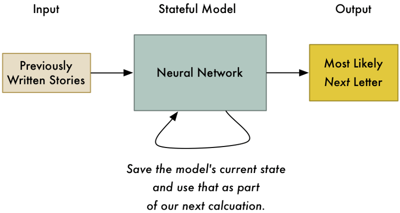

Запоминая состояние нашей модели, мы можем не просто предсказать _первую_ букву в рассказе, но и наиболее вероятную _следующую_ букву, принимая во внимание все предыдущие.

Это основная идея _рекуррентной_ нейронной сети (_Recurren__t Neural Network_). Мы обновляем сеть каждый раз, когда используем ее. Это позволяет обновлять свои прогнозы на основе того, что сеть видела в последний раз. Она может моделировать даже временные паттерны, если мы обеспечим достаточное количество памяти.

## Чем полезна одна буква?

Предсказывать следующую букву в рассказе может показаться довольно бесполезным. Зачем?

Но вот крутое применение – функция автодополнения в клавиатуре мобильного телефона:

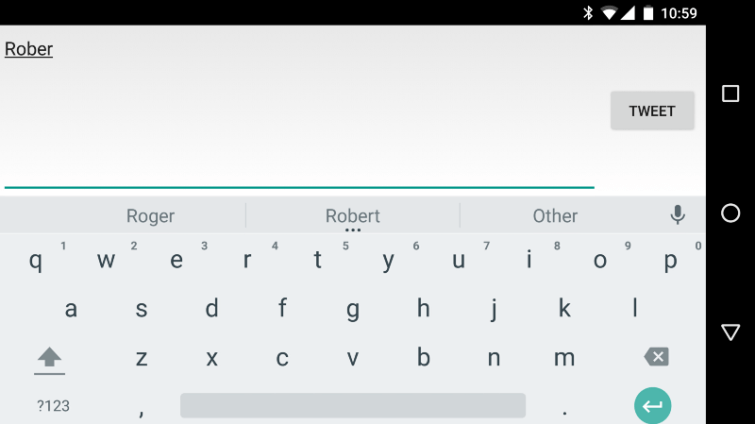

Но что, если мы доведем эту идею до крайности? Что, если мы попросим модель предсказать следующую наиболее вероятную букву снова и снова – навсегда? Мы попросим ее написать нам целый рассказ!

## Написание рассказа

Мы посмотрели, как можно предугадывать следующую букву в рассказе Хемингуэя. Теперь давайте попробуем создать целую историю в стиле Хемингуэя.

Чтобы сделать это, мы будем использовать [рекуррентную нейронную сеть](https://github.com/karpathy/char-rnn), которую написал [Андрея Карпатный](http://karpathy.github.io/about/). Андрей изучает Deep Learning в Стэнфорде, и он написал [отличное введение в создание текста с помощью RNN](http://karpathy.github.io/2015/05/21/rnn-effectiveness/). Вы можете просмотреть весь [код для модели на github](https://github.com/karpathy/char-rnn).

Мы создадим нашу модель из полного текста романа _«И восходит солнце»_ – 362 239 символов, используя 84 уникальных знака (включая знаки препинания, прописные / строчные буквы и т. д.). Этот набор данных на самом деле очень мал по сравнению с типичными приложениями реального мира. Чтобы создать действительно хорошую модель стиля Хемингуэя, было бы гораздо лучше иметь в несколько раз больше текста для обучения. Но и этого достаточно, чтобы поиграться с примером.

Поскольку мы только начинаем обучать RNN, то она не очень хорошо предсказывает буквы. Вот что она генерирует после 100 циклов обучения:

> хйЦТЦнхоофеохелиф едЕлобе негнк е иохехасенолдндАмдаИ аыио пе е х’е бтентмухгехи бцгдлтт. геы хехо грпиахе.  
> Дделнсс.еелаишанер” цот ААфхБ хт лтны  
> ехбих а”он бхнте ецтрснае абеахнгы  
> амо к нс аео?цдсе нх а таеи.раиррхелардр ер деффийха

Как мы можем видеть, алгоритм понял, что иногда слова имеют пробелы между ними, но на этом все.

После приблизительно 1000 итераций результат выглядит более многообещающим:

> Соч. И караос, и воронок для фиттер и але комната меня? Стрэйт не был с ним, когда Билл обрушился на Момансбери, мигрировавшего на быка. Я был сомом  
> Иник срыв, что помощь.  
> «Хватит меня и укоренился. Хватит тебя за косулю», «В паре».  
> «Всем привет!»

Модель начала определять шаблоны в структуре базовых предложений. Она добавляет точки в конце предложений и даже цитирует диалоги. Немногочисленные слова узнаваемы, но есть также и много бессмыслицы.

А после нескольких тысяч итераций обучения тест выглядит уже довольно хорошо:

> Он подошел к воротам кафе. Это было похоже на загородную кровать.  
> «Ты знаешь, что это был я».  
> – Проклял нас, – сказал Билл.  
> «Я был опасен», сказал я. «Вы были ею, и я думаю, что я вам понравится», – сказал я.  
> «Я не могу выглядеть странно в кабине».  
> «Ты же знаешь, что я был таким, – сказала Брет.  
> «Это драки не имеет значения?»  
> «Это делает это».  
> «Вы делаете это?»  
> «Садись, – сказал я. «Хотел бы я немного не побеспокоиться с этим человеком».  
> «Ты нашел это.»  
> «Я не знаю.»  
> «Видишь, мне жаль разговоров, – сказал Билл. «Ты думаешь, что это друг, который спит и заставляет тебя напиться».

На данный момент алгоритм понял базовую модель короткого прямого диалога Хемингуэя. Несколько предложений даже имеют смысл.

Сравните это с реальным текстом из книги:

> В баре было несколько человек, а на улице, в одиночестве, сидел Харви Стоун. Перед ним стояла куча блюдцев, и ему нужно было побриться.  
> «Садись, – сказал Харви, – я искал тебя».  
> «Что случилось?»  
> «Ничего. Просто ищу тебя.»  
> «Выходил на гонки?»  
> «Нет. После воскресенья ни разу.»  
> «Что слышно из Штатов?»  
> «Ничего. Абсолютно ничего.»  
> «Что случилось?»

Даже при поиске _однобуквенных_ шаблонов, наш алгоритм воспроизводит правдоподобную прозу с правильным форматированием. Это потрясающе!

Нам также не нужно создавать текст полностью с нуля. Мы можем подать в алгоритм несколько первых букв, а дальше просто просить его найти последующие буквы.

Для развлечения сделаем фальшивую обложку нашей воображаемой книги, создав новое имя автора и заголовок, используя исходный текст «Эр», «Хе» и «И вос»:

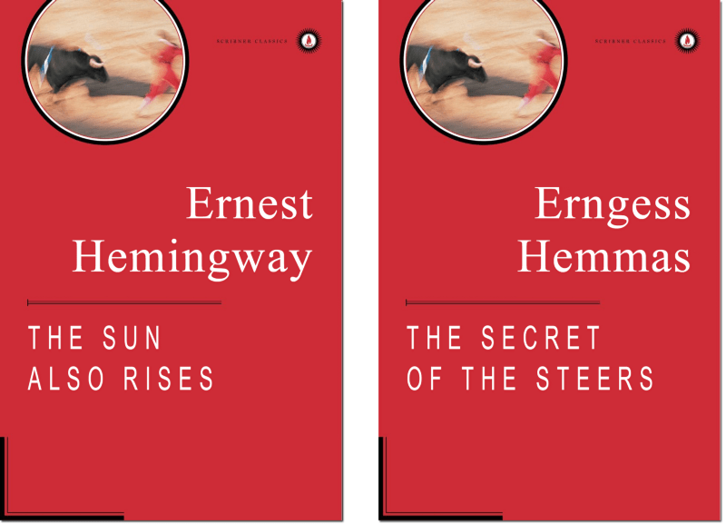

Неплохо!

Но **действительно захватывающая часть** заключается в том, что этот алгоритм может определять шаблоны в любой последовательности данных. Он может легко создавать реальные [рецепты](https://gist.github.com/nylki/1efbaa36635956d35bcc) или [фальшивые речи Обамы](https://medium.com/@samim/obama-rnn-machine-generated-political-speeches-c8abd18a2ea0#.b4clxzrgf). Но зачем ограничивать себя человеческим языком? Мы можем применить эту же идею к любым последовательным данным, имеющим шаблон.

## Создание уровня Mario

В 2015 году компания Nintendo выпустила [Super Mario Maker™](http://supermariomaker.nintendo.com/) для игровой системы Wii U.

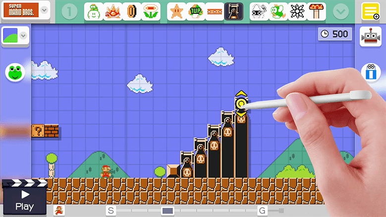

Эта игра позволяет вам рисовать собственные уровни Super Mario Brothers на игровом планшете, а затем загружать их в Интернет, чтобы вы могли играть в них с друзьями. Вы можете включить в свои уровни все классические бонусы и врагов из оригинальных игр Mario. Это похоже на виртуальный набор LEGO для людей, которые выросли, играя в Super Mario Brothers.

Можем ли мы использовать ту же модель, которая генерировала фальшивый текст Хемингуэя для создания поддельных уровней Super Mario Brothers?

Во-первых, нам нужен набор данных для обучения нашей модели. Давайте возьмем все доступные уровни от оригинальной игры Super Mario Brothers, выпущенной в 1985 году:

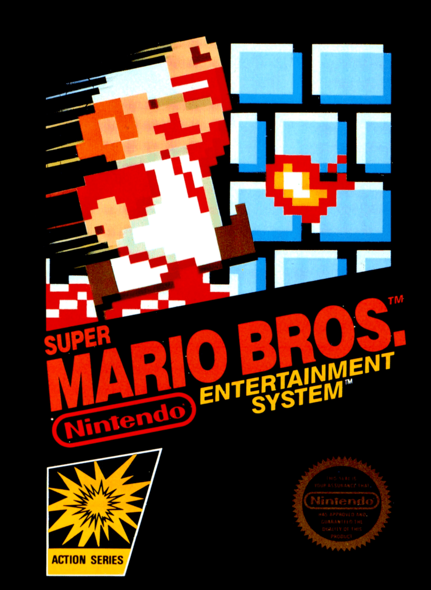

Эта игра имеет 32 уровня, и около 70% из них имеют одинаковый внешний вид. Поэтому мы будем придерживаться их.

Чтобы получить дизайн для каждого уровня, я взял оригинальную копию игры и написал программу, чтобы вытащить дизайн из памяти игры. Super Mario Bros. – это 30-летняя игра, и в сети есть много ресурсов, которые помогут вам понять, как уровни были сохранены в памяти игры. Извлечение данных уровня из старой видеоигры – это увлекательное программирование, которое вы должны когда-нибудь попробовать.

Вот первый уровень из игры (который вы, вероятно, помните, если когда-нибудь в нее играли):

Если мы посмотрим внимательно, то увидим, что уровень сделан из простой сетки объектов:

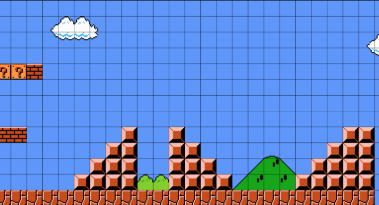

Мы можем легко представить эту сетку как последовательность символов, отвечающих каждый за свой объект:

\-\-\-\-\-\-\-\-\-\-\-\-\-\-\-\-\-\-\-\-\-\-\-\-\-\-
\-\-\-\-\-\-\-\-\-\-\-\-\-\-\-\-\-\-\-\-\-\-\-\-\-\-
\-\-\-\-\-\-\-\-\-\-\-\-\-\-\-\-\-\-\-\-\-\-\-\-\-\-
#??#----------------------
\-\-\-\-\-\-\-\-\-\-\-\-\-\-\-\-\-\-\-\-\-\-\-\-\-\-
\-\-\-\-\-\-\-\-\-\-\-\-\-\-\-\-\-\-\-\-\-\-\-\-\-\-
\-\-\-\-\-\-\-\-\-\-\-\-\-\-\-\-\-\-\-\-\-\-\-\-\-\-
-##------=--=----------==-
--------==--==--------===-
-------===--===------====-
------====--====----=====-
=========================-

Мы заменил каждый объект уровня с помощью символа:

*   ‘-’ пустое пространство
*   ‘=’ неразрушаемый блок
*   ‘#’ разрушаемый блок
*   ‘?’ монетка

…и так далее, используя разные символы для различных объектов из уровня.

В итоге получился текст, который выглядит вот так:

Глядя на текстовый файл, видно, что уровни Марио действительно не имеют большого количества закономерностей, если вы читаете их построчно:

Закономерности возникают, когда мы смотрим на уровень в виде ряда столбцов:

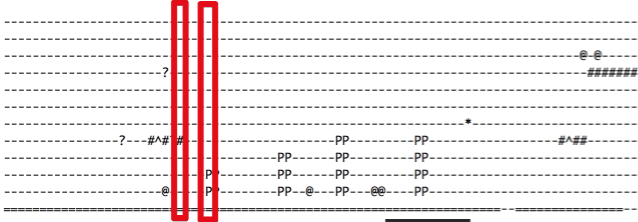

Поэтому для того, чтобы алгоритм мог найти закономерности в наших данных, нужно подавать данные столбец за столбцом. Поиск наиболее эффективного представления входных данных (так называемый [выбор признаков](https://en.wikipedia.org/wiki/Feature_selection)) является одним из ключевых навыков использования алгоритмов машинного обучения.

Чтобы обучить модель, я повернул все текстовые файлы на 90 градусов. Таким образом, символы будут введены в модель в том порядке, в котором шаблон будет легче распознавать:

-----------=
-------#---=
-------#---=
-------?---=
-------#---=
-----------=
-----------=
----------@=
----------@=
-----------=
-----------=
-----------=
---------PP=
---------PP=
----------==
---------===
--------====
-------=====
------======
-----=======
---=========
---=========

## Обучение модели

Как мы видели при создании модели рассказа Хемингуэя, модель улучшается по мере ее обучения.

После небольшой тренировки наша модель порождает мусор:

\-\-\-\-\-\-\-\-\-\-\-\-\-\-\-\-\-\-\-\-\-\-\-\-\-\-
LL+<&=------P-------------
\-\-\-\-\-\-\-\-
---------------------T--#--
\-\-\-\-\-
-=--=-=------------=-&--T--------------
\-\-\-\-\-\-\-\-\-\-\-\-\-\-\-\-\-\-\-\-
--=------$-=#-=-_
--------------=----=<----
-------b
-

В некотором роде она поняла, что ‘-‘ и ‘=’ должны появляться часто, но это все. Она еще не определилася с моделью.

После нескольких тысяч итераций результат начинает выглядеть примерно так:

--
-----------=
----------=
--------PP=
--------PP=
-----------=
-----------=
-----------=
-------?---=
-----------=
-----------=

Модель почти поняла, что каждая строка должна иметь одинаковую длину. Он даже начал разбираться в логике Mario: трубы в Mario всегда имеют два блока в ширину и минимум два блока в высоту, поэтому «Р» в данных должны появляться в 2х2 кластерах. Это круто!

С еще большей тренировкой модель доходит до точки, где она генерирует совершенно правдоподобные данные:

--------PP=
--------PP=
----------=
----------=
----------=
---PPP=---=
---PPP=---=
----------=

Давайте посмотрим, что получилось в итоге:

Это выглядит великолепно! Есть несколько замечательных вещей, на которые стоит обратить внимание:

*   Алгоритм расположил [Lakitu](http://www.mariowiki.com/lakitu) (монстра, который плавает на облаке) в небе в начале уровня – так же, как на реальном уровне Марио.
*   Он знает, что трубы, плавающие в воздухе, должны опираться на сплошные блоки, а не просто висеть в воздухе.
*   Он помещает врагов в логичные места.
*   Он не создает ничего, что могло бы блокировать продвижение игрока вперед.
*   Это _похоже_ на реальный уровень от Super Mario Bros. 1, потому что алгоритм основан на стиле оригинальных уровней, которые существовали в этой игре.

Наконец, давайте возьмем этот уровень и воссоздадим его в Super Mario Maker:

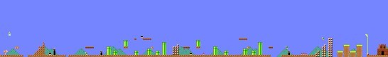

Сыграйте сами!

Если у вас есть Super Mario Maker, вы можете сыграть в этот уровень [здесь](https://supermariomakerbookmark.nintendo.net/courses/4AC9-0000-0157-F3C3) или с помощью кода [4AC9–0000–0157-F3C3](https://supermariomakerbookmark.nintendo.net/courses/4AC9-0000-0157-F3C3).

## Игрушки против приложений для реального мира

Алгоритм рекуррентной нейронной сети, который мы использовали для обучения нашей модели – это тот же алгоритмом, который реальные компании используют для решения таких сложных задач, как распознавание речи и языковой перевод. То, что делает нашу модель игрушечной, а не ультрасовременной, заключается в том, что наша модель генерируется из очень маленького набора данных. В оригинальной игре Super Mario Brothers не хватает уровней, чтобы предоставить достаточно данных для действительно хорошей модели.

Если бы мы могли получить доступ к сотням тысяч созданных пользователем уровней Super Mario Maker, которые есть у Nintendo, мы могли бы создать потрясающую модель. Но мы этого не можем, потому что Nintendo не позволит нам их получить. Крупные компании не передают свои данные бесплатно.

Поскольку машинное обучение становится более важным о многих отраслях промышленности, разница между хорошей программой и плохой программой будет заключаться в том, сколько данных у вас есть для обучения своих моделей. Именно поэтому такие компании, как Google и Facebook, так нуждаются в ваших данных!

Например, недавно компания Google открыла [TensorFlow](https://www.tensorflow.org/) из своего программного инструментария для создания крупномасштабных приложений машинного обучения. Это довольно серьезное событие, ведь Google бесплатно раздает такие важные технологии. Это то же самое, что и Google Translate.

Но без гигантвкого массива данных Google на всех языках вы не можете создать конкурента Google Translate. Данные – вот что дает Google преимущество. Подумайте об этом, когда в следующий раз откроете [историю местоположений на картах Google](https://maps.google.com/locationhistory/b/0) или [историю местоположений Facebook](https://www.facebook.com/help/1026190460827516) и обратите внимание, что она хранит все места, где вы когда-либо были.

## Дальшейшее чтение

В машинном обучении никогда не существует единого способа решения проблемы. У вас есть неограниченные возможности при выборе способа предварительной обработки данных и алгоритмов их использования. Часто [сочетание нескольких подходов](https://en.wikipedia.org/wiki/Ensemble_learning) даст вам лучшие результаты, чем какой-либо один подход.

Читатели прислали мне ссылки на другие интересные подходы к созданию уровней Super Mario:

*   Команда [Amy K. Hoover](http://amykhoover.com/) использовала подход, который [представляет каждый тип объекта уровня (трубы, земля, платформы и т. д.), как если бы это был отдельный голос в общей симфонии](http://julian.togelius.com/Hoover2015Composing.pdf). Используя процесс, называемый “функциональные леса” (_functional scaffolding_), система может увеличивать уровни с помощью блоков любого типа. Например, вы можете набросать основную форму уровня, и он может добавить в трубы и блоки вопросов, чтобы завершить ваш проект.
*   Команда [Steve Dahlskog](http://forskning.mah.se/en/id/tsstda) показала, что моделирование каждого столбца данных уровня в виде серии «слов» из n-грамм [позволяет создавать уровни гораздо более простым алгоритмом](http://julian.togelius.com/Dahlskog2014Linear.pdf), чем большая RNN.