Машинное обучение это весело! Часть 3

_Часть цикла статей [Adam Geitgey](https://medium.com/@ageitgey?source=post_header_lockup) – “Машинное обучение это весело!”: [ч.1](https://algotravelling.com/ru/%D0%BC%D0%B0%D1%88%D0%B8%D0%BD%D0%BD%D0%BE%D0%B5-%D0%BE%D0%B1%D1%83%D1%87%D0%B5%D0%BD%D0%B8%D0%B5-%D1%8D%D1%82%D0%BE-%D0%B2%D0%B5%D1%81%D0%B5%D0%BB%D0%BE-1/), [ч.2](https://algotravelling.com/ru/%D0%BC%D0%B0%D1%88%D0%B8%D0%BD%D0%BD%D0%BE%D0%B5-%D0%BE%D0%B1%D1%83%D1%87%D0%B5%D0%BD%D0%B8%D0%B5-%D1%8D%D1%82%D0%BE-%D0%B2%D0%B5%D1%81%D0%B5%D0%BB%D0%BE-2/), [ч.3](https://algotravelling.com/ru/%D0%BC%D0%B0%D1%88%D0%B8%D0%BD%D0%BD%D0%BE%D0%B5-%D0%BE%D0%B1%D1%83%D1%87%D0%B5%D0%BD%D0%B8%D0%B5-%D1%8D%D1%82%D0%BE-%D0%B2%D0%B5%D1%81%D0%B5%D0%BB%D0%BE-3/), [ч.4](https://algotravelling.com/ru/%D0%BC%D0%B0%D1%88%D0%B8%D0%BD%D0%BD%D0%BE%D0%B5-%D0%BE%D0%B1%D1%83%D1%87%D0%B5%D0%BD%D0%B8%D0%B5-%D1%8D%D1%82%D0%BE-%D0%B2%D0%B5%D1%81%D0%B5%D0%BB%D0%BE-4/), [ч.5](https://algotravelling.com/ru/%D0%BC%D0%B0%D1%88%D0%B8%D0%BD%D0%BD%D0%BE%D0%B5-%D0%BE%D0%B1%D1%83%D1%87%D0%B5%D0%BD%D0%B8%D0%B5-%D1%8D%D1%82%D0%BE-%D0%B2%D0%B5%D1%81%D0%B5%D0%BB%D0%BE-5/), [ч.6](https://algotravelling.com/ru/%D0%BC%D0%B0%D1%88%D0%B8%D0%BD%D0%BD%D0%BE%D0%B5-%D0%BE%D0%B1%D1%83%D1%87%D0%B5%D0%BD%D0%B8%D0%B5-%D1%8D%D1%82%D0%BE-%D0%B2%D0%B5%D1%81%D0%B5%D0%BB%D0%BE-6/), [ч.7](https://algotravelling.com/ru/%D0%BC%D0%B0%D1%88%D0%B8%D0%BD%D0%BD%D0%BE%D0%B5-%D0%BE%D0%B1%D1%83%D1%87%D0%B5%D0%BD%D0%B8%D0%B5-%D1%8D%D1%82%D0%BE-%D0%B2%D0%B5%D1%81%D0%B5%D0%BB%D0%BE-7/), [ч.8](https://algotravelling.com/ru/%D0%BC%D0%B0%D1%88%D0%B8%D0%BD%D0%BD%D0%BE%D0%B5-%D0%BE%D0%B1%D1%83%D1%87%D0%B5%D0%BD%D0%B8%D0%B5-%D1%8D%D1%82%D0%BE-%D0%B2%D0%B5%D1%81%D0%B5%D0%BB%D0%BE-8/)._

* * *

## Глубокое обучение и сверточные нейронные сети

Вы устали читать бесконечные новости о **глубоком обучении** (_deep learning_) и не знаете, что это такое? Давайте изменим это!

На этот раз мы научимся писать программы, распознающие объекты в изображениях с помощью глубокого обучения. Другими словами, мы объясним черную магию, позволяющую Google Photo искать ваши фотографии по описанию:

Так же как в [первой](https://algotravelling.com/ru/%D0%BC%D0%B0%D1%88%D0%B8%D0%BD%D0%BD%D0%BE%D0%B5-%D0%BE%D0%B1%D1%83%D1%87%D0%B5%D0%BD%D0%B8%D0%B5-%D1%8D%D1%82%D0%BE-%D0%B2%D0%B5%D1%81%D0%B5%D0%BB%D0%BE-1/) и [второй](https://algotravelling.com/ru/%D0%BC%D0%B0%D1%88%D0%B8%D0%BD%D0%BD%D0%BE%D0%B5-%D0%BE%D0%B1%D1%83%D1%87%D0%B5%D0%BD%D0%B8%D0%B5-%D1%8D%D1%82%D0%BE-%D0%B2%D0%B5%D1%81%D0%B5%D0%BB%D0%BE-2/) частях, это руководство предназначено для всех, кто интересуется машинным обучением, но не знает, с чего начать. Содержание статей рассчитано на широкую аудиторию и будет достаточно поверхностным. Но разве это кого-то волнует? Чем больше людей заинтересуются машинным обучением, тем лучше.

_(Если вы еще не прочитали _[_первую_](https://algotravelling.com/ru/%D0%BC%D0%B0%D1%88%D0%B8%D0%BD%D0%BD%D0%BE%D0%B5-%D0%BE%D0%B1%D1%83%D1%87%D0%B5%D0%BD%D0%B8%D0%B5-%D1%8D%D1%82%D0%BE-%D0%B2%D0%B5%D1%81%D0%B5%D0%BB%D0%BE-1/)_ и __[вторую](https://algotravelling.com/ru/%D0%BC%D0%B0%D1%88%D0%B8%D0%BD%D0%BD%D0%BE%D0%B5-%D0%BE%D0%B1%D1%83%D1%87%D0%B5%D0%BD%D0%B8%D0%B5-%D1%8D%D1%82%D0%BE-%D0%B2%D0%B5%D1%81%D0%B5%D0%BB%D0%BE-2/) части__, то сделайте это сейчас!)_

## Распознавание объектов с помощью глубокого обучения

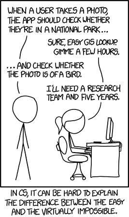

Возможно, вы уже видели этот [знаменитый комикс xkcd](http://xkcd.com/1425/). Шутка в том, что любой 3-летний ребенок может распознать фотографию птицы, но заставить это сделать компьютер заняло у самых лучших компьютерных специалистов более 50 лет.В последние несколько лет мы наконец-то нашли хороший подход к распознаванию объектов с использованием _глубоких сверточных нейронных сетей_. Это звучит как куча выдуманных слов из фантастического романа Уильяма Гибсона, но все станет понятным, когда мы разберем их по очереди.Итак, давайте же сделаем это – напишем программу, распознающую птиц!

## Начнем с простого

Прежде чем научиться распознавать изображения птиц, давайте узнаем, как распознать что-то гораздо более простое – рукописную цифру «8».

Во [второй части](https://algotravelling.com/ru/%D0%BC%D0%B0%D1%88%D0%B8%D0%BD%D0%BD%D0%BE%D0%B5-%D0%BE%D0%B1%D1%83%D1%87%D0%B5%D0%BD%D0%B8%D0%B5-%D1%8D%D1%82%D0%BE-%D0%B2%D0%B5%D1%81%D0%B5%D0%BB%D0%BE-2/) мы узнали о том, как нейронные сети могут решать сложные задачи, объединяя множество простых нейронов. Мы создали небольшую нейронную сеть, чтобы оценить стоимость дома, исходя из того, сколько у него спален, насколько он большой и в каком районе находится:

Мы также знаем, что идея машинного обучения заключается в том, что одни и те же общие алгоритмы могут быть повторно использованы с разными данными для решения различных задач. Поэтому давайте модифицируем нашу нейронную сеть, чтобы научиться распознавать рукописный текст. Чтобы упростить задачу, мы попытаемся распознать только один символ – цифру «8».

Машинное обучение работает только тогда, когда у вас есть данные – желательно много данных. Поэтому нам нужно много-много рукописных «8», чтобы начать. К счастью, для этой цели исследователи создали набор данных [MNIST рукописных чисел](http://yann.lecun.com/exdb/mnist/). MNIST представляет собой 60 000 изображений рукописных цифр, каждое из которых является картинкой 18х18. Вот несколько примеров цифры “8” из этого набора данных:

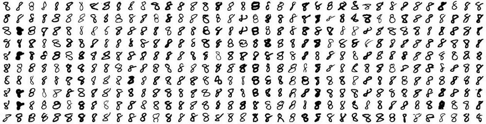

### Если задуматься, то все на свете – это числа

Нейронная сеть, которую мы создали во [второй части](https://algotravelling.com/ru/%D0%BC%D0%B0%D1%88%D0%B8%D0%BD%D0%BD%D0%BE%D0%B5-%D0%BE%D0%B1%D1%83%D1%87%D0%B5%D0%BD%D0%B8%D0%B5-%D1%8D%D1%82%D0%BE-%D0%B2%D0%B5%D1%81%D0%B5%D0%BB%D0%BE-2/), в качестве входных данных принимала только три числа («3» спальни, «2000» квадратных футов и т.д.). Но теперь мы хотим обрабатывать изображения с нашей нейронной сетью. Как же мы засунем изображение в нейронную сеть вместо просто чисел?

Ответ невероятно прост. Нейронная сеть принимает только числа в качестве входных данных. А для компьютера изображение и есть набор чисел, показывающих, насколько темным является каждый пиксель:

Чтобы передать изображение в нашу нейронную сеть, мы просто считаем изображение размером 18×18 пикселей массивом из 324 чисел:

Чтобы обработать 324 входных параметра,  мы создаем в нашей сети 324 нейрона:

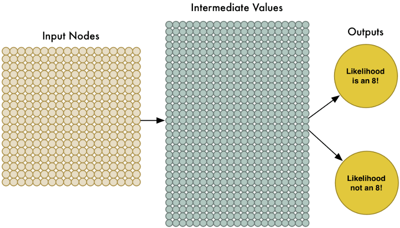

Обратите внимание, что наша нейронная сеть имеет два выходных результата, а не один. Первый результат будет предсказывать вероятность того, что изображение является цифрой «8», и второй  будет предсказывать вероятность того, что это не цифра «8». Имея отдельный вывод для каждого типа объектов, которые мы хотим распознать, мы можем использовать нейронную сеть для классификации объектов по группам.

Наша нейронная сеть намного больше, чем в прошлый раз (324 нейрона вместо 3!). Но любой современный компьютер может обрабатывать нейронную сеть с несколькими сотнями узлов в мгновение ока. Даже ваш мобильный телефон справится с этой задачей.

Осталось только обучить нейронную сеть изображениями цифры «8» и не цифры «8», чтобы научиться отличать их друг от друга. Когда мы будем подавать в сеть цифру «8», мы положим вероятность того, что это «8» равной 100%, а вероятность того, что это не «8», равной 0%. И наоборот.

Вот некоторые из наших обучающих данных:

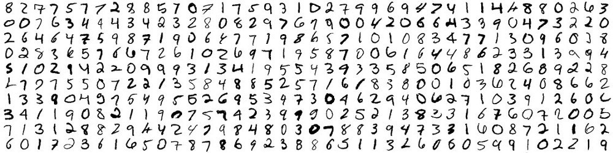

Мы можем обучить такую нейронную сеть за несколько минут на современном ноутбуке. В итоге у нас будет нейронная сеть, которая может распознавать изображения цирфы «8» с довольно высокой точностью. Добро пожаловать в мир распознавания изображений конца 1980-х!

## Туннельное зрение

Это действительно здорово, что идея просто подавать пиксели в нейронную сеть сработала для распознавания изображений! Машинное обучение – это волшебство! …_правильно_?

_Ну, конечно же, все не так просто._

Для начала, хорошая новость заключается в том, что наш распознаватель «8» действительно хорошо работает на простых изображениях, где цифра находится прямо в середине изображения:

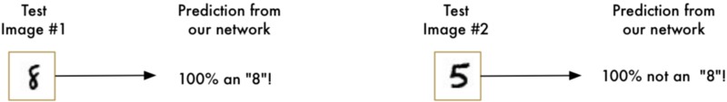

Но теперь плохие новости:

Наш распознаватель «8» _совсем не работает_, если цифра находится не в центре изображения. Малейшее изменение позиции сразу же все портит:

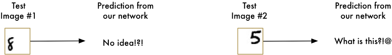

Это потому, что наша нейронная сеть обучилась только на идеально центрированной «8». Она совершенно не знает, что такое «8» не в центре. Сеть распознала один и только один шаблон.

Это не очень полезно в реальном мире. Проблемы реального мира никогда не бывают чистыми и простыми. Поэтому нам нужно понять, как заставить нашу нейронную сеть работать в тех случаях, когда «8» не находится в центре

### Брутфорс идея #1: Поиск с помощью скользящего окна

Мы уже создали действительно хорошую программу для нахождения «8», когда она находится в центре изображения. Что, если мы просканируем все части изображения небольшого размера на наличие цифры «8», пока не найдем ее?

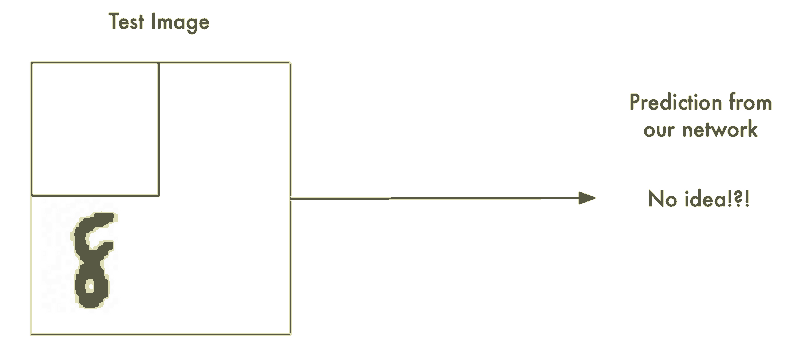

Такой подход называется скользящим окном. Это брутфорс решение (полным перебором). Он хорошо работает в некоторых ограниченных случаях, но очень неэффективно. Мы должны проверять одно и то же изображение снова и снова, ища объекты разного размера. Мы можем придумать решение получше, чем это!

### Брутфорс идея #2: Больше данных для глубокой нейронной сети

Когда мы тренировали нашу сеть, мы показали ей только «8», которые были идеально отцентрированы. А что, если мы обучим ее большим количеством данных, включая «8» всех размеров и во всех положениях на картинке?

Нам даже не нужно собирать новые данные для обучения. Мы можем просто написать скрипт для генерации новых изображений с «8» во всех видах различных позиций на картинке:

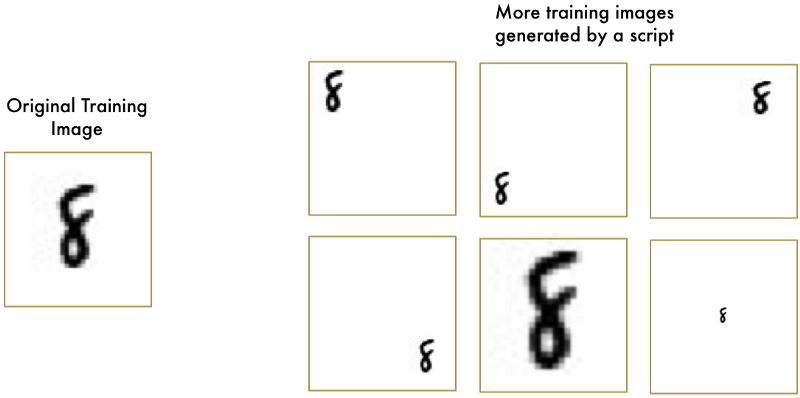

Используя эту технику, мы можем легко создавать бесконечные запасы данных для обучения.

Увеличение количества данных усложняет задачу для нашей нейронной сети, но мы можем компенсировать это, увеличив саму сеть и, таким образом, получить более сложные паттерны.

Чтобы сделать сеть больше, мы просто добавим новых слоев:

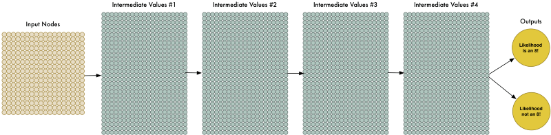

Мы назовем это «глубокой нейронной сетью», потому что она имеет больше слоев, чем традиционная нейронная сеть.

Эта идея существует с конца 1960-х годов. Но до недавнего времени обучение такой большой нейронной сети было слишком медленным, чтобы быть полезным. Но как только мы поняли, как использовать видеокарты с 3D-графикой (которые были разработаны для очень быстрого умножения матриц) вместо обычных компьютерных процессоров, работа с крупными нейронными сетями вдруг стала практичной. Фактически, такая же видеокарта NVIDIA GeForce GTX 1080, которую вы используете, чтобы играть в [Overwatch](https://ru.wikipedia.org/wiki/Overwatch), может быть использована для невероятно быстрого обучения нейронных сетей.

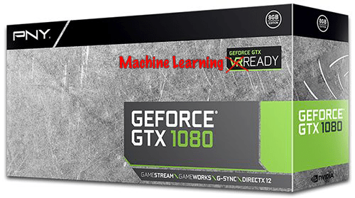

Но даже несмотря на то, что мы можем сделать нашу нейронную сеть действительно большой и быстро обучить ее с помощью видеокарт с 3D-графикой, это все равно не поможет нам найти решение. Нам нужно быть более умными в том, как мы обрабатываем изображения нашей нейронной сети.

Подумайте об этом. Не имеет смысла обучать сеть распознавать «8» вверху изображения отдельно от распознавания «8» внизу изображения, как если бы это были два совершенно разных объекта.

Должен быть какой-то способ сделать нейронную сеть достаточно умной, чтобы она знала без дополнительного обучения, что «8» где-либо на картинке – это один и тот же объект. К счастью … такой способ есть!

## Ответ в свертке

Как человек, вы интуитивно знаете, что изображения имеют _иерархию_ или _концептуальную структуру_. Рассмотрим эту картинку:

Будучи человеком, вы сразу поймете иерархию этой картинки:

*   Земля покрыта травой и бетоном
*   На картинке присутствует ребенок
*   Ребенок сидит на лошадке
*   Надувная лошадь стоит на траве

Самое главное, что мы узнаем образ _ребенка_ независимо от того, на какой поверхности он находится. Нам не нужно заново учиться узнавать образ _ребенка_ для каждой новой поверхности.

Но сейчас наша нейронная сеть не может этого сделать. Она думает, что «8» в новой части изображения – это совсем другая вещь. Она не понимает, что перемещение объекта по изображению не делает его чем-то другим. Это означает, что она должна учиться идентифицировать каждый объект в любой возможной позиции. Это плохо.

Нам нужно дать нашей нейронной сети понимание _трансляционной инвариантности (_translation invariance _)_ – «8» – это «8» независимо от того, где на картинке она находится.

Мы сделаем это, используя процесс под названием _свертка_ (_convolution_). Идея свертки идет частично из компьютеров, а также из биологии (безумные ученые буквально тыкают мозги кошек странными приборами, чтобы выяснить, как кошки обрабатывают изображения).

## Как работает свертка

Вместо того, чтобы подавать целые изображения в нашу нейронную сеть в виде одной сетки чисел, мы используем идею, что объект является одним и тем же независимо от того, где он расположен на картинке.

Вот как это будет работать, шаг за шагом —

### Шаг 1: Разбиваем изображение на перекрывающиеся участки

Подобно поиску с помощью скользящего окна выше, давайте разобьем изображение на отдельные пересекающиеся фрагменты:

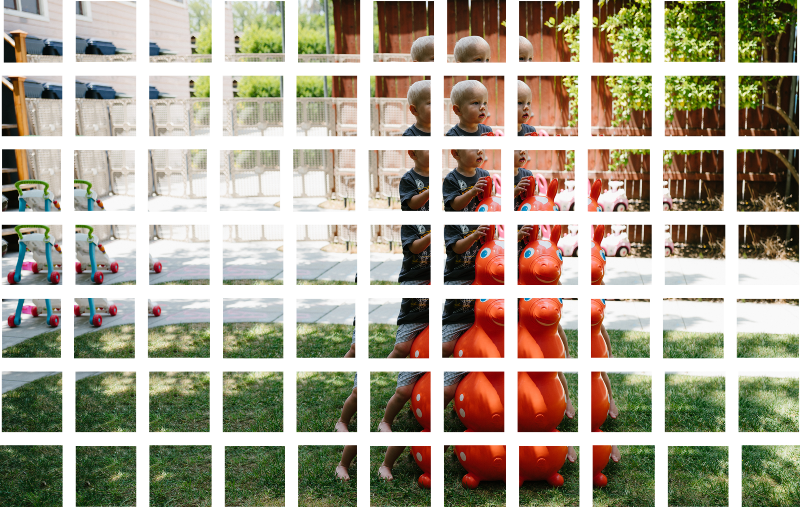

Сделав это, мы превратим наше исходное изображение в 77 одинаковых крошечных фрагментов изображения.

### Шаг 2: Скармливаем каждый участок изображения маленькой нейронной сети

Раньше мы подавали одно изображение в нейронную сеть, чтобы увидеть, было ли это «8». Здесь мы сделаем то же самое, но для каждого отдельного участка изображения:

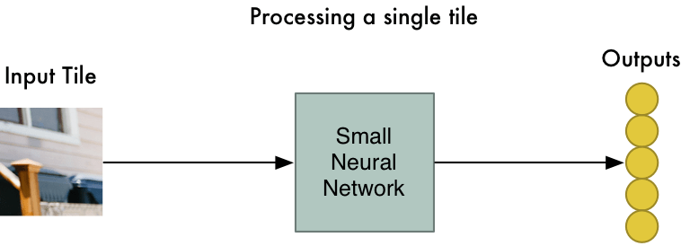

Тем не менее, есть **один нюанс**: мы будем хранить **одинаковые веса нейронной сети** для каждого отдельного участка исходного изображения. Другими словами, мы обрабатываем каждый фрагмент изображения одинаково. Если что-то интересное появляется в каком-то участке, мы отмечаем его как интересный.

### Шаг 3: Сохраняем результаты для каждого участка изображения в новый массив

Мы не хотим потерять информацию о взаимном расположении исходных участков. Поэтому мы сохраняем результат обработки каждого участка в сетку в том же порядке, что и исходное изображение. Это выглядит так:

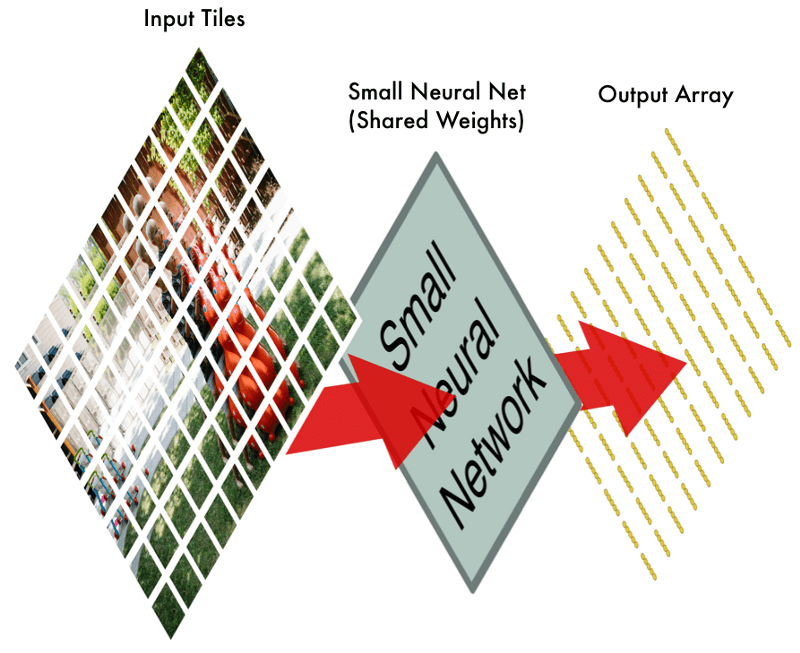

Другими словами, мы начали с большого изображения, и закончили немного меньшим массивом, который показывает, какие участки исходного изображения были самыми интересными.

### Шаг 4: Уменьшаем размерность

Результатом шага 3 был массив, который отражает, какие части исходного изображения являются самыми интересными. Но этот массив все еще довольно большой:

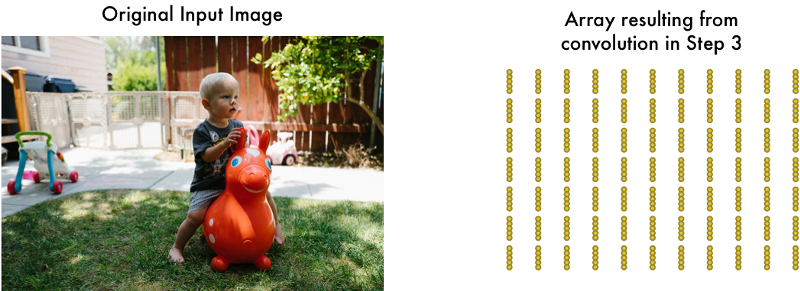

Чтобы уменьшить размер массива, мы _снижаем размерность (_downsample_)_ с помощью [пулинга](https://ru.wikipedia.org/wiki/%D0%A1%D0%B2%D1%91%D1%80%D1%82%D0%BE%D1%87%D0%BD%D0%B0%D1%8F_%D0%BD%D0%B5%D0%B9%D1%80%D0%BE%D0%BD%D0%BD%D0%B0%D1%8F_%D1%81%D0%B5%D1%82%D1%8C#.D0.9F.D1.83.D0.BB.D0.B8.D0.BD.D0.B3_.D0.B8.D0.BB.D0.B8_.D1.81.D0.BB.D0.BE.D0.B9_.D1.81.D1.83.D0.B1.D0.B4.D0.B8.D1.81.D0.BA.D1.80.D0.B5.D1.82.D0.B8.D0.B7.D0.B0.D1.86.D0.B8.D0.B8). Это звучит забавно, но на деле все просто!

Мы рассмотрим каждый квадрат массива размером 2×2 и сохраним наибольшее число из него:

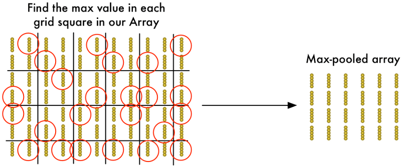

Идея здесь заключается в том, что если мы найдем что-то интересное в любом из четырех входных фрагментов, составляющих каждый квадрат размером 2×2, то в итоге оставим самый интересный бит. Это уменьшает размер нашего массива, сохраняя при этом самые важные биты.

### Последний шаг: Делаем прогноз

Мы уже уменьшили гигантское изображение до довольно небольшого массива.

Угадайте, что дальше? Этот массив – всего лишь набор чисел, поэтому мы можем использовать его в качестве входных данных в _другую нейронную сеть_. Эта последняя нейронная сеть решит, является или нет изображение тем, что нам нужно. Чтобы отличить этот шаг от этапа свертки, мы назовем его «полносвязной» (fully connected) сетью.

Таким образом, весь наш пятиступенчатый процесс от начала до конца выглядит следующим образом:

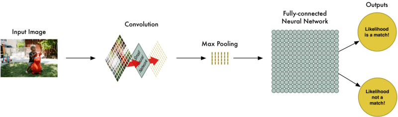

### Добавим еще больше шагов

Наш конвейер обработки изображений представляет собой последовательность шагов: свертку, пулинг и, наконец, полносвязную сеть.

Решая проблемы в реальном мире, эти шаги можно комбинировать и складывать столько раз, сколько захотите! Вы можете иметь два, три или даже десять уровней свертки. Вы можете использовать пулинг, где бы вы ни захотели уменьшить размерность ваших данных.

Основная идея состоит в том, чтобы начать с большого изображения и постоянно уменьшать его размерность, шаг за шагом, пока, наконец, вы не получите единственный результат. Чем больше шагов свертки вы имеете, тем более сложные функции ваша сеть сможет научиться распознавать.

Например, первый шаг свертки может научиться распознавать острые края, второй шаг свертки может распознавать клювы, используя его знания острых краев, третий шаг может распознать целых птиц, используя его знания о клювах и т. д.

Вот как выглядит более реалистичная глубокая сверточная сеть (из настоящей научной статьи):

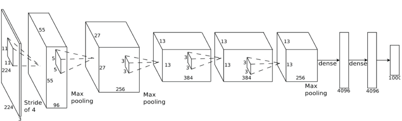

В этом случае они начинают с изображения размером 224 x 224 пикселя, применяют свертку и пулинг дважды, применяют свертку еще 3 раза, применяют пулинг и затем еще два полносвязнных слоя. В конце концов, изображение классифицируется в одну из 1000 категорий!

### Построение правильной сети

А как мы узнаем, какие слои необходимо объединить, чтобы сделать наш классификатор изображений эффективным?

Чтобы ответить на этот вопрос, нужно провести множество экспериментов и испытаний. Возможно, вам придется обучить 100 сетей, прежде чем вы найдете оптимальную структуру и параметры для решаемой задачи. Неотъемлемой частью машинного обучения является метод проб и ошибок!

## Построим собственный классификатор птиц

Теперь, наконец-то, мы знаем достаточно, чтобы написать программу, которая может решить, является ли изображение птицей или нет.

Как всегда, для начала нам нужны данные. В свободном доступе есть набор данных [CIFAR10](https://www.cs.toronto.edu/~kriz/cifar.html), содержащий 6000 снимков птиц и 52 000 снимков объектов, которые птицами не являются. Чтобы собрать еще больше данных, мы также добавим в него данные [Caltech-UCSD Birds-200-2011](http://www.vision.caltech.edu/visipedia/CUB-200-2011.html), которые содержат еще 12 000 снимков птиц.

Вот несколько птиц из нашего комбинированного набора данных:

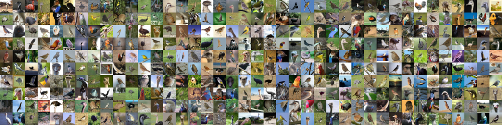

И вот некоторые из 52 000 изображений не птиц:

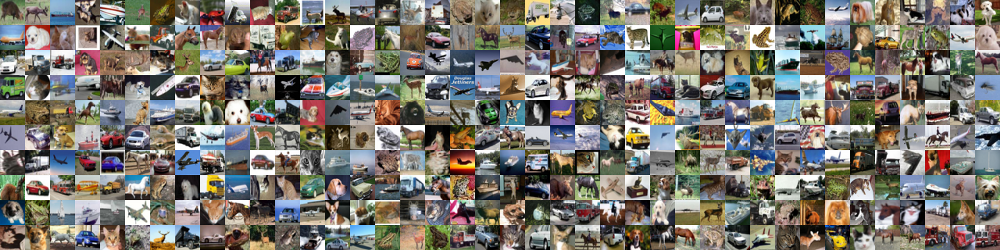

Этот набор данных будет отлично работать для наших целей, но 72 000 изображений с низким разрешением еще довольно мало для реальных приложений. Если вам нужна производительность на уровне Google, вам нужны миллионы больших изображений. В машинном обучении, иметь больше данных, почти всегда важнее, чем иметь лучшие алгоритмы. Теперь вы знаете, почему Google так счастлив предложить вам неограниченное хранилище фотографий. Им нужны ваши сладкие, сладкие данные!

Чтобы построить наш классификатор, мы будем использовать [TFLearn](http://tflearn.org/). TFlearn – это обертка вокруг библиотеки глубокого обучения Google [TensorFlow](https://www.tensorflow.org/), которая предоставляет упрощенный API. Это делает построение сверточных нейронных сетей таким же простым, как написание нескольких строк кода для определения слоев нашей сети.

Вот код для определения и обучения сети:

|     |     |
| --- | --- |
|     | # \-\*\- coding: utf-8 -*- |
|     | """ |
|     | Based on the tflearn example located here: |
|     | https://github.com/tflearn/tflearn/blob/master/examples/images/convnet_cifar10.py |
|     | """ |
|     | from \_\_future\_\_ import division, print\_function, absolute\_import |
|     | # Import tflearn and some helpers |
|     | import tflearn |
|     | from tflearn.data_utils import shuffle |
|     | from tflearn.layers.core import input\_data, dropout, fully\_connected |
|     | from tflearn.layers.conv import conv\_2d, max\_pool_2d |
|     | from tflearn.layers.estimator import regression |
|     | from tflearn.data_preprocessing import ImagePreprocessing |
|     | from tflearn.data_augmentation import ImageAugmentation |
|     | import pickle |
|     | # Load the data set |
|     | X, Y, X\_test, Y\_test = pickle.load(open("full_dataset.pkl", "rb")) |
|     | # Shuffle the data |
|     | X, Y = shuffle(X, Y) |
|     | # Make sure the data is normalized |
|     | img_prep = ImagePreprocessing() |
|     | img\_prep.add\_featurewise\_zero\_center() |
|     | img\_prep.add\_featurewise_stdnorm() |
|     | # Create extra synthetic training data by flipping, rotating and blurring the |
|     | # images on our data set. |
|     | img_aug = ImageAugmentation() |
|     | img\_aug.add\_random\_flip\_leftright() |
|     | img\_aug.add\_random_rotation(max_angle=25.) |
|     | img\_aug.add\_random_blur(sigma_max=3.) |
|     | # Define our network architecture: |
|     | # Input is a 32x32 image with 3 color channels (red, green and blue) |
|     | network = input_data(shape=\[None, 32, 32, 3\], |
|     | data_preprocessing=img_prep, |
|     | data_augmentation=img_aug) |
|     | # Step 1: Convolution |
|     | network = conv_2d(network, 32, 3, activation='relu') |
|     | # Step 2: Max pooling |
|     | network = max\_pool\_2d(network, 2) |
|     | # Step 3: Convolution again |
|     | network = conv_2d(network, 64, 3, activation='relu') |
|     | # Step 4: Convolution yet again |
|     | network = conv_2d(network, 64, 3, activation='relu') |
|     | # Step 5: Max pooling again |
|     | network = max\_pool\_2d(network, 2) |
|     | # Step 6: Fully-connected 512 node neural network |
|     | network = fully_connected(network, 512, activation='relu') |
|     | # Step 7: Dropout - throw away some data randomly during training to prevent over-fitting |
|     | network = dropout(network, 0.5) |
|     | # Step 8: Fully-connected neural network with two outputs (0=isn't a bird, 1=is a bird) to make the final prediction |
|     | network = fully_connected(network, 2, activation='softmax') |
|     | # Tell tflearn how we want to train the network |
|     | network = regression(network, optimizer='adam', |
|     | loss='categorical_crossentropy', |
|     | learning_rate=0.001) |
|     | # Wrap the network in a model object |
|     | model = tflearn.DNN(network, tensorboard_verbose=0, checkpoint_path='bird-classifier.tfl.ckpt') |
|     | # Train it! We'll do 100 training passes and monitor it as it goes. |
|     | model.fit(X, Y, n_epoch=100, shuffle=True, validation_set=(X\_test, Y\_test), |
|     | show_metric=True, batch_size=96, |
|     | snapshot_epoch=True, |
|     | run_id='bird-classifier') |
|     | # Save model when training is complete to a file |
|     | model.save("bird-classifier.tfl") |
|     | print("Network trained and saved as bird-classifier.tfl!") |

Если вы используете хорошую видеокарту с достаточным объемом оперативной памяти (например, Nvidia GeForce GTX 980 Ti или выше), обучение займет менее часа. Если же вы обучаете сеть с обычным процессором, это может занять намного больше времени.

По мере того, как сеть обучается, точность возрастает. После первого прохода я получил 75,4% точности. После всего 10 проходов, стало уже 91,7%. После 50 или около того, точность превысила 95,5%, и дополнительное обучение уже не помогало, поэтому я остановил как есть.

Поздравляю! Наша программа теперь может распознавать птиц в изображениях!

## Тестируем нашу сеть

Теперь, когда у нас есть обученная нейронная сеть, мы можем ее использовать! Вот [простой скрипт](https://gist.github.com/ageitgey/a40dded08e82e59724c70da23786bbf0), который получает на вход один файл изображения и прогнозирует, является он птицей или нет.

Но чтобы действительно увидеть, насколько эффективна наша сеть, нам нужно протестировать ее на большом количестве изображений. Созданный набор данных содержал 15 000 изображений для проверки. Когда я пускал эти 15 000 изображений в сеть, она предсказывала правильный ответ в 95% случаев.

Кажется, это очень хорошо, правда? Смотря как считать!

### Насколько точна 95% точность?

Наша сеть имеет точность 95%. Но дьявол в деталях. Это может означать разные вещи.

Например, что, если 5% наших тренировочных изображений были птицы, а остальные 95% не были птицами? Программа, которая угадывала «не птицу» каждый раз, была бы на 95% точна! Но это также было бы 100% бесполезно.

Нам нужно более внимательно посмотреть на цифры, нежели на общую точность. Чтобы судить о том, насколько хороша система классификации, нам нужно внимательно посмотреть, как именно она ошибалась, а не только процент времени, когда она ошибалась.

Вместо того, чтобы думать о наших прогнозах как «правильных» и «неправильных», давайте разобьем их на четыре категории:

*   Во-первых, вот некоторые из птиц, которые наша сеть правильно идентифицировала как птиц. Давайте назовем это истинными срабатываниями (**True Positives)**:

*   Во-вторых, вот изображения, которые наша сеть правильно идентифицировала как «не птица». Они называются истинные отрицания (**True Negatives):**

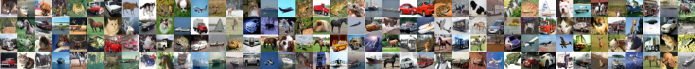

*   В-третьих, вот некоторые изображения, которые, как мы думали, были птицами, но на самом деле не были птицами. Это наши ложные срабатывания (**False Positives)**:

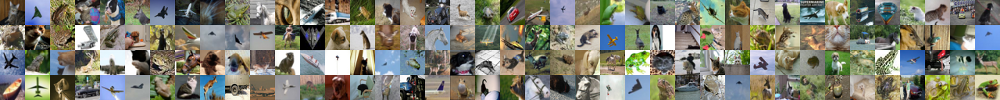

*   И, наконец, вот некоторые изображения птиц, которые мы неправильно распознавали как птиц. Это наши ложные отрицания (**False Negatives)**:

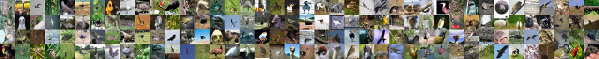

Используя наш проверочный набор из 15 000 изображений, вот сколько раз наши прогнозы попадали в каждую категорию:

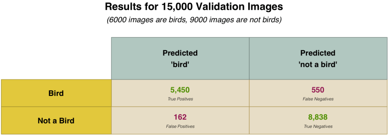

Почему мы так разбиваем наши результаты? Потому что не все ошибки созданы равными.

Представьте, если бы мы писали программу, чтобы обнаружить рак на изображении МРТ. Когда мы обнаруживаем рак, то лучше, чтобы были ложные срабатывания, а не ложные отрицания. Ложные отрицания это худший возможный случай – именно в этом случаем программа скажет кому-то, что у него определенно нет рака, а в действительности есть.

Вместо того, чтобы просто смотреть на общую точность, мы вычисляем показатели точности и чувствительности ([Precision and Recall](https://en.wikipedia.org/wiki/Precision_and_recall)). Эти метрики дают более четкое представление о том, насколько хорошо мы справились:

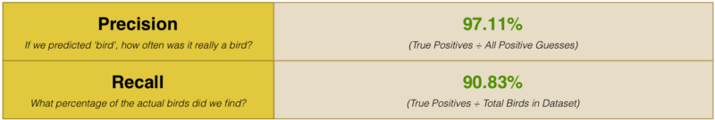

Таблица говорит нам о том, что в 97% случаев, когда мы угадывали «птицу», мы были правы! Но она также говорит нам, что мы обнаружили только 90% реальных птиц в наборе данных. Другими словами, мы можем не найти каждую птицу, но мы уверены в этом, когда найдем ее!

## Что делать дальше

Теперь, когда вы знаете основы глубоких сверточных сетей, вы можете попробовать некоторые из [примеров в пакете TFlearn](https://github.com/tflearn/tflearn/tree/master/examples#tflearn-examples), чтобы запачкать свои руки различными архитектурами нейронных сетей. TFlearn даже поставляется со встроенными наборами данных, поэтому вам не нужно искать собственные изображения.

Теперь вы также знаете достаточно, чтобы начать узнавать о других областях машинного обучения. Почему бы не научиться использовать [алгоритмы, которые обучают компьютеры, как играть в игры Atari](http://karpathy.github.io/2016/05/31/rl/)?