Машинное обучение это весело! Часть 4

### Распознавание лиц – шаг за шагом

Давайте займемся задачей по порядку, а точнее, пошагово. На каждом этапе мы разберемся с алгоритмом машинного обучения (для каждого этапа он будет разный). Я не буду разъяснять каждый алгоритм полностью, чтобы статья не превратилась в книгу. Вместо этого я изложу основные идеи, лежащие в основе каждого из них, а также вы узнаете, как создать свою собственную систему распознавания лиц на Python, используя [OpenFace](https://cmusatyalab.github.io/openface/) и [dlib](http://dlib.net/).

### Шаг 1\. Поиск всех лиц

На первом этапе нашего конвейера нужно _обнаружить лица_. Ясное дело, нам нужно найти лица на фотографии, прежде чем делать что-то еще.

Если вы в последние лет 10 пользовались какой-нибудь камерой, вы, вероятно, видели распознавание лиц в действии:

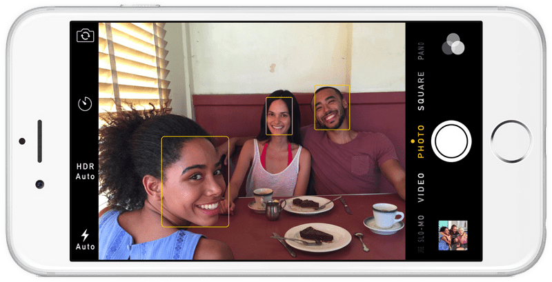

Распознавание лиц – это отличная функция для камер. Если камера может автоматически выделять лица, она может убедиться, что все лица были в фокусе, прежде чем делать снимок. Но мы будем использовать этот алгоритм для другой цели – нам нужно выделить области на изображении, которые мы передадим следующему шагу нашего конвейера.

Обнаружение лиц стало мейнстримом в начале 2000-х годов, когда Пол Виола (Paul Viola) и Майкл Джонс (Michael Jones) изобрели [способ обнаружения лиц](https://ru.wikipedia.org/wiki/%D0%9C%D0%B5%D1%82%D0%BE%D0%B4_%D0%92%D0%B8%D0%BE%D0%BB%D1%8B_%E2%80%94_%D0%94%D0%B6%D0%BE%D0%BD%D1%81%D0%B0), который был достаточно быстрым, чтобы работать на дешевых камерах. Однако сегодня существуют более надежные решения. Мы собираемся использовать [метод, изобретенный в 2005 году](http://lear.inrialpes.fr/people/triggs/pubs/Dalal-cvpr05.pdf) – гистограмма направленных градиентов (Histogram of Oriented Gradients) – или просто _**HOG**_, для краткости.

Чтобы найти лица на изображении, сперва сделаем наше изображение черно-белым, потому что для поиска лиц цветовые данные не нужны:

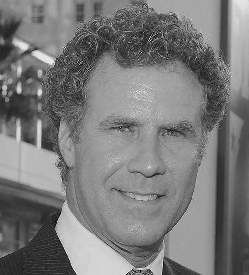

Затем мы рассмотрим каждый пиксель на нашем изображении, один за другим. Но интересует нас не столько сам пиксель, сколько пиксели, окружающие его:

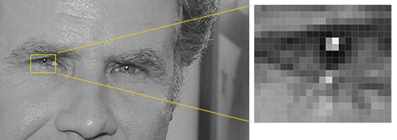

Наша цель – выяснить, насколько темным является текущий пиксель по сравнению с соседними. Затем мы рисуем стрелку, показывающую, в каком направлении изображение становится темнее:

Выполнив эту процедуру для **каждого отдельного пикселя** изображения, вы замените каждый пиксель стрелкой. Эти стрелки называются _градиентами_, и они показывают направление от светлых пикселей к темным по всему изображению:

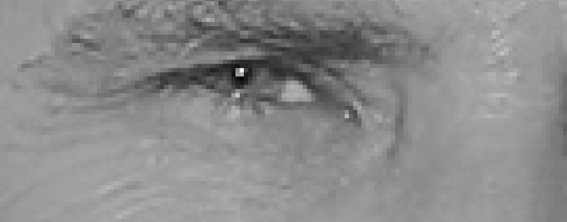

Может показаться, что этот метод выбран случайно, но на самом деле есть резонная причина заменять пиксели градиентами. Если мы проанализируем пиксели напрямую, то увидим, что темные изображения и светлые изображения одного и того же человека будут иметь совершенно разные значения яркости пикселей. Но, рассматривая только _направление_ изменения яркости, мы получим одинаковую картину независимо от яркости исходного изображения. Это значительно упрощает задачу!

Однако, сохранение градиента для каждого пикселя – это слишком много информации, и мы можем [не увидеть леса за деревьями](https://ru.wiktionary.org/wiki/%D0%BD%D0%B5_%D0%B2%D0%B8%D0%B4%D0%B5%D1%82%D1%8C_%D0%BB%D0%B5%D1%81%D0%B0_%D0%B7%D0%B0_%D0%B4%D0%B5%D1%80%D0%B5%D0%B2%D1%8C%D1%8F%D0%BC%D0%B8). Было бы лучше, если бы мы могли увидеть основное направление изменения света на более высоком уровне, получая таким образом общую канву изображения.

Для этого мы разделим изображение на маленькие квадраты размером 16x16 пикселей каждый. В каждом квадрате мы подсчитаем, сколько точек градиента повернуто в каждом из основных направлений (вверх, вверх, вправо, вправо и т. д.). Затем мы заменим этот квадрат на изображении стрелочками, направленными туда же, куда и большинство.

В конечном итоге мы преобразуем исходное изображение так, что ясно проглядывается базовая структура лица:

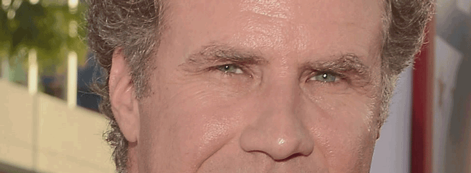

Чтобы найти лицо на HOG-изображении, все, что нам нужно сделать, – это найти часть нашего изображения, которая наиболее похожа на известный рисунок HOG, полученный из множества других лиц в ходе обучения:

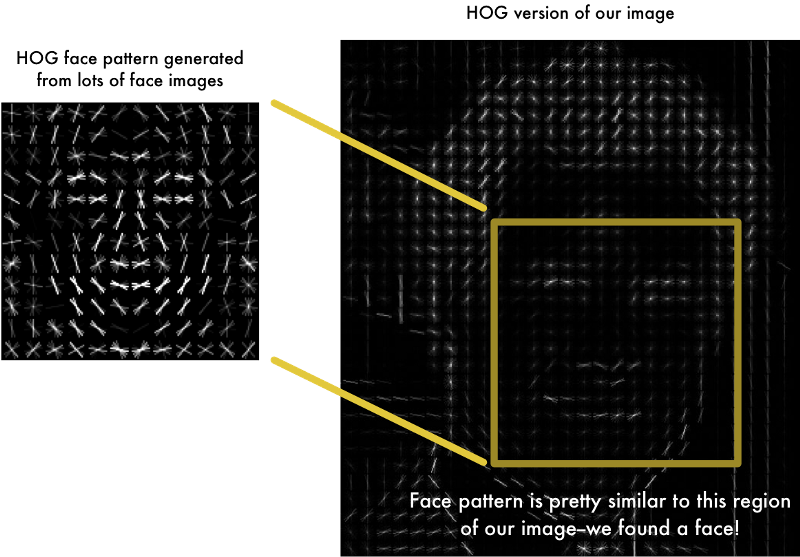

Используя этот метод, мы легко можем найти лица на любом изображении:

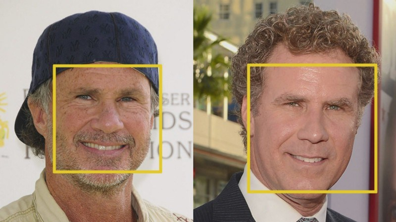

Если вы хотите попробовать сделать это самостоятельно, используя Python и dlib, то код, показывающий, как создавать и просматривать представления HOG-изображений, можно найти [здесь](https://gist.github.com/ageitgey/1c1cb1c60ace321868f7410d48c228e1).

### Шаг 2\. Расположение лиц

Так, лица найти удалось. Но теперь мы должны разобраться с проблемой, когда лица, повернутые в разные стороны, кажутся компьютеру разными лицами:

Для решения проблемы мы попытаемся преобразовать каждое изображение так, чтобы глаза и губы всегда находились в каком-то конкретном месте. Это упростит задачу сравнения лиц на следующих этапах.

Для этого мы будем использовать алгоритм под названием **о****ценка ориентиров лица** _(face landmark estimation)_. Есть много способов сделать это, но мы будем использовать метод, [изобретенный в 2014 году Вахидом Каземи (](http://www.csc.kth.se/~vahidk/papers/KazemiCVPR14.pdf)[Vahid Kazemi](http://www.csc.kth.se/~vahidk/papers/KazemiCVPR14.pdf)[) и Жозефиной Салливан (](http://www.csc.kth.se/~vahidk/papers/KazemiCVPR14.pdf)[Josephine Sullivan](http://www.csc.kth.se/~vahidk/papers/KazemiCVPR14.pdf)[)](http://www.csc.kth.se/~vahidk/papers/KazemiCVPR14.pdf).

Основная идея состоит в том, что мы отметим 68 особых точек (называемых _ориентирами_), которые существуют на каждом лице – верхняя часть подбородка, внешняя точка каждого глаза, внутренняя точка каждой брови и т. д. Затем мы обучим алгоритм машинного обучения находить эти 68 особых точек на любом лице:

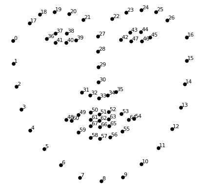

Вот результат размещения 68 ориентиров на нашем тестовом изображении:

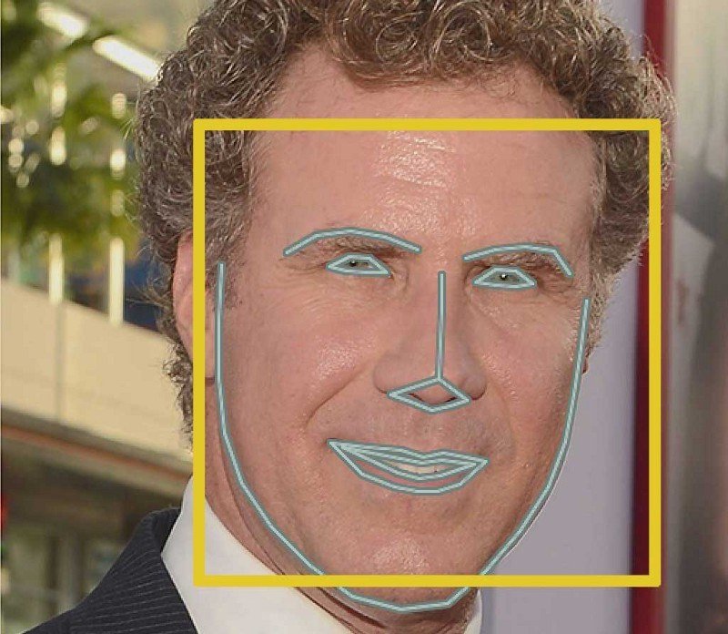

Теперь, когда мы знаем, где глаза и где рот, мы можем вращать, масштабировать и [сдвигать](https://en.wikipedia.org/wiki/Shear_mapping#/media/File:VerticalShear_m%3D1.25.svg) изображение так, чтобы глаза и рот были как можно лучше центрированы. При этом мы не будем делать никаких фантастических трехмерных искажений, так как это портит изображение. Мы будем использовать только базовые преобразования изображений, такие как поворот и масштабирование, которые сохраняют параллельные линии ([аффинные преобразования](https://ru.wikipedia.org/wiki/%D0%90%D1%84%D1%84%D0%B8%D0%BD%D0%BD%D0%BE%D0%B5_%D0%BF%D1%80%D0%B5%D0%BE%D0%B1%D1%80%D0%B0%D0%B7%D0%BE%D0%B2%D0%B0%D0%BD%D0%B8%D0%B5)):

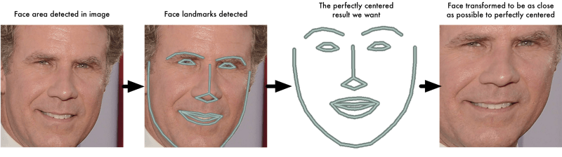

Теперь, независимо от того, как повернуто лицо, мы можем центрировать глаза и рот примерно в одно и то же положение на изображении. Это позволит сделать следующий этап более точным.

Если вы хотите попробовать сделать это самостоятельно, используя Python и dlib, то по ссылкам вы найдете [код для поиска ориентиров на лице](https://gist.github.com/ageitgey/ae340db3e493530d5e1f9c15292e5c74)и [код для преобразования изображения](https://gist.github.com/ageitgey/82d0ea0fdb56dc93cb9b716e7ceb364b) с использованием этих ориентиров.

### Шаг 3\. Кодирование лица

Теперь мы подходим к сути проблемы – как отличить одно лицо от другого. И здесь все становится действительно интересно!

Самый простой подход к распознаванию лица заключается в непосредственном сравнении неизвестного лица, которое мы обнаружили на шаге 2, со всеми изображениями людей, которые уже были отмечены ранее. Если мы находим ранее отмеченное лицо, которое очень похоже на распознаваемое лицо, то это наверняка один и тот же человек – разве не гениальная идея?

На самом деле нет. У этого подхода есть большая проблема. Такой сайт, как Facebook, на котором сидят миллиарды пользователей и триллионы фотографий, не может сравнивать все отмеченные ранее лица с каждым новым загруженным изображением – это займет слишком много времени, в то время как лица должны распознаваться за миллисекунды, а не за часы.

Значит нам нужен способ снять несколько основных измерений с каждого лица, которые мы могли бы сравнить с самыми близкими известными измерениями и найти самое похожее лицо. Например, мы можем измерить размер каждого уха, расстояние между глазами, длину носа и т. д. Если вы когда-либо смотрели криминальные телешоу, например, [CSI](https://ru.wikipedia.org/wiki/C.S.I.:_%D0%9C%D0%B5%D1%81%D1%82%D0%BE_%D0%BF%D1%80%D0%B5%D1%81%D1%82%D1%83%D0%BF%D0%BB%D0%B5%D0%BD%D0%B8%D1%8F), вы знаете, о чем я говорю:

### Самый надежный способ измерить лицо

Итак, какие измерения лиц нужны нам для пополнения известной базы данных? Размер ушей? Длина носа? Цвет глаз? Что-то другое?

Оказывается, что измерения, которые кажутся людям очевидными (например, цвет глаз), на самом деле не имеют смысла для компьютера, рассматривающего отдельные пиксели изображения. Исследователи показали, что самый точный подход – это позволить компьютеру самому измерить то, что ему нужно. Глубокое обучение, определяет, какие части лица нужно измерять, лучше, чем люди.

Решение заключается в создании сверточной нейронной сети глубокого обучения ([как и в части 3](https://algotravelling.com/ru/%D0%BC%D0%B0%D1%88%D0%B8%D0%BD%D0%BD%D0%BE%D0%B5-%D0%BE%D0%B1%D1%83%D1%87%D0%B5%D0%BD%D0%B8%D0%B5-%D1%8D%D1%82%D0%BE-%D0%B2%D0%B5%D1%81%D0%B5%D0%BB%D0%BE-3/)). Но вместо того, чтобы обучать сеть распознавать объекты на изображении, как мы делали в прошлый раз, мы научим ее создавать 128 измерений для каждого лица.

Во время обучения сети анализируется одновременно три лица:

1.  Обучающее изображение лица известного человека
2.  Другая фотография того же известного человека
3.  Изображение совершенно другого человека

Затем алгоритм просматривает измерения, которые он делает для каждого из этих трех изображений. Затем он немного настраивает нейронную сеть, чтобы удостовериться, что измерения, созданные для изображений #1 и #2, будут более похожи, а измерения для #2 и #3 – менее похожи:

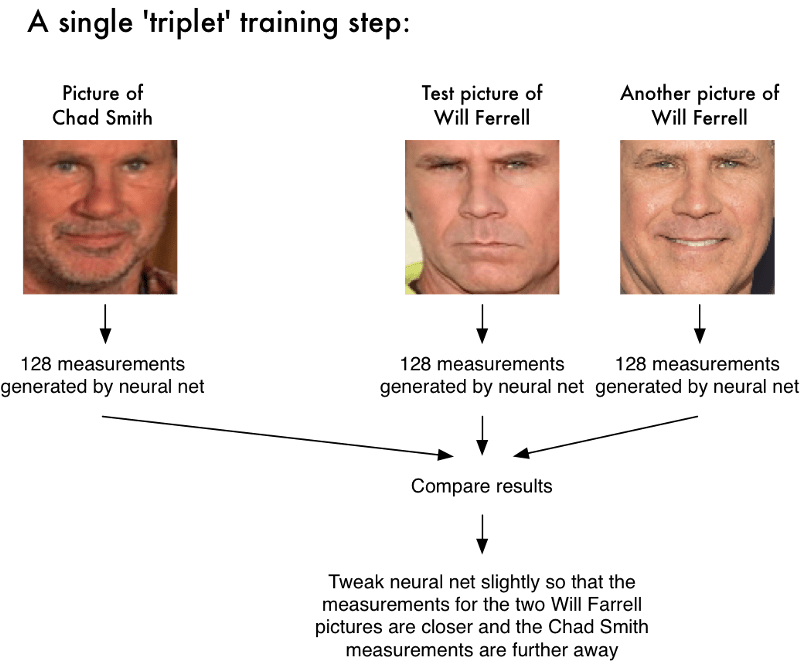

Повторив этот этап миллионы раз для миллионов изображений тысяч разных людей, нейронная сеть учится надежно создавать 128 измерений для каждого человека. Любые десять разных изображений одного и того же человека должны давать примерно одинаковые измерения.

Полученные 128 измерений каждого лица называют **картой**. Идея преобразования массива необработанных данных, например, изображения, в список генерируемых компьютером чисел крайне важна для машинного обучения (особенно для автоматизированного перевода). Тот подход к лицам, который мы используем, [был изобретен в 2015 году исследователями Google](http://www.cv-foundation.org/openaccess/content_cvpr_2015/app/1A_089.pdf), но существует также много аналогичных подходов.

### Кодирование изображения лица

Этот процесс обучения сверточной нейронной сети для получения карты лиц требует большого количества данных и мощного компьютера. Даже при использовании дорогой [видеокарты NVidia Telsa](http://www.nvidia.com/object/tesla-supercomputing-solutions.html) требуется [24 часа](https://twitter.com/brandondamos/status/757959518433243136) непрерывного обучения, чтобы получить хорошую точность.

Но как только сеть будет обучена, она сможет генерировать измерения для любого лица, даже такого, которое видит впервые! Поэтому это нужно сделать всего один раз. К счастью для нас, ребята из [OpenFace](https://cmusatyalab.github.io/openface/) уже сделали это и опубликовали несколько обученных сетей, которые мы можем использовать. Спасибо, [Брэндону Амосу](http://bamos.github.io/) (_Brandon Amos_) и его команде!

Таким образом, нам остается только пропустить изображения лиц через готовую обученную сеть, чтобы получить 128 измерений для каждого лица. Ниже приведены результаты измерений для нашего тестового изображения:

А каким частям лица соответствуют эти 128 чисел? А мы и понятия не имеем. Но для нас это не имеет большого значения. Нас интересует только то, что сеть генерирует почти одинаковые числа по двум изображениям одного и того же человека.

Если вы хотите попробовать сделать этот шаг самостоятельно, OpenFace [предоставляет lua скрипт](https://github.com/cmusatyalab/openface/blob/master/batch-represent/batch-represent.lua), который генерирует карты всех изображений в папке и записывать их в файл csv. [Вот как его запустить](https://gist.github.com/ageitgey/ddbae3b209b6344a458fa41a3cf75719).

### Шаг 4: Поиск имени пользователя по кодировке

Последний этап, оказывается, самый простой во всем процессе. Все, что нам нужно сделать, это найти человека в нашей базе данных известных людей, измерения которого ближе всего к полученным нами.

Вы можете сделать это, используя любой базовый алгоритм классификации машинного обучения. И не нужны никакие модные штучки. Мы будем использовать простой линейный [классификатор SVM](https://ru.wikipedia.org/wiki/%D0%9C%D0%B5%D1%82%D0%BE%D0%B4_%D0%BE%D0%BF%D0%BE%D1%80%D0%BD%D1%8B%D1%85_%D0%B2%D0%B5%D0%BA%D1%82%D0%BE%D1%80%D0%BE%D0%B2) (_метод опорных векторов_), но подойдут и другие алгоритмы классификации.

Все, что нам нужно сделать, – это обучить классификатор, который будет брать измерения из проверяемого изображения, и скажет нам, какой известный нам человек больше всего похож на него. Запуск классификатора занимает миллисекунды, а на выходе – имя человека!

Итак, давайте опробуем нашу систему. Сперва я натренировал классификатор, используя около 20 фотографий Уилла Феррелла, Чада Смита и Джимми Фалона (_Jimmy Falon_):

Затем я запустил классификатор на каждом кадре знаменитого видео с [Уиллом Ферреллом и Чадом Смитом на YouTube](https://www.youtube.com/watch?v=EsWHyBOk2iQ), где они притворялись друг другом на шоу Джимми Фэллона:

Сработало! Обратите внимание, как хорошо это работает даже в разных положениях лиц – даже боком!

## Попробуйте самостоятельно

Повторим порядок действий:

1.  Кодирование изображения с использованием алгоритма HOG для создания упрощенной версии изображения. Используя это упрощенное изображение, найдите ту часть изображения, которая больше всего похожа на исходную HOG-кодировку лица.
2.  Определите положение лица, отметив основные ориентиры на нем. Как только вы найдете эти ориентиры, используйте их, чтобы преобразовать изображение и отцентровать глаза и рот.
3.  Пропустите изображение центрированного лица через нейронную сеть, которая умеет измерять черты лица. Сохраните эти 128 измерений.
4.  Сравнив измерения с теми, которые мы получили в прошлом, найдите наиболее похожего человека – это и есть наш клиент!

Теперь, когда вы знаете, как все это работает, ознакомьтесь с полной инструкцией о том, как запустить полный цикл распознавания лиц на вашем собственном компьютере:

**_UPDATE 9/4/2017:_** Вы можете выполнить [вот эти шаги](https://gist.github.com/ageitgey/63304fce6963cddec800afac5e3b065e#file-face-detection-system-example-md) с OpenFace. Однако, я выпустил новую библиотеку распознавания лиц на Python под названием [face_recognition](https://github.com/ageitgey/face_recognition#face-recognition), которая намного проще в установке и использовании. Поэтому я рекомендую сначала попробовать [face_recognition](https://github.com/ageitgey/face_recognition#face-recognition), и лишь потом двигаться дальше!

Более того, я собрал [предварительно сконфигурированную виртуальную машину с функциями face_recognition, OpenCV, TensorFlow и множеством других предустановленных инструментов глубинного обучения](https://medium.com/@ageitgey/try-deep-learning-in-python-now-with-a-fully-pre-configured-vm-1d97d4c3e9b). Вы можете легко загрузить и запустить эту машину на своем компьютере. Попробуйте ее, если не хотите устанавливать все эти библиотеки самостоятельно!