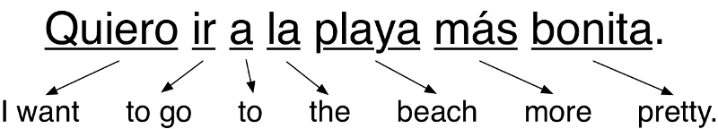
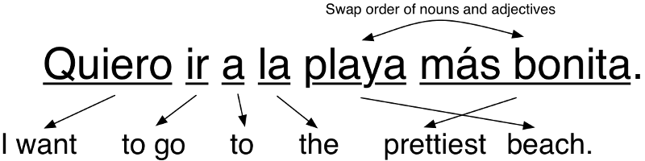
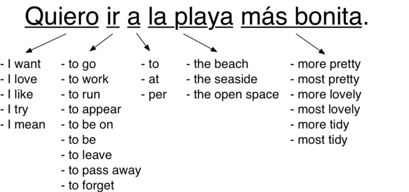
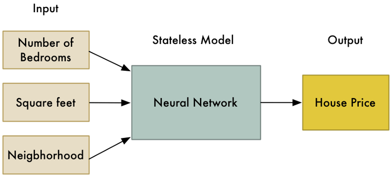
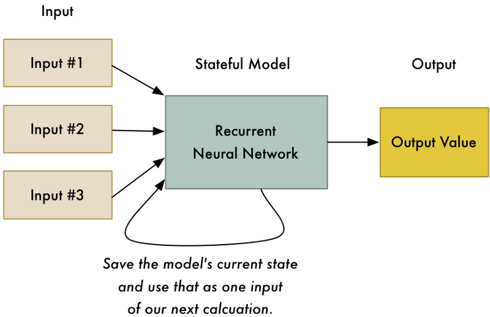
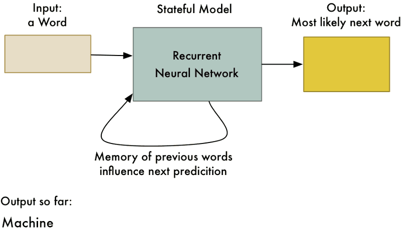
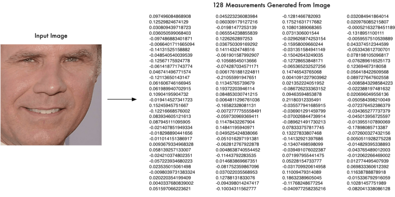
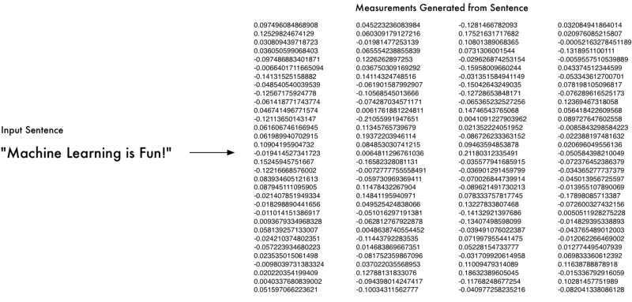
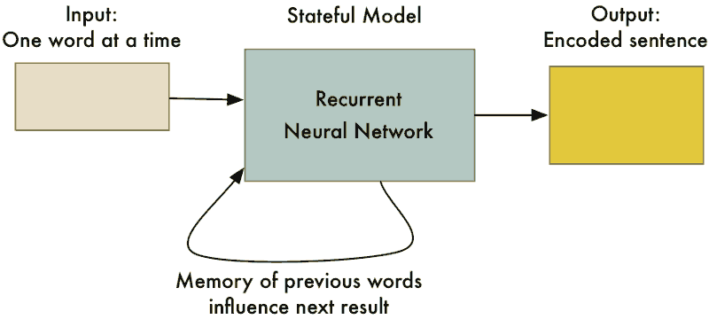

Машинное обучение это весело! Часть 5

## Заставляем компьютеры переводить

Итак, как заставить компьютер переводить с одного языка на другой?

Самый простой способ – это заменить каждое слово в предложении на переведенное слово на нужном языке. Вот простой пример перевода с испанского на английский по словам:

Это легко реализовать, потому что для этого нужен лишь словарь, в котором будет перевод каждого слова. Но результаты плохие, потому не учитывается ни грамматика, ни контекст.

Хорошо, мы можем сделать следующий шаг – начать добавлять правила языка, чтобы улучшить результаты. Например, вы можете переводить словосочетания как цельный фрагмент. Вы можете поменять местами существительные и прилагательные, поскольку в испанском языке они обычно идут в обратном порядке:

Сработало! Если мы будем продолжать добавлять новые правила, пока не переберем всю грамматику, наша программа сможет перевести любое предложение, так ведь?

Так работали самые ранние системы машинного перевода. Лингвисты придумали сложные правила, и их пришлось программировать одно за другим. Некоторые из самых умных лингвистов в мире на протяжении многих лет трудились во времена «холодной войны», [стремясь создать системы перевода, облегчающие понимание сообщений на русском](https://ru.wikipedia.org/wiki/%D0%94%D0%B6%D0%BE%D1%80%D0%B4%D0%B6%D1%82%D0%B0%D1%83%D0%BD%D1%81%D0%BA%D0%B8%D0%B9_%D1%8D%D0%BA%D1%81%D0%BF%D0%B5%D1%80%D0%B8%D0%BC%D0%B5%D0%BD%D1%82).

К сожалению, это работало только с простыми структурированными документами, такими как метеорологические отчеты. С реальными документами ничего не вышло.

Проблема в том, что человеческий язык не следует установленному набору правил. Человеческие языки полны особых случаев, территориальных жаргонов и просто нарушений правил. Наш язык сейчас больше зависит от того, [кто на кого напал пару-тройку сотен лет назад](https://ru.wikipedia.org/wiki/%D0%98%D1%81%D1%82%D0%BE%D1%80%D0%B8%D1%8F_%D0%B0%D0%BD%D0%B3%D0%BB%D0%B8%D0%B9%D1%81%D0%BA%D0%BE%D0%B3%D0%BE_%D1%8F%D0%B7%D1%8B%D0%BA%D0%B0#.D0.A1.D1.80.D0.B5.D0.B4.D0.BD.D0.B5.D0.B0.D0.BD.D0.B3.D0.BB.D0.B8.D0.B9.D1.81.D0.BA.D0.B8.D0.B9_.D1.8F.D0.B7.D1.8B.D0.BA), чем от того, кто сидит и придумывает грамматические правила

## Улучшение машинного перевода с помощью статистики

Когда системы, основанные на правилах, проявили свою несостоятельность, были разработаны новые подходы к переводу с использованием моделей, основанных на вероятностях и статистике, а не на грамматике.

Построение системы перевода на основе статистики требует большого количества обучающих данных, где один и тот же текст переводится как минимум на два языка. Этот дважды переведенный текст называется _параллельным корпусом_ (_parallel corpora_). Точно так же, как [Розеттский камень](https://ru.wikipedia.org/wiki/%D0%A0%D0%BE%D0%B7%D0%B5%D1%82%D1%82%D1%81%D0%BA%D0%B8%D0%B9_%D0%BA%D0%B0%D0%BC%D0%B5%D0%BD%D1%8C) в 1800-х годах помогал ученым переводить египетские иероглифы с греческого, компьютеры могут использовать параллельные корпуса, чтобы угадать, как преобразовывать текст с одного языка в другой.

К счастью, таких текстов довольно много, и они повсюду. Например, Европейский парламент переводит свои материалы на 21 язык. Поэтому исследователи часто используют [эти данные](http://www.statmt.org/europarl/) для создания систем перевода.

## Мышление в терминах вероятностей

Фундаментальное отличие статистических систем перевода заключается в том, что они не пытаются создать единственно точный перевод. Вместо этого они генерируют тысячи возможных переводов, а затем ранжируют эти переводы и выбирают наиболее вероятный. Они оценивают, насколько «правильна» та или иная фраза, сравнивая ее с обучающими данными. Вот как это работает:

### Шаг 1: Исходное предложение разбивается на куски

На первом шаге мы разбиваем наше предложение на простые фрагменты, которые могут быть легко переведены:

### Шаг 2\. Поиск всех возможных переводов для каждого фрагмента

Затем мы переводим каждый из этих фрагментов, находя в обучающих данных все способы, которыми люди переводили те же самые фрагменты.

Важно отметить, что мы не просто ищем эти фрагменты в простом словаре. Мы смотрим реальные переводы реальных людей. Это помогает нам найти все возможные переводы той или иной фразы в разных контекстах:

Некоторые из этих возможных переводов используются чаще других. Основываясь на том, как часто каждый перевод встречается в наших обучающих данных, мы можем дать ему оценку.

Например, чаще говорят, что «Quiero» означает «я хочу», а не «я стараюсь». Поэтому перевод «Quiero» как «я хочу» в наших обучающих данных имеет большую частоту и вес.

### Шаг 3: Генерация всех возможных предложений и поиск подходящего

Затем мы будем использовать все возможные комбинации этих фрагментов, чтобы создать множество возможных предложений.

Из фрагментов, которые мы перечислили в Шаге 2, мы можем сгенерировать около 2500 разных вариантов нашего предложения, комбинируя их по-разному. Вот несколько примеров:

> I love | to leave | at | the seaside | more tidy.  
> I mean | to be on | to | the open space | most lovely.  
> I like | to be |on | per the seaside | more lovely.  
> I mean | to go | to | the open space | most tidy.

В реальном мире вариантов было бы еще больше, так как учитывается также возможное изменение порядка слов:

> I try | to run | at | the prettiest | open space.  
> I want | to run | per | the more tidy | open space.  
> I mean | to forget | at | the tidiest | beach.  
> I try | to go | per | the more tidy | seaside.

Теперь нужно просмотреть все эти сгенерированные предложения и выбрать то, которое звучит более менее «по-человечески».

Чтобы сделать это, мы сравниваем каждое сгенерированное предложение с миллионами реальных предложений из книг и новостей, написанных на английском языке. Чем больше у нас будет текста на английском, тем лучше.

Взгляните на этот вариант перевода:

> I try | to leave | per | the most lovely | open space.

Скорее всего никто никогда не писал такое предложение на английском языке, поэтому оно не совпадет ни с чем в наших данных. Этот перевод будет иметь низкую вероятность.

Но посмотрите на этот возможный перевод:

> I want | to go | to | the prettiest | beach.

Это предложение будет похоже на что-то из наших обучающих данных, так что оно получит высокий показатель вероятности.

Попробовав все возможные предложения, мы выберем предложение, которое имеет наибольшую вероятность и в то же время наиболее похоже на реальные английские предложения.

Наш окончательный перевод будет «I want to go to the prettiest beach». Неплохо!

## Статистический машинный перевод был серьезным прорывом

Статистические системы машинного перевода работают намного лучше, чем системы на основе правил, если дать им достаточное количество обучающих данных. [Франц Йозеф Ох](https://en.wikipedia.org/wiki/Franz_Josef_Och) усовершенствовал эти идеи и использовал их для создания Google Translate в начале 2000-х годов. Машинный перевод стал доступен для всего мира.

В первые дни все удивлялись, что «наивный» подход к переводу на основе вероятности работал лучше, чем разработанные лингвистами системы, основанные на правилах. В этой связи можно вспомнить высказывание одного из исследователей 80-х годов:

> “Каждый раз, когда я увольняю лингвиста, моя точность повышается.” (“_Every time I fire a linguist, my accuracy goes up.” –_ шутка в слове _fire,_ которое переводится как “увольнять” и “стрелять”, прим. переводчика)

> — [Фредерик Йелинек](https://ru.wikipedia.org/wiki/%D0%99%D0%B5%D0%BB%D0%B8%D0%BD%D0%B5%D0%BA,_%D0%A4%D1%80%D0%B5%D0%B4%D0%B5%D1%80%D0%B8%D0%BA)

## Ограничения статистического машинного перевода

Статистические системы машинного перевода работают хорошо, но их сложно создавать и поддерживать. Каждая новая пара языков, которые вы хотите добавить, требует от экспертов настройки нового многоступенчатого конвейера перевода.

Поскольку создание такого конвейера невероятно сложно, нужно искать компромиссы. Если вы попросите Google перевести с грузинского на телугу, он сначала переведет фразу на английский, а потом уже на телугу, так как у него недостаточно данных для перевода в языковой паре «грузинский-телугу» напрямую. Кроме того, перевод выполнялся бы по более простой схеме, чем если бы вы попросили перевести с французского на английский.

Было бы здорово, если бы мы могли заставить компьютер делать за нас еще и разработку, неправда ли?

## Улучшение компьютерного перевода без участия дорогостоящих людей

Святой Грааль машинного перевода – это система «черного ящика», которая учится переводить самостоятельно, просто просматривая обучающие данные. А статистический машинный перевод все еще требует участия людей в создании и настройке многошаговых статистических моделей.

В 2014 году [команда KyungHyun Cho сделала прорыв](http://arxiv.org/abs/1406.1078). Она нашли способ применить глубокое обучение для создания системы «черного ящика». Их модель обучения принимает параллельный корпус и использует его, чтобы научиться переводить два языка без вмешательства человека.

Это становится возможным благодаря двум идеям – _рекуррентные нейронные сети (_recurrent neural networks_)_ и _кодировки (_encodings_)_. Грамотно комбинируя эти две идеи, мы можем создать самообучающуюся систему перевода.

## Рекуррентные нейронные сети

Мы уже [говорили о рекуррентных нейронных сетях в части 2](https://algotravelling.com/ru/%D0%BC%D0%B0%D1%88%D0%B8%D0%BD%D0%BD%D0%BE%D0%B5-%D0%BE%D0%B1%D1%83%D1%87%D0%B5%D0%BD%D0%B8%D0%B5-%D1%8D%D1%82%D0%BE-%D0%B2%D0%B5%D1%81%D0%B5%D0%BB%D0%BE-2/), но давайте кратко вспомним.

Обычная (нерекуррентная) нейронная сеть – это обобщенный алгоритм машинного обучения, который принимает список чисел и вычисляет результат (на основе предыдущего обучения). Нейронные сети могут использоваться в качестве «черного ящика» для решения множества проблем. Например, мы можем использовать нейронную сеть для расчета приблизительной стоимости дома на основе его параметров:

Но, как и большинство алгоритмов машинного обучения, нейросети не имеют _памяти_. Вы даете ей список чисел, и нейросеть подсчитывает результат. Если вы снова ввели те же числа, она снова даст тот же результат. Сеть не запоминает результаты прошлых вычислений. Иными словами, 2 + 2 всегда равняется 4.

_Рекуррентная нейронная сеть_ (сокращенно _RNN_ – _Recurrent Neural Network_) представляет собой немного измененную версию нейронной сети, где предыдущее состояние нейронной сети является одним из входов к следующему вычислению. Это означает, что предыдущие расчеты влияют на результаты будущих расчетов!

Ну и зачем нам это надо? Разве не должно 2 + 2 всегда быть равным 4 независимо от того, что мы вычисляли ранее?

Этот трюк позволяет нейронным сетям находить закономерности и шаблоны в последовательности данных. Например, вы можете использовать его, чтобы предсказать следующее наиболее вероятное слово в предложении, если знаете первые несколько слов:

RNN полезны тогда, когда вы хотите работать с шаблонами данных. Поскольку человеческий язык – всего лишь один большой, сложный шаблон, RNN все чаще используются во многих областях для обработки естественного языка.

Если вы хотите узнать больше о RNN, [вы можете прочитать часть 2](https://algotravelling.com/ru/%D0%BC%D0%B0%D1%88%D0%B8%D0%BD%D0%BD%D0%BE%D0%B5-%D0%BE%D0%B1%D1%83%D1%87%D0%B5%D0%BD%D0%B8%D0%B5-%D1%8D%D1%82%D0%BE-%D0%B2%D0%B5%D1%81%D0%B5%D0%BB%D0%BE-2/), где мы использовали ее для создания фальшивой книги Эрнеста Хемингуэя, а затем использовали другую сеть для создания новых уровней игры Super Mario Brothers.

## Кодировки

Другая идея, которую мы должны рассмотреть – это _кодировки_. [Мы говорили о кодировках в части 4](https://algotravelling.com/ru/%D0%BC%D0%B0%D1%88%D0%B8%D0%BD%D0%BD%D0%BE%D0%B5-%D0%BE%D0%B1%D1%83%D1%87%D0%B5%D0%BD%D0%B8%D0%B5-%D1%8D%D1%82%D0%BE-%D0%B2%D0%B5%D1%81%D0%B5%D0%BB%D0%BE-4/), посвященной распознаванию лиц. Чтобы объяснить кодировки, давайте немного отвлечемся в сторону различения людей с помощью компьютера.

Когда вы пытаетесь отличить два лица, вы собираете ряд измерений каждого из них и используете эти измерения для сравнения лиц. Например, мы могли бы измерить размер каждого уха или расстояние между глазами и сравнить эти измерения, чтобы увидеть, один это человек или два разных.

Вы, вероятно, уже видели подобное в детективных шоу типа CSI:

Идея превратить лицо в набор измерений является примером _кодирования_. Мы берем необработанные данные (изображение лица) и превращаем его в список измерений, которые его представляют (кодировка).

Но, как мы видели в [части 4](https://algotravelling.com/ru/%D0%BC%D0%B0%D1%88%D0%B8%D0%BD%D0%BD%D0%BE%D0%B5-%D0%BE%D0%B1%D1%83%D1%87%D0%B5%D0%BD%D0%B8%D0%B5-%D1%8D%D1%82%D0%BE-%D0%B2%D0%B5%D1%81%D0%B5%D0%BB%D0%BE-4/), нам не нужно придумывать конкретный список измерений. Вместо этого мы можем использовать нейросеть, которая сама определит, какие измерения ей снимать. Компьютер может работать лучше, чем мы, когда речь идет о выборе измеряемых параметров:

Это наша _кодировка_. Она позволяет нам представить что-то очень сложное (изображение лица) в простой форме (128 чисел). Теперь сравнение двух разных лиц становится намного проще, так как нам нужно сравнить лишь эти 128 чисел, а не тысячи пикселей.

Угадайте, что мы сделаем дальше? Правильно, мы можем сделать то же самое с предложениями! Мы можем придумать кодировку, которая представляет все возможные предложения в виде последовательности уникальных чисел:

Чтобы сгенерировать кодировку, мы будем давать RNN по одному слову за раз. После обработки последнего слова мы получим значение, соответствующее всему предложению:

Отлично, теперь у нас есть способ представить целое предложение как набор уникальных чисел! Мы не знаем, что означает каждый номер в кодировке, но это не имеет большого значения. Пока каждое предложение однозначно идентифицируется собственным набором чисел, нам не нужно точно знать, как эти числа были сгенерированы.

## Давайте переводить!

Итак, мы знаем, как использовать RNN для кодирования предложения в виде набора уникальных чисел. Как это нам поможет? Сейчас начнется все самое интересное!

Что, если мы возьмем две RNN и соединим их? Первая RNN может генерировать кодировку, представляющую предложение. Тогда вторая RNN могла бы принять эту кодировку и выполнить обратную операцию, декодировать исходное предложение:

Конечно, кодировать и снова декодировать исходное предложение не особо-то полезно. Но что, если (_барабанная дробь_!…) мы могли бы обучить вторую RNN декодировать предложение на испанском, а не на английском? Мы могли бы использовать наши _параллельные корпуса_, чтобы обучить ее этому:

Таким образом мы получим общий способ преобразования последовательности английских слов в эквивалентную последовательность испанских слов!

Это очень сильная идея:

*   Во-первых, этот подход ограничен лишь количеством обучающих данных и количеством вычислительной мощности, которую вы можете выделить на перевод. Исследователи машинного обучения изобрели этот метод всего **два года назад**, но такие системы уже работают лучше, чем статистические системы машинного перевода, на разработку которых ушло **20 лет**.
*   Во-вторых, система не зависит от знания каких-либо правил языка. Алгоритм сам определяет эти правила. Это означает, что вам не нужны эксперты, которые должны настраивать каждый шаг вашего конвейера переводов. Компьютер сделает это за вас.
*   И наконец, **этот подход работает практически для всех последовательных задач**! И оказывается, что задач таких немало. Читайте дальше, и узнаете еще больше крутых вещей!

Обратите внимание, что мы опустили некоторые проблемы, которые необходимо решить, чтобы запустить эту систему на реальных данных. Например, нам нужно решить проблему с различными длинами предложений ввода и вывода (см. [bucketing and padding](https://www.tensorflow.org/versions/r0.10/tutorials/seq2seq/index.html#bucketing-and-padding)). Также есть проблемы с [переводом редких слов](https://cs224d.stanford.edu/papers/addressing.pdf).

## Создание собственной системы перевода

Если вы хотите создать свою собственную систему перевода языков, то уже [есть рабочая система с использованием TensorFlow, которая переводит между английским и французским](https://www.tensorflow.org/versions/r0.10/tutorials/seq2seq/index.html). Однако, она не подходит для слабонервных или для тех, у кого ограниченные бюджеты. Эта технология все еще новая и очень ресурсоемкая. Даже если у вас быстрый компьютер с видеокартой высокого класса, для обучения вашей языковой системы перевода может потребоваться [около месяца](https://github.com/tensorflow/tensorflow/issues/600#issuecomment-226333266) непрерывной обработки данных.

Кроме того, _последовательные_ методы перевода языков развиваются настолько быстро, что очень трудно идти с ними в ногу. Многие последние фишки (например, добавление [механизма внимания](http://stanford.edu/~lmthang/data/papers/emnlp15_attn.pdf) или [отслеживания контекста](http://arxiv.org/abs/1607.00578)) значительно улучшают результаты, но эти изменения настолько новы, что про них даже еще не написано в Википедии. Если вы хотите сделать что-то серьезное с помощью _последовательного обучения_, вам нужно будет подхватывать новые разработки по мере их возникновения.

## Удивительная мощь последовательных моделей

Итак, что еще мы можем сделать с такими моделями?

Примерно год назад [исследователи из Google показали](https://arxiv.org/pdf/1506.05869.pdf), что мы можем использовать _последовательные_ модели для создания роботов с ИИ. Идея настолько проста, что удивительно, как она вообще работает.

Сначала они сохраняли переписки между сотрудниками Google и службой технической поддержки Google. Затем натренировали модель, где вопрос сотрудника был входным предложением, а ответ команды технической поддержки был «переводом» этого предложения.

Когда пользователь взаимодействовал с ботом, они «переводили» каждое из сообщений пользователя с помощью этой системы, чтобы сгенерировать ответ бота.

Конечным результатом был полуинтеллектуальный бот, который мог (иногда) отвечать на реальные вопросы технической поддержки. Вот часть примерного диалога между пользователем и ботом [из их статьи](https://arxiv.org/pdf/1506.05869.pdf):

> **Человек**: у меня тут разрыв соединения или что-то в этом роде
> 
> **Машина**: могу ли я узнать версию подключения к сети, которую вы используете?
> 
> **Человек**: я не уверен, что понимаю, о чем вы
> 
> **Машина**: подключение к сети всплывает для любого пользовательского сертификата?
> 
> **Человек**: да
> 
> **Машина**: вы сейчас дома или на работе? В офисе?
> 
> **Человек**: я нахожусь дома
> 
> **Машина**: попробуйте это. Перейдите по &lt;ссылке\&gt; и введите свое имя и пароль
> 
> **Человек**: сделано
> 
> **Машина**: попробуйте войти в систему с помощью &lt;имя\&gt; и проверьте, работает ли она теперь
> 
> **Человек**: да, теперь работает!
> 
> **Машина**: Отлично. Чем еще я могу помочь?

Также ребята из Google пытались создать чат-бота на основе миллионов субтитров к фильмам. Идея заключалась в том, чтобы использовать разговоры между персонажами как способ обучить бота вести человеческий диалог. Входное предложение представляет собой строку диалога, сказанную персонажем, а «перевод» – это то, что собеседник говорит в ответ:

Это дало действительно интересные результаты. Бот не только разговаривал, как человек, но и проявлял черты интеллекта:

> **Человек**: меня зовут Дэвид. Как меня зовут?
> 
> **Машина**: Дэвид.
> 
> **Человек**: меня зовут Джон. Как меня зовут?
> 
> **Машина**: Джон.
> 
> **Человек**: ты лидер или последователь?
> 
> **Машина**: я лидер.
> 
> **Человек**: ты последователь или лидер?
> 
> **Машина**: я лидер.

И это только начало возможностей. Мы не ограничиваемся простым преобразованием одного предложения в другое. Также возможно создать модель, которая могла бы составлять словесное описание изображения!

[Другая команда в Google](http://www.cv-foundation.org/openaccess/content_cvpr_2015/papers/Vinyals_Show_and_Tell_2015_CVPR_paper.pdf) сделала это, заменив первую RNN на сверточную нейронную сеть ([мы говорили о такой сети в третьей части](https://algotravelling.com/ru/%D0%BC%D0%B0%D1%88%D0%B8%D0%BD%D0%BD%D0%BE%D0%B5-%D0%BE%D0%B1%D1%83%D1%87%D0%B5%D0%BD%D0%B8%D0%B5-%D1%8D%D1%82%D0%BE-%D0%B2%D0%B5%D1%81%D0%B5%D0%BB%D0%BE-3/)). Это позволяет вводить изображение вместо предложения. Остальная часть системы работает примерно так же: