Машинное обучение это весело! Часть 6

_Часть цикла статей [Adam Geitgey](https://medium.com/@ageitgey?source=post_header_lockup) – “Машинное обучение это весело!”: [ч.1](https://algotravelling.com/ru/%D0%BC%D0%B0%D1%88%D0%B8%D0%BD%D0%BD%D0%BE%D0%B5-%D0%BE%D0%B1%D1%83%D1%87%D0%B5%D0%BD%D0%B8%D0%B5-%D1%8D%D1%82%D0%BE-%D0%B2%D0%B5%D1%81%D0%B5%D0%BB%D0%BE-1/), [ч.2](https://algotravelling.com/ru/%D0%BC%D0%B0%D1%88%D0%B8%D0%BD%D0%BD%D0%BE%D0%B5-%D0%BE%D0%B1%D1%83%D1%87%D0%B5%D0%BD%D0%B8%D0%B5-%D1%8D%D1%82%D0%BE-%D0%B2%D0%B5%D1%81%D0%B5%D0%BB%D0%BE-2/), [ч.3](https://algotravelling.com/ru/%D0%BC%D0%B0%D1%88%D0%B8%D0%BD%D0%BD%D0%BE%D0%B5-%D0%BE%D0%B1%D1%83%D1%87%D0%B5%D0%BD%D0%B8%D0%B5-%D1%8D%D1%82%D0%BE-%D0%B2%D0%B5%D1%81%D0%B5%D0%BB%D0%BE-3/), [ч.4](https://algotravelling.com/ru/%D0%BC%D0%B0%D1%88%D0%B8%D0%BD%D0%BD%D0%BE%D0%B5-%D0%BE%D0%B1%D1%83%D1%87%D0%B5%D0%BD%D0%B8%D0%B5-%D1%8D%D1%82%D0%BE-%D0%B2%D0%B5%D1%81%D0%B5%D0%BB%D0%BE-4/), [ч.5](https://algotravelling.com/ru/%D0%BC%D0%B0%D1%88%D0%B8%D0%BD%D0%BD%D0%BE%D0%B5-%D0%BE%D0%B1%D1%83%D1%87%D0%B5%D0%BD%D0%B8%D0%B5-%D1%8D%D1%82%D0%BE-%D0%B2%D0%B5%D1%81%D0%B5%D0%BB%D0%BE-5/), [ч.6](https://algotravelling.com/ru/%D0%BC%D0%B0%D1%88%D0%B8%D0%BD%D0%BD%D0%BE%D0%B5-%D0%BE%D0%B1%D1%83%D1%87%D0%B5%D0%BD%D0%B8%D0%B5-%D1%8D%D1%82%D0%BE-%D0%B2%D0%B5%D1%81%D0%B5%D0%BB%D0%BE-6/), [ч.7](https://algotravelling.com/ru/%D0%BC%D0%B0%D1%88%D0%B8%D0%BD%D0%BD%D0%BE%D0%B5-%D0%BE%D0%B1%D1%83%D1%87%D0%B5%D0%BD%D0%B8%D0%B5-%D1%8D%D1%82%D0%BE-%D0%B2%D0%B5%D1%81%D0%B5%D0%BB%D0%BE-7/), [ч.8](https://algotravelling.com/ru/%D0%BC%D0%B0%D1%88%D0%B8%D0%BD%D0%BD%D0%BE%D0%B5-%D0%BE%D0%B1%D1%83%D1%87%D0%B5%D0%BD%D0%B8%D0%B5-%D1%8D%D1%82%D0%BE-%D0%B2%D0%B5%D1%81%D0%B5%D0%BB%D0%BE-8/)._

* * *

## Распознавание речи с помощью глубокого обучения

Распознавание речи вторгается в нашу жизнь. Оно уже есть в телефонах, игровых консолях и даже в смарт-часах. Даже наши дома автоматизируются с помощью речи. Всего за $50 вы можете купить Amazon Echo Dot – волшебную коробку, которая позволит вам заказать пиццу, получить прогноз погоды или даже купить мешки для мусора – просто произнесите команду:

Echo Dot была настолько популярна в этот праздничный сезон, что [Amazon не успевает их поставлять](https://www.bloomberg.com/news/articles/2016-12-21/amazon-sells-out-of-echo-speakers-in-midst-of-holiday-rush)!

Но распознавание речи появилось десятилетия назад – так почему же это только сейчас оно стало мейнстримом? Причина в том, что глубокое обучение наконец-то сделало распознавание речи достаточно точным, чтобы оно стало полезно вне тщательно контролируемой среде.

[Эндрю Ын](https://ru.wikipedia.org/wiki/%D0%AB%D0%BD,_%D0%AD%D0%BD%D0%B4%D1%80%D1%8E) ([Andrew Ng](https://en.wikipedia.org/wiki/Andrew_Ng)) давно предсказал, что, поскольку распознавание речи уже работает с точностью 95-99%, оно скоро станет основным способом нашего взаимодействия с компьютерами. Но дело в том, что именно эти 4% определяют разницу между «раздражающе ненадежным» и «невероятно полезным» алгоритмом. Благодаря глубокому обучению мы, наконец, достигли вершины.

Давайте узнаем, как распознать речь с помощью глубокого обучения!

## Машинное обучение – это не всегда «черный ящик»

Если вы знаете, [как работает нейросетевой машинный перевод](https://algotravelling.com/ru/%D0%BC%D0%B0%D1%88%D0%B8%D0%BD%D0%BD%D0%BE%D0%B5-%D0%BE%D0%B1%D1%83%D1%87%D0%B5%D0%BD%D0%B8%D0%B5-%D1%8D%D1%82%D0%BE-%D0%B2%D0%B5%D1%81%D0%B5%D0%BB%D0%BE-5/), вы можете догадаться, что можно просто скормить нейросети звуковые записи и обучить ее на них:

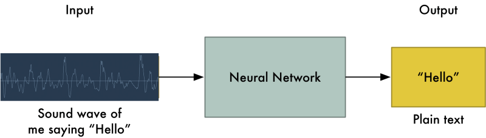

Это Святой Грааль распознавания речи с использованием глубокого обучения, но до него пока далеко (по крайней мере, когда я писал это, я думал, что мы придем к этому через пару лет).

Серьезная проблема заключается в том, что речь имеет непостоянную скорость. Один человек может сказать «привет!» очень быстро, а другой скажет «прррриииииввввееееееееет!» очень медленно, создав намного более длинный звуковой файл с гораздо большим объемом данных. А между тем оба звуковых файла должны быть распознаны как одинаковый текст – «привет!». Автоматическое выравнивание аудиофайлов различной длины под фрагмент текста фиксированной длины – задача непростая.

Чтобы обойти эту проблему, нам придется использовать некоторые специальные трюки и дополнительную точность в дополнении к глубокой нейронной сети. Посмотрим, как это работает!

## Превращение звуков в биты

Первый шаг в распознавании речи очевиден – нам нужно передать звуки на компьютер.

В [третьей части](https://algotravelling.com/ru/%D0%BC%D0%B0%D1%88%D0%B8%D0%BD%D0%BD%D0%BE%D0%B5-%D0%BE%D0%B1%D1%83%D1%87%D0%B5%D0%BD%D0%B8%D0%B5-%D1%8D%D1%82%D0%BE-%D0%B2%D0%B5%D1%81%D0%B5%D0%BB%D0%BE-3/) мы узнали, как взять изображение и представить его в виде массива чисел, чтобы напрямую подключиться к нейронной сети для распознавания изображений:

Но звук – это _волны_. Как превратить звуковые волны в числа? Воспользуемся следующим аудиофайлом с текстом «привет»:

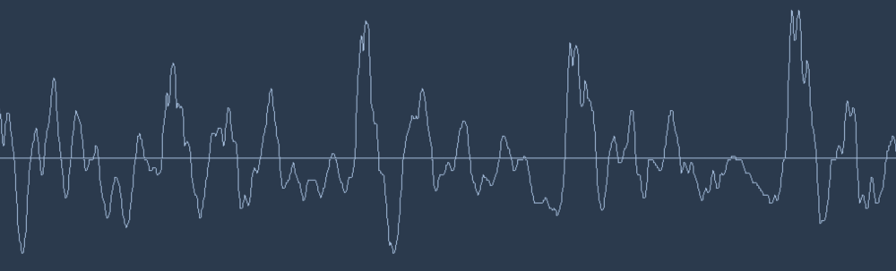

Звуковые волны одномерны. В каждый момент времени у них есть одно значение, зависящее от амплитуды волны. Давайте приблизим некоторую небольшую часть звуковой волны и посмотрим внимательней:

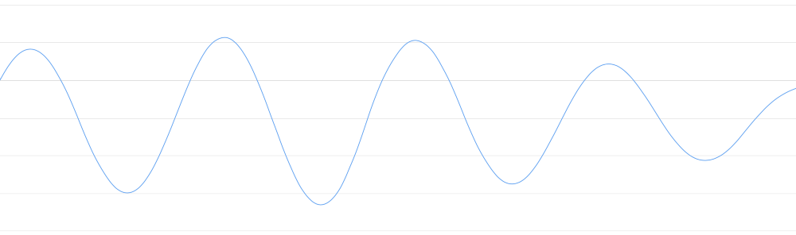

Чтобы превратить эту звуковую волну в числа, мы просто записываем значения амплитуды волны в равноотстоящих точках:

Это называется _дискретизацией_. Мы считываем данные тысячи раз в секунду и записываем числа, соответствующие амплитуде звуковой волны в этот момент времени. Получаются несжатые .wav аудиофайлы.

Звук, записываемый на CD-диски, дискретизируется с частотой 44,1 кГц (44 100 отсчетов в секунду). Но для распознавания речи достаточно частоты дискретизации 16 кГц (16000 отсчетов в секунду), так как диапазон частот человеческой речи не столь велик.

Давайте оцифруем наш «Привет» 16000 раз в секунду. Вот первые 100 точек:

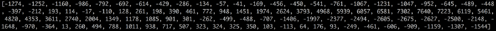

### Простой инструмент цифровой дискретизации

Возможно, вы думаете, что дискретизация создает лишь приближенный вариант исходной звуковой волны, так как мы считываем случайные показания, а в промежутках между отсчетами данные теряются, ведь так?

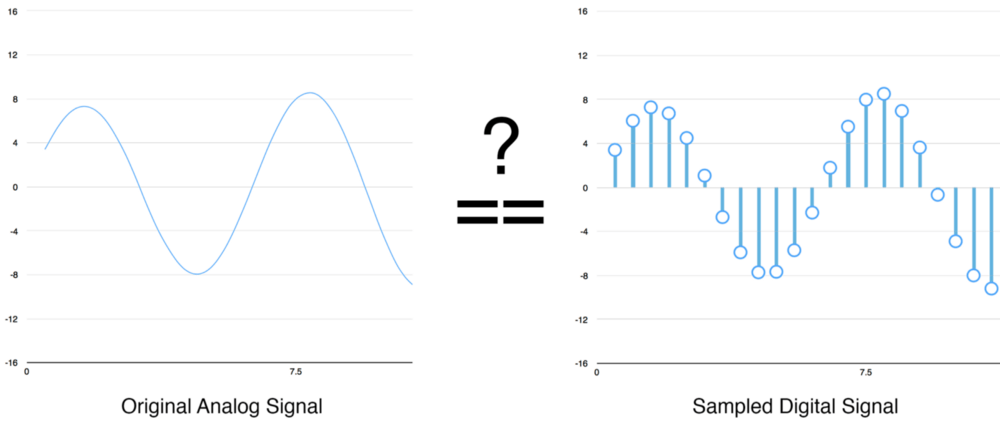

Но благодаря [теореме Котельникова](https://ru.wikipedia.org/wiki/%D0%A2%D0%B5%D0%BE%D1%80%D0%B5%D0%BC%D0%B0_%D0%9A%D0%BE%D1%82%D0%B5%D0%BB%D1%8C%D0%BD%D0%B8%D0%BA%D0%BE%D0%B2%D0%B0) мы знаем, что для идеального воссоздания исходной звуковой волны достаточно использовать частоту дискретизации, вдвое превышающую самую высокую частоту записываемого звука.

Я останавливаюсь на этом только потому, что [почти все ошибочно думают](http://gizmodo.com/dont-buy-what-neil-young-is-selling-1678446860), что использование более высоких частот дискретизации всегда приводит к лучшему качеству звука. Это не так.

## Предварительная обработка полученных оцифрованных данных

Теперь у нас есть массив чисел, каждое из которых представляет амплитуду звуковой волны через интервалы 1/16000 секунды.

Мы могли бы просто обучить нейросеть на этих числах, но распознание речевых моделей путем обработки этих чисел напрямую затруднительно. Вместо этого мы можем облегчить задачу, проведя некоторую предварительную обработку аудиоданных.

Начнем с того, что сгруппируем наши отсчеты во фрагменты по 20 миллисекунд. Вот первый такой фрагмент (первые 320 отсчетов):

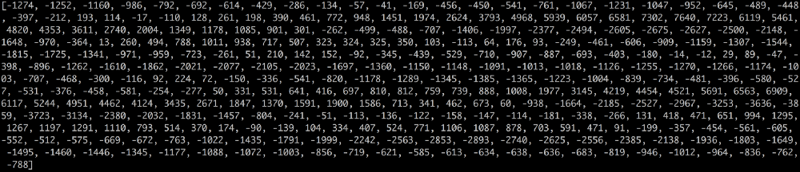

Построение этих чисел в виде простого линейного графика дает приблизительное изображение исходной звуковой волны за выбранный 20 миллисекундный период времени:

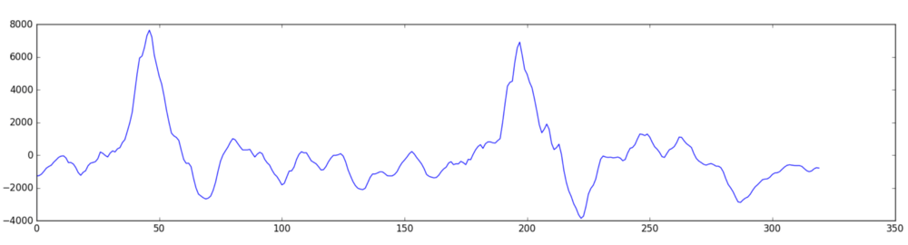

Эта запись длится всего _1/50 секунды_. Но даже она представляет собой сложную смесь различных частот звука. Есть несколько низких звуков, есть среднечастотные звуки и даже некоторые высокие звуки. Все эти частоты смешиваются вместе – и получается звук человеческой речи.

Чтобы упростить обработку этих данных для нейронной сети, разложим сложную звуковую волну на ее составные части, начиная от самых нижних частот. Затем, суммируя мощности звука в каждой полосе частот, мы создаем частотную _картину_ звука.

Представьте, что у вас была запись того, как кто-то исполняет аккорд _До мажор_ на фортепиано. Этот звук представляет собой комбинацию из трех музыкальных нот – _До_, _Ми_ и _Соль_ – которые смешивается в один сложный звук. Мы хотим разбить этот сложный звук на отдельные ноты, чтобы обнаружить исходные ноты. Здесь – то же самое.

Это делается с помощью математической операции, называемой [преобразованием Фурье](https://ru.wikipedia.org/wiki/%D0%9F%D1%80%D0%B5%D0%BE%D0%B1%D1%80%D0%B0%D0%B7%D0%BE%D0%B2%D0%B0%D0%BD%D0%B8%D0%B5_%D0%A4%D1%83%D1%80%D1%8C%D0%B5). Мы раскладываем сложную звуковую волну на простые звуковые волны, которые ее составляют. Имея отдельные звуковые волны, мы складываем мощности звука в каждой из них.

Конечным результатом является оценка важности каждого частотного диапазона, от низких частот до высоких. Числа ниже показывает мощность звука в каждой полосе по 50 Гц в нашем исходном фрагменте:

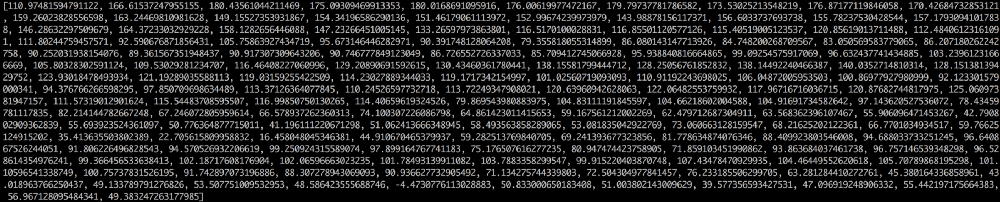

Намного проще и наглядней понять это, если нарисовать диаграмму:

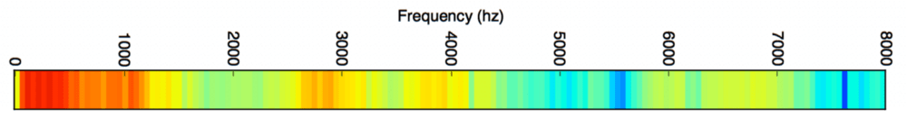

Если мы повторим этот процесс на каждом 20-миллисекундном фрагменте аудио, мы получим спектрограмму (каждый столбец слева направо представляет собой один 20-миллисекундный фрагмент):

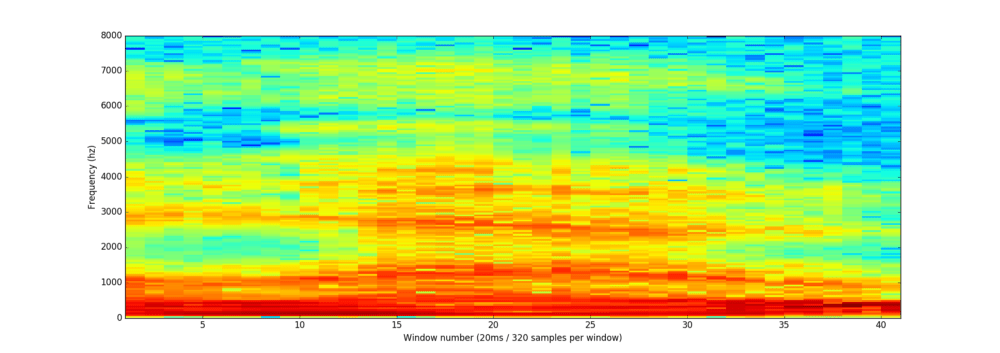

Спектрограмма – это круто, так как с помощью нее можно выделить музыкальные ноты и другие тона в аудиоданных. Нейронной сети будет проще находить шаблоны в таких данных, чем в сырых записях звука. Теперь мы получили данные, которые передадим нашей нейросети.

## Распознавание букв из коротких звуков

Теперь, когда у нас есть аудио в формате, с которым можно работать дальше, мы обучим на этих данных глубокую нейросеть. Нейросеть будет получать аудио-фрагменты длиной 20 мс. Для каждого небольшого фрагмента сеть попробует определить, какая _буква_ была произнесена.

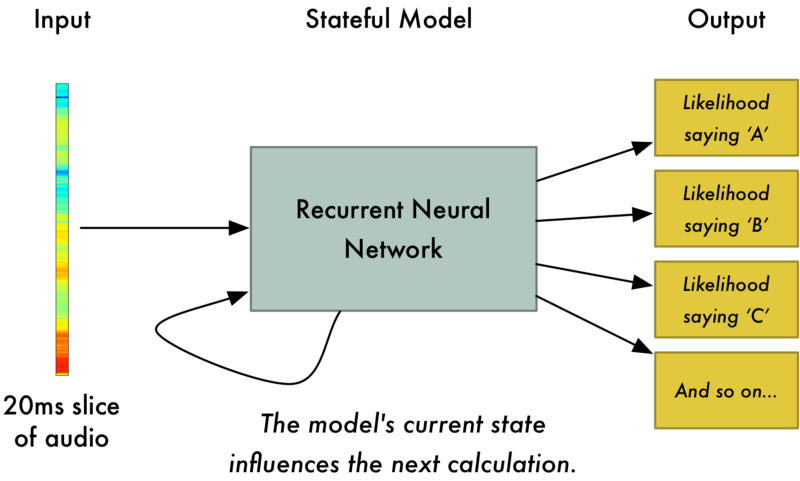

Мы будем использовать [рекуррентную нейронную сеть](https://algotravelling.com/ru/%D0%BC%D0%B0%D1%88%D0%B8%D0%BD%D0%BD%D0%BE%D0%B5-%D0%BE%D0%B1%D1%83%D1%87%D0%B5%D0%BD%D0%B8%D0%B5-%D1%8D%D1%82%D0%BE-%D0%B2%D0%B5%D1%81%D0%B5%D0%BB%D0%BE-2/), то есть такую, которая на каждом шаге учитывает результаты предыдущих шагов. Мы делаем так потому, что каждая буква, определенная сетью, должна влиять на вероятную следующую букву. Например, если мы произнесли «ПРИВ», то скорее всего, дальше скажем «ЕТ», чтобы закончить слово «Привет». Гораздо менее вероятно, что мы скажем что-то непроизносимое, например «ШХЩ». Таким образом, запоминая предыдущие результаты, нейросеть сможет делать более точные прогнозы в будущем.

После того как мы пропустим весь наш аудиофайл через нейронную сеть (по одному фрагменту за раз), мы получим разложение каждого фрагмента аудио на буквы, наиболее вероятно произнесенные во время этого фрагмента. Вот как выглядит отображение «Привет»:

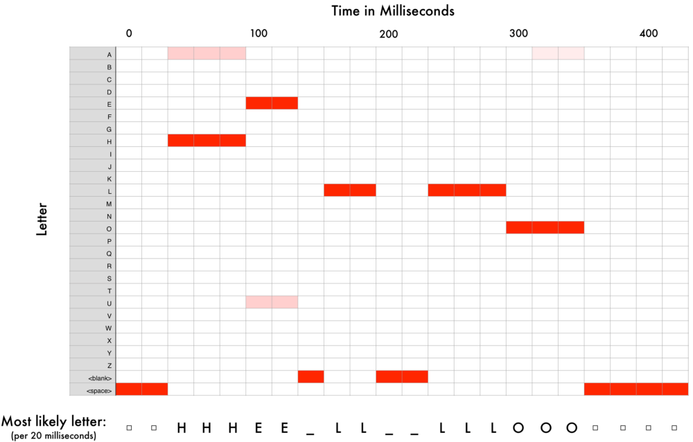

Наша нейронная сеть предсказывает что я, вроде бы, сказал «ПРРРИИИ__ВВВ_ВЕЕЕЕЕТ». Но также она может подумать, что я сказал «ПРРРЕЕЕВВВ__ВВ_ЕЕЕДД» или даже «ПРИУУ_УУУЭЭЭЭТ».

Мы должны привести результаты в порядок за несколько этапов. Во-первых, мы заменим любые повторяющиеся символы одним символом:

*   ПРРРИИИ__ВВВ_ВЕЕЕЕЕТ превратится в ПРИ_В_ЕТ
*   ПРРРЕЕЕВВВ__ВВ_ЕЕЕДД превратится в ПРЕ_В_ЕД
*   ПРИИИИ_УУ_УУУЭЭЭЭТ превратится в ПРИ_У_ЭТ

Теперь удалим все пропуски:

*   ПРИ_В_ЕТ превратится в ПРИВЕТ
*   ПРЕ_В_ЕД превратится в ПРЕВЕД
*   ПРИ_У_ЭТ превратится в ПРИУЭТ

Итак, мы получили три возможных транскрипции – «Привет», «Превед» и «Приуэт». Если вы произнесете их вслух, все они будут звучать похоже на «Привет». Поскольку все буквы определяются по одной, нейросеть может выдумать совершенно _непроизносимые_ транскрипции. Например, если вы скажете «Он не пойдет», сеть может выдать «Оне пай дёд».

Фокус заключается в том, чтобы уточнять эти предсказания, сравнивая их с большой базой данных письменного текста (книги, новостные статьи и т. д.). Мы отбрасываем транскрипции, которые кажутся наименее вероятными, и выбираем ту, которая кажется наиболее реалистичной.

Из наших вариантов транскрипций «Привет», «Превед» и «Приуэт», очевидно, «Привет» встречается в базе данных текста более часто (не говоря уже о наших исходных аудиофайлах), и поэтому, вероятно, это правильный вариант. Поэтому мы выберем «Привет» в качестве нашей окончательной транскрипции. Готово!

### Стоп, секундочку!

Вы можете подумать: «_Но что, если кто-то скажет «[Превед](https://ru.wikipedia.org/wiki/%D0%9F%D1%80%D0%B5%D0%B2%D0%B5%D0%B4!)»? Это будет верное слово, и «Привет» будет неправильной транскрипцией_!»

Конечно, возможно, что кто-то на самом деле скажет «Превед» вместо «Привет». Но система распознавания речи, подобная этой (обучаемая на литературном языке), не выберет «Превед» как правильный вариант. Кроме того, когда вы говорите «Превед», вы все равно имеете в виду «Привет», даже если вы подчеркиваете букву Е и Д».

Попробуйте вот что – если ваш телефон настроен на распознавание языка, попробуйте сказать телефону «Превед». Он откажется понимать вас, и неумолимо будет распознавать это как «Привет».

Непризнание «Превед» – это нормально, но может оказаться и так, что ваш телефон просто отказывается понимать что-то действительное правильное и важное. Именно поэтому эти модели распознавания речи всегда обучаются на большом количестве данных, чтобы исправить ошибки.

## А смогу ли я создать свою систему распознавания речи?

Одна из самых классных особенностей машинного обучения в том, что оно кажется очень простой штукой. Вы получаете кучу данных, загружаете их в алгоритм машинного обучения, а затем волшебным образом вы получаете систему ИИ мирового уровня, которая работает на вашем ноутбуке … _да_?

Да, иногда это работает, но не для речи. Распознавание речи – это сложная задача. Вам нужно преодолеть сотню различных трудностей: плохое качество микрофонов, фоновые шумы, реверберация и эхо, вариации произношения и акцента и многое другое. Все эти проблемы должны быть учтены в обучающих данных, чтобы убедиться, что нейронная сеть справляется с ними.

Вот еще один пример. Знаете ли вы, что, когда вы говорите в шумной комнате, вы подсознательно говорите более высоким тоном, чтобы перекрикивать шум? Люди-то понимают вас без проблем, но вот научить этому нейросеть – это целая задача. Таким образом, в ваших обучающих данных должны быть кричащие в шуме люди!

Чтобы создать систему распознавания голоса, которая будет работать на уровне Siri, Google Nowили Alexa, вам понадобится _много_ обучающих данных – гораздо больше данных, чем вы, вероятно, сможете получить, не нанимая сотни людей, которые запишут их. А между тем, экономить на этом нельзя – никто не хочет систему распознавания голоса, которая работает лишь в 80% случаев.

Google и Amazon используют сотни тысяч часов разговорной речи, записанной в реальных ситуациях. Это самый большой момент, который отделяет систему распознавания речи мирового класса от вашего хобби. Все дело в том, что _Google Now_и _Siri_, работающие бесплатно, или волшебные коробки _Alexa_ за 50$, у которых нет абонентской платы, призваны заставить вас **использовать их как можно больше**. Все, что вы говорите им, потом _**записывается навсегда**_ и в дальнейшем будет использовано в качестве обучающих данных для будущих версий алгоритмов распознавания речи. Вот в чем фокус-то!

Не верите? Если у вас есть Android-телефон с _Google Now_, [нажмите здесь, чтобы прослушать все глупые вещи, которые вы когда-либо говорили](https://myactivity.google.com/udc/vaa):

Поэтому, если вы ищете идею для стартапа, я бы не рекомендовал создавать собственную систему распознавания речи и конкурировать с Google. Вместо этого придумайте, как сделать так, чтобы люди передавали вам записи своей речи. Можно же продавать данные, а не системы.

## Где узнать больше

*   Алгоритм обработки звука с переменной длиной, в общих чертах описанный здесь, называется Connectionist Temporal Classification или CTC. Вы можете [прочитать оригинал статьи](http://www.cs.toronto.edu/~graves/icml_2006.pdf) 2006 года.
*   [Адам Коутс (Adam Coates](https://cs.stanford.edu/~acoates/)) из Baidu сделал отличную презентацию о глубоком обучении распознавания речи в Bay Area Deep Learning School. Вы можете [посмотреть видео на YouTube](https://youtu.be/9dXiAecyJrY?t=13874) (его выступление начинается в 3:51:00). Настоятельно рекомендую.