Машинное обучение это весело! Часть 7

## Цель генеративных моделей

Так почему же все-таки исследователи в области ИИ создают сложные системы лишь для того, чтобы получать изображения спален (пусть даже неплохие)?

Идея состоит в том, что вы должны понимать объект, чтобы изобразить его.

Взгляните на эту картинку:

Вы без труда понимаете, что это собака – нечто пушистое с четырьмя ногами и хвостом. Но для компьютера изображение представляет собой сетку чисел, обозначающих цвет каждого пикселя. Компьютер не понимает идею, заложенную в изображении.

Но теперь представьте, что мы показали компьютеру тысячи фотографий собак, и, увидев эти фотографии, компьютер научился самостоятельно создавать новые – причем собаки будут разных пород и изображены в разных ракурсах. Может мы даже сможем уточнять, чего хотим, например, «гончая собака, вид сбоку».

Если компьютер научится делать это, и на созданных им изображениях собак будет правильное число ног, хвостов и ушей, что компьютер «знает», какие части входят в состав собаки, хотя никто не рассказывал ему об этом напрямую. Таким образом, хорошая генеративная модель в некотором смысле является доказательством наличия «понимания» – пусть даже на уровне младенца.

Вот почему исследователи с воодушевлением занимаются генеративными моделями. Они считают, что эти модели позволят привить компьютерам понимание идей и понятий, не разъясняя их смысл напрямую. Это серьезный прорыв по сравнению с нынешними системами, которые могут учиться только на обучающих данных, собранных людьми до этого.

Но если результаты все этих исследований ограничиваются изображениями собак, сколько лет потребуется, чтобы создать ежедневник с собаками или что-то более серьезное?

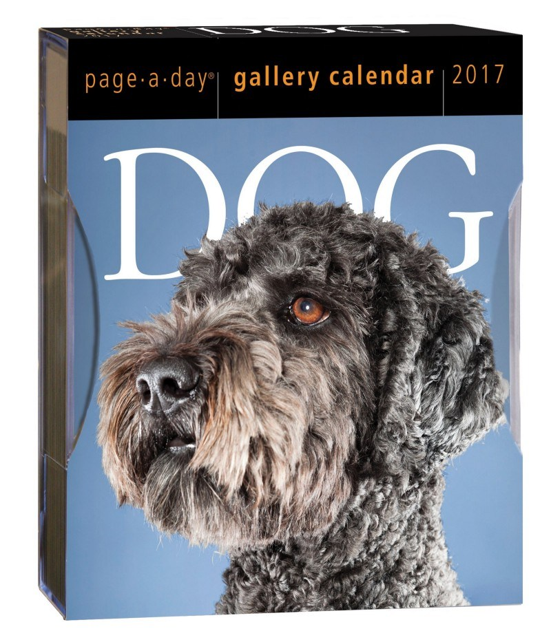

К тому же, если мы можем создать программу, которая понимает, что такое собака, почему бы не научить ее и другим понятиям? Как насчет программы, которая могла бы генерировать неограниченное количество стоковых фотографий и людей, жмущих друг другу руки? Я уверен, что кто-нибудь за это даже заплатил бы.

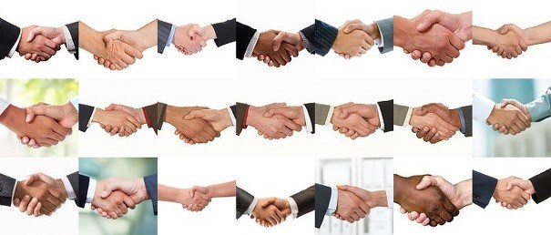

Окей, может быть, программа, генерирующая плохие стоковые фотографии – не самая интересная идея. Но, учитывая темпы прогресса в генеративных моделях только за последний год, через 5 или 10 лет многое может измениться. Что если кто-то создаст систему для создания целых фильмов, музыки или видеоигр?

Если вы взглянете на 20-30 лет в будущее, вы без труда сможете представить мир, где все развлечения могут быть созданы исключительно компьютерами:

Игровая индустрия – это первая сфера развлечений, где начинаются [серьезные эксперименты с использованием ИИ для генерирования сырого контента](https://www.technologyreview.com/s/601258/artificial-intelligence-can-now-design-realistic-video-and-game-imagery/). Помимо очевидного пересечения [диаграммы Венна](https://ru.wikipedia.org/wiki/%D0%94%D0%B8%D0%B0%D0%B3%D1%80%D0%B0%D0%BC%D0%BC%D0%B0_%D0%92%D0%B5%D0%BD%D0%BD%D0%B0) между компьютерными играми и машинным обучением, существует огромный стимул для инвестиций в автоматизацию разработки видеоигр, учитывая бюджеты [современных игр](https://en.wikipedia.org/wiki/AAA_%28video_game_industry%29), превышающие 300 миллионов долларов.

Наши генеративные модели машинного обучения только встают на ноги, и их практическое использование на сегодняшний день довольно ограничено, но с ними уже можно довольно весело побаловаться. Давайте посмотрим, что мы сможем сделать.

## Как работают DCGAN

Чтобы создать DCGAN, нужно создать две глубокие нейронные сети. Затем мы заставляем их состязаться друг с другом в бесконечных попытках превзойти друг друга. В процессе схватки каждая из них обучается все лучше и лучше.

Давайте представим, что первая глубокая нейронная сеть – это только-только поступивший на службу полицейский, которого обучают обнаруживать фальшивые деньги. Он должен смотреть на фото говорить нам, изображены ли на нем настоящие деньги.

Для поиска объектов на картинках мы можем использовать стандартную [сверточную нейронную сеть](https://algotravelling.com/ru/%D0%BC%D0%B0%D1%88%D0%B8%D0%BD%D0%BD%D0%BE%D0%B5-%D0%BE%D0%B1%D1%83%D1%87%D0%B5%D0%BD%D0%B8%D0%B5-%D1%8D%D1%82%D0%BE-%D0%B2%D0%B5%D1%81%D0%B5%D0%BB%D0%BE-3/). Если вы не знакомы с их работой, вы можете [прочитать мою предыдущую статью](https://algotravelling.com/ru/%D0%BC%D0%B0%D1%88%D0%B8%D0%BD%D0%BD%D0%BE%D0%B5-%D0%BE%D0%B1%D1%83%D1%87%D0%B5%D0%BD%D0%B8%D0%B5-%D1%8D%D1%82%D0%BE-%D0%B2%D0%B5%D1%81%D0%B5%D0%BB%D0%BE-3/). Вкратце, их основная идея состоит в том, что нейронная сеть обрабатывает изображение в несколько этапов, распознавая все более сложные особенности и выдавая в конце одно значение. В нашем случае оно зависит от того, изображены ли на фото настоящие деньги.

Так вот, наша первая нейронная сеть называется **Дискриминатором**:

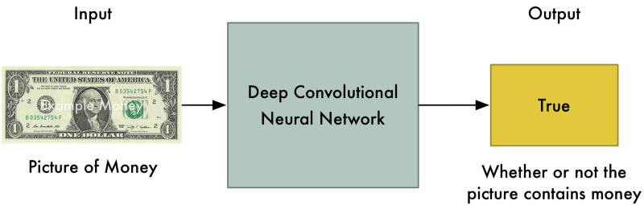

Теперь давайте представим, что вторая нейронная сеть – это новичок-фальшивомонетчик, который только учится создавать фальшивые деньги. Для этой сети мы перевернем слои в ConvNet, чтобы она работала в обратном направлении. Поэтому вместо того, чтобы делать снимок и выводить значение, он принимает список значений и выводит изображение.

Эта вторая нейронная сеть называется **Генератором**:

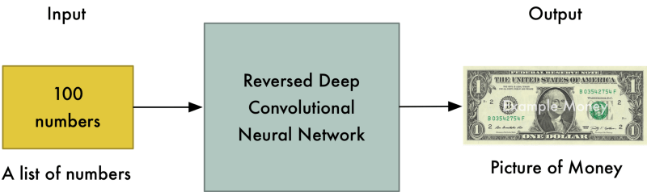

Итак, теперь у нас есть полицейский (**Дискриминатор**), ищущий фальшивые деньги и фальшивомонетчик (**Генератор**), который печатает фальшивые деньги. Да будет битва!

В первом раунде **Генератор** создаст никчемные подделки, которые почти совсем не похожи на деньги, потому что он абсолютно ничего не знает о том, как они должны выглядеть:

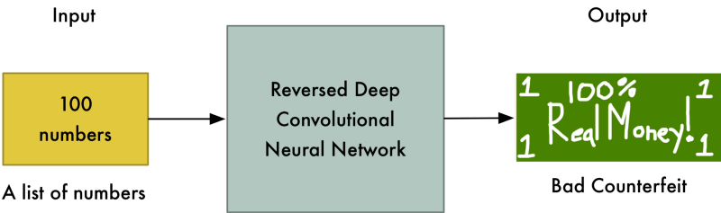

Но и **Дискриминатор** пока не ничего не смыслит в опознании денег, поэтому разницы не заметит:

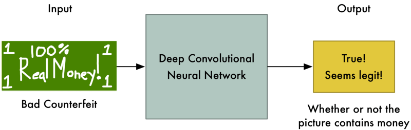

В этот момент мы говорим Дискриминатору, что этот доллар далек от настоящего и является фальшивкой. Затем мы показываем ему реальную долларовую купюру и просим его найти в ней отличия от подделки. Дискриминатор выявляет детали, которые помогут ему отличить реальную купюру от фальшивой.

Например, дискриминатор может заметить, что на настоящих купюрах есть изображение человека, а на фальшивых – нет. Зная это, Дискриминатор учится отличать подделку от настоящей купюры, становится немного опытнее:

Второй раунд. Мы говорим Генератору, что его рисунки денег внезапно отбракованы и определены как фальшивые, поэтому нужно стараться получше. Мы также сообщаем ему, что Дискриминатор теперь ищет лица, поэтому лучший способ сбить с толку дискриминатора – разместить на купюре лицо:

И, о чудо, поддельные купюры снова приняты за настоящие! Так что теперь Дискриминатору снова нужно взглянуть на настоящий доллар и найти новый способ отличить его от фальшивого.

Эта бесконечная битва между Генератором и Дискриминатором повторяется тысячи раз, пока обе сети не обучатся до нужного уровня. В конце концов, Генератор начнет генерировать почти идеальные подделки, и Дискриминатор превратился в профи-детектива, который находит малейшие изъяны.

Когда обе сети будут достаточно обучены, чтобы поддельные изображения были похожи на реальные фото, мы сможем использовать поддельные изображения для любых целей.

## Применение такого подхода в видеоиграх

Теперь, когда мы знаем, как работают DCGAN, давайте посмотрим, сможем ли мы использовать их для создания артов для игр 80-х годов.

Давайте создадим DCGAN, которая будет генерировать скриншоты воображаемых игр для Nintendo Entertainment System (или NES) на основе скриншотов реальных игр:

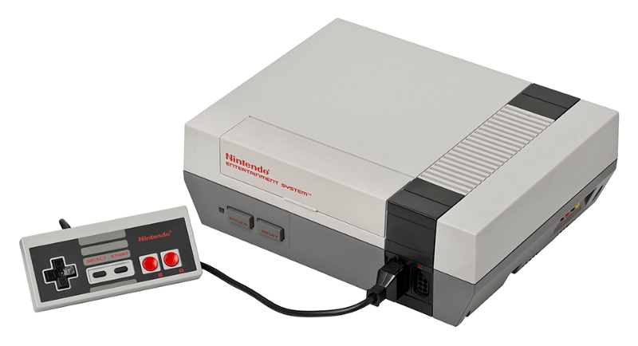

Идея состоит в том, что, если мы сможем создавать убедительные скриншоты из несуществующих игр, мы сможем брать фрагменты полученных артов и использовать их в нашей собственной 8-битной ретро-игре. Поскольку полученных игр не существует, плагиатом это не считается (_хотя… ну ладно, об этом позже_).

Отрисовка в играх того времени была очень проста. Поскольку у NES был небольшой объем памяти (в играх использовалось меньше памяти, чем занимает эта статья), программистам приходилось изворачиваться, чтобы разместить в памяти все графические материалы. Чтобы максимально ограничить пространство, в играх использовалась графическая сетка, где каждый экран в игре состоит из нескольких (обычно 16x16 пикселей) повторяющихся графических фрагментов (или плиток).

Например, стартовый экран [The Legend of Zelda](https://ru.wikipedia.org/wiki/The_Legend_of_Zelda_(%D0%B8%D0%B3%D1%80%D0%B0)) состоит всего из 8 уникальных плиток:

Здесь представлены плитки для игровой карты The Legend of Zelda:

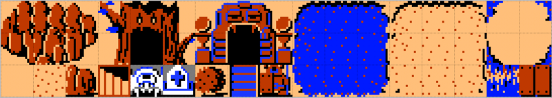

Наша цель – создать нечто подобное для нашей игры. Поэтому нам совершенно не важно, реалистично ли выглядят скриншоты, которые мы создаем. Вместо этого мы просто ищем формы и шаблоны, которые мы можем использовать в качестве плиток 16x16 пикселей в нашей игре – камни, вода, мосты и т.д. Затем мы можем использовать эти плитки для создания нашей собственной 8-битной игры.

### Сбор данных

Для обучения системы нам потребуется много данных. К счастью, мы имеем [более 700 игр](https://ru.wikipedia.org/wiki/%D0%9F%D1%80%D0%BE%D0%B5%D0%BA%D1%82:%D0%9A%D0%BE%D0%BC%D0%BF%D1%8C%D1%8E%D1%82%D0%B5%D1%80%D0%BD%D1%8B%D0%B5_%D0%B8%D0%B3%D1%80%D1%8B/%D0%A1%D0%BF%D0%B8%D1%81%D0%BA%D0%B8/%D0%98%D0%B3%D1%80_%D0%BD%D0%B0_NES) для NES, которые послужат нам источником данных.

Я использовал wget и скачал скриншоты всех игр NES на сайте [The Video Game Museum](http://www.vgmuseum.com/nes.htm) (простите что обчистил вас!). Спустя несколько минут загрузки в моем распоряжении было чуть более 10000 скриншотов из сотен игр NES:

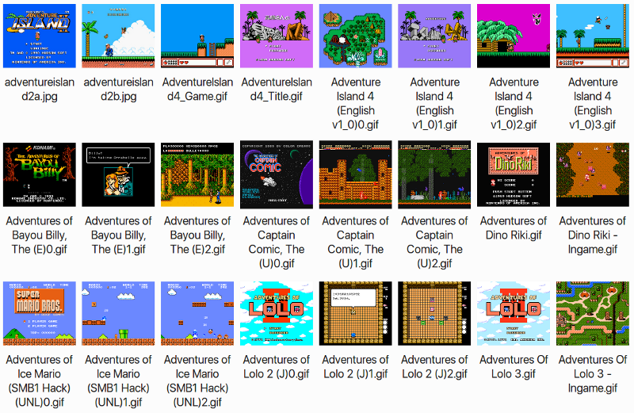

В настоящий момент DCGAN работают только с довольно маленькими изображениями – 256 пикселей в квадрате или около того. Но, поскольку разрешение экрана NES составляло всего 256х224 пикселей, это не проблема. Чтобы упростить работу, я обрезал каждый скриншот NES до 224 квадратных пикселей.

### Настройка DCGAN

На github есть несколько реализаций DCGAN с открытым кодом, которые вы можете попробовать. Я использовал вариант [Tensorflow](https://github.com/carpedm20/DCGAN-tensorflow) от Тэехуна Кима (Taehoon Kim). Поскольку работа DCGAN не контролируется, вам нужно лишь поместить данные в папку, настроить основные параметры, запустить обучение, а затем ждать результатов.

Вот пример исходных обучающих данных:

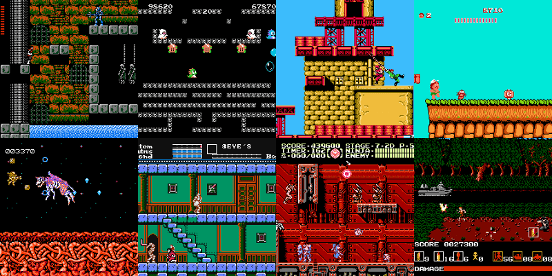

Начало обучения. Поначалу генератор выдает сплошной шум. Но затем шум постепенно начинает обретать форму, поскольку Генератор учится все лучше и лучше:

После нескольких тренировочных проходов изображения начинают напоминать кошмарные версии классических игр Nintendo:

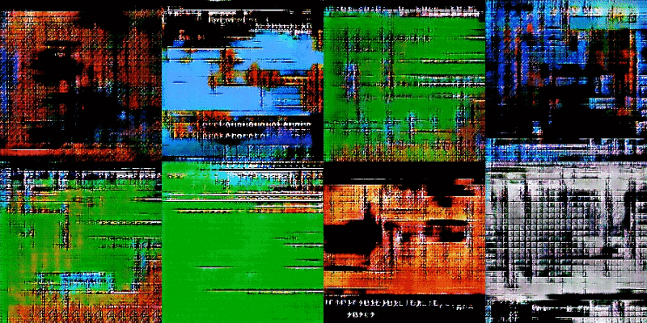

Но обучение продолжается, и мы начинаем видеть кирпичики и блоки, которые хотим видеть. Также проглядываются элементы экрана, такие как полосы жизни и какой-то текст:

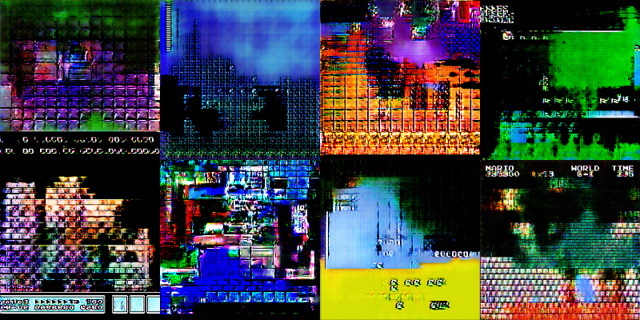

В этот момент все усложняется. Откуда мы знаем, что компьютер создает новые скриншоты, а не копирует все подряд из обучающих изображений? В двух из этих изображений вы можете ясно видеть строку меню от Super Mario Bros. 3 и верхнюю панель и кирпичи из оригинального Super Mario Bros.

Естественно, компьютер может взять какие-то обучающие данные напрямую. Если обучающих данных будет много, а время обучения не слишком велико, то вероятность таких явлений может быть снижена. Но это сложная проблема, и исследования по ней продолжаются.

Так как меня интересует только эстетика, я корректировал модель, пока выходные изображения не стали смотреться как что-то новое. Но _доказать_ оригинальность можно доказать только путем проверки обучающих данных и сравнения их с полученным артом.

Спустя несколько часов тренировки сгенерированные изображения стали состоять из плиток 16x16, которые мне понравились. Я искал вариации каменных блоков, кирпичных узоров, узорах воды, кустарниках и некоторых жутковатых фоновых плиток.

Далее мне нужно было обработать сгенерированные изображения, чтобы убедиться, что на них присутствуют только 64 цвета, доступные в NES:

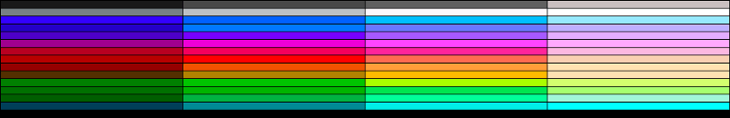

Затем я открыл 64-цветные изображения в [Tiled Map Editor](http://www.mapeditor.org/). Оттуда я могу легко взять плитки 16x16 которые мне нравятся:

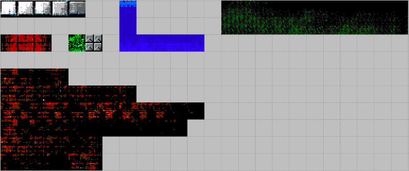

Затем в том же самом Tiled Map Editor я разложу эти плитки в нечто похожее на игру [Castlevania](https://ru.wikipedia.org/wiki/Castlevania_(%D1%81%D0%B5%D1%80%D0%B8%D1%8F_%D0%B8%D0%B3%D1%80)):

Мне кажется, выглядит довольно хорошо! Отметим, что я не трогал ни один пиксель с помощью редактора изображений. Каждая плитка вышла прямо из модели DCGAN.

Теперь давайте добавим главного героя и некоторых врагов из Castlevania, чтобы мы могли увидеть, как будет выглядеть этот уровень в игре:

Чтобы получить полноценный эффект, давайте посмотрим, как будет выглядеть уровень игры с добавленными элементами меню:

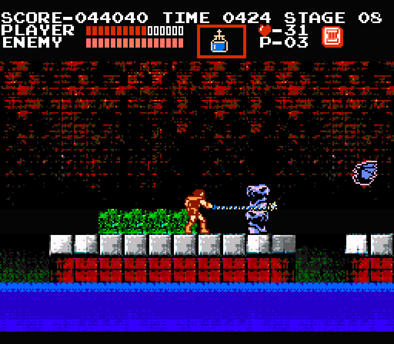

Это очень похоже на игры NES, которые я помню! Я не утверждаю, что это лучшая из когда-либо созданных игр, но и не самая худшая, это точно:

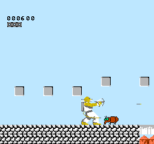

## И это всё?

Меня очень воодушевляют такие генеративные модели. Идея создания бесконечного потока артов восхищает меня. Но когда я обсуждаю это с другими людьми, мне иногда говорят: «И это всё? Это же проще простого».

Сейчас, конечно, много шумихи вокруг генеративных состязательных моделей. Их уже называют будущим ИИ, несмотря на то, что их довольно трудно обучить, и их функционал пока что ограничивается генерацией крошечных изображений. Фактически, самые лучшие модели в настоящее время могут создавать только фотографии собак-мутантов:

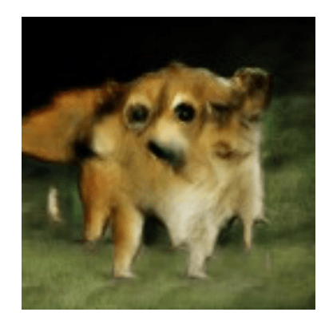

Но пару лет назад не было и этого. Мы были в восторге от сгенерированных фотографий, которые выглядели вот так:

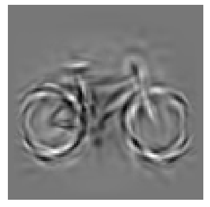

И эти технологии развиваются каждый день. [Вот случайная статья](https://arxiv.org/pdf/1702.01983v1.pdf), которая вышла на _этой неделе_, где рассказывается об использовании такой сети для определения возраста по лицу:

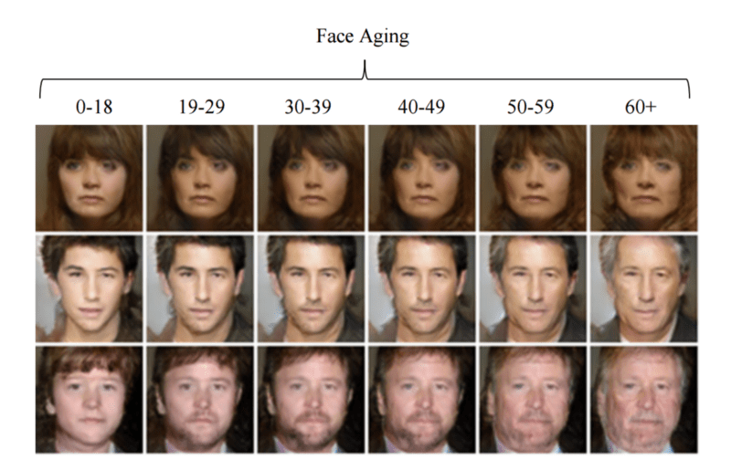

Все это развивается так быстро, что недолго осталось ждать до того момент, когда генеративные модели станут основным инструментом, помогающим нам созидать. Отличное время, чтобы начинать экспериментировать!

## Учитесь дальше

Если вы хотите узнать больше о генеративных моделях и DCGAN, вот несколько интересных ресурсов: