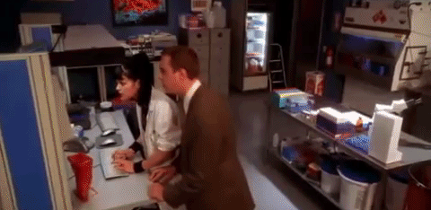
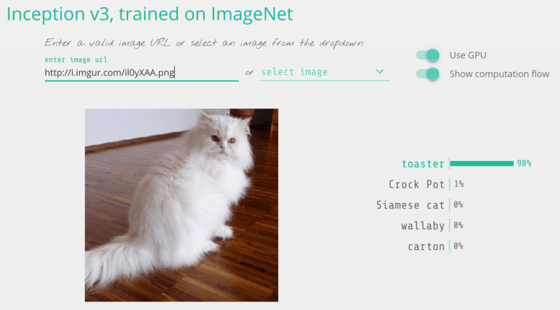
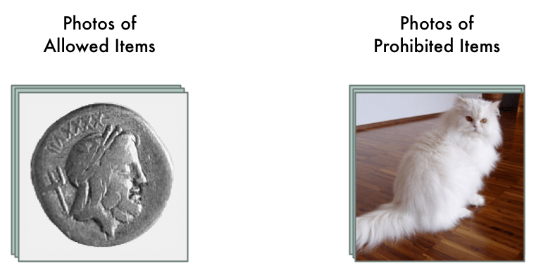
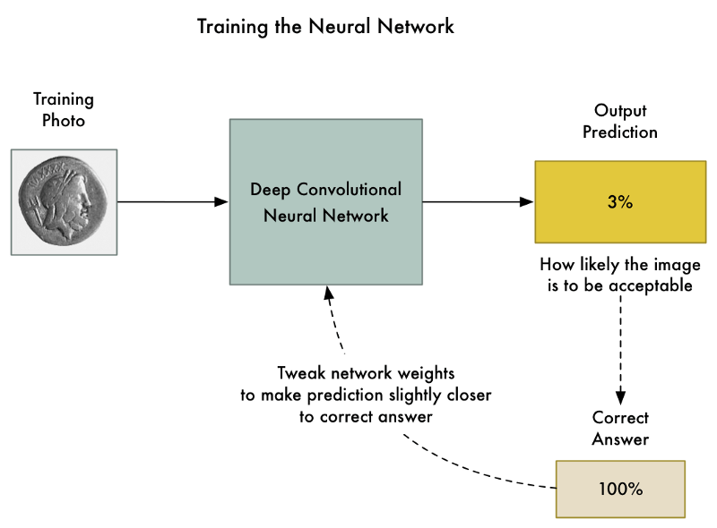
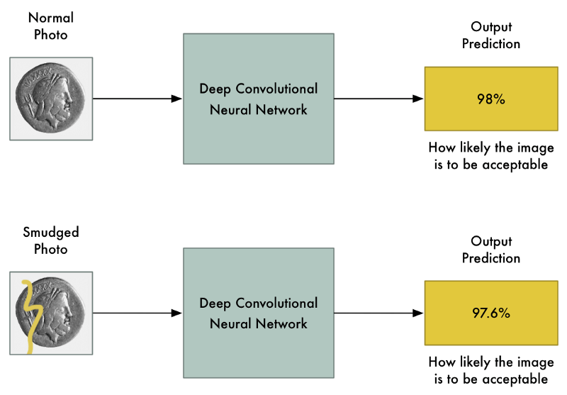
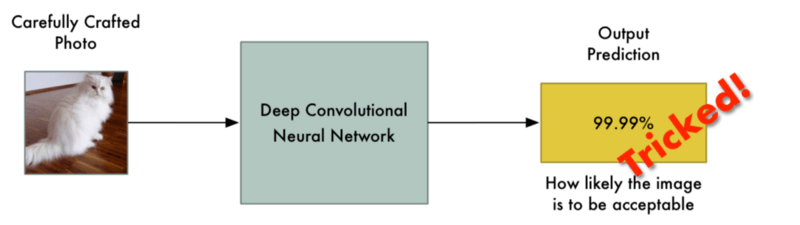
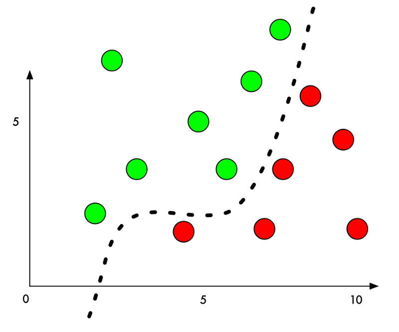
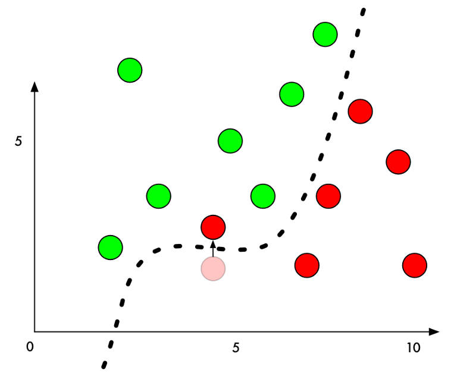
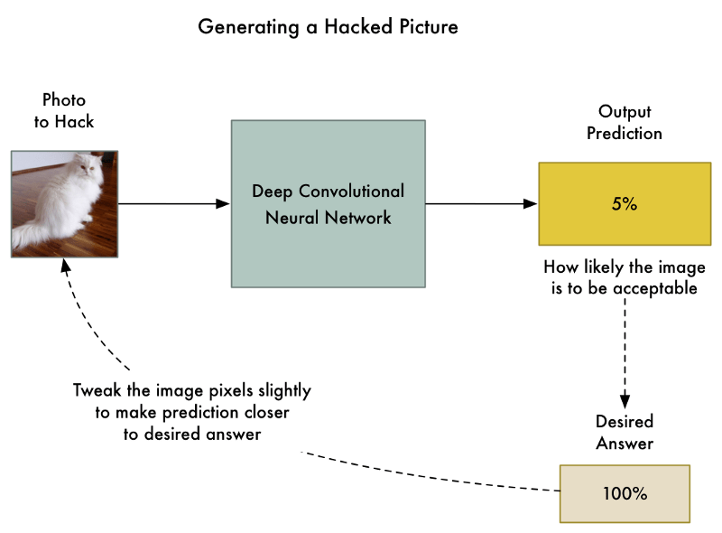
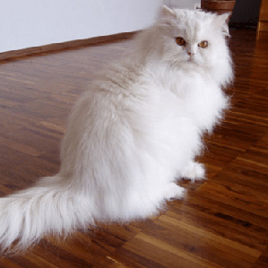

Машинное обучение это весело! Часть 8

_Часть цикла статей [Adam Geitgey](https://medium.com/@ageitgey?source=post_header_lockup) – “Машинное обучение это весело!”: [ч.1](https://algotravelling.com/ru/%D0%BC%D0%B0%D1%88%D0%B8%D0%BD%D0%BD%D0%BE%D0%B5-%D0%BE%D0%B1%D1%83%D1%87%D0%B5%D0%BD%D0%B8%D0%B5-%D1%8D%D1%82%D0%BE-%D0%B2%D0%B5%D1%81%D0%B5%D0%BB%D0%BE-1/), [ч.2](https://algotravelling.com/ru/%D0%BC%D0%B0%D1%88%D0%B8%D0%BD%D0%BD%D0%BE%D0%B5-%D0%BE%D0%B1%D1%83%D1%87%D0%B5%D0%BD%D0%B8%D0%B5-%D1%8D%D1%82%D0%BE-%D0%B2%D0%B5%D1%81%D0%B5%D0%BB%D0%BE-2/), [ч.3](https://algotravelling.com/ru/%D0%BC%D0%B0%D1%88%D0%B8%D0%BD%D0%BD%D0%BE%D0%B5-%D0%BE%D0%B1%D1%83%D1%87%D0%B5%D0%BD%D0%B8%D0%B5-%D1%8D%D1%82%D0%BE-%D0%B2%D0%B5%D1%81%D0%B5%D0%BB%D0%BE-3/), [ч.4](https://algotravelling.com/ru/%D0%BC%D0%B0%D1%88%D0%B8%D0%BD%D0%BD%D0%BE%D0%B5-%D0%BE%D0%B1%D1%83%D1%87%D0%B5%D0%BD%D0%B8%D0%B5-%D1%8D%D1%82%D0%BE-%D0%B2%D0%B5%D1%81%D0%B5%D0%BB%D0%BE-4/), [ч.5](https://algotravelling.com/ru/%D0%BC%D0%B0%D1%88%D0%B8%D0%BD%D0%BD%D0%BE%D0%B5-%D0%BE%D0%B1%D1%83%D1%87%D0%B5%D0%BD%D0%B8%D0%B5-%D1%8D%D1%82%D0%BE-%D0%B2%D0%B5%D1%81%D0%B5%D0%BB%D0%BE-5/), [ч.6](https://algotravelling.com/ru/%D0%BC%D0%B0%D1%88%D0%B8%D0%BD%D0%BD%D0%BE%D0%B5-%D0%BE%D0%B1%D1%83%D1%87%D0%B5%D0%BD%D0%B8%D0%B5-%D1%8D%D1%82%D0%BE-%D0%B2%D0%B5%D1%81%D0%B5%D0%BB%D0%BE-6/), [ч.7](https://algotravelling.com/ru/%D0%BC%D0%B0%D1%88%D0%B8%D0%BD%D0%BD%D0%BE%D0%B5-%D0%BE%D0%B1%D1%83%D1%87%D0%B5%D0%BD%D0%B8%D0%B5-%D1%8D%D1%82%D0%BE-%D0%B2%D0%B5%D1%81%D0%B5%D0%BB%D0%BE-7/), [ч.8](https://algotravelling.com/ru/%D0%BC%D0%B0%D1%88%D0%B8%D0%BD%D0%BD%D0%BE%D0%B5-%D0%BE%D0%B1%D1%83%D1%87%D0%B5%D0%BD%D0%B8%D0%B5-%D1%8D%D1%82%D0%BE-%D0%B2%D0%B5%D1%81%D0%B5%D0%BB%D0%BE-8/)._

* * *

## Как обмануть нейросеть… или немного о работе хакеров в будущем

Как только программисты начали писать компьютерные программы, хакеры тут же начали искать способы взлома этих программ. Хакеры пользуются малейшими ошибками в программах, которые дают им возможность взламывать системы, красть данные и иным образом вредительствовать.

Но ведь системы, прошедшие глубокое обучение, должны быть защищены от вмешательства человека, так? Как можно обмануть нейронную сеть, обученную на терабайтах данных?

Оказывается, что перехитрить можно даже самые современные нейронные сети глубокого обучения. Всего пара фокусов позволит вам добиться от них того результата, который вам нужен:

Поэтому, прежде чем создавать новую систему на основе глубоких нейронных сетей, давайте выясним, как их сломать и как защитить их от подобных действий со стороны злоумышленников.

## Нейронные сети в качестве охранников

Довольно трудно следить за соблюдением подобных правил, если у вас на сайте миллионы пользователей. Можно было бы бы нанять сотни людей, которые просматривали бы каждое объявление вручную, но это будет дорого. Вместо этого мы можем использовать глубокое обучение, чтобы автоматически проверять изображение на наличие запрещенных товаров и помечать те из них, которые нарушают правила.

Тогда перед нами встает типичная проблема классификации изображений. Чтобы организовать такой процесс, нам потребуется [глубокая сверточная нейронная сеть](https://algotravelling.com/ru/%D0%BC%D0%B0%D1%88%D0%B8%D0%BD%D0%BD%D0%BE%D0%B5-%D0%BE%D0%B1%D1%83%D1%87%D0%B5%D0%BD%D0%B8%D0%B5-%D1%8D%D1%82%D0%BE-%D0%B2%D0%B5%D1%81%D0%B5%D0%BB%D0%BE-3/), которая будет отделять разрешенные товары от неразрешенных, а затем мы пропустим через нее все имеющиеся на нашем сайте фотографии.

В первую очередь, нам потребуются данные тысяч изображений, выложенных в последние объявления. Нам нужны изображения как разрешенных, так и запрещенных предметов, чтобы мы на их примере могли объяснить нейросети, что такое хорошо, а что такое плохо:

Для обучения нейронной сети будем использовать стандартный алгоритм _обратного распространения ошибки_. В этом алгоритме сеть получает на вход обучающие данные и желаемый результат, а затем, двигаясь от последнего слоя к первому, меняет весовые коэффициенты с целью снизить ошибку, и таким образом учится выдавать правильный результат:

Требуется выполнить эту процедуру тысячу раз с тысячами фотографий, пока модель не научится давать правильные результаты с приемлемой точностью.

В конце концов мы получим нейросеть, способную надежно классифицировать изображения:

_Примечание: Если вы хотите подробнее узнать о том, как сверточные сети распознают объекты на изображениях, прочитайте [Часть 3](https://algotravelling.com/ru/%D0%BC%D0%B0%D1%88%D0%B8%D0%BD%D0%BD%D0%BE%D0%B5-%D0%BE%D0%B1%D1%83%D1%87%D0%B5%D0%BD%D0%B8%D0%B5-%D1%8D%D1%82%D0%BE-%D0%B2%D0%B5%D1%81%D0%B5%D0%BB%D0%BE-3/)._

## Но все это не так надежно, как кажется …

Сверточные нейронные сети – это мощные модели, которые изучают изображение вдоль и поперек, прежде чем классифицировать его. Они способны распознавать сложные формы и шаблоны, независимо от того, где они появляются в изображении. Со многими задачами распознавания образов такие сети справляются ничуть не хуже, чем человек.

Раз эти модели столь умны, значит, изменив несколько пикселей в изображении, сделав их чуть светлее или темнее, мы вряд ли сильно повлияем на результат, не так ли? Конечно, это может немного изменить конечную вероятность получения того или иного результата, но вряд ли изображение превратится из «запрещенного» в «разрешенное».

Однако, в известной статье 2013 года под названием «[Занятное свойство нейронных сетей](https://arxiv.org/abs/1312.6199)» было рассказано, что это не всегда так. Если вы точно знаете, какие пиксели изменить, и насколько их изменить, вы можете намеренно заставить нейронную сеть сделать неправильный вывод для данного изображения без существенных изменений внешнего вида изображения.

Это означает, что мы можем сделать изображрение, на котором будет явно запрещенный товар, но при этом нейросеть будет совершенно одурачена:

Почему так происходит? Классификатор с машинным обучением различает объекты, проводя между их классами некоторую разделительную линию. Вот как это выглядит на графике для простого двумерного классификатора, который научился отличать зеленые точки (разрешенные) от красных точек (запрещенных):

Сейчас классификатор работает с идеальной точностью Он провел линию, которая идеально разделяет все зеленые точки и красные точки.

А что будет, если мы захотим обмануть сеть, переместив одну из красных точек в область зеленых точек? Как сильно нам нужно передвинуть красную точку, чтобы она оказалась в зеленой зоне?

Если добавить небольшое количество к значению Y для красной точки прямо рядом с границей, она попадет на зеленую территорию:

Таким образом, чтобы обмануть классификатор, нам достаточно лишь знать, в каком направлении нужно подтолкнуть точку, чтобы она пересекла линию. Чтобы это не было слишком очевидно, двигать точку нужно как можно меньше, чтобы казалось, что это сеть ошиблась, а мы тут не при чем.

В классификации изображений, выполняемой глубокими нейронными сетями, каждой «точкой» в классификации является всё изображение, состоящее из тысяч пикселей. Это дает нам тысячи возможных значений, которые мы можем изменить, тем самым перемещая точку в нужную сторону. Значит, изменяя пиксели изображения незаметным для человека образом, мы можем обмануть классификатор, а наш фокус останется нераспознанным.

Другими словами, мы можем взять реальное изображение объекта и слегка изменить пиксели так, чтобы изображение обмануло нейронную сеть и заставило ее думать, что здесь изображено что-то другое – и мы даже можем сами задать желаемый выходной результат:

## Как обмануть нейронную сеть

Мы уже говорили о том, из чего состоит процесс обучения нейронной сети для классификации фотографий:

1.  Обучение сети на выбранных фото.
2.  Проверка ответа нейронной сети и определение того, как далек данный ей ответ от правильного.
3.  Подстройка весовых коэффициентов в каждом слое сети с использованием метода обратного распространения ошибки, чтобы сделать окончательный прогноз немного ближе к правильному ответу.
4.  Повторение этих шагов тысячи раз с тысячами фотографий.

А что если вместо изменения весовых коэффициентов слоев нейронной сети мы будем изменять само входное изображение, пока мы не получим желаемый ответ?

Итак, давайте снова возьмем уже обученную нейронную сеть и «обучим» ее заново. Но теперь мы будем использовать обратное распространение ошибки не для изменения весовых коэффициентов, а для редактирования _**точек изображения**_:

Новый алгоритм будет такой:

1.  Даем сети фото, которое нужно подделать.
2.  Проверяем, насколько далек ответ сети от _**желаемого**_.
3.  Используя метод обратного распространения ошибки, будем редактировать фотографию, чтобы результат стал чуть ближе к нужному ответу.
4.  Повторяем эти шаги тысячу раз с _**одной и той же фотографией**_ пока сеть не выдаст нам требуемый результат.

В итоге мы получим изображение, которое обманет нейронную сеть, при этом, не меняя ничего внутри самой нейронной сети.

Единственная проблема заключается в том, что, если мы не будем накладывать никаких ограничений на редактирование пикселей, полученные изменения изображения получатся слишком заметными. Это могут быть, например, обесцвеченные пятна или волнообразные линии:

Чтобы не допустить появления таких очевидных искажений, мы можем ввести в наш алгоритм простое ограничение. Зададимся условием, что ни один пиксель на нашем «взломанном» изображении не может быть изменен слишком сильно по сравнению с исходным изображением – например, не более 0,01%. Тогда наш алгоритм выполнит корректировку изображения таким образом, что нейросеть по-прежнему будет обманута, а для человека изменения будут малозаметны.

Вот как будет выглядеть отредактированное изображение после введения ограничений:

Несмотря на то, что нам это изображение кажется таким же, как исходное, нейросеть будет обманута!

## Перейдем к коду

Чтобы запрограммировать такой алгоритм, нам потребуется предварительно обученная нейронная сеть, которую нужно будет обмануть. Не будем тратить время на обучение с нуля, а просто возьмем одну из сетей, созданных Google.

[Keras](https://keras.io/), популярный фреймворк глубокого обучения, имеет в комплекте несколько [готовых обученных нейросетей](https://keras.io/applications/). Мы будем использовать копию глубокой нейронной сети _Google Inception v3_, которая была предварительно обучена на определение [1000 различных объектов на изображении](https://gist.github.com/ageitgey/4e1342c10a71981d0b491e1b8227328b).

Ниже приведен основной код Keras, отвечающий за определение объекта нейросетью. Перед запуском вам надо лишь убедиться, что у вас установлен [Python 3](https://www.python.org/downloads/) и [Keras](https://keras.io/#installation):

|     |     |
| --- | --- |
|     | import numpy as np |
|     | from keras.preprocessing import image |
|     | from keras.applications import inception_v3 |
|     | # Load pre-trained image recognition model |
|     | model = inception_v3.InceptionV3() |
|     | # Load the image file and convert it to a numpy array |
|     | img = image.load_img("cat.png", target_size=(299, 299)) |
|     | input_image = image.img\_to\_array(img) |
|     | # Scale the image so all pixel intensities are between \[-1, 1\] as the model expects |
|     | input_image /= 255. |
|     | input_image -= 0.5 |
|     | input_image *= 2. |
|     | # Add a 4th dimension for batch size (as Keras expects) |
|     | input_image = np.expand\_dims(input\_image, axis=0) |
|     | # Run the image through the neural network |
|     | predictions = model.predict(input_image) |
|     | # Convert the predictions into text and print them |
|     | predicted_classes = inception\_v3.decode\_predictions(predictions, top=1) |
|     | imagenet_id, name, confidence = predicted_classes\[0\]\[0\] |
|     | print("This is a {} with {:.4}% confidence!".format(name, confidence * 100)) |

Если мы запустим этот алгоритм, он правильно определяет, что на фотографии изображен персидский кот:

$ python3 predict.py

This is a Persian_cat with 85.7% confidence!

Теперь давайте заставим сеть подумать, что перед ней не кот, а тостер. Для этого будем корректировать изображение, пока не достигнем желаемого результата.

Keras не имеет встроенных средств обучения по входному изображению вместо обучения слоев нейросети, поэтому мне пришлось схитрить и написать код для этого вручную.

А вот и сам код:

|     |     |
| --- | --- |
|     | import numpy as np |
|     | from keras.preprocessing import image |
|     | from keras.applications import inception_v3 |
|     | from keras import backend as K |
|     | from PIL import Image |
|     | # Load pre-trained image recognition model |
|     | model = inception_v3.InceptionV3() |
|     | # Grab a reference to the first and last layer of the neural net |
|     | model\_input\_layer = model.layers\[0\].input |
|     | model\_output\_layer = model.layers\[-1\].output |
|     | # Choose an ImageNet object to fake |
|     | # The list of classes is available here: https://gist.github.com/ageitgey/4e1342c10a71981d0b491e1b8227328b |
|     | # Class #859 is "toaster" |
|     | object\_type\_to_fake = 859 |
|     | # Load the image to hack |
|     | img = image.load_img("cat.png", target_size=(299, 299)) |
|     | original_image = image.img\_to\_array(img) |
|     | # Scale the image so all pixel intensities are between \[-1, 1\] as the model expects |
|     | original_image /= 255. |
|     | original_image -= 0.5 |
|     | original_image *= 2. |
|     | # Add a 4th dimension for batch size (as Keras expects) |
|     | original_image = np.expand\_dims(original\_image, axis=0) |
|     | # Pre-calculate the maximum change we will allow to the image |
|     | # We'll make sure our hacked image never goes past this so it doesn't look funny. |
|     | # A larger number produces an image faster but risks more distortion. |
|     | max\_change\_above = original_image + 0.01 |
|     | max\_change\_below = original_image - 0.01 |
|     | # Create a copy of the input image to hack on |
|     | hacked_image = np.copy(original_image) |
|     | # How much to update the hacked image in each iteration |
|     | learning_rate = 0.1 |
|     | # Define the cost function. |
|     | # Our 'cost' will be the likelihood out image is the target class according to the pre-trained model |
|     | cost_function = model\_output\_layer\[0, object\_type\_to_fake\] |
|     | # We'll ask Keras to calculate the gradient based on the input image and the currently predicted class |
|     | # In this case, referring to "model\_input\_layer" will give us back image we are hacking. |
|     | gradient_function = K.gradients(cost\_function, model\_input_layer)\[0\] |
|     | # Create a Keras function that we can call to calculate the current cost and gradient |
|     | grab\_cost\_and\_gradients\_from_model = K.function(\[model\_input\_layer, K.learning\_phase()\], \[cost\_function, gradient_function\]) |
|     | cost = 0.0 |
|     | # In a loop, keep adjusting the hacked image slightly so that it tricks the model more and more |
|     | # until it gets to at least 80% confidence |
|     | while cost < 0.80: |
|     | # Check how close the image is to our target class and grab the gradients we |
|     | # can use to push it one more step in that direction. |
|     | # Note: It's really important to pass in '0' for the Keras learning mode here! |
|     | # Keras layers behave differently in prediction vs. train modes! |
|     | cost, gradients = grab\_cost\_and\_gradients\_from\_model(\[hacked\_image, 0\]) |
|     | # Move the hacked image one step further towards fooling the model |
|     | hacked_image += gradients * learning_rate |
|     | # Ensure that the image doesn't ever change too much to either look funny or to become an invalid image |
|     | hacked_image = np.clip(hacked\_image, max\_change\_below, max\_change_above) |
|     | hacked_image = np.clip(hacked_image, -1.0, 1.0) |
|     | print("Model's predicted likelihood that the image is a toaster: {:.8}%".format(cost * 100)) |
|     | # De-scale the image's pixels from \[-1, 1\] back to the \[0, 255\] range |
|     | img = hacked_image\[0\] |
|     | img /= 2. |
|     | img += 0.5 |
|     | img *= 255. |
|     | # Save the hacked image! |
|     | im = Image.fromarray(img.astype(np.uint8)) |
|     | im.save("hacked-image.png") |

Запустив этот код, мы получим на выходе изображение, которое обманет нейросеть:

$ python3 generated\_hacked\_image.py

Model's predicted likelihood that the image is a toaster: 0.00072%

\[ .... a few thousand lines of training .... \]

Model's predicted likelihood that the image is a toaster: 99.4212%

_Примечание: Если у вас нет GPU, процедура может занять несколько часов. Если у вас есть правильно сконфигурированный GPU с Keras и [_CUDA_](https://developer.nvidia.com/cuda-downloads), выполнение займет всего пару минут._

Теперь давайте пропустим через исходную сеть новое изображение:

$ python3 predict.py

This is a toaster with 98.09% confidence!

Мы сделали это! Мы обманули нейросеть, и она приняла кота за тостер!

## А какая нам польза от «взломанного» изображения?

Создание подобного «взломанного» изображения это, своего рода, «создание состязательного примера». Мы намеренно сгенерировали такие данные, чтобы модель ошиблась с их классификацией. Фокус довольно крутой, но какая от него польза в реальности?

Исследования показывают, что такие «взломанные» изображения имеют некоторые удивительные свойства:

1.  Взломанные изображения обманывают нейросети, [даже если они напечатаны на бумаге](https://www.youtube.com/watch?v=zQ_uMenoBCk)! Это значит, что вы можете с помощью таких изображений обманывать камеры или сканеры, а не только системы, в которые загружается непосредственно файл изображения.
2.  Если изображение обмануло одну нейронную сеть, то оно, как правило, сможет сделать это и с другими нейросетями самых разных архитектур, если они были обучены на тех же данных.

Это значит, что мы получаем огромный простор применений взломанных изображений!

Однако, существует также большое ограничение, связанное с созданием таких изображений – нам нужен прямой доступ к самой нейронной сети. Если нам нужно обмануть сеть, нам обязательно нужна ее копия, так как обучение производится именно на основе ее классификации. В реальном мире, ни одна компания даст вам скачать код обученной нейросети, тем самым подставляя себя под риск хакерской атаки…или нет?

А вот и нет! Исследователи недавно выяснили, что вы можете [обучить свою нейронную сеть, которая скопирует поведение нужной сети](https://arxiv.org/abs/1602.02697). Для этого нужно проверять ее реакции на разные входные изображения. Затем можно использовать обученный «двойник» сети для создания взломанных изображений, и они вполне смогут обмануть оригинальную сеть. Это называется «атакой по принципу черного ящика».

Применения такого типа атак поистине безграничны. Вот некоторые возможные примеры:

*   Можно заставить автопилот автомобиля принимать знак STOP за зеленый свет – это может привести к авариям!
*   Можно заставить системы фильтрации пропускать нежелательный или даже вредный контент.
*   Можно обманывать сканеры чеков, подсовывая им написанную от руки сумму, которую они примут за другую, более крупную (при этом никто не докажет умышленного обмана, это будет выглядеть просто как ошибка сканера).

Такая методика атаки не ограничивается одними лишь изображениями. Вы можете использовать такой же подход, чтобы обманывать классификаторы, работающие с другими типами данных. Например, вы можете обманывать антивирусные программы, которые будут пропускать ваш вирус как безвредный код!

## Как мы можем защитить себя от таких атак?

Теперь мы знаем, что обмануть нейронные сети (_и все другие модели машинного обучения тоже_) вполне реально. А как защититься от этого?

Суть в том, что _никто_ пока не может дать полного и точного ответа. Предотвращение такого рода атак является на сегодняшний день предметом исследований. Лучший способ идти в ногу с последними разработками – читать блог [Cleverhans](http://www.cleverhans.io/), который ведут Ян Гудфеллоу и Николя Пейпернот – два наиболее влиятельных исследователя в этой области.

Но есть некоторые вещи, которые мы знаем уже сейчас:

*   Если вы просто создадите множество взломанных изображений и включите их в обучающие данные, ваша сеть станет более устойчива к таким атакам. Такая методика называется «состязательное обучение», и на сегодняшний день это, скорее всего, наиболее разумный способ защиты.
*   Существует еще один довольно эффективный подход под названием «[оборонительная дистилляция](https://arxiv.org/abs/1511.04508)». В этом случае вы обучаете вторую модель, которая имитирует оригинальную модель. Но этот подход довольно новый и сложный, так что я бы не стал заниматься этим, если нет особой нужды.
*   Другие исследователи предпринимали довольно много попыток придумать другие способы защиты, но из этого ничего не вышло.

Поскольку никаких окончательных ответов у нас нет, возможно, стоит думать о сценариях, где с помощью нейронных сетей, можно, по крайней мере, снизить риск того, что подобные атаки негативно повлияют на ваш бизнес.

Например, если в качестве единственной линии обороны у вас есть всего одна модель машинного обучения, призванная предотвратить доступ к ограниченному ресурсу, не стоит внушать себе ложную уверенность в том, что эта защита безупречна. Но если вы используете машинное обучение как шаг в длительной процедуре, в которой участвуют в том числе и люди – защита явно будет лучше.

Иными словами, если вы будете использовать машинное обучение в архитектуре вашей системы, помните о том, что эту защиту можно обойти. Подумайте о последствиях того, что произойдет, если пользователь намеренно захочет обмануть вашу систему, а затем продумайте методику того, как защитить ее в том или ином случае.

## Узнать больше

Хотите узнать больше о состязательности примерах и защиты от них?

*   Эта область исследований довольно молода, поэтому, чтобы узнать самое основное, достаточно прочитать несколько статей: «[Занятное свойство нейронных сетей](https://arxiv.org/abs/1312.6199)», «[Объяснение и работа с состязательными примерами](https://arxiv.org/abs/1412.6572)», «[Применение атак «черного ящика» против систем с машинным обучением](https://arxiv.org/abs/1602.02697)» и «[Примеры состязательности в реальном мире](https://arxiv.org/abs/1607.02533)».
*   Читайте [блог](http://www.cleverhans.io/) Яна Гудфеллоу (Ian Goodfellow) и Николя Пейпернота (Nicolas Papernot), чтобы быть в курсе последних исследований.
*   Вас также заинтересует [соревнование Kaggle](https://www.kaggle.com/c/nips-2017-non-targeted-adversarial-attack), в котором исследователи придумывают новые способы защиты от этих атак.