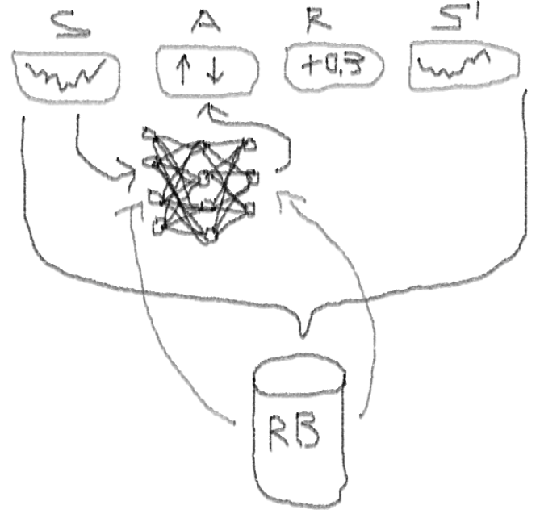
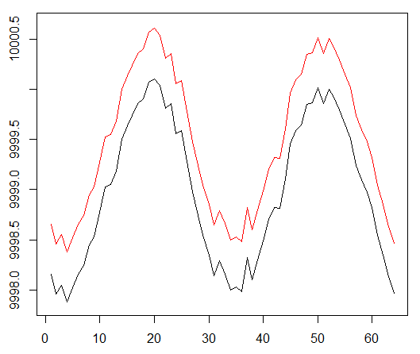
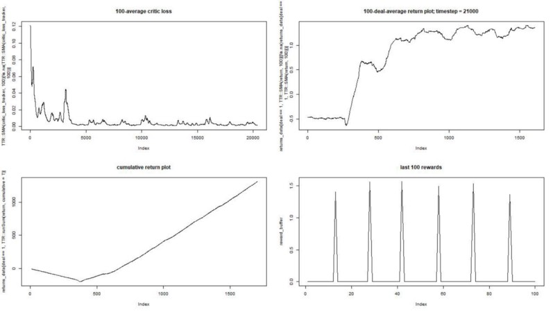
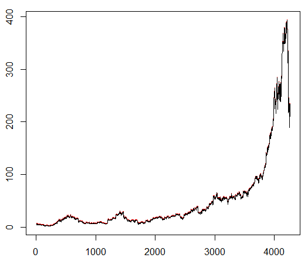
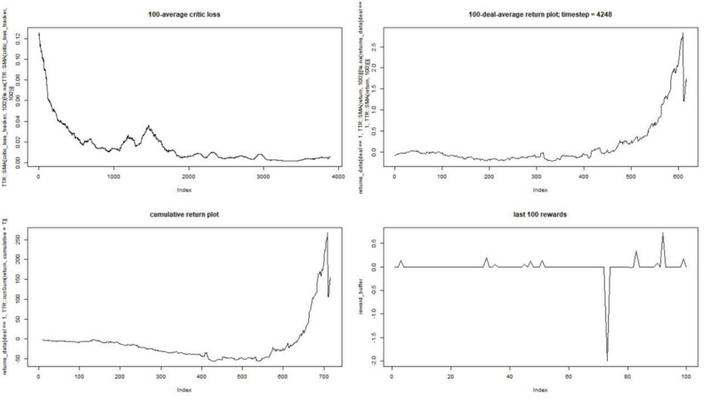
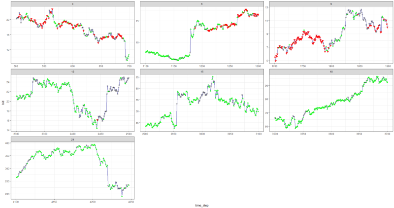

Можно ли обучить с подкреплением агента для торговли на рынке акций? Реализация на языке R

[Alexey_mosc](https://habr.com/ru/users/Alexey_mosc/ "Автор публикации") 14 декабря 2018 в 17:59

*   Tutorial

Давайте создадим прототип агента обучения с подкреплением (RL), который овладеет навыком трейдинга.

Учитывая, что реализация прототипа работает на языке R, я призываю пользователей и программистов R приблизиться к идеям, изложенным в этом материале.

Это перевод моей англоязычной статьи: [Can Reinforcement Learning Trade Stock? Implementation in R.](https://medium.com/@alexeybnk/can-reinforcement-learning-trade-stock-implementation-in-r-8cd54d13165c)

_Хочу предупредить код-хантеров, что в этой заметке есть только код нейронной сети, адаптированной под R._

Если я не отличился хорошим русским языком, укажите на ошибки (текст готовился с подмогой автоматического переводчика).

  

### Введение в проблему

Советую начать погружение в тему с этой статьи: [DeepMind](https://storage.googleapis.com/deepmind-media/dqn/DQNNaturePaper.pdf)

Она познакомит вас с идеей использования Deep Q-Network (DQN) для аппроксимации функции ценности, которая имеют решающее значение в Марковских процессах принятия решений.

Я также рекомендую углубиться в математику с использованием препринта этой книги Ричарда С. Саттона и Эндрю Дж. Барто: [Reinforcement Learning](http://incompleteideas.net/book/bookdraft2017nov5.pdf)

Ниже я представлю расширенную версию оригинального DQN, которая включает в себя больше идей, помогающих алгоритму быстро и эффективно сходиться, а именно:

**Глубокие двойные дуэлирующие зушумленные нейронные сети (Deep Double Dueling Noisy NN)** с приоритетной выборкой из буфера воспроизведения опыта.

Что делает этот подход лучше классического DQN?

*   Двойные: есть две сети, одна из которых обучается, а другая оценивают следующие значения Q
*   Дуэлирующие: есть нейроны, которые явно оценивают ценность и преимущества
*   Шумные: существуют шумовые матрицы, применяемые к весам промежуточных слоев, где средние и стандартные отклонения являются обучаемыми весами
*   Приоритетность выборки: батчи наблюдений из буфера воспроизведения содержат примеры, из-за которых предыдущие тренировки функций приводили к большим остаткам, которые можно сохранить во вспомогательном массиве.

  

#### Ну, а как насчет торговли, совершенной агентом DQN? Это интересная тема как таковая

Есть причины, почему это интересно:

*   Абсолютная свобода выбора представлений состояния, действий, наград и архитектуры NN. Можно обогатить пространство входов всем, что вы считаете достойным попробовать, от новостей до других акций и индексов.
*   Соответствие торговой логики логике обучения подкрепления в том, что: агент совершает дискретные (или непрерывные) действия, вознаграждается редко (после закрытия сделки или истечения периода ), среда частично наблюдаема и может содержать информацию о следующих шагах, торговля является эпизодической игрой.
*   Можно сравнивать результаты DQN с несколькими эталонами, такими как индексы и технические торговые системы.
*   Агент может непрерывно изучать новую информацию и, таким образом, приспосабливаться к изменяющимся правилам игры.

Чтобы не растягивать материал, посмотрите код этой NN, которым я хочу поделиться, поскольку это одна из загадочных частей всего проекта.

#### R-код для ценностной нейронной сети, использующей Keras для построения нашего агента RL

  

**Код**

    
    
    library('keras')
    library('R6')
    
    learning_rate <- 1e-3
    
    state_names_length <- 12 
    
    a_CustomLayer <- R6::R6Class(
              "CustomLayer"
              , inherit = KerasLayer
              , public = list(
                
                call = function(x, mask = NULL) {
                     x - k_mean(x, axis = 2, keepdims = T)
                }
                
         )
    )
    
    a_normalize_layer <- function(object) {
         create_layer(a_CustomLayer, object, list(name = 'a_normalize_layer'))
    }
    
    v_CustomLayer <- R6::R6Class(
         "CustomLayer"
         , inherit = KerasLayer
         , public = list(
              
              call = function(x, mask = NULL) {
                   k_concatenate(list(x, x, x), axis = 2)
              }
              
              , compute_output_shape = function(input_shape) {
                   
                   output_shape = input_shape
                   output_shape[[2]] <- input_shape[[2]] * 3L
                   
                   output_shape
              }
         )
    )
    
    v_normalize_layer <- function(object) {
         create_layer(v_CustomLayer, object, list(name = 'v_normalize_layer'))
    }
    
    noise_CustomLayer <- R6::R6Class(
         "CustomLayer"
         , inherit = KerasLayer
         , lock_objects = FALSE
         , public = list(
            
            initialize = function(output_dim) {
                 self$output_dim <- output_dim
            }
         
           , build = function(input_shape) {
                 
                 self$input_dim <- input_shape[[2]]
                 
                 sqr_inputs <- self$input_dim ** (1/2)
                 
                 self$sigma_initializer <- initializer_constant(.5 / sqr_inputs)
                 
                 self$mu_initializer <- initializer_random_uniform(minval = (-1 / sqr_inputs), maxval = (1 / sqr_inputs))
                 
                 self$mu_weight <- self$add_weight(
                      name = 'mu_weight', 
                      shape = list(self$input_dim, self$output_dim),
                      initializer = self$mu_initializer,
                      trainable = TRUE
                 )
                 
                 self$sigma_weight <- self$add_weight(
                      name = 'sigma_weight', 
                      shape = list(self$input_dim, self$output_dim),
                      initializer = self$sigma_initializer,
                      trainable = TRUE
                 )
                 
                 self$mu_bias <- self$add_weight(
                      name = 'mu_bias', 
                      shape = list(self$output_dim),
                      initializer = self$mu_initializer,
                      trainable = TRUE
                 )
                 
                 self$sigma_bias <- self$add_weight(
                      name = 'sigma_bias', 
                      shape = list(self$output_dim),
                      initializer = self$sigma_initializer,
                      trainable = TRUE
                 )
                 
            }
            
           , call = function(x, mask = NULL) {
                 
                 
                 
                 e_i = k_random_normal(shape = list(self$input_dim, self$output_dim))
                 e_j = k_random_normal(shape = list(self$output_dim))
                 
                 
                 
                 
                 eW = k_sign(e_i) * (k_sqrt(k_abs(e_i))) * k_sign(e_j) * (k_sqrt(k_abs(e_j)))
                 eB = k_sign(e_j) * (k_abs(e_j) ** (1/2))
                 
                 
                 
                 
                 noise_injected_weights = k_dot(x, self$mu_weight + (self$sigma_weight * eW))
                 noise_injected_bias = self$mu_bias + (self$sigma_bias * eB)
                 output = k_bias_add(noise_injected_weights, noise_injected_bias)
                      
                 output
                 
            }
            
           , compute_output_shape = function(input_shape) {
                 
                 output_shape <- input_shape
                 output_shape[[2]] <- self$output_dim
                 
                 output_shape
                 
            }
         )
    )
    
    noise_add_layer <- function(object, output_dim) {
         create_layer(
              noise_CustomLayer
              , object
              , list(
                   name = 'noise_add_layer'
                   , output_dim = as.integer(output_dim)
                   , trainable = T
              )
         )
    }
    
    critic_input <- layer_input(
         shape = c(as.integer(state_names_length))
         , name = 'critic_input'
    )
    
    common_layer_dense_1 <- layer_dense(
         units = 20
         , activation = "tanh"
    )
    
    critic_layer_dense_v_1 <- layer_dense(
         units = 10
         , activation = "tanh"
    )
    
    critic_layer_dense_v_2 <- layer_dense(
         units = 5
         , activation = "tanh"
    )
    
    critic_layer_dense_v_3 <- layer_dense(
         units = 1
         , name = 'critic_layer_dense_v_3'
    )
    
    critic_layer_dense_a_1 <- layer_dense(
         units = 10
         , activation = "tanh"
    )
    
    
    
    
    
    
    critic_layer_dense_a_3 <- layer_dense(
         units = length(acts)
         , name = 'critic_layer_dense_a_3'
    )
    
    critic_model_v <-
         critic_input %>%
         common_layer_dense_1 %>%
         critic_layer_dense_v_1 %>%
         critic_layer_dense_v_2 %>%
         critic_layer_dense_v_3 %>%
         v_normalize_layer
    
    critic_model_a <-
         critic_input %>%
         common_layer_dense_1 %>%
         critic_layer_dense_a_1 %>%
         
         noise_add_layer(output_dim = 5) %>%
         critic_layer_dense_a_3 %>%
         a_normalize_layer
    
    critic_output <-
         layer_add(
              list(
                   critic_model_v
                   , critic_model_a
              )
              , name = 'critic_output'
         )
    
    critic_model_1  <- keras_model(
         inputs = critic_input
         , outputs = critic_output
    )
    
    critic_optimizer = optimizer_adam(lr = learning_rate)
    
    keras::compile(
         critic_model_1
         , optimizer = critic_optimizer
         , loss = 'mse'
         , metrics = 'mse'
    )
    
    train.x <- rnorm(state_names_length * 10)
    
    train.x <- array(train.x, dim = c(10, state_names_length))
    
    predict(critic_model_1, train.x)
    
    layer_name <- 'noise_add_layer'
    
    intermediate_layer_model <- keras_model(inputs = critic_model_1$input, outputs = get_layer(critic_model_1, layer_name)$output)
    
    predict(intermediate_layer_model, train.x)[1,]
    
    critic_model_2 <- critic_model_1
    
    

  

Я использовал этот источник, чтобы адаптировать код Python для шумовой части сети: [github repo](https://github.com/jakegrigsby/keras-rl)

Эта нейронная сеть выглядит так:

Напомним, что в дуэльной архитектуре мы используем равенство (уравнение 1):

Q = A '+ V, где

A '= A — avg (A);

Q = ценность состояния-действия;

V = ценность состояния;

А = преимущество.

Другие переменные в коде говорят сами за себя. Кроме того, эта архитектура хороша только для определенной задачи, поэтому не принимайте ее как должное.

Остальная часть кода, скорее всего, будет достаточно шаблонной для публикации, а для программиста будет интересно написать ее самостоятельно.

А теперь — эксперименты. Тестирование работы агента производилось в песочнице, далекой от реалий торговли на живом рынке, у настоящего брокера.

### Фаза I

Мы запускаем нашего агента против синтетического набора данных. Наша стоимость транзакции равна 0,5:

Результат отличный. Максимальное среднее эпизодическое вознаграждение в этом эксперименте  
должно быть 1,5.

Мы видим: потери критика (так еще называют сеть ценности в подходе актор-критик), среднее вознаграждение за эпизод, накопленное вознаграждение, выборка последних вознаграждений.

### Фаза II

Мы обучаем нашего агента произвольно выбранному биржевому символу, который демонстрирует интересное поведение: ровное начало, быстрый рост в середине и тоскливый конец. В нашем тренировочном наборе около 4300 дней. Стоимость транзакции установлена ​​на уровне 0,1 доллара США (целенаправленно низкая); наградой является USD Прибыль / убыток после закрытия сделки на покупку / продажу 1.0 акции.

Источник: [finance.yahoo.com/quote/algn?ltr=1](https://finance.yahoo.com/quote/algn?ltr=1)

_NASDAQ: ALGN_

После настройки некоторых параметров (оставив архитектуру NN такой же) мы пришли к такому результату:

Получилось не плохо, так как в конце концов агент научился получать прибыль, нажимая три кнопки на своей консоли.

_красный маркер = продать, зеленый маркер = купить, серый маркер = ничего не делать._

Обратите внимание, что на его вершине среднее вознаграждение за эпизод превысило реалистическую стоимость транзакции, с которой можно столкнуться в реальной торговле.

Жаль, что акции падают как сумасшедшие из-за плохих новостей…

### Заключительные замечания

Торговать с помощью RL не только сложно, но и полезно. Когда ваш робот делает это лучше, чем вы, пришло время тратить личное время, чтобы получить образование и здоровье.

Я надеюсь, что это было интересное путешествие для вас. Если вам понравилась эта история, помашите рукой. Если будет много интереса, я могу продолжить и показать вам, как методы градиента политики (policy gradient) работают с использованием языка R и API Keras.

Я также хочу поблагодарить моих друзей, увлеченных нейронными сетями, за советы.

Если у вас остались вопросы — я всегда здесь.

Теги:

*   [обучение с подкреплением](https://habr.com/ru/search/?q=%5B%D0%BE%D0%B1%D1%83%D1%87%D0%B5%D0%BD%D0%B8%D0%B5%20%D1%81%20%D0%BF%D0%BE%D0%B4%D0%BA%D1%80%D0%B5%D0%BF%D0%BB%D0%B5%D0%BD%D0%B8%D0%B5%D0%BC%5D&target_type=posts)
*   [R](https://habr.com/ru/search/?q=%5BR%5D&target_type=posts)