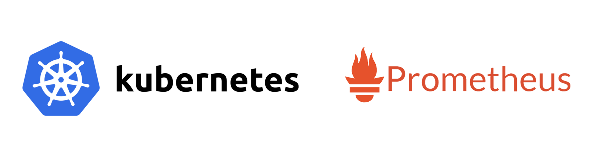
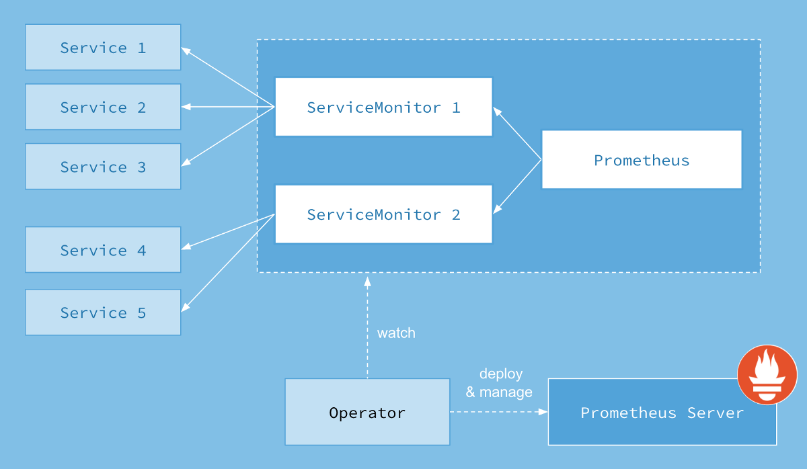
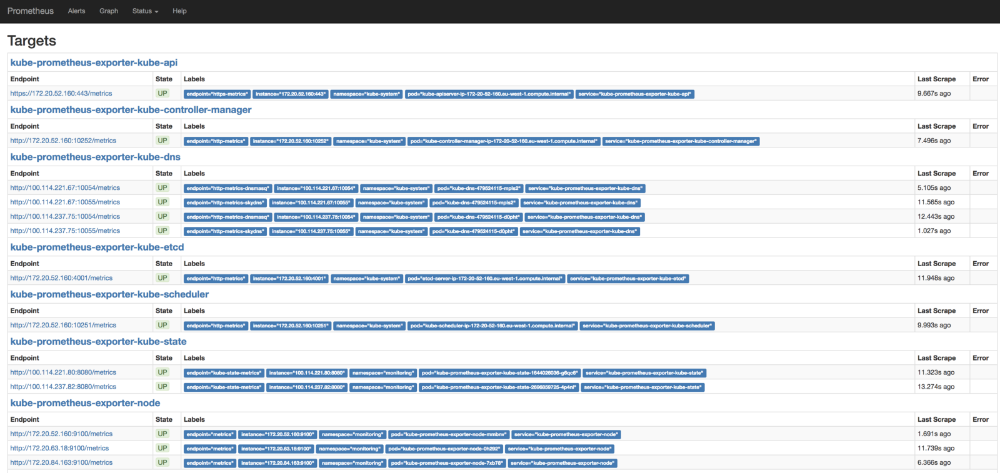
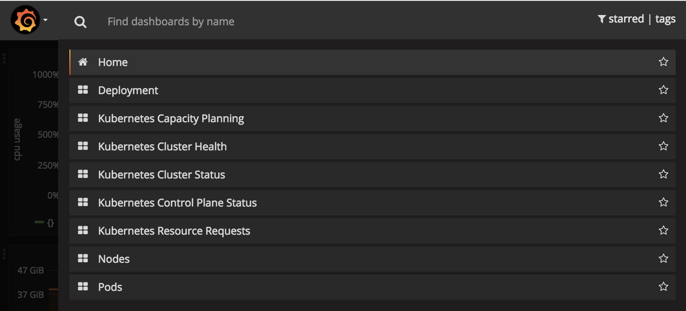
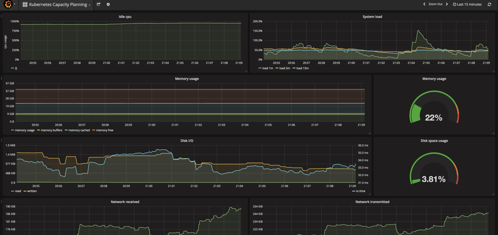

Мониторинг с Prometheus в Kubernetes за 15 минут / Блог компании Флант

_**Прим. перев.**: Автор статьи Giancarlo Rubio — DevOps-инженер из ИТ-компании LINKIT (Нидерланды) — через онлайн-ресурс [ITNEXT](https://itnext.io/) делится лаконичным рецептом по настройке мониторинга с Prometheus в Kubernetes с помощью Prometheus Operator. Инструкция появилась как следствие недавнего опыта выбора и внедрения системы проактивного мониторинга после миграции проекта с bare metal на облачную инфраструктуру. Рецепт отлично подходит для быстрого теоретического (первая половина статьи) и практического (вторая половина) знакомства. Для некоторых команд исправлены URL'ы, которые в оригинальном материале, по всей видимости, были преобразованы движком medium._

Мониторинг кластера K8s поможет вашей команде в реализации:

*   проактивного мониторинга,
*   отображения видимости кластера и планирования его занятости/производительности,
*   уведомлений о срабатывании триггеров и предупреждений (alerts),
*   панелей с метриками.

Не так давно компания CoreOS выпустила [Prometheus Operator](http://github.com/coreos/prometheus-operator), который отлично соответствовал моим потребностям, упрощая всю начальную конфигурацию.

## Kubernetes Operator

  

> «Операторами (Operators) мы называем новый класс программного обеспечения. Оператор — специфичный для приложения контроллер, расширяющий Kubernetes API возможностями создания и конфигурации экземпляров сложных stateful-приложений, а также управления ими от имени пользователя Kubernetes. Оператор основан на концепциях ресурса и контроллера в Kubernetes и добавляет к ним знания из определенной области или специфичных для приложения для автоматизации основных задач».  
> _— Brandon Philips из CoreOS._  

Операторы для Kubernetes [были представлены](https://coreos.com/blog/introducing-operators.html) в 2016 году и предлагают возможность абстрагировать разворачивание и конфигурацию приложений. Сам я успел активно поработать с [elasticsearch-operator](http://github.com/upmc-enterprises/elasticsearch-operator/) и [prometheus-operator](https://github.com/coreos/prometheus-operator/). Подробное описание операторов для Kubernetes не входит в задачи статьи, а всем заинтересованным предлагаю ознакомиться со списком других доступных операторов [здесь](https://github.com/coreos/awesome-kubernetes-extensions).

_**Прим. перев.**: подробнее об операторах для Kubernetes и их использовании для работы со stateful-приложениями мы писали в [этой статье](https://habrahabr.ru/company/flant/blog/326414/)._

## Prometheus

[Prometheus](http://prometheus.io/) — набор утилит с открытым кодом для мониторинга и уведомлений (alerts), созданный под вдохновением от [Google Borg](https://research.google.com/pubs/pub43438.html) Monitor. Его разработку начинали в SoundCloud, а затем передали в фонд CNCF. _(**Прим. перев.**: об истории появления Prometheus мы недавно писали в [этой статье](https://habrahabr.ru/company/flant/blog/339724/).)_

Prometheus поддерживает приложения на [многих языках](https://prometheus.io/docs/instrumenting/clientlibs/) программирования. Будучи отличным решением для мониторинга инфраструктуры и приложений, он также предлагает готовую интеграцию для подключения известных приложений (включая PostgreSQL, MySQL, AWS Cloudwatch, etcd, K8s и т.п.) в виде [exporters](https://prometheus.io/docs/instrumenting/exporters/).

## Prometheus Operator

  

> «Миссия Prometheus Operator — сделать запуск Prometheus поверх Kubernetes максимально простым, сохранив конфигурируемость и осуществляя конфигурацию в родном для Kubernetes виде».  
> _— [Getting Started Guide](https://coreos.com/operators/prometheus/docs/latest/user-guides/getting-started.html) по Prometheus Operator._  

Prometheus Operator предлагает простой мониторинг для сервисов и deployments в K8s, а также управление настройками Prometheus, Alertmanager и Grafana _(подробнее о них — см. ниже)_.

### Как это работает?

  
_Архитектура Prometheus Operator. Источник: [GitHub](https://raw.githubusercontent.com/coreos/prometheus-operator/master/Documentation/user-guides/images/architecture.png)_

Когда вы разворачиваете новую версию приложения, K8s создаёт новый под и, когда этот под готов, уничтожает старый. Prometheus постоянно [отслеживает](https://kubernetes.io/docs/api-reference/v1.6/#watch-30) Kubernetes API и, когда обнаруживает изменения, создаёт новую конфигурацию Prometheus, руководствуясь изменениями в службах (подах).

### ServiceMonitor

Prometheus Operator использует [Custom Resource Definition](https://kubernetes.io/docs/concepts/api-extension/custom-resources/) (CRD) под названием [ServiceMonitor](https://github.com/coreos/prometheus-operator/blob/master/Documentation/api.md#servicemonitorspec), чтобы абстрагировать конфигурацию. В примере ниже можно увидеть, как с помощью ServiceMonitor мониторить под с nginx. ServiceMonitor выбирает под с nginx с помощью [селектора matchLabels](https://github.com/coreos/prometheus-operator/blob/8384c90c455d18e02ecd26ccfe1738a0c8865407/Documentation/api.md#servicemonitorspec). Prometheus Operator ищет поды, соответствующие селектору лейбла, и создаёт целевой объект, с которого Prometheus будет собирать метрики.

    apiVersion: monitoring.coreos.com/v1
    kind: ServiceMonitor
    metadata:
      name: nginx
    spec:
      selector:
        matchLabels:
          app: nginx
      namespaceSelector:
        matchNames:
        - default
      endpoints:
      - port: web
    interval: 30s

  

## Пробуем сами

Дальнейшая инструкция может быть выполнена менее чем за 15 минут, если у вас уже есть:

1.  Поднятый и работающий кластер Kubernetes.
2.  Установленный и работающий [Helm](https://github.com/kubernetes/helm/blob/master/docs/install.md).
3.  `helm list`.

  

### Установка

1\. Создайте пространство имён и склонируйте Git-репозиторий prometheus-operator:

    $ kubectl create ns monitoring
    $ git clone https://github.com/coreos/prometheus-operator.git
    $ cd prometheus-operator

2\. Установите prometheus-operator deployment:

    $ helm install --name prometheus-operator \ 
      --set rbacEnable=true --namespace=monitoring helm/prometheus-operator

3\. Установите Prometheus и Alertmanager specs, а также Grafana deployment:

    $ helm install --name prometheus --set serviceMonitorsSelector.app=prometheus \ 
      --set ruleSelector.app=prometheus --namespace=monitoring helm/prometheus
    $ helm install --name alertmanager --namespace=monitoring helm/alertmanager
    $ helm install --name grafana --namespace=monitoring helm/grafana

4\. Установите [kube-prometheus](https://github.com/coreos/prometheus-operator/tree/master/contrib/kube-prometheus), чтобы загрузить предопределённые k8s exporters и serviceMonitors:

    $ helm install --name kube-prometheus --namespace=monitoring helm/kube-prometheus

Если всё прошло успешно, можно запустить эту команду для вывода списка приложений:

    $ kubectl get pods -n monitoring
    NAME                                                      READY     STATUS    RESTARTS   AGE
    alertmanager-alertmanager-0                               2/2       Running   0          3m
    grafana-grafana-3066287131-brj8n                          2/2       Running   0          4m
    kube-prometheus-exporter-kube-state-2696859725-s8m56      2/2       Running   0          3m
    kube-prometheus-exporter-node-029w0                       1/1       Running   0          3m
    kube-prometheus-exporter-node-n3txz                       1/1       Running   0          3m
    kube-prometheus-exporter-node-q2rk3                       1/1       Running   0          3m
    prometheus-operator-prometheus-operator-514889780-qm3fp   1/1       Running   0          4m
    prometheus-prometheus-0                                   2/2       Running   0          3m

  

### Prometheus

Пробросьте сервер Prometheus на свой компьютер, чтобы получить доступ к панели через `http://localhost:9090`:

    $ kubectl port-forward -n monitoring prometheus-prometheus-0 9090

В панели Prometheus можно делать запросы к метрикам, просматривать предопределённые уведомления и целевые объекты Prometheus.

**Обратите внимание**: Если какие-то цели возвращают ошибку недоступности, проверьте группы безопасности и правила firewall. Если у вас нет целей, представленных на скриншоте выше, проверьте лейблы подов K8s, т.к. иногда утилиты, используемые для деплоя кластера, не ставят их.

**Обратите внимание (№2)**: В проекте prometheus-operator работают над упаковкой стандартных уведомлений для K8s в Helm chart. Однако сейчас для их загрузки требуется выполнить последовательность из команд ниже (в будущем эта необходимость пропадёт):

    $ sed -ie 's/role: prometheus-rulefiles/app: prometheus/g' contrib/kube-prometheus/manifests/prometheus/prometheus-k8s-rules.yaml
    $ sed -ie 's/prometheus: k8s/prometheus: prometheus/g' contrib/kube-prometheus/manifests/prometheus/prometheus-k8s-rules.yaml
    $ sed -ie 's/job=\"kube-controller-manager/job=\"kube-prometheus-exporter-kube-controller-manager/g' contrib/kube-prometheus/manifests/prometheus/prometheus-k8s-rules.yaml
    $ sed -ie 's/job=\"apiserver/job=\"kube-prometheus-exporter-kube-api/g' contrib/kube-prometheus/manifests/prometheus/prometheus-k8s-rules.yaml
    $ sed -ie 's/job=\"kube-scheduler/job=\"kube-prometheus-exporter-kube-scheduler/g' contrib/kube-prometheus/manifests/prometheus/prometheus-k8s-rules.yaml
    $ sed -ie 's/job=\"node-exporter/job=\"kube-prometheus-exporter-node/g' contrib/kube-prometheus/manifests/prometheus/prometheus-k8s-rules.yaml
    $ kubectl apply -n monitoring -f contrib/kube-prometheus/manifests/prometheus/prometheus-k8s-rules.yaml

  

### Grafana

Для отладочных целей у Prometheus есть [expression browser](https://prometheus.io/docs/visualization/browser/). Чтобы получить красивую панель, воспользуйтесь Grafana со встроенной возможностью выполнять запросы в Prometheus.

**Обратите внимание**: В проекте prometheus-operator работают над созданием [простого deployment](https://github.com/coreos/prometheus-operator/issues/115) для Grafana, вероятно, с использованием нового [CRD](https://kubernetes.io/docs/concepts/api-extension/custom-resources/#customresourcedefinitions). На данный момент для её настройки требуется выполнить следующие команды (в будущем эта необходимость пропадёт):

    $ sed -ie 's/grafana-dashboards-0/grafana-grafana/g' https://raw.githubusercontent.com/coreos/prometheus-operator/master/contrib/kube-prometheus/manifests/grafana/grafana-dashboards.yaml
    $ sed -ie 's/prometheus-k8s.monitoring/prometheus-prometheus.monitoring/g' https://raw.githubusercontent.com/coreos/prometheus-operator/master/contrib/kube-prometheus/manifests/grafana/grafana-dashboards.yaml
    $ kubectl apply -n monitoring -f https://raw.githubusercontent.com/coreos/prometheus-operator/master/contrib/kube-prometheus/manifests/grafana/grafana-dashboards.yaml
    $ kubectl port-forward -n monitoring $(kubectl get pods --selector=app=grafana-grafana -n monitoring --output=jsonpath={.items..metadata.name})  3000

Подождите несколько секунд, пока Grafana загрузит данные, откройте `http://localhost:3000` в браузере и изучайте замечательные графики!

  
_Grafana: доступные dashboards для  Kubernetes_

  
_Grafana: графики для планирования занятости/производительности  Kubernetes_

### Alertmanager

[Alertmanager](https://prometheus.io/docs/alerting/alertmanager/) обслуживает уведомления, отправляемые клиентскими приложениями вроде сервера Prometheus. Он обеспечивает устранение дублей, группировку, отправку в правильный сервис-получатель вроде электронной почты, PagerDuty или OpsGenie. Также он отвечает за заглушение _(silence)_ и подавление _(inhibit)_ уведомлений.

Мы уже установили Alertmanager командами выше, и осталось пробросить порт сервиса на ваш компьютер, после чего можно будет открывать `http://localhost:9093` в веб-браузере:

    $ kubectl port-forward -n monitoring alertmanager-alertmanager-0 9093

  

## Готово

Все компоненты K8s добавлены в мониторинг. Рекомендую также посмотреть [это видео](https://www.youtube.com/watch?v=5Jr1v9mWnJc) на YouTube, чтобы лучше разобраться с тем, как работает prometheus-operator.

## P.S. от переводчика

Автор также обещает рассказать в своей следующей статье о настройке уведомлений с использованием Alertmanager. Её появления можно ожидать [здесь](https://itnext.io/@gianrubio).

Читайте также в нашем блоге:

*   «[Мониторинг и Kubernetes (обзор и видео доклада)](https://habr.com/company/flant/blog/412901/)»;
*   «[Наш опыт с Kubernetes в небольших проектах](https://habrahabr.ru/company/flant/blog/331188/)» _(видео доклада, включающего в себя знакомство с техническим устройством Kubernetes);_
*   «[Начало работы в Kubernetes с помощью Minikube](https://habrahabr.ru/company/flant/blog/333470/)» _(перевод)_;
*   «[Истории успеха Kubernetes в production. Часть 4: SoundCloud (авторы Prometheus)](https://habrahabr.ru/company/flant/blog/339724/)».