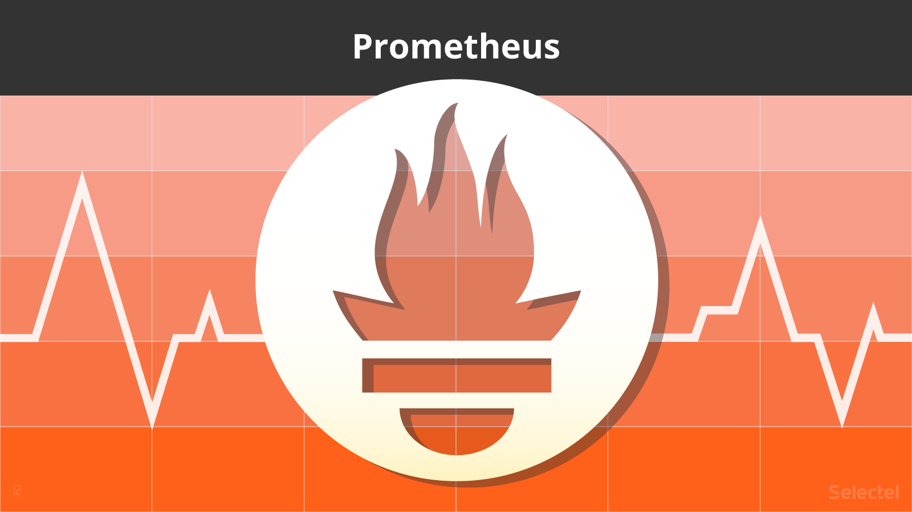
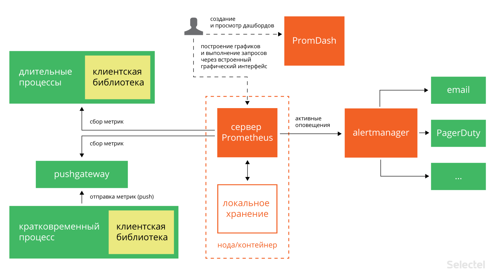
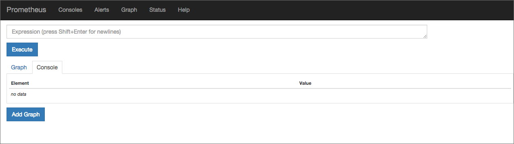
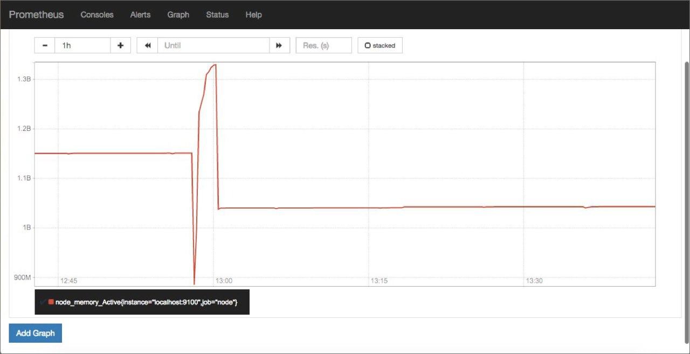
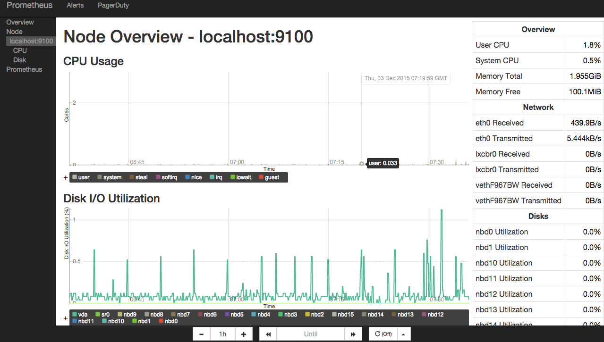

Мониторинг сервисов с Prometheus / Блог компании Selectel

В предыдущих публикациях мы уже затрагивали вопросы мониторинга и сбора метрик. В сегодняшней статье мы хотели бы вернуться к этой теме и рассказать об интересном инструменте под названием [Prometheus](http://www.prometheus.io/). Он был создан в 2012 году в качестве внутренней системы мониторинга небезызвестного проекта [SoundCloud](https://soundcloud.com/), но впоследствии получил более широкое распространение.  

Prometheus — инструмент совсем новый (первый публичный релиз состоялся в начале 2015 года), и на русском языке публикаций о нём пока почти что нет (несколько месяцев назад была опубликована [статья в журнале «Хакер»](https://xakep.ru/2015/09/25/prometheus-monitoring/), но она доступна только подписчикам).

Разработчики SoundCloud отмечают (см. подробный доклад [здесь](https://www.usenix.org/conference/srecon15europe/program/presentation/rabenstein)), что новый инструмент мониторинга понадобился им в связи с переходом к микросервисной архитектуре. Рост интереса к микросервисам — одна из характерных тенденций последних нескольких лет.  
С точки зрения микросервисного подхода приложение пониматеся не как монолит, а как набор сервисов. Каждый из этих сервисов работает в своём процессе и взаимодействует с окружением при помощи простого механизма (как правило, через протокол HTTP).

Мониторинг микросервисов — задача непростая: в режиме реального времени нужно отслеживать как состояние отдельных компонентов, так и состояние системы в целом. Задача усложняется, если помимо технических нужно проверять ещё и бизнес-значимые показатели. Как отмечают сами разработчики Prometheus в многочисленных статьях и докладах, с помощью имеющихся систем мониторинга её решить проблематично. Поэтому они создали собственный инструмент.

Prometheus представляет собой комплексное решение, в состав которого входят и фреймворк для мониторинга, и собственная темпоральная база данных. В некоторых обзорах его даже называют «[системой мониторинга нового поколения](http://www.boxever.com/prometheus-a-next-generation-monitoring-system)».  
Публикации о Prometheus нас заинтересовали, и мы решили познакомиться с этим инструментом поближе.

## Архитектура Prometheus

В состав Prometheus входят следующие компоненты:

*   сервер, который считывает метрики и сохраняет их в темпоральной (time series) базе данных;
*   клиентские библиотеки для различных языков программирования (Go, Java, Python, Ruby; сообществом также созданы библиотеки для Bash, Node.js, Haskell, .NET/C#);
*   Pushgateway — компонент для приёма метрик кратковременных процессов;
*   PROMDASH — дашборд для метрик;
*   инструменты для экспорта данных из сторонних приложений (Statsd, Ganglia, HAProxy и других);
*   менеджер уведомлений AlertManager (на текущий момент находится на стадии бета-тестирования);
*   [клиент командной строки для выполнения запросов к данным](https://github.com/prometheus/prometheus_cli).

Большинство из них написаны на Go, а совсем небольшая часть — на Ruby и Java.  
Все компоненты Prometheus взаимодействуют между собой по протоколу HTTP:

Главный компонент всей системы — сервер Prometheus. Он работает автономно и сохраняет все данные в локальной базе данных. Обнаружение сервисов происходит автоматически. Это упрощает процедуру развёртывания: для наблюдения за одним сервисом не нужно разворачивать распределённую систему мониторинга; достаточно установить только сервер и необходимые компоненты для сбора и экспорта метрик. Таких компонентов, «заточенных» под конкретные сервисы, уже создано довольно много: для Haproxy, MySQL, PostrgreSQL и другие (полный список см. [здесь](http://prometheus.io/docs/instrumenting/exporters/), а также на [GitHub](https://github.com/prometheus)).

Сбор метрик в Prometheus осуществляется с помощью механизма pull. Имеется также возможность сбора метрик с помощью механизма push (для этого используется специальный компонент [pushgateway](http://prometheus.io/docs/instrumenting/pushing/), который устанавливается отдельно). Это может понадобиться в ситуациях, когда сбор метрики с помощью pull по тем или иным причинам невозможен: например, при наблюдении за сервисами, защищёнными фаерволлом. Также механизм push может оказаться полезным при наблюдении за сервисами, подключающихся к сети периодически и на непродолжительное время.

Prometheus хорошо подходит для сбора и анализа данных, представленных в виде временных рядов (time series). Все метрики он хранит в собственной темпоральной БД (её сравнение с OpenTSDB и InfluxDB см. [здесь](http://www.boxever.com/prometheus-a-next-generation-monitoring-system)); для хранения индексов используется LevelDB.

## Модель данных

Prometheus хранит данные в виде временных рядов — наборов значений, соотнесённых с временной меткой (timestamp).

Элемент временного ряда (измерение) состоит из имени метрики, временной метки и пары «ключ — значение». Временные метки имеют точность до миллисекунд, значения представлены с 64-битной точностью.

Имя метрики указывает на параметр системы, о котором собираются данные. Например, у метрики с информацией о количестве HTTP-запросов к некоему API имя может выглядеть так: api\_http\_requests_total. Временной ряд в такой метрике может хранить информацию о обо всех GET-запросах на адрес /api/tracks, на которые был отдан ответ с кодом 200. Этот временной ряд можно представить в виде следующей нотации:

    api_http_requests_total{method="GET", endpoint="/api/tracks", status="200"}
    

Модель данных, используемая в Prometheus, напоминает ту, что используется в OpenTSDB. У всех метрик есть имя, но оно может быть одним и тем же у нескольких рядов.  
При этом каждый временной ряд должен быть помечен хотя бы одним тэгом. Измерения для одного тэга хранятся последовательно, что обеспечивает быструю агрегацию данных.  
Поддерживаются следующие типы метрик:

*   **счётчик** (counter) — хранит значения, которые увеличиваются с течением времени (например, количество запросов к серверу);
*   **шкала** (gauge) — хранит значения, которые с течением времени могут как увеличиваться, так и уменьшаться (например, объём используемой оперативной памяти или количество операций ввода-вывода);
*   **гистограмма** (histogram) — хранит информацию об изменении некоторого параметра в течение определённого промежутка (например, общее количество запросов к серверу в период с 11 до 12 часов и количество запросов к этому же серверов в период с 11.30 до 11.40);
*   **сводка результатов** (summary) — как и гистограмма, хранит информацию об изменении значения некоторого параметра за временной интервал, но также позволяет рассчитывать квантили для скользящих временных интервалов.

## Установка

Рассмотрим теперь практические аспекты использования Prometheus. Начнём с описания процедуры установки.  
Совсем недавно Prometheus был включён в официальные репозитории Debian 8 и Ubuntu 15.10.  
В Ubuntu 14.04 его тоже можно установить при помощи стандартного менеджера пакетов. Естественно, для этого понадобится подключить соответствующий репозиторий:

    $ echo 'deb http://deb.robustperception.io/ precise nightly' > /etc/apt/sources.list
    $ wget https://s3-eu-west-1.amazonaws.com/deb.robustperception.io/41EFC99D.gpg 
    $ sudo apt-key add 41EFC99D.gpg 
    $ sudo apt-get update
    $ sudo apt-get install prometheus node-exporter alertmanager
    

С помощью приведённых команд мы установили сервер Prometheus, а также дополнительные компоненты — node\_exporter и alertmanager. Node\_exporter собирает данные о состоянии сервера, а alertmanager (о нём мы более подробно поговорим ниже) — рассылает уведомления в случае выполнения или невыполнения заданных условий.

Установка завершена, но остался ещё один маленький штрих: нужно сделать так, чтобы node_exporter постоянно собирал метрики в фоновом режиме. Для этого сначала создадим символическую ссылку в /usr/bin:

    $ sudo ln -s ~/Prometheus/node_exporter/node_exporter /usr/bin
    

Затем создадим файл /etc/init/node_exporter.conf и добавим в него следующие строки:

    
    
    start on startup
    
    script
       /usr/bin/node_exporter
    end script
    

Сохраним внесённые изменения и выполним команду:

    $ sudo service node_exporter start
    

В дистрибутивах, перешедших на systemd (например, в Ubuntu 15.10), для запуска node\_exporter в фоновом режиме нужно создать файл /etc/systemd/system/node\_exporter.service и добавить в него следующие строки:

    [Unit]
    Description=Node Exporter
    
    [Service]
    ExecStart=/usr/sbin/node_exporter
    Restart=Always
    
    [Install]
    WantedBy=default.target
    

Сохранив внесённые изменения, нужно выполнить команды:

    $ sudo systemctl enable node_exporter.service
    $ sudo systemctl start node_exporter
    

## Конфигурирование

Настроек Prometheus по умолчанию вполне достаточно, чтобы следить за всем происходящим на локальной машине. Дополнительные настройки в случае необходимости всегда можно прописать в конфигурационном файле /etc/prometheus/prometheus.yml. Рассмотрим его структуру более подробно. Начинается он с секции globals:

    global:
      scrape_interval: 15s
      evaluation_interval: 15s
      rule_files:
    

Она включает следующие параметры:

*   scrape_interval — интервал сбора метрик (по умолчанию — 15 секунд);
*   evaluation_interval — интервал сверки с правилами (по умолчанию — 15 секунд);
*   rule_files — файлы правил (речь о них пойдёт ниже).

Далее следует секция scrape_configs с базовыми настройками сбора метрик на сервере:

    scrape_configs:
      - job_name: "prometheus"
      - scrape_interval: "15s"
    target_groups:
        - targets:
           - "localhost:9090"
    

Она включает следующие обязательные параметры:

*   job_name — имя задачи;
*   scrape_interval — интервал сбора метрик (в приведённом примере — каждые 15 секунд);
*   target_groups — сервисы и группы сервисов, для которых нужно собирать метрики.

В этой же секции можно прописать дополнительные настройки:

*   scrape_timeout — время ожидания данных;
*   metrics_path — HTTP-ресурс, на который будут передаваться метрики;
*   scheme — протокол, который будет использоваться для передачи метрик;
*   basic_auth — реквизиты для авторизации на сервере, с которого будут собираться метрики (username:, password:).

Выше мы уже упомянули о том, что в конфигурационном файле можно ссылать на файлы правил. Правила помогают предварительно вычислять наиболее часто используемые или требующие значительных затрат ресурсов параметры и сохранять их в виде новых временных рядов. Осуществлять поиск по предварительно рассчитанным параметрам значительно проще, чем при каждом запросе заново вычислять их значения. Это может оказаться полезным, например, при работе с дашбордами, которые запрашивают значения параметров при каждом обновлении.

В общем виде синтаксис правил можно представить так:

    <имя временного ряда>{метки} = <параметр для записи>
    

Приведём более конкретные и понятные примеры:

    job:http_inprogress_requests:sum = sum(http_inprogress_requests) by (job)
    
    new_time_series{label_to_change="new_value",label_to_drop=""} = old_time_series
    

Prometheus сверяется с правилами с определённой периодичностью, указанной в конфигурационном файле в параметре evaluation_interval). После каждой сверки Prometheus пересчитывает значение параметра и сохраняет его под новым именем с текущей временной меткой.  
Итак, структуру и синтаксис конфигурационного файла мы в общих чертах рассмотрели. Чтобы прописанные настройки вступили в силу, нужно выполнить следующую команду (вместо path/to/prometheus.yml указываем путь к конфигурационному файлу):

    $ prometheus -config.file “path/to/prometheus.yml”
    

## Веб-интерфейс

Веб-интерфейс Prometheus будет доступен в браузере по адресу: http://\[IP-адрес сервера\]:9090:

В поле Expression можно выбрать метрику, для которой будет отображаться график. Попробуем отследить, например, объём активной памяти на сервере. Выбираем метрику node\_memory\_active и нажимаем на кнопку Execute:

  
Над графиком расположены кнопки, с помощью которых можно выбирать период для отображения статистики.

## Шаблоны консолей

Основную консоль Prometheus мы только что рассмотрели. Для просмотра более специализированных графиков используются кастомные консоли.  
На сервере они хранятся в директории /еtc/prometheus/consoles. Кастомные консоли отображают общую статистику сервера (node.html), статистику СPU (node-cpu.html), статистику операций ввода-вывода на сервере (cpu-disk.html) и другие. В браузере они доступны по адресу: http://\[IP адрес сервера\]:9090/consoles/&lt;имя консоли&gt;.html.  
Вот так, например, выглядит консоль node.html:

Если вам не подходит ни одна из имеющихся консолей, вы можете создать собственную консоль, которая будет отображать нужную вам статистику. Для написания консолей в Prometheus используется HTML-шаблонизатор Go. Подробные инструкции по созданию кастомных консолей приведены [в официальной документации](http://prometheus.io/docs/visualization/consoles/).  
А если вас по тем или иным причинам не устраивают имеющиеся консоли, вы можете интегрировать Prometheus [с популярным инструментом Grafana](http://prometheus.io/docs/visualization/grafana/).

Разработчики Prometheus создали и собственный инструмент для создания дашбордов под названием [Promdash](http://prometheus.io/docs/visualization/promdash/) (см. также [репозиторий на GitHub](https://github.com/prometheus/promdash)), по интерфейсу напоминающий Grafana. На наш взгляд, он ещё находится в несколько «сыром» состоянии, и рекомендовать его к использованию пока что рано.

## Alertmanager: настройка уведомлений

Ни один инструмент мониторинга немыслим без компонента для рассылки уведомлений. В Prometheus для этой цели используется alertmanager. Настройки уведомлений хранятся в конфигурационном файле alertmanager.conf.  
Рассмотрим следующий фрагмент:

    notification_config {
      name: "alertmanager_test"
      email_config {
        email: "test@example.org"
      }
    
    aggregation_rule {
      notification_config_name: "alertmanager_test"
    }
    

Его синтаксис вполне понятен: мы указали, что уведомления при наступлении определённого условия нужно отправлять по электронной почте на адрес test@example.org.

В конфигурационный файл можно добавлять ссылки на файлы правил (по сути они ничем не отличаются от файлов правил для сбора метрик, описанных выше). В правилах прописываются условия, при которых нужно отправлять уведомления.

В общем виде синтаксис правила выглядит так:

    ALERT <имя проверки>
      IF <параметр и его значение>
      FOR <период времени>
      WITH <набор меток>>
      SUMMARY "<краткое описание>"
      DESCRIPTION "<образец уведомления>"
    

Рассмотрим функции правил на более конкретных примерах.  
Пример1:

    ALERT InstanceDown
      IF up == 0
      FOR 5m
      WITH {
        severity="page"
      }
      SUMMARY "Instance {{$labels.instance}} down"
      DESCRIPTION "{{$labels.instance}} of job {{$labels.job}} has been down for more than 5 minutes."
    

Это правило указывает, что уведомление нужно отправлять в случае, если некоторый инстанс недоступен в течение 5 минут и более.

Пример2:

    ALERT ApiHighRequestLatency
      IF api_http_request_latencies_ms{quantile="0.5"} > 1000
      FOR 1m
      SUMMARY "High request latency on {{$labels.instance}}"
      DESCRIPTION "{{$labels.instance}} has a median request latency above 1s (current value: {{$value}})"
    

Согласно этому правилу, уведомления нужно посылать, как только среднее время ответа на запросы к API превысит 1 мс.

Чтобы прописанные в конфигурационном файле настройки вступили в силу, нужно сохранить его и выполнить команду:

    $ alertmanager -config.file alertmanager.conf
    

Можно создать несколько конфигурационных файлов и прописать в них настройки уведомлений для различных случаев.

Уведомления Prometheus отправляет в формате JSON. Выглядят они примерно так:

    {
       "version": "1",
       "status": "firing",
       "alert": [
          {
             "summary": "summary",
             "description": "description",
             "labels": {
                "alertname": "TestAlert"
             },
             "payload": {
                "activeSince": "2015-06-01T12:55:47.356+01:00",
                "alertingRule": "ALERT TestAlert IF absent(metric_name) FOR 0y WITH ",
                "generatorURL": "http://localhost:9090/graph#%5B%7B%22expr%22%3A%22absent%28metric_name%29%22%2C%22tab%22%3A0%7D%5D",
                "value": "1"
             }
          }
       ]
    }
    

Отправка уведомлений осуществляется по электронной почте, через веб-хук, а также с помощью специализированных сервисов: [PagerDuty](http://www.pagerduty.com/), [HipChat](https://www.hipchat.com/) и других.  
Разработчики Prometheus отмечают, что пока что alertmanager находится в «сыром» состоянии и предупреждают о возможных ошибках. Впрочем, мы никаких аномалий в работе этого компонента не заметили.

## Заключение

Prometheus — инструмент достаточно интересный и перспективный, и на него стоит обратить внимание. В числе его преимуществ нужно в первую очередь выделить:

*   простоту развертывания;
*   широкие возможности интеграции со сторонними приложениями и сервисами;
*   удобный графический интерфейс для работы с метриками.

Если у вас уже есть практический опыт использования Prometheus, поделитесь впечатлениями. Будем благодарны за любые полезные замечания и дополнения.

Для желающих узнать больше приводим несколько полезных ссылок:

*   [https://developers.soundcloud.com/blog/prometheus-monitoring-at-soundcloud](https://developers.soundcloud.com/blog/prometheus-monitoring-at-soundcloud) — статья о Prometheus из блога SoundCloud;
*   [http://www.robustperception.io/blog/](http://www.robustperception.io/blog/) — блог одного из разработчиков Prometheus Брайана Брэзила с интересными практическими примерами;
*   [http://agiletesting.blogspot.ru/2015/11/initial-experiences-with-prometheus.html](http://agiletesting.blogspot.ru/2015/11/initial-experiences-with-prometheus.html) — любопытный отчёт об экспериментах с Prometheus;
*   [https://www.digitalocean.com/community/tutorials/how-to-install-prometheus-using-docker-on-centos-7](https://www.digitalocean.com/community/tutorials/how-to-install-prometheus-using-docker-on-centos-7) — инструкция по установке Prometheus в Docker
*   [https://github.com/William-Yeh/ansible-prometheus](https://github.com/William-Yeh/ansible-prometheus) — роль Ansible для установки Prometheus.

Если вы по тем или иным причинам не можете оставлять комментарии здесь — приглашаем в [наш блог](https://blog.selectel.ru/monitoring-servisov-s-prometheus/).