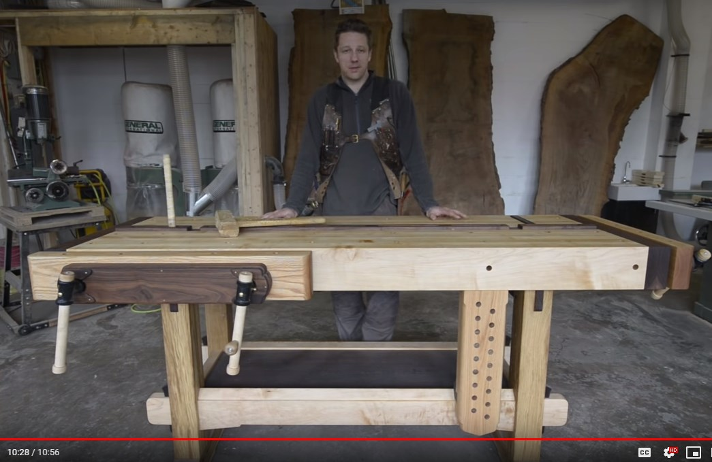

Моя подборка с Youtube на тему DIY

На идею сделать такую подборку меня косвенно подтолкнул недавний пост о создании стола, а точнее обсуждения к нему. Думая над каким-то ответом на вопрос, я порылся в своих подписках, и понял, что только деревообработке уже посвящены несколько десятков из них. И некоторыми хочется непременно поделиться.

В итоге вашему вниманию предлагается моя подборка подписок на каналы Youtube, которые посвящены теме DIY в широком смысле слова, а по большей части — деревообработке, то есть столярному и плотницкому мастерству. Большую часть каналов я постарался прокомментировать. Порядок, в котором каналы приведены, в значительной степени случайный, хотя я пытался ставить наиболее интересные для меня каналы ближе к началу.

Список ни в малейшей степени не претендует на полноту. В частности, я опустил многие каналы условно «строительного» профиля, которые содержат ролики по столярному делу, но при этом остальные ролики там например о штукатурке, укладке плитки или работе с гипсокартоном.

Ну и раз уж началось все со стола, то красной нитью через весь обзор будут проходить именно столы.

  

Начнем мы с русскоязычного сегмента. Мне кажется, что тут есть весьма интересные ресурсы по теме, хотя их возможно не так много, как в youtube англоязычном.

## Мастера на все руки

Канал [HeARTwood](https://www.youtube.com/channel/UC8gbUkfhMi1Got0rMD2s7TA) Михаила Кучука — это пожалуй то, с чего стоит начинать. Это не только дерево, Михаил разбирается очень во многом, включая например слесарку, сварку, токарное дело, резьбу по кости.

Тут найдется видео на любой вкус, начиная от подробнейших обзоров инструмента (включая ремонт, настройку и доработку), мастер классы, описание множества самодельных приспособлений. Подробнейшим образом рассмотрены такие классы инструмента, как пилы (начиная от ручных и кончая скажем торцовочными), рубанки, фрезеры, и многое другое.

Обещали стол? Вот вам стол, в этом случае — [фрезерный](https://www.youtube.com/watch?v=HMU7aMOJ_-E).

[Канал Владимира Власова](https://www.youtube.com/channel/UCYnak9bNMXk12gxiEGf44-g) — это что-то из серии «голь на выдумки хитра», при этом со всем уважением к автору и его таланту.

Многие ли смогут построить у себя в гараже ленточную пилу, куда можно поставить пилорамную ленту, и пилить вдоль бревна диаметром примерно 40 см? А если вам сказать, что рама пилы сделана из дерева и фанеры — вы поверите?

А знаете ли вы, что обычная 8 мм шпилька, которая продается на метры, вполне успешно заменяет рашпиль, и при этом стоит примерно на порядок дешевле?

Ну и вот вам самодельная замена [фуговальному станку (jointer)](https://www.youtube.com/watch?v=bkB6txS8D6c), собранная, как говорится, из говна и палок.

[Андрей Ярмолкевич](https://www.youtube.com/channel/UCpRd7l14U_MnFHwmlrCTIsQ) — белорусский бухгалтер, да-да, увлекающийся столярным делом. Он человек реально увлекающийся, и при этом охотно делится полученными знаниями.

По роду занятий [Лерыч](https://www.youtube.com/channel/UCy4o4xQVI8M700p9uiWYfdA) — резчик по дереву. При этом свои резцы он по большей части изготавливает сам — кует, затачивает, закаливает. Из того, что попадается под руку — клапанов, траков, пружин, и так далее. Так что он еще и кузнец немного, и слесарь.

Поверьте — это стоит посмотреть. Недавно в комментариях кто-то пошутил, что Лерыч может сделать резец из столовой вилки. И что бы вы думали — в следующем видео он продемонстрировал, как оценить пригодность вилки для изготовления резца, а дальше и сделал из двух вилок два приличных резца.

В следующий раз кто-то из комментаторов ехидно спросил, переживет ли резец автора столкновение с гвоздем, и лучше ли он, чем фирменный? Автор не долго думая выбрал с десяток резцов, как своих, так и покупных (включая например сделанные в Швейцарии), и устроил им крэш-тест по рубке гвоздей. Кстати, резец из вилки выдержал испытание одним из лучших.

  

## Кузнецы, слесарные работы

Надо сказать, что вот как раз кузнецов-то в русскоязычном youtube полно. Но в моей подборке, уж так сложилось, только кузнецы из других стран. Ну а заодно — слесари, сварщики и другие мастера работы по металлу.

[Jeremy Schmidt](https://www.youtube.com/channel/UC0T7tvy44mlQCjaTtparOZw)  
Джереми поразил меня видео, где он решил сделать стол для своих тисков. Тиски у него огромные, и стол он сообразил им под стать — столешница из 30 мм листа стали, эдакий блин диаметром метра два. Ну и все остальное соответственно — сварное из стального профиля. В основном работает по металлу, сварка и все такое, но умеет и по дереву.

Ну а вот это — сам [столик](https://www.youtube.com/watch?v=ObO4maqPL08).

Канал [my mechanics](https://www.youtube.com/channel/UCMrMVIBtqFW6O0-MWq26gqw) — о реставрации разного рода старых железяк: тиски, ножницы, часы и т.п. Весьма разносторонняя работа по металлу.

[Torbjörn Åhman](https://www.youtube.com/channel/UCSFaYYQzNMLo2U6rSNLpghg) — кузнец.

[Alec Steele](https://www.youtube.com/channel/UCWizIdwZdmr43zfxlCktmNw) Кузнец. Несколько прикольных видео:

*   [Alec Steele кует стамеску](https://www.youtube.com/watch?v=xPfPdNPSemw) из дамаска в подарок для The Samurai Carpenter.  
    
*   [The Samurai Carpenter изготавливает ручку](https://www.youtube.com/watch?v=tAnCsWrSwhw) для подаренной Alec Steele стамески.  
    
*   [The Samurai Carpenter кует стамеску сам](https://www.youtube.com/watch?v=Vf_I3bDjayg). Это видео заслуживает подписи: «Осторожно, все трюки выполнены профессионалами! Не пробуйте повторять это дома!». И вообще, никогда не куйте в столярной мастерской.  
    

[JohnnyQ90](https://www.youtube.com/channel/UCfCKUsN2HmXfjiOJc7z7xBw) — моделист. Автомодели с ДВС. Владелец пятикоординатного фрезерного станка, от вида работы которого текут слюнки. Приятная новость для тех, кто сомневается в своих познаниях английского — Джонни вообще ничего (ну или почти ничего) не говорит, в его роликах все понятно без слов :)

Ну и еще — это тот человек, который прикрутил свой движок от автомодели к бошевской цепной микро пиле (кажется, ее зовут Easy Cut). Пилит, как оказалось, не лучше чем от аккумуляторов, зато как жужжит!

## Работы по дереву

[Izzy Swan](https://www.youtube.com/channel/UCO39zTYpvWL5jx2q15Ma_Hw) чрезвычайно прикольный дядька. Изобретатель от бога. Способен из кусков фанеры, ДСП и шурупов сделать любое приспособление, или скажем предмет мебели. Особого дизайна тут не ждите, а вот маленьких гениальных изобретений там и тут — сколько угодно. Новинок тоже не чурается, может купить на амазоне пневмоцилиндр, и сделать из той же фанеры пневматические тиски к своему верстаку. В последнее время активно применяет ЧПУ, но при этом публикует видео о том, как сделать столик, не имея даже рубанка.

Чтобы немного разнообразить наши столы, покажу вам на этот раз [складной стул](https://www.youtube.com/watch?v=1nmXRNztw18) из фанеры.

[The Samurai Carpenter](https://www.youtube.com/channel/UC06fO6LNH_AUgjbmqaZRV5Q) Столяр, плотник, строитель, немного даже кузнец. Увлекается японской культурой, в том числе — японскими техниками работ по дереву. Любит учить, в том числе — ведет свою оффлайн школу. Активно изобретает разного рода приспособления. Имеет хорошо оборудованную мастерскую, но при этом почти все что угодно может сделать ручной пилой, рубанком и стамеской.

[Get Hands Dirty](https://www.youtube.com/channel/UCETeXD_3awsQv-9rSdCYXQQ)  
Автора зовут Cristiana Felgueiras, это молодая девушка, живущая в Порто, Португалия. В основном видео канала рассказывают о том, как она обустраивает свою квартиру. Кристиана уделяет много внимания деталям, в том числе дизайну, выбору цвета и т.п. Инженерные и конструктивные решения у нее не всегда идеальны, на попытки сделать электрику или сантехнику порой больно смотреть, но столярным инструментом она владеет вполне квалифицированно, при этом почти любым. Строит мебель, материалы в основном дерево или фанера/ДСП/МДФ.

[Jay Bates](https://www.youtube.com/channel/UC-7XY-W_C84cW2MNqujgFpg) — Woodworking Videos. Jay — прекрасный столяр, зарабатывает этим на жизнь. У него своя мастерская, весьма неплохо оборудованная, но при этом он умеет делать все ручным инструментом, и прекрасно показывает, как это делать. Прекрасный монтаж, продуманные сценарии роликов. Хороший понятный английский, четкое произношение.

[Jay Bates 2](https://www.youtube.com/channel/UCJSMSz1eVPSHtPGs2ZtjTjA) — Vlog and Non Project Videos. Еще один канал от Jay. Разное.

[Lie-Nielsen Toolworks](https://www.youtube.com/channel/UCv4YYB2UbfkMc1LiWWYL5sw) Канал известной фирмы Lie-Nielsen, производителя ручного инструмента. Много полезных обучающих видео.

[Steve Ramsey —](https://www.youtube.com/channel/UCBB7sYb14uBtk8UqSQYc9-w) Woodworking for Mere Mortals. Учебный канал по деревообработке. Довольно базовые вещи, и не очень сложные проекты. Но зато простым и доступным языком, от и до. Уделяет достойное внимание безопасности. В частности, именно тут я впервые увидел внятное объяснение, что такое kickback при работе на циркулярке, чем он опасен, и как его избегать.

[Pask Makes](https://www.youtube.com/channel/UCNyGbxoEo6CQvaRVEvItxkA) это тот случай, когда из инструмента лишь шуруповерт, а на выходе — шедевр. Шучу, частично. Австралиец Neil, имеет и jointer (кажется, по-русски это фуговальный станок), и рейсмус, и всем этим пользуется. В тоже время, он прекрасно владеет и ручным инструментом, а конструкции его простые, и могут быть легко повторены. Вот вам для сравнения [настольный верстачок](https://www.youtube.com/watch?v=JMmvyaBUhO8).

[Marius Hornberger](https://www.youtube.com/channel/UCn7lavsPdVGV0qmEEBT6NyA), как он сам про себя пишет, просто 23-летний немецкий парень, в настоящее время изучающий инженерное дело. У него своя мастерская в подвале, но талант изобретателя уже налицо. Какие-то идеи он берет у коллег, и реализует, иногда чуть лучше (скажем, он явно знаком с каналом Izzy Swan), какие-то придумывает сам.

[Dorian Bracht](https://www.youtube.com/channel/UCRGV5YMWtS0RR-SfJ2XU-8A), [Theo Cook](https://www.youtube.com/channel/UCrOm78DDd8M3u0d8iEVC7Mg)  
Эти два канала для меня выделяются тем, что авторы хорошо и подробно показывают, как делать деревянные соединения, в частности типа «ласточкин хвост», да не простые, а весьма разнообразные. По большей части инструмент при этом — ручная пила, стамеска, рубанок.

[Skill Builder, Roger Bisby и другие](https://www.youtube.com/channel/UC9GdB6vG6m6cDAwrTAWXgyg)  
Роджера нельзя назвать столяром — скорее он плотник, или даже строитель широкого профиля. Этот канал — скорее о том, как поставить душевую кабинку, отделать стены плиткой, или заменить трубы. Бывают также обзоры самого разного инструмента, рабочей одежды и материалов. Это британский канал, так что не ждите, что язык Роджера будет легким для восприятия.

[Mike Farrington](https://www.youtube.com/channel/UCAlXNfT2OV6CPu4ZQQmBmkQ)  
У Майка своя мастерская, глядя на размеры и оборудование которой остается только пускать слюнки. Чего стоит только шлифовальный центр, куда заправляется лента шкурки шириной порядка метра. Многие вещи он делает так, как ему просто и привычно, скажем, активно применяя целых два присадочных фрезера из своего арсенала. Повторить это на дому не всегда просто — стоимость инструмента не для DIY применений. В тоже время, Майк регулярно изобретает какие-то удобные новые приспособления, хорошо рассказывает и показывает.

Что бы вам такое показать? А, ну вот же, [верстак (не бойтесь, не такой как многие другие)](https://www.youtube.com/watch?v=VlM0aQ-VpUM) :)

[Popular Woodworking](https://www.youtube.com/channel/UCyxaLtaHLTUjCauqWWqCs_A) — это уже канал для почти полных чайников. Сравните хотя бы их  
[верстак](https://www.youtube.com/watch?v=BalPnShDnFE) с тем, что делает [Самурай](https://www.youtube.com/watch?v=FCuvdv8FO54), или [Jay Bates](https://www.youtube.com/watch?v=PVtx8V0AgyI).

[Rockler Woodworking and Hardware](https://www.youtube.com/channel/UCQskSBnZDt7yLHc7ZdS5Fpw). Канал от производителя инструмента и приспособлений. Делают все конечно для рекламы своей продукции, куда же без этого, но во-первых, продукция вполне достойная, а во-вторых, сами учебные видео вполне пригодные для просмотра.

[Third Coast Craftsman](https://www.youtube.com/channel/UCXbYtx6rZlbTHg8zY9AFZ-g) — я пока не много роликов с этого канала посмотрел, но увиденного вполне достаточно, чтобы понять — уровень автора весьма высок, а подача приятная и доступная. Ну вот вам для коллекции скажем [верстачок](https://www.youtube.com/watch?v=Va8tlFpnhRg).

[A Concord Carpenter / ToolBoxBuzz](https://www.youtube.com/channel/UCO1ZM4DsONdAWTQdX8o49QA) Rob Robillard is The Concord Carpenter — это скорее обзоры. Инструмент, пылесосы и тому подобное. Вообще Роб тоже скорее строитель широкого профиля.

Ну что же, пожалуй для начала хватит. Русский сегмент получился немного бедным, но тут уж ничего не поделать — это же моя подборка, видимо я так ищу видео в интернете.

Надеюсь, что ваши комментарии смогут пополнить эту подборку еще многими интересными каналами.