Начинаем работу с Azure Machine Learning service / Блог компании Microsoft

Сегодня рассмотрим нашу пятую итерацию по созданию продукта для машинного обучения. Чтобы подойти к этой теме, кратко напомним о предыдущих продуктах и их состоянии на текущий момент. Рассмотрим только полностью интегрированные решения, которые позволяют пройти путь от расчета модели до использования в реальных кейсах в одном полноценном продукте.

Передаю слово автору, нашему MVP Михаилу Комарову.

[Эта статья](https://news.microsoft.com/ru-ru/features/how-to-use-azure-machine-learning-service/) на нашем новостном портале.

Мы не рассматриваем HDInsight, виртуальную машину DataScience и прочие независимые компоненты, связанные с машинным обучением, а также когнитивные сервисы.

1.  В SQL Server 2005 появился компонент Data mining, включающий язык DMX, а также расширение для Excel. Последнее расширение работало на Excel В настоящее время продукт не развивается, хотя он есть в текущих версиях SQL Sever и существует для обратной совместимости.
2.  Прошло 10 лет. В 2016 году стартовал проект Azure Machine Learning Studio. Последнее косметическое обновление – октябрь 2018 г., библиотеки R. В настоящий момент не является мейнстримом. Из основных недостатков – невозможность экспорта и импорта моделей, а также вопросы с масштабируемостью. Пример использования можно посмотреть по [ссылке](https://habr.com/ru/company/microsoft/blog/328826/). Скорее всего, через 2-3 года он тихо сойдет со сцены.
3.  SQLServer 2016 (поддержка только R), SQL 2017,2019 (поддержка R и Python), а также выделенный сервер для машинного обучения. Идет активное развитие продукта в части расширения возможностей машинного обучения в корпоративной среде (кластеризация и прочие элементы масштаба предприятия). Есть кейсы с анализом большого объёма данных в реальном времени. Интересен для тех, кто не готов делиться данными с облаком.
4.  В 2017 году в предварительной версии появился Azure Machine Learning Workbench, ставился локально вместе с Python, но требовал учетной записи в Azure. Для тех, кому интересно, посмотрите [здесь](https://habr.com/ru/company/microsoft/blog/346888/). В настоящий момент проект закрыт, но многие идеи перенесены в Azure Machine Learning Service.

Текущая версия Azure Machine Learning Service доступна для платного использования с декабря 2018 года, также есть ограниченная бесплатная версия.

Microsoft разбивает Azure Machine Learning Service на три больших стадии: подготовка данных, сам эксперимент с созданием модели, развертывание. На схеме это выглядит так:

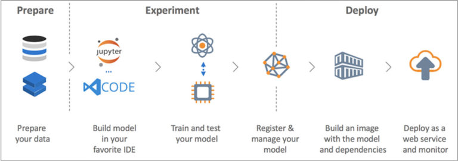

Далее – немного более детальная схема, особо обратим внимание на поддержку Python и отсутствие поддержки R. Дает нам информацию, каким образом все происходит.

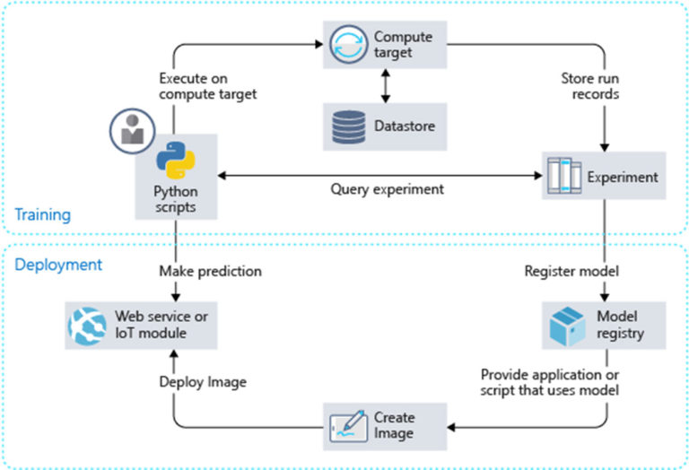

Заключительная часть – таксономия, на которой видны три ключевых составных блока: создание и расчет модели (слева), сбор данных о процессе расчета модели (центр), развертывание и поддержка развернутой модели. Остановимся на каждом ключевом блоке более подробно.

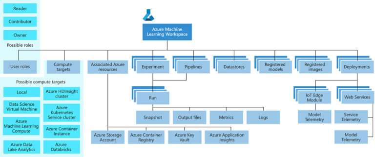

Работа начинается с создания учетной записи в Azure, если ее нет – то с помощью нехитрых комбинаций заводим учетную запись и заходим на [portal.azure.com](https://portal.azure.com/). Там выбираем Create a resource, затем кликаем Azure Machine learning service workspace. Выбираем подписку, создаем область и новую ресурсную группу.

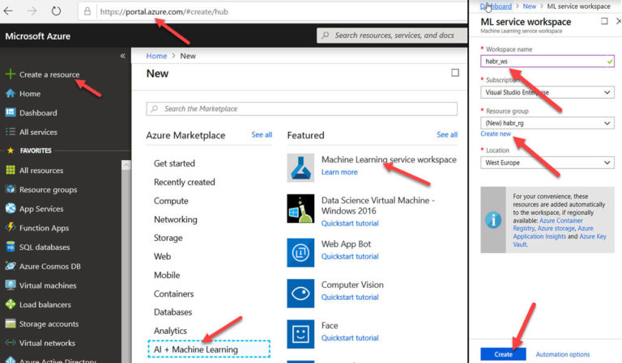

После нескольких минут работы облака мы получим на Dashboard следующий результат работы, и далее перейдем в Machine Learning service workspace.

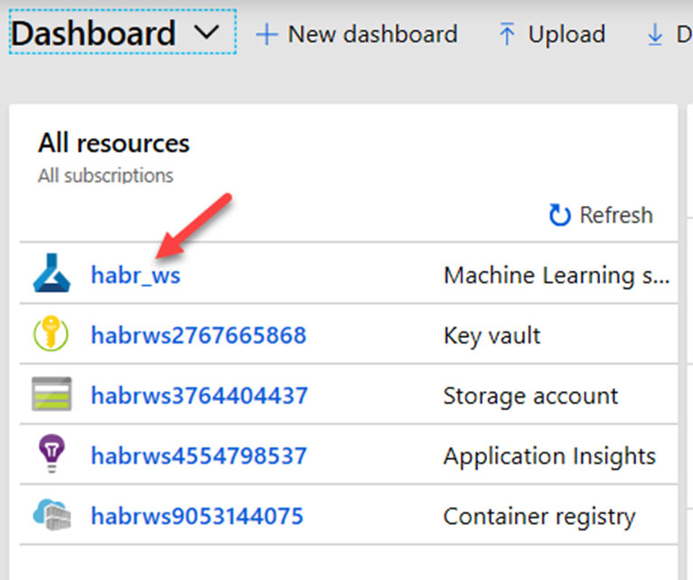

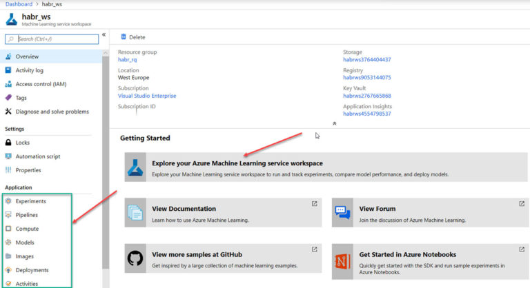

Выбираем Azure Machine Learning service workspace, там открываем Microsoft Azure Notebooks, где предлагается клонировать пример, соглашаемся, выбираем tutorial – в нем находится пример классификации изображений.

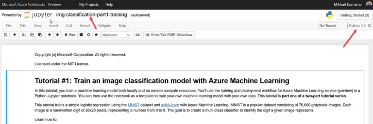

При запуске проверьте, выбрано ли ядро Python 3.6, и можете выполнить пример по шагам. Описание шагов примера не входит в статью.

Идея в общем в том, что используя браузер и стандартный Jupyter notebook c кодом на Python мы можем создать, рассчитать и сохранить модель. Есть и другой путь – используя Visual Studio Code, мы можем подключиться к нашей области и посмотреть свойства объектов, также писать там код, не забыв поставить плагин Azure ML. Попутно заметим, что как только мы стали использовать Visual Studio Code, мы автоматом получили нормальную IDE с контролем версий.

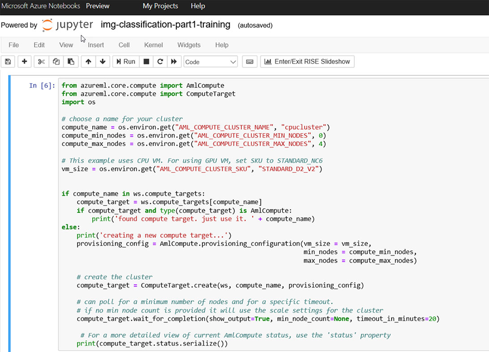

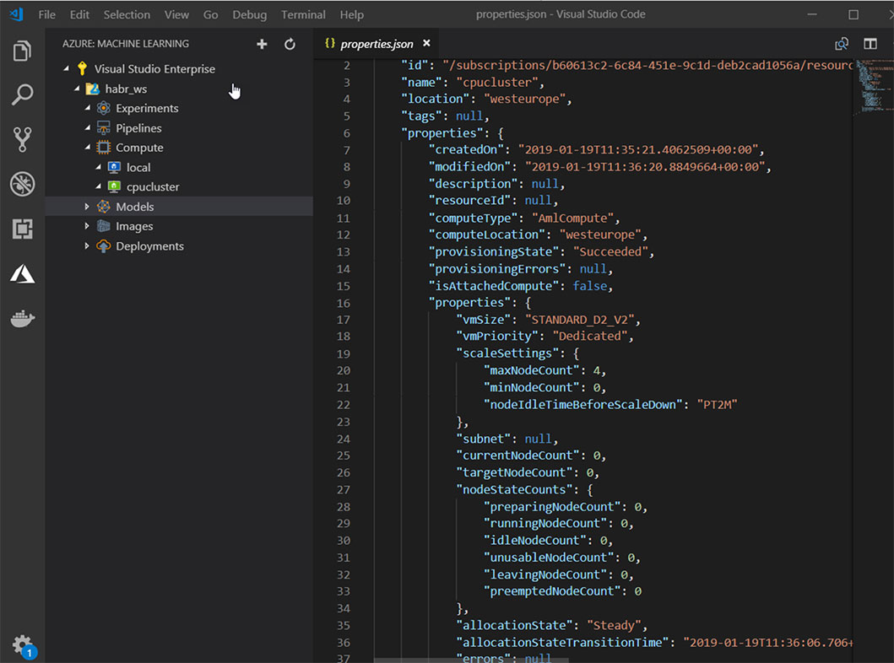

В завершение раздела обратим внимание на возможности выбора места для расчета и для развертывания моделей.

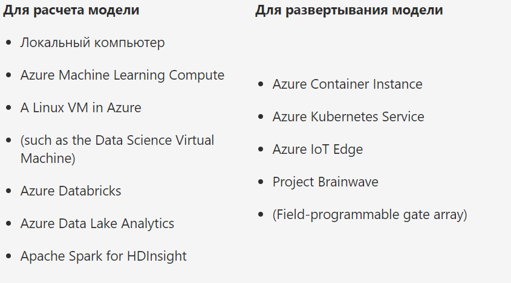

Наблюдение за процессом и развёртывание сервиса

Можно посмотреть раздел Experiments, где отображены параметры рассчитанной модели.

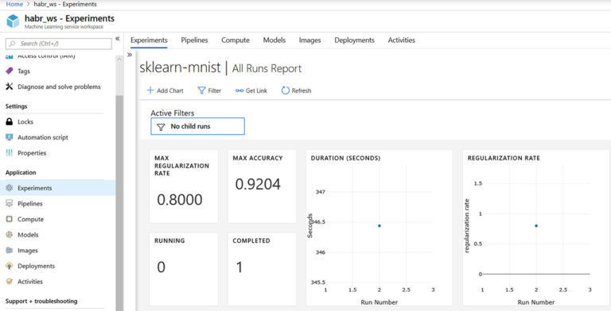

Для нас представляет интерес Image – Azure Container Instance, проще говоря, это

Docker-контейнер с нашей моделью, который находится в облаке.

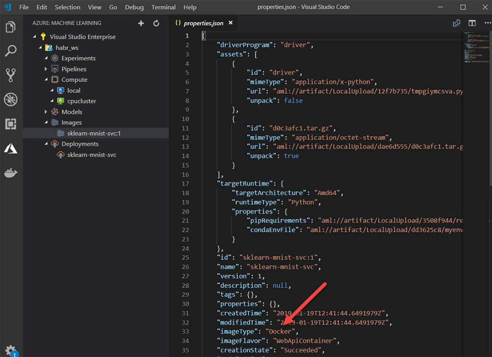

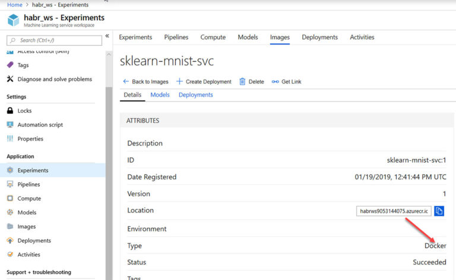

Процесс развертывания происходит из Visual Studio Code или Microsoft Azure Notebooks. По окончании развертывания сервиса, ядро которого составляет наш экземпляр контейнера с моделью, получаем следующую картину:

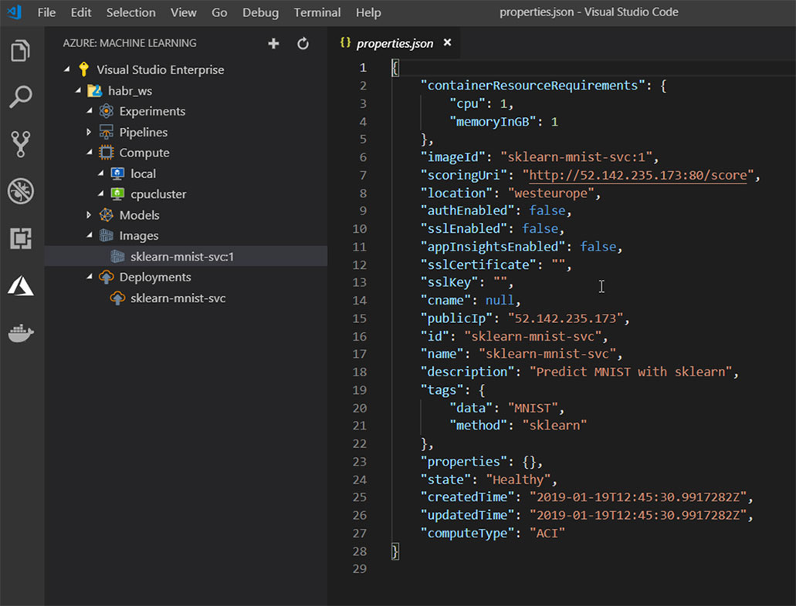

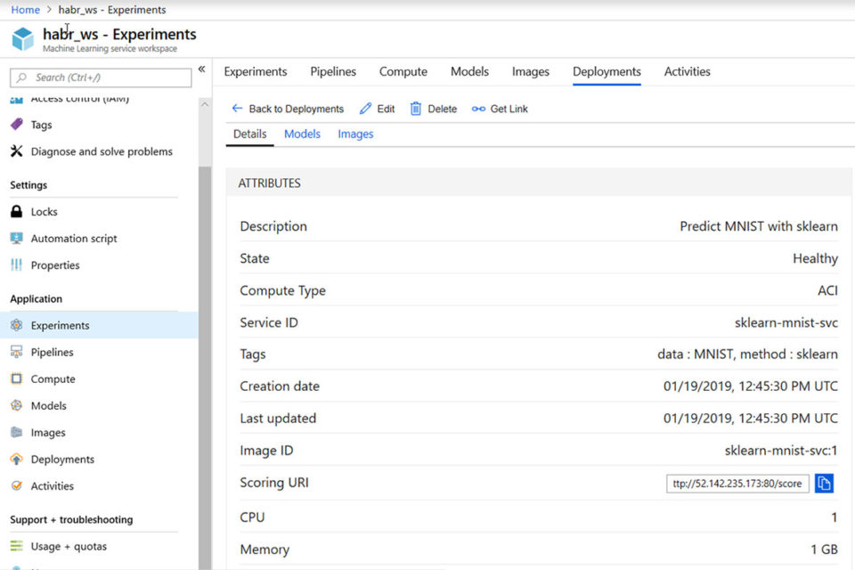

После завершения эксперимента не забудем удалить сервис и все выделенные ресурсы, чтобы не произошло автоматическое списание средств с вашей банковской карты. Проще удалить целиком созданную ресурсную группу.

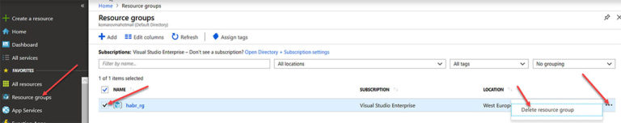

В итоге имеем решение масштаба предприятия, с возможностью автоматического расчета модели, развертывания и автоматического возвращения на предыдущую модель в случае неудовлетворительного результата метрик.

## Ресурсы:

[azure.microsoft.com/en-us/services/machine-learning-service](https://azure.microsoft.com/en-us/services/machine-learning-service/)

## Об авторе

Михаил Комаров, Microsoft MVP

Более 20 лет в ИТ-сфере. Интересы: виртуализация, инфраструктура, анализ данных и машинное обучение. Занимается поддержкой существующих и реализацией новых систем, направленных на повышение эффективности работы в корпоративном сегменте. Ранее работал тренером по информационным технологиям.