Нейронная сеть с использованием TensorFlow: классификация изображений

Привет, Хабр! Представляю вашему вниманию перевод статьи ["Train your first neural network: basic classification"](https://www.tensorflow.org/tutorials/keras/basic_classification).

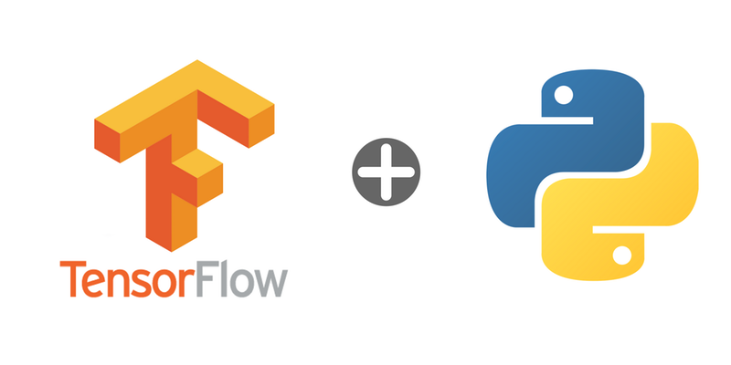

Это руководство по обучению модели нейронной сети для классификации изображений одежды, таких как кроссовки и рубашки. Для создания нейронной сети используем python и библиотеку TensorFlow.

### Установка TensorFlow

Для работы нам понадобятся следующие библиотеки:

  

1.  numpy (в командной строке пишем: pip install numpy)
2.  matplotlib (в командной строке пишем: pip install matplotlib)
3.  keras (в командной строке пишем: pip install keras)
4.  jupyter (в командной строке пишем: pip install jupyter)

С помощью pip: в командной строке пишем pip install tensorflow  
Если у вас возникает ошибка, то можно [скачать .whl файл](https://www.lfd.uci.edu/~gohlke/pythonlibs/#tensorflow) и установить с помощью pip: pip install путь_к_файлу\\название_файла.whl

[Официальное руководство по установке TensorFlow (на англ.)](https://www.tensorflow.org/install/)  
Запускаем Jupyter. Для запуска в командной строке пишем jupyter notebook.

  

### Начало работы

  

    
    import tensorflow as tf
    from tensorflow import keras
    import numpy as np
    import matplotlib.pyplot as plt

В этом руководстве используется набор данных Fashion MNIST, который содержит 70 000 изображений в оттенках серого в 10 категориях. На изображениях показаны отдельные предметы одежды с низким разрешением (28 на 28 пикселей):

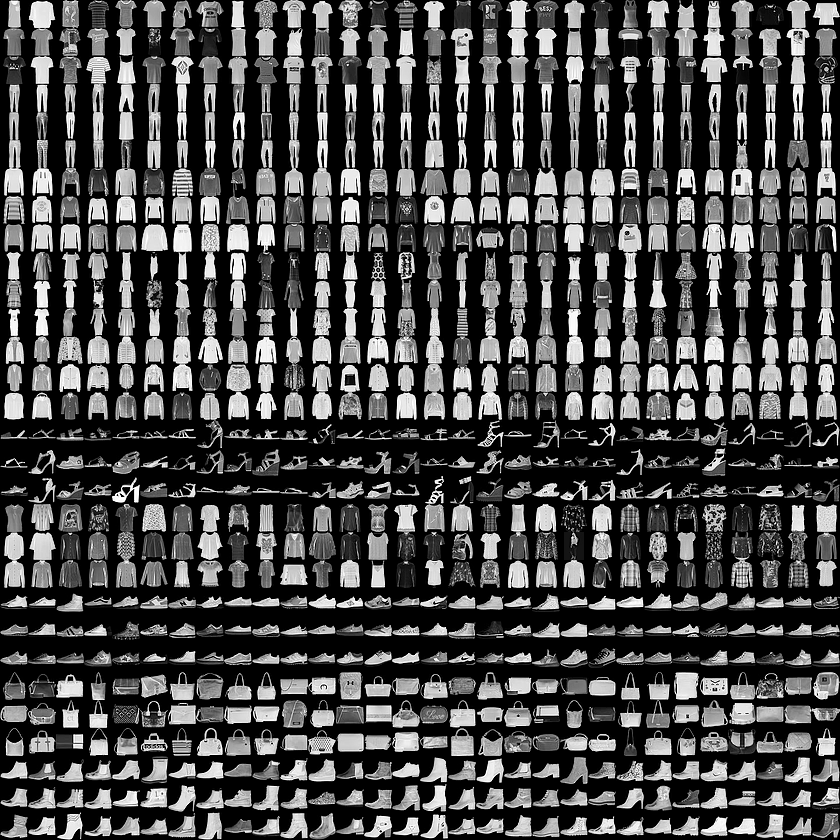

Мы будем использовать 60 000 изображений для обучения сети и 10 000 изображений, чтобы оценить, насколько точно сеть научилась классифицировать изображения. Вы можете получить доступ к Fashion MNIST непосредственно из TensorFlow, просто импортировав и загрузив данные:

  

    fashion_mnist = keras.datasets.fashion_mnist
    (train_images, train_labels), (test_images, test_labels) = fashion_mnist.load_data()

Загрузка набора данных возвращает четыре массива NumPy:

  

1.  Массивы train\_images и train\_labels — это данные, которые использует модель для обучения
2.  Массивы test\_images и test\_labels используются для тестирования модели

Изображения представляют собой NumPy массивы 28x28, значения пикселей которых находятся в диапазоне от 0 до 255. Метки (labels) представляют собой массив целых чисел от 0 до 9. Они соответствуют классу одежды:

  

|     |     |
| --- | --- |
| Метка | Класс |
| 0   | T-shirt (Футболка) |
| 1   | Trouser (Брюки) |
| 2   | Pullover (Свитер) |
| 3   | Dress (Платье) |
| 4   | Coat (Пальто) |
| 5   | Sandal (Сандали) |
| 6   | Shirt (Рубашка) |
| 7   | Sneaker (Кроссовки) |
| 8   | Bag (Сумка) |
| 9   | Ankle boot (Ботильоны) |

Имена классов не включены в набор данных, поэтому прописываем сами:

  

    class_names = ['T-shirt/top', 'Trouser', 'Pullover', 'Dress', 'Coat', 
                   'Sandal', 'Shirt', 'Sneaker', 'Bag', 'Ankle boot']

  

### Исследование данных

Рассмотрим формат набора данных перед обучением модели.

  

    train_images.shape 
    
    test_images.shape 
    
    len(train_labels) 
    
    len(test_labels) 
    
    train_labels 

  

### Предварительная обработка данных

Перед подготовкой модели данные должны быть предварительно обработаны. Если вы проверите первое изображение в тренировочном наборе, вы увидите, что значения пикселей находятся в диапазоне от 0 до 255:

  

    plt.figure()
    plt.imshow(train_images[0])
    plt.colorbar()
    plt.grid(False)

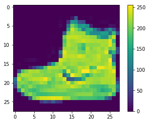

Мы масштабируем эти значения до диапазона от 0 до 1:

  

    train_images = train_images / 255.0
    test_images = test_images / 255.0

Отобразим первые 25 изображений из тренировочного набора и покажем имя класса под каждым изображением. Убедимся, что данные находятся в правильном формате.

  

    plt.figure(figsize=(10,10))
    for i in range(25):
        plt.subplot(5,5,i+1)
        plt.xticks([])
        plt.yticks([])
        plt.grid(False)
        plt.imshow(train_images[i], cmap=plt.cm.binary)
        plt.xlabel(class_names[train_labels[i]])

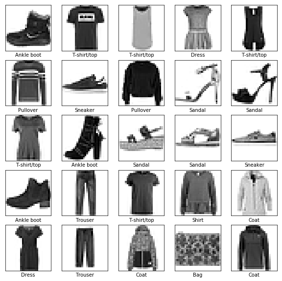

### Построение модели

Построение нейронной сети требует настройки слоев модели.

Основным строительным блоком нейронной сети является слой. Большая часть глубокого обучения состоит в объединении простых слоев. Большинство слоев, таких как tf.keras.layers.Dense, имеют параметры, которые изучаются во время обучения.

  

    model = keras.Sequential([
        keras.layers.Flatten(input_shape=(28, 28)),
        keras.layers.Dense(128, activation=tf.nn.relu),
        keras.layers.Dense(10, activation=tf.nn.softmax)
    ])

Первый слой в сети tf.keras.layers.Flatten преобразует формат изображений из 2d-массива (28 на 28 пикселей) в 1d-массив из 28 * 28 = 784 пикселей. У этого слоя нет параметров для изучения, он только переформатирует данные.

Следующие два слоя это tf.keras.layers.Dense. Это плотно связанные или полностью связанные нейронные слои. Первый слой Dense содержит 128 узлов (или нейронов). Второй (и последний) уровень — это слой с 10 узлами tf.nn.softmax, который возвращает массив из десяти вероятностных оценок, сумма которых равна 1. Каждый узел содержит оценку, которая указывает вероятность того, что текущее изображение принадлежит одному из 10 классов.

  

### Скомпилирование модели

Прежде чем модель будет готова к обучению, ей потребуется еще несколько настроек. Они добавляются во время этапа компиляции модели:

  

*   Loss function (функция потери) — измеряет насколько точная модель во время обучения
*   Optimizer (оптимизатор) — это то, как модель обновляется на основе данных, которые она видит, и функции потери
*   Metrics (метрики) — используется для контроля за этапами обучения и тестирования

  

    model.compile(optimizer=tf.train.AdamOptimizer(), 
                  loss='sparse_categorical_crossentropy',
                  metrics=['accuracy'])

  

### Обучение модели

Обучение модели нейронной сети требует следующих шагов:

  

1.  Подача данных обучения модели (в этом примере — массивы train\_images и train\_labels)
2.  Модель учится ассоциировать изображения и метки
3.  Мы просим модель сделать прогнозы о тестовом наборе (в этом примере — массив test\_images). Мы проверяем соответствие прогнозов меток из массива меток (в этом примере — массив test\_labels)

Чтобы начать обучение, вызовите метод model.fit:

  

    model.fit(train_images, train_labels, epochs=5)

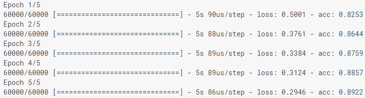

При моделировании модели отображаются показатели потерь (loss) и точности (acc). Эта модель достигает точности около 0,88 (или 88%) по данным обучения.

  

### Оценка точности

Сравним, как модель работает в тестовом наборе данных:

  

    test_loss, test_acc = model.evaluate(test_images, test_labels)
    print('Test accuracy:', test_acc)

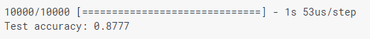

Оказывается, точность в тестовом наборе данных немного меньше точности в тренировочном наборе. Этот разрыв между точностью обучения и точностью тестирования является примером переобучения. Переобучение — это когда модель машинного обучения хуже работает с новыми данными, чем с данными обучения.

  

### Прогнозирование

Используем модель для прогнозирования некоторых изображений.

  

    predictions = model.predict(test_images)

Здесь модель предсказала метку для каждого изображения в тестовом наборе. Давайте посмотрим на первое предсказание:

  

    predictions[0]

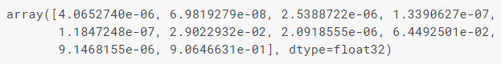

Предсказание представляет собой массив из 10 чисел. Они описывают «уверенность» модели в том, что изображение соответствует каждому из 10 разных предметов одежды. Мы можем видеть, какая метка имеет наибольшее доверительное значение:

  

    np.argmax(predictions[0]) 

Таким образом, модель наиболее уверенна в том, что это изображение — Ankle boot (Ботильоны), или class_names \[9\]. И мы можем проверить тестовую метку, чтобы убедиться, что это правильно:

  

    test_labels[0]  

Напишем функции для визуализации этих предсказаний

  

    def plot_image(i, predictions_array, true_label, img):
      predictions_array, true_label, img = predictions_array[i], true_label[i], img[i]
      plt.grid(False)
      plt.xticks([])
      plt.yticks([])
    
      plt.imshow(img, cmap=plt.cm.binary)
    
      predicted_label = np.argmax(predictions_array)
      if predicted_label == true_label:
        color = 'blue'
      else:
        color = 'red'
    
      plt.xlabel("{} {:2.0f}% ({})".format(class_names[predicted_label],
                                    100*np.max(predictions_array),
                                    class_names[true_label]),
                                    color=color)
    
    def plot_value_array(i, predictions_array, true_label):
      predictions_array, true_label = predictions_array[i], true_label[i]
      plt.grid(False)
      plt.xticks([])
      plt.yticks([])
      thisplot = plt.bar(range(10), predictions_array, color="#777777")
      plt.ylim([0, 1]) 
      predicted_label = np.argmax(predictions_array)
    
      thisplot[predicted_label].set_color('red')
      thisplot[true_label].set_color('blue')

Давайте посмотрим на 0-е изображение, предсказания и массив предсказаний.

  

    i = 0
    plt.figure(figsize=(6,3))
    plt.subplot(1,2,1)
    plot_image(i, predictions, test_labels, test_images)
    plt.subplot(1,2,2)
    plot_value_array(i, predictions,  test_labels)

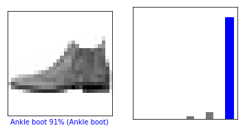

Построим несколько изображений с их прогнозами. Правильные метки прогноза — синие, а неправильные метки прогноза — красные. Обратите внимание, что это может быть неправильно, даже когда он очень уверен.

  

    num_rows = 5
    num_cols = 3
    num_images = num_rows*num_cols
    plt.figure(figsize=(2*2*num_cols, 2*num_rows))
    for i in range(num_images):
      plt.subplot(num_rows, 2*num_cols, 2*i+1)
      plot_image(i, predictions, test_labels, test_images)
      plt.subplot(num_rows, 2*num_cols, 2*i+2)
      plot_value_array(i, predictions, test_labels)

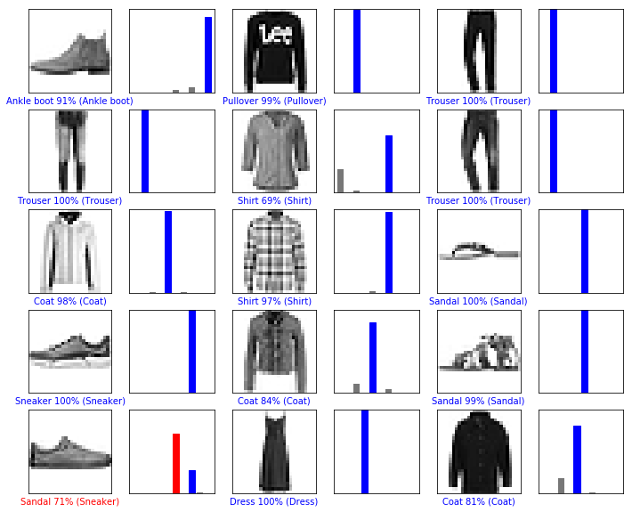

Наконец, используем обученную модель, чтобы сделать предсказание об одном изображении.

  

    
    img = test_images[0]

Модели tf.keras оптимизированы для того, чтобы делать прогнозы на пакеты (batch) или коллекции (collection). Поэтому, хотя мы используем одно изображение, нам нужно добавить его в список:

  

    
    img = (np.expand_dims (img, 0))

Прогноз для изображения:

  

    predictions_single = model.predict(img)
    print(predictions_single)

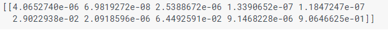

    plot_value_array(0, predictions_single, test_labels)
    _ = plt.xticks(range(10), class_names, rotation=45)

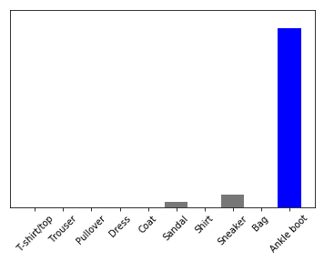

    np.argmax(predictions_single[0])

Как и прежде, модель предсказывает метку 9.

Если есть вопросы, пишите в комментариях или в личные сообщения.